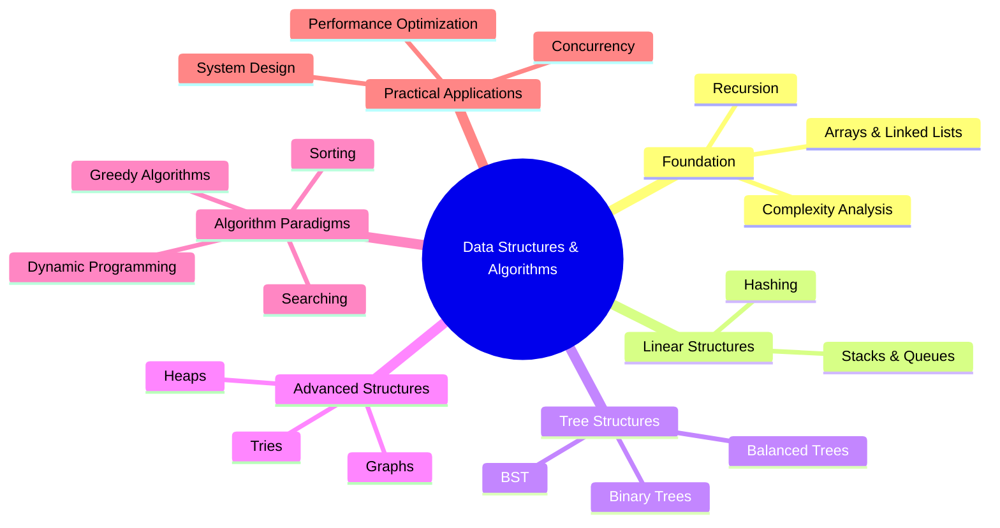
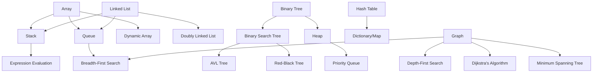
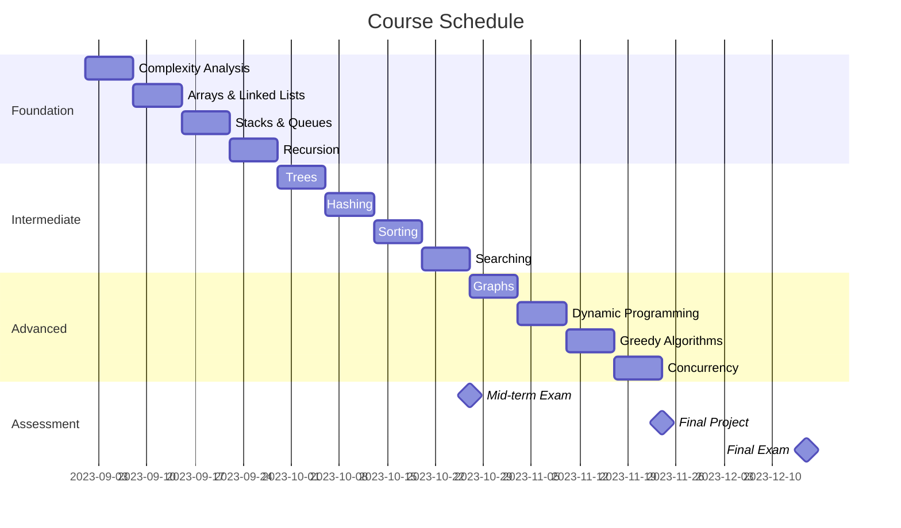

# Data Structures and Algorithms

[Back to Course Content](../README.md)

## 📚 Course Overview

This comprehensive module covers the fundamental data structures and algorithms that form the building blocks of computer science and software engineering. You'll learn not just the theoretical concepts but also their practical implementations, performance characteristics, and real-world applications.

### Why Study Data Structures and Algorithms?

- **Foundation of Computer Science**: They are the fundamental building blocks for solving computational problems
- **Performance Optimization**: Choose the right structure/algorithm to make your code orders of magnitude faster
- **Technical Interviews**: DSA knowledge is essential for landing positions at top tech companies
- **Problem-Solving Skills**: Develop a systematic approach to breaking down and solving complex problems
- **Software Architecture**: Design better, more efficient, and scalable systems

## 🎯 Learning Outcomes

By the end of this module, you will be able to:

1. **Implement and analyze** various data structures for different use cases
2. **Design and optimize** algorithms with appropriate time and space complexity
3. **Apply** the right data structures and algorithms to solve real-world problems 
4. **Evaluate tradeoffs** between different implementations based on performance requirements
5. **Develop efficient solutions** to complex computational problems
6. **Explain the inner workings** of advanced data structures and algorithms
7. **Critically analyze** existing implementations for potential optimizations

## 📑 Learning Paths

### Path 1: Fundamental Concepts (Weeks 1-4)
- [Complexity Analysis](complexity-analysis.md) → [Arrays and Linked Lists](arrays-and-linked-lists.md) → [Stacks and Queues](stacks-and-queues.md) → [Recursion](recursion.md)

### Path 2: Tree Structures (Weeks 5-6)
- [Trees](trees.md) → [Advanced Tree Structures](trees.md#advanced-tree-structures)

### Path 3: Algorithm Techniques (Weeks 7-9)
- [Searching](searching.md) → [Sorting](sorting.md) → [Hashing](hashing.md)

### Path 4: Advanced Topics (Weeks 10-12)
- [Graphs](graphs.md) → [Dynamic Programming](dynamic-programming.md) → [Greedy Algorithms](greedy-algorithms.md) → [Concurrency](concurrency.md)

## 📋 Course Structure

### Foundation

1. [Arrays and Linked Lists](arrays-and-linked-lists.md)
   - Sequential data storage structures
   - Static vs. dynamic memory allocation
   - Implementation and operations
   - Performance analysis and tradeoffs
   - Real-world applications
   
2. [Stacks and Queues](stacks-and-queues.md)
   - LIFO and FIFO principles
   - Implementation approaches (array-based vs. linked list-based)
   - Operations and applications
   - Variations (double-ended queues, priority queues)
   - Real-world use cases

3. [Trees](trees.md)
   - Hierarchical data structure concepts
   - Binary trees and binary search trees
   - Tree traversal algorithms
   - Self-balancing trees (AVL, Red-Black)
   - Advanced tree structures (B-trees, tries)

4. [Graphs](graphs.md)
   - Graph representations (adjacency matrix, adjacency list)
   - Graph traversal algorithms (BFS, DFS)
   - Shortest path algorithms (Dijkstra's, Bellman-Ford)
   - Minimum spanning trees (Kruskal's, Prim's)
   - Network flow and advanced graph algorithms

### Algorithms

5. [Sorting Algorithms](sorting.md)
   - Elementary sorting (Bubble, Insertion, Selection)
   - Efficient sorting (Merge, Quick, Heap, Radix)
   - Specialized sorting algorithms
   - Performance analysis and comparison
   - External sorting and sorting large datasets

6. [Searching Algorithms](searching.md)
   - Linear and binary search
   - Tree and graph-based searching
   - Advanced search techniques (interpolation, exponential)
   - Search in specialized data structures
   - Practical searching applications

7. [Complexity Analysis](complexity-analysis.md)
   - Asymptotic notation (Big O, Omega, Theta)
   - Time complexity analysis
   - Space complexity analysis
   - Amortized analysis
   - NP-completeness and computational limits

### Advanced Topics

8. [Hashing](hashing.md)
   - Hash function design principles
   - Collision resolution strategies
   - Hash table implementations
   - Open addressing vs. chaining
   - Modern hashing applications (Bloom filters, consistent hashing)

9. [Recursion](recursion.md)
   - Recursive problem-solving approach
   - Recursive data structures
   - Managing recursion depth and stack usage
   - Tail recursion optimization
   - Backtracking algorithms

10. [Dynamic Programming](dynamic-programming.md)
    - Memoization and tabulation techniques
    - State design and transition functions
    - Classical DP problems (Knapsack, LCS, etc.)
    - Space optimization techniques
    - Real-world DP applications

11. [Greedy Algorithms](greedy-algorithms.md)
    - Greedy approach fundamentals
    - Standard greedy algorithms
    - Correctness proofs
    - Comparison with dynamic programming
    - Applications and limitations

12. [Concurrency](concurrency.md)
    - Thread-safe data structures
    - Synchronization mechanisms
    - Lock-free algorithms
    - Concurrent data structure designs
    - Performance considerations in multi-threaded environments

## 🔄 Data Structure Relationships

## 📊 Algorithm Complexity Comparison

| Algorithm | Best Case | Average Case | Worst Case | Space Complexity |
|-----------|-----------|--------------|------------|------------------|
| **Sorting** |
| Bubble Sort | Ω(n) | Θ(n²) | O(n²) | O(1) |
| Insertion Sort | Ω(n) | Θ(n²) | O(n²) | O(1) |
| Selection Sort | Ω(n²) | Θ(n²) | O(n²) | O(1) |
| Merge Sort | Ω(n log n) | Θ(n log n) | O(n log n) | O(n) |
| Quick Sort | Ω(n log n) | Θ(n log n) | O(n²) | O(log n) |
| Heap Sort | Ω(n log n) | Θ(n log n) | O(n log n) | O(1) |
| **Searching** |
| Linear Search | Ω(1) | Θ(n) | O(n) | O(1) |
| Binary Search | Ω(1) | Θ(log n) | O(log n) | O(1) |
| **Graph** |
| BFS | - | O(V + E) | O(V + E) | O(V) |
| DFS | - | O(V + E) | O(V + E) | O(V) |
| Dijkstra's | - | O(E + V log V) | O(E + V log V) | O(V) |
| Prim's | - | O(E log V) | O(E log V) | O(V) |
| Kruskal's | - | O(E log V) | O(E log V) | O(V) |

## 📝 Assessment

### Continuous Assessment (50%)
- **Programming Assignments**: 25%
- **Quizzes**: 10%
- **Lab Work & Participation**: 15%

### Final Assessment (50%)
- **Mid-term Examination**: 20%
- **Final Project**: 10%
- **Final Examination**: 20%

## 🔍 Prerequisites

- **Programming Knowledge**: Proficiency in Java programming (syntax, OOP concepts)
- **Mathematics**: Basic discrete mathematics, propositional logic
- **Problem-Solving Skills**: Analytical thinking and algorithmic reasoning
- **Development Environment**: Familiarity with IDEs and debugging tools

## 📚 Reference Materials

### Primary Textbooks
- "Introduction to Algorithms" by Cormen, Leiserson, Rivest, and Stein (CLRS)
- "Data Structures and Algorithms in Java" by Robert Lafore
- "Algorithms" by Robert Sedgewick and Kevin Wayne
- "Cracking the Coding Interview" by Gayle Laakmann McDowell

### Online Resources
- [GeeksforGeeks](https://www.geeksforgeeks.org/) - Comprehensive articles and implementations
- [LeetCode](https://leetcode.com/) - Practice problems and discussions
- [Visualgo](https://visualgo.net/) - Algorithm visualizations
- [HackerRank](https://www.hackerrank.com/) - Programming challenges
- [MIT OpenCourseWare](https://ocw.mit.edu/courses/electrical-engineering-and-computer-science/6-006-introduction-to-algorithms-fall-2011/) - Lecture videos and materials

## 🛠️ Tools and Resources

### Development Environment
- Java Development Kit (JDK) 11 or higher
- IDE recommendations: IntelliJ IDEA, Eclipse, or Visual Studio Code
- Version control with Git and GitHub

### Visualization Tools
- [Algorithm Visualizer](https://algorithm-visualizer.org/)
- [Data Structure Visualizations](https://www.cs.usfca.edu/~galles/visualization/Algorithms.html)
- [VisuAlgo](https://visualgo.net/)

## 🌐 Real-world Applications

### Software Engineering
- **Database Systems**: Indexing, query optimization, storage structures
- **Operating Systems**: Process scheduling, memory management, file systems
- **Compiler Design**: Syntax trees, pattern matching, code optimization
- **Network Protocols**: Routing algorithms, load balancing, traffic management

### Data Science & AI
- **Machine Learning**: Optimization algorithms, clustering, decision trees
- **Big Data**: Distributed computing, MapReduce, stream processing
- **Computer Vision**: Image processing, pattern recognition, feature extraction
- **Natural Language Processing**: Text parsing, indexing, search optimization

### Web Development
- **Search Engines**: Ranking algorithms, indexing, query processing
- **Social Networks**: Connection algorithms, recommendation systems
- **E-commerce**: Product matching, recommendation engines, inventory management
- **Maps & Navigation**: Shortest path finding, traffic optimization

## 🚀 Getting Started

1. **Set up your development environment**
   - Install Java JDK 11+
   - Set up your preferred IDE
   - Clone the course repository from GitHub

2. **Review the foundations**
   - Start with complexity analysis to understand performance evaluation
   - Work through the basic data structures (arrays, linked lists)

3. **Practice implementation**
   - Implement each data structure from scratch
   - Run the provided test cases to verify correctness
   - Analyze performance characteristics

4. **Apply algorithms to problems**
   - Solve the recommended practice problems
   - Participate in weekly coding challenges
   - Review solutions and optimize your code

## 🤝 Support and Community

- **Weekly Office Hours**: Tuesday 2-4 PM, Thursday 3-5 PM
- **Discussion Forum**: Piazza for course-related Q&A
- **Code Review Sessions**: Peer review workshops on Fridays
- **Study Groups**: Form or join algorithm study groups through the course portal
- **Resource Library**: Additional readings, videos, and practice problems

## 🗺️ Module Roadmap

## 📌 Key Takeaways

- **Efficiency Matters**: Learn to evaluate and optimize the performance of your code
- **Choose Wisely**: Select the appropriate data structure based on the operations you need to perform
- **Tradeoffs Exist**: Understand that optimization often involves tradeoffs between time and space
- **Patterns Repeat**: Many complex problems can be solved using established algorithmic patterns
- **Practice is Essential**: Theoretical knowledge must be complemented with practical implementation

## 📞 Contact Information

- **Course Instructor**: Dr. Jane Smith (jsmith@university.edu)
- **Teaching Assistants**:
  - John Doe (jdoe@university.edu) - Sections A & B
  - Sarah Johnson (sjohnson@university.edu) - Sections C & D
- **Technical Support**: techsupport@university.edu 