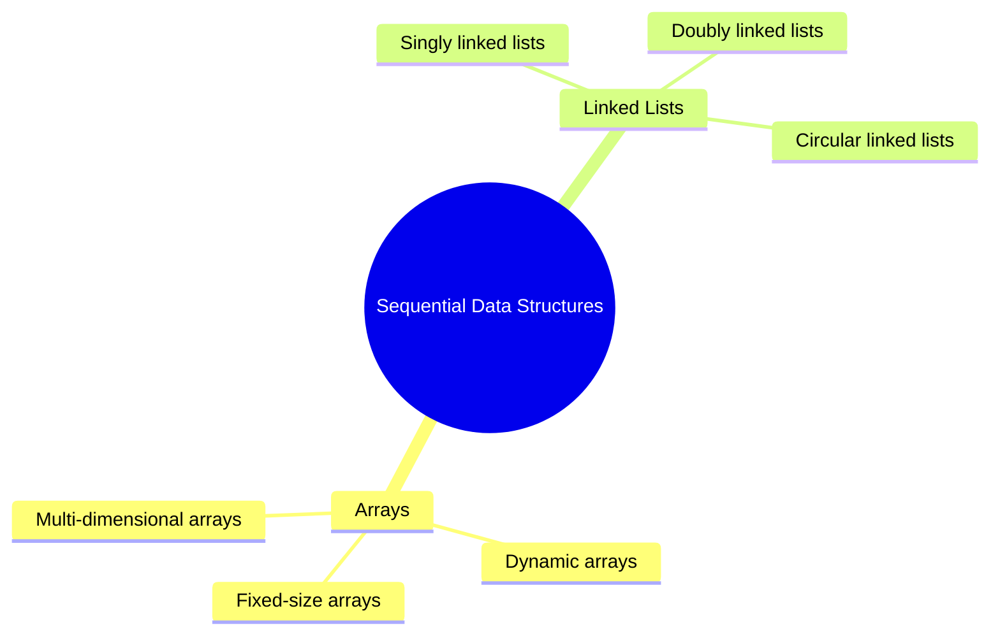

# Arrays and Linked Lists

[Back to Course Content](README.md) | [Next: Stacks and Queues →](stacks-and-queues.md)

> Reference: This content is based on Linked-lists.pdf

## What are Arrays and Linked Lists?

Arrays and Linked Lists are fundamental data structures used for storing and organizing data sequentially. They serve as the building blocks for many other data structures and algorithms.



## Arrays

### What is an Array?

An array is a fixed-size, contiguous block of memory that stores elements of the same type. It provides direct access to elements using an index.

#### Characteristics

- **Fixed Size**: Size is determined at declaration
- **Contiguous Memory**: Elements are stored in adjacent memory locations
- **Random Access**: O(1) access time for any element
- **Homogeneous**: All elements must be of the same type

### Array Operations

| Operation | Time Complexity | Description |
|-----------|----------------|-------------|
| Access | O(1) | Get element by index |
| Search | O(n) | Find element by value |
| Insert | O(n) | Insert at specific position |
| Delete | O(n) | Remove element |
| Append | O(1) | Add at end (if space available) |

### Java Implementation

```java
public class DynamicArray<T> {
    private T[] array;
    private int size;
    private static final int DEFAULT_CAPACITY = 10;

    public DynamicArray() {
        array = (T[]) new Object[DEFAULT_CAPACITY];
        size = 0;
    }

    public void add(T element) {
        if (size == array.length) {
            resize();
        }
        array[size++] = element;
    }

    public T get(int index) {
        if (index < 0 || index >= size) {
            throw new IndexOutOfBoundsException();
        }
        return array[index];
    }

    public void set(int index, T element) {
        if (index < 0 || index >= size) {
            throw new IndexOutOfBoundsException();
        }
        array[index] = element;
    }

    public void remove(int index) {
        if (index < 0 || index >= size) {
            throw new IndexOutOfBoundsException();
        }
        for (int i = index; i < size - 1; i++) {
            array[i] = array[i + 1];
        }
        array[--size] = null;
    }

    private void resize() {
        T[] newArray = (T[]) new Object[array.length * 2];
        System.arraycopy(array, 0, newArray, 0, size);
        array = newArray;
    }

    public int size() {
        return size;
    }
}
```

### Real-World Applications

1. **Image Processing**
   - Pixel data storage
   - Image manipulation
   - Color processing

2. **Database Systems**
   - Record storage
   - Index implementation
   - Buffer management

3. **Game Development**
   - Sprite arrays
   - Particle systems
   - Level data storage

## Linked Lists

### What is a Linked List?

A linked list is a linear data structure where elements are stored in nodes, and each node points to the next node in the sequence.

#### Types of Linked Lists

1. **Singly Linked List**
   - Each node has data and one pointer
   - Can only traverse forward

2. **Doubly Linked List**
   - Each node has data and two pointers
   - Can traverse both forward and backward

3. **Circular Linked List**
   - Last node points back to first node
   - Can be singly or doubly linked

### Linked List Operations

| Operation | Time Complexity | Description |
|-----------|----------------|-------------|
| Access | O(n) | Get element by position |
| Search | O(n) | Find element by value |
| Insert | O(1) | Insert at beginning/end |
| Delete | O(1) | Remove from beginning/end |
| Insert/Delete at position | O(n) | Insert/delete at specific position |

### Java Implementation

```java
public class SinglyLinkedList<T> {
    private static class Node<T> {
        T data;
        Node<T> next;

        Node(T data) {
            this.data = data;
            this.next = null;
        }
    }

    private Node<T> head;
    private int size;

    public SinglyLinkedList() {
        head = null;
        size = 0;
    }

    public void addFirst(T data) {
        Node<T> newNode = new Node<>(data);
        newNode.next = head;
        head = newNode;
        size++;
    }

    public void addLast(T data) {
        Node<T> newNode = new Node<>(data);
        if (head == null) {
            head = newNode;
        } else {
            Node<T> current = head;
            while (current.next != null) {
                current = current.next;
            }
            current.next = newNode;
        }
        size++;
    }

    public T removeFirst() {
        if (head == null) {
            throw new NoSuchElementException();
        }
        T data = head.data;
        head = head.next;
        size--;
        return data;
    }

    public T removeLast() {
        if (head == null || head.next == null) {
            return removeFirst();
        }
        Node<T> current = head;
        while (current.next.next != null) {
            current = current.next;
        }
        T data = current.next.data;
        current.next = null;
        size--;
        return data;
    }

    public T get(int index) {
        if (index < 0 || index >= size) {
            throw new IndexOutOfBoundsException();
        }
        Node<T> current = head;
        for (int i = 0; i < index; i++) {
            current = current.next;
        }
        return current.data;
    }

    public int size() {
        return size;
    }
}
```

### Real-World Applications

1. **Web Browsers**
   - Browser history
   - Back/forward navigation
   - Tab management

2. **Text Editors**
   - Undo/redo functionality
   - Text buffer management
   - Line representation

3. **Operating Systems**
   - Process scheduling
   - Memory management
   - File system organization

## Comparison of Arrays and Linked Lists

| Aspect | Array | Linked List |
|--------|-------|-------------|
| **Memory Allocation** | Contiguous | Non-contiguous |
| **Size** | Fixed | Dynamic |
| **Access Time** | O(1) | O(n) |
| **Insert/Delete at Beginning** | O(n) | O(1) |
| **Insert/Delete at End** | O(1) | O(n) |
| **Memory Usage** | Less overhead | More overhead |
| **Cache Utilization** | Better | Poor |
| **Random Access** | Yes | No |
| **Implementation Complexity** | Simple | Moderate |

## Common Operations and Their Implementations

### 1. Reversing a Linked List

```java
public void reverse() {
    Node<T> prev = null;
    Node<T> current = head;
    Node<T> next = null;

    while (current != null) {
        next = current.next;
        current.next = prev;
        prev = current;
        current = next;
    }

    head = prev;
}
```

### 2. Detecting Cycles

```java
public boolean hasCycle() {
    if (head == null || head.next == null) {
        return false;
    }

    Node<T> slow = head;
    Node<T> fast = head;

    while (fast != null && fast.next != null) {
        slow = slow.next;
        fast = fast.next.next;

        if (slow == fast) {
            return true;
        }
    }

    return false;
}
```

### 3. Finding Middle Element

```java
public T findMiddle() {
    if (head == null) {
        throw new NoSuchElementException();
    }

    Node<T> slow = head;
    Node<T> fast = head;

    while (fast != null && fast.next != null) {
        slow = slow.next;
        fast = fast.next.next;
    }

    return slow.data;
}
```

## Best Practices

1. **Array Best Practices**
   - Use dynamic arrays when size is unknown
   - Pre-allocate capacity when possible
   - Consider using ArrayList for dynamic arrays
   - Use System.arraycopy() for efficient copying

2. **Linked List Best Practices**
   - Maintain size counter
   - Handle edge cases (empty list, single node)
   - Use dummy nodes for simplification
   - Consider using sentinel nodes

## Common Pitfalls

1. **Array Pitfalls**
   - Index out of bounds errors
   - Fixed size limitations
   - Inefficient resizing
   - Memory fragmentation

2. **Linked List Pitfalls**
   - Memory leaks
   - Lost references
   - Infinite loops
   - Null pointer exceptions

## Performance Optimization

### Array Optimization

1. **Capacity Management**
   - Grow by factor of 2
   - Shrink when utilization is low
   - Pre-allocate when possible

2. **Memory Management**
   - Use primitive arrays when possible
   - Consider using Object arrays for generics
   - Implement proper cleanup

### Linked List Optimization

1. **Traversal Optimization**
   - Maintain tail pointer
   - Use doubly linked lists when needed
   - Cache frequently accessed nodes

2. **Memory Optimization**
   - Implement proper cleanup
   - Use weak references when appropriate
   - Consider memory pool for nodes

## Exercises

1. Implement a dynamic array with automatic resizing
2. Create a doubly linked list with all basic operations
3. Write a function to detect and remove cycles in a linked list
4. Implement a circular linked list with rotation operations
5. Create a function to merge two sorted linked lists

## Additional Resources

- [GeeksforGeeks - Arrays](https://www.geeksforgeeks.org/array-data-structure/)
- [GeeksforGeeks - Linked Lists](https://www.geeksforgeeks.org/data-structures/linked-list/)
- [Visualgo - Array](https://visualgo.net/en/array)
- [Visualgo - Linked List](https://visualgo.net/en/list) 