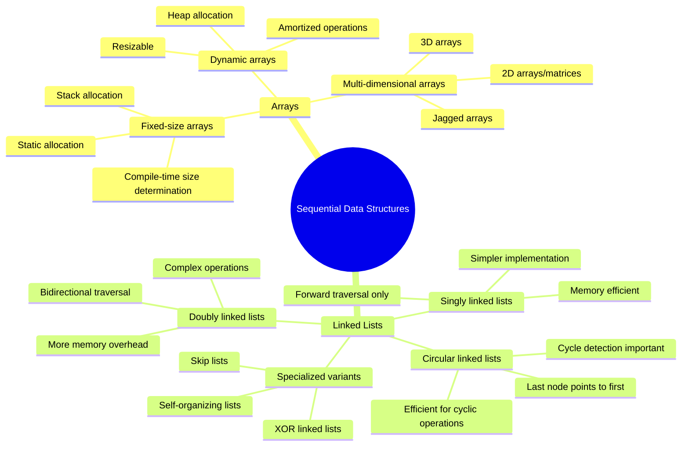
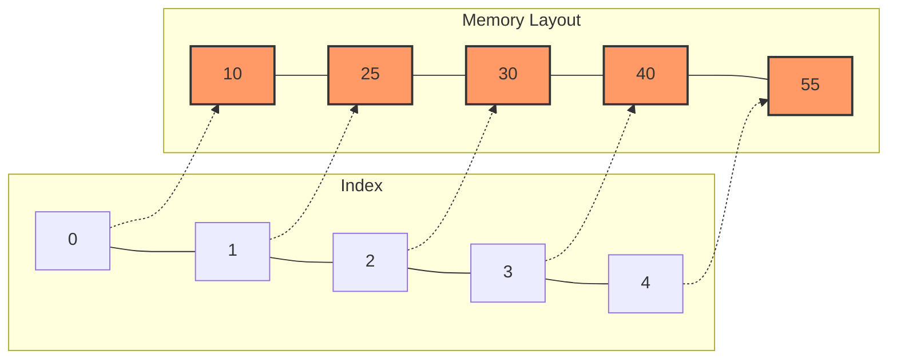
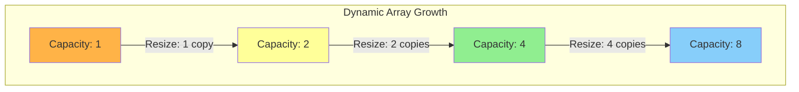
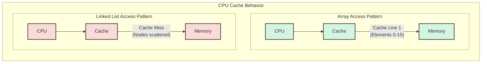
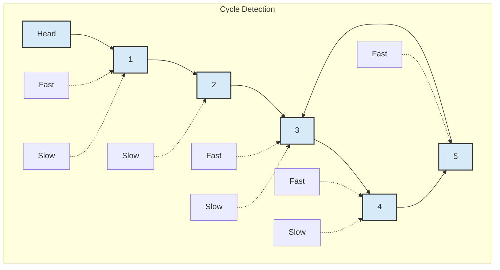

# Arrays and Linked Lists

[Back to Course Content](README.md) | [Next: Stacks and Queues →](stacks-and-queues.md)

> Reference: This content is based on Linked-lists.pdf

## What are Arrays and Linked Lists?

Arrays and Linked Lists are fundamental data structures used for storing and organizing data sequentially. They serve as the building blocks for many other data structures and algorithms, but differ significantly in their memory organization, performance characteristics, and use cases.

### Historical Context

Arrays are one of the oldest and most fundamental data structures in computer science, dating back to the earliest programming languages. Linked lists were introduced later to address some of the limitations of arrays, particularly the need for dynamic memory allocation.

### Memory Organization

```mermaid
graph TD
    subgraph "Array Memory Model"
        A1[Element 0] --> A2[Element 1]
        A2 --> A3[Element 2]
        A3 --> A4[Element 3]
        A4 --> A5[...]
    end
    
    subgraph "Linked List Memory Model"
        L1[Node 1] --> |next| L2[Node 2]
        L2 --> |next| L3[Node 3]
        L3 --> |next| L4[Node 4]
        L4 --> |next| L5[...]
    end
    
    style A1 fill:#f9f,stroke:#333,stroke-width:2px
    style A2 fill:#f9f,stroke:#333,stroke-width:2px
    style A3 fill:#f9f,stroke:#333,stroke-width:2px
    style A4 fill:#f9f,stroke:#333,stroke-width:2px
    style A5 fill:#f9f,stroke:#333,stroke-width:2px
    
    style L1 fill:#bbf,stroke:#333,stroke-width:2px
    style L2 fill:#bbf,stroke:#333,stroke-width:2px
    style L3 fill:#bbf,stroke:#333,stroke-width:2px
    style L4 fill:#bbf,stroke:#333,stroke-width:2px
    style L5 fill:#bbf,stroke:#333,stroke-width:2px
```





## Arrays

### What is an Array?

An array is a fixed-size, contiguous block of memory that stores elements of the same type. It provides direct access to elements using an index, which represents the offset from the beginning of the array.

#### Memory Representation



#### Address Calculation

For an array `arr` with base address `base_addr`, element size `elem_size`, and index `i`, the memory address of `arr[i]` is calculated as:

```
address of arr[i] = base_addr + (i * elem_size)
```

This constant-time address calculation enables O(1) random access, a distinctive feature of arrays.

#### Characteristics

- **Fixed Size**: Size is determined at declaration (static arrays) or allocation (dynamic arrays)
- **Contiguous Memory**: Elements are stored in adjacent memory locations
- **Random Access**: O(1) access time for any element via indexing
- **Homogeneous**: All elements must be of the same type
- **Cache-Friendly**: Sequential memory layout benefits from spatial locality
- **Direct Addressing**: Elements can be accessed directly via their index

### Types of Arrays

#### 1. Static Arrays

Static arrays have a fixed size that must be known at compile time. In many languages, they are allocated on the stack.

```java
// Java static array declaration
int[] numbers = new int[5];  // Array of 5 integers
```

```c
// C static array declaration
int numbers[5];  // Array of 5 integers
```

#### 2. Dynamic Arrays

Dynamic arrays can grow or shrink in size during program execution. They handle resizing operations automatically and are implemented using strategies like capacity doubling.

```java
// Java ArrayList (dynamic array)
ArrayList<Integer> numbers = new ArrayList<>();
numbers.add(10);  // Automatically grows as needed
```

```python
# Python list (dynamic array)
numbers = []
numbers.append(10)  // Automatically grows as needed
```

#### 3. Multi-dimensional Arrays

Multi-dimensional arrays represent tables, matrices, or higher-dimensional data structures.

```java
// 2D array in Java
int[][] matrix = new int[3][4];  // 3 rows, 4 columns
```

### Array Operations and Complexity

| Operation | Time Complexity | Space Complexity | Description |
|-----------|----------------|------------------|-------------|
| Access | O(1) | O(1) | Get element by index |
| Search (unsorted) | O(n) | O(1) | Find element by value |
| Search (sorted) | O(log n) | O(1) | Binary search |
| Insert at end (dynamic array) | O(1) amortized | O(1) | Add at end (may trigger resize) |
| Insert at position | O(n) | O(1) | Requires shifting elements |
| Delete from end | O(1) | O(1) | Remove last element |
| Delete from position | O(n) | O(1) | Requires shifting elements |
| Append | O(1) amortized | O(1) | Add at end (if space available) |
| Resize | O(n) | O(n) | Allocate new array and copy elements |

### Dynamic Array Implementation

Dynamic arrays automatically resize when they reach capacity, typically by doubling their size. This gives an amortized O(1) time complexity for insertions.

```java
public class DynamicArray<T> {
    private T[] array;
    private int size;
    private int capacity;
    private static final int DEFAULT_CAPACITY = 10;

    @SuppressWarnings("unchecked")
    public DynamicArray() {
        this.capacity = DEFAULT_CAPACITY;
        this.array = (T[]) new Object[capacity];
        this.size = 0;
    }

    public void add(T element) {
        ensureCapacity();
        array[size++] = element;
    }

    public void add(int index, T element) {
        if (index < 0 || index > size) {
            throw new IndexOutOfBoundsException("Index: " + index + ", Size: " + size);
        }
        
        ensureCapacity();
        
        // Shift elements to make space for new element
        for (int i = size; i > index; i--) {
            array[i] = array[i - 1];
        }
        
        array[index] = element;
        size++;
    }

    public T get(int index) {
        checkIndex(index);
        return array[index];
    }

    public void set(int index, T element) {
        checkIndex(index);
        array[index] = element;
    }

    public T remove(int index) {
        checkIndex(index);
        
        T removedElement = array[index];
        
        // Shift elements to remove the gap
        for (int i = index; i < size - 1; i++) {
            array[i] = array[i + 1];
        }
        
        array[--size] = null; // Clear reference for garbage collection
        
        // Shrink array if it's less than 1/4 full
        if (size > 0 && size == capacity / 4) {
            shrink();
        }
        
        return removedElement;
    }

    @SuppressWarnings("unchecked")
    private void ensureCapacity() {
        if (size == capacity) {
            capacity *= 2;
            T[] newArray = (T[]) new Object[capacity];
            System.arraycopy(array, 0, newArray, 0, size);
            array = newArray;
        }
    }

    @SuppressWarnings("unchecked")
    private void shrink() {
        capacity /= 2;
        T[] newArray = (T[]) new Object[capacity];
        System.arraycopy(array, 0, newArray, 0, size);
        array = newArray;
    }

    private void checkIndex(int index) {
        if (index < 0 || index >= size) {
            throw new IndexOutOfBoundsException("Index: " + index + ", Size: " + size);
        }
    }

    public int size() {
        return size;
    }
    
    public boolean isEmpty() {
        return size == 0;
    }
    
    public void clear() {
        for (int i = 0; i < size; i++) {
            array[i] = null;
        }
        size = 0;
    }
    
    public boolean contains(T element) {
        return indexOf(element) >= 0;
    }
    
    public int indexOf(T element) {
        for (int i = 0; i < size; i++) {
            if (element == null ? array[i] == null : element.equals(array[i])) {
                return i;
            }
        }
        return -1;
    }
    
    @Override
    public String toString() {
        StringBuilder sb = new StringBuilder("[");
        for (int i = 0; i < size; i++) {
            sb.append(array[i]);
            if (i < size - 1) {
                sb.append(", ");
            }
        }
        sb.append("]");
        return sb.toString();
    }
}
```

#### Amortized Analysis

The resizing operation in dynamic arrays happens infrequently, and its cost is "amortized" over many operations:

1. When an array of size n is full, we allocate a new array of size 2n
2. The cost of copying n elements is O(n)
3. After resizing, we can add n more elements before another resize
4. Amortizing the O(n) cost over n operations gives O(1) per operation



### Real-World Applications

1. **Image Processing**
   - **Pixel Matrices**: Images are stored as 2D arrays of pixel values
   - **Convolution Operations**: Filtering operations use 2D arrays for kernels
   - **Histograms**: 1D arrays store frequency distributions of pixel intensities

2. **Database Systems**
   - **Column-Oriented Storage**: Arrays optimize for analytics by storing column data contiguously
   - **Bitmap Indices**: Arrays of bits represent presence/absence of values
   - **Vector Processing**: SIMD operations on arrays accelerate query processing

3. **Scientific Computing**
   - **Matrices for Linear Algebra**: Array-based representations for matrices and vectors
   - **Fast Fourier Transforms**: Efficiently process array-based signals
   - **N-body Simulations**: Position and velocity arrays track particle systems

4. **Game Development**
   - **Sprite Rendering**: Arrays of sprites for efficient batch rendering
   - **Collision Detection**: Spatial partitioning using arrays
   - **Animation Frames**: Sequential arrays of frames or transformation matrices

5. **Genomics and Bioinformatics**
   - **DNA Sequence Storage**: Arrays of nucleotides
   - **Alignment Matrices**: Dynamic programming tables for sequence alignment
   - **Read Coverage Maps**: Arrays tracking sequencing read depth

## Linked Lists

### What is a Linked List?

A linked list is a linear data structure where elements (nodes) are stored at non-contiguous memory locations. Each node contains data and one or more references (or pointers) to other nodes, forming a sequence.

#### Memory Representation

```mermaid
graph LR
    subgraph "Singly Linked List"
        direction LR
        A[Head] --> B[Node 1|Data: 10]
        B --> C[Node 2|Data: 20]
        C --> D[Node 3|Data: 30]
        D --> E[NULL]
    end
    
    style A fill:#85C1E9,stroke:#333,stroke-width:2px
    style B fill:#85C1E9,stroke:#333,stroke-width:2px
    style C fill:#85C1E9,stroke:#333,stroke-width:2px
    style D fill:#85C1E9,stroke:#333,stroke-width:2px
    style E fill:#FFC300,stroke:#333,stroke-width:2px
```

#### Characteristics

- **Dynamic Size**: Grows and shrinks at runtime without reallocation
- **Non-Contiguous Memory**: Nodes can be scattered throughout memory
- **Sequential Access**: Requires traversal from the beginning to access elements
- **No Random Access**: Cannot directly access the nth element without traversal
- **Efficient Insertions/Deletions**: Can be done in O(1) time with proper references
- **Extra Memory Overhead**: Each node requires additional space for pointers
- **No Capacity Limit**: Can grow as long as memory is available

### Types of Linked Lists

#### 1. Singly Linked List

In a singly linked list, each node points to the next node in the sequence. The last node points to null.

```mermaid
graph LR
    subgraph "Singly Linked List"
        direction LR
        A[Head] --> N1[Data: 10|Next]
        N1 --> N2[Data: 20|Next]
        N2 --> N3[Data: 30|Next]
        N3 --> Null[NULL]
    end
    
    style A fill:#AED6F1,stroke:#333,stroke-width:2px
    style N1 fill:#AED6F1,stroke:#333,stroke-width:2px
    style N2 fill:#AED6F1,stroke:#333,stroke-width:2px
    style N3 fill:#AED6F1,stroke:#333,stroke-width:2px
    style Null fill:#F9E79F,stroke:#333,stroke-width:2px
```

#### 2. Doubly Linked List

In a doubly linked list, each node has references to both the next and the previous nodes.

```mermaid
graph LR
    subgraph "Doubly Linked List"
        direction LR
        Head[Head] --> N1[Prev|Data: 10|Next]
        N1 --> N2[Prev|Data: 20|Next]
        N2 --> N3[Prev|Data: 30|Next]
        N3 --> Null[NULL]
        
        Null2[NULL] --> N1
        N1 --> Head
        N2 --> N1
        N3 --> N2
    end
    
    style Head fill:#82E0AA,stroke:#333,stroke-width:2px
    style N1 fill:#82E0AA,stroke:#333,stroke-width:2px
    style N2 fill:#82E0AA,stroke:#333,stroke-width:2px
    style N3 fill:#82E0AA,stroke:#333,stroke-width:2px
    style Null fill:#F9E79F,stroke:#333,stroke-width:2px
    style Null2 fill:#F9E79F,stroke:#333,stroke-width:2px
```

#### 3. Circular Linked List

In a circular linked list, the last node points back to the first node, creating a cycle.

```mermaid
graph LR
    subgraph "Circular Linked List"
        direction LR
        Head[Head] --> N1[Data: 10|Next]
        N1 --> N2[Data: 20|Next]
        N2 --> N3[Data: 30|Next]
        N3 --> N1
    end
    
    style Head fill:#F1948A,stroke:#333,stroke-width:2px
    style N1 fill:#F1948A,stroke:#333,stroke-width:2px
    style N2 fill:#F1948A,stroke:#333,stroke-width:2px
    style N3 fill:#F1948A,stroke:#333,stroke-width:2px
```

### Linked List Operations and Complexity

| Operation | Singly Linked | Doubly Linked | Description |
|-----------|---------------|---------------|-------------|
| Access | O(n) | O(n) | Find element at position |
| Search | O(n) | O(n) | Find element by value |
| Insert at beginning | O(1) | O(1) | Add at head |
| Insert at end (with tail) | O(1) | O(1) | Add at tail |
| Insert at position | O(n) | O(n) | Find position then insert |
| Delete from beginning | O(1) | O(1) | Remove head |
| Delete from end | O(n) | O(1) | Remove tail |
| Delete from position | O(n) | O(n) | Find position then delete |

### Singly Linked List Implementation

```java
public class SinglyLinkedList<T> {
    private static class Node<T> {
        T data;
        Node<T> next;

        Node(T data) {
            this.data = data;
            this.next = null;
        }
    }

    private Node<T> head;
    private Node<T> tail;  // Maintaining tail for O(1) insertions at the end
    private int size;

    public SinglyLinkedList() {
        head = null;
        tail = null;
        size = 0;
    }

    public void addFirst(T data) {
        Node<T> newNode = new Node<>(data);
        if (isEmpty()) {
            head = newNode;
            tail = newNode;
        } else {
            newNode.next = head;
            head = newNode;
        }
        size++;
    }

    public void addLast(T data) {
        Node<T> newNode = new Node<>(data);
        if (isEmpty()) {
            head = newNode;
            tail = newNode;
        } else {
            tail.next = newNode;
            tail = newNode;
        }
        size++;
    }

    public void add(int index, T data) {
        if (index < 0 || index > size) {
            throw new IndexOutOfBoundsException("Index: " + index + ", Size: " + size);
        }
        
        if (index == 0) {
            addFirst(data);
            return;
        }
        
        if (index == size) {
            addLast(data);
            return;
        }
        
        Node<T> current = head;
        for (int i = 0; i < index - 1; i++) {
            current = current.next;
        }
        
        Node<T> newNode = new Node<>(data);
        newNode.next = current.next;
        current.next = newNode;
        size++;
    }

    public T removeFirst() {
        if (isEmpty()) {
            throw new NoSuchElementException("List is empty");
        }
        
        T removedData = head.data;
        
        if (head == tail) {
            // Only one element in the list
            head = null;
            tail = null;
        } else {
            head = head.next;
        }
        
        size--;
        return removedData;
    }

    public T removeLast() {
        if (isEmpty()) {
            throw new NoSuchElementException("List is empty");
        }
        
        T removedData = tail.data;
        
        if (head == tail) {
            // Only one element in the list
            head = null;
            tail = null;
        } else {
            // Find the second-to-last node
            Node<T> current = head;
            while (current.next != tail) {
                current = current.next;
            }
            
            current.next = null;
            tail = current;
        }
        
        size--;
        return removedData;
    }

    public T remove(int index) {
        if (index < 0 || index >= size) {
            throw new IndexOutOfBoundsException("Index: " + index + ", Size: " + size);
        }
        
        if (index == 0) {
            return removeFirst();
        }
        
        if (index == size - 1) {
            return removeLast();
        }
        
        Node<T> current = head;
        for (int i = 0; i < index - 1; i++) {
            current = current.next;
        }
        
        T removedData = current.next.data;
        current.next = current.next.next;
        size--;
        
        return removedData;
    }

    public T get(int index) {
        if (index < 0 || index >= size) {
            throw new IndexOutOfBoundsException("Index: " + index + ", Size: " + size);
        }
        
        if (index == 0) {
            return head.data;
        }
        
        if (index == size - 1) {
            return tail.data;
        }
        
        Node<T> current = head;
        for (int i = 0; i < index; i++) {
            current = current.next;
        }
        
        return current.data;
    }

    public void set(int index, T data) {
        if (index < 0 || index >= size) {
            throw new IndexOutOfBoundsException("Index: " + index + ", Size: " + size);
        }
        
        if (index == 0) {
            head.data = data;
            return;
        }
        
        if (index == size - 1) {
            tail.data = data;
            return;
        }
        
        Node<T> current = head;
        for (int i = 0; i < index; i++) {
            current = current.next;
        }
        
        current.data = data;
    }

    public int indexOf(T data) {
        Node<T> current = head;
        int index = 0;
        
        while (current != null) {
            if ((data == null && current.data == null) || 
                (data != null && data.equals(current.data))) {
                return index;
            }
            current = current.next;
            index++;
        }
        
        return -1;  // Element not found
    }

    public boolean contains(T data) {
        return indexOf(data) != -1;
    }

    public void clear() {
        head = null;
        tail = null;
        size = 0;
    }

    public boolean isEmpty() {
        return size == 0;
    }

    public int size() {
        return size;
    }
    
    @Override
    public String toString() {
        StringBuilder sb = new StringBuilder("[");
        Node<T> current = head;
        
        while (current != null) {
            sb.append(current.data);
            if (current.next != null) {
                sb.append(", ");
            }
            current = current.next;
        }
        
        sb.append("]");
        return sb.toString();
    }
}
```

### Doubly Linked List Implementation

```java
public class DoublyLinkedList<T> {
    private static class Node<T> {
        T data;
        Node<T> prev;
        Node<T> next;

        Node(T data) {
            this.data = data;
            this.prev = null;
            this.next = null;
        }
    }

    private Node<T> head;
    private Node<T> tail;
    private int size;

    public DoublyLinkedList() {
        head = null;
        tail = null;
        size = 0;
    }

    public void addFirst(T data) {
        Node<T> newNode = new Node<>(data);
        if (isEmpty()) {
            head = newNode;
            tail = newNode;
        } else {
            newNode.next = head;
            head.prev = newNode;
            head = newNode;
        }
        size++;
    }

    public void addLast(T data) {
        Node<T> newNode = new Node<>(data);
        if (isEmpty()) {
            head = newNode;
            tail = newNode;
        } else {
            tail.next = newNode;
            newNode.prev = tail;
            tail = newNode;
        }
        size++;
    }

    public T removeFirst() {
        if (isEmpty()) {
            throw new NoSuchElementException("List is empty");
        }
        
        T removedData = head.data;
        
        if (head == tail) {
            // Only one element in the list
            head = null;
            tail = null;
        } else {
            head = head.next;
            head.prev = null;
        }
        
        size--;
        return removedData;
    }

    public T removeLast() {
        if (isEmpty()) {
            throw new NoSuchElementException("List is empty");
        }
        
        T removedData = tail.data;
        
        if (head == tail) {
            // Only one element in the list
            head = null;
            tail = null;
        } else {
            tail = tail.prev;
            tail.next = null;
        }
        
        size--;
        return removedData;
    }

    public T get(int index) {
        if (index < 0 || index >= size) {
            throw new IndexOutOfBoundsException("Index: " + index + ", Size: " + size);
        }
        
        Node<T> current;
        
        // Optimize traversal by starting from head or tail
        if (index < size / 2) {
            current = head;
            for (int i = 0; i < index; i++) {
                current = current.next;
            }
        } else {
            current = tail;
            for (int i = size - 1; i > index; i--) {
                current = current.prev;
            }
        }
        
        return current.data;
    }

    public boolean isEmpty() {
        return size == 0;
    }

    public int size() {
        return size;
    }
}
```

### Real-World Applications

1. **Web Browsers**
   - **Browser History**: Doubly linked lists for back/forward navigation
   - **DOM Implementation**: Parent-child relationships in HTML trees
   - **Cache Management**: LRU caches using linked lists

2. **Operating Systems**
   - **Process Scheduling**: Lists maintain queues of processes
   - **Memory Management**: Free memory blocks tracked in linked lists
   - **File Systems**: Directory structures implemented as linked lists

3. **Music Players**
   - **Playlist Management**: Songs linked in play order
   - **Shuffle Functionality**: Efficient reordering without copying
   - **Previous/Next Navigation**: Doubly linked lists for bidirectional movement

4. **Text Editors**
   - **Text Buffer**: Piece tables or gap buffers using linked structures
   - **Undo/Redo Functionality**: Command history in linked lists
   - **Line Editing**: Text lines as nodes for efficient insertions/deletions

5. **Graph Implementations**
   - **Adjacency Lists**: Linked lists represent graph connections
   - **Breadth-First Search**: Queue implementations
   - **Depth-First Search**: Stack implementations

## Comparison of Arrays and Linked Lists

When choosing between arrays and linked lists, understanding their fundamental differences is crucial for selecting the right data structure for your specific use case.

### Performance Comparison

```mermaid
graph TD
    subgraph "Performance Comparison"
        direction LR
        
        subgraph "Arrays"
            A1[Random Access: O(1)]
            A2[Insert/Delete at End: O(1)*]
            A3[Insert/Delete in Middle: O(n)]
            A4[Memory Usage: Low Overhead]
            A5[Cache Performance: Excellent]
        end
        
        subgraph "Linked Lists"
            L1[Random Access: O(n)]
            L2[Insert/Delete at End: O(1)**]
            L3[Insert/Delete in Middle: O(1)***]
            L4[Memory Usage: Higher Overhead]
            L5[Cache Performance: Poor]
        end
    end
    
    style A1 fill:#AED6F1,stroke:#333,stroke-width:2px
    style A2 fill:#AED6F1,stroke:#333,stroke-width:2px
    style A3 fill:#AED6F1,stroke:#333,stroke-width:2px
    style A4 fill:#AED6F1,stroke:#333,stroke-width:2px
    style A5 fill:#AED6F1,stroke:#333,stroke-width:2px
    
    style L1 fill:#F5B7B1,stroke:#333,stroke-width:2px
    style L2 fill:#F5B7B1,stroke:#333,stroke-width:2px
    style L3 fill:#F5B7B1,stroke:#333,stroke-width:2px
    style L4 fill:#F5B7B1,stroke:#333,stroke-width:2px
    style L5 fill:#F5B7B1,stroke:#333,stroke-width:2px
```

\* Amortized time for dynamic arrays
\** With a tail pointer
\*** After reaching the position; finding the position still takes O(n)

### Detailed Comparison Table

| Aspect | Arrays | Linked Lists |
|--------|-------|-------------|
| **Memory Allocation** | Contiguous block | Scattered nodes |
| **Size** | Fixed (static) or Dynamic (resizable) | Dynamic |
| **Element Access** | Direct via index - O(1) | Sequential traversal - O(n) |
| **Memory Efficiency** | Better (no pointers) | Worse (extra space for pointers) |
| **Insertion/Deletion at Beginning** | O(n) - Shift required | O(1) - Change head pointer |
| **Insertion/Deletion at End** | O(1) amortized (dynamic array with capacity) | O(1) with tail pointer, O(n) without |
| **Insertion/Deletion in Middle** | O(n) - Shift required | O(1) after reaching position, O(n) to find position |
| **Memory Overhead** | Low (just the array) | High (additional pointers) |
| **Cache Performance** | Better (spatial locality) | Worse (random memory access) |
| **Implementation Complexity** | Simpler | More complex |
| **Ease of Resizing** | Requires reallocation | Natural growth |
| **Random Access** | Yes | No |
| **Search Performance** | O(n) unsorted, O(log n) sorted | O(n) |
| **Reordering Elements** | Expensive (move data) | Cheap (change pointers) |
| **Fragmentation Risk** | Low | High |
| **Use Case Suitability** | Random access, fixed size, cache performance | Frequent insertion/deletion, unknown size |

### Memory Usage and CPU Cache Considerations

#### Memory Overhead

For n elements of data size d:
- **Array**: Approximately n × d bytes
- **Singly Linked List**: Approximately n × (d + pointer_size) bytes
- **Doubly Linked List**: Approximately n × (d + 2 × pointer_size) bytes

On a 64-bit system where pointer_size = 8 bytes, storing 1000 integers (4 bytes each):
- **Array**: 4,000 bytes
- **Singly Linked List**: 12,000 bytes
- **Doubly Linked List**: 20,000 bytes

#### Cache Performance



Arrays benefit from spatial locality. When one element is accessed, neighboring elements are loaded into the cache, making subsequent accesses faster.

Linked list nodes may be scattered across memory, leading to more cache misses and slower performance despite favorable algorithmic complexity in some cases.

### When to Use Arrays vs. Linked Lists

#### Use Arrays When:

1. You need frequent random access to elements
2. You know the size in advance or have an upper bound
3. Memory efficiency is critical
4. You're performing many operations on all elements sequentially
5. Cache performance is important
6. You're implementing a stack with maximum size constraints
7. You need to sort frequently
8. The size of the collection changes infrequently

#### Use Linked Lists When:

1. You need frequent insertion and deletion from the middle
2. The size of the collection is unknown or changes frequently
3. You don't need random access to elements
4. Memory allocation/deallocation is expensive
5. You're implementing a queue or deque
6. You need to combine lists efficiently
7. You're implementing features like LRU caches
8. You need efficient implementation of certain algorithms (e.g., polynomial addition)

## Common Operations and Their Implementations

### 1. Traversal and Iteration

#### Array Traversal

```java
// Array traversal
public static <T> void traverseArray(T[] array) {
    for (int i = 0; i < array.length; i++) {
        System.out.println("Element at index " + i + ": " + array[i]);
    }
}

// Using enhanced for loop
public static <T> void traverseArrayEnhanced(T[] array) {
    for (T element : array) {
        System.out.println("Element: " + element);
    }
}
```

#### Linked List Traversal

```java
// Linked list traversal
public void traverse() {
    Node<T> current = head;
    int index = 0;
    
    while (current != null) {
        System.out.println("Element at index " + index + ": " + current.data);
        current = current.next;
        index++;
    }
}

// Recursive traversal
public void traverseRecursively(Node<T> node, int index) {
    if (node == null) {
        return;
    }
    
    System.out.println("Element at index " + index + ": " + node.data);
    traverseRecursively(node.next, index + 1);
}

// Usage
public void traverseList() {
    traverseRecursively(head, 0);
}
```

### 2. Reversing a Linked List

Reversing a linked list is a classic problem that can be solved iteratively or recursively.

#### Iterative Approach

```java
public void reverse() {
    Node<T> prev = null;
    Node<T> current = head;
    Node<T> next = null;

    while (current != null) {
        next = current.next;
        current.next = prev;
        prev = current;
        current = next;
    }

    head = prev;
}
```



```mermaid
graph TD
    subgraph "Before Reversal"
        Head1[Head] --> N11[10] --> N12[20] --> N13[30] --> Null1[NULL]
    end
    
    subgraph "After First Iteration"
        Head2[Head] --> N21[10] --> Null2[NULL]
        Prev2[Prev] --> N21
        Current2[Current] --> N22[20]
        N22 --> N23[30] --> Null2
    end
    
    subgraph "After Second Iteration"
        Head3[Head] --> N31[10] --> Null3[NULL]
        Prev3[Prev] --> N32[20] --> N31
        Current3[Current] --> N33[30] --> Null3
    end
    
    subgraph "After Third Iteration"
        Head4[Head] --> N41[10] --> Null4[NULL]
        N42[20] --> N41
        Prev4[Prev] --> N43[30] --> N42
        Current4[Current] --> Null4
    end
    
    subgraph "Final Result"
        Head5[Head] --> N53[30] --> N52[20] --> N51[10] --> Null5[NULL]
    end
    
    style Head1 fill:#AED6F1,stroke:#333,stroke-width:2px
    style Head2 fill:#AED6F1,stroke:#333,stroke-width:2px
    style Head3 fill:#AED6F1,stroke:#333,stroke-width:2px
    style Head4 fill:#AED6F1,stroke:#333,stroke-width:2px
    style Head5 fill:#AED6F1,stroke:#333,stroke-width:2px
```

#### Recursive Approach

```java
public void reverseRecursively() {
    head = reverseRecursiveHelper(head);
}

private Node<T> reverseRecursiveHelper(Node<T> current) {
    if (current == null || current.next == null) {
        return current;
    }
    
    // Reverse the rest of the list
    Node<T> newHead = reverseRecursiveHelper(current.next);
    
    // Change references for current node
    current.next.next = current;
    current.next = null;
    
    return newHead;
}
```

### 3. Detecting Cycles in a Linked List

A cycle in a linked list occurs when a node points back to a previous node, creating a loop. Floyd's Cycle-Finding Algorithm (Tortoise and Hare) is an efficient method to detect cycles.

```java
public boolean hasCycle() {
    if (head == null || head.next == null) {
        return false;
    }
    
    Node<T> slow = head; // Tortoise - moves one step at a time
    Node<T> fast = head; // Hare - moves two steps at a time
    
    while (fast != null && fast.next != null) {
        slow = slow.next;          // Move one step
        fast = fast.next.next;     // Move two steps
        
        if (slow == fast) {
            return true;  // Cycle detected
        }
    }
    
    return false; // No cycle
}
```



### 4. Finding the Middle Element

Finding the middle element of a linked list can be done efficiently using the two-pointer technique.

```java
public T findMiddle() {
    if (head == null) {
        throw new NoSuchElementException("List is empty");
    }
    
    Node<T> slow = head;
    Node<T> fast = head;
    
    // When fast reaches the end, slow will be at the middle
    while (fast != null && fast.next != null) {
        slow = slow.next;       // Move one step
        fast = fast.next.next;  // Move two steps
    }
    
    return slow.data;
}
```

### 5. Merging Sorted Lists

Merging two sorted linked lists into a single sorted list is a common operation.

```java
public static <T extends Comparable<T>> SinglyLinkedList<T> mergeSortedLists(
        SinglyLinkedList<T> list1, SinglyLinkedList<T> list2) {
    
    SinglyLinkedList<T> result = new SinglyLinkedList<>();
    Node<T> current1 = list1.head;
    Node<T> current2 = list2.head;
    
    while (current1 != null && current2 != null) {
        if (current1.data.compareTo(current2.data) <= 0) {
            result.addLast(current1.data);
            current1 = current1.next;
        } else {
            result.addLast(current2.data);
            current2 = current2.next;
        }
    }
    
    // Add remaining elements
    while (current1 != null) {
        result.addLast(current1.data);
        current1 = current1.next;
    }
    
    while (current2 != null) {
        result.addLast(current2.data);
        current2 = current2.next;
    }
    
    return result;
}
```

### 6. Implementing a Queue Using Arrays

A circular array-based queue provides efficient enqueue and dequeue operations.

```java
public class ArrayQueue<T> {
    private T[] array;
    private int front;
    private int rear;
    private int size;
    private int capacity;
    private static final int DEFAULT_CAPACITY = 10;
    
    @SuppressWarnings("unchecked")
    public ArrayQueue() {
        this.capacity = DEFAULT_CAPACITY;
        this.array = (T[]) new Object[capacity];
        this.front = 0;
        this.rear = -1;
        this.size = 0;
    }
    
    @SuppressWarnings("unchecked")
    public ArrayQueue(int capacity) {
        this.capacity = capacity;
        this.array = (T[]) new Object[capacity];
        this.front = 0;
        this.rear = -1;
        this.size = 0;
    }
    
    public void enqueue(T item) {
        if (isFull()) {
            resize();
        }
        
        rear = (rear + 1) % capacity;
        array[rear] = item;
        size++;
    }
    
    public T dequeue() {
        if (isEmpty()) {
            throw new NoSuchElementException("Queue is empty");
        }
        
        T item = array[front];
        array[front] = null; // Help garbage collection
        front = (front + 1) % capacity;
        size--;
        
        return item;
    }
    
    public T peek() {
        if (isEmpty()) {
            throw new NoSuchElementException("Queue is empty");
        }
        
        return array[front];
    }
    
    public boolean isEmpty() {
        return size == 0;
    }
    
    public boolean isFull() {
        return size == capacity;
    }
    
    public int size() {
        return size;
    }
    
    @SuppressWarnings("unchecked")
    private void resize() {
        int newCapacity = capacity * 2;
        T[] newArray = (T[]) new Object[newCapacity];
        
        for (int i = 0; i < size; i++) {
            newArray[i] = array[(front + i) % capacity];
        }
        
        array = newArray;
        front = 0;
        rear = size - 1;
        capacity = newCapacity;
    }
}
```

### 7. Implementing a Stack Using Linked List

A linked list provides a natural implementation for a stack with O(1) push and pop operations.

```java
public class LinkedListStack<T> {
    private static class Node<T> {
        T data;
        Node<T> next;
        
        Node(T data) {
            this.data = data;
            this.next = null;
        }
    }
    
    private Node<T> top;
    private int size;
    
    public LinkedListStack() {
        this.top = null;
        this.size = 0;
    }
    
    public void push(T item) {
        Node<T> newNode = new Node<>(item);
        newNode.next = top;
        top = newNode;
        size++;
    }
    
    public T pop() {
        if (isEmpty()) {
            throw new NoSuchElementException("Stack is empty");
        }
        
        T item = top.data;
        top = top.next;
        size--;
        
        return item;
    }
    
    public T peek() {
        if (isEmpty()) {
            throw new NoSuchElementException("Stack is empty");
        }
        
        return top.data;
    }
    
    public boolean isEmpty() {
        return top == null;
    }
    
    public int size() {
        return size;
    }
}
```

## Best Practices and Optimization Techniques

### Array Best Practices

1. **Efficient Memory Management**
   - Pre-allocate capacity when the size is known
   - Use dynamically growing arrays (e.g., ArrayList, vector) for variable sizes
   - Use primitive arrays when performance is critical
   - Implement a resize policy that balances memory usage and performance

2. **Performance Optimization**
   - Use binary search for sorted arrays
   - Apply in-place operations where possible
   - Take advantage of cache locality for sequential operations
   - Consider using array chunking for very large datasets

3. **Practical Techniques**

```java
// Efficient array copying
System.arraycopy(source, srcPos, dest, destPos, length);

// Range checks to prevent IndexOutOfBoundsException
if (index >= 0 && index < array.length) {
    // Safe access
}

// Using Arrays utility methods
Arrays.sort(array);               // Sorting
int index = Arrays.binarySearch(array, key);  // Binary search
boolean areEqual = Arrays.equals(array1, array2);  // Equality check
```

4. **Dynamic Array Optimization Strategies**
   - Growth Factor: Use a growth factor of 1.5-2x for dynamic arrays
   - Shrink Threshold: Shrink when array is 1/4 full to avoid thrashing
   - Resize Amortization: Balance between frequent small resizes and infrequent large resizes

```java
private void ensureCapacity() {
    if (size == capacity) {
        capacity = capacity * 2;
        // Resize to new capacity
    }
}

private void shrink() {
    if (size <= capacity / 4 && capacity > DEFAULT_CAPACITY) {
        capacity = Math.max(capacity / 2, DEFAULT_CAPACITY);
        // Resize to new capacity
    }
}
```

### Linked List Best Practices

1. **Node Management**
   - Maintain both head and tail pointers for O(1) insertions at both ends
   - Use sentinel nodes to simplify edge cases
   - Implement proper cleanup to avoid memory leaks
   - Consider using node pools for frequent allocations/deallocations

2. **Performance Optimization**
   - Cache frequently accessed nodes
   - Use runner (two-pointer) techniques for efficient algorithms
   - Avoid unnecessary traversals by storing references to important nodes
   - Consider implementing skip lists for faster searches

3. **Implementation Patterns**

```java
// Using sentinel nodes to avoid null checks
public class SinglyLinkedListWithSentinel<T> {
    private Node<T> head;
    private Node<T> tail;
    private int size;
    
    public SinglyLinkedListWithSentinel() {
        // Create sentinel node
        head = new Node<>(null);
        tail = head;
        size = 0;
    }
    
    public void addLast(T data) {
        tail.next = new Node<>(data);
        tail = tail.next;
        size++;
    }
    
    // Other methods with simplified logic
}
```

4. **Special-Purpose Optimizations**
   - XOR Linked Lists: Use bitwise XOR for memory-efficient doubly linked lists
   - Unrolled Linked Lists: Store multiple elements per node for better cache performance
   - Self-Adjusting Lists: Move frequently accessed nodes toward the front

### Memory Management

1. **Avoiding Memory Leaks**
   - Set unused references to null
   - Implement proper cleanup in destructors/finalizers
   - Be careful with circular references
   - Use weak references when appropriate

2. **Reducing Memory Overhead**
   - Use singly linked lists when bidirectional traversal isn't needed
   - Consider intrusive linked lists when memory is critical
   - Use compact data structures (e.g., primitive arrays instead of object arrays)
   - Apply memory pooling for frequently allocated/deallocated nodes

3. **Cache-Conscious Programming**

```java
// Block processing for better cache utilization
public void processArrayInBlocks(int[] array) {
    final int BLOCK_SIZE = 64; // Typical cache line size
    
    for (int blockStart = 0; blockStart < array.length; blockStart += BLOCK_SIZE) {
        int blockEnd = Math.min(blockStart + BLOCK_SIZE, array.length);
        
        // Process block
        for (int i = blockStart; i < blockEnd; i++) {
            // Process array[i]
        }
    }
}
```

## Common Pitfalls and How to Avoid Them

### Array Pitfalls

1. **Index Out of Bounds Errors**
   - Always validate indices before access
   - Use defensive programming with proper bounds checking
   - Leverage language features like enhanced for loops when possible

2. **Fixed Size Limitations**
   - Use dynamic arrays when size is unknown
   - Implement proper resizing strategies
   - Consider using collections framework implementations

3. **Inefficient Operations**
   - Avoid frequent insertions/deletions in the middle
   - Be cautious with large array copies
   - Minimize array traversals within loops

4. **Memory Issues**
   - Be aware of array size limits (especially on the stack)
   - Handle large arrays on the heap
   - Release references to large arrays when no longer needed

### Linked List Pitfalls

1. **Null Pointer Exceptions**
   - Always check for null before dereferencing
   - Use defensive programming with proper null checks
   - Consider using sentinel nodes to avoid null checks

2. **Lost References**
   - Be careful when updating next/prev pointers
   - Update references in the correct order during insertions/deletions
   - Use temporary variables to store references during updates

3. **Infinite Loops**
   - Be cautious when creating circular structures
   - Implement proper cycle detection
   - Use safeguards in traversal routines

4. **Performance Traps**
   - Avoid repeated traversals of the same list
   - Be mindful of cache performance in large lists
   - Use appropriate data structures for frequent random access

## Advanced Techniques and Extensions

### 1. Skip Lists

Skip lists are a probabilistic data structure that allow for O(log n) search and insertion on average.

```mermaid
graph TD
    subgraph "Skip List"
        direction LR
        H[Head] --> L1A[Level 3|]
        L1A --> L1B["Level 2|7"]
        L1B --> L1C["Level 2|23"]
        L1C --> L1D["Level 2|34"]
        L1D --> NULL1[NULL]
        
        H --> L2A[Level 2|]
        L2A --> L2B["Level 2|3"]
        L2B --> L2C["Level 2|7"]
        L2C --> L2D["Level 2|12"]
        L2D --> L2E["Level 2|23"]
        L2E --> L2F["Level 2|34"]
        L2F --> NULL2[NULL]
        
        H --> L3A[Level 1|]
        L3A --> L3B["Level 1|3"]
        L3B --> L3C["Level 1|7"]
        L3C --> L3D["Level 1|9"]
        L3D --> L3E["Level 1|12"]
        L3E --> L3F["Level 1|17"]
        L3F --> L3G["Level 1|19"]
        L3G --> L3H["Level 1|23"]
        L3H --> L3I["Level 1|27"]
        L3I --> L3J["Level 1|34"]
        L3J --> NULL3[NULL]
    end
    
    style H fill:#D7BDE2,stroke:#333,stroke-width:2px
```

### 2. Memory-Efficient Linked Lists

XOR Linked Lists use bitwise XOR to store both previous and next pointers in a single pointer field.

```c
struct Node {
    int data;
    struct Node* npx; // XOR of next and previous node addresses
};

// Insert function
Node* insert(Node* head, int data) {
    Node* newNode = new Node();
    newNode->data = data;
    
    // XOR with NULL (0) and current head
    newNode->npx = XOR(NULL, head);
    
    if (head != NULL) {
        // Update existing head's npx to include new node
        head->npx = XOR(newNode, XOR(head->npx, NULL));
    }
    
    return newNode;
}

// Helper function for XOR of node pointers
Node* XOR(Node* a, Node* b) {
    return (Node*)((uintptr_t)a ^ (uintptr_t)b);
}
```

### 3. Specialized Array Variations

#### Sparse Arrays

Efficient representations for arrays with mostly default values:

```java
public class SparseArray<T> {
    private Map<Integer, T> elements;
    private T defaultValue;
    private int size;
    
    public SparseArray(int size, T defaultValue) {
        this.elements = new HashMap<>();
        this.defaultValue = defaultValue;
        this.size = size;
    }
    
    public T get(int index) {
        checkIndex(index);
        return elements.getOrDefault(index, defaultValue);
    }
    
    public void set(int index, T value) {
        checkIndex(index);
        if (value.equals(defaultValue)) {
            elements.remove(index); // Save space by not storing default values
        } else {
            elements.put(index, value);
        }
    }
    
    private void checkIndex(int index) {
        if (index < 0 || index >= size) {
            throw new IndexOutOfBoundsException("Index: " + index + ", Size: " + size);
        }
    }
}
```

#### Circular Arrays

Efficient implementations for cyclic operations:

```java
public class CircularArray<T> {
    private T[] array;
    private int head;
    private int size;
    private int capacity;
    
    @SuppressWarnings("unchecked")
    public CircularArray(int capacity) {
        this.array = (T[]) new Object[capacity];
        this.head = 0;
        this.size = 0;
        this.capacity = capacity;
    }
    
    public T get(int index) {
        if (index < 0 || index >= size) {
            throw new IndexOutOfBoundsException();
        }
        
        int physicalIndex = (head + index) % capacity;
        return array[physicalIndex];
    }
    
    public void add(T item) {
        if (size == capacity) {
            throw new IllegalStateException("Array is full");
        }
        
        int tail = (head + size) % capacity;
        array[tail] = item;
        size++;
    }
    
    public void rotate(int positions) {
        if (size == 0) return;
        
        positions = positions % size;
        if (positions < 0) {
            positions += size; // Handle negative rotations
        }
        
        head = (head + positions) % capacity;
    }
}
```

## Exercises

1. **Basic Operations**
   - Implement a dynamic array with automatic resizing
   - Create a doubly linked list with all basic operations
   - Implement a circular linked list with rotation operations

2. **Algorithmic Problems**
   - Write a function to detect and remove cycles in a linked list
   - Implement an algorithm to find the k-th element from the end of a linked list
   - Design a function to check if a linked list is a palindrome
   - Create a function to merge two sorted linked lists

3. **Advanced Implementations**
   - Implement a skip list with logarithmic search time
   - Create a memory-efficient doubly linked list using XOR pointers
   - Design a persistent array that keeps previous versions
   - Implement an LRU cache using a combination of hash map and doubly linked list

4. **Performance Exercises**
   - Compare the performance of arrays vs. linked lists for various operations
   - Analyze and optimize cache performance for linked list traversal
   - Implement and benchmark different resizing strategies for dynamic arrays

5. **Real-World Applications**
   - Design a text editor buffer using a gap buffer (array-based) or piece table (linked list-based)
   - Implement a music playlist with efficient shuffling and navigation
   - Create an image processing system using 2D arrays

## Additional Resources

- [GeeksforGeeks - Arrays](https://www.geeksforgeeks.org/array-data-structure/)
- [GeeksforGeeks - Linked Lists](https://www.geeksforgeeks.org/data-structures/linked-list/)
- [Visualgo - Array](https://visualgo.net/en/array)
- [Visualgo - Linked List](https://visualgo.net/en/list)
- [Data Structure Visualizations](https://www.cs.usfca.edu/~galles/visualization/Algorithms.html)
- [Java Collections Framework](https://docs.oracle.com/javase/tutorial/collections/)
- [CPU Cache Effects](https://www.youtube.com/watch?v=WDIkqP4JbkE)
- [Skip Lists: A Probabilistic Alternative to Balanced Trees](https://epaperpress.com/sortsearch/download/skiplist.pdf) 