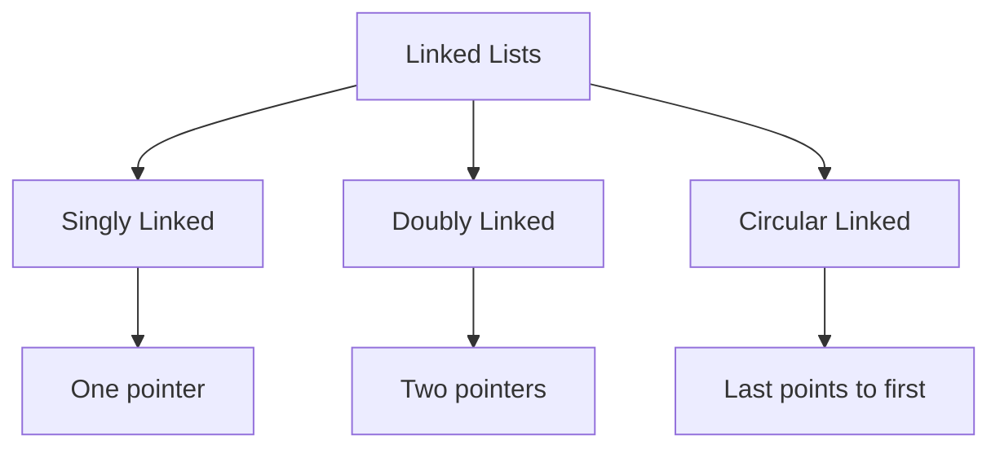

# Arrays and Linked Lists

[Back to Course Content](README.md) | [← Previous: Introduction](introduction.md) | [Next: Stacks and Queues →](stacks-queues.md)

## Arrays

An array is a linear data structure that collects elements of the same data type and stores them together in contiguous and adjacent memory locations.

### Array Characteristics

```mermaid
graph TD
    A[Array] --> B[Fixed Size]
    A --> C[Contiguous Memory]
    A --> D[Random Access]
    A --> E[Same Data Type]
    B --> F[Static Allocation]
    C --> G[Sequential Storage]
    D --> H[O(1) Access]
    E --> I[Type Safety]
```

### Array Operations

| Operation | Time Complexity | Space Complexity | Description |
|-----------|----------------|------------------|-------------|
| Access | O(1) | O(1) | Get element at index |
| Search | O(n) | O(1) | Find element value |
| Insert | O(n) | O(1) | Add element at position |
| Delete | O(n) | O(1) | Remove element at position |
| Update | O(1) | O(1) | Modify element at index |

### Array Implementation

```python
class Array:
    def __init__(self, size):
        self.size = size
        self.data = [None] * size
    
    def get(self, index):
        if 0 <= index < self.size:
            return self.data[index]
        raise IndexError("Index out of bounds")
    
    def set(self, index, value):
        if 0 <= index < self.size:
            self.data[index] = value
        else:
            raise IndexError("Index out of bounds")
    
    def length(self):
        return self.size
```

### Real-World Applications of Arrays

1. **Image Processing**
   - Pixel data storage
   - Color channel representation
   - Image manipulation

2. **Database Tables**
   - Row storage
   - Column-based storage
   - Index structures

3. **Matrix Operations**
   - 2D arrays for matrices
   - Scientific computing
   - Graphics processing

## Linked Lists

A linked list is a linear data structure where elements are stored in nodes, and each node points to the next node in the sequence.

### Types of Linked Lists



### Linked List Operations

| Operation | Time Complexity | Space Complexity | Description |
|-----------|----------------|------------------|-------------|
| Access | O(n) | O(1) | Get element at position |
| Search | O(n) | O(1) | Find element value |
| Insert | O(1) | O(1) | Add element at position |
| Delete | O(1) | O(1) | Remove element at position |
| Update | O(n) | O(1) | Modify element at position |

### Linked List Implementation

```python
class Node:
    def __init__(self, data):
        self.data = data
        self.next = None

class LinkedList:
    def __init__(self):
        self.head = None
        self.size = 0
    
    def insert(self, data):
        new_node = Node(data)
        if not self.head:
            self.head = new_node
        else:
            current = self.head
            while current.next:
                current = current.next
            current.next = new_node
        self.size += 1
    
    def delete(self, data):
        if not self.head:
            return
        if self.head.data == data:
            self.head = self.head.next
            self.size -= 1
            return
        current = self.head
        while current.next:
            if current.next.data == data:
                current.next = current.next.next
                self.size -= 1
                return
            current = current.next
```

### Doubly Linked List Implementation

```python
class DoublyNode:
    def __init__(self, data):
        self.data = data
        self.next = None
        self.prev = None

class DoublyLinkedList:
    def __init__(self):
        self.head = None
        self.tail = None
        self.size = 0
    
    def insert(self, data):
        new_node = DoublyNode(data)
        if not self.head:
            self.head = self.tail = new_node
        else:
            new_node.prev = self.tail
            self.tail.next = new_node
            self.tail = new_node
        self.size += 1
    
    def delete(self, data):
        if not self.head:
            return
        if self.head.data == data:
            self.head = self.head.next
            if self.head:
                self.head.prev = None
            self.size -= 1
            return
        current = self.head
        while current.next:
            if current.next.data == data:
                current.next = current.next.next
                if current.next:
                    current.next.prev = current
                self.size -= 1
                return
            current = current.next
```

## Comparison of Arrays and Linked Lists

| Feature | Array | Linked List |
|---------|-------|-------------|
| Memory Allocation | Static | Dynamic |
| Memory Usage | Less | More |
| Access Time | O(1) | O(n) |
| Insert/Delete Time | O(n) | O(1) |
| Random Access | Yes | No |
| Cache Utilization | Better | Poor |
| Memory Wastage | No | Yes (pointers) |
| Implementation | Simple | Complex |

## Real-World Applications of Linked Lists

1. **Web Browser History**
   - Back/Forward navigation
   - URL storage
   - Session management

2. **Text Editor**
   - Undo/Redo operations
   - Line storage
   - Character manipulation

3. **Music Player**
   - Playlist management
   - Next/Previous track
   - Shuffle functionality

## Common Operations and Algorithms

### Array Operations

1. **Array Rotation**
```python
def rotate_array(arr, k):
    n = len(arr)
    k = k % n
    arr[:] = arr[k:] + arr[:k]
```

2. **Array Reversal**
```python
def reverse_array(arr):
    left, right = 0, len(arr) - 1
    while left < right:
        arr[left], arr[right] = arr[right], arr[left]
        left += 1
        right -= 1
```

### Linked List Operations

1. **Detect Cycle**
```python
def has_cycle(head):
    slow = fast = head
    while fast and fast.next:
        slow = slow.next
        fast = fast.next.next
        if slow == fast:
            return True
    return False
```

2. **Reverse Linked List**
```python
def reverse_linked_list(head):
    prev = None
    current = head
    while current:
        next_node = current.next
        current.next = prev
        prev = current
        current = next_node
    return prev
```

## Memory Management

### Array Memory Management
- Contiguous memory allocation
- Fixed size
- Memory fragmentation
- Stack vs Heap allocation

### Linked List Memory Management
- Dynamic memory allocation
- Memory fragmentation
- Garbage collection
- Memory leaks prevention

## Best Practices

### Array Best Practices
1. Pre-allocate size when possible
2. Use appropriate data types
3. Handle bounds checking
4. Consider memory constraints
5. Use built-in array methods

### Linked List Best Practices
1. Handle empty list cases
2. Maintain proper links
3. Prevent memory leaks
4. Consider doubly linked for bidirectional access
5. Use sentinel nodes when appropriate

## Common Problems and Solutions

### Array Problems
1. **Two Sum**
```python
def two_sum(nums, target):
    seen = {}
    for i, num in enumerate(nums):
        complement = target - num
        if complement in seen:
            return [seen[complement], i]
        seen[num] = i
    return []
```

2. **Maximum Subarray**
```python
def max_subarray(nums):
    max_sum = current_sum = nums[0]
    for num in nums[1:]:
        current_sum = max(num, current_sum + num)
        max_sum = max(max_sum, current_sum)
    return max_sum
```

### Linked List Problems
1. **Merge Two Lists**
```python
def merge_lists(l1, l2):
    dummy = Node(0)
    current = dummy
    while l1 and l2:
        if l1.data <= l2.data:
            current.next = l1
            l1 = l1.next
        else:
            current.next = l2
            l2 = l2.next
        current = current.next
    current.next = l1 or l2
    return dummy.next
```

2. **Remove Nth Node**
```python
def remove_nth_node(head, n):
    dummy = Node(0)
    dummy.next = head
    fast = slow = dummy
    for _ in range(n + 1):
        fast = fast.next
    while fast:
        fast = fast.next
        slow = slow.next
    slow.next = slow.next.next
    return dummy.next
```

## Summary

Key points to remember:
1. Arrays provide fast random access but fixed size
2. Linked lists offer dynamic size but sequential access
3. Choose based on access patterns and memory constraints
4. Consider hybrid approaches for specific use cases
5. Implement proper error handling and edge cases
6. Optimize for specific operations based on requirements

By understanding these fundamental data structures, you can:
- Choose appropriate data structures for problems
- Implement efficient solutions
- Optimize memory usage
- Handle complex data operations
- Build scalable applications 