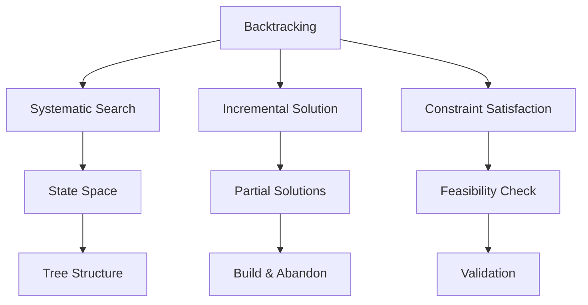

# Backtracking Algorithms

[Back to Course Content](README.md) | [← Previous: Greedy Algorithms](greedy.md) | [Next: Divide and Conquer →](divide-and-conquer.md)

## Introduction to Backtracking

Backtracking is a systematic way to iterate through all possible configurations of a search space. It builds solutions incrementally and abandons partial solutions that cannot be completed.

### Backtracking Characteristics



### Key Concepts

| Concept | Description |
|---------|-------------|
| State Space | All possible configurations |
| Partial Solution | Incomplete solution being built |
| Feasibility | Whether solution satisfies constraints |
| Backtrack | Undo last decision and try alternative |
| Pruning | Eliminating invalid branches early |
| Recursion | Natural way to implement backtracking |

## Common Backtracking Problems

### 1. N-Queens Problem

```python
def is_safe(board, row, col, n):
    # Check row
    for j in range(col):
        if board[row][j] == 1:
            return False
    
    # Check upper diagonal
    for i, j in zip(range(row, -1, -1), range(col, -1, -1)):
        if board[i][j] == 1:
            return False
    
    # Check lower diagonal
    for i, j in zip(range(row, n), range(col, -1, -1)):
        if board[i][j] == 1:
            return False
    
    return True

def solve_n_queens(n):
    board = [[0] * n for _ in range(n)]
    
    def solve_util(col):
        if col >= n:
            return True
        
        for row in range(n):
            if is_safe(board, row, col, n):
                board[row][col] = 1
                if solve_util(col + 1):
                    return True
                board[row][col] = 0
        
        return False
    
    if not solve_util(0):
        return None
    
    return board
```

### 2. Sudoku Solver

```python
def find_empty(board):
    for i in range(9):
        for j in range(9):
            if board[i][j] == 0:
                return i, j
    return None

def is_valid(board, num, pos):
    # Check row
    for j in range(9):
        if board[pos[0]][j] == num:
            return False
    
    # Check column
    for i in range(9):
        if board[i][pos[1]] == num:
            return False
    
    # Check box
    box_x = pos[1] // 3
    box_y = pos[0] // 3
    for i in range(box_y * 3, box_y * 3 + 3):
        for j in range(box_x * 3, box_x * 3 + 3):
            if board[i][j] == num:
                return False
    
    return True

def solve_sudoku(board):
    empty = find_empty(board)
    if not empty:
        return True
    
    row, col = empty
    for num in range(1, 10):
        if is_valid(board, num, (row, col)):
            board[row][col] = num
            if solve_sudoku(board):
                return True
            board[row][col] = 0
    
    return False
```

### 3. Rat in a Maze

```python
def is_safe(maze, x, y, n):
    return (0 <= x < n and 0 <= y < n and maze[x][y] == 1)

def solve_maze(maze):
    n = len(maze)
    solution = [[0] * n for _ in range(n)]
    
    def solve_util(x, y):
        if x == n - 1 and y == n - 1:
            return True
        
        if is_safe(maze, x, y, n):
            solution[x][y] = 1
            
            # Move right
            if solve_util(x + 1, y):
                return True
            
            # Move down
            if solve_util(x, y + 1):
                return True
            
            solution[x][y] = 0
            return False
        
        return False
    
    if not solve_util(0, 0):
        return None
    
    return solution
```

### 4. Subset Sum

```python
def subset_sum(arr, target):
    n = len(arr)
    result = []
    
    def solve_util(index, curr_sum, curr_subset):
        if curr_sum == target:
            result.append(curr_subset[:])
            return
        
        if index >= n or curr_sum > target:
            return
        
        # Include current element
        curr_subset.append(arr[index])
        solve_util(index + 1, curr_sum + arr[index], curr_subset)
        
        # Exclude current element
        curr_subset.pop()
        solve_util(index + 1, curr_sum, curr_subset)
    
    solve_util(0, 0, [])
    return result
```

### 5. Permutations

```python
def permutations(arr):
    n = len(arr)
    result = []
    
    def solve_util(index):
        if index == n:
            result.append(arr[:])
            return
        
        for i in range(index, n):
            arr[index], arr[i] = arr[i], arr[index]
            solve_util(index + 1)
            arr[index], arr[i] = arr[i], arr[index]
    
    solve_util(0)
    return result
```

## Real-World Applications

### 1. Game Solving
- Chess
- Sudoku
- Crossword puzzles
- Maze solving

### 2. Resource Allocation
- Task scheduling
- Resource distribution
- Load balancing
- Network routing

### 3. Constraint Satisfaction
- Scheduling problems
- Assignment problems
- Configuration problems
- Design problems

### 4. Optimization
- Traveling salesman
- Knapsack problem
- Graph coloring
- Job scheduling

## Implementation Considerations

### Memory Management
1. State space representation
2. Memory for partial solutions
3. Recursion stack
4. Space optimization

### Performance Optimization
1. Pruning strategies
2. Heuristic functions
3. Parallel processing
4. Cache utilization

## Best Practices

### Problem Solving
1. Identify constraints
2. Design state space
3. Implement pruning
4. Handle backtracking

### Implementation
1. Choose data structures
2. Optimize recursion
3. Handle edge cases
4. Consider time constraints

## Summary

Key points to remember:
1. Systematic search through state space
2. Build solutions incrementally
3. Backtrack when constraints violated
4. Use pruning to reduce search space
5. Handle recursion carefully
6. Consider memory constraints

By understanding backtracking, you can:
- Solve complex constraint problems
- Find all possible solutions
- Optimize search space
- Handle combinatorial problems
- Design efficient algorithms 