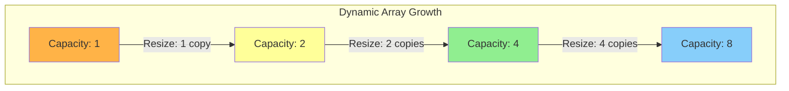
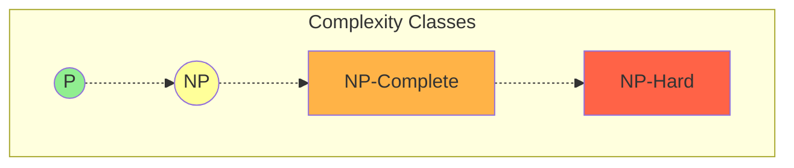

# Complexity Analysis

[Back to Course Content](README.md) | [Previous: Searching Algorithms](searching.md) | [Next: Hashing →](hashing.md)

> Reference: This content is based on Complexity-analysis.pdf and Algorithm-analysis.pdf

## What is Complexity Analysis?

Complexity analysis is the study of how the performance of an algorithm changes with the size of the input. It helps us understand the efficiency and scalability of algorithms by providing a framework to measure resource consumption (primarily time and space) as the input size grows.

### Why Study Complexity Analysis?

1. **Algorithm Comparison**: Compare different algorithms that solve the same problem to determine which is more efficient
2. **Performance Prediction**: Estimate how an algorithm will perform on large inputs before implementing it
3. **Bottleneck Identification**: Identify the most resource-intensive parts of an algorithm
4. **Optimization Guidance**: Guide optimization efforts by focusing on the parts that have the greatest impact on performance
5. **Hardware Independence**: Analyze algorithm efficiency independently of specific hardware or implementation details

### Key Concepts

- **Resource Consumption**: Primarily time (time complexity) and memory (space complexity)
- **Input Size**: The size of the data processed by the algorithm (often denoted as n)
- **Growth Rate**: How resource consumption increases relative to input size
- **Asymptotic Analysis**: Focus on the behavior of the algorithm for large inputs, ignoring constant factors and lower-order terms

```mermaid
mindmap
    root((Complexity Analysis))
        Time Complexity
            Best Case
                Minimum time required for any input
                Denoted by Ω (Omega) notation
            Average Case
                Expected time for random input
                Often difficult to determine precisely
            Worst Case
                Maximum time for any input
                Denoted by O (Big O) notation
                Most commonly used metric
        Space Complexity
            Auxiliary Space
                Extra space used by algorithm
                Temporary variables and data structures
                Recursion stack
            Input Space
                Space required to store input data
                Often not included in analysis
        Analysis Methods
            Big O
                Upper bound
                Most commonly used
            Big Omega
                Lower bound
            Big Theta
                Tight bound
                Both upper and lower bounds
        Applications
            Algorithm Selection
            Performance Optimization
            Resource Planning
            Scalability Assessment
            System Design
```

### Computational Complexity Classes

```mermaid
graph TD
    subgraph "Complexity Hierarchy"
        O1[O(1)] --> Olog[O(log n)]
        Olog --> On[O(n)]
        On --> Onlog[O(n log n)]
        Onlog --> On2[O(n²)]
        On2 --> On3[O(n³)]
        On3 --> O2n[O(2ⁿ)]
        O2n --> Ofac[O(n!)]
    end

    subgraph "Efficiency Categories"
        EC1["Highly Efficient (O(1), O(log n))"]
        EC2["Efficient (O(n), O(n log n))"]
        EC3["Moderately Efficient (O(n²), O(n³))"]
        EC4["Inefficient (O(2ⁿ), O(n!))"]
    end

    O1 ---- EC1
    Olog ---- EC1
    On ---- EC2
    Onlog ---- EC2
    On2 ---- EC3
    On3 ---- EC3
    O2n ---- EC4
    Ofac ---- EC4
```

## Big O Notation

### What is Big O?

Big O notation, written as O(f(n)), describes the upper bound of an algorithm's growth rate. It represents the worst-case scenario of an algorithm's performance, focusing on how the running time or space requirements grow as the input size (n) increases.

### Formal Definition

For functions f(n) and g(n), we say f(n) = O(g(n)) if there exist positive constants c and n₀ such that:

f(n) ≤ c × g(n) for all n ≥ n₀

This means that for sufficiently large inputs, the function f(n) is bounded above by g(n) multiplied by some constant.

### Simplification Rules

1. **Drop Constants**: O(2n) → O(n), O(3n² + 5n) → O(n²)
2. **Drop Lower-Order Terms**: O(n² + n) → O(n²), O(n³ + n log n) → O(n³)
3. **Focus on Dominant Terms**: In nested loops, the deeper nesting dominates

### Common Time Complexities

1. **Constant Time - O(1)**
   
   The algorithm's performance does not change with input size. This is the most efficient time complexity.
   
   ```java
   public int getFirst(int[] arr) {
       return arr[0];  // Direct access - always takes the same time
   }
   
   public boolean isEven(int num) {
       return num % 2 == 0;  // Simple arithmetic operation
   }
   ```
   
   **Graphical Representation**:
   ```
   Running
   Time
   │
   │─────────── O(1)
   │
   └───────────────── Input Size (n)
   ```

2. **Logarithmic Time - O(log n)**
   
   The algorithm's running time grows logarithmically with input size. Often occurs when the algorithm divides the problem in half each time.
   
   ```java
   public int binarySearch(int[] arr, int target) {
       int left = 0;
       int right = arr.length - 1;
       
       while (left <= right) {
           int mid = left + (right - left) / 2;  // Prevent potential overflow
           if (arr[mid] == target) return mid;
           if (arr[mid] < target) left = mid + 1;  // Eliminate left half
           else right = mid - 1;  // Eliminate right half
       }
       return -1;
   }
   
   public int findPowerOf2(int n) {
       int power = 0;
       while ((1 << power) < n) {  // Equivalent to 2^power < n
           power++;
       }
       return power;
   }
   ```
   
   **Graphical Representation**:
   ```
   Running
   Time
   │     
   │         ____
   │    ____/    O(log n)
   │___/
   └───────────────── Input Size (n)
   ```

3. **Linear Time - O(n)**
   
   The running time grows linearly with input size. Typically occurs when we need to process each input element at least once.
   
   ```java
   public int findMax(int[] arr) {
       int max = arr[0];
       for (int i = 1; i < arr.length; i++) {  // Process each element exactly once
           if (arr[i] > max) max = arr[i];
       }
       return max;
   }
   
   public int countOccurrences(int[] arr, int target) {
       int count = 0;
       for (int num : arr) {  // Iterate through every element
           if (num == target) count++;
       }
       return count;
   }
   ```
   
   **Graphical Representation**:
   ```
   Running
   Time
   │              /
   │            /
   │          /     O(n)
   │        /
   │      /
   │    /
   │  /
   │/
   └───────────────── Input Size (n)
   ```

4. **Linearithmic Time - O(n log n)**
   
   The running time grows as n log n. Common in efficient sorting algorithms and divide-and-conquer approaches.
   
   ```java
   public void mergeSort(int[] arr) {
       if (arr.length <= 1) return;  // Base case
       
       // Divide step - O(1)
       int mid = arr.length / 2;
       int[] left = Arrays.copyOfRange(arr, 0, mid);  // O(n/2) operation
       int[] right = Arrays.copyOfRange(arr, mid, arr.length);  // O(n/2) operation
       
       // Recursive calls - 2 * T(n/2)
       mergeSort(left);  
       mergeSort(right);
       
       // Merge step - O(n)
       merge(arr, left, right);  // Combines two sorted arrays
   }
   
   private void merge(int[] result, int[] left, int[] right) {
       int i = 0, j = 0, k = 0;
       while (i < left.length && j < right.length) {
           if (left[i] <= right[j]) {
               result[k++] = left[i++];
           } else {
               result[k++] = right[j++];
           }
       }
       
       // Copy remaining elements
       while (i < left.length) {
           result[k++] = left[i++];
       }
       
       while (j < right.length) {
           result[k++] = right[j++];
       }
   }
   ```
   
   **Graphical Representation**:
   ```
   Running
   Time
   │                /
   │              /
   │           /      O(n log n)
   │        /
   │     /
   │   /
   │ /
   └───────────────── Input Size (n)
   ```

5. **Quadratic Time - O(n²)**
   
   The running time grows quadratically with input size. Often occurs in algorithms with nested loops processing the input.
   
   ```java
   public void bubbleSort(int[] arr) {
       for (int i = 0; i < arr.length - 1; i++) {  // Outer loop - O(n)
           for (int j = 0; j < arr.length - i - 1; j++) {  // Inner loop - O(n)
               if (arr[j] > arr[j + 1]) {  // Compare adjacent elements
                   // Swap elements
                   int temp = arr[j];
                   arr[j] = arr[j + 1];
                   arr[j + 1] = temp;
               }
           }
       }
   }
   
   public void printAllPairs(int[] arr) {
       for (int i = 0; i < arr.length; i++) {  // O(n)
           for (int j = 0; j < arr.length; j++) {  // O(n)
               System.out.println(arr[i] + ", " + arr[j]);
           }
       }
   }
   ```
   
   **Graphical Representation**:
   ```
   Running
   Time
   │                      /
   │                    /
   │                  /
   │                /      O(n²)
   │             /
   │          /
   │       /
   │    /
   │ /
   └───────────────── Input Size (n)
   ```

6. **Exponential Time - O(2ⁿ)**
   
   The running time doubles with each additional input element. Often seen in naive recursive algorithms without memoization.
   
   ```java
   public int fibonacci(int n) {
       if (n <= 1) return n;  // Base case
       return fibonacci(n - 1) + fibonacci(n - 2);  // Recursive calls
   }
   
   public int countSubsets(int[] arr) {
       return powerSet(arr, 0, new ArrayList<>());
   }
   
   private int powerSet(int[] arr, int index, List<Integer> current) {
       if (index == arr.length) {
           System.out.println(current);
           return 1;
       }
       
       // Don't include current element
       int count1 = powerSet(arr, index + 1, current);
       
       // Include current element
       current.add(arr[index]);
       int count2 = powerSet(arr, index + 1, current);
       current.remove(current.size() - 1);  // Backtrack
       
       return count1 + count2;
   }
   ```
   
   **Graphical Representation**:
   ```
   Running
   Time
   │                            /
   │                          /
   │                        /
   │                      /
   │                    /
   │                  /        O(2ⁿ)
   │                /
   │             /
   │          /
   │       /
   │    /
   │ /
   └───────────────── Input Size (n)
   ```

7. **Factorial Time - O(n!)**
   
   The running time grows factorially with input size. Seen in algorithms that generate all permutations or arrangements.
   
   ```java
   public void generatePermutations(String str) {
       generatePermutationsHelper("", str);
   }

   private void generatePermutationsHelper(String prefix, String str) {
       int n = str.length();
       if (n == 0) {
           System.out.println(prefix);  // Found a permutation
           return;
       }
       
       for (int i = 0; i < n; i++) {
           // Choose one character and generate permutations for the rest
           generatePermutationsHelper(
               prefix + str.charAt(i),
               str.substring(0, i) + str.substring(i + 1)
           );
       }
   }
   
   public int travelingSalesman(int[][] distances, int start) {
       List<Integer> cities = new ArrayList<>();
       for (int i = 0; i < distances.length; i++) {
           if (i != start) cities.add(i);
       }
       return calculateShortestPath(distances, start, cities);
   }
   
   private int calculateShortestPath(int[][] distances, int current, List<Integer> remainingCities) {
       if (remainingCities.isEmpty()) {
           return distances[current][0];  // Return to starting city
       }
       
       int minDistance = Integer.MAX_VALUE;
       for (int i = 0; i < remainingCities.size(); i++) {
           int nextCity = remainingCities.get(i);
           List<Integer> newRemaining = new ArrayList<>(remainingCities);
           newRemaining.remove(i);
           
           int distance = distances[current][nextCity] + 
                         calculateShortestPath(distances, nextCity, newRemaining);
           minDistance = Math.min(minDistance, distance);
       }
       
       return minDistance;
   }
   ```
   
   **Graphical Representation**:
   ```
   Running
   Time
   │                                     /
   │                                   /
   │                                 /
   │                               /
   │                             /      O(n!)
   │                          /
   │                      /
   │                  /
   │           /
   │     /
   │ /
   └───────────────── Input Size (n)
   ```

### Comparing Time Complexities

```mermaid
graph LR
    subgraph "Growth Rate Comparison"
        direction TB
        c1[n = 10]
        c2[n = 100]
        c3[n = 1000]
    end
    
    c1 --- o11[O(1): 1]
    c1 --- o12[O(log n): 3]
    c1 --- o13[O(n): 10]
    c1 --- o14[O(n log n): 33]
    c1 --- o15[O(n²): 100]
    c1 --- o16[O(2ⁿ): 1024]
    c1 --- o17[O(n!): 3.6M]
    
    c2 --- o21[O(1): 1]
    c2 --- o22[O(log n): 7]
    c2 --- o23[O(n): 100]
    c2 --- o24[O(n log n): 664]
    c2 --- o25[O(n²): 10K]
    c2 --- o26[O(2ⁿ): 10³⁰]
    c2 --- o27[O(n!): 10¹⁵⁸]
    
    c3 --- o31[O(1): 1]
    c3 --- o32[O(log n): 10]
    c3 --- o33[O(n): 1K]
    c3 --- o34[O(n log n): 10K]
    c3 --- o35[O(n²): 1M]
    c3 --- o36[O(2ⁿ): 10³⁰⁰]
    c3 --- o37[O(n!): 10²⁵⁶⁸]
```

### Visual Comparison of Time Complexities

```mermaid
graph TD
    subgraph "Algorithm Efficiency Scale"
        direction LR
        a1[O(1)] --- a2[O(log n)] --- a3[O(n)] --- a4[O(n log n)] --- a5[O(n²)] --- a6[O(2ⁿ)] --- a7[O(n!)]
        
        style a1 fill:#90EE90
        style a2 fill:#90EE90
        style a3 fill:#FFFF99
        style a4 fill:#FFFF99
        style a5 fill:#FFB347
        style a6 fill:#FF6347
        style a7 fill:#FF6347
    end
```

## Space Complexity

Space complexity measures the amount of memory an algorithm uses relative to the input size. This includes both the space needed to store the input (input space) and any additional memory used during execution (auxiliary space).

### Formal Definition

For a function f(n), we say an algorithm has space complexity O(f(n)) if it uses at most c × f(n) memory cells for some constant c and all sufficiently large inputs of size n.

### Types of Space Complexity

1. **Input Space**
   - Space required to store the input data
   - Examples:
     - An array of n elements: O(n) space
     - A matrix of size n×n: O(n²) space
     - A graph with n vertices and e edges: O(n + e) space

2. **Auxiliary Space**
   - Extra space used by the algorithm beyond the input
   - Includes:
     - Temporary variables
     - Data structures created during execution
     - Function call stack in recursion
   - Usually what we refer to when discussing space complexity

### Common Space Complexities

1. **Constant Space - O(1)**
   
   The algorithm uses a fixed amount of memory regardless of input size.
   
   ```java
   public int sum(int[] arr) {
       int sum = 0;  // Single variable - O(1) space
       for (int num : arr) {  // Iterate through input without additional storage
           sum += num;
       }
       return sum;
   }
   
   public boolean isBalanced(int[] arr) {
       int leftSum = 0, rightSum = 0;  // Two variables - O(1) space
       for (int num : arr) {
           rightSum += num;
       }
       
       for (int i = 0; i < arr.length; i++) {
           rightSum -= arr[i];
           if (leftSum == rightSum) return true;
           leftSum += arr[i];
       }
       return false;
   }
   ```

2. **Linear Space - O(n)**
   
   The algorithm's memory usage grows linearly with input size.
   
   ```java
   public int[] reverse(int[] arr) {
       int[] result = new int[arr.length];  // New array of size n - O(n) space
       for (int i = 0; i < arr.length; i++) {
           result[i] = arr[arr.length - 1 - i];
       }
       return result;
   }
   
   public List<Integer> findDuplicates(int[] arr) {
       Set<Integer> seen = new HashSet<>();  // In worst case, stores n items
       List<Integer> duplicates = new ArrayList<>();  // In worst case, stores n items
       
       for (int num : arr) {
           if (!seen.add(num)) {  // add returns false if element already exists
               duplicates.add(num);
           }
       }
       
       return duplicates;
   }
   ```

3. **Quadratic Space - O(n²)**
   
   The algorithm's memory usage grows quadratically with input size.
   
   ```java
   public int[][] transpose(int[][] matrix) {
       int rows = matrix.length;
       int cols = matrix[0].length;
       int[][] result = new int[cols][rows];  // New matrix of size cols×rows - O(n²) space
       
       for (int i = 0; i < rows; i++) {
           for (int j = 0; j < cols; j++) {
               result[j][i] = matrix[i][j];
           }
       }
       return result;
   }
   
   public int[][] generateAdjacencyMatrix(int n) {
       int[][] adjMatrix = new int[n][n];  // Matrix of size n×n - O(n²) space
       
       // Initialize with random connections (1 means connected)
       Random rand = new Random();
       for (int i = 0; i < n; i++) {
           for (int j = i + 1; j < n; j++) {
               if (rand.nextBoolean()) {
                   adjMatrix[i][j] = 1;
                   adjMatrix[j][i] = 1;  // Undirected graph
               }
           }
       }
       
       return adjMatrix;
   }
   ```

4. **Logarithmic Space - O(log n)**
   
   The algorithm's memory usage grows logarithmically with input size.
   
   ```java
   public int binarySearchRecursive(int[] arr, int target, int left, int right) {
       // Each recursive call uses O(1) space, but the call stack is O(log n) deep
       if (left > right) return -1;
       
       int mid = left + (right - left) / 2;
       if (arr[mid] == target) return mid;
       
       if (arr[mid] > target) {
           return binarySearchRecursive(arr, target, left, mid - 1);
       } else {
           return binarySearchRecursive(arr, target, mid + 1, right);
       }
   }
   
   public int countDigits(int n) {
       if (n == 0) return 1;
       
       int count = 0;
       while (n > 0) {  // Loops log₁₀(n) times
           n /= 10;
           count++;
       }
       return count;
   }
   ```

5. **Recursive Space Complexity**
   
   Recursive algorithms use the call stack, which contributes to space complexity.
   
   ```java
   // This has O(n) space complexity due to the call stack
   public int factorial(int n) {
       if (n <= 1) return 1;
       return n * factorial(n - 1);  // Creates a call stack of depth n
   }
   
   // This has O(log n) space complexity due to the call stack
   public int efficientPower(int x, int n) {
       if (n == 0) return 1;
       if (n % 2 == 0) {
           int half = efficientPower(x, n / 2);
           return half * half;
       } else {
           return x * efficientPower(x, n - 1);
       }
   }
   ```

### Space-Time Tradeoffs

Often, there's a tradeoff between time and space complexity. Using more memory can sometimes lead to faster algorithms.

```java
// Time: O(n²), Space: O(1)
public boolean hasDuplicate_BruteForce(int[] arr) {
    for (int i = 0; i < arr.length; i++) {
        for (int j = i + 1; j < arr.length; j++) {
            if (arr[i] == arr[j]) return true;
        }
    }
    return false;
}

// Time: O(n), Space: O(n)
public boolean hasDuplicate_HashSet(int[] arr) {
    Set<Integer> seen = new HashSet<>();
    for (int num : arr) {
        if (seen.contains(num)) return true;
        seen.add(num);
    }
    return false;
}
```

### Space Complexity Examples in Common Algorithms

| Algorithm | Time Complexity | Space Complexity | Notes |
|-----------|----------------|-----------------|-------|
| Bubble Sort | O(n²) | O(1) | In-place sorting |
| Merge Sort | O(n log n) | O(n) | Requires auxiliary array |
| Quick Sort | O(n log n) - Average | O(log n) | Recursive stack |
| Depth-First Search (DFS) | O(V + E) | O(V) | Recursive stack or explicit stack |
| Breadth-First Search (BFS) | O(V + E) | O(V) | Queue to store vertices |
| Dijkstra's Algorithm | O(E log V) | O(V) | Priority queue |
| Dynamic Programming | Varies | Varies | Often trades space for time |

## Analysis Methods

Asymptotic notation provides a formal framework for analyzing algorithm efficiency. Three main notations are commonly used: Big O, Big Omega, and Big Theta.

### Formal Mathematical Definitions

| Notation | Symbol | Definition | Meaning |
|----------|--------|------------|---------|
| Big O | O | f(n) = O(g(n)) if there exist positive constants c and n₀ such that 0 ≤ f(n) ≤ c·g(n) for all n ≥ n₀ | Upper bound |
| Big Omega | Ω | f(n) = Ω(g(n)) if there exist positive constants c and n₀ such that 0 ≤ c·g(n) ≤ f(n) for all n ≥ n₀ | Lower bound |
| Big Theta | Θ | f(n) = Θ(g(n)) if there exist positive constants c₁, c₂, and n₀ such that c₁·g(n) ≤ f(n) ≤ c₂·g(n) for all n ≥ n₀ | Tight bound |

```mermaid
graph TD
    subgraph "Asymptotic Notation Visual Comparison"
        direction LR
        
        subgraph "Big O - Upper Bound"
            o1[f(n)]
            o2[c·g(n)]
            o1 --- |"≤"| o2
            style o1 fill:#FFB347
            style o2 fill:#90EE90
        end
        
        subgraph "Big Omega - Lower Bound"
            om1[c·g(n)]
            om2[f(n)]
            om1 --- |"≤"| om2
            style om1 fill:#FFB347
            style om2 fill:#90EE90
        end
        
        subgraph "Big Theta - Tight Bound"
            t1[c₁·g(n)]
            t2[f(n)]
            t3[c₂·g(n)]
            t1 --- |"≤"| t2
            t2 --- |"≤"| t3
            style t1 fill:#FFB347
            style t2 fill:#90EE90
            style t3 fill:#FFB347
        end
    end
```

### 1. Big O (Upper Bound)

Big O notation provides an upper bound on the growth rate of a function. It describes the worst-case scenario and is the most commonly used notation in algorithm analysis.

**Formal Definition**: f(n) = O(g(n)) if there exist positive constants c and n₀ such that 0 ≤ f(n) ≤ c·g(n) for all n ≥ n₀.

**Intuition**: f(n) doesn't grow faster than g(n) for large enough n.

```java
// Example: O(n) algorithm
public boolean linearSearch(int[] arr, int target) {
    for (int num : arr) {  // Loop runs at most n times
        if (num == target) return true;  // Best case: O(1) if target is the first element
    }
    return false;  // Worst case: O(n) if target is not in the array or is the last element
}

// Example: O(n²) algorithm
public void printAllPairs(int[] arr) {
    for (int i = 0; i < arr.length; i++) {
        for (int j = 0; j < arr.length; j++) {  // Nested loop - O(n²)
            System.out.println("(" + arr[i] + ", " + arr[j] + ")");
        }
    }
}
```

### 2. Big Omega (Lower Bound)

Big Omega notation provides a lower bound on the growth rate of a function. It describes the best-case scenario.

**Formal Definition**: f(n) = Ω(g(n)) if there exist positive constants c and n₀ such that 0 ≤ c·g(n) ≤ f(n) for all n ≥ n₀.

**Intuition**: f(n) grows at least as fast as g(n) for large enough n.

```java
// Example: Ω(1) operation (best case), but O(log n) overall
public int binarySearch(int[] arr, int target) {
    int left = 0;
    int right = arr.length - 1;
    
    while (left <= right) {
        int mid = left + (right - left) / 2;
        if (arr[mid] == target) return mid;  // Best case: Ω(1) if target is the middle element
        if (arr[mid] < target) left = mid + 1;
        else right = mid - 1;
    }
    return -1;  // Worst case: O(log n) if target is not in the array
}

// Example: Both Ω(n) and O(n)
public int sum(int[] arr) {
    int sum = 0;
    for (int num : arr) {  // Always processes n elements
        sum += num;
    }
    return sum;
}
```

### 3. Big Theta (Tight Bound)

Big Theta notation provides both an upper and lower bound on the growth rate of a function. It describes the exact order of growth.

**Formal Definition**: f(n) = Θ(g(n)) if there exist positive constants c₁, c₂, and n₀ such that c₁·g(n) ≤ f(n) ≤ c₂·g(n) for all n ≥ n₀.

**Intuition**: f(n) grows exactly at the rate of g(n) for large enough n.

```java
// Example: Θ(n) algorithm (both lower and upper bound are n)
public int sum(int[] arr) {
    int sum = 0;
    for (int num : arr) {  // Always processes n elements, never more, never less
        sum += num;
    }
    return sum;
}

// Example: Θ(n log n) algorithm
public void heapSort(int[] arr) {
    // Build max heap - O(n)
    for (int i = arr.length / 2 - 1; i >= 0; i--) {
        heapify(arr, arr.length, i);
    }
    
    // Extract elements one by one - O(n log n)
    for (int i = arr.length - 1; i > 0; i--) {
        // Move current root to end
        int temp = arr[0];
        arr[0] = arr[i];
        arr[i] = temp;
        
        // Max heapify the reduced heap
        heapify(arr, i, 0);  // O(log n) operation
    }
}
```

### Little o and Little omega

Apart from the three main notations, there are also "little o" and "little omega" notations that provide strictly bounds rather than asymptotic bounds.

- **Little o notation**: f(n) = o(g(n)) means that f(n) grows strictly slower than g(n).
- **Little omega notation**: f(n) = ω(g(n)) means that f(n) grows strictly faster than g(n).

### Choosing the Right Notation

1. **For Algorithm Analysis**:
   - Use Big O for worst-case analysis (most common)
   - Use Big Omega for best-case analysis
   - Use Big Theta when the upper and lower bounds match

2. **For Proving Time Complexity**:
   - Start with the algorithm and count operations
   - Express as a function of input size
   - Simplify using asymptotic notation rules

3. **For Comparative Analysis**:
   - Use appropriate notation to rank algorithms
   - Consider constants for practical comparisons
   - Remember that asymptotic analysis ignores constant factors

## Recurrence Relations

Recurrence relations are equations that describe a function in terms of its value on smaller inputs. They are particularly useful for analyzing the time complexity of recursive algorithms.

### Definition and Approach

A recurrence relation for the function T(n) is an equation that defines T(n) in terms of T(m) for m < n.

To solve recurrence relations, we can use several methods:
1. **Substitution Method**: Guess a solution and prove it by induction
2. **Recursion Tree Method**: Draw a tree representing the recurrence and sum the costs
3. **Master Theorem**: Apply a formula for recurrences of the form T(n) = aT(n/b) + f(n)
4. **Iteration Method**: Expand the recurrence and look for a pattern

### The Master Theorem

For recurrences of the form T(n) = aT(n/b) + f(n), where a ≥ 1, b > 1:

1. If f(n) = O(nᶜ) where c < log_b(a), then T(n) = Θ(nˡᵒᵍᵇᵃ)
2. If f(n) = Θ(nᶜ) where c = log_b(a), then T(n) = Θ(nᶜ log n)
3. If f(n) = Ω(nᶜ) where c > log_b(a), then T(n) = Θ(f(n))

### Common Recurrence Relations

1. **Binary Search**
   ```
   T(n) = T(n/2) + c
   ```
   - Each recursive call processes half of the array
   - Additional work is constant time
   
   **Solution**:
   - Using Master Theorem: a=1, b=2, f(n)=c=O(1)
   - Since f(n) = O(n⁰) and 0 < log₂(1) = 0, case 2 applies
   - T(n) = Θ(log n)
   
   **Visualization**:
   ```
   T(n)
   │
   ├── T(n/2) + c
   │   ├── T(n/4) + c
   │   │   ├── ...
   │   │   └── ... (log n levels)
   │   └── c
   └── c
   ```

2. **Merge Sort**
   ```
   T(n) = 2T(n/2) + n
   ```
   - Divides the array into two equal parts
   - Recursively sorts both halves
   - Merges the sorted halves in linear time
   
   **Solution**:
   - Using Master Theorem: a=2, b=2, f(n)=n=Θ(n)
   - Since f(n) = Θ(n) and 1 = log₂(2), case 2 applies
   - T(n) = Θ(n log n)
   
   **Visualization**:
   ```
   T(n) = 2T(n/2) + n
   │
   ├── T(n/2) = 2T(n/4) + n/2
   │   ├── T(n/4) = 2T(n/8) + n/4
   │   │   └── ... (log n levels)
   │   └── T(n/4) = 2T(n/8) + n/4
   │       └── ... (log n levels)
   └── T(n/2) = 2T(n/4) + n/2
       ├── T(n/4) = 2T(n/8) + n/4
       │   └── ... (log n levels)
       └── T(n/4) = 2T(n/8) + n/4
           └── ... (log n levels)
   ```

3. **Quick Sort (Average Case)**
   ```
   T(n) = T(n/2) + T(n/2) + n
   ```
   - Partitions the array around a pivot
   - Recursively sorts both partitions
   - Best case: Pivot divides the array into equal halves
   
   **Solution**:
   - This simplifies to T(n) = 2T(n/2) + n
   - Using Master Theorem: a=2, b=2, f(n)=n=Θ(n)
   - Since f(n) = Θ(n) and 1 = log₂(2), case 2 applies
   - T(n) = Θ(n log n)

4. **Quick Sort (Worst Case)**
   ```
   T(n) = T(n-1) + n
   ```
   - Worst case: Pivot is always the smallest/largest element
   - One subproblem of size n-1, one of size 0
   
   **Solution**:
   - Using substitution or iteration method
   - T(n) = T(n-1) + n
          = T(n-2) + (n-1) + n
          = T(n-3) + (n-2) + (n-1) + n
          = T(1) + 2 + 3 + ... + (n-1) + n
          = 1 + 2 + 3 + ... + (n-1) + n
          = n(n+1)/2
          = Θ(n²)

5. **Binary Tree Traversal**
   ```
   T(n) = 2T(n/2) + 1
   ```
   - For a balanced binary tree with n nodes
   - Recursively process left and right subtrees
   - Constant work at each node
   
   **Solution**:
   - Using Master Theorem: a=2, b=2, f(n)=1=O(1)
   - Since f(n) = O(n⁰) and 0 < log₂(2) = 1, case 1 applies
   - T(n) = Θ(n)

6. **Fibonacci (Naive Recursive)**
   ```
   T(n) = T(n-1) + T(n-2) + 1
   ```
   - Two recursive calls for each non-base case
   - Constant work for each call
   
   **Solution**:
   - Cannot use Master Theorem (not in the required form)
   - Using recursion tree analysis, we get T(n) = Θ(2ⁿ)
   
   **Visualization**:
   ```
   T(n)
   │
   ├── T(n-1)
   │   ├── T(n-2)
   │   │   └── ...
   │   └── T(n-3)
   │       └── ...
   └── T(n-2)
       ├── T(n-3)
       │   └── ...
       └── T(n-4)
           └── ...
   ```

### Solving Techniques with Examples

#### Substitution Method

1. Guess the solution form (e.g., O(n log n))
2. Use induction to prove the guess

**Example**: T(n) = 2T(n/2) + n

Guess: T(n) = O(n log n)
We need to show that T(n) ≤ c·n log n for some constant c

Induction step:
T(n) = 2T(n/2) + n
     ≤ 2(c·(n/2) log(n/2)) + n  [by induction hypothesis]
     = c·n log(n/2) + n
     = c·n (log n - log 2) + n
     = c·n log n - c·n + n
     ≤ c·n log n  [if c ≥ 1]

This confirms our guess T(n) = O(n log n).

#### Recursion Tree Method

1. Draw a tree where each node represents a subproblem
2. Calculate the cost at each level
3. Sum all levels to get the total cost

**Example**: T(n) = 2T(n/2) + n²

Level 0: n²
Level 1: 2·(n/2)² = n²/2
Level 2: 4·(n/4)² = n²/4
...
Level log₂(n): 2^(log₂(n))·(n/2^(log₂(n)))² = n·1² = n

Sum: n² + n²/2 + n²/4 + ... + n ≈ 2n² [geometric series]
Therefore, T(n) = O(n²)

#### Iteration Method

1. Expand the recurrence repeatedly
2. Look for a pattern in the expansion

**Example**: T(n) = 3T(n/4) + n

T(n) = 3T(n/4) + n
     = 3(3T(n/16) + n/4) + n
     = 3²T(n/4²) + 3n/4 + n
     = 3³T(n/4³) + 3²n/4² + 3n/4 + n
     ...
     = 3^(log₄(n))T(1) + n(1 + 3/4 + 3²/4² + ... + 3^(log₄(n)-1)/4^(log₄(n)-1))

Since 3/4 < 1, the sum is bounded by a constant.
With 3^(log₄(n)) = n^(log₄(3)) ≈ n^0.79, we get T(n) = O(n^0.79)

## Amortized Analysis

Amortized analysis provides a way to analyze the time complexity of a sequence of operations, rather than individual operations. It's particularly useful for data structures where occasional operations are expensive but rare.

### What is Amortized Analysis?

Amortized analysis considers the average performance of each operation in a sequence, ensuring that expensive operations are "amortized" over many cheap ones.

The key insight is that while some operations might be costly, they happen infrequently enough that the average cost per operation remains low.

### Methods of Amortized Analysis

#### 1. Aggregate Method

The aggregate method considers the total cost of a sequence of operations and divides by the number of operations to get the amortized cost per operation.

**Example: Dynamic Array**

When a dynamic array's capacity is full, we double its size. This resize operation is expensive (O(n)) but happens infrequently.

```java
public class DynamicArray {
    private int[] arr;
    private int size;
    private int capacity;

    public DynamicArray() {
        capacity = 1;
        arr = new int[capacity];
        size = 0;
    }

    public void push(int x) {
        // If array is full, resize it (expensive operation)
        if (size == capacity) {
            int[] newArr = new int[2 * capacity];
            for (int i = 0; i < size; i++) {
                newArr[i] = arr[i];
            }
            arr = newArr;
            capacity *= 2;
        }
        
        // Add the element (cheap operation)
        arr[size++] = x;
    }
}
```

**Analysis**:
- For n operations, we need to resize when size = 1, 2, 4, 8, ..., 2^k where 2^k < n
- The total cost of these resize operations is 1 + 2 + 4 + 8 + ... + 2^k = 2^(k+1) - 1 < 2n
- Thus, the amortized cost per operation is O(1)



#### 2. Accounting Method

The accounting method assigns different charges to different operations. Some operations are overcharged to save "credit" for later expensive operations.

**Example: Stack with MultiPop**

A stack with push, pop, and multiPop operations, where multiPop removes multiple elements at once.

```java
public class Stack {
    private int[] arr;
    private int top;
    
    public Stack(int capacity) {
        arr = new int[capacity];
        top = -1;
    }
    
    public void push(int x) {
        arr[++top] = x;
    }
    
    public int pop() {
        if (top < 0) throw new IllegalStateException("Stack underflow");
        return arr[top--];
    }
    
    public void multiPop(int k) {
        while (!isEmpty() && k > 0) {
            pop();
            k--;
        }
    }
    
    public boolean isEmpty() {
        return top < 0;
    }
}
```

**Analysis**:
- Assign a charge of 2 to each push operation
- Assign a charge of 0 to each pop operation (including pops in multiPop)
- The extra credit from push operations pays for future pops
- Since each element can only be popped once, the accounting works out
- The amortized cost per operation is O(1)

#### 3. Potential Method

The potential method defines a potential function Φ that maps the data structure's state to a real number. The amortized cost is defined as the actual cost plus the change in potential.

**Example: Binary Counter**

A binary counter that counts in binary from 0 upwards, flipping bits as necessary.

```java
public class BinaryCounter {
    private int[] counter;  // Binary representation with counter[0] as the least significant bit
    private int value;
    
    public BinaryCounter(int bits) {
        counter = new int[bits];
        value = 0;
    }
    
    public void increment() {
        int i = 0;
        
        // Flip bits until we find a 0
        while (i < counter.length && counter[i] == 1) {
            counter[i] = 0;
            i++;
        }
        
        // Set the next bit to 1 if we haven't reached the end
        if (i < counter.length) {
            counter[i] = 1;
        }
        
        value++;
    }
    
    public int getValue() {
        return value;
    }
}
```

**Analysis**:
- Define the potential function Φ as the number of 1s in the counter
- The actual cost of an increment operation is proportional to the number of bits flipped
- The change in potential is (new # of 1s) - (old # of 1s)
- Amortized cost = actual cost + change in potential

For an increment that flips k bits:
- Actual cost: k
- Old state: All k bits are 1s, followed by a 0 (or end of counter)
- New state: All k bits become 0s, and the (k+1)th bit becomes 1
- Change in potential: 1 - k
- Amortized cost = k + (1 - k) = 1

Therefore, the amortized cost of increment is O(1).

### Amortized Analysis in Common Data Structures

1. **Dynamic Arrays**
   - Resizing operation: O(n)
   - Amortized cost per insertion: O(1)

2. **Binary Heaps**
   - Insert operation: O(log n)
   - Extract-min operation: O(log n)
   - Decrease-key operation with binary heap: O(log n)
   - Build-heap operation: O(n) [not O(n log n)]

3. **Disjoint Set Union-Find**
   - With path compression and union by rank:
   - Amortized cost per operation: O(α(n)) where α is the inverse Ackermann function
   - This is effectively O(1) for all practical purposes

4. **Splay Trees**
   - Worst-case operation: O(n)
   - Amortized cost per operation: O(log n)
   - Self-balancing through splaying operation

## Best Practices

Applying complexity analysis effectively requires following certain best practices to ensure your analysis is accurate and your algorithms are efficient.

### Analysis Process

1. **Identify Input Size**
   - Determine what constitutes the "size" of the input
   - For arrays/lists: number of elements
   - For graphs: number of vertices and/or edges
   - For numbers: number of bits required to represent the number

2. **Count Basic Operations**
   - Identify the dominant operations that contribute to complexity
   - Common operations: comparisons, assignments, arithmetic operations
   - Focus on operations whose count depends on input size

3. **Express as Function of Input Size**
   - Write a mathematical function representing the operation count
   - Consider different scenarios (best, average, worst cases)
   - Include all terms initially (constants and lower-order terms)

4. **Find Asymptotic Behavior**
   - Simplify the function using asymptotic notation
   - Drop constants and lower-order terms
   - Determine the dominant growth term

5. **Consider All Cases**
   - Analyze best, average, and worst cases when relevant
   - Identify input patterns that trigger these cases
   - Document assumptions about input distribution

### Implementation Strategies

1. **Choose Appropriate Data Structures**
   - Select data structures based on required operations:
     - Frequent lookups: Hash tables (O(1) average)
     - Ordered data: Binary search trees (O(log n) operations)
     - Dynamic size with fast access: Dynamic arrays
     - FIFO processing: Queues
     - LIFO processing: Stacks

2. **Optimize Critical Paths**
   - Identify and optimize the most frequently executed code
   - Apply algorithm improvements to bottlenecks first
   - Use profiling tools to find actual bottlenecks

3. **Consider Memory Constraints**
   - Balance time and space complexity
   - Evaluate if memory usage scales with input size
   - Consider the target environment's memory limitations

4. **Handle Edge Cases**
   - Account for empty inputs, single elements, or very large inputs
   - Test with boundary conditions
   - Validate inputs to prevent unexpected behavior

5. **Use Efficient Algorithms**
   - Replace O(n²) algorithms with O(n log n) or O(n) when possible
   - Consider specialized algorithms for specific problems
   - Be aware of the constant factors hidden in asymptotic notation

```java
// Example: Inefficient vs. Efficient String Palindrome Check

// Inefficient: O(n²) due to string concatenation in a loop
public boolean isPalindrome_Inefficient(String str) {
    String reversed = "";
    for (int i = str.length() - 1; i >= 0; i--) {
        reversed += str.charAt(i);  // String concatenation is O(n)
    }
    return str.equals(reversed);
}

// Efficient: O(n) with two pointers approach
public boolean isPalindrome_Efficient(String str) {
    int left = 0;
    int right = str.length() - 1;
    while (left < right) {
        if (str.charAt(left) != str.charAt(right)) {
            return false;
        }
        left++;
        right--;
    }
    return true;
}
```

### Documentation Best Practices

1. **Document Complexity**
   - Clearly state time and space complexity in method/class documentation
   - Specify which case the analysis represents (best, average, worst)
   - Explain the reasoning behind the complexity analysis

2. **Explain Assumptions**
   - Document assumptions about input data
   - Clarify constraints that must be satisfied
   - Note when analysis depends on specific conditions

3. **Provide Examples**
   - Include examples that demonstrate the algorithm behavior
   - Show sample inputs and expected outputs
   - Provide examples that represent different complexity scenarios

4. **Include Edge Cases**
   - Document how the algorithm handles edge cases
   - Specify behavior for empty or minimal inputs
   - Describe handling of error conditions

```java
/**
 * Finds the position of a target value in a sorted array using binary search.
 *
 * Time Complexity:
 * - Worst case: O(log n) when the element is not present or at the extremes
 * - Average case: O(log n)
 * - Best case: O(1) when the element is at the middle position
 *
 * Space Complexity: O(1) auxiliary space
 *
 * @param arr A sorted array to search within
 * @param target The value to find
 * @return The index of the target if found, -1 otherwise
 */
public int binarySearch(int[] arr, int target) {
    // Implementation details...
}
```

## Common Pitfalls

When analyzing and implementing algorithms, developers often encounter several common pitfalls that can lead to incorrect complexity analysis or inefficient algorithms.

### Analysis Mistakes

1. **Ignoring Constants**
   - While asymptotic analysis ignores constants, in practice, they matter
   - An O(100n) algorithm can be slower than an O(n²) algorithm for small inputs
   - Remember to consider constant factors for practical applications

2. **Confusing Best, Average, and Worst Cases**
   - Using best-case analysis when worst-case is more appropriate
   - Assuming average-case behavior without considering input distribution
   - Failing to identify which inputs trigger worst-case behavior

3. **Missing Hidden Terms**
   - Overlooking recursive call stacks in space complexity
   - Ignoring initialization costs
   - Forgetting about library function complexities

4. **Incorrect Application of Asymptotic Notation**
   - Misusing Big O, Omega, and Theta notations
   - Incorrect simplification of complex expressions
   - Mistaken composition of complexity from component parts

5. **Overlooking Amortized Complexity**
   - Focusing only on worst-case for individual operations
   - Missing the average cost over a sequence of operations
   - Incorrectly analyzing data structures with occasional expensive operations

### Implementation Issues

1. **Inefficient Operations in Inner Loops**
   - String concatenation in loops: `s += char` creates a new string each time
   - Collection resizing in loops
   - Unnecessary object creation within loops

```java
// Inefficient: Creates many intermediate string objects
String result = "";
for (int i = 0; i < 10000; i++) {
    result += i;  // Each iteration creates a new string
}

// Efficient: Uses StringBuilder
StringBuilder sb = new StringBuilder();
for (int i = 0; i < 10000; i++) {
    sb.append(i);  // No new objects created per iteration
}
String result = sb.toString();  // One new string at the end
```

2. **Memory Leaks**
   - Failing to clear references to objects no longer needed
   - Accumulating data in caches without size limits
   - Circular references preventing garbage collection

3. **Unnecessary Copies**
   - Copying entire arrays when only a portion is needed
   - Defensive copying when not required
   - Copying data structures instead of using views or references

4. **Poor Data Structure Selection**
   - Using arrays for frequent insertions/deletions in the middle
   - Using linked lists for random access
   - Using unindexed structures for frequent lookups
   - Using O(n) data structures when O(log n) or O(1) options exist

```java
// Inefficient: Using List for frequent containment checks
List<Integer> list = new ArrayList<>();
// ... add many elements ...
for (int i = 0; i < 10000; i++) {
    if (list.contains(i)) {  // O(n) operation
        // Do something
    }
}

// Efficient: Using Set for containment checks
Set<Integer> set = new HashSet<>();
// ... add same elements ...
for (int i = 0; i < 10000; i++) {
    if (set.contains(i)) {  // O(1) average operation
        // Do something
    }
}
```

### Optimization Problems

1. **Premature Optimization**
   - Optimizing before profiling to identify real bottlenecks
   - Making code more complex for marginal performance gains
   - Sacrificing readability and maintainability unnecessarily

2. **Over-optimization**
   - Optimizing parts of the code that don't significantly impact performance
   - Using complex algorithms when simpler ones would suffice
   - Spending excessive time on micro-optimizations

3. **Wrong Metrics**
   - Focusing on CPU time when memory is the constraint
   - Optimizing for the wrong bottleneck
   - Ignoring real-world performance factors

4. **Ignoring Trade-offs**
   - Trading too much readability for performance
   - Sacrificing robustness for speed
   - Not considering the full system context

### Real-World Examples

1. **String Processing Pitfalls**
   - Using `+= ` for repeated string concatenation
   - Performing substring operations in loops
   - Converting between string and character arrays unnecessarily

2. **Collection Pitfalls**
   - Using wrong collection types (e.g., ArrayList for frequent insertions at beginning)
   - Resizing collections in performance-critical sections
   - Excessive boxing/unboxing with primitive types

3. **Algorithmic Pitfalls**
   - Nested loops where a single pass would suffice
   - Recomputing values that could be cached
   - Using recursive algorithms without considering stack overflow

## Advanced Topics in Complexity Analysis

### NP-Completeness and Computational Complexity Theory

#### Complexity Classes

- **P**: Problems solvable in polynomial time
- **NP**: Problems verifiable in polynomial time
- **NP-Complete**: The "hardest" problems in NP
- **NP-Hard**: Problems at least as hard as NP-Complete problems



#### Common NP-Complete Problems

- **Traveling Salesman Problem**: Find the shortest path visiting all cities exactly once
- **Knapsack Problem**: Maximize value while keeping total weight under a limit
- **Graph Coloring**: Color vertices such that no adjacent vertices share the same color
- **Subset Sum**: Determine if a subset of numbers sums to a target value
- **Boolean Satisfiability (SAT)**: Determine if a Boolean formula can be satisfied

### Approximation Algorithms

When exact polynomial-time algorithms aren't feasible (NP-hard problems), approximation algorithms provide near-optimal solutions in reasonable time.

#### Approximation Ratio

If OPT is the optimal solution value and A(I) is the algorithm's solution value:
- For minimization problems: A(I) / OPT ≤ α
- For maximization problems: OPT / A(I) ≤ α

Where α is the approximation ratio (α ≥ 1).

#### Examples

- **Vertex Cover**: 2-approximation algorithm
- **Traveling Salesman**: 1.5-approximation for metric instances
- **Knapsack Problem**: FPTAS (Fully Polynomial-Time Approximation Scheme)

### Randomized Algorithms

Algorithms that make random choices during execution, classified as:

1. **Las Vegas Algorithms**: Always give correct results, with randomized running time
   - Example: Randomized Quicksort

2. **Monte Carlo Algorithms**: Fixed running time, with a small probability of error
   - Example: Miller-Rabin primality test

### Online Algorithms

Algorithms that process input piece-by-piece, without having the entire input available from the start.

#### Competitive Ratio

If OPT is the optimal offline solution and A is the online algorithm's solution:
- Competitive ratio = max(A(I)/OPT(I), OPT(I)/A(I)) depending on whether it's a minimization or maximization problem

#### Examples

- **Caching Algorithms**: LRU, FIFO
- **Scheduling Algorithms**: Online job scheduling
- **Paging**: Memory management

### Parallel Algorithms

Algorithms designed to run on parallel computing architectures, analyzed using:

1. **Work**: Total number of operations
2. **Depth**: Longest path of dependencies
3. **Speedup**: How much faster the parallel version is compared to sequential

#### Amdahl's Law

Speedup = 1 / ((1 - p) + p/s)

Where:
- p is the proportion of the program that can be paralleled
- s is the speedup of the parallel portion

### Streaming Algorithms

Algorithms that process data in a single pass, using limited memory.

#### Examples

- **Frequency Counting**: Count-Min Sketch
- **Distinct Elements**: HyperLogLog
- **Reservoir Sampling**: Random sampling from streams

## Exercises

These exercises will help reinforce your understanding of complexity analysis and algorithm design.

### Basic Exercises

1. **Algorithm Analysis**
   - Calculate the time and space complexity of the following code:
   ```java
   public void mystery(int n) {
       for (int i = 0; i < n; i++) {
           for (int j = i; j < n; j++) {
               System.out.print(i + j);
           }
       }
   }
   ```

2. **Recurrence Relations**
   - Solve the following recurrence relations:
     a. T(n) = 3T(n/2) + n²
     b. T(n) = T(n-1) + n
     c. T(n) = 2T(n/4) + √n

3. **Amortized Analysis**
   - Perform an amortized analysis of a dynamic array implementation that doubles its size when full.
   - Calculate the amortized cost per operation.

4. **Complexity Comparison**
   - Compare the time complexity of the following sorting algorithms:
     - Bubble Sort
     - Insertion Sort
     - Merge Sort
     - Quick Sort
     - Heap Sort
   - Identify scenarios where each might be preferred.

5. **Code Optimization**
   - Identify inefficiencies in the following code and optimize it:
   ```java
   public boolean hasDuplicate(List<Integer> list) {
       for (int i = 0; i < list.size(); i++) {
           for (int j = 0; j < list.size(); j++) {
               if (i != j && list.get(i).equals(list.get(j))) {
                   return true;
               }
           }
       }
       return false;
   }
   ```

### Intermediate Exercises

1. **Algorithm Design**
   - Design an algorithm to find the kth smallest element in an unsorted array.
   - Analyze its time and space complexity.
   - Compare different approaches (sorting, priority queue, quickselect).

2. **Dynamic Programming vs. Recursion**
   - Implement the Fibonacci sequence calculation using:
     a. Naive recursion
     b. Dynamic programming with memoization
     c. Bottom-up iterative approach
   - Analyze and compare the time and space complexity of each approach.

3. **Amortized Analysis Case Study**
   - Implement a data structure for a Queue using two stacks.
   - Perform an amortized analysis of the enqueue and dequeue operations.

4. **NP-Completeness Understanding**
   - For each of the following problems, determine if they are in P, NP, or NP-Complete:
     a. Finding the shortest path between two vertices in a graph
     b. Determining if a graph can be colored with k colors
     c. Checking if a number is prime
     d. Solving a Sudoku puzzle

5. **Space-Time Trade-off Implementation**
   - Implement two solutions to the "Two Sum" problem:
     a. A brute force approach with O(n²) time and O(1) space
     b. A hash table approach with O(n) time and O(n) space
   - Discuss the trade-offs between the two approaches.

### Advanced Exercises

1. **Advanced Algorithm Analysis**
   - Analyze the average-case time complexity of Quicksort, explaining why it performs better than its worst-case complexity in practice.
   - Implement optimizations to improve Quicksort's performance for various input patterns.

2. **Approximation Algorithm Design**
   - Design and implement a 2-approximation algorithm for the Vertex Cover problem.
   - Analyze its time complexity and approximation ratio.

3. **Parallel Algorithm Analysis**
   - Design a parallel algorithm for merge sort.
   - Analyze its work and depth complexity.
   - Determine the theoretical speedup and efficiency.

4. **Online Algorithm Case Study**
   - Implement the Least Recently Used (LRU) caching algorithm.
   - Analyze its competitive ratio against an optimal offline algorithm.
   - Discuss scenarios where LRU performs well and where it struggles.

5. **Research and Implementation**
   - Research and implement a streaming algorithm for estimating the number of distinct elements in a large data stream using limited memory.
   - Analyze its space complexity and error bounds.

## Summary

Complexity analysis provides a formal framework for evaluating algorithm efficiency and scalability. The key takeaways from this chapter include:

1. **Analytical Framework**: Asymptotic notation (Big O, Omega, Theta) helps quantify how resource usage scales with input size
2. **Time vs. Space**: Both time (computational steps) and space (memory usage) complexities are important considerations
3. **Analysis Methods**: Techniques like recurrence relations and amortized analysis help analyze complex algorithms
4. **Practical Application**: Understanding complexity helps select appropriate algorithms and data structures for specific problems
5. **Implementation Considerations**: Algorithmic efficiency in theory must be balanced with practical implementation concerns

By mastering complexity analysis, you can:
- Make informed decisions about algorithm selection
- Predict performance characteristics as data scales
- Identify and address performance bottlenecks
- Design efficient solutions to complex problems
- Communicate effectively about algorithm performance

## Additional Resources

- [GeeksforGeeks - Complexity Analysis](https://www.geeksforgeeks.org/analysis-of-algorithms-set-1-asymptotic-analysis/)
- [Big O Cheat Sheet](https://www.bigocheatsheet.com/)
- [Algorithm Analysis](https://www.cs.cmu.edu/~adamchik/15-121/lectures/Algorithmic%20Complexity/complexity.html)
- [Complexity Analysis Guide](https://www.programiz.com/dsa/algorithm-complexity)
- [Introduction to Algorithms](https://mitpress.mit.edu/books/introduction-algorithms-third-edition) by Cormen, Leiserson, Rivest, and Stein
- [Algorithm Design Manual](http://www.algorist.com/) by Steven Skiena
- [Algorithms](https://algs4.cs.princeton.edu/home/) by Robert Sedgewick and Kevin Wayne
- [Competitive Programmer's Handbook](https://cses.fi/book/book.pdf) by Antti Laaksonen 