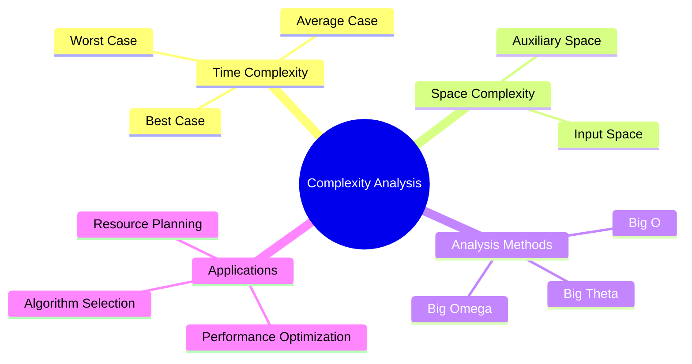

# Complexity Analysis

[Back to Course Content](README.md) | [Previous: Searching Algorithms](searching.md) | [Next: Recursion →](recursion.md)

> Reference: This content is based on Complexity-analysis.pdf and Algorithm-analysis.pdf

## What is Complexity Analysis?

Complexity analysis is the study of how the performance of an algorithm changes with the size of the input. It helps us understand the efficiency and scalability of algorithms.



## Big O Notation

### What is Big O?

Big O notation describes the upper bound of an algorithm's growth rate. It represents the worst-case scenario of an algorithm's performance.

### Common Time Complexities

1. **Constant Time - O(1)**
   ```java
   public int getFirst(int[] arr) {
       return arr[0];
   }
   ```

2. **Logarithmic Time - O(log n)**
   ```java
   public int binarySearch(int[] arr, int target) {
       int left = 0;
       int right = arr.length - 1;
       
       while (left <= right) {
           int mid = left + (right - left) / 2;
           if (arr[mid] == target) return mid;
           if (arr[mid] < target) left = mid + 1;
           else right = mid - 1;
       }
       return -1;
   }
   ```

3. **Linear Time - O(n)**
   ```java
   public int findMax(int[] arr) {
       int max = arr[0];
       for (int i = 1; i < arr.length; i++) {
           if (arr[i] > max) max = arr[i];
       }
       return max;
   }
   ```

4. **Linearithmic Time - O(n log n)**
   ```java
   public void mergeSort(int[] arr) {
       if (arr.length <= 1) return;
       int mid = arr.length / 2;
       int[] left = Arrays.copyOfRange(arr, 0, mid);
       int[] right = Arrays.copyOfRange(arr, mid, arr.length);
       mergeSort(left);
       mergeSort(right);
       merge(arr, left, right);
   }
   ```

5. **Quadratic Time - O(n²)**
   ```java
   public void bubbleSort(int[] arr) {
       for (int i = 0; i < arr.length - 1; i++) {
           for (int j = 0; j < arr.length - i - 1; j++) {
               if (arr[j] > arr[j + 1]) {
                   int temp = arr[j];
                   arr[j] = arr[j + 1];
                   arr[j + 1] = temp;
               }
           }
       }
   }
   ```

6. **Exponential Time - O(2ⁿ)**
   ```java
   public int fibonacci(int n) {
       if (n <= 1) return n;
       return fibonacci(n - 1) + fibonacci(n - 2);
   }
   ```

7. **Factorial Time - O(n!)**
   ```java
   public void generatePermutations(String str) {
       generatePermutationsHelper("", str);
   }

   private void generatePermutationsHelper(String prefix, String str) {
       int n = str.length();
       if (n == 0) {
           System.out.println(prefix);
           return;
       }
       for (int i = 0; i < n; i++) {
           generatePermutationsHelper(prefix + str.charAt(i),
               str.substring(0, i) + str.substring(i + 1));
       }
   }
   ```

## Space Complexity

### Types of Space Complexity

1. **Input Space**
   - Space required to store input data
   - Example: Array, matrix, graph

2. **Auxiliary Space**
   - Extra space used by algorithm
   - Example: Temporary variables, recursion stack

### Common Space Complexities

1. **Constant Space - O(1)**
   ```java
   public int sum(int[] arr) {
       int sum = 0;
       for (int num : arr) {
           sum += num;
       }
       return sum;
   }
   ```

2. **Linear Space - O(n)**
   ```java
   public int[] reverse(int[] arr) {
       int[] result = new int[arr.length];
       for (int i = 0; i < arr.length; i++) {
           result[i] = arr[arr.length - 1 - i];
       }
       return result;
   }
   ```

3. **Quadratic Space - O(n²)**
   ```java
   public int[][] transpose(int[][] matrix) {
       int rows = matrix.length;
       int cols = matrix[0].length;
       int[][] result = new int[cols][rows];
       for (int i = 0; i < rows; i++) {
           for (int j = 0; j < cols; j++) {
               result[j][i] = matrix[i][j];
           }
       }
       return result;
   }
   ```

## Analysis Methods

### 1. Big O (Upper Bound)

```java
// Example: O(n) algorithm
public boolean linearSearch(int[] arr, int target) {
    for (int num : arr) {
        if (num == target) return true;
    }
    return false;
}
```

### 2. Big Omega (Lower Bound)

```java
// Example: Ω(log n) algorithm
public int binarySearch(int[] arr, int target) {
    int left = 0;
    int right = arr.length - 1;
    while (left <= right) {
        int mid = left + (right - left) / 2;
        if (arr[mid] == target) return mid;
        if (arr[mid] < target) left = mid + 1;
        else right = mid - 1;
    }
    return -1;
}
```

### 3. Big Theta (Tight Bound)

```java
// Example: Θ(n) algorithm
public int sum(int[] arr) {
    int sum = 0;
    for (int num : arr) {
        sum += num;
    }
    return sum;
}
```

## Recurrence Relations

### Common Recurrence Relations

1. **Binary Search**
   ```
   T(n) = T(n/2) + c
   Solution: T(n) = O(log n)
   ```

2. **Merge Sort**
   ```
   T(n) = 2T(n/2) + n
   Solution: T(n) = O(n log n)
   ```

3. **Quick Sort (Average Case)**
   ```
   T(n) = T(n/2) + T(n/2) + n
   Solution: T(n) = O(n log n)
   ```

4. **Quick Sort (Worst Case)**
   ```
   T(n) = T(n-1) + n
   Solution: T(n) = O(n²)
   ```

## Amortized Analysis

### Methods of Amortized Analysis

1. **Aggregate Method**
   ```java
   // Example: Dynamic Array
   public class DynamicArray {
       private int[] arr;
       private int size;
       private int capacity;

       public DynamicArray() {
           capacity = 1;
           arr = new int[capacity];
           size = 0;
       }

       public void push(int x) {
           if (size == capacity) {
               int[] newArr = new int[2 * capacity];
               for (int i = 0; i < size; i++) {
                   newArr[i] = arr[i];
               }
               arr = newArr;
               capacity *= 2;
           }
           arr[size++] = x;
       }
   }
   ```

2. **Accounting Method**
   ```java
   // Example: Stack with MultiPop
   public class Stack {
       private int[] arr;
       private int top;

       public void multiPop(int k) {
           while (!isEmpty() && k > 0) {
               pop();
               k--;
           }
       }
   }
   ```

3. **Potential Method**
   ```java
   // Example: Binary Counter
   public class BinaryCounter {
       private int[] counter;
       private int value;

       public void increment() {
           int i = 0;
           while (i < counter.length && counter[i] == 1) {
               counter[i] = 0;
               i++;
           }
           if (i < counter.length) {
               counter[i] = 1;
           }
       }
   }
   ```

## Best Practices

1. **Analysis Process**
   - Identify input size
   - Count basic operations
   - Express as function of input size
   - Find asymptotic behavior
   - Consider all cases

2. **Implementation**
   - Choose appropriate data structures
   - Optimize critical paths
   - Consider memory constraints
   - Handle edge cases

3. **Documentation**
   - Document complexity
   - Explain assumptions
   - Provide examples
   - Include edge cases

## Common Pitfalls

1. **Analysis Mistakes**
   - Ignoring constants
   - Confusing cases
   - Missing terms
   - Incorrect bounds

2. **Implementation Issues**
   - Inefficient operations
   - Memory leaks
   - Unnecessary copies
   - Poor data structures

3. **Optimization Problems**
   - Premature optimization
   - Over-optimization
   - Wrong metrics
   - Ignoring trade-offs

## Exercises

1. Analyze the complexity of a given algorithm
2. Solve recurrence relations
3. Perform amortized analysis
4. Compare algorithm complexities
5. Optimize given code

## Additional Resources

- [GeeksforGeeks - Complexity Analysis](https://www.geeksforgeeks.org/analysis-of-algorithms-set-1-asymptotic-analysis/)
- [Big O Cheat Sheet](https://www.bigocheatsheet.com/)
- [Algorithm Analysis](https://www.cs.cmu.edu/~adamchik/15-121/lectures/Algorithmic%20Complexity/complexity.html)
- [Complexity Analysis Guide](https://www.programiz.com/dsa/algorithm-complexity) 