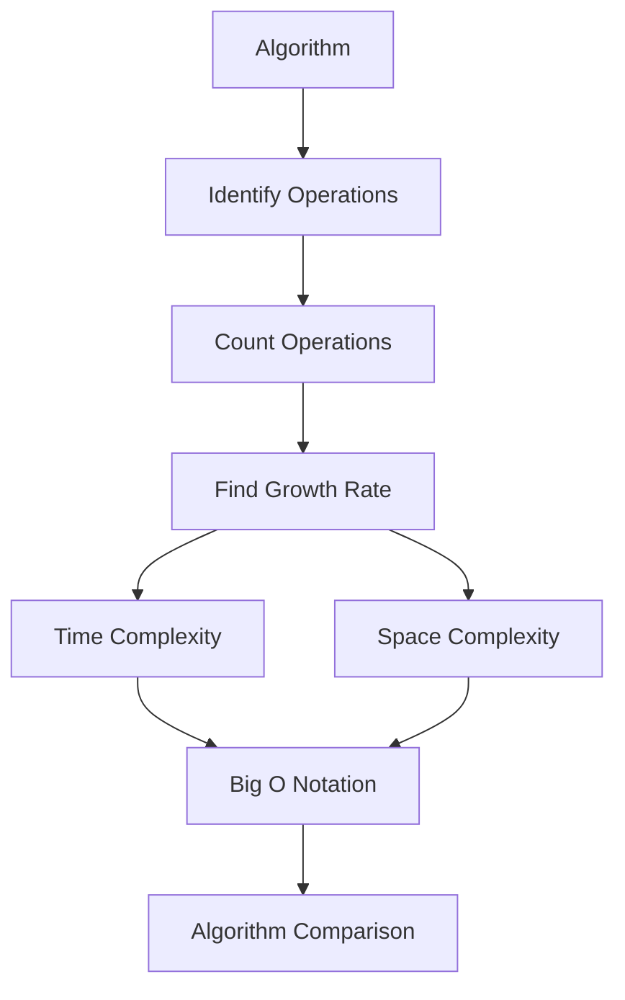

# Complexity Analysis

[Back to Course Content](README.md) | [← Previous: Dynamic Programming](dynamic-programming.md) | [Next: Concurrency →](concurrency.md)

## Introduction to Complexity Analysis

Complexity analysis is the study of how algorithms perform as their input size grows. It helps us understand the efficiency and scalability of algorithms.

### Complexity Analysis Process



### Key Concepts

| Concept | Description |
|---------|-------------|
| Time Complexity | How runtime grows with input size |
| Space Complexity | How memory usage grows with input size |
| Big O Notation | Upper bound of growth rate |
| Big Omega | Lower bound of growth rate |
| Big Theta | Tight bound of growth rate |
| Asymptotic Analysis | Analysis for large input sizes |

## Common Time Complexities

### 1. Constant Time O(1)

```java
public class ConstantTime {
    public static int getFirstElement(int[] arr) {
        return arr[0];
    }
    
    public static void swap(int a, int b) {
        int temp = a;
        a = b;
        b = temp;
    }
}
```

### 2. Logarithmic Time O(log n)

```java
public class BinarySearch {
    public static int binarySearch(int[] arr, int target) {
        int left = 0;
        int right = arr.length - 1;
        
        while (left <= right) {
            int mid = (left + right) / 2;
            if (arr[mid] == target) {
                return mid;
            } else if (arr[mid] > target) {
                right = mid - 1;
            } else {
                left = mid + 1;
            }
        }
        return -1;
    }
}
```

### 3. Linear Time O(n)

```java
public class LinearTime {
    public static int findMax(int[] arr) {
        int maxVal = arr[0];
        for (int num : arr) {
            if (num > maxVal) {
                maxVal = num;
            }
        }
        return maxVal;
    }
}
```

### 4. Linearithmic Time O(n log n)

```java
public class MergeSort {
    public static int[] mergeSort(int[] arr) {
        if (arr.length <= 1) {
            return arr;
        }
        
        int mid = arr.length / 2;
        int[] left = new int[mid];
        int[] right = new int[arr.length - mid];
        
        System.arraycopy(arr, 0, left, 0, mid);
        System.arraycopy(arr, mid, right, 0, arr.length - mid);
        
        left = mergeSort(left);
        right = mergeSort(right);
        
        return merge(left, right);
    }
    
    private static int[] merge(int[] left, int[] right) {
        int[] result = new int[left.length + right.length];
        int i = 0, j = 0, k = 0;
        
        while (i < left.length && j < right.length) {
            if (left[i] <= right[j]) {
                result[k++] = left[i++];
            } else {
                result[k++] = right[j++];
            }
        }
        
        while (i < left.length) {
            result[k++] = left[i++];
        }
        
        while (j < right.length) {
            result[k++] = right[j++];
        }
        
        return result;
    }
}
```

### 5. Quadratic Time O(n²)

```java
public class BubbleSort {
    public static void bubbleSort(int[] arr) {
        int n = arr.length;
        for (int i = 0; i < n; i++) {
            for (int j = 0; j < n - i - 1; j++) {
                if (arr[j] > arr[j + 1]) {
                    int temp = arr[j];
                    arr[j] = arr[j + 1];
                    arr[j + 1] = temp;
                }
            }
        }
    }
}
```

### 6. Exponential Time O(2ⁿ)

```java
public class Fibonacci {
    public static int fibonacciRecursive(int n) {
        if (n <= 1) {
            return n;
        }
        return fibonacciRecursive(n-1) + fibonacciRecursive(n-2);
    }
}
```

## Space Complexity Analysis

### 1. Constant Space O(1)

```java
public class ConstantSpace {
    public static int sumArray(int[] arr) {
        int total = 0;
        for (int num : arr) {
            total += num;
        }
        return total;
    }
}
```

### 2. Linear Space O(n)

```java
public class LinearSpace {
    public static int[] reverseArray(int[] arr) {
        int[] result = new int[arr.length];
        for (int i = 0; i < arr.length; i++) {
            result[i] = arr[arr.length - 1 - i];
        }
        return result;
    }
}
```

### 3. Quadratic Space O(n²)

```java
public class QuadraticSpace {
    public static int[][] createMatrix(int n) {
        return new int[n][n];
    }
}
```

## Complexity Analysis Techniques

### 1. Counting Operations

```java
public class OperationCounter {
    public static int countOperations(int[] arr) {
        int n = arr.length;
        int operations = 0;
        
        for (int i = 0; i < n; i++) {
            operations++; // Loop iteration
            for (int j = 0; j < n; j++) {
                operations++; // Inner loop iteration
                if (arr[i] > arr[j]) {
                    operations++; // Comparison
                    operations++; // Swap
                }
            }
        }
        
        return operations;
    }
}
```

### 2. Recurrence Relations

```java
public class RecurrenceRelations {
    public static int solveRecurrence(int n) {
        if (n <= 1) {
            return 1;
        }
        return 2 * solveRecurrence(n/2) + n;
    }
}
```

### 3. Master Theorem

```java
public class MasterTheorem {
    public static int masterTheoremExample(int n) {
        if (n <= 1) {
            return 1;
        }
        return 4 * masterTheoremExample(n/2) + n;
    }
}
```

## Real-World Applications

### 1. Algorithm Selection
- Choosing appropriate algorithms
- Performance optimization
- Resource allocation
- System design

### 2. System Design
- Scalability planning
- Resource estimation
- Performance tuning
- Load balancing

### 3. Code Optimization
- Identifying bottlenecks
- Improving efficiency
- Reducing memory usage
- Enhancing performance

### 4. Problem Solving
- Algorithm design
- Solution comparison
- Performance prediction
- Resource management

## Implementation Considerations

### Memory Management
1. Space-time tradeoffs
2. Memory allocation
3. Cache utilization
4. Garbage collection

### Performance Optimization
1. Algorithm selection
2. Data structure choice
3. Implementation details
4. Hardware utilization

## Best Practices

### Analysis
1. Identify key operations
2. Count operations
3. Find growth rate
4. Consider worst case

### Implementation
1. Choose efficient algorithms
2. Optimize space usage
3. Consider tradeoffs
4. Profile performance

## Summary

Key points to remember:
1. Analyze growth rates
2. Consider worst cases
3. Compare algorithms
4. Optimize resources
5. Balance tradeoffs
6. Profile performance

By understanding complexity analysis, you can:
- Choose efficient algorithms
- Optimize performance
- Design scalable systems
- Solve complex problems
- Manage resources
- Improve code quality 