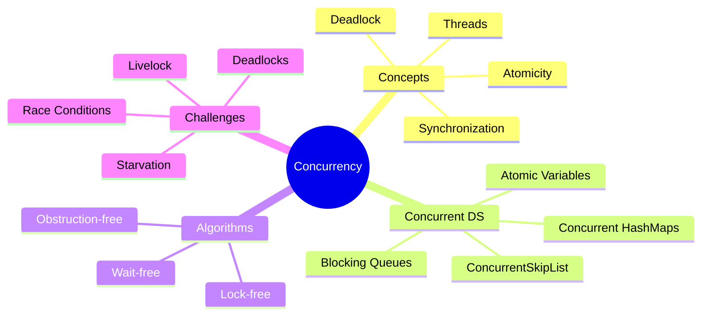

# Concurrency in Data Structures and Algorithms

[Back to Course Content](README.md) | [Previous: Greedy Algorithms](greedy-algorithms.md)

> Reference: This content is based on Concurrency.pdf

## What is Concurrency?

Concurrency in data structures and algorithms refers to the design and implementation of data structures and algorithms that work correctly and efficiently in a concurrent environment where multiple operations can occur simultaneously.



## Concurrency Fundamentals

### 1. Thread Safety

Thread safety refers to the property of code to function correctly when accessed by multiple threads simultaneously.

```java
// Example: Non-thread-safe counter
public class NonThreadSafeCounter {
    private int count = 0;
    
    public void increment() {
        count++;  // Not atomic operation
    }
    
    public int getCount() {
        return count;
    }
}

// Example: Thread-safe counter
public class ThreadSafeCounter {
    private AtomicInteger count = new AtomicInteger(0);
    
    public void increment() {
        count.incrementAndGet();  // Atomic operation
    }
    
    public int getCount() {
        return count.get();
    }
}
```

### 2. Synchronization Mechanisms

Synchronization ensures that only one thread can access a critical section of code at a time.

#### Intrinsic Locks (Synchronized)

```java
public class SynchronizedCounter {
    private int count = 0;
    
    public synchronized void increment() {
        count++;
    }
    
    public synchronized int getCount() {
        return count;
    }
    
    // Alternative synchronized block approach
    public void incrementWithBlock() {
        synchronized(this) {
            count++;
        }
    }
}
```

#### Explicit Locks

```java
import java.util.concurrent.locks.Lock;
import java.util.concurrent.locks.ReentrantLock;

public class ExplicitLockCounter {
    private int count = 0;
    private final Lock lock = new ReentrantLock();
    
    public void increment() {
        lock.lock();
        try {
            count++;
        } finally {
            lock.unlock();  // Always unlock in finally block
        }
    }
    
    public int getCount() {
        lock.lock();
        try {
            return count;
        } finally {
            lock.unlock();
        }
    }
}
```

#### Read-Write Locks

```java
import java.util.concurrent.locks.ReadWriteLock;
import java.util.concurrent.locks.ReentrantReadWriteLock;

public class ReadWriteCounter {
    private int count = 0;
    private final ReadWriteLock lock = new ReentrantReadWriteLock();
    
    public void increment() {
        lock.writeLock().lock();
        try {
            count++;
        } finally {
            lock.writeLock().unlock();
        }
    }
    
    public int getCount() {
        lock.readLock().lock();
        try {
            return count;
        } finally {
            lock.readLock().unlock();
        }
    }
}
```

### 3. Atomic Operations

Atomic operations are executed as a single, indivisible unit.

```java
import java.util.concurrent.atomic.*;

public class AtomicOperationsExample {
    private AtomicInteger atomicInt = new AtomicInteger(0);
    private AtomicLong atomicLong = new AtomicLong(0);
    private AtomicBoolean atomicBool = new AtomicBoolean(false);
    private AtomicReference<String> atomicRef = new AtomicReference<>("initial");
    
    public void demonstrateOperations() {
        // Basic operations
        atomicInt.incrementAndGet();  // Increment and get result
        atomicInt.getAndIncrement();  // Get and then increment
        atomicInt.addAndGet(5);       // Add 5 and get result
        
        // Compare and set
        atomicBool.compareAndSet(false, true);  // Set only if current value is false
        
        // Update operations
        atomicRef.updateAndGet(s -> s + " updated");  // Apply function atomically
    }
}
```

## Concurrent Data Structures

### 1. Concurrent Collections

#### ConcurrentHashMap

```java
import java.util.concurrent.ConcurrentHashMap;

public class ConcurrentHashMapExample {
    private ConcurrentHashMap<String, Integer> map = new ConcurrentHashMap<>();
    
    public void demonstrateOperations() {
        // Basic operations are thread-safe
        map.put("key1", 1);
        map.putIfAbsent("key2", 2);  // Only put if key doesn't exist
        
        // Atomic compute operations
        map.compute("key1", (k, v) -> v == null ? 1 : v + 1);
        
        // Atomic update
        map.computeIfPresent("key1", (k, v) -> v + 10);
        
        // Specialized operations
        map.forEach(8, (k, v) -> System.out.println(k + ": " + v));
        map.reduce(8, (k, v) -> v, Integer::sum);  // Parallel reduction
    }
    
    public Integer getValueSafely(String key) {
        return map.getOrDefault(key, 0);  // Thread-safe get with default
    }
}
```

#### ConcurrentSkipListMap

```java
import java.util.concurrent.ConcurrentSkipListMap;

public class ConcurrentSkipListMapExample {
    private ConcurrentSkipListMap<String, Integer> map = new ConcurrentSkipListMap<>();
    
    public void demonstrateOperations() {
        // Thread-safe sorted map operations
        map.put("d", 4);
        map.put("a", 1);
        map.put("c", 3);
        map.put("b", 2);
        
        // NavigableMap operations (all thread-safe)
        String firstKey = map.firstKey();    // "a"
        String ceilingKey = map.ceilingKey("b.5");  // "c"
        
        // Range views
        map.subMap("b", "d").forEach((k, v) -> System.out.println(k + ": " + v));
    }
}
```

#### CopyOnWriteArrayList

```java
import java.util.concurrent.CopyOnWriteArrayList;

public class CopyOnWriteArrayListExample {
    private CopyOnWriteArrayList<String> list = new CopyOnWriteArrayList<>();
    
    public void demonstrateOperations() {
        // All modifications create a new copy of the array
        list.add("item1");
        list.add("item2");
        
        // Thread-safe traversal (no ConcurrentModificationException)
        for (String item : list) {
            System.out.println(item);
            // Safe to modify during iteration
            list.add("newItem");
        }
    }
}
```

### 2. Blocking Queues

```java
import java.util.concurrent.*;

public class BlockingQueueExample {
    // FIFO queue with blocking operations
    private BlockingQueue<String> linkedBlockingQueue = new LinkedBlockingQueue<>(100);
    
    // Priority queue with blocking operations
    private BlockingQueue<Task> priorityBlockingQueue = new PriorityBlockingQueue<>();
    
    // Blocking deque (double-ended queue)
    private BlockingDeque<String> linkedBlockingDeque = new LinkedBlockingDeque<>();
    
    public void producer() throws InterruptedException {
        // Blocks if queue is full
        linkedBlockingQueue.put("task");
        
        // Returns false instead of blocking if full
        boolean added = linkedBlockingQueue.offer("quick-task", 100, TimeUnit.MILLISECONDS);
    }
    
    public void consumer() throws InterruptedException {
        // Blocks if queue is empty
        String task = linkedBlockingQueue.take();
        
        // Returns null instead of blocking if empty
        String quickTask = linkedBlockingQueue.poll(100, TimeUnit.MILLISECONDS);
    }
    
    static class Task implements Comparable<Task> {
        private int priority;
        private String name;
        
        public Task(int priority, String name) {
            this.priority = priority;
            this.name = name;
        }
        
        @Override
        public int compareTo(Task other) {
            return Integer.compare(this.priority, other.priority);
        }
    }
}
```

### 3. Concurrent Data Structure Design Patterns

#### Thread-Safe Singleton

```java
// Double-checked locking pattern
public class ThreadSafeSingleton {
    private static volatile ThreadSafeSingleton instance;
    
    private ThreadSafeSingleton() {}
    
    public static ThreadSafeSingleton getInstance() {
        if (instance == null) {
            synchronized (ThreadSafeSingleton.class) {
                if (instance == null) {
                    instance = new ThreadSafeSingleton();
                }
            }
        }
        return instance;
    }
}

// Enum-based Singleton (thread-safe by definition)
public enum EnumSingleton {
    INSTANCE;
    
    public void doSomething() {
        // Implementation
    }
}
```

#### Producer-Consumer Pattern

```java
import java.util.concurrent.*;

public class ProducerConsumerExample {
    private BlockingQueue<String> queue = new ArrayBlockingQueue<>(10);
    
    class Producer implements Runnable {
        @Override
        public void run() {
            try {
                String product = produceItem();
                queue.put(product);
            } catch (InterruptedException e) {
                Thread.currentThread().interrupt();
            }
        }
        
        private String produceItem() {
            // Logic to produce an item
            return "Product";
        }
    }
    
    class Consumer implements Runnable {
        @Override
        public void run() {
            try {
                String product = queue.take();
                consumeItem(product);
            } catch (InterruptedException e) {
                Thread.currentThread().interrupt();
            }
        }
        
        private void consumeItem(String item) {
            // Logic to consume the item
        }
    }
}
```

## Concurrent Algorithm Design

### 1. Lock-Free Algorithms

Lock-free algorithms guarantee that at least one thread can make progress, regardless of the actions of other threads.

```java
import java.util.concurrent.atomic.AtomicReference;

public class LockFreeStack<T> {
    private AtomicReference<Node<T>> top = new AtomicReference<>(null);
    
    private static class Node<T> {
        private T value;
        private Node<T> next;
        
        public Node(T value, Node<T> next) {
            this.value = value;
            this.next = next;
        }
    }
    
    public void push(T value) {
        Node<T> newTop = new Node<>(value, null);
        while (true) {
            Node<T> currentTop = top.get();
            newTop.next = currentTop;
            if (top.compareAndSet(currentTop, newTop)) {
                return;
            }
        }
    }
    
    public T pop() {
        while (true) {
            Node<T> currentTop = top.get();
            if (currentTop == null) {
                return null;
            }
            Node<T> newTop = currentTop.next;
            if (top.compareAndSet(currentTop, newTop)) {
                return currentTop.value;
            }
        }
    }
}
```

### 2. Wait-Free Algorithms

Wait-free algorithms guarantee that every thread can complete its operation in a finite number of steps, regardless of the actions of other threads.

```java
import java.util.concurrent.atomic.AtomicInteger;
import java.util.concurrent.atomic.AtomicReferenceArray;

public class WaitFreeQueue<T> {
    private static final int CAPACITY = 1024;
    private AtomicReferenceArray<T> items = new AtomicReferenceArray<>(CAPACITY);
    private AtomicInteger head = new AtomicInteger(0);
    private AtomicInteger tail = new AtomicInteger(0);
    
    public boolean enqueue(T item) {
        int currentTail;
        do {
            currentTail = tail.get();
            int nextTail = (currentTail + 1) % CAPACITY;
            if (nextTail == head.get()) {
                return false;  // Queue is full
            }
            if (tail.compareAndSet(currentTail, nextTail)) {
                items.set(currentTail, item);
                return true;
            }
        } while (true);
    }
    
    public T dequeue() {
        int currentHead;
        do {
            currentHead = head.get();
            if (currentHead == tail.get()) {
                return null;  // Queue is empty
            }
            T item = items.get(currentHead);
            int nextHead = (currentHead + 1) % CAPACITY;
            if (head.compareAndSet(currentHead, nextHead)) {
                items.set(currentHead, null);
                return item;
            }
        } while (true);
    }
}
```

### 3. Obstruction-Free Algorithms

Obstruction-free algorithms guarantee progress only when a thread runs in isolation (without contention from other threads).

```java
import java.util.concurrent.atomic.AtomicReference;

public class ObstructionFreeHashTable<K, V> {
    private static final int CAPACITY = 16;
    private AtomicReference<Node<K, V>>[] table;
    
    public ObstructionFreeHashTable() {
        table = new AtomicReference[CAPACITY];
        for (int i = 0; i < CAPACITY; i++) {
            table[i] = new AtomicReference<>(null);
        }
    }
    
    private static class Node<K, V> {
        final K key;
        final V value;
        final Node<K, V> next;
        
        Node(K key, V value, Node<K, V> next) {
            this.key = key;
            this.value = value;
            this.next = next;
        }
    }
    
    public V put(K key, V value) {
        int hash = key.hashCode() % CAPACITY;
        while (true) {
            Node<K, V> current = table[hash].get();
            // Check if key already exists
            Node<K, V> head = current;
            while (head != null) {
                if (head.key.equals(key)) {
                    return head.value;
                }
                head = head.next;
            }
            // Key doesn't exist, add new node
            Node<K, V> newNode = new Node<>(key, value, current);
            if (table[hash].compareAndSet(current, newNode)) {
                return null;
            }
            // If CAS fails, retry
        }
    }
    
    public V get(K key) {
        int hash = key.hashCode() % CAPACITY;
        Node<K, V> current = table[hash].get();
        while (current != null) {
            if (current.key.equals(key)) {
                return current.value;
            }
            current = current.next;
        }
        return null;
    }
}
```

## Concurrency Challenges and Solutions

### 1. Race Conditions

A race condition occurs when the behavior of a program depends on the relative timing of events.

```java
// Race condition example
public class RaceConditionExample {
    private int counter = 0;
    
    public void incrementByMany(int times) {
        for (int i = 0; i < times; i++) {
            counter++;  // Race condition here
        }
    }
    
    // Solution 1: Using synchronized
    public synchronized void synchronizedIncrement(int times) {
        for (int i = 0; i < times; i++) {
            counter++;
        }
    }
    
    // Solution 2: Using AtomicInteger
    private AtomicInteger atomicCounter = new AtomicInteger(0);
    
    public void atomicIncrement(int times) {
        for (int i = 0; i < times; i++) {
            atomicCounter.incrementAndGet();
        }
    }
}
```

### 2. Deadlocks

A deadlock occurs when two or more threads are blocked forever, each waiting for the other to release a lock.

```java
// Deadlock example
public class DeadlockExample {
    private final Object lock1 = new Object();
    private final Object lock2 = new Object();
    
    public void method1() {
        synchronized (lock1) {
            System.out.println("Method 1 acquired lock1");
            try {
                Thread.sleep(100);
            } catch (InterruptedException e) {
                Thread.currentThread().interrupt();
            }
            
            synchronized (lock2) {
                System.out.println("Method 1 acquired lock2");
            }
        }
    }
    
    public void method2() {
        synchronized (lock2) {
            System.out.println("Method 2 acquired lock2");
            try {
                Thread.sleep(100);
            } catch (InterruptedException e) {
                Thread.currentThread().interrupt();
            }
            
            synchronized (lock1) {
                System.out.println("Method 2 acquired lock1");
            }
        }
    }
    
    // Solution: Always acquire locks in the same order
    public void fixedMethod2() {
        synchronized (lock1) {
            System.out.println("Fixed Method 2 acquired lock1");
            
            synchronized (lock2) {
                System.out.println("Fixed Method 2 acquired lock2");
            }
        }
    }
}
```

### 3. Livelock

A livelock occurs when threads keep changing their state in response to another thread's action, without making progress.

```java
// Livelock example
public class LivelockExample {
    static class Spoon {
        private Diner owner;
        
        public Spoon(Diner owner) {
            this.owner = owner;
        }
        
        public Diner getOwner() {
            return owner;
        }
        
        public void setOwner(Diner owner) {
            this.owner = owner;
        }
        
        public synchronized void use() {
            System.out.println(owner.name + " is eating!");
        }
    }
    
    static class Diner {
        private String name;
        private boolean isHungry;
        
        public Diner(String name) {
            this.name = name;
            this.isHungry = true;
        }
        
        public String getName() {
            return name;
        }
        
        public boolean isHungry() {
            return isHungry;
        }
        
        public void eatWith(Spoon spoon, Diner spouse) {
            while (isHungry) {
                // Don't have the spoon, so wait
                if (spoon.getOwner() != this) {
                    try {
                        Thread.sleep(1);
                    } catch (InterruptedException e) {
                        Thread.currentThread().interrupt();
                    }
                    continue;
                }
                
                // If spouse is hungry, offer the spoon
                if (spouse.isHungry()) {
                    System.out.println(name + ": You eat first, " + spouse.getName());
                    spoon.setOwner(spouse);
                    continue;
                }
                
                // Spouse wasn't hungry, so eat
                spoon.use();
                isHungry = false;
                spoon.setOwner(spouse);
            }
        }
    }
    
    // Solution: Add a random element or priority system
    public static void solutionToLivelock() {
        // Modify the eatWith method to break symmetry:
        // 1. Add a random delay before checking spouse's hunger
        // 2. Implement a priority system (e.g., based on name or ID)
        // 3. Use a timeout after which a diner eats regardless
    }
}
```

### 4. Starvation

Starvation occurs when a thread is unable to gain access to a shared resource and is unable to make progress.

```java
// Starvation example
public class StarvationExample {
    private static Object sharedObj = new Object();
    
    public static void main(String[] args) {
        // Greedy threads that hold lock for a long time
        for (int i = 0; i < 5; i++) {
            Thread greedyThread = new Thread(() -> {
                while (true) {
                    synchronized (sharedObj) {
                        // Hold the lock for a long time
                        try {
                            Thread.sleep(1000);
                        } catch (InterruptedException e) {
                            Thread.currentThread().interrupt();
                        }
                    }
                    // Small gap where lock is released
                    try {
                        Thread.sleep(10);
                    } catch (InterruptedException e) {
                        Thread.currentThread().interrupt();
                    }
                }
            });
            greedyThread.setDaemon(true);
            greedyThread.start();
        }
        
        // Starved thread
        Thread starvedThread = new Thread(() -> {
            while (true) {
                synchronized (sharedObj) {
                    System.out.println("Starved thread finally got the lock!");
                    try {
                        Thread.sleep(100);
                    } catch (InterruptedException e) {
                        Thread.currentThread().interrupt();
                    }
                }
            }
        });
        starvedThread.setDaemon(true);
        starvedThread.start();
    }
    
    // Solution: Use fair locks
    public static void fairLockSolution() {
        ReentrantLock fairLock = new ReentrantLock(true);  // true for fair ordering
        
        Runnable fairWorker = () -> {
            while (true) {
                fairLock.lock();
                try {
                    // Critical section
                    System.out.println(Thread.currentThread().getName() + " got the lock");
                    Thread.sleep(100);
                } catch (InterruptedException e) {
                    Thread.currentThread().interrupt();
                } finally {
                    fairLock.unlock();
                }
                
                // Non-critical section
                try {
                    Thread.sleep(10);
                } catch (InterruptedException e) {
                    Thread.currentThread().interrupt();
                }
            }
        };
    }
}
```

## Performance Optimization for Concurrent Programs

### 1. Lock Granularity

```java
// Fine-grained locking example
public class StripedHashMap<K, V> {
    private static final int NUM_STRIPES = 16;
    private final Object[] locks;
    private final Map<K, V>[] stripes;
    
    @SuppressWarnings("unchecked")
    public StripedHashMap() {
        locks = new Object[NUM_STRIPES];
        stripes = new HashMap[NUM_STRIPES];
        for (int i = 0; i < NUM_STRIPES; i++) {
            locks[i] = new Object();
            stripes[i] = new HashMap<>();
        }
    }
    
    private int stripeFor(K key) {
        return Math.abs(key.hashCode() % NUM_STRIPES);
    }
    
    public V get(K key) {
        int stripe = stripeFor(key);
        synchronized (locks[stripe]) {
            return stripes[stripe].get(key);
        }
    }
    
    public void put(K key, V value) {
        int stripe = stripeFor(key);
        synchronized (locks[stripe]) {
            stripes[stripe].put(key, value);
        }
    }
}
```

### 2. Lock-Free Techniques

```java
// Using AtomicReference for lock-free updates
public class LockFreeList<T> {
    private static class Node<T> {
        final T item;
        final AtomicReference<Node<T>> next;
        
        Node(T item, Node<T> next) {
            this.item = item;
            this.next = new AtomicReference<>(next);
        }
    }
    
    private final Node<T> head = new Node<>(null, null);
    
    public boolean add(T item) {
        Node<T> newNode = new Node<>(item, null);
        Node<T> current = head;
        Node<T> next;
        
        while (true) {
            next = current.next.get();
            if (next == null) {
                if (current.next.compareAndSet(null, newNode)) {
                    return true;
                }
            } else {
                current = next;
            }
        }
    }
}
```

### 3. Thread Pooling

```java
import java.util.concurrent.*;

public class ThreadPoolExample {
    // Fixed size thread pool
    private ExecutorService fixedPool = Executors.newFixedThreadPool(5);
    
    // Cached thread pool that expands as needed
    private ExecutorService cachedPool = Executors.newCachedThreadPool();
    
    // Scheduled thread pool for delayed or periodic tasks
    private ScheduledExecutorService scheduledPool = Executors.newScheduledThreadPool(3);
    
    // Work-stealing pool for optimal processing (Java 7+)
    private ExecutorService workStealingPool = Executors.newWorkStealingPool();
    
    public void executeTask(Runnable task) {
        fixedPool.execute(task);
    }
    
    public <T> Future<T> submitCallableTask(Callable<T> task) {
        return fixedPool.submit(task);
    }
    
    public void scheduleTask(Runnable task) {
        // Run after 5 seconds
        scheduledPool.schedule(task, 5, TimeUnit.SECONDS);
        
        // Run every 10 seconds, after an initial delay of 1 second
        scheduledPool.scheduleAtFixedRate(task, 1, 10, TimeUnit.SECONDS);
    }
    
    // Don't forget to shutdown pools when done
    public void shutdown() {
        fixedPool.shutdown();
        cachedPool.shutdown();
        scheduledPool.shutdown();
        workStealingPool.shutdown();
    }
}
```

## Concurrent Data Structure Testing

### 1. Testing Strategies

```java
import org.junit.Test;
import java.util.concurrent.*;
import static org.junit.Assert.*;

public class ConcurrentDataStructureTest {
    private static final int THREAD_COUNT = 10;
    private static final int OPERATIONS_PER_THREAD = 1000;
    
    @Test
    public void testThreadSafeCounter() throws InterruptedException {
        ThreadSafeCounter counter = new ThreadSafeCounter();
        CountDownLatch latch = new CountDownLatch(THREAD_COUNT);
        
        for (int i = 0; i < THREAD_COUNT; i++) {
            new Thread(() -> {
                for (int j = 0; j < OPERATIONS_PER_THREAD; j++) {
                    counter.increment();
                }
                latch.countDown();
            }).start();
        }
        
        latch.await();
        assertEquals(THREAD_COUNT * OPERATIONS_PER_THREAD, counter.getCount());
    }
    
    @Test
    public void testConcurrentHashMap() throws InterruptedException {
        ConcurrentHashMap<Integer, String> map = new ConcurrentHashMap<>();
        CountDownLatch latch = new CountDownLatch(THREAD_COUNT);
        
        for (int i = 0; i < THREAD_COUNT; i++) {
            final int threadId = i;
            new Thread(() -> {
                for (int j = 0; j < OPERATIONS_PER_THREAD; j++) {
                    int key = threadId * OPERATIONS_PER_THREAD + j;
                    map.put(key, "Value-" + key);
                }
                latch.countDown();
            }).start();
        }
        
        latch.await();
        assertEquals(THREAD_COUNT * OPERATIONS_PER_THREAD, map.size());
    }
}
```

### 2. Stress Testing

```java
public class StressTest {
    private static final int DURATION_SECONDS = 10;
    
    public void stressTestQueue(BlockingQueue<Integer> queue) throws InterruptedException {
        // Create producer threads
        Thread[] producers = new Thread[Runtime.getRuntime().availableProcessors()];
        for (int i = 0; i < producers.length; i++) {
            producers[i] = new Thread(() -> {
                try {
                    int counter = 0;
                    while (!Thread.interrupted()) {
                        queue.put(counter++);
                    }
                } catch (InterruptedException e) {
                    Thread.currentThread().interrupt();
                }
            });
            producers[i].start();
        }
        
        // Create consumer threads
        Thread[] consumers = new Thread[Runtime.getRuntime().availableProcessors()];
        for (int i = 0; i < consumers.length; i++) {
            consumers[i] = new Thread(() -> {
                try {
                    while (!Thread.interrupted()) {
                        queue.take();
                    }
                } catch (InterruptedException e) {
                    Thread.currentThread().interrupt();
                }
            });
            consumers[i].start();
        }
        
        // Let them run for a while
        Thread.sleep(DURATION_SECONDS * 1000);
        
        // Interrupt all threads
        for (Thread t : producers) t.interrupt();
        for (Thread t : consumers) t.interrupt();
        
        // Wait for all threads to finish
        for (Thread t : producers) t.join();
        for (Thread t : consumers) t.join();
    }
}
```

## Best Practices

1. **Thread Safety**
   - Make classes immutable when possible
   - Minimize shared state and synchronization
   - Use thread-safe collections from `java.util.concurrent`
   - Document thread safety guarantees

2. **Lock Management**
   - Keep lock scope as small as possible
   - Be consistent with lock ordering to prevent deadlocks
   - Use `try-finally` blocks to ensure locks are released
   - Consider using `ReentrantReadWriteLock` for read-heavy workloads

3. **Performance**
   - Use fine-grained locking when possible
   - Consider lock-free algorithms for high contention
   - Avoid blocking operations in critical sections
   - Use atomics instead of locks for simple operations

4. **Design Patterns**
   - Use immutable objects for thread safety
   - Apply the monitor pattern for thread-safe objects
   - Consider the producer-consumer pattern for workload distribution
   - Use thread pools for managing thread lifecycle

## Common Pitfalls

1. **Synchronization Issues**
   - Insufficient synchronization
   - Over-synchronization
   - Incorrect lock ordering
   - Missed unlock operations

2. **Concurrency Bugs**
   - Race conditions
   - Deadlocks
   - Livelocks
   - Thread starvation

3. **Performance Problems**
   - Excessive contention
   - Lock convoy
   - Thread thrashing
   - Poor scalability

4. **Testing Challenges**
   - Difficult to reproduce concurrency bugs
   - Non-deterministic behavior
   - Timing-dependent issues
   - Complex test setup required

## Exercises

1. Implement a thread-safe counter using different synchronization mechanisms
2. Create a producer-consumer solution using a BlockingQueue
3. Develop a concurrent cache with support for expiration
4. Implement a lock-free stack or queue
5. Design a concurrent hash map with stripe locking
6. Create a thread pool with custom work stealing

## Additional Resources

- [Java Concurrency in Practice](https://jcip.net/)
- [The Art of Multiprocessor Programming](https://dl.acm.org/doi/book/10.5555/2385452)
- [Java Concurrency Utilities](https://docs.oracle.com/javase/tutorial/essential/concurrency/)
- [Doug Lea's Homepage](http://gee.cs.oswego.edu/) 