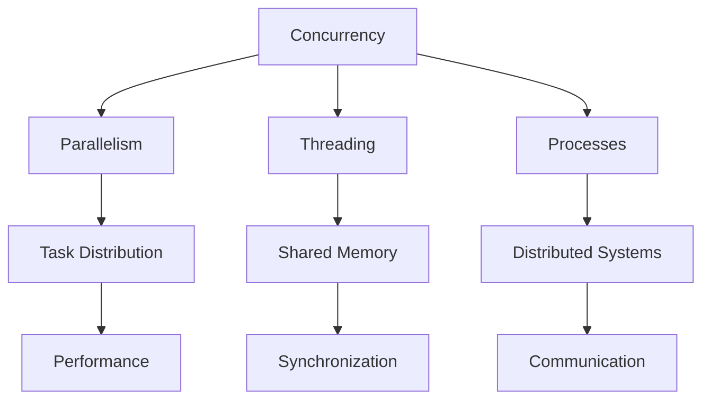

# Concurrency

[Back to Course Content](README.md) | [← Previous: Complexity Analysis](complexity-analysis.md)

## Introduction to Concurrency

Concurrency is the ability of a system to handle multiple tasks simultaneously. It involves managing multiple threads or processes to improve performance and responsiveness.

### Concurrency Concepts



### Key Concepts

| Concept | Description |
|---------|-------------|
| Thread | Lightweight unit of execution |
| Process | Independent program execution |
| Race Condition | Unpredictable behavior from concurrent access |
| Deadlock | Circular waiting for resources |
| Synchronization | Coordinating thread access |
| Mutex | Mutual exclusion lock |
| Semaphore | Resource counter |
| Barrier | Thread synchronization point |

## Concurrent Data Structures

### 1. Thread-Safe Stack

```java
import java.util.Stack;
import java.util.concurrent.locks.Lock;
import java.util.concurrent.locks.ReentrantLock;

public class ThreadSafeStack<T> {
    private Stack<T> stack;
    private Lock lock;
    
    public ThreadSafeStack() {
        stack = new Stack<>();
        lock = new ReentrantLock();
    }
    
    public void push(T item) {
        lock.lock();
        try {
            stack.push(item);
        } finally {
            lock.unlock();
        }
    }
    
    public T pop() {
        lock.lock();
        try {
            return stack.isEmpty() ? null : stack.pop();
        } finally {
            lock.unlock();
        }
    }
    
    public T peek() {
        lock.lock();
        try {
            return stack.isEmpty() ? null : stack.peek();
        } finally {
            lock.unlock();
        }
    }
}
```

### 2. Thread-Safe Queue

```java
import java.util.concurrent.BlockingQueue;
import java.util.concurrent.LinkedBlockingQueue;
import java.util.concurrent.locks.Lock;
import java.util.concurrent.locks.ReentrantLock;

public class ThreadSafeQueue<T> {
    private BlockingQueue<T> queue;
    private Lock lock;
    
    public ThreadSafeQueue() {
        queue = new LinkedBlockingQueue<>();
        lock = new ReentrantLock();
    }
    
    public void enqueue(T item) {
        lock.lock();
        try {
            queue.offer(item);
        } finally {
            lock.unlock();
        }
    }
    
    public T dequeue() {
        lock.lock();
        try {
            return queue.poll();
        } finally {
            lock.unlock();
        }
    }
    
    public boolean isEmpty() {
        lock.lock();
        try {
            return queue.isEmpty();
        } finally {
            lock.unlock();
        }
    }
}
```

### 3. Concurrent Hash Map

```java
import java.util.ArrayList;
import java.util.List;
import java.util.concurrent.locks.Lock;
import java.util.concurrent.locks.ReentrantLock;

public class ConcurrentHashMap<K, V> {
    private List<List<Entry<K, V>>> buckets;
    private Lock[] locks;
    
    public ConcurrentHashMap(int size) {
        buckets = new ArrayList<>(size);
        locks = new Lock[size];
        
        for (int i = 0; i < size; i++) {
            buckets.add(new ArrayList<>());
            locks[i] = new ReentrantLock();
        }
    }
    
    private int hash(K key) {
        return Math.abs(key.hashCode() % buckets.size());
    }
    
    public void put(K key, V value) {
        int index = hash(key);
        locks[index].lock();
        try {
            List<Entry<K, V>> bucket = buckets.get(index);
            for (int i = 0; i < bucket.size(); i++) {
                Entry<K, V> entry = bucket.get(i);
                if (entry.key.equals(key)) {
                    bucket.set(i, new Entry<>(key, value));
                    return;
                }
            }
            bucket.add(new Entry<>(key, value));
        } finally {
            locks[index].unlock();
        }
    }
    
    public V get(K key) {
        int index = hash(key);
        locks[index].lock();
        try {
            List<Entry<K, V>> bucket = buckets.get(index);
            for (Entry<K, V> entry : bucket) {
                if (entry.key.equals(key)) {
                    return entry.value;
                }
            }
            return null;
        } finally {
            locks[index].unlock();
        }
    }
    
    private static class Entry<K, V> {
        K key;
        V value;
        
        Entry(K key, V value) {
            this.key = key;
            this.value = value;
        }
    }
}
```

## Parallel Algorithms

### 1. Parallel Merge Sort

```java
import java.util.concurrent.ExecutorService;
import java.util.concurrent.Executors;
import java.util.concurrent.Future;

public class ParallelMergeSort {
    public static int[] parallelMergeSort(int[] arr) {
        if (arr.length <= 1) {
            return arr;
        }
        
        int mid = arr.length / 2;
        int[] left = new int[mid];
        int[] right = new int[arr.length - mid];
        
        System.arraycopy(arr, 0, left, 0, mid);
        System.arraycopy(arr, mid, right, 0, arr.length - mid);
        
        ExecutorService executor = Executors.newFixedThreadPool(2);
        Future<int[]> leftFuture = executor.submit(() -> parallelMergeSort(left));
        Future<int[]> rightFuture = executor.submit(() -> parallelMergeSort(right));
        
        try {
            left = leftFuture.get();
            right = rightFuture.get();
        } catch (Exception e) {
            e.printStackTrace();
        } finally {
            executor.shutdown();
        }
        
        return merge(left, right);
    }
    
    private static int[] merge(int[] left, int[] right) {
        int[] result = new int[left.length + right.length];
        int i = 0, j = 0, k = 0;
        
        while (i < left.length && j < right.length) {
            if (left[i] <= right[j]) {
                result[k++] = left[i++];
            } else {
                result[k++] = right[j++];
            }
        }
        
        while (i < left.length) {
            result[k++] = left[i++];
        }
        
        while (j < right.length) {
            result[k++] = right[j++];
        }
        
        return result;
    }
}
```

### 2. Parallel Matrix Multiplication

```java
import java.util.concurrent.ExecutorService;
import java.util.concurrent.Executors;

public class ParallelMatrixMultiplication {
    public static double[][] parallelMatrixMultiply(double[][] A, double[][] B) {
        int n = A.length;
        double[][] result = new double[n][n];
        
        ExecutorService executor = Executors.newFixedThreadPool(n);
        
        for (int i = 0; i < n; i++) {
            final int row = i;
            executor.submit(() -> {
                for (int j = 0; j < n; j++) {
                    for (int k = 0; k < n; k++) {
                        result[row][j] += A[row][k] * B[k][j];
                    }
                }
            });
        }
        
        executor.shutdown();
        return result;
    }
}
```

### 3. Parallel Quick Sort

```java
import java.util.concurrent.ExecutorService;
import java.util.concurrent.Executors;
import java.util.concurrent.Future;
import java.util.List;
import java.util.ArrayList;

public class ParallelQuickSort {
    public static List<Integer> parallelQuickSort(List<Integer> arr) {
        if (arr.size() <= 1) {
            return arr;
        }
        
        int pivot = arr.get(arr.size() / 2);
        List<Integer> left = new ArrayList<>();
        List<Integer> middle = new ArrayList<>();
        List<Integer> right = new ArrayList<>();
        
        for (int x : arr) {
            if (x < pivot) {
                left.add(x);
            } else if (x == pivot) {
                middle.add(x);
            } else {
                right.add(x);
            }
        }
        
        ExecutorService executor = Executors.newFixedThreadPool(2);
        Future<List<Integer>> leftFuture = executor.submit(() -> parallelQuickSort(left));
        Future<List<Integer>> rightFuture = executor.submit(() -> parallelQuickSort(right));
        
        try {
            left = leftFuture.get();
            right = rightFuture.get();
        } catch (Exception e) {
            e.printStackTrace();
        } finally {
            executor.shutdown();
        }
        
        List<Integer> result = new ArrayList<>();
        result.addAll(left);
        result.addAll(middle);
        result.addAll(right);
        return result;
    }
}
```

## Synchronization Mechanisms

### 1. Mutex Implementation

```java
import java.util.concurrent.locks.Lock;
import java.util.concurrent.locks.ReentrantLock;

public class Mutex {
    private Lock lock;
    private Long owner;
    
    public Mutex() {
        lock = new ReentrantLock();
        owner = null;
    }
    
    public boolean acquire(long threadId) {
        if (lock.tryLock()) {
            owner = threadId;
            return true;
        }
        return false;
    }
    
    public boolean release(long threadId) {
        if (owner != null && owner == threadId) {
            owner = null;
            lock.unlock();
            return true;
        }
        return false;
    }
}
```

### 2. Semaphore Implementation

```java
import java.util.concurrent.locks.Lock;
import java.util.concurrent.locks.ReentrantLock;
import java.util.concurrent.locks.Condition;

public class Semaphore {
    private int value;
    private Lock lock;
    private Condition condition;
    
    public Semaphore(int value) {
        this.value = value;
        lock = new ReentrantLock();
        condition = lock.newCondition();
    }
    
    public void acquire() {
        lock.lock();
        try {
            while (value == 0) {
                condition.await();
            }
            value--;
        } catch (InterruptedException e) {
            Thread.currentThread().interrupt();
        } finally {
            lock.unlock();
        }
    }
    
    public void release() {
        lock.lock();
        try {
            value++;
            condition.signal();
        } finally {
            lock.unlock();
        }
    }
}
```

### 3. Barrier Implementation

```java
import java.util.concurrent.locks.Lock;
import java.util.concurrent.locks.ReentrantLock;
import java.util.concurrent.locks.Condition;

public class Barrier {
    private int count;
    private int current;
    private Lock lock;
    private Condition condition;
    
    public Barrier(int count) {
        this.count = count;
        this.current = 0;
        lock = new ReentrantLock();
        condition = lock.newCondition();
    }
    
    public void wait() {
        lock.lock();
        try {
            current++;
            if (current == count) {
                condition.signalAll();
            } else {
                condition.await();
            }
        } catch (InterruptedException e) {
            Thread.currentThread().interrupt();
        } finally {
            lock.unlock();
        }
    }
}
```

## Real-World Applications

### 1. Web Servers
- Request handling
- Connection management
- Load balancing
- Resource sharing

### 2. Database Systems
- Transaction management
- Query processing
- Cache management
- Data consistency

### 3. Operating Systems
- Process scheduling
- Memory management
- I/O operations
- Resource allocation

### 4. Distributed Systems
- Data replication
- Fault tolerance
- Load distribution
- Network communication

## Implementation Considerations

### Memory Management
1. Thread safety
2. Memory leaks
3. Resource sharing
4. Cache coherence

### Performance Optimization
1. Thread pooling
2. Load balancing
3. Synchronization overhead
4. Scalability

## Best Practices

### Thread Safety
1. Use synchronization
2. Avoid deadlocks
3. Handle race conditions
4. Manage resources

### Implementation
1. Choose appropriate mechanisms
2. Minimize contention
3. Handle errors
4. Consider scalability

## Summary

Key points to remember:
1. Thread safety
2. Synchronization
3. Resource management
4. Performance optimization
5. Error handling
6. Scalability

By understanding concurrency, you can:
- Design parallel systems
- Handle multiple tasks
- Improve performance
- Manage resources
- Build scalable applications
- Solve complex problems 