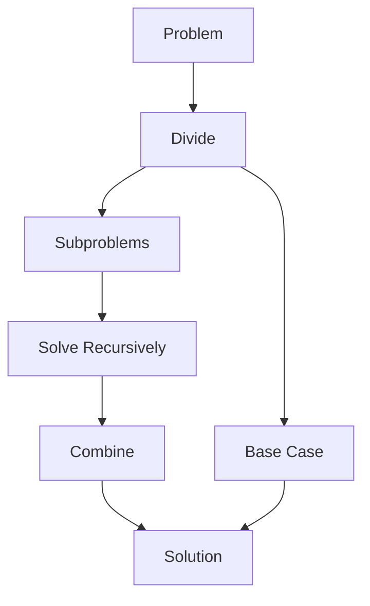

# Divide and Conquer Algorithms

[Back to Course Content](README.md) | [← Previous: Backtracking](backtracking.md) | [Next: Dynamic Programming →](dynamic-programming.md)

## Introduction to Divide and Conquer

Divide and Conquer is a problem-solving paradigm that breaks down a problem into smaller subproblems, solves them recursively, and combines their solutions to solve the original problem.

### Divide and Conquer Process



### Key Concepts

| Concept | Description |
|---------|-------------|
| Divide | Break problem into subproblems |
| Conquer | Solve subproblems recursively |
| Combine | Merge solutions of subproblems |
| Base Case | Smallest solvable problem |
| Recursion | Natural implementation method |
| Merge | Combine partial solutions |

## Common Divide and Conquer Problems

### 1. Binary Search

```python
def binary_search(arr, target):
    def search(left, right):
        if left > right:
            return -1
        
        mid = (left + right) // 2
        if arr[mid] == target:
            return mid
        elif arr[mid] > target:
            return search(left, mid - 1)
        else:
            return search(mid + 1, right)
    
    return search(0, len(arr) - 1)
```

### 2. Merge Sort

```python
def merge_sort(arr):
    if len(arr) <= 1:
        return arr
    
    mid = len(arr) // 2
    left = merge_sort(arr[:mid])
    right = merge_sort(arr[mid:])
    
    return merge(left, right)

def merge(left, right):
    result = []
    i = j = 0
    
    while i < len(left) and j < len(right):
        if left[i] <= right[j]:
            result.append(left[i])
            i += 1
        else:
            result.append(right[j])
            j += 1
    
    result.extend(left[i:])
    result.extend(right[j:])
    return result
```

### 3. Quick Sort

```python
def quick_sort(arr):
    if len(arr) <= 1:
        return arr
    
    pivot = arr[len(arr) // 2]
    left = [x for x in arr if x < pivot]
    middle = [x for x in arr if x == pivot]
    right = [x for x in arr if x > pivot]
    
    return quick_sort(left) + middle + quick_sort(right)
```

### 4. Strassen's Matrix Multiplication

```python
def strassen_multiply(A, B):
    n = len(A)
    if n <= 2:
        return standard_multiply(A, B)
    
    # Divide matrices into submatrices
    mid = n // 2
    A11 = [row[:mid] for row in A[:mid]]
    A12 = [row[mid:] for row in A[:mid]]
    A21 = [row[:mid] for row in A[mid:]]
    A22 = [row[mid:] for row in A[mid:]]
    
    B11 = [row[:mid] for row in B[:mid]]
    B12 = [row[mid:] for row in B[:mid]]
    B21 = [row[:mid] for row in B[mid:]]
    B22 = [row[mid:] for row in B[mid:]]
    
    # Calculate products
    P1 = strassen_multiply(A11, subtract(B12, B22))
    P2 = strassen_multiply(add(A11, A12), B22)
    P3 = strassen_multiply(add(A21, A22), B11)
    P4 = strassen_multiply(A22, subtract(B21, B11))
    P5 = strassen_multiply(add(A11, A22), add(B11, B22))
    P6 = strassen_multiply(subtract(A12, A22), add(B21, B22))
    P7 = strassen_multiply(subtract(A11, A21), add(B11, B12))
    
    # Combine results
    C11 = add(subtract(add(P5, P4), P2), P6)
    C12 = add(P1, P2)
    C21 = add(P3, P4)
    C22 = subtract(subtract(add(P5, P1), P3), P7)
    
    # Combine submatrices
    C = [[0] * n for _ in range(n)]
    for i in range(mid):
        for j in range(mid):
            C[i][j] = C11[i][j]
            C[i][j + mid] = C12[i][j]
            C[i + mid][j] = C21[i][j]
            C[i + mid][j + mid] = C22[i][j]
    
    return C
```

### 5. Closest Pair of Points

```python
def closest_pair(points):
    if len(points) <= 3:
        return brute_force_closest_pair(points)
    
    # Sort points by x-coordinate
    points.sort(key=lambda p: p[0])
    mid = len(points) // 2
    
    # Divide into left and right halves
    left_points = points[:mid]
    right_points = points[mid:]
    
    # Recursively find closest pairs
    left_min = closest_pair(left_points)
    right_min = closest_pair(right_points)
    
    # Find minimum distance
    min_dist = min(left_min, right_min)
    
    # Check strip around middle
    strip = []
    mid_x = points[mid][0]
    
    for point in points:
        if abs(point[0] - mid_x) < min_dist:
            strip.append(point)
    
    # Sort strip by y-coordinate
    strip.sort(key=lambda p: p[1])
    
    # Check points in strip
    for i in range(len(strip)):
        for j in range(i + 1, min(i + 7, len(strip))):
            dist = distance(strip[i], strip[j])
            min_dist = min(min_dist, dist)
    
    return min_dist
```

## Real-World Applications

### 1. Data Processing
- Sorting algorithms
- Matrix operations
- Signal processing
- Image processing

### 2. Search and Optimization
- Binary search
- Closest pair problems
- Convex hull
- Line intersection

### 3. Parallel Processing
- Distributed computing
- Load balancing
- Task scheduling
- Resource allocation

### 4. Machine Learning
- Decision trees
- Clustering algorithms
- Feature selection
- Model training

## Implementation Considerations

### Memory Management
1. Recursion stack
2. Temporary storage
3. Space complexity
4. Memory allocation

### Performance Optimization
1. Base case optimization
2. Cache utilization
3. Parallel processing
4. Algorithm tuning

## Best Practices

### Problem Solving
1. Identify subproblems
2. Design base cases
3. Plan combination step
4. Consider edge cases

### Implementation
1. Choose data structures
2. Optimize recursion
3. Handle memory
4. Consider time complexity

## Summary

Key points to remember:
1. Break problem into subproblems
2. Solve subproblems recursively
3. Combine solutions efficiently
4. Handle base cases properly
5. Consider space complexity
6. Optimize for performance

By understanding divide and conquer, you can:
- Solve complex problems efficiently
- Design parallel algorithms
- Optimize search operations
- Handle large datasets
- Implement efficient sorting
- Solve geometric problems 