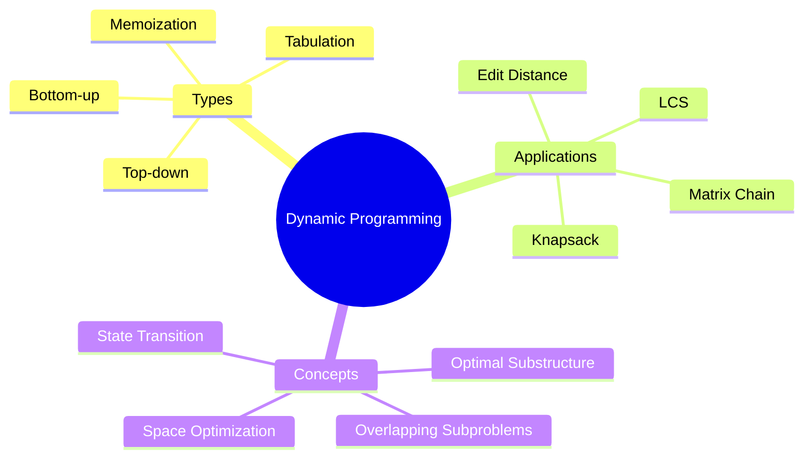

# Dynamic Programming

[Back to Course Content](README.md) | [Previous: Recursion](recursion.md) | [Next: Greedy Algorithms →](greedy-algorithms.md)

> Reference: This content is based on Dynamic-programming.pdf and Advanced-dynamic-programming.pdf

## What is Dynamic Programming?

Dynamic Programming is an optimization technique that breaks down complex problems into simpler subproblems and stores their solutions to avoid redundant computations.



## Basic Concepts

### 1. Optimal Substructure

A problem has optimal substructure if its optimal solution can be constructed from optimal solutions of its subproblems.

```java
public class OptimalSubstructure {
    // Example: Fibonacci with optimal substructure
    public int fibonacci(int n) {
        if (n <= 1) return n;
        return fibonacci(n - 1) + fibonacci(n - 2);
    }
}
```

### 2. Overlapping Subproblems

A problem has overlapping subproblems if the same subproblem is encountered multiple times while solving the main problem.

```java
public class OverlappingSubproblems {
    // Example: Recursive Fibonacci with overlapping subproblems
    public int fibonacci(int n) {
        if (n <= 1) return n;
        return fibonacci(n - 1) + fibonacci(n - 2);
    }
}
```

## Types of Dynamic Programming

### 1. Top-down (Memoization)

```java
public class TopDownDP {
    // Memoization for Fibonacci
    public int fibonacci(int n) {
        int[] memo = new int[n + 1];
        return fibonacciMemo(n, memo);
    }

    private int fibonacciMemo(int n, int[] memo) {
        if (n <= 1) return n;
        if (memo[n] != 0) return memo[n];
        memo[n] = fibonacciMemo(n - 1, memo) + fibonacciMemo(n - 2, memo);
        return memo[n];
    }
}
```

### 2. Bottom-up (Tabulation)

```java
public class BottomUpDP {
    // Tabulation for Fibonacci
    public int fibonacci(int n) {
        if (n <= 1) return n;
        int[] dp = new int[n + 1];
        dp[0] = 0;
        dp[1] = 1;
        for (int i = 2; i <= n; i++) {
            dp[i] = dp[i - 1] + dp[i - 2];
        }
        return dp[n];
    }
}
```

## Common Dynamic Programming Problems

### 1. Knapsack Problem

```java
public class Knapsack {
    // 0/1 Knapsack Problem
    public int knapsack(int[] weights, int[] values, int capacity, int n) {
        int[][] dp = new int[n + 1][capacity + 1];
        
        for (int i = 1; i <= n; i++) {
            for (int w = 0; w <= capacity; w++) {
                if (weights[i - 1] <= w) {
                    dp[i][w] = Math.max(
                        values[i - 1] + dp[i - 1][w - weights[i - 1]],
                        dp[i - 1][w]
                    );
                } else {
                    dp[i][w] = dp[i - 1][w];
                }
            }
        }
        return dp[n][capacity];
    }
}
```

### 2. Longest Common Subsequence (LCS)

```java
public class LCS {
    public int longestCommonSubsequence(String text1, String text2) {
        int m = text1.length();
        int n = text2.length();
        int[][] dp = new int[m + 1][n + 1];
        
        for (int i = 1; i <= m; i++) {
            for (int j = 1; j <= n; j++) {
                if (text1.charAt(i - 1) == text2.charAt(j - 1)) {
                    dp[i][j] = dp[i - 1][j - 1] + 1;
                } else {
                    dp[i][j] = Math.max(dp[i - 1][j], dp[i][j - 1]);
                }
            }
        }
        return dp[m][n];
    }
}
```

### 3. Matrix Chain Multiplication

```java
public class MatrixChainMultiplication {
    public int matrixChainOrder(int[] dimensions) {
        int n = dimensions.length - 1;
        int[][] dp = new int[n][n];
        
        for (int len = 2; len <= n; len++) {
            for (int i = 0; i < n - len + 1; i++) {
                int j = i + len - 1;
                dp[i][j] = Integer.MAX_VALUE;
                
                for (int k = i; k < j; k++) {
                    int cost = dp[i][k] + dp[k + 1][j] + 
                             dimensions[i] * dimensions[k + 1] * dimensions[j + 1];
                    dp[i][j] = Math.min(dp[i][j], cost);
                }
            }
        }
        return dp[0][n - 1];
    }
}
```

## Space Optimization Techniques

### 1. Using Single Array

```java
public class SpaceOptimizedDP {
    // Space optimized Fibonacci
    public int fibonacci(int n) {
        if (n <= 1) return n;
        int prev = 0, curr = 1;
        for (int i = 2; i <= n; i++) {
            int next = prev + curr;
            prev = curr;
            curr = next;
        }
        return curr;
    }
}
```

### 2. Rolling Arrays

```java
public class RollingArrays {
    // Space optimized Knapsack
    public int knapsack(int[] weights, int[] values, int capacity, int n) {
        int[] dp = new int[capacity + 1];
        
        for (int i = 0; i < n; i++) {
            for (int w = capacity; w >= weights[i]; w--) {
                dp[w] = Math.max(dp[w], values[i] + dp[w - weights[i]]);
            }
        }
        return dp[capacity];
    }
}
```

## Best Practices

1. **Problem Analysis**
   - Identify optimal substructure
   - Check for overlapping subproblems
   - Determine state variables
   - Formulate recurrence relation

2. **Implementation**
   - Choose appropriate DP approach
   - Handle base cases
   - Optimize space usage
   - Consider edge cases

3. **Optimization**
   - Use space optimization
   - Implement memoization
   - Consider iterative solutions
   - Handle large inputs

## Common Pitfalls

1. **Design Issues**
   - Wrong state definition
   - Incorrect recurrence relation
   - Missing base cases
   - Inefficient state space

2. **Implementation Issues**
   - Memory overflow
   - Time complexity issues
   - Incorrect indexing
   - Missing optimizations

3. **Performance Issues**
   - Excessive memory usage
   - Redundant computations
   - Poor space utilization
   - Inefficient state transitions

## Exercises

1. Implement Fibonacci using DP
2. Solve 0/1 Knapsack problem
3. Find Longest Common Subsequence
4. Implement Matrix Chain Multiplication
5. Solve Edit Distance problem

## Additional Resources

- [GeeksforGeeks - Dynamic Programming](https://www.geeksforgeeks.org/dynamic-programming/)
- [Dynamic Programming Visualization](https://visualgo.net/en/dynamicprogramming)
- [DP Practice Problems](https://leetcode.com/tag/dynamic-programming/)
- [DP Tutorial](https://www.programiz.com/dsa/dynamic-programming) 