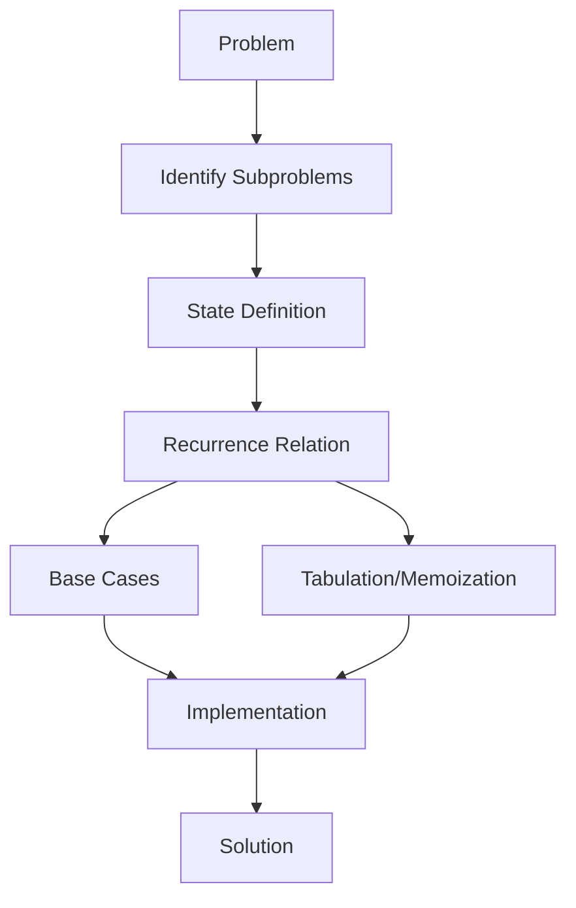

# Dynamic Programming

[Back to Course Content](README.md) | [← Previous: Divide and Conquer](divide-and-conquer.md) | [Next: Complexity Analysis →](complexity-analysis.md)

## Introduction to Dynamic Programming

Dynamic Programming is a method for solving complex problems by breaking them down into simpler subproblems and storing the results for future use, avoiding redundant computations.

### Dynamic Programming Process



### Key Concepts

| Concept | Description |
|---------|-------------|
| Optimal Substructure | Problem can be solved using solutions to subproblems |
| Overlapping Subproblems | Same subproblems are encountered multiple times |
| Memoization | Top-down approach with caching |
| Tabulation | Bottom-up approach with table filling |
| State | Parameters defining a subproblem |
| Transition | Relation between states |

## Common Dynamic Programming Problems

### 1. Fibonacci Numbers

```java
public class Fibonacci {
    // Memoization approach
    public static int fibonacci(int n) {
        Map<Integer, Integer> memo = new HashMap<>();
        return fib(n, memo);
    }
    
    private static int fib(int n, Map<Integer, Integer> memo) {
        if (memo.containsKey(n)) {
            return memo.get(n);
        }
        if (n <= 1) {
            return n;
        }
        int result = fib(n-1, memo) + fib(n-2, memo);
        memo.put(n, result);
        return result;
    }
    
    // Tabulation approach
    public static int fibonacciTabulation(int n) {
        if (n <= 1) {
            return n;
        }
        
        int[] dp = new int[n + 1];
        dp[1] = 1;
        
        for (int i = 2; i <= n; i++) {
            dp[i] = dp[i-1] + dp[i-2];
        }
        
        return dp[n];
    }
}
```

### 2. Longest Common Subsequence

```java
public class LCS {
    public static int lcs(String X, String Y) {
        int m = X.length();
        int n = Y.length();
        int[][] dp = new int[m + 1][n + 1];
        
        for (int i = 1; i <= m; i++) {
            for (int j = 1; j <= n; j++) {
                if (X.charAt(i-1) == Y.charAt(j-1)) {
                    dp[i][j] = dp[i-1][j-1] + 1;
                } else {
                    dp[i][j] = Math.max(dp[i-1][j], dp[i][j-1]);
                }
            }
        }
        
        return dp[m][n];
    }
}
```

### 3. Knapsack Problem

```java
public class Knapsack {
    public static int knapsack(int[] values, int[] weights, int capacity) {
        int n = values.length;
        int[][] dp = new int[n + 1][capacity + 1];
        
        for (int i = 1; i <= n; i++) {
            for (int w = 0; w <= capacity; w++) {
                if (weights[i-1] <= w) {
                    dp[i][w] = Math.max(
                        dp[i-1][w],
                        dp[i-1][w-weights[i-1]] + values[i-1]
                    );
                } else {
                    dp[i][w] = dp[i-1][w];
                }
            }
        }
        
        return dp[n][capacity];
    }
}
```

### 4. Matrix Chain Multiplication

```java
public class MatrixChainMultiplication {
    public static int matrixChainMultiplication(int[] dimensions) {
        int n = dimensions.length - 1;
        int[][] dp = new int[n][n];
        
        for (int length = 2; length <= n; length++) {
            for (int i = 0; i < n - length + 1; i++) {
                int j = i + length - 1;
                dp[i][j] = Integer.MAX_VALUE;
                
                for (int k = i; k < j; k++) {
                    int cost = dp[i][k] + dp[k+1][j] + 
                             dimensions[i] * dimensions[k+1] * dimensions[j+1];
                    dp[i][j] = Math.min(dp[i][j], cost);
                }
            }
        }
        
        return dp[0][n-1];
    }
}
```

### 5. Edit Distance

```java
public class EditDistance {
    public static int editDistance(String str1, String str2) {
        int m = str1.length();
        int n = str2.length();
        int[][] dp = new int[m + 1][n + 1];
        
        for (int i = 0; i <= m; i++) {
            dp[i][0] = i;
        }
        
        for (int j = 0; j <= n; j++) {
            dp[0][j] = j;
        }
        
        for (int i = 1; i <= m; i++) {
            for (int j = 1; j <= n; j++) {
                if (str1.charAt(i-1) == str2.charAt(j-1)) {
                    dp[i][j] = dp[i-1][j-1];
                } else {
                    dp[i][j] = Math.min(
                        Math.min(dp[i-1][j], dp[i][j-1]), // deletion/insertion
                        dp[i-1][j-1]  // substitution
                    ) + 1;
                }
            }
        }
        
        return dp[m][n];
    }
}
```

## Real-World Applications

### 1. Optimization Problems
- Resource allocation
- Scheduling
- Network optimization
- Inventory management

### 2. Sequence Analysis
- DNA sequence alignment
- Text similarity
- Pattern matching
- Speech recognition

### 3. Game Theory
- Strategy optimization
- Decision making
- Resource management
- Competitive analysis

### 4. Machine Learning
- Hidden Markov Models
- Dynamic Time Warping
- Reinforcement Learning
- Neural Networks

## Implementation Considerations

### Memory Management
1. Space optimization
2. State compression
3. Memory allocation
4. Cache utilization

### Performance Optimization
1. State pruning
2. Early termination
3. Parallel processing
4. Algorithm tuning

## Best Practices

### Problem Solving
1. Identify states
2. Define transitions
3. Handle base cases
4. Consider optimizations

### Implementation
1. Choose approach
2. Optimize space
3. Handle edge cases
4. Consider time complexity

## Summary

Key points to remember:
1. Break into subproblems
2. Store intermediate results
3. Build solution bottom-up
4. Optimize space usage
5. Handle base cases
6. Consider time complexity

By understanding dynamic programming, you can:
- Solve optimization problems
- Optimize recursive solutions
- Handle overlapping subproblems
- Design efficient algorithms
- Solve complex problems
- Improve performance 