# Graphs

[Back to Course Content](README.md) | [Previous: Trees](trees.md) | [Next: Sorting Algorithms →](sorting.md)

> Reference: This content is based on Graphs.pdf and Graph-algorithms.pdf

## What are Graphs?

Graphs are non-linear data structures that represent relationships between objects. They consist of vertices (nodes) connected by edges, which can be directed or undirected. Formally, a graph G is defined as an ordered pair G = (V, E) where V is a set of vertices and E is a set of edges connecting these vertices.

### Mathematical Foundation

In formal terms:
- A graph G = (V, E) consists of a set of vertices V and a set of edges E
- Each edge e ∈ E is a pair (u, v) where u, v ∈ V
- For a directed graph, edge (u, v) is distinct from (v, u)
- For an undirected graph, edges (u, v) and (v, u) are equivalent

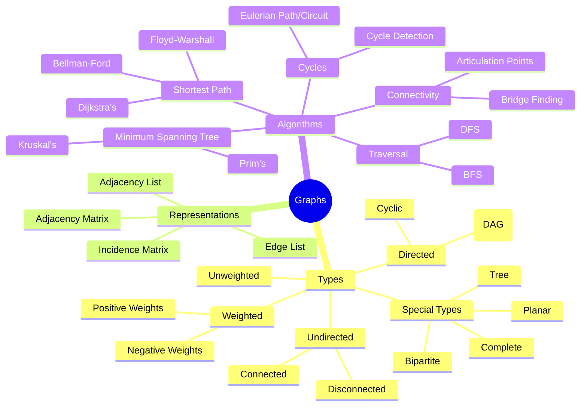

### Visual Representation

Here's a simple undirected graph with 5 vertices and 6 edges:

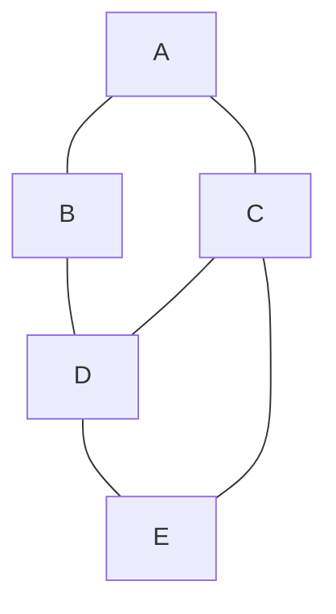

And a directed graph with weighted edges:

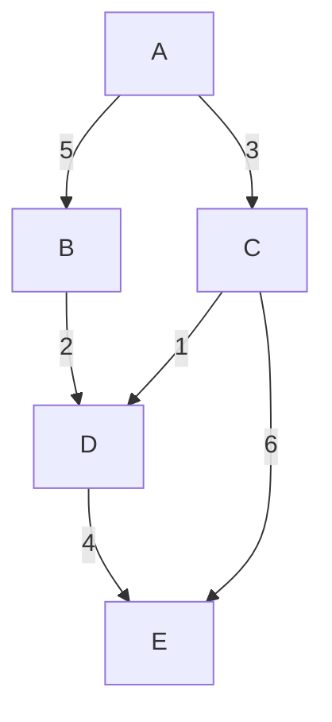

## Basic Graph Concepts

### Graph Terminology

- **Vertex/Node**: A fundamental unit in a graph, represented as V = {v₁, v₂, ..., vₙ}
- **Edge**: A connection between two vertices, represented as E = {e₁, e₂, ..., eₘ} where each eᵢ = (u, v)
- **Degree**: Number of edges connected to a vertex
  - For directed graphs, we distinguish between in-degree (edges pointing to the vertex) and out-degree (edges pointing from the vertex)
- **Path**: A sequence of vertices v₁, v₂, ..., vₖ where each adjacent pair (vᵢ, vᵢ₊₁) is connected by an edge
- **Simple Path**: A path with no repeated vertices
- **Cycle**: A path that starts and ends at the same vertex, with no repeated edges
- **Connected**: A graph is connected if there exists a path between any two vertices
- **Weight**: A numerical value associated with an edge, often representing distance, cost, or capacity
- **Neighbor**: Two vertices are neighbors if they are connected by an edge
- **Adjacency**: Two vertices are adjacent if there is an edge connecting them
- **Isolated Vertex**: A vertex with no incident edges (degree = 0)
- **Loop**: An edge that connects a vertex to itself
- **Multigraph**: A graph that allows multiple edges between the same pair of vertices
- **Simple Graph**: A graph with no loops and no multiple edges

### Graph Properties

1. **Directed vs Undirected**
   - **Directed (Digraph)**: Edges have direction, represented as ordered pairs (u, v)
     - Not symmetrical: if (u, v) ∈ E, it doesn't imply (v, u) ∈ E
     - Applications: Web links, social media follows, dependencies
   - **Undirected**: Edges have no direction, represented as unordered pairs {u, v}
     - Symmetrical: if {u, v} ∈ E, then {v, u} ∈ E as well
     - Applications: Friend networks, road systems, electrical circuits

   ```mermaid
   graph LR
       subgraph "Directed Graph"
           A1((A)) --> B1((B))
           B1 --> C1((C))
           C1 --> A1
       end
       
       subgraph "Undirected Graph"
           A2((A)) --- B2((B))
           B2 --- C2((C))
           C2 --- A2
       end
   ```

2. **Weighted vs Unweighted**
   - **Weighted**: Edges have weights (values), formally E = {(u, v, w)}
     - Weights can represent distance, cost, capacity, or any quantifiable relationship
     - Essential for shortest path and minimum spanning tree algorithms
   - **Unweighted**: All edges have the same implicit weight (usually 1)
     - Distance is measured by the number of edges in a path

   ```mermaid
   graph LR
       subgraph "Weighted Graph"
           A1((A)) --5--> B1((B))
           B1 --3--> C1((C))
           C1 --2--> A1
       end
       
       subgraph "Unweighted Graph"
           A2((A)) --> B2((B))
           B2 --> C2((C))
           C2 --> A2
       end
   ```

3. **Cyclic vs Acyclic**
   - **Cyclic**: Contains at least one cycle (a path that starts and ends at the same vertex)
   - **Acyclic**: Contains no cycles
     - Directed Acyclic Graphs (DAGs) are particularly important in scheduling, dependency resolution, and dynamic programming

   ```mermaid
   graph TD
       subgraph "Cyclic Graph"
           A1((A)) --> B1((B))
           B1 --> C1((C))
           C1 --> A1
       end
       
       subgraph "Acyclic Graph (DAG)"
           A2((A)) --> B2((B))
           A2 --> C2((C))
           B2 --> D2((D))
           C2 --> D2
       end
   ```

4. **Connected vs Disconnected**
   - **Connected**: There exists a path between any two vertices
   - **Disconnected**: The graph contains at least two vertices with no path between them
   - A connected component is a maximal connected subgraph

   ```mermaid
   graph TD
       subgraph "Connected Graph"
           A1((A)) --- B1((B))
           B1 --- C1((C))
           C1 --- D1((D))
           D1 --- A1
       end
       
       subgraph "Disconnected Graph"
           A2((A)) --- B2((B))
           C2((C)) --- D2((D))
       end
   ```

5. **Dense vs Sparse**
   - **Dense**: Contains many edges, approaching the maximum possible (|E| ≈ |V|²)
   - **Sparse**: Contains relatively few edges compared to the maximum possible (|E| << |V|²)
   - The choice between adjacency matrix and adjacency list often depends on density

### Special Types of Graphs

1. **Complete Graph**: Every vertex is connected to every other vertex
   - For an undirected complete graph with n vertices, the number of edges is n(n-1)/2

2. **Bipartite Graph**: Vertices can be divided into two disjoint sets such that every edge connects a vertex in the first set to a vertex in the second set

3. **Tree**: A connected acyclic undirected graph
   - A graph with n vertices is a tree if and only if it is connected and has n-1 edges

4. **Planar Graph**: Can be drawn on a plane without any edges crossing

5. **Regular Graph**: Every vertex has the same degree

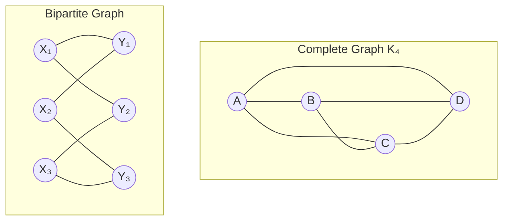

## Graph Representations

The choice of graph representation affects the space complexity and the time complexity of various graph operations. The most common representations are adjacency matrices, adjacency lists, and edge lists.

### 1. Adjacency Matrix

A 2D array where matrix[i][j] indicates if there's an edge between vertex i and j. For weighted graphs, the value represents the edge weight.

#### Properties:
- Space Complexity: O(V²)
- Time Complexity:
  - Edge Existence Check: O(1)
  - Finding All Edges: O(V²)
  - Finding All Neighbors of a Vertex: O(V)
- Ideal for dense graphs
- Simple implementation
- Efficient for checking if an edge exists

```java
public class GraphMatrix {
    private int[][] matrix;
    private int vertices;
    private boolean isDirected;

    public GraphMatrix(int vertices, boolean isDirected) {
        this.vertices = vertices;
        this.isDirected = isDirected;
        matrix = new int[vertices][vertices];
    }

    public void addEdge(int source, int destination) {
        matrix[source][destination] = 1;
        // For undirected graph, add edge in both directions
        if (!isDirected) {
            matrix[destination][source] = 1;
        }
    }

    public void addWeightedEdge(int source, int destination, int weight) {
        matrix[source][destination] = weight;
        // For undirected graph, add edge in both directions
        if (!isDirected) {
            matrix[destination][source] = weight;
        }
    }

    public boolean hasEdge(int source, int destination) {
        return matrix[source][destination] != 0;
    }

    public int getWeight(int source, int destination) {
        return matrix[source][destination];
    }
    
    public int[] getNeighbors(int vertex) {
        List<Integer> neighbors = new ArrayList<>();
        for (int i = 0; i < vertices; i++) {
            if (matrix[vertex][i] != 0) {
                neighbors.add(i);
            }
        }
        return neighbors.stream().mapToInt(i -> i).toArray();
    }
    
    public int getVertices() {
        return vertices;
    }
    
    // Print the adjacency matrix
    public void printMatrix() {
        for (int i = 0; i < vertices; i++) {
            for (int j = 0; j < vertices; j++) {
                System.out.print(matrix[i][j] + " ");
            }
            System.out.println();
        }
    }
}
```

#### Visual Representation:

For this graph:
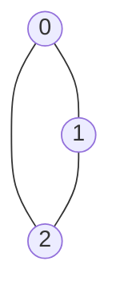

The adjacency matrix would be:
```
0 1 1
1 0 1
1 1 0
```

### 2. Adjacency List

An array of lists where each list contains vertices adjacent to that vertex. For weighted graphs, each entry in the list includes both the destination vertex and the weight.

#### Properties:
- Space Complexity: O(V + E)
- Time Complexity:
  - Edge Existence Check: O(degree(V))
  - Finding All Edges: O(V + E)
  - Finding All Neighbors of a Vertex: O(degree(V))
- Ideal for sparse graphs
- Memory efficient
- Efficient for graph traversal algorithms

```java
// First version: using ArrayList of ArrayLists
public class GraphList {
    private ArrayList<ArrayList<Integer>> adjList;
    private int vertices;
    private boolean isDirected;

    public GraphList(int vertices, boolean isDirected) {
        this.vertices = vertices;
        this.isDirected = isDirected;
        adjList = new ArrayList<>(vertices);
        for (int i = 0; i < vertices; i++) {
            adjList.add(new ArrayList<>());
        }
    }

    public void addEdge(int source, int destination) {
        adjList.get(source).add(destination);
        // For undirected graph, add edge in both directions
        if (!isDirected) {
            adjList.get(destination).add(source);
        }
    }

    public boolean hasEdge(int source, int destination) {
        return adjList.get(source).contains(destination);
    }

    public ArrayList<Integer> getNeighbors(int vertex) {
        return new ArrayList<>(adjList.get(vertex));
    }
    
    public int getVertices() {
        return vertices;
    }
    
    // Print the adjacency list
    public void printList() {
        for (int i = 0; i < vertices; i++) {
            System.out.print("Vertex " + i + " -> ");
            for (int neighbor : adjList.get(i)) {
                System.out.print(neighbor + " ");
            }
            System.out.println();
        }
    }
}

// Second version: using weighted edges
public class WeightedGraphList {
    private static class Edge {
        int destination;
        int weight;
        
        Edge(int destination, int weight) {
            this.destination = destination;
            this.weight = weight;
        }
    }
    
    private ArrayList<ArrayList<Edge>> adjList;
    private int vertices;
    private boolean isDirected;

    public WeightedGraphList(int vertices, boolean isDirected) {
        this.vertices = vertices;
        this.isDirected = isDirected;
        adjList = new ArrayList<>(vertices);
        for (int i = 0; i < vertices; i++) {
            adjList.add(new ArrayList<>());
        }
    }

    public void addEdge(int source, int destination, int weight) {
        adjList.get(source).add(new Edge(destination, weight));
        // For undirected graph, add edge in both directions
        if (!isDirected) {
            adjList.get(destination).add(new Edge(source, weight));
        }
    }

    public boolean hasEdge(int source, int destination) {
        for (Edge edge : adjList.get(source)) {
            if (edge.destination == destination) {
                return true;
            }
        }
        return false;
    }
    
    public int getWeight(int source, int destination) {
        for (Edge edge : adjList.get(source)) {
            if (edge.destination == destination) {
                return edge.weight;
            }
        }
        return -1; // Edge doesn't exist
    }
    
    public ArrayList<Edge> getNeighbors(int vertex) {
        return new ArrayList<>(adjList.get(vertex));
    }
    
    public int getVertices() {
        return vertices;
    }
}
```

#### Visual Representation:

For this graph:


The adjacency list would be:
```
0 -> 1, 2
1 -> 0, 2
2 -> 0, 1
```

### 3. Edge List

A list of all edges in the graph. Each edge is represented as a triplet (source, destination, weight) for weighted graphs or a pair (source, destination) for unweighted graphs.

#### Properties:
- Space Complexity: O(E)
- Time Complexity:
  - Edge Existence Check: O(E)
  - Finding All Edges: O(E)
  - Finding All Neighbors of a Vertex: O(E)
- Simple implementation
- Memory efficient for very sparse graphs
- Ideal for algorithms that process all edges (like Kruskal's algorithm)

```java
public class Edge implements Comparable<Edge> {
    int source;
    int destination;
    int weight;

    Edge(int source, int destination, int weight) {
        this.source = source;
        this.destination = destination;
        this.weight = weight;
    }
    
    Edge(int source, int destination) {
        this(source, destination, 1);
    }
    
    @Override
    public int compareTo(Edge other) {
        return Integer.compare(this.weight, other.weight);
    }
    
    @Override
    public String toString() {
        return "(" + source + " -> " + destination + ", weight: " + weight + ")";
    }
}

public class GraphEdgeList {
    private ArrayList<Edge> edges;
    private int vertices;
    private boolean isDirected;

    public GraphEdgeList(int vertices, boolean isDirected) {
        this.vertices = vertices;
        this.isDirected = isDirected;
        edges = new ArrayList<>();
    }

    public void addEdge(int source, int destination, int weight) {
        edges.add(new Edge(source, destination, weight));
        // For undirected graph, add edge in both directions
        if (!isDirected) {
            edges.add(new Edge(destination, source, weight));
        }
    }
    
    public void addEdge(int source, int destination) {
        addEdge(source, destination, 1);
    }
    
    public boolean hasEdge(int source, int destination) {
        for (Edge edge : edges) {
            if (edge.source == source && edge.destination == destination) {
                return true;
            }
        }
        return false;
    }
    
    public ArrayList<Edge> getEdges() {
        return new ArrayList<>(edges);
    }
    
    public int getVertices() {
        return vertices;
    }
    
    public ArrayList<Edge> getEdgesFromVertex(int vertex) {
        ArrayList<Edge> result = new ArrayList<>();
        for (Edge edge : edges) {
            if (edge.source == vertex) {
                result.add(edge);
            }
        }
        return result;
    }
    
    // Print the edge list
    public void printEdges() {
        for (Edge edge : edges) {
            System.out.println(edge);
        }
    }
}
```

#### Visual Representation:

For this graph:


The edge list would be:
```
(0, 1)
(0, 2)
(1, 2)
```

### Comparison of Graph Representations

| Operation | Adjacency Matrix | Adjacency List | Edge List |
|-----------|------------------|----------------|-----------|
| Memory | O(V²) | O(V+E) | O(E) |
| Add Edge | O(1) | O(1) | O(1) |
| Remove Edge | O(1) | O(degree(V)) | O(E) |
| Check Edge | O(1) | O(degree(V)) | O(E) |
| Get All Neighbors | O(V) | O(degree(V)) | O(E) |
| Get All Edges | O(V²) | O(V+E) | O(E) |

#### When to Use Each Representation:

- **Adjacency Matrix**:
  - Dense graphs where E ≈ V²
  - When you need quick edge weight lookups
  - Small graphs where simplicity is preferred

- **Adjacency List**:
  - Sparse graphs where E << V²
  - When you need to enumerate neighbors
  - Most general-purpose graph algorithms

- **Edge List**:
  - When you need to sort edges by weight
  - Algorithms that process all edges (e.g., Kruskal's)
  - Very sparse graphs

## Graph Traversal Algorithms

Graph traversal algorithms explore vertices and edges of a graph, visiting each vertex exactly once. They are fundamental building blocks for more complex graph algorithms and are used to analyze the structure of graphs.

### 1. Depth-First Search (DFS)

DFS explores as far as possible along each branch before backtracking. It uses a stack data structure (either explicitly or implicitly through recursion) to track the vertices to be explored.

#### Algorithm:
1. Start at a selected vertex
2. Explore one of its unvisited neighbors
3. Continue exploring from that neighbor
4. When all paths from a vertex are explored, backtrack
5. Continue until all vertices are visited

#### Properties:
- Time Complexity: O(V + E)
- Space Complexity: O(V) for the recursion stack or explicit stack
- Uses stack (LIFO) data structure
- Explores deep paths first
- Suitable for:
  - Finding connected components
  - Detecting cycles
  - Topological sorting
  - Solving mazes

#### Recursive Implementation

```java
public class GraphDFS {
    private boolean[] visited;

    public void dfs(GraphList graph, int start) {
        visited = new boolean[graph.getVertices()];
        System.out.print("DFS Traversal: ");
        dfsUtil(graph, start);
        System.out.println();
    }

    private void dfsUtil(GraphList graph, int vertex) {
        // Mark the current vertex as visited
        visited[vertex] = true;
        System.out.print(vertex + " ");

        // Recursively visit all adjacent vertices
        for (int neighbor : graph.getNeighbors(vertex)) {
            if (!visited[neighbor]) {
                dfsUtil(graph, neighbor);
            }
        }
    }
    
    // Overloaded DFS to handle disconnected graphs
    public void dfsForDisconnectedGraph(GraphList graph) {
        visited = new boolean[graph.getVertices()];
        System.out.print("DFS Traversal of Disconnected Graph: ");
        
        // Perform DFS from each unvisited vertex
        for (int v = 0; v < graph.getVertices(); v++) {
            if (!visited[v]) {
                dfsUtil(graph, v);
                System.out.print("| "); // Separator between components
            }
        }
        System.out.println();
    }
    
    // DFS with explicit stack (non-recursive)
    public void dfsIterative(GraphList graph, int start) {
        boolean[] visited = new boolean[graph.getVertices()];
        Stack<Integer> stack = new Stack<>();
        
        stack.push(start);
        System.out.print("Iterative DFS Traversal: ");
        
        while (!stack.isEmpty()) {
            int vertex = stack.pop();
            
            // Skip if already visited
            if (visited[vertex]) {
                continue;
            }
            
            // Mark as visited and print
            visited[vertex] = true;
            System.out.print(vertex + " ");
            
            // Push all adjacent vertices to the stack
            // Note: We push in reverse order to get the same traversal as recursive DFS
            ArrayList<Integer> neighbors = graph.getNeighbors(vertex);
            for (int i = neighbors.size() - 1; i >= 0; i--) {
                int neighbor = neighbors.get(i);
                if (!visited[neighbor]) {
                    stack.push(neighbor);
                }
            }
        }
        System.out.println();
    }
    
    // DFS application: Cycle detection
    public boolean hasCycle(GraphList graph, boolean isDirected) {
        visited = new boolean[graph.getVertices()];
        boolean[] recursionStack = new boolean[graph.getVertices()];
        
        for (int i = 0; i < graph.getVertices(); i++) {
            if (!visited[i]) {
                if (isDirected) {
                    if (hasCycleDirected(graph, i, recursionStack)) {
                        return true;
                    }
                } else {
                    if (hasCycleUndirected(graph, i, -1)) {
                        return true;
                    }
                }
            }
        }
        return false;
    }
    
    private boolean hasCycleDirected(GraphList graph, int vertex, boolean[] recursionStack) {
        visited[vertex] = true;
        recursionStack[vertex] = true;
        
        for (int neighbor : graph.getNeighbors(vertex)) {
            if (!visited[neighbor]) {
                if (hasCycleDirected(graph, neighbor, recursionStack)) {
                    return true;
                }
            } else if (recursionStack[neighbor]) {
                return true;
            }
        }
        
        recursionStack[vertex] = false;
        return false;
    }
    
    private boolean hasCycleUndirected(GraphList graph, int vertex, int parent) {
        visited[vertex] = true;
        
        for (int neighbor : graph.getNeighbors(vertex)) {
            if (!visited[neighbor]) {
                if (hasCycleUndirected(graph, neighbor, vertex)) {
                    return true;
                }
            } else if (neighbor != parent) {
                return true;
            }
        }
        
        return false;
    }
    
    // DFS application: Topological Sort
    public int[] topologicalSort(GraphList graph) {
        visited = new boolean[graph.getVertices()];
        Stack<Integer> stack = new Stack<>();
        
        for (int i = 0; i < graph.getVertices(); i++) {
            if (!visited[i]) {
                topologicalSortUtil(graph, i, stack);
            }
        }
        
        int[] result = new int[graph.getVertices()];
        for (int i = 0; i < graph.getVertices(); i++) {
            result[i] = stack.pop();
        }
        
        return result;
    }
    
    private void topologicalSortUtil(GraphList graph, int vertex, Stack<Integer> stack) {
        visited[vertex] = true;
        
        for (int neighbor : graph.getNeighbors(vertex)) {
            if (!visited[neighbor]) {
                topologicalSortUtil(graph, neighbor, stack);
            }
        }
        
        stack.push(vertex);
    }
}
```

#### Visualization of DFS

For this graph:
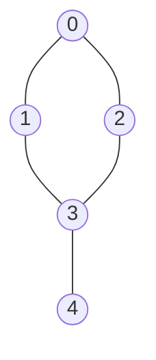

DFS traversal starting from vertex 0 would be: 0, 1, 3, 4, 2

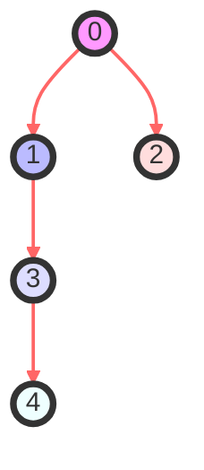

### 2. Breadth-First Search (BFS)

BFS explores all vertices at the current depth before moving to vertices at the next depth level. It uses a queue data structure to track the vertices to be explored.

#### Algorithm:
1. Start at a selected vertex
2. Explore all its neighbors
3. For each of those neighbors, explore their unexplored neighbors
4. Continue level by level until all vertices are visited

#### Properties:
- Time Complexity: O(V + E)
- Space Complexity: O(V) for the queue
- Uses queue (FIFO) data structure
- Explores level by level
- Guarantees shortest path in unweighted graphs
- Suitable for:
  - Finding shortest paths in unweighted graphs
  - Finding all nodes within a connected component
  - Testing bipartiteness
  - Finding all vertices within a certain distance

#### Implementation

```java
public class GraphBFS {
    public void bfs(GraphList graph, int start) {
        boolean[] visited = new boolean[graph.getVertices()];
        Queue<Integer> queue = new LinkedList<>();
        
        visited[start] = true;
        queue.add(start);
        
        System.out.print("BFS Traversal: ");
        
        while (!queue.isEmpty()) {
            int vertex = queue.poll();
            System.out.print(vertex + " ");
            
            for (int neighbor : graph.getNeighbors(vertex)) {
                if (!visited[neighbor]) {
                    visited[neighbor] = true;
                    queue.add(neighbor);
                }
            }
        }
        
        System.out.println();
    }
    
    // BFS for disconnected graphs
    public void bfsForDisconnectedGraph(GraphList graph) {
        boolean[] visited = new boolean[graph.getVertices()];
        System.out.print("BFS Traversal of Disconnected Graph: ");
        
        for (int v = 0; v < graph.getVertices(); v++) {
            if (!visited[v]) {
                bfsComponent(graph, v, visited);
                System.out.print("| "); // Separator between components
            }
        }
        
        System.out.println();
    }
    
    private void bfsComponent(GraphList graph, int start, boolean[] visited) {
        Queue<Integer> queue = new LinkedList<>();
        
        visited[start] = true;
        queue.add(start);
        
        while (!queue.isEmpty()) {
            int vertex = queue.poll();
            System.out.print(vertex + " ");
            
            for (int neighbor : graph.getNeighbors(vertex)) {
                if (!visited[neighbor]) {
                    visited[neighbor] = true;
                    queue.add(neighbor);
                }
            }
        }
    }
    
    // BFS application: Shortest path in unweighted graph
    public int[] shortestPath(GraphList graph, int start) {
        boolean[] visited = new boolean[graph.getVertices()];
        int[] distance = new int[graph.getVertices()];
        int[] predecessor = new int[graph.getVertices()];
        
        Arrays.fill(distance, Integer.MAX_VALUE);
        Arrays.fill(predecessor, -1);
        
        visited[start] = true;
        distance[start] = 0;
        Queue<Integer> queue = new LinkedList<>();
        queue.add(start);
        
        while (!queue.isEmpty()) {
            int vertex = queue.poll();
            
            for (int neighbor : graph.getNeighbors(vertex)) {
                if (!visited[neighbor]) {
                    visited[neighbor] = true;
                    distance[neighbor] = distance[vertex] + 1;
                    predecessor[neighbor] = vertex;
                    queue.add(neighbor);
                }
            }
        }
        
        return distance;
    }
    
    // Reconstruct path from start to end using predecessor array
    public List<Integer> reconstructPath(int[] predecessor, int start, int end) {
        LinkedList<Integer> path = new LinkedList<>();
        
        if (end == start) {
            path.add(start);
            return path;
        }
        
        if (predecessor[end] == -1) {
            return path; // No path exists
        }
        
        for (int at = end; at != -1; at = predecessor[at]) {
            path.addFirst(at);
        }
        
        return path;
    }
    
    // BFS application: Check if graph is bipartite
    public boolean isBipartite(GraphList graph) {
        int vertices = graph.getVertices();
        int[] color = new int[vertices]; // 0: not colored, 1: color A, -1: color B
        
        for (int i = 0; i < vertices; i++) {
            if (color[i] == 0) {
                Queue<Integer> queue = new LinkedList<>();
                queue.add(i);
                color[i] = 1; // Color first node
                
                while (!queue.isEmpty()) {
                    int vertex = queue.poll();
                    
                    for (int neighbor : graph.getNeighbors(vertex)) {
                        if (color[neighbor] == 0) {
                            color[neighbor] = -color[vertex]; // Opposite color
                            queue.add(neighbor);
                        } else if (color[neighbor] == color[vertex]) {
                            return false; // Same color for adjacent vertices
                        }
                    }
                }
            }
        }
        
        return true;
    }
}
```

#### Visualization of BFS

For this graph:


BFS traversal starting from vertex 0 would be: 0, 1, 2, 3, 4

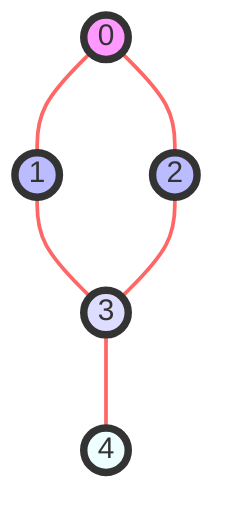

### Comparison of DFS and BFS

| Aspect | DFS | BFS |
|--------|-----|-----|
| Data Structure | Stack | Queue |
| Implementation | Simpler with recursion | Usually iterative |
| Space Complexity | O(h) where h is max depth | O(w) where w is max width |
| Path Finding | Not optimal for shortest path | Optimal for unweighted shortest path |
| Use Cases | Topological sort, cycle detection | Shortest path, level-order traversal |
| Traversal Pattern | Deep paths first | Level by level |

### Applications of Graph Traversal

1. **Connected Components**:
   - Find all connected components in an undirected graph using either DFS or BFS

2. **Cycle Detection**:
   - Use DFS to detect cycles in directed and undirected graphs

3. **Topological Sorting**:
   - Use DFS to find a linear ordering of vertices in a DAG

4. **Shortest Path in Unweighted Graphs**:
   - Use BFS to find shortest paths from a source vertex to all other vertices

5. **Testing Bipartiteness**:
   - Use BFS to determine if a graph can be colored with two colors

6. **Finding Bridges and Articulation Points**:
   - Use DFS to find bridges (edges whose removal increases the number of connected components) and articulation points (vertices whose removal increases the number of connected components)

7. **Solving Mazes**:
   - Use DFS to find a path in a maze (any path)
   - Use BFS to find the shortest path in a maze

## Shortest Path Algorithms

Shortest path algorithms find the paths with minimum cost (distance, time, etc.) between vertices in a graph. These algorithms are fundamental to many applications including navigation systems, network routing, and operations research.

### Formal Problem Definition

Given a weighted graph G = (V, E) with a weight function w: E → R, find the path P from a source vertex s to a destination vertex t such that the sum of the weights of the edges in P is minimized.

### 1. Dijkstra's Algorithm

Dijkstra's algorithm finds the shortest path from a source vertex to all other vertices in a graph with non-negative edge weights. It uses a greedy approach, selecting the unvisited vertex with the minimum distance at each step.

#### Algorithm:
1. Initialize distances from source to all vertices as infinite, and distance to source as 0
2. Create a priority queue and add source vertex with distance 0
3. While the priority queue is not empty:
   a. Extract vertex with minimum distance from the queue
   b. For each adjacent vertex, if the distance through current vertex is smaller than the known distance, update the distance and add to the queue

#### Properties:
- Time Complexity: O(E log V) with binary heap priority queue
- Space Complexity: O(V)
- Works only for graphs with non-negative edge weights
- Provides optimal solution
- Single-source shortest path algorithm
- Uses greedy approach

#### Proof of Correctness:

Dijkstra's algorithm is based on the principle of optimality and greedy choice. It maintains a set S of vertices whose shortest distance from the source has been determined. At each step, it adds the vertex with the minimum distance estimate to S. The key insight is that for a vertex u to be added to S, d[u] (the current shortest distance estimate) must be the actual shortest distance from source to u.

This is proven by contradiction: If d[u] is not the shortest distance when u is added to S, there must exist another path through some vertex v not in S with a shorter distance. But since edge weights are non-negative and u has the minimum distance estimate among vertices not in S, this is impossible.

#### Implementation

```java
public class Dijkstra {
    private static final int INF = Integer.MAX_VALUE;

    // Implementation using adjacency matrix
    public int[] dijkstra(GraphMatrix graph, int source) {
        int vertices = graph.getVertices();
        int[] dist = new int[vertices];
        boolean[] visited = new boolean[vertices];

        // Initialize all distances as infinite
        Arrays.fill(dist, INF);
        dist[source] = 0;

        // Find shortest path for all vertices
        for (int count = 0; count < vertices - 1; count++) {
            // Pick the minimum distance vertex from the unvisited set
            int u = minDistance(dist, visited);
            
            // Mark the picked vertex as visited
            visited[u] = true;

            // Update dist values of adjacent vertices
            for (int v = 0; v < vertices; v++) {
                // Update dist[v] only if:
                // 1. There is an edge from u to v
                // 2. Vertex v is not in visited set
                // 3. Distance through u is smaller than current value of dist[v]
                if (!visited[v] && graph.hasEdge(u, v) && 
                    dist[u] != INF && 
                    dist[u] + graph.getWeight(u, v) < dist[v]) {
                    dist[v] = dist[u] + graph.getWeight(u, v);
                }
            }
        }

        return dist;
    }

    // Implementation using adjacency list and priority queue (more efficient)
    public int[] dijkstraPQ(WeightedGraphList graph, int source) {
        int vertices = graph.getVertices();
        int[] dist = new int[vertices];
        int[] prev = new int[vertices]; // To reconstruct path
        
        // Initialize all distances as infinite and prev array as -1
        Arrays.fill(dist, INF);
        Arrays.fill(prev, -1);
        dist[source] = 0;
        
        // Create a priority queue to store vertices and their distances
        PriorityQueue<Node> pq = new PriorityQueue<>(vertices, Comparator.comparingInt(node -> node.distance));
        pq.add(new Node(source, 0));
        
        while (!pq.isEmpty()) {
            // Extract the vertex with minimum distance
            Node node = pq.poll();
            int u = node.vertex;
            
            // If the extracted distance is greater than the stored distance, skip
            if (node.distance > dist[u]) {
                continue;
            }
            
            // Update dist values of adjacent vertices
            for (WeightedGraphList.Edge edge : graph.getNeighbors(u)) {
                int v = edge.destination;
                int weight = edge.weight;
                
                // If there is a shorter path to v through u
                if (dist[u] != INF && dist[u] + weight < dist[v]) {
                    // Update distance of v
                    dist[v] = dist[u] + weight;
                    prev[v] = u;
                    pq.add(new Node(v, dist[v]));
                }
            }
        }
        
        return dist;
    }
    
    // Utility method to find the vertex with minimum distance
    private int minDistance(int[] dist, boolean[] visited) {
        int min = INF;
        int minIndex = -1;

        for (int v = 0; v < dist.length; v++) {
            if (!visited[v] && dist[v] <= min) {
                min = dist[v];
                minIndex = v;
            }
        }

        return minIndex;
    }
    
    // Utility class to represent a vertex and its distance
    private static class Node {
        int vertex;
        int distance;
        
        Node(int vertex, int distance) {
            this.vertex = vertex;
            this.distance = distance;
        }
    }
    
    // Method to reconstruct the shortest path from source to destination
    public List<Integer> getPath(int[] prev, int source, int destination) {
        List<Integer> path = new ArrayList<>();
        
        // If destination is unreachable
        if (prev[destination] == -1 && source != destination) {
            return path;
        }
        
        // Start from destination and work backwards
        for (int at = destination; at != -1; at = prev[at]) {
            path.add(at);
        }
        
        // Reverse to get path from source to destination
        Collections.reverse(path);
        return path;
    }
    
    // Pretty print the shortest paths
    public void printShortestPaths(int[] dist, int source) {
        System.out.println("Shortest paths from vertex " + source + ":");
        for (int i = 0; i < dist.length; i++) {
            if (dist[i] == INF) {
                System.out.println("Vertex " + i + ": Infinity (unreachable)");
            } else {
                System.out.println("Vertex " + i + ": " + dist[i]);
            }
        }
    }
}
```

#### Example and Visualization

Consider this weighted graph:

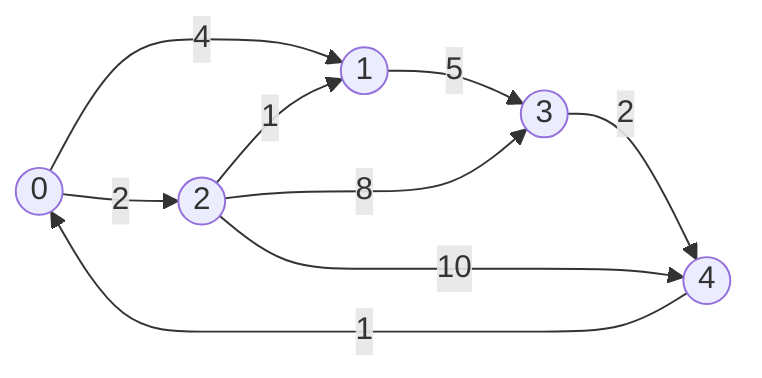

Running Dijkstra's algorithm from vertex 0 would give:
- Shortest path to 0: 0 (distance: 0)
- Shortest path to 1: 0 → 2 → 1 (distance: 3)
- Shortest path to 2: 0 → 2 (distance: 2)
- Shortest path to 3: 0 → 2 → 1 → 3 (distance: 8)
- Shortest path to 4: 0 → 2 → 1 → 3 → 4 (distance: 10)

### 2. Bellman-Ford Algorithm

Bellman-Ford algorithm finds the shortest path from a source vertex to all other vertices, even in graphs with negative edge weights. Unlike Dijkstra's, it can detect negative cycles (cycles whose edges sum to a negative value).

#### Algorithm:
1. Initialize distances from source to all vertices as infinite, and distance to source as 0
2. Relax all edges V-1 times, where V is the number of vertices
3. Check for negative weight cycles by attempting to relax edges one more time

#### Properties:
- Time Complexity: O(V·E)
- Space Complexity: O(V)
- Works with negative edge weights
- Can detect negative cycles
- Single-source shortest path algorithm
- Uses dynamic programming approach

#### Implementation

```java
public class BellmanFord {
    private static final int INF = Integer.MAX_VALUE;
    
    public int[] bellmanFord(GraphEdgeList graph, int source) {
        int vertices = graph.getVertices();
        int[] dist = new int[vertices];
        int[] pred = new int[vertices]; // Predecessor array for path reconstruction
        
        // Initialize distances and predecessor array
        Arrays.fill(dist, INF);
        Arrays.fill(pred, -1);
        dist[source] = 0;
        
        // Relax all edges |V| - 1 times
        for (int i = 0; i < vertices - 1; i++) {
            for (Edge edge : graph.getEdges()) {
                if (dist[edge.source] != INF && 
                    dist[edge.source] + edge.weight < dist[edge.destination]) {
                    dist[edge.destination] = dist[edge.source] + edge.weight;
                    pred[edge.destination] = edge.source;
                }
            }
        }
        
        // Check for negative weight cycles
        boolean hasNegativeCycle = false;
        for (Edge edge : graph.getEdges()) {
            if (dist[edge.source] != INF && 
                dist[edge.source] + edge.weight < dist[edge.destination]) {
                System.out.println("Graph contains negative weight cycle");
                hasNegativeCycle = true;
                break;
            }
        }
        
        if (hasNegativeCycle) {
            return null; // Indicates presence of negative cycle
        }
        
        return dist;
    }
    
    // Method to reconstruct the shortest path from source to destination
    public List<Integer> getPath(int[] pred, int source, int destination) {
        List<Integer> path = new ArrayList<>();
        
        // If destination is unreachable
        if (pred[destination] == -1 && source != destination) {
            return path;
        }
        
        // Start from destination and work backwards
        for (int at = destination; at != -1; at = pred[at]) {
            path.add(at);
        }
        
        // Reverse to get path from source to destination
        Collections.reverse(path);
        return path;
    }
    
    // Function to find and print negative cycles
    public void findNegativeCycle(GraphEdgeList graph) {
        int vertices = graph.getVertices();
        int[] dist = new int[vertices];
        int[] pred = new int[vertices];
        
        // Initialize distances
        Arrays.fill(dist, INF);
        Arrays.fill(pred, -1);
        dist[0] = 0; // Start from arbitrary vertex
        
        // Relax all edges |V| times
        for (int i = 0; i < vertices; i++) {
            for (Edge edge : graph.getEdges()) {
                if (dist[edge.source] != INF && 
                    dist[edge.source] + edge.weight < dist[edge.destination]) {
                    dist[edge.destination] = dist[edge.source] + edge.weight;
                    pred[edge.destination] = edge.source;
                }
            }
        }
        
        // Check for negative weight cycles and identify one
        boolean[] visited = new boolean[vertices];
        for (Edge edge : graph.getEdges()) {
            if (dist[edge.source] != INF && 
                dist[edge.source] + edge.weight < dist[edge.destination]) {
                
                // Found a vertex that is part of a negative cycle
                int vertex = edge.destination;
                
                // Find a vertex in the cycle (by traversing predecessors until a vertex is revisited)
                for (int i = 0; i < vertices; i++) {
                    vertex = pred[vertex];
                }
                
                // Extract cycle
                List<Integer> cycle = new ArrayList<>();
                int start = vertex;
                do {
                    cycle.add(vertex);
                    vertex = pred[vertex];
                } while (vertex != start);
                
                // Add the start vertex again to complete the cycle
                cycle.add(start);
                
                // Reverse to get the cycle in order
                Collections.reverse(cycle);
                
                System.out.println("Negative cycle found: " + cycle);
                return;
            }
        }
        
        System.out.println("No negative cycle exists in the graph");
    }
}
```

### 3. Floyd-Warshall Algorithm

Floyd-Warshall algorithm finds the shortest paths between all pairs of vertices in a graph. It works with negative edge weights but not with negative cycles.

#### Algorithm:
1. Initialize the distance matrix with direct edge weights
2. For each vertex k as an intermediate vertex:
   a. For each pair of vertices (i, j):
      i. If the path through k is shorter than the direct path, update the distance

#### Properties:
- Time Complexity: O(V³)
- Space Complexity: O(V²)
- All-pairs shortest path algorithm
- Uses dynamic programming approach
- Works with negative edge weights
- Cannot handle negative cycles

#### Implementation

```java
public class FloydWarshall {
    private static final int INF = Integer.MAX_VALUE;
    
    public int[][] floydWarshall(GraphMatrix graph) {
        int vertices = graph.getVertices();
        int[][] dist = new int[vertices][vertices];
        int[][] next = new int[vertices][vertices]; // For path reconstruction

        // Initialize distance matrix and next matrix
        for (int i = 0; i < vertices; i++) {
            for (int j = 0; j < vertices; j++) {
                if (i == j) {
                    dist[i][j] = 0;
                } else if (graph.hasEdge(i, j)) {
                    dist[i][j] = graph.getWeight(i, j);
                    next[i][j] = j;
                } else {
                    dist[i][j] = INF;
                    next[i][j] = -1;
                }
            }
        }

        // Floyd-Warshall algorithm
        for (int k = 0; k < vertices; k++) {
            for (int i = 0; i < vertices; i++) {
                for (int j = 0; j < vertices; j++) {
                    if (dist[i][k] != INF && dist[k][j] != INF &&
                        dist[i][k] + dist[k][j] < dist[i][j]) {
                        dist[i][j] = dist[i][k] + dist[k][j];
                        next[i][j] = next[i][k];
                    }
                }
            }
        }

        // Check for negative cycles
        for (int i = 0; i < vertices; i++) {
            if (dist[i][i] < 0) {
                System.out.println("Graph contains negative weight cycle");
                return null;
            }
        }

        return dist;
    }
    
    // Method to reconstruct the shortest path from source to destination
    public List<Integer> getPath(int[][] next, int source, int destination) {
        List<Integer> path = new ArrayList<>();
        
        // If there is no path between source and destination
        if (next[source][destination] == -1) {
            return path;
        }
        
        // Reconstruct the path using the next matrix
        path.add(source);
        while (source != destination) {
            source = next[source][destination];
            path.add(source);
        }
        
        return path;
    }
    
    // Print the all-pairs shortest paths
    public void printAllPairsShortestPaths(int[][] dist) {
        int vertices = dist.length;
        System.out.println("Shortest distances between every pair of vertices:");
        
        for (int i = 0; i < vertices; i++) {
            for (int j = 0; j < vertices; j++) {
                if (dist[i][j] == INF) {
                    System.out.print("INF\t");
                } else {
                    System.out.print(dist[i][j] + "\t");
                }
            }
            System.out.println();
        }
    }
}
```

### Comparison of Shortest Path Algorithms

| Algorithm | Time Complexity | Space Complexity | Negative Weights | Negative Cycles | Use Case |
|-----------|----------------|-----------------|------------------|-----------------|----------|
| Dijkstra | O(E log V) | O(V) | No | No | Single-source, non-negative weights |
| Bellman-Ford | O(V·E) | O(V) | Yes | Can detect | Single-source, allows negative weights |
| Floyd-Warshall | O(V³) | O(V²) | Yes | No | All-pairs shortest paths |

### Applications of Shortest Path Algorithms

1. **Network Routing**:
   - Finding the most efficient path for data packets
   - Minimizing latency in communication networks

2. **Navigation Systems**:
   - Determining the fastest/shortest route between locations
   - Real-time route adjustments based on traffic conditions

3. **Logistics and Transportation**:
   - Optimizing delivery routes
   - Flight path planning

4. **Social Networks**:
   - Finding the shortest connection between users
   - Six degrees of separation calculations

5. **Resource Allocation**:
   - Minimizing cost in resource distribution
   - Critical path analysis in project management

## Minimum Spanning Tree Algorithms

A Minimum Spanning Tree (MST) is a subset of the edges of a connected, undirected, weighted graph that connects all vertices together with the minimum possible total edge weight. MST has exactly V-1 edges where V is the number of vertices in the graph.

### Formal Problem Definition

Given a connected, undirected, weighted graph G = (V, E) with weight function w: E → R, find a subset T of edges such that:
1. T is a spanning tree (connects all vertices with no cycles)
2. The sum of the weights of the edges in T is minimized: Σ(e∈T) w(e) is minimal

### Properties of MST

1. **Uniqueness**: If all edge weights are unique, the MST is unique
2. **Cycle Property**: For any cycle in the graph, the edge with the highest weight is not in the MST
3. **Cut Property**: For any partition of vertices, the minimum weight edge crossing the partition is in the MST
4. **Number of Edges**: MST contains exactly V-1 edges (where V is the number of vertices)
5. **Optimality**: MST has the minimum total weight among all spanning trees

### 1. Kruskal's Algorithm

Kruskal's algorithm builds the MST by adding edges in ascending order of weight, skipping those that would create a cycle. It uses a disjoint-set data structure to detect cycles efficiently.

#### Algorithm:
1. Sort all edges in non-decreasing order of weight
2. Initialize an empty MST
3. For each edge in the sorted order:
   a. If adding the edge does not create a cycle, add it to the MST
   b. Otherwise, discard the edge
4. Repeat until the MST has V-1 edges

#### Properties:
- Time Complexity: O(E log E) or O(E log V)
- Space Complexity: O(E + V)
- Uses greedy approach
- Based on the cut property of MSTs
- Uses Union-Find data structure to detect cycles

#### Proof of Correctness:

Kruskal's algorithm follows a greedy approach by always selecting the edge with the minimum weight that does not form a cycle. The correctness is based on the cut property: for any partition of vertices, the minimum weight edge crossing the partition must be in the MST.

Consider any cut of the graph separating vertices into two sets S and V-S. The algorithm will eventually consider the minimum weight edge crossing this cut. When it does, the edge will be added to the MST (unless it creates a cycle, which is impossible for the minimum weight edge across a cut). Since this applies to all possible cuts, the resulting tree must be a minimum spanning tree.

#### Implementation with Union-Find

```java
public class Kruskal {
    // Edge class to represent graph edges
    private static class Edge implements Comparable<Edge> {
        int source, destination, weight;

        Edge(int source, int destination, int weight) {
            this.source = source;
            this.destination = destination;
            this.weight = weight;
        }

        @Override
        public int compareTo(Edge other) {
            return Integer.compare(this.weight, other.weight);
        }
        
        @Override
        public String toString() {
            return source + " -- " + destination + " (" + weight + ")";
        }
    }

    // DisjointSet class for cycle detection
    private static class DisjointSet {
        int[] parent, rank;
        
        DisjointSet(int n) {
            parent = new int[n];
            rank = new int[n];
            
            // Initialize each element as a separate set
            for (int i = 0; i < n; i++) {
                parent[i] = i;
            }
        }
        
        // Find the representative of the set (with path compression)
        int find(int x) {
            if (parent[x] != x) {
                parent[x] = find(parent[x]); // Path compression
            }
            return parent[x];
        }
        
        // Union by rank to keep the tree balanced
        void union(int x, int y) {
            int xRoot = find(x);
            int yRoot = find(y);
            
            if (xRoot == yRoot) return;
            
            // Attach smaller rank tree under root of higher rank tree
            if (rank[xRoot] < rank[yRoot]) {
                parent[xRoot] = yRoot;
            } else if (rank[xRoot] > rank[yRoot]) {
                parent[yRoot] = xRoot;
            } else {
                // If ranks are same, make one as root and increment its rank
                parent[yRoot] = xRoot;
                rank[xRoot]++;
            }
        }
    }

    public List<Edge> kruskalMST(GraphEdgeList graph) {
        int vertices = graph.getVertices();
        List<Edge> result = new ArrayList<>();
        List<Edge> edges = graph.getEdges();
        
        // Sort edges based on weight
        Collections.sort(edges);
        
        // Create disjoint set for cycle detection
        DisjointSet ds = new DisjointSet(vertices);
        
        int edgeCount = 0;
        int index = 0;
        
        // MST has V-1 edges
        while (edgeCount < vertices - 1 && index < edges.size()) {
            Edge edge = edges.get(index++);
            
            int x = ds.find(edge.source);
            int y = ds.find(edge.destination);
            
            // If including this edge doesn't cause a cycle
            if (x != y) {
                result.add(edge);
                ds.union(x, y);
                edgeCount++;
            }
        }
        
        // Check if MST is complete (connected graph)
        if (edgeCount != vertices - 1) {
            System.out.println("Graph is not connected, no MST exists");
            return new ArrayList<>();
        }
        
        return result;
    }
    
    // Calculate the total weight of the MST
    public int getTotalWeight(List<Edge> mst) {
        int totalWeight = 0;
        for (Edge edge : mst) {
            totalWeight += edge.weight;
        }
        return totalWeight;
    }
    
    // Print the MST
    public void printMST(List<Edge> mst) {
        System.out.println("Minimum Spanning Tree edges:");
        for (Edge edge : mst) {
            System.out.println(edge);
        }
        System.out.println("Total MST weight: " + getTotalWeight(mst));
    }
}
```

#### Example and Visualization

Consider this weighted undirected graph:

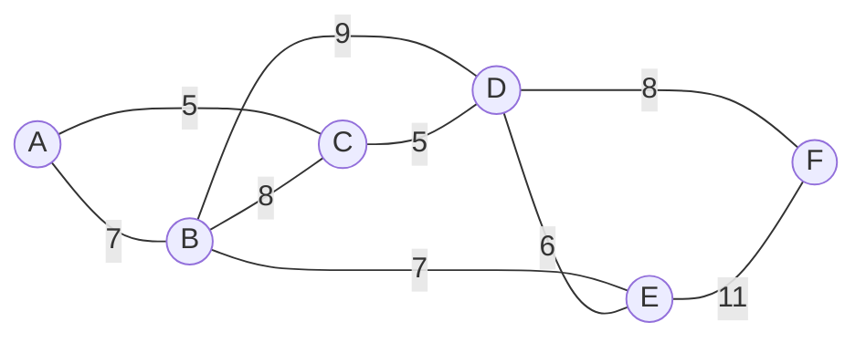

Kruskal's algorithm would process edges in this order:
1. (A,C) with weight 5 - Add to MST
2. (C,D) with weight 5 - Add to MST
3. (D,E) with weight 6 - Add to MST
4. (D,F) with weight 8 - Add to MST
5. (A,B) with weight 7 - Add to MST

The resulting MST has a total weight of 31:

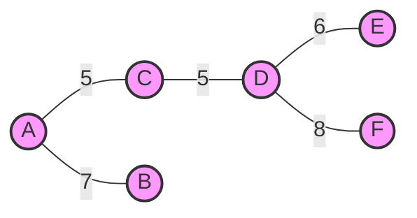

### 2. Prim's Algorithm

Prim's algorithm builds the MST by growing from a starting vertex, always adding the minimum weight edge that connects a vertex in the tree to a vertex outside the tree.

#### Algorithm:
1. Start with any vertex as a single-vertex tree
2. Repeat until all vertices are included:
   a. Find the minimum weight edge that connects a vertex in the tree to a vertex outside the tree
   b. Add the edge and the outside vertex to the growing tree

#### Properties:
- Time Complexity: O(E log V) with binary heap, O(V²) with adjacency matrix
- Space Complexity: O(V)
- Uses greedy approach
- Based on the cut property of MSTs
- More efficient than Kruskal's for dense graphs

#### Proof of Correctness:

Prim's algorithm also follows a greedy approach and its correctness is based on the cut property. At each step, the algorithm maintains a cut (S, V-S) where S is the set of vertices already in the MST. It then adds the minimum weight edge crossing this cut. This edge must be in the MST according to the cut property. Since the algorithm considers all possible cuts as it grows the tree, the resulting tree must be a minimum spanning tree.

#### Implementation with Priority Queue

```java
public class Prim {
    private static final int INF = Integer.MAX_VALUE;
    
    // Edge class to represent MST edges
    private static class Edge {
        int source, destination, weight;
        
        Edge(int source, int destination, int weight) {
            this.source = source;
            this.destination = destination;
            this.weight = weight;
        }
        
        @Override
        public String toString() {
            return source + " -- " + destination + " (" + weight + ")";
        }
    }
    
    // Node class for priority queue
    private static class Node implements Comparable<Node> {
        int vertex;
        int key; // key value used to pick minimum weight edge
        
        Node(int vertex, int key) {
            this.vertex = vertex;
            this.key = key;
        }
        
        @Override
        public int compareTo(Node other) {
            return Integer.compare(this.key, other.key);
        }
    }

    // Implementation using adjacency matrix
    public List<Edge> primMST(GraphMatrix graph) {
        int vertices = graph.getVertices();
        List<Edge> result = new ArrayList<>();
        
        // Array to store constructed MST
        int[] parent = new int[vertices];
        
        // Key values used to pick minimum weight edge
        int[] key = new int[vertices];
        
        // To represent set of vertices not yet included in MST
        boolean[] mstSet = new boolean[vertices];
        
        // Initialize all keys as INFINITE
        Arrays.fill(key, INF);
        Arrays.fill(parent, -1);
        
        // Start with the first vertex
        key[0] = 0;
        
        // MST will have V vertices
        for (int count = 0; count < vertices; count++) {
            // Pick the minimum key vertex from the set of vertices not yet included in MST
            int u = minKey(key, mstSet);
            
            // Add the picked vertex to the MST Set
            mstSet[u] = true;
            
            // Add edge to result if it's not the starting vertex
            if (parent[u] != -1) {
                result.add(new Edge(parent[u], u, graph.getWeight(parent[u], u)));
            }
            
            // Update key value and parent index of the adjacent vertices
            for (int v = 0; v < vertices; v++) {
                if (graph.hasEdge(u, v) && !mstSet[v] && 
                    graph.getWeight(u, v) < key[v]) {
                    key[v] = graph.getWeight(u, v);
                    parent[v] = u;
                }
            }
        }
        
        return result;
    }
    
    // Implementation using adjacency list and priority queue (more efficient)
    public List<Edge> primMSTPQ(WeightedGraphList graph) {
        int vertices = graph.getVertices();
        List<Edge> result = new ArrayList<>();
        
        // To keep track of vertices included in MST
        boolean[] inMST = new boolean[vertices];
        
        // Keys used to pick minimum weight edge
        int[] key = new int[vertices];
        
        // Parent to store MST
        int[] parent = new int[vertices];
        
        // Initialize keys and parent
        Arrays.fill(key, INF);
        Arrays.fill(parent, -1);
        
        // Priority queue to store vertices with their keys
        PriorityQueue<Node> pq = new PriorityQueue<>();
        
        // Start with vertex 0
        key[0] = 0;
        pq.add(new Node(0, 0));
        
        // While priority queue is not empty
        while (!pq.isEmpty()) {
            // Extract the vertex with minimum key
            Node node = pq.poll();
            int u = node.vertex;
            
            // Skip if already in MST
            if (inMST[u]) {
                continue;
            }
            
            // Include vertex in MST
            inMST[u] = true;
            
            // Add edge to result if it's not the starting vertex
            if (parent[u] != -1) {
                result.add(new Edge(parent[u], u, key[u]));
            }
            
            // Update key and parent of adjacent vertices
            for (WeightedGraphList.Edge edge : graph.getNeighbors(u)) {
                int v = edge.destination;
                int weight = edge.weight;
                
                if (!inMST[v] && weight < key[v]) {
                    key[v] = weight;
                    parent[v] = u;
                    pq.add(new Node(v, key[v]));
                }
            }
        }
        
        return result;
    }
    
    // Utility method to find the vertex with minimum key value
    private int minKey(int[] key, boolean[] mstSet) {
        int min = INF;
        int minIndex = -1;
        
        for (int v = 0; v < key.length; v++) {
            if (!mstSet[v] && key[v] < min) {
                min = key[v];
                minIndex = v;
            }
        }
        
        return minIndex;
    }
    
    // Calculate the total weight of the MST
    public int getTotalWeight(List<Edge> mst) {
        int totalWeight = 0;
        for (Edge edge : mst) {
            totalWeight += edge.weight;
        }
        return totalWeight;
    }
    
    // Print the MST
    public void printMST(List<Edge> mst) {
        System.out.println("Minimum Spanning Tree edges:");
        for (Edge edge : mst) {
            System.out.println(edge);
        }
        System.out.println("Total MST weight: " + getTotalWeight(mst));
    }
}
```

#### Example and Visualization

Using the same graph as in the Kruskal's example, Prim's algorithm starting from vertex A would grow the MST as follows:

1. Start with vertex A
2. Add edge (A,C) with weight 5
3. Add edge (C,D) with weight 5
4. Add edge (D,E) with weight 6
5. Add edge (D,F) with weight 8
6. Add edge (A,B) with weight 7

The resulting MST is the same as with Kruskal's algorithm (total weight: 31).

### Comparison of MST Algorithms

| Algorithm | Time Complexity | Space Complexity | Approach | Best For |
|-----------|----------------|-----------------|----------|----------|
| Kruskal | O(E log E) or O(E log V) | O(E + V) | Sort edges and add if no cycle | Sparse graphs |
| Prim | O(E log V) with binary heap | O(V) | Grow from a vertex by adding minimum edge | Dense graphs |

### Applications of MST Algorithms

1. **Network Design**:
   - Designing cost-efficient computer or electrical networks
   - Minimizing total wiring length in circuit design

2. **Transportation Networks**:
   - Planning road, railway, or water networks to minimize construction costs
   - Optimizing routes to reduce maintenance costs

3. **Clustering**:
   - Single-link clustering in data mining
   - Image segmentation in computer vision

4. **Approximation Algorithms**:
   - Approximating solutions to NP-hard problems like the Traveling Salesman Problem
   - Creating spanning trees with constraints

5. **Network Topology in Computer Networks**:
   - Determining the most efficient network topology
   - Minimizing overall network latency

6. **Indirect MST Applications**:
   - Maze generation algorithms
   - Finding paths with the minimum maximum edge weight (minimax paths)

## Real-World Applications

Graphs are one of the most versatile data structures with numerous applications across various domains:

### Network Analysis and Design
- **Computer Networks**: Routing protocols, network topology design, and traffic optimization
- **Social Networks**: Community detection, influence analysis, recommendation systems
- **Web Analysis**: PageRank algorithm for web page importance, web crawling
- **Transportation Networks**: Road networks, flight paths, public transit planning
- **Utility Networks**: Electrical grids, water distribution systems, telecommunications

### Computational Biology
- **Protein-Protein Interaction Networks**: Understanding biological systems
- **Metabolic Pathways**: Modeling biochemical reactions
- **Phylogenetic Trees**: Evolutionary relationships between species
- **Gene Regulatory Networks**: Understanding gene expression control
- **Disease Transmission**: Modeling epidemic spread

### Artificial Intelligence
- **Knowledge Representation**: Knowledge graphs for semantic understanding
- **Machine Learning**: Graph neural networks for structured data
- **Natural Language Processing**: Word dependency parsing, semantic networks
- **Computer Vision**: Scene graphs, image segmentation
- **Reinforcement Learning**: State transition graphs

### Operations Research
- **Scheduling**: Job scheduling, project management (PERT/CPM)
- **Resource Allocation**: Assignment problems, network flow optimization
- **Supply Chain Management**: Distribution network optimization
- **Logistics**: Delivery route optimization, warehouse layout
- **Facility Location**: Optimal positioning of facilities

### Computer Science
- **Compiler Design**: Control flow graphs, data dependency analysis
- **Database Systems**: Query optimization, data dependency graphs
- **Operating Systems**: Process scheduling, resource allocation graphs
- **Software Engineering**: Call graphs, module dependency analysis
- **Distributed Systems**: Consensus algorithms, distributed coordination

### Case Studies

#### Case Study 1: Google Maps Routing
Google Maps uses graph algorithms to determine optimal routes between locations:
- Vertices represent intersections, landmarks, or addresses
- Edges represent roads or paths with weights based on:
  - Distance
  - Expected travel time
  - Traffic conditions (dynamic weighting)
  - Road type and speed limits
- Algorithms used include bidirectional Dijkstra's algorithm and A* search with various heuristics
- The system also considers real-time factors and historical traffic patterns

#### Case Study 2: Social Media Network Analysis
Platforms like Facebook and LinkedIn use graph theory extensively:
- Vertices represent users
- Edges represent relationships (friends, connections)
- Algorithms used:
  - Community detection for group suggestions
  - PageRank-like algorithms for feed content ranking
  - Shortest path variants for "degrees of separation"
  - Clustering algorithms for ad targeting
- These systems process graphs with billions of vertices and edges

#### Case Study 3: Biological Network Analysis
In systems biology, researchers use graphs to model complex biological systems:
- Protein-protein interaction networks map how proteins interact
- Metabolic networks represent biochemical reactions
- Graph algorithms help identify important proteins (centrality measures)
- Network motifs reveal recurring interaction patterns
- Such analyses help in drug discovery and understanding disease mechanisms

## Best Practices in Graph Implementation

When working with graph algorithms, consider these best practices:

### 1. Choosing the Right Representation

- **Adjacency Matrix**: Suitable for dense graphs, when quick edge lookup is needed
  - Pro: O(1) edge lookups
  - Con: O(V²) space regardless of edge count
  
- **Adjacency List**: Suitable for sparse graphs, most common representation
  - Pro: Space-efficient for sparse graphs, O(V + E)
  - Con: O(degree) for edge lookups
  
- **Edge List**: Simple for algorithms that process all edges
  - Pro: Simplicity, good for minimum spanning tree algorithms
  - Con: Inefficient for queries about specific vertices

### 2. Algorithm Selection Guidelines

- For traversal in unweighted graphs: BFS or DFS
- For shortest paths in weighted graphs:
  - No negative weights: Dijkstra's algorithm
  - Negative weights: Bellman-Ford algorithm
  - All pairs: Floyd-Warshall algorithm
- For minimum spanning trees:
  - Sparse graph: Kruskal's algorithm
  - Dense graph: Prim's algorithm
- For connectivity: Union-Find data structure or DFS
- For topological ordering: DFS-based sorting

### 3. Optimization Techniques

- Use appropriate data structures (priority queues for Dijkstra's algorithm)
- Consider bidirectional search for pathfinding
- Use adjacency lists for sparse graphs
- Implement edge compression for large graphs
- Consider lazy evaluation where appropriate
- Use bit manipulation for graph representation when possible
- Implement early termination conditions
- Use heuristics (such as A* search) when applicable

### 4. Testing Graph Algorithms

- Test with edge cases:
  - Empty graph
  - Single vertex graph
  - Disconnected graph
  - Complete graph
  - Bipartite graph
  - Cycle detection on cyclic and acyclic graphs
- Verify algorithm correctness with known examples
- Compare results against brute force approaches for small instances
- Measure performance on progressively larger graphs

## Common Pitfalls and Edge Cases

When implementing graph algorithms, be aware of these common issues:

1. **Infinite Loops**: Not properly marking nodes as visited can lead to infinite recursion or loops

2. **Disconnected Graphs**: Forgetting to handle multiple connected components

3. **Self-Loops and Parallel Edges**: Special handling may be needed for graphs with self-loops or multiple edges between vertices

4. **Negative Cycles**: In shortest path algorithms, negative cycles can lead to undefined behavior

5. **Memory Constraints**: Large graphs can exceed memory limits, requiring special techniques

6. **Off-by-One Errors**: When using 0-indexed or 1-indexed vertex representations

7. **Correctness vs. Efficiency**: Sometimes a slower algorithm is more appropriate for correctness guarantees

8. **Directed vs. Undirected**: Confusing directed and undirected graph properties

## Exercises

### Basic Exercises

1. Implement DFS and BFS traversal algorithms and compare their behavior on different graph types
2. Implement a function to check if a graph is bipartite
3. Write a function to detect cycles in both directed and undirected graphs
4. Implement topological sorting for a directed acyclic graph
5. Write a function to find all connected components in an undirected graph

### Intermediate Exercises

1. Implement Dijkstra's algorithm to find the shortest path between two vertices
2. Implement the Bellman-Ford algorithm and test it on graphs with negative edges
3. Implement Kruskal's and Prim's algorithms for finding the minimum spanning tree
4. Write a function to determine if a directed graph is strongly connected
5. Implement an algorithm to find articulation points and bridges in a graph

### Advanced Exercises

1. Implement the Ford-Fulkerson algorithm for maximum flow problems
2. Write an algorithm to find the shortest path that visits all vertices exactly once (traveling salesman problem)
3. Implement a solution for the vertex coloring problem
4. Create an algorithm to find the maximum bipartite matching in a bipartite graph
5. Implement an efficient algorithm for finding all cycles in a directed graph

## Summary

Graphs are powerful and versatile data structures that model relationships in countless real-world scenarios. Understanding graph theory and mastering graph algorithms provides powerful tools for solving complex problems across many domains.

Key takeaways:
- Choose the right graph representation based on the problem requirements
- Select the appropriate algorithm for the specific graph problem
- Be aware of edge cases and common pitfalls in graph algorithms
- Practice implementing various graph algorithms to build intuition

[Back to Course Content](README.md) | [Previous: Trees](trees.md) | [Next: Sorting Algorithms →](sorting.md) 