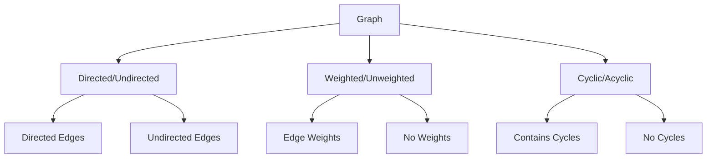

# Graphs

[Back to Course Content](README.md) | [← Previous: Advanced Trees](advanced-trees.md) | [Next: Sorting Algorithms →](sorting.md)

## Introduction to Graphs

A graph is a non-linear data structure consisting of vertices (nodes) and edges that connect these vertices.

### Graph Characteristics



### Graph Terminology

| Term | Description |
|------|-------------|
| Vertex/Node | Point in graph |
| Edge | Connection between vertices |
| Degree | Number of edges connected to vertex |
| Path | Sequence of vertices connected by edges |
| Cycle | Path that starts and ends at same vertex |
| Connected | Path exists between all vertices |
| Weighted | Edges have associated values |
| Directed | Edges have direction |
| Undirected | Edges have no direction |

## Graph Representations

### 1. Adjacency Matrix

```python
class GraphMatrix:
    def __init__(self, vertices):
        self.V = vertices
        self.graph = [[0] * vertices for _ in range(vertices)]
    
    def add_edge(self, u, v, weight=1):
        self.graph[u][v] = weight
        # For undirected graph
        self.graph[v][u] = weight
    
    def remove_edge(self, u, v):
        self.graph[u][v] = 0
        # For undirected graph
        self.graph[v][u] = 0
```

### 2. Adjacency List

```python
class GraphList:
    def __init__(self, vertices):
        self.V = vertices
        self.graph = [[] for _ in range(vertices)]
    
    def add_edge(self, u, v, weight=1):
        self.graph[u].append((v, weight))
        # For undirected graph
        self.graph[v].append((u, weight))
    
    def remove_edge(self, u, v):
        self.graph[u] = [(x, w) for x, w in self.graph[u] if x != v]
        # For undirected graph
        self.graph[v] = [(x, w) for x, w in self.graph[v] if x != u]
```

## Graph Traversal Algorithms

### 1. Depth-First Search (DFS)

```python
def dfs(graph, start, visited=None):
    if visited is None:
        visited = set()
    
    visited.add(start)
    print(start, end=' ')
    
    for neighbor in graph[start]:
        if neighbor not in visited:
            dfs(graph, neighbor, visited)

# Iterative DFS
def dfs_iterative(graph, start):
    visited = set()
    stack = [start]
    
    while stack:
        vertex = stack.pop()
        if vertex not in visited:
            visited.add(vertex)
            print(vertex, end=' ')
            stack.extend(reversed(graph[vertex]))
```

### 2. Breadth-First Search (BFS)

```python
from collections import deque

def bfs(graph, start):
    visited = set()
    queue = deque([start])
    visited.add(start)
    
    while queue:
        vertex = queue.popleft()
        print(vertex, end=' ')
        
        for neighbor in graph[vertex]:
            if neighbor not in visited:
                visited.add(neighbor)
                queue.append(neighbor)
```

## Shortest Path Algorithms

### 1. Dijkstra's Algorithm

```python
import heapq

def dijkstra(graph, start):
    distances = {vertex: float('infinity') for vertex in graph}
    distances[start] = 0
    pq = [(0, start)]
    
    while pq:
        current_distance, current_vertex = heapq.heappop(pq)
        
        if current_distance > distances[current_vertex]:
            continue
        
        for neighbor, weight in graph[current_vertex]:
            distance = current_distance + weight
            
            if distance < distances[neighbor]:
                distances[neighbor] = distance
                heapq.heappush(pq, (distance, neighbor))
    
    return distances
```

### 2. Floyd-Warshall Algorithm

```python
def floyd_warshall(graph):
    V = len(graph)
    dist = [[float('infinity')] * V for _ in range(V)]
    
    # Initialize distances
    for i in range(V):
        for j in range(V):
            if i == j:
                dist[i][j] = 0
            elif graph[i][j] != 0:
                dist[i][j] = graph[i][j]
    
    # Floyd-Warshall algorithm
    for k in range(V):
        for i in range(V):
            for j in range(V):
                if dist[i][k] + dist[k][j] < dist[i][j]:
                    dist[i][j] = dist[i][k] + dist[k][j]
    
    return dist
```

## Minimum Spanning Tree Algorithms

### 1. Kruskal's Algorithm

```python
class DisjointSet:
    def __init__(self, vertices):
        self.parent = {v: v for v in vertices}
        self.rank = {v: 0 for v in vertices}
    
    def find(self, item):
        if self.parent[item] != item:
            self.parent[item] = self.find(self.parent[item])
        return self.parent[item]
    
    def union(self, x, y):
        root_x = self.find(x)
        root_y = self.find(y)
        
        if root_x != root_y:
            if self.rank[root_x] < self.rank[root_y]:
                self.parent[root_x] = root_y
            elif self.rank[root_x] > self.rank[root_y]:
                self.parent[root_y] = root_x
            else:
                self.parent[root_y] = root_x
                self.rank[root_x] += 1

def kruskal(graph):
    edges = []
    for u in graph:
        for v, weight in graph[u]:
            edges.append((weight, u, v))
    
    edges.sort()
    ds = DisjointSet(graph.keys())
    mst = []
    
    for weight, u, v in edges:
        if ds.find(u) != ds.find(v):
            ds.union(u, v)
            mst.append((u, v, weight))
    
    return mst
```

### 2. Prim's Algorithm

```python
def prim(graph, start):
    mst = []
    visited = {start}
    edges = [(weight, start, v) for v, weight in graph[start]]
    heapq.heapify(edges)
    
    while edges:
        weight, u, v = heapq.heappop(edges)
        if v not in visited:
            visited.add(v)
            mst.append((u, v, weight))
            for neighbor, weight in graph[v]:
                if neighbor not in visited:
                    heapq.heappush(edges, (weight, v, neighbor))
    
    return mst
```

## Graph Applications

### 1. Social Networks
- Friend connections
- Follow relationships
- Network analysis
- Community detection

### 2. Transportation Networks
- Road maps
- Flight routes
- Navigation systems
- Traffic flow

### 3. Computer Networks
- Network topology
- Routing protocols
- Network flow
- Connection optimization

### 4. Game Development
- Path finding
- AI navigation
- Game state transitions
- Level design

## Implementation Considerations

### Memory Management
1. Sparse vs dense graphs
2. Memory-efficient representations
3. Dynamic graph updates
4. Cache optimization

### Performance Optimization
1. Algorithm selection
2. Data structure choice
3. Parallel processing
4. Caching strategies

## Best Practices

### Graph Design
1. Choose appropriate representation
2. Consider graph properties
3. Plan for scalability
4. Handle edge cases

### Implementation
1. Use efficient data structures
2. Optimize algorithms
3. Handle memory constraints
4. Consider concurrency

## Summary

Key points to remember:
1. Graphs model relationships
2. Different representations exist
3. Various traversal methods
4. Multiple path-finding algorithms
5. MST algorithms for optimization
6. Consider application needs

By understanding graphs, you can:
- Model complex relationships
- Solve path-finding problems
- Optimize network flows
- Design efficient algorithms
- Build scalable systems 