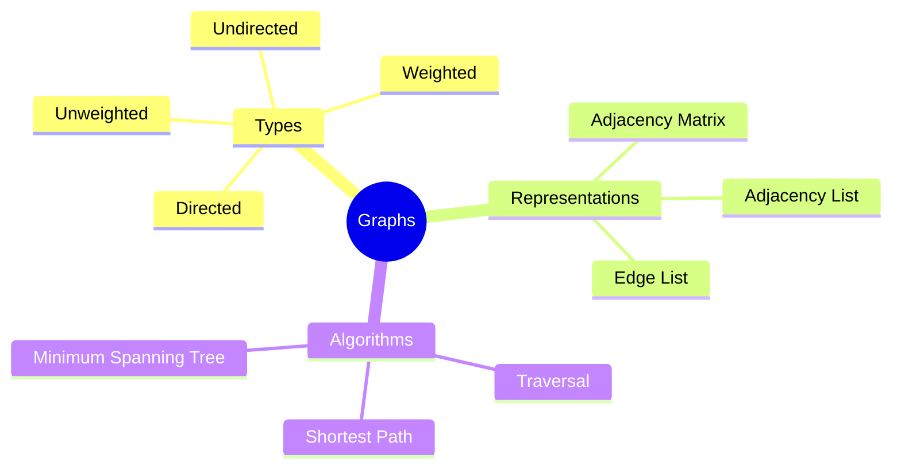

# Graphs

[Back to Course Content](README.md) | [Previous: Trees](trees.md) | [Next: Sorting Algorithms →](sorting.md)

> Reference: This content is based on Graphs.pdf and Graph-algorithms.pdf

## What are Graphs?

Graphs are non-linear data structures that represent relationships between objects. They consist of vertices (nodes) connected by edges, which can be directed or undirected.



## Basic Graph Concepts

### Graph Terminology

- **Vertex/Node**: Point in the graph
- **Edge**: Connection between vertices
- **Degree**: Number of edges connected to a vertex
- **Path**: Sequence of vertices connected by edges
- **Cycle**: Path that starts and ends at same vertex
- **Connected**: Path exists between any two vertices
- **Weight**: Value associated with an edge

### Graph Properties

1. **Directed vs Undirected**
   - Directed: Edges have direction
   - Undirected: Edges have no direction

2. **Weighted vs Unweighted**
   - Weighted: Edges have weights
   - Unweighted: All edges have same weight

3. **Cyclic vs Acyclic**
   - Cyclic: Contains cycles
   - Acyclic: No cycles

## Graph Representations

### 1. Adjacency Matrix

A 2D array where matrix[i][j] indicates if there's an edge between vertex i and j.

```java
public class GraphMatrix {
    private int[][] matrix;
    private int vertices;

    public GraphMatrix(int vertices) {
        this.vertices = vertices;
        matrix = new int[vertices][vertices];
    }

    public void addEdge(int source, int destination) {
        matrix[source][destination] = 1;
        // For undirected graph
        matrix[destination][source] = 1;
    }

    public void addWeightedEdge(int source, int destination, int weight) {
        matrix[source][destination] = weight;
        // For undirected graph
        matrix[destination][source] = weight;
    }

    public boolean hasEdge(int source, int destination) {
        return matrix[source][destination] != 0;
    }

    public int getWeight(int source, int destination) {
        return matrix[source][destination];
    }
}
```

### 2. Adjacency List

An array of lists where each list contains vertices adjacent to that vertex.

```java
public class GraphList {
    private ArrayList<ArrayList<Integer>> adjList;
    private int vertices;

    public GraphList(int vertices) {
        this.vertices = vertices;
        adjList = new ArrayList<>();
        for (int i = 0; i < vertices; i++) {
            adjList.add(new ArrayList<>());
        }
    }

    public void addEdge(int source, int destination) {
        adjList.get(source).add(destination);
        // For undirected graph
        adjList.get(destination).add(source);
    }

    public boolean hasEdge(int source, int destination) {
        return adjList.get(source).contains(destination);
    }

    public ArrayList<Integer> getNeighbors(int vertex) {
        return adjList.get(vertex);
    }
}
```

### 3. Edge List

A list of all edges in the graph.

```java
public class Edge {
    int source;
    int destination;
    int weight;

    Edge(int source, int destination, int weight) {
        this.source = source;
        this.destination = destination;
        this.weight = weight;
    }
}

public class GraphEdgeList {
    private ArrayList<Edge> edges;
    private int vertices;

    public GraphEdgeList(int vertices) {
        this.vertices = vertices;
        edges = new ArrayList<>();
    }

    public void addEdge(int source, int destination, int weight) {
        edges.add(new Edge(source, destination, weight));
        // For undirected graph
        edges.add(new Edge(destination, source, weight));
    }

    public ArrayList<Edge> getEdges() {
        return edges;
    }
}
```

## Graph Traversal Algorithms

### 1. Depth-First Search (DFS)

```java
public class GraphDFS {
    private boolean[] visited;

    public void dfs(GraphList graph, int start) {
        visited = new boolean[graph.getVertices()];
        dfsUtil(graph, start);
    }

    private void dfsUtil(GraphList graph, int vertex) {
        visited[vertex] = true;
        System.out.print(vertex + " ");

        for (int neighbor : graph.getNeighbors(vertex)) {
            if (!visited[neighbor]) {
                dfsUtil(graph, neighbor);
            }
        }
    }
}
```

### 2. Breadth-First Search (BFS)

```java
public class GraphBFS {
    private boolean[] visited;

    public void bfs(GraphList graph, int start) {
        visited = new boolean[graph.getVertices()];
        Queue<Integer> queue = new LinkedList<>();
        
        visited[start] = true;
        queue.add(start);

        while (!queue.isEmpty()) {
            int vertex = queue.poll();
            System.out.print(vertex + " ");

            for (int neighbor : graph.getNeighbors(vertex)) {
                if (!visited[neighbor]) {
                    visited[neighbor] = true;
                    queue.add(neighbor);
                }
            }
        }
    }
}
```

## Shortest Path Algorithms

### 1. Dijkstra's Algorithm

```java
public class Dijkstra {
    private static final int INF = Integer.MAX_VALUE;

    public int[] dijkstra(GraphMatrix graph, int source) {
        int vertices = graph.getVertices();
        int[] dist = new int[vertices];
        boolean[] visited = new boolean[vertices];

        Arrays.fill(dist, INF);
        dist[source] = 0;

        for (int i = 0; i < vertices - 1; i++) {
            int u = minDistance(dist, visited);
            visited[u] = true;

            for (int v = 0; v < vertices; v++) {
                if (!visited[v] && graph.hasEdge(u, v) && 
                    dist[u] != INF && 
                    dist[u] + graph.getWeight(u, v) < dist[v]) {
                    dist[v] = dist[u] + graph.getWeight(u, v);
                }
            }
        }

        return dist;
    }

    private int minDistance(int[] dist, boolean[] visited) {
        int min = INF;
        int minIndex = -1;

        for (int v = 0; v < dist.length; v++) {
            if (!visited[v] && dist[v] <= min) {
                min = dist[v];
                minIndex = v;
            }
        }

        return minIndex;
    }
}
```

### 2. Floyd-Warshall Algorithm

```java
public class FloydWarshall {
    public int[][] floydWarshall(GraphMatrix graph) {
        int vertices = graph.getVertices();
        int[][] dist = new int[vertices][vertices];

        // Initialize distance matrix
        for (int i = 0; i < vertices; i++) {
            for (int j = 0; j < vertices; j++) {
                if (i == j) {
                    dist[i][j] = 0;
                } else if (graph.hasEdge(i, j)) {
                    dist[i][j] = graph.getWeight(i, j);
                } else {
                    dist[i][j] = Integer.MAX_VALUE;
                }
            }
        }

        // Floyd-Warshall algorithm
        for (int k = 0; k < vertices; k++) {
            for (int i = 0; i < vertices; i++) {
                for (int j = 0; j < vertices; j++) {
                    if (dist[i][k] != Integer.MAX_VALUE && 
                        dist[k][j] != Integer.MAX_VALUE && 
                        dist[i][k] + dist[k][j] < dist[i][j]) {
                        dist[i][j] = dist[i][k] + dist[k][j];
                    }
                }
            }
        }

        return dist;
    }
}
```

## Minimum Spanning Tree Algorithms

### 1. Kruskal's Algorithm

```java
public class Kruskal {
    private static class Edge implements Comparable<Edge> {
        int source, destination, weight;

        Edge(int source, int destination, int weight) {
            this.source = source;
            this.destination = destination;
            this.weight = weight;
        }

        @Override
        public int compareTo(Edge other) {
            return this.weight - other.weight;
        }
    }

    private int find(int[] parent, int i) {
        if (parent[i] == i) {
            return i;
        }
        return find(parent, parent[i]);
    }

    private void union(int[] parent, int[] rank, int x, int y) {
        int xRoot = find(parent, x);
        int yRoot = find(parent, y);

        if (rank[xRoot] < rank[yRoot]) {
            parent[xRoot] = yRoot;
        } else if (rank[xRoot] > rank[yRoot]) {
            parent[yRoot] = xRoot;
        } else {
            parent[yRoot] = xRoot;
            rank[xRoot]++;
        }
    }

    public ArrayList<Edge> kruskalMST(GraphEdgeList graph) {
        ArrayList<Edge> result = new ArrayList<>();
        ArrayList<Edge> edges = graph.getEdges();
        Collections.sort(edges);

        int[] parent = new int[graph.getVertices()];
        int[] rank = new int[graph.getVertices()];

        for (int i = 0; i < graph.getVertices(); i++) {
            parent[i] = i;
        }

        for (Edge edge : edges) {
            int x = find(parent, edge.source);
            int y = find(parent, edge.destination);

            if (x != y) {
                result.add(edge);
                union(parent, rank, x, y);
            }
        }

        return result;
    }
}
```

### 2. Prim's Algorithm

```java
public class Prim {
    public ArrayList<Edge> primMST(GraphMatrix graph) {
        int vertices = graph.getVertices();
        ArrayList<Edge> result = new ArrayList<>();
        boolean[] visited = new boolean[vertices];
        int[] key = new int[vertices];
        int[] parent = new int[vertices];

        Arrays.fill(key, Integer.MAX_VALUE);
        Arrays.fill(visited, false);
        key[0] = 0;
        parent[0] = -1;

        for (int i = 0; i < vertices - 1; i++) {
            int u = minKey(key, visited);
            visited[u] = true;

            for (int v = 0; v < vertices; v++) {
                if (graph.hasEdge(u, v) && !visited[v] && 
                    graph.getWeight(u, v) < key[v]) {
                    parent[v] = u;
                    key[v] = graph.getWeight(u, v);
                }
            }
        }

        for (int i = 1; i < vertices; i++) {
            result.add(new Edge(parent[i], i, key[i]));
        }

        return result;
    }

    private int minKey(int[] key, boolean[] visited) {
        int min = Integer.MAX_VALUE;
        int minIndex = -1;

        for (int v = 0; v < key.length; v++) {
            if (!visited[v] && key[v] < min) {
                min = key[v];
                minIndex = v;
            }
        }

        return minIndex;
    }
}
```

## Real-World Applications

### Network Routing

- Internet routing
- Network topology
- Traffic optimization

### Social Networks

- Friend connections
- Influence analysis
- Community detection

### Transportation

- Route planning
- Traffic flow
- Delivery optimization

### Game Development

- Path finding
- AI navigation
- Level design

## Best Practices

1. **Graph Design**
   - Choose appropriate representation
   - Consider memory constraints
   - Plan for scalability

2. **Implementation**
   - Handle edge cases
   - Optimize for specific use cases
   - Consider parallel processing

3. **Performance**
   - Use appropriate data structures
   - Optimize algorithms
   - Cache frequently accessed data

## Common Pitfalls

1. **Memory Management**
   - Memory leaks
   - Large adjacency matrices
   - Inefficient representations

2. **Algorithm Selection**
   - Wrong algorithm for use case
   - Inefficient implementations
   - Poor scalability

3. **Edge Cases**
   - Cycles
   - Disconnected graphs
   - Negative weights

## Exercises

1. Implement DFS and BFS for a graph
2. Create Dijkstra's algorithm for shortest paths
3. Design Kruskal's algorithm for MST
4. Write a function to detect cycles in a graph
5. Implement topological sorting for DAGs

## Additional Resources

- [GeeksforGeeks - Graph Data Structure](https://www.geeksforgeeks.org/graph-data-structure-and-algorithms/)
- [Visualgo - Graph Traversal](https://visualgo.net/en/dfsbfs)
- [Graph Theory Algorithms](https://www.youtube.com/playlist?list=PLDV1Zeh2NRsDGO4--qE8yH72HFL1Km93P)
- [NetworkX Documentation](https://networkx.org/documentation/stable/) 