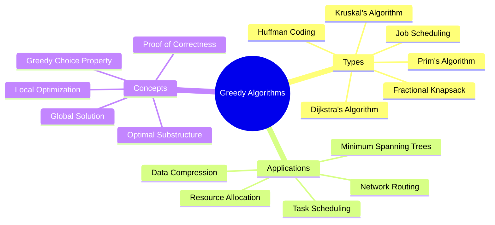

# Greedy Algorithms

[Back to Course Content](README.md) | [Previous: Dynamic Programming](dynamic-programming.md) | [Next: Concurrency →](concurrency.md)

> Reference: This content is based on Greedy-algorithms.pdf and Advanced-greedy-algorithms.pdf

## What are Greedy Algorithms?

Greedy algorithms make locally optimal choices at each step with the hope of finding a global optimum. Unlike dynamic programming that considers all possible solutions, greedy algorithms commit to decisions immediately without reconsidering previous choices.



## Core Principles

### 1. Greedy Choice Property

A problem exhibits the greedy choice property if a global optimum can be reached by making locally optimal choices.

```java
public class GreedyChoice {
    // Example: Fractional Knapsack
    public double fractionalKnapsack(int[] weights, int[] values, int capacity) {
        int n = weights.length;
        Item[] items = new Item[n];
        
        // Create items with value per unit weight
        for (int i = 0; i < n; i++) {
            items[i] = new Item(weights[i], values[i]);
        }
        
        // Sort by value per unit weight in descending order
        Arrays.sort(items, (a, b) -> Double.compare(b.valuePerUnit, a.valuePerUnit));
        
        double result = 0.0;
        for (Item item : items) {
            if (capacity >= item.weight) {
                // Take the entire item
                result += item.value;
                capacity -= item.weight;
            } else {
                // Take a fraction of the item
                result += capacity * item.valuePerUnit;
                break;
            }
        }
        return result;
    }
    
    private static class Item {
        int weight;
        int value;
        double valuePerUnit;
        
        Item(int weight, int value) {
            this.weight = weight;
            this.value = value;
            this.valuePerUnit = (double) value / weight;
        }
    }
}
```

### 2. Optimal Substructure

A problem has optimal substructure if an optimal solution contains optimal solutions to subproblems.

```java
public class OptimalSubstructure {
    // Example: Job Scheduling
    public int jobScheduling(int[] start, int[] end, int[] profit) {
        int n = start.length;
        Job[] jobs = new Job[n];
        
        // Create job objects
        for (int i = 0; i < n; i++) {
            jobs[i] = new Job(start[i], end[i], profit[i]);
        }
        
        // Sort by end time
        Arrays.sort(jobs, (a, b) -> a.end - b.end);
        
        int[] dp = new int[n];
        dp[0] = jobs[0].profit;
        
        for (int i = 1; i < n; i++) {
            int include = jobs[i].profit;
            int lastNonConflict = findLastNonConflict(jobs, i);
            if (lastNonConflict != -1) {
                include += dp[lastNonConflict];
            }
            dp[i] = Math.max(include, dp[i - 1]);
        }
        
        return dp[n - 1];
    }
    
    private int findLastNonConflict(Job[] jobs, int i) {
        for (int j = i - 1; j >= 0; j--) {
            if (jobs[j].end <= jobs[i].start) {
                return j;
            }
        }
        return -1;
    }
    
    private static class Job {
        int start;
        int end;
        int profit;
        
        Job(int start, int end, int profit) {
            this.start = start;
            this.end = end;
            this.profit = profit;
        }
    }
}
```

## Classic Greedy Algorithms

### 1. Activity Selection Problem

Given a set of activities with start and finish times, select the maximum number of activities that a single person can perform, assuming they can only work on one activity at a time.

```java
public class ActivitySelection {
    static class Activity {
        int start;
        int finish;
        
        Activity(int start, int finish) {
            this.start = start;
            this.finish = finish;
        }
    }
    
    public List<Activity> selectActivities(Activity[] activities) {
        // Sort activities by finish time
        Arrays.sort(activities, (a, b) -> a.finish - b.finish);
        
        List<Activity> selected = new ArrayList<>();
        
        // First activity is always selected
        if (activities.length > 0) {
            selected.add(activities[0]);
        }
        
        int lastSelected = 0;
        
        // Consider all activities
        for (int i = 1; i < activities.length; i++) {
            // If this activity starts after the finish of last selected
            if (activities[i].start >= activities[lastSelected].finish) {
                selected.add(activities[i]);
                lastSelected = i;
            }
        }
        
        return selected;
    }
}
```

### 2. Huffman Coding

```java
public class HuffmanCoding {
    public static class Node implements Comparable<Node> {
        char ch;
        int freq;
        Node left;
        Node right;
        
        Node(char ch, int freq) {
            this.ch = ch;
            this.freq = freq;
            this.left = null;
            this.right = null;
        }
        
        @Override
        public int compareTo(Node other) {
            return this.freq - other.freq;
        }
    }
    
    public Node buildHuffmanTree(char[] chars, int[] freq) {
        PriorityQueue<Node> pq = new PriorityQueue<>();
        
        // Create leaf nodes
        for (int i = 0; i < chars.length; i++) {
            pq.offer(new Node(chars[i], freq[i]));
        }
        
        // Build tree
        while (pq.size() > 1) {
            Node left = pq.poll();
            Node right = pq.poll();
            Node parent = new Node('\0', left.freq + right.freq);
            parent.left = left;
            parent.right = right;
            pq.offer(parent);
        }
        
        return pq.poll();
    }
    
    public Map<Character, String> generateCodes(Node root) {
        Map<Character, String> huffmanCodes = new HashMap<>();
        generateCodesRecursive(root, "", huffmanCodes);
        return huffmanCodes;
    }
    
    private void generateCodesRecursive(Node node, String code, Map<Character, String> huffmanCodes) {
        if (node == null) return;
        
        // If this is a leaf node
        if (node.left == null && node.right == null) {
            huffmanCodes.put(node.ch, code);
        }
        
        generateCodesRecursive(node.left, code + "0", huffmanCodes);
        generateCodesRecursive(node.right, code + "1", huffmanCodes);
    }
}
```

### 3. Dijkstra's Algorithm

Dijkstra's algorithm finds the shortest path from a source vertex to all other vertices in a weighted graph with non-negative edges.

```java
public class DijkstraAlgorithm {
    public int[] dijkstra(int[][] graph, int source) {
        int V = graph.length;
        int[] dist = new int[V];
        boolean[] visited = new boolean[V];
        
        // Initialize
        Arrays.fill(dist, Integer.MAX_VALUE);
        dist[source] = 0;
        
        // Find shortest paths
        for (int count = 0; count < V - 1; count++) {
            // Find the vertex with minimum distance
            int u = minDistance(dist, visited);
            visited[u] = true;
            
            // Update distance of adjacent vertices
            for (int v = 0; v < V; v++) {
                if (!visited[v] && graph[u][v] != 0 && 
                    dist[u] != Integer.MAX_VALUE && 
                    dist[u] + graph[u][v] < dist[v]) {
                    dist[v] = dist[u] + graph[u][v];
                }
            }
        }
        
        return dist;
    }
    
    private int minDistance(int[] dist, boolean[] visited) {
        int min = Integer.MAX_VALUE;
        int minIndex = -1;
        
        for (int v = 0; v < dist.length; v++) {
            if (!visited[v] && dist[v] < min) {
                min = dist[v];
                minIndex = v;
            }
        }
        
        return minIndex;
    }
}
```

### 4. Prim's Algorithm

```java
public class PrimsAlgorithm {
    public int minimumSpanningTree(int[][] graph) {
        int V = graph.length;
        int[] key = new int[V];
        boolean[] mstSet = new boolean[V];
        int result = 0;
        
        // Initialize
        Arrays.fill(key, Integer.MAX_VALUE);
        key[0] = 0;
        
        // Find minimum spanning tree
        for (int count = 0; count < V - 1; count++) {
            int u = minKey(key, mstSet);
            mstSet[u] = true;
            
            for (int v = 0; v < V; v++) {
                if (graph[u][v] != 0 && !mstSet[v] && 
                    graph[u][v] < key[v]) {
                    key[v] = graph[u][v];
                }
            }
        }
        
        // Calculate total weight
        for (int i = 0; i < V; i++) {
            result += key[i];
        }
        
        return result;
    }
    
    private int minKey(int[] key, boolean[] mstSet) {
        int min = Integer.MAX_VALUE;
        int minIndex = -1;
        
        for (int v = 0; v < key.length; v++) {
            if (!mstSet[v] && key[v] < min) {
                min = key[v];
                minIndex = v;
            }
        }
        
        return minIndex;
    }
}
```

### 5. Kruskal's Algorithm

```java
public class KruskalAlgorithm {
    static class Edge implements Comparable<Edge> {
        int src, dest, weight;
        
        Edge(int src, int dest, int weight) {
            this.src = src;
            this.dest = dest;
            this.weight = weight;
        }
        
        @Override
        public int compareTo(Edge other) {
            return this.weight - other.weight;
        }
    }
    
    static class DisjointSet {
        int[] parent, rank;
        
        DisjointSet(int n) {
            parent = new int[n];
            rank = new int[n];
            
            for (int i = 0; i < n; i++) {
                parent[i] = i;
            }
        }
        
        int find(int x) {
            if (parent[x] != x) {
                parent[x] = find(parent[x]);
            }
            return parent[x];
        }
        
        void union(int x, int y) {
            int rootX = find(x);
            int rootY = find(y);
            
            if (rootX == rootY) return;
            
            if (rank[rootX] < rank[rootY]) {
                parent[rootX] = rootY;
            } else if (rank[rootX] > rank[rootY]) {
                parent[rootY] = rootX;
            } else {
                parent[rootY] = rootX;
                rank[rootX]++;
            }
        }
    }
    
    public int kruskalMST(int[][] graph, int V) {
        List<Edge> edges = new ArrayList<>();
        
        // Create all edges
        for (int i = 0; i < V; i++) {
            for (int j = i + 1; j < V; j++) {
                if (graph[i][j] != 0) {
                    edges.add(new Edge(i, j, graph[i][j]));
                }
            }
        }
        
        // Sort edges by weight
        Collections.sort(edges);
        
        DisjointSet ds = new DisjointSet(V);
        int mstWeight = 0;
        
        for (Edge edge : edges) {
            int rootSrc = ds.find(edge.src);
            int rootDest = ds.find(edge.dest);
            
            // If including this edge doesn't create a cycle
            if (rootSrc != rootDest) {
                mstWeight += edge.weight;
                ds.union(rootSrc, rootDest);
            }
        }
        
        return mstWeight;
    }
}
```

## Applications

### 1. Network Routing

```java
public class NetworkRouting {
    public int[] dijkstra(int[][] graph, int source) {
        int V = graph.length;
        int[] dist = new int[V];
        boolean[] visited = new boolean[V];
        
        // Initialize
        Arrays.fill(dist, Integer.MAX_VALUE);
        dist[source] = 0;
        
        // Find shortest paths
        for (int count = 0; count < V; count++) {
            int u = minDistance(dist, visited);
            
            if (u == -1) break;
            
            visited[u] = true;
            
            for (int v = 0; v < V; v++) {
                if (!visited[v] && graph[u][v] != 0 && 
                    dist[u] != Integer.MAX_VALUE && 
                    dist[u] + graph[u][v] < dist[v]) {
                    dist[v] = dist[u] + graph[u][v];
                }
            }
        }
        
        return dist;
    }
    
    private int minDistance(int[] dist, boolean[] visited) {
        int min = Integer.MAX_VALUE;
        int minIndex = -1;
        
        for (int v = 0; v < dist.length; v++) {
            if (!visited[v] && dist[v] < min) {
                min = dist[v];
                minIndex = v;
            }
        }
        
        return minIndex;
    }
}
```

### 2. Resource Allocation

```java
public class ResourceAllocation {
    static class Job {
        int id;
        int deadline;
        int profit;
        
        Job(int id, int deadline, int profit) {
            this.id = id;
            this.deadline = deadline;
            this.profit = profit;
        }
    }
    
    public List<Integer> scheduleJobs(Job[] jobs, int maxDeadline) {
        // Sort jobs in decreasing order of profit
        Arrays.sort(jobs, (a, b) -> b.profit - a.profit);
        
        boolean[] slots = new boolean[maxDeadline];
        List<Integer> result = new ArrayList<>();
        
        // Schedule each job
        for (Job job : jobs) {
            // Find the latest available slot before deadline
            for (int i = Math.min(maxDeadline - 1, job.deadline - 1); i >= 0; i--) {
                if (!slots[i]) {
                    result.add(job.id);
                    slots[i] = true;
                    break;
                }
            }
        }
        
        return result;
    }
}
```

### 3. Data Compression

Huffman coding is commonly used in data compression algorithms like JPEG, ZIP, and MP3.

```java
public class HuffmanCompression {
    public String compress(String text) {
        if (text == null || text.isEmpty()) {
            return "";
        }
        
        // Count frequency of each character
        Map<Character, Integer> freq = new HashMap<>();
        for (char c : text.toCharArray()) {
            freq.put(c, freq.getOrDefault(c, 0) + 1);
        }
        
        // Build Huffman tree
        HuffmanCoding huffman = new HuffmanCoding();
        char[] chars = new char[freq.size()];
        int[] frequencies = new int[freq.size()];
        
        int index = 0;
        for (Map.Entry<Character, Integer> entry : freq.entrySet()) {
            chars[index] = entry.getKey();
            frequencies[index] = entry.getValue();
            index++;
        }
        
        HuffmanCoding.Node root = huffman.buildHuffmanTree(chars, frequencies);
        Map<Character, String> codes = huffman.generateCodes(root);
        
        // Compress text
        StringBuilder compressed = new StringBuilder();
        for (char c : text.toCharArray()) {
            compressed.append(codes.get(c));
        }
        
        return compressed.toString();
    }
}
```

## Greedy vs. Dynamic Programming

Greedy algorithms are typically faster and simpler than dynamic programming approaches, but they don't always produce optimal solutions. Here's a comparison:

| Aspect | Greedy Algorithm | Dynamic Programming |
|--------|-----------------|----------------------|
| Decision Making | Makes locally optimal choices | Considers all possible choices |
| Reconsideration | Never reconsiders choices | Builds optimal solution from subproblems |
| Time Complexity | Usually more efficient | Often more computationally intensive |
| Implementation | Generally simpler | Usually more complex |
| Optimal Solution | Not guaranteed for all problems | Guaranteed if applicable |
| Example | Huffman Coding, Dijkstra's Algorithm | 0/1 Knapsack, Longest Common Subsequence |

### When Greedy Works (and When It Doesn't)

Greedy algorithms work when:
1. The problem has optimal substructure
2. The problem has the greedy choice property

Examples where greedy doesn't always work:
1. 0/1 Knapsack Problem
2. Traveling Salesman Problem
3. Coin Change Problem with arbitrary denominations

## Best Practices

1. **Identify the greedy criterion**: Determine what metric to optimize at each step.
2. **Prove correctness**: Ensure that local optimization leads to global optimization.
3. **Handle edge cases**: Test with empty inputs, single elements, etc.
4. **Optimize implementation**: Use efficient data structures like priority queues.
5. **Consider constraints**: Ensure your greedy choices respect all problem constraints.

## Common Pitfalls

1. **Assuming greedy always works**: Verify that the problem has the greedy choice property.
2. **Incorrect sorting criteria**: Using the wrong metric for ordering can lead to suboptimal solutions.
3. **Ignoring edge cases**: Special cases may break your algorithm.
4. **Missing the termination condition**: Know when to stop.

## Exercises

1. **Fractional Knapsack**: Implement the fractional knapsack algorithm for a given set of items.
2. **Activity Selection**: Implement the activity selection algorithm and test it with various sets of activities.
3. **Huffman Coding**: Implement the Huffman coding algorithm for text compression.
4. **Minimum Spanning Tree**: Implement both Prim's and Kruskal's algorithms and compare their performance.
5. **Job Scheduling**: Implement a job scheduling algorithm to maximize profit with deadlines.

## Additional Resources

- [GeeksforGeeks - Greedy Algorithms](https://www.geeksforgeeks.org/greedy-algorithms/)
- [Introduction to Algorithms](https://mitpress.mit.edu/books/introduction-algorithms-third-edition) by Cormen, Leiserson, Rivest, and Stein - Chapter 16
- [Algorithm Design](https://www.pearson.com/us/higher-education/program/Kleinberg-Algorithm-Design/PGM319216.html) by Kleinberg and Tardos - Chapter 4 