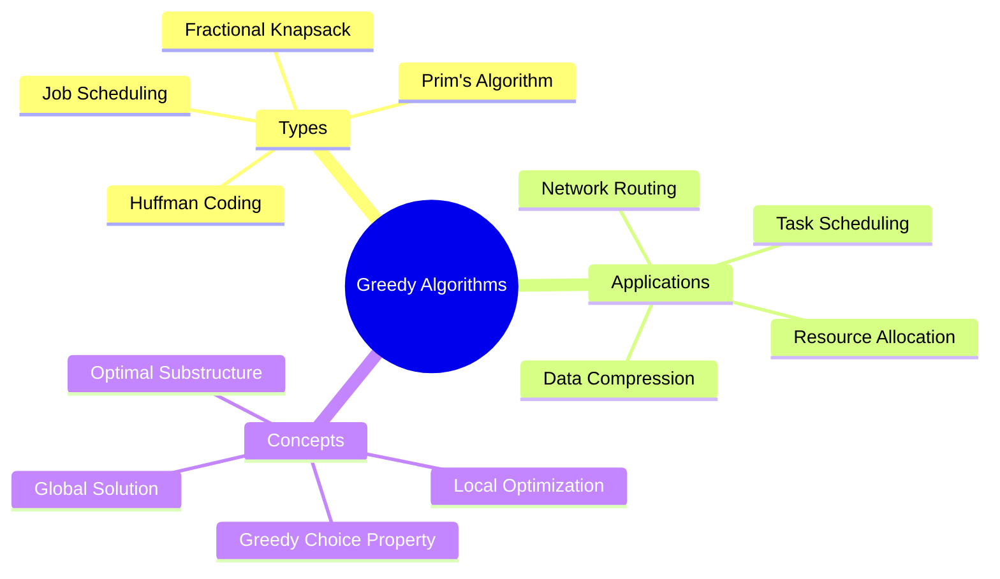

# Greedy Algorithms

[Back to Course Content](README.md) | [Previous: Dynamic Programming](dynamic-programming.md) | [Next: Backtracking →](backtracking.md)

> Reference: This content is based on Greedy-algorithms.pdf and Advanced-greedy-algorithms.pdf

## What are Greedy Algorithms?

Greedy algorithms make locally optimal choices at each step with the hope of finding a global optimum. They are simple and efficient but don't always guarantee the optimal solution.



## Basic Concepts

### 1. Greedy Choice Property

A problem exhibits the greedy choice property if a global optimum can be reached by making locally optimal choices.

```java
public class GreedyChoice {
    // Example: Fractional Knapsack
    public double fractionalKnapsack(int[] weights, int[] values, int capacity) {
        int n = weights.length;
        Item[] items = new Item[n];
        
        // Create items with value per unit weight
        for (int i = 0; i < n; i++) {
            items[i] = new Item(weights[i], values[i]);
        }
        
        // Sort by value per unit weight in descending order
        Arrays.sort(items, (a, b) -> Double.compare(b.valuePerUnit, a.valuePerUnit));
        
        double result = 0.0;
        for (Item item : items) {
            if (capacity >= item.weight) {
                result += item.value;
                capacity -= item.weight;
            } else {
                result += capacity * item.valuePerUnit;
                break;
            }
        }
        return result;
    }
    
    private static class Item {
        int weight;
        int value;
        double valuePerUnit;
        
        Item(int weight, int value) {
            this.weight = weight;
            this.value = value;
            this.valuePerUnit = (double) value / weight;
        }
    }
}
```

### 2. Optimal Substructure

A problem has optimal substructure if an optimal solution contains optimal solutions to subproblems.

```java
public class OptimalSubstructure {
    // Example: Job Scheduling
    public int jobScheduling(int[] start, int[] end, int[] profit) {
        int n = start.length;
        Job[] jobs = new Job[n];
        
        // Create job objects
        for (int i = 0; i < n; i++) {
            jobs[i] = new Job(start[i], end[i], profit[i]);
        }
        
        // Sort by end time
        Arrays.sort(jobs, (a, b) -> a.end - b.end);
        
        int[] dp = new int[n];
        dp[0] = jobs[0].profit;
        
        for (int i = 1; i < n; i++) {
            int include = jobs[i].profit;
            int lastNonConflict = findLastNonConflict(jobs, i);
            if (lastNonConflict != -1) {
                include += dp[lastNonConflict];
            }
            dp[i] = Math.max(include, dp[i - 1]);
        }
        
        return dp[n - 1];
    }
    
    private int findLastNonConflict(Job[] jobs, int i) {
        for (int j = i - 1; j >= 0; j--) {
            if (jobs[j].end <= jobs[i].start) {
                return j;
            }
        }
        return -1;
    }
    
    private static class Job {
        int start;
        int end;
        int profit;
        
        Job(int start, int end, int profit) {
            this.start = start;
            this.end = end;
            this.profit = profit;
        }
    }
}
```

## Common Greedy Algorithms

### 1. Huffman Coding

```java
public class HuffmanCoding {
    public static class Node implements Comparable<Node> {
        char ch;
        int freq;
        Node left;
        Node right;
        
        Node(char ch, int freq) {
            this.ch = ch;
            this.freq = freq;
            this.left = null;
            this.right = null;
        }
        
        @Override
        public int compareTo(Node other) {
            return this.freq - other.freq;
        }
    }
    
    public Node buildHuffmanTree(char[] chars, int[] freq) {
        PriorityQueue<Node> pq = new PriorityQueue<>();
        
        // Create leaf nodes
        for (int i = 0; i < chars.length; i++) {
            pq.offer(new Node(chars[i], freq[i]));
        }
        
        // Build tree
        while (pq.size() > 1) {
            Node left = pq.poll();
            Node right = pq.poll();
            Node parent = new Node('\0', left.freq + right.freq);
            parent.left = left;
            parent.right = right;
            pq.offer(parent);
        }
        
        return pq.poll();
    }
}
```

### 2. Prim's Algorithm

```java
public class PrimsAlgorithm {
    public int minimumSpanningTree(int[][] graph) {
        int V = graph.length;
        int[] key = new int[V];
        boolean[] mstSet = new boolean[V];
        int result = 0;
        
        // Initialize
        Arrays.fill(key, Integer.MAX_VALUE);
        key[0] = 0;
        
        // Find minimum spanning tree
        for (int count = 0; count < V - 1; count++) {
            int u = minKey(key, mstSet);
            mstSet[u] = true;
            
            for (int v = 0; v < V; v++) {
                if (graph[u][v] != 0 && !mstSet[v] && 
                    graph[u][v] < key[v]) {
                    key[v] = graph[u][v];
                }
            }
        }
        
        // Calculate total weight
        for (int i = 0; i < V; i++) {
            result += key[i];
        }
        
        return result;
    }
    
    private int minKey(int[] key, boolean[] mstSet) {
        int min = Integer.MAX_VALUE;
        int minIndex = -1;
        
        for (int v = 0; v < key.length; v++) {
            if (!mstSet[v] && key[v] < min) {
                min = key[v];
                minIndex = v;
            }
        }
        
        return minIndex;
    }
}
```

## Applications

### 1. Network Routing

```java
public class NetworkRouting {
    public int[] dijkstra(int[][] graph, int source) {
        int V = graph.length;
        int[] dist = new int[V];
        boolean[] visited = new boolean[V];
        
        // Initialize
        Arrays.fill(dist, Integer.MAX_VALUE);
        dist[source] = 0;
        
        // Find shortest paths
        for (int count = 0; count < V - 1; count++) {
            int u = minDistance(dist, visited);
            visited[u] = true;
            
            for (int v = 0; v < V; v++) {
                if (!visited[v] && graph[u][v] != 0 && 
                    dist[u] != Integer.MAX_VALUE && 
                    dist[u] + graph[u][v] < dist[v]) {
                    dist[v] = dist[u] + graph[u][v];
                }
            }
        }
        
        return dist;
    }
    
    private int minDistance(int[] dist, boolean[] visited) {
        int min = Integer.MAX_VALUE;
        int minIndex = -1;
        
        for (int v = 0; v < dist.length; v++) {
            if (!visited[v] && dist[v] <= min) {
                min = dist[v];
                minIndex = v;
            }
        }
        
        return minIndex;
    }
}
```

### 2. Resource Allocation

```java
public class ResourceAllocation {
    public int[] allocateResources(int[] resources, int[] demands) {
        int n = demands.length;
        int[] allocation = new int[n];
        int remaining = resources[0];
        
        // Sort demands
        int[] indices = new int[n];
        for (int i = 0; i < n; i++) {
            indices[i] = i;
        }
        Arrays.sort(indices, (a, b) -> demands[a] - demands[b]);
        
        // Allocate resources
        for (int i = 0; i < n; i++) {
            int idx = indices[i];
            if (remaining >= demands[idx]) {
                allocation[idx] = demands[idx];
                remaining -= demands[idx];
            } else {
                allocation[idx] = remaining;
                break;
            }
        }
        
        return allocation;
    }
}
```

## Best Practices

1. **Problem Analysis**
   - Verify greedy choice property
   - Check optimal substructure
   - Consider edge cases
   - Evaluate solution quality

2. **Implementation**
   - Use appropriate data structures
   - Handle edge cases
   - Optimize performance
   - Consider space usage

3. **Optimization**
   - Use efficient sorting
   - Implement early termination
   - Consider space-time trade-offs
   - Handle large inputs

## Common Pitfalls

1. **Design Issues**
   - Wrong greedy choice
   - Missing optimal substructure
   - Incorrect assumptions
   - Incomplete solution

2. **Implementation Issues**
   - Inefficient data structures
   - Edge case handling
   - Performance bottlenecks
   - Memory management

3. **Limitations**
   - Not always optimal
   - Local optimization
   - Problem constraints
   - Solution quality

## Exercises

1. Implement Fractional Knapsack
2. Create Job Scheduling algorithm
3. Design Huffman Coding
4. Implement Prim's Algorithm
5. Solve Activity Selection problem

## Additional Resources

- [GeeksforGeeks - Greedy Algorithms](https://www.geeksforgeeks.org/greedy-algorithms/)
- [Greedy Algorithm Visualization](https://visualgo.net/en/mst)
- [Greedy Practice Problems](https://leetcode.com/tag/greedy/)
- [Greedy Tutorial](https://www.programiz.com/dsa/greedy-algorithm) 