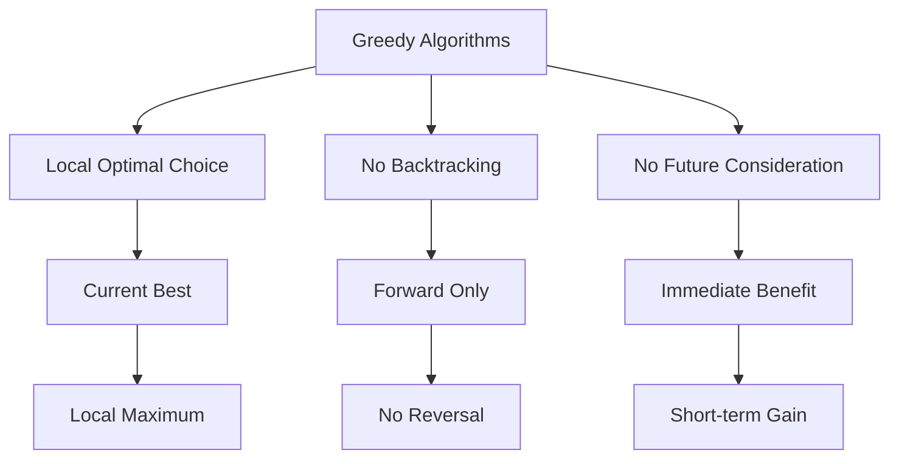

# Greedy Algorithms

[Back to Course Content](README.md) | [← Previous: Dynamic Programming](dynamic-programming.md) | [Next: Backtracking →](backtracking.md)

## Introduction to Greedy Algorithms

Greedy algorithms make locally optimal choices at each step with the hope of finding a global optimum solution.

### Greedy Algorithm Characteristics



### Key Concepts

| Concept | Description |
|---------|-------------|
| Greedy Choice | Making locally optimal choice at each step |
| Optimal Substructure | Optimal solution contains optimal solutions to subproblems |
| No Backtracking | Decisions are final and cannot be reversed |
| Immediate Benefit | Focus on current step's maximum gain |
| Feasible Solution | Solution that satisfies all constraints |
| Optimal Solution | Best possible solution among all feasible solutions |

## Common Greedy Problems

### 1. Fractional Knapsack

```python
def fractional_knapsack(weights, values, capacity):
    n = len(weights)
    # Calculate value per unit weight
    items = [(values[i] / weights[i], weights[i], values[i]) 
             for i in range(n)]
    # Sort by value per unit weight in descending order
    items.sort(reverse=True)
    
    total_value = 0
    for value_per_weight, weight, value in items:
        if capacity >= weight:
            total_value += value
            capacity -= weight
        else:
            # Take fraction of last item
            total_value += value_per_weight * capacity
            break
    
    return total_value
```

### 2. Activity Selection

```python
def activity_selection(start, finish):
    n = len(start)
    # Sort activities by finish time
    activities = list(zip(start, finish))
    activities.sort(key=lambda x: x[1])
    
    selected = [0]  # First activity is always selected
    last_finish = activities[0][1]
    
    for i in range(1, n):
        if activities[i][0] >= last_finish:
            selected.append(i)
            last_finish = activities[i][1]
    
    return selected
```

### 3. Huffman Coding

```python
from heapq import heappush, heappop

class HuffmanNode:
    def __init__(self, char, freq):
        self.char = char
        self.freq = freq
        self.left = None
        self.right = None
    
    def __lt__(self, other):
        return self.freq < other.freq

def build_huffman_tree(freq):
    heap = []
    for char, f in freq.items():
        heappush(heap, HuffmanNode(char, f))
    
    while len(heap) > 1:
        left = heappop(heap)
        right = heappop(heap)
        
        internal = HuffmanNode(None, left.freq + right.freq)
        internal.left = left
        internal.right = right
        
        heappush(heap, internal)
    
    return heappop(heap)

def build_huffman_codes(root, code="", codes=None):
    if codes is None:
        codes = {}
    
    if root:
        if root.char:
            codes[root.char] = code
        build_huffman_codes(root.left, code + "0", codes)
        build_huffman_codes(root.right, code + "1", codes)
    
    return codes
```

### 4. Job Scheduling

```python
def job_scheduling(jobs):
    # Sort jobs by deadline
    jobs.sort(key=lambda x: x[1])
    
    n = len(jobs)
    result = []
    time = 0
    
    for i in range(n):
        if time + jobs[i][0] <= jobs[i][1]:
            result.append(i)
            time += jobs[i][0]
    
    return result
```

### 5. Minimum Spanning Tree (Kruskal's Algorithm)

```python
class DisjointSet:
    def __init__(self, vertices):
        self.parent = {v: v for v in vertices}
        self.rank = {v: 0 for v in vertices}
    
    def find(self, item):
        if self.parent[item] != item:
            self.parent[item] = self.find(self.parent[item])
        return self.parent[item]
    
    def union(self, x, y):
        root_x = self.find(x)
        root_y = self.find(y)
        
        if root_x != root_y:
            if self.rank[root_x] < self.rank[root_y]:
                self.parent[root_x] = root_y
            elif self.rank[root_x] > self.rank[root_y]:
                self.parent[root_y] = root_x
            else:
                self.parent[root_y] = root_x
                self.rank[root_x] += 1

def kruskal_mst(graph):
    edges = []
    for u in graph:
        for v, weight in graph[u]:
            edges.append((weight, u, v))
    
    edges.sort()
    ds = DisjointSet(graph.keys())
    mst = []
    
    for weight, u, v in edges:
        if ds.find(u) != ds.find(v):
            ds.union(u, v)
            mst.append((u, v, weight))
    
    return mst
```

## Real-World Applications

### 1. Network Design
- Minimum spanning trees
- Network routing
- Resource allocation
- Load balancing

### 2. Data Compression
- Huffman coding
- Run-length encoding
- Dictionary compression
- Image compression

### 3. Scheduling
- Task scheduling
- Process scheduling
- Meeting scheduling
- Resource allocation

### 4. Financial Applications
- Stock trading
- Portfolio optimization
- Currency exchange
- Investment strategies

## Implementation Considerations

### Memory Management
1. Space efficiency
2. Data structure choice
3. Memory allocation
4. Cache utilization

### Performance Optimization
1. Algorithm selection
2. Data structure optimization
3. Parallel processing
4. Cache efficiency

## Best Practices

### Problem Solving
1. Verify greedy choice property
2. Check optimal substructure
3. Consider edge cases
4. Validate solution

### Implementation
1. Choose appropriate data structures
2. Optimize sorting operations
3. Handle edge cases
4. Consider time constraints

## Summary

Key points to remember:
1. Make locally optimal choices
2. No backtracking allowed
3. Verify greedy choice property
4. Consider edge cases
5. Check optimal substructure
6. Validate solution correctness

By understanding greedy algorithms, you can:
- Solve optimization problems efficiently
- Design simple and fast algorithms
- Handle real-time decision making
- Optimize resource allocation
- Implement data compression 