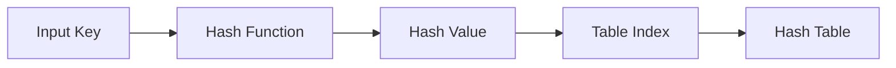
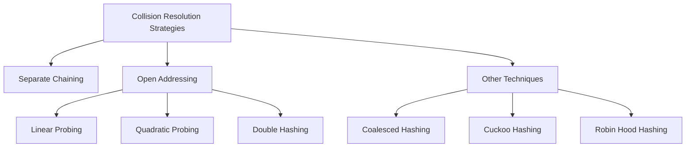
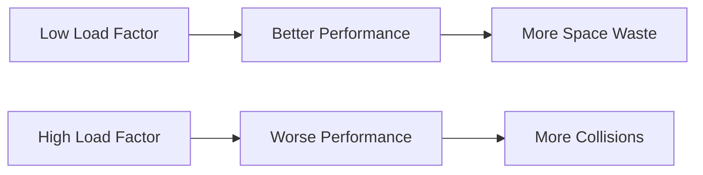

# Hashing

[Back to Course Content](README.md) | [Previous: Complexity Analysis](complexity-analysis.md) | [Next: Recursion →](recursion.md)

> Reference: This content is based on Hashing.pdf

## What is Hashing?

Hashing is a technique that transforms data of arbitrary size (keys) into fixed-size values (hash codes) using a mathematical function called a hash function. This transformation maps input data to a specific location in a data structure called a hash table, enabling efficient storage and retrieval of data.

### Key Characteristics

- **Deterministic**: The same input always produces the same hash value
- **Efficiency**: Hash computation and lookup operations are typically O(1)
- **Uniformity**: Ideally distributes keys evenly across the hash table
- **Avalanche Effect**: Small changes in input should cause significant changes in output

### Mathematical Definition

At its core, a hash function *h* can be represented as:

h: K → [0, m-1]

Where:
- K is the set of all possible keys
- m is the size of the hash table
- h maps each key k ∈ K to an integer in the range [0, m-1]



### Real-world Applications

| Application Area | Examples | Benefits |
|------------------|----------|----------|
| **Database Systems** | Indexing, partition schemes | Fast record lookups, data distribution |
| **Cryptography** | Digital signatures, password storage | Data integrity, security |
| **Caching** | Web caches, memoization | Performance improvement, resource optimization |
| **Symbol Tables** | Compilers, interpreters | Fast identifier lookup |
| **Network Systems** | Load balancing, content addressing | Resource distribution, content verification |

## Hash Functions

A hash function is an algorithm that converts input data of arbitrary size into a fixed-size output (hash code). An ideal hash function should be fast to compute, distribute keys uniformly, and minimize collisions.

### Hash Function Requirements

1. **Computation Efficiency**: Must be computed quickly
2. **Uniform Distribution**: Should spread keys evenly across the table
3. **Determinism**: Same input must always produce same output
4. **Avalanche Effect**: Small input changes should produce large output changes

### Common Hash Functions

#### 1. Division Method

The division method is one of the simplest hash functions that computes the remainder when the key is divided by the table size.

**Mathematical Formula:**
h(k) = k mod m

where:
- k is the key
- m is the table size (preferably a prime number)

```java
int hash(int key, int tableSize) {
    return key % tableSize;
}
```

**Characteristics:**
- **Advantages**:
  - Simple to implement
  - Fast to compute
  - Works well when table size is a prime number
- **Disadvantages**:
  - Susceptible to patterns in the data
  - Performs poorly if keys have common factors with table size
  - Limited avalanche effect

**Real-world Use Case**: Simple hash tables in memory-constrained environments

#### 2. Multiplication Method

The multiplication method uses floating-point multiplication and modular arithmetic to compute hash values.

**Mathematical Formula:**
h(k) = ⌊m × (kA mod 1)⌋

where:
- k is the key
- m is the table size
- A is a constant in the range (0, 1), often using (√5-1)/2 ≈ 0.618033988749895 (golden ratio)
- (kA mod 1) means the fractional part of kA

```java
int hash(int key, int tableSize) {
    double A = 0.618033988749895; // (sqrt(5)-1)/2
    double val = key * A;
    val = val - Math.floor(val); // fractional part
    return (int)(tableSize * val);
}
```

**Characteristics:**
- **Advantages**:
  - Less sensitive to patterns in input data
  - Works well even when table size is not prime
  - Better distribution than division method
- **Disadvantages**:
  - Requires floating-point operations
  - Slightly more complex to implement
  - May not be optimal for certain key distributions

**Real-world Use Case**: Hash tables where key distribution is unknown or potentially clustered

#### 3. Universal Hashing

Universal hashing uses a randomly selected hash function from a family of hash functions, reducing the probability of collisions even with adversarial input.

**Mathematical Formula:**
h<sub>a,b</sub>(k) = ((ak + b) mod p) mod m

where:
- k is the key
- a and b are random integers with a ∈ [1, p-1] and b ∈ [0, p-1]
- p is a prime number larger than the maximum possible key
- m is the table size

```java
int universalHash(int key, int a, int b, int p, int m) {
    // where p is a prime number larger than universe size
    // a and b are random integers with a ∈ [1, p-1] and b ∈ [0, p-1]
    return ((a * key + b) % p) % m;
}
```

**Characteristics:**
- **Advantages**:
  - Provides theoretical guarantees against collision clustering
  - Resistant to adversarial inputs
  - More uniform distribution
- **Disadvantages**:
  - More complex implementation
  - Requires selection and storage of parameters
  - Slightly higher computation cost

**Real-world Use Case**: Security-sensitive applications, hash tables that must be resilient against DoS attacks

#### 4. String Hashing

String hashing processes each character in a string to compute a hash value, often using polynomial rolling hash functions.

**Mathematical Formula:**
h(s) = (s[0] × p<sup>0</sup> + s[1] × p<sup>1</sup> + ... + s[n-1] × p<sup>n-1</sup>) mod m

where:
- s is the string with characters s[0], s[1], ..., s[n-1]
- p is a prime number (commonly 31 for alphanumeric strings)
- m is the table size

```java
int hashString(String key, int tableSize) {
    int hash = 0;
    for (int i = 0; i < key.length(); i++) {
        hash = (hash * 31 + key.charAt(i)) % tableSize;
    }
    return hash;
}
```

**Characteristics:**
- **Advantages**:
  - Handles variable-length strings efficiently
  - Good distribution for text data
  - Simple to implement
- **Disadvantages**:
  - May lead to clustering with certain patterns of strings
  - Modular arithmetic in each step may slow computation
  - Not optimal for very short strings

**Real-world Use Case**: Symbol tables in compilers, dictionary implementations, document fingerprinting

#### 5. Cryptographic Hash Functions

Cryptographic hash functions are designed for security applications with properties like one-way computation and collision resistance.

**Common Examples:**
- MD5 (Message Digest Algorithm 5) - now considered insecure
- SHA-1 (Secure Hash Algorithm 1) - also vulnerable
- SHA-256, SHA-3 - currently secure standards

**Key Properties:**
- **One-way function**: Computationally infeasible to reverse
- **Collision resistance**: Extremely difficult to find two inputs with same hash
- **Avalanche effect**: Small changes in input create large changes in output
- **Fixed output size**: Regardless of input size

**Real-world Use Cases**: 
- Password storage
- Digital signatures
- File integrity verification
- Blockchain technology
- Content addressing in distributed systems

### Hash Function Comparison

| Hash Function | Time Complexity | Space Complexity | Collision Resistance | Suitable Applications |
|---------------|-----------------|------------------|----------------------|----------------------|
| Division Method | O(1) | O(1) | Low | Simple in-memory hash tables |
| Multiplication Method | O(1) | O(1) | Medium | General-purpose hash tables |
| Universal Hashing | O(1) | O(1) | High | Applications requiring theoretical guarantees |
| String Hashing | O(n) | O(1) | Medium | String-based hash tables, string search |
| Cryptographic Hashing | O(n) | O(1) | Very High | Security applications, data integrity |

## Collision Resolution

A collision occurs when two different keys produce the same hash code. Since hash tables have a finite size and there are potentially infinite inputs, collisions are inevitable according to the pigeonhole principle. Collision resolution strategies determine how to handle these situations efficiently.

### Collision Resolution Strategies



### 1. Separate Chaining

Separate chaining resolves collisions by creating a linked list (or other data structure) of entries at each hash table position, allowing multiple keys to exist at the same index.

#### Mathematical Analysis

- **Load Factor (α)**: The average number of keys per slot = n/m
  - n = number of keys stored
  - m = number of slots in hash table
- **Average Search Time**: O(1 + α) = O(1) when α is constant
- **Space Complexity**: O(n + m)

```java
public class HashTableChaining<K, V> {
    private static class Node<K, V> {
        K key;
        V value;
        Node<K, V> next;
        
        Node(K key, V value) {
            this.key = key;
            this.value = value;
            this.next = null;
        }
    }
    
    private Node<K, V>[] table;
    private int size;
    private int capacity;
    
    public HashTableChaining(int capacity) {
        this.capacity = capacity;
        table = new Node[capacity];
        size = 0;
    }
    
    private int hash(K key) {
        return (key.hashCode() & 0x7fffffff) % capacity;
    }
    
    public void put(K key, V value) {
        int index = hash(key);
        
        // Check if key already exists
        Node<K, V> current = table[index];
        while (current != null) {
            if (current.key.equals(key)) {
                current.value = value;
                return;
            }
            current = current.next;
        }
        
        // Key doesn't exist, add new node
        Node<K, V> newNode = new Node<>(key, value);
        newNode.next = table[index];
        table[index] = newNode;
        size++;
        
        // Consider resizing if load factor exceeds threshold
        if (size > capacity * 0.75) {
            resize(capacity * 2);
        }
    }
    
    public V get(K key) {
        int index = hash(key);
        Node<K, V> current = table[index];
        
        while (current != null) {
            if (current.key.equals(key)) {
                return current.value;
            }
            current = current.next;
        }
        
        return null; // Key not found
    }
    
    public void remove(K key) {
        int index = hash(key);
        Node<K, V> current = table[index];
        Node<K, V> prev = null;
        
        while (current != null) {
            if (current.key.equals(key)) {
                if (prev == null) {
                    table[index] = current.next;
                } else {
                    prev.next = current.next;
                }
                size--;
                return;
            }
            prev = current;
            current = current.next;
        }
    }
    
    private void resize(int newCapacity) {
        Node<K, V>[] oldTable = table;
        table = new Node[newCapacity];
        capacity = newCapacity;
        size = 0;
        
        // Rehash all existing entries
        for (Node<K, V> head : oldTable) {
            Node<K, V> current = head;
            while (current != null) {
                put(current.key, current.value);
                current = current.next;
            }
        }
    }
}
```

#### Performance Characteristics

| Operation | Average-Case | Worst-Case | Notes |
|-----------|--------------|------------|-------|
| Insert | O(1) | O(n) | Worst case when all keys hash to same index |
| Search | O(1) | O(n) | Average case assumes good hash distribution |
| Delete | O(1) | O(n) | Requires finding element in chain first |
| Space | O(n + m) | O(n + m) | Additional overhead for linked list nodes |

#### Advantages and Disadvantages

**Advantages:**
- Simple implementation
- Efficient for high load factors
- Handles dynamic table sizing well
- Good for unknown key distributions
- No need for empty spaces

**Disadvantages:**
- Extra memory overhead for storing pointers
- Poor cache locality due to memory fragmentation
- May require additional data structure traversal
- Performance degrades as chains grow longer

#### Variations
- **Using Balanced Trees**: Replace linked lists with balanced trees (e.g., Red-Black Trees) when chains grow long, reducing worst-case search to O(log n)
- **Using Dynamic Arrays**: Use growable arrays instead of linked lists for better cache locality
- **Using Self-Adjusting Lists**: Move frequently accessed elements to front of chains

#### Real-world Applications
- Java's HashMap implementation (pre-Java 8)
- Database index structures
- Symbol tables in compiler design
- Implementations where memory overhead is acceptable

### 2. Open Addressing

Open addressing resolves collisions by finding alternative slots within the hash table itself, eliminating the need for additional data structures.

#### Mathematical Foundation

For a hash table with open addressing, the expected number of probes for a successful search with load factor α is approximately:
- **Successful search**: ≈ (1/2)(1 + 1/(1-α))
- **Unsuccessful search**: ≈ (1/2)(1 + 1/(1-α)²)

#### Linear Probing

Linear probing resolves collisions by checking subsequent positions in the table (with a step size of 1) until an empty slot is found.

**Probe Sequence**: h(k, i) = (h(k) + i) mod m
- h(k) is the initial hash value of key k
- i is the probe number (0, 1, 2, ...)
- m is the table size

```java
public class HashTableLinearProbing<K, V> {
    private static class Entry<K, V> {
        K key;
        V value;
        boolean isDeleted;
        
        Entry(K key, V value) {
            this.key = key;
            this.value = value;
            this.isDeleted = false;
        }
    }
    
    private Entry<K, V>[] table;
    private int size;
    private int capacity;
    private final double loadFactorThreshold = 0.5;
    
    public HashTableLinearProbing(int capacity) {
        this.capacity = capacity;
        table = new Entry[capacity];
        size = 0;
    }
    
    private int hash(K key) {
        return (key.hashCode() & 0x7fffffff) % capacity;
    }
    
    public void put(K key, V value) {
        if (size >= capacity * loadFactorThreshold) {
            resize(capacity * 2);
        }
        
        int index = hash(key);
        int i = 0;
        int tombstoneIndex = -1;
        
        while (i < capacity) {
            int probeIndex = (index + i) % capacity;
            
            // Empty slot found
            if (table[probeIndex] == null) {
                // If we encountered a tombstone earlier, use that slot instead
                if (tombstoneIndex != -1) {
                    probeIndex = tombstoneIndex;
                }
                table[probeIndex] = new Entry<>(key, value);
                size++;
                return;
            }
            
            // Found a tombstone and haven't recorded one yet
            if (table[probeIndex].isDeleted && tombstoneIndex == -1) {
                tombstoneIndex = probeIndex;
            }
            
            // Found the same key (not deleted)
            if (!table[probeIndex].isDeleted && table[probeIndex].key.equals(key)) {
                table[probeIndex].value = value;
                return;
            }
            
            i++;
        }
        
        // If we get here, the table is full (shouldn't happen with proper resizing)
        resize(capacity * 2);
        put(key, value);
    }
    
    public V get(K key) {
        int index = hash(key);
        int i = 0;
        
        while (i < capacity) {
            int probeIndex = (index + i) % capacity;
            
            // Empty slot means key not found
            if (table[probeIndex] == null) {
                return null;
            }
            
            // Found the key and it's not deleted
            if (!table[probeIndex].isDeleted && table[probeIndex].key.equals(key)) {
                return table[probeIndex].value;
            }
            
            i++;
        }
        
        return null; // Key not found
    }
    
    public void remove(K key) {
        int index = hash(key);
        int i = 0;
        
        while (i < capacity) {
            int probeIndex = (index + i) % capacity;
            
            // Empty slot means key not found
            if (table[probeIndex] == null) {
                return;
            }
            
            // Found the key and it's not already deleted
            if (!table[probeIndex].isDeleted && table[probeIndex].key.equals(key)) {
                table[probeIndex].isDeleted = true;
                size--;
                return;
            }
            
            i++;
        }
    }
    
    private void resize(int newCapacity) {
        HashTableLinearProbing<K, V> newTable = new HashTableLinearProbing<>(newCapacity);
        
        for (Entry<K, V> entry : table) {
            if (entry != null && !entry.isDeleted) {
                newTable.put(entry.key, entry.value);
            }
        }
        
        this.table = newTable.table;
        this.capacity = newTable.capacity;
        this.size = newTable.size;
    }
}
```

**Clustering Analysis:**
Linear probing suffers from **primary clustering**, where consecutive occupied slots form contiguous blocks making collisions more likely for subsequent insertions. The expected probe sequence length grows as the cluster size increases.

#### Quadratic Probing

Quadratic probing uses a quadratic function to determine the next slot to probe, which helps reduce clustering issues found in linear probing.

**Probe Sequence**: h(k, i) = (h(k) + c₁i + c₂i²) mod m
- Common implementation: h(k, i) = (h(k) + i²) mod m

```java
// In put, get, and remove methods:
int probeIndex = (index + i*i) % capacity;
```

**Key Insights:**
- Eliminates primary clustering but may still suffer from secondary clustering
- Works best when load factor is kept under 0.5
- May not probe all table slots if the table size is not carefully chosen
- Table size should be a prime number for maximum coverage

#### Double Hashing

Double hashing uses a second hash function to determine the step size, providing more uniform probing sequences.

**Probe Sequence**: h(k, i) = (h₁(k) + i·h₂(k)) mod m

```java
int hash1(K key) {
    return (key.hashCode() & 0x7fffffff) % capacity;
}

int hash2(K key) {
    // Second hash function, must never return 0
    return 1 + ((key.hashCode() & 0x7fffffff) % (capacity - 1));
}

// In put, get, and remove methods:
int probeIndex = (hash1(key) + i * hash2(key)) % capacity;
```

**Key Insights:**
- Provides more uniform probing throughout the table
- Virtually eliminates clustering issues
- More expensive computation (requires two hash functions)
- Secondary hash function should be chosen to ensure all slots can be probed

### Open Addressing Comparison

| Technique | Advantages | Disadvantages | Best Use Cases |
|-----------|------------|---------------|----------------|
| Linear Probing | Simple implementation<br>Good cache locality<br>Works well with low load factors | Primary clustering<br>Performance degrades quickly at high load | Small hash tables<br>Cache-sensitive applications |
| Quadratic Probing | Reduces primary clustering<br>Better distribution than linear probing | Secondary clustering<br>May not probe all slots | Medium-sized hash tables<br>When load factor < 0.5 |
| Double Hashing | Eliminates clustering<br>More uniform distribution | Requires two hash functions<br>More computation per probe | Large hash tables<br>When maximum performance needed |

### Performance Factors

#### Load Factor (α)

The load factor α = n/m (where n is the number of stored keys and m is the table size) is the most critical factor affecting hash table performance:



**Impact on Operations:**
- **Separate Chaining**: Performance degrades linearly with α
- **Open Addressing**: Performance degrades non-linearly as α approaches 1

| Load Factor | Separate Chaining | Linear Probing | Double Hashing |
|-------------|-------------------|----------------|----------------|
| 0.25 | ~1.25 probes | ~1.2 probes | ~1.2 probes |
| 0.5 | ~1.5 probes | ~1.5 probes | ~1.4 probes |
| 0.75 | ~1.75 probes | ~2.5 probes | ~2.0 probes |
| 0.9 | ~1.9 probes | ~5.5 probes | ~3.2 probes |
| 0.99 | ~1.99 probes | ~50 probes | ~7 probes |

#### Deletion Handling

**Separate Chaining**: Straightforward removal from linked list

**Open Addressing**: Requires special handling to maintain search correctness:
- **Naive Approach**: Mark slots as "deleted" (tombstones)
- **Lazy Deletion**: Mark as deleted but consider during probing
- **Rebuilding**: Periodically rebuild the table to remove deleted entries

#### Dynamic Resizing

Most practical hash table implementations resize dynamically when the load factor exceeds a threshold:

1. **Resize Trigger**: Typically when load factor exceeds 0.75 (Java HashMap) or 0.5 (open addressing)
2. **Growth Factor**: Commonly 2x the previous capacity
3. **Rehashing**: All existing entries must be reinserted using the new table size

### Real-world Applications

| Collision Strategy | Implementations | Use Cases |
|--------------------|-----------------|-----------|
| Separate Chaining | Java HashMap (pre-Java 8)<br>Python dictionaries (until 3.6) | General-purpose hash maps<br>When insertion speed is critical |
| Linear Probing | Python dictionaries (3.6+)<br>Many CPU caches | High-performance lookups<br>Memory-constrained environments |
| Quadratic Probing | PostgreSQL hash indexes<br>Some STL implementations | Database systems<br>Medium-sized in-memory tables |
| Double Hashing | Cryptographic applications<br>Large-scale systems | When uniform distribution is critical<br>Security-sensitive contexts |

## Performance Analysis

### Time Complexity

| Operation | Average Case | Worst Case |
|-----------|--------------|------------|
| Insert | O(1) | O(n) |
| Search | O(1) | O(n) |
| Delete | O(1) | O(n) |

### Factors Affecting Performance

1. **Load Factor (α)**
   - Ratio of number of elements to table size
   - Higher load factor increases collision probability
   - Typical rehashing threshold: α = 0.75

2. **Hash Function Quality**
   - Uniform distribution of keys
   - Minimal collisions
   - Computation efficiency

3. **Collision Resolution Strategy**
   - Separate chaining vs open addressing
   - Probing sequence efficiency
   - Deleted entry handling

## Real-World Applications

### 1. Hash Tables

Hash tables provide fast key-value storage and retrieval:

- **Language Features**: Dictionaries in Python, HashMap in Java
- **In-memory Caching**: Storing frequently accessed data
- **Symbol Tables**: Compiler and interpreter implementations

### 2. Databases

Databases use hashing for:

- **Indexing**: Hash indexes for equality searches
- **Partitioning**: Distributing data across multiple servers
- **Join Operations**: Hash joins for efficient table combining

### 3. Cryptography

Cryptographic hash functions for:

- **Data Integrity**: File checksums and digital signatures
- **Password Storage**: Secure password hashing with salting
- **Blockchain**: Hash chains for transaction verification

### 4. Caching

Caching systems rely on hashing for:

- **Content Delivery Networks**: Content addressing
- **Web Caching**: URL and content hashing
- **Memoization**: Function result caching

## Advanced Hashing Techniques

### 1. Consistent Hashing

```java
public class ConsistentHashing {
    private final TreeMap<Integer, String> ring = new TreeMap<>();
    private final int replicas = 100; // Virtual nodes per server
    
    public void addServer(String server) {
        for (int i = 0; i < replicas; i++) {
            int hash = hash(server + i);
            ring.put(hash, server);
        }
    }
    
    public void removeServer(String server) {
        for (int i = 0; i < replicas; i++) {
            int hash = hash(server + i);
            ring.remove(hash);
        }
    }
    
    public String getServer(String key) {
        if (ring.isEmpty()) {
            return null;
        }
        
        int hash = hash(key);
        if (!ring.containsKey(hash)) {
            Integer nextKey = ring.ceilingKey(hash);
            if (nextKey == null) {
                nextKey = ring.firstKey();
            }
            return ring.get(nextKey);
        }
        
        return ring.get(hash);
    }
    
    private int hash(String key) {
        return Math.abs(key.hashCode());
    }
}
```

**Use Cases**:
- Distributed caching systems
- Load balancing across servers
- Distributed hash tables (DHTs)

### 2. Bloom Filters

```java
public class BloomFilter<T> {
    private final BitSet bitSet;
    private final int size;
    private final int hashFunctions;
    
    public BloomFilter(int size, int hashFunctions) {
        this.size = size;
        this.hashFunctions = hashFunctions;
        this.bitSet = new BitSet(size);
    }
    
    public void add(T item) {
        for (int i = 0; i < hashFunctions; i++) {
            int hash = hash(item, i);
            bitSet.set(hash);
        }
    }
    
    public boolean mightContain(T item) {
        for (int i = 0; i < hashFunctions; i++) {
            int hash = hash(item, i);
            if (!bitSet.get(hash)) {
                return false; // Definitely not in set
            }
        }
        return true; // Might be in set
    }
    
    private int hash(T item, int seed) {
        // Simple implementation, use better hash functions in practice
        int h = item.hashCode();
        h = h ^ (h >>> 16);
        h = h * 0x85ebca6b;
        h = h ^ (h >>> 13);
        h = h * 0xc2b2ae35;
        h = h ^ (h >>> 16);
        h = h ^ seed;
        return Math.abs(h % size);
    }
}
```

**Use Cases**:
- Space-efficient set membership testing
- Cache optimization
- Network routing
- Spell checkers

### 3. Cuckoo Hashing

Cuckoo hashing uses multiple hash functions and displacement:

```java
public class CuckooHashTable<K, V> {
    private Entry<K, V>[][] tables;
    private final int numTables = 2;
    private int size;
    private int capacity;
    private final int maxLoop = 100;
    
    private static class Entry<K, V> {
        K key;
        V value;
        
        Entry(K key, V value) {
            this.key = key;
            this.value = value;
        }
    }
    
    public CuckooHashTable(int capacity) {
        this.capacity = capacity;
        this.tables = new Entry[numTables][capacity];
        this.size = 0;
    }
    
    private int hash1(K key) {
        return (key.hashCode() & 0x7fffffff) % capacity;
    }
    
    private int hash2(K key) {
        // Different hash function
        return ((key.hashCode() * 31) & 0x7fffffff) % capacity;
    }
    
    public V get(K key) {
        int h1 = hash1(key);
        if (tables[0][h1] != null && tables[0][h1].key.equals(key)) {
            return tables[0][h1].value;
        }
        
        int h2 = hash2(key);
        if (tables[1][h2] != null && tables[1][h2].key.equals(key)) {
            return tables[1][h2].value;
        }
        
        return null;
    }
    
    public void put(K key, V value) {
        if (get(key) != null) {
            // Update existing entry
            int h1 = hash1(key);
            if (tables[0][h1] != null && tables[0][h1].key.equals(key)) {
                tables[0][h1].value = value;
                return;
            }
            
            int h2 = hash2(key);
            if (tables[1][h2] != null && tables[1][h2].key.equals(key)) {
                tables[1][h2].value = value;
                return;
            }
        }
        
        if (size >= capacity) {
            resize(capacity * 2);
        }
        
        Entry<K, V> entry = new Entry<>(key, value);
        int loop = 0;
        int tableIndex = 0;
        
        while (loop < maxLoop) {
            int hashIndex = (tableIndex == 0) ? hash1(entry.key) : hash2(entry.key);
            Entry<K, V> temp = tables[tableIndex][hashIndex];
            tables[tableIndex][hashIndex] = entry;
            
            if (temp == null) {
                // Successfully inserted
                size++;
                return;
            }
            
            // Displace and continue
            entry = temp;
            tableIndex = (tableIndex + 1) % numTables;
            loop++;
        }
        
        // If we reach here, too many displacements
        resize(capacity * 2);
        put(entry.key, entry.value);
    }
    
    private void resize(int newCapacity) {
        CuckooHashTable<K, V> newTable = new CuckooHashTable<>(newCapacity);
        
        for (int t = 0; t < numTables; t++) {
            for (int i = 0; i < capacity; i++) {
                if (tables[t][i] != null) {
                    newTable.put(tables[t][i].key, tables[t][i].value);
                }
            }
        }
        
        this.tables = newTable.tables;
        this.capacity = newTable.capacity;
    }
}
```

**Characteristics**:
- Constant worst-case lookup time (theoretical)
- Good space utilization
- Complex implementation
- Performs well in practice

## Best Practices

1. **Hash Function Design**
   - Use prime number table sizes to minimize collisions
   - Ensure uniform distribution of hash codes
   - Choose hash functions appropriate for key distribution
   - Consider using cryptographic hash functions for security-sensitive applications

2. **Data Structure Management**
   - Monitor and control load factor (typically keep under 0.75)
   - Implement efficient resizing strategies
   - Use appropriate collision resolution for use case
   - Consider thread safety for concurrent access

3. **Performance Optimization**
   - Pre-compute hash codes for immutable keys
   - Optimize for expected key distribution
   - Use specialized hash functions for specific data types
   - Consider performance vs. memory tradeoffs

## Common Pitfalls

1. **Poor Hash Function Design**
   - Non-uniform distribution causing clustering
   - Hash collisions affecting performance
   - Slow hash function computation
   - Insufficient avalanche effect

2. **Implementation Issues**
   - Improper handling of deleted entries
   - Inefficient resizing
   - Incorrect collision resolution
   - Infinite loops in probe sequences

3. **Security Vulnerabilities**
   - DoS attacks through hash collisions
   - Side-channel attacks on hash computation
   - Insufficient randomization in hash functions
   - Predictable hash values

## Exercises

1. Implement a hash table with open addressing using linear probing
2. Develop a hash table with separate chaining using linked lists
3. Create a universal hash function family for integer keys
4. Implement a hash table that automatically resizes based on load factor
5. Develop a consistent hashing implementation for distributed systems
6. Create a bloom filter with configurable false positive rate

## Additional Resources

- [Hash Tables - Stanford CS Library](https://cs.stanford.edu/~rishig/courses/ref/l13a.pdf)
- [Consistent Hashing and Random Trees](https://www.akamai.com/es/es/multimedia/documents/technical-publication/consistent-hashing-and-random-trees-distributed-caching-protocols-for-relieving-hot-spots-on-the-world-wide-web-technical-publication.pdf)
- [Bloom Filters - CMU](https://www.cs.cmu.edu/~avrim/Comp112/Lectures/Bloom%20filters%20&%20Count%20min%20sketch.pdf)
- [Hash Functions - MIT OpenCourseWare](https://ocw.mit.edu/courses/electrical-engineering-and-computer-science/6-046j-design-and-analysis-of-algorithms-spring-2015/lecture-notes/MIT6_046JS15_lec8.pdf) 
- [Hash Functions - MIT OpenCourseWare](https://ocw.mit.edu/courses/electrical-engineering-and-computer-science/6-046j-design-and-analysis-of-algorithms-spring-2015/lecture-notes/MIT6_046JS15_lec8.pdf) 

## Hash Table Operations

### Basic Operations

A hash table supports these fundamental operations:

#### 1. Insertion

Insertion involves computing the hash code for the key, determining the appropriate bucket, and adding the key-value pair.

```java
// Pseudocode for basic insertion
function insert(key, value):
    index = hash(key) % tableSize
    if collisionFound:
        handleCollision(index, key, value)
    else:
        table[index] = new Entry(key, value)
    
    // Check if resize needed
    if loadFactor > threshold:
        resize()
```

**Time Complexity:**
- **Average Case**: O(1)
- **Worst Case**: O(n) when many collisions occur
- **Amortized**: O(1) accounting for occasional resizing operations

#### 2. Lookup

Lookup operations search for a key and return its associated value.

```java
// Pseudocode for lookup
function get(key):
    index = hash(key) % tableSize
    
    if table[index] is empty:
        return null
    
    if collision strategy is separate chaining:
        traverse linked list at table[index] to find matching key
    
    if collision strategy is open addressing:
        probe according to strategy until key found or empty slot reached
    
    return associated value or null if not found
```

**Time Complexity:**
- **Average Case**: O(1)
- **Worst Case**: O(n) with many collisions or poor hash function

#### 3. Deletion

Deletion removes a key-value pair from the hash table.

```java
// Pseudocode for deletion
function remove(key):
    index = hash(key) % tableSize
    
    if table[index] is empty:
        return // Key not found
    
    if collision strategy is separate chaining:
        remove entry from linked list at table[index]
    
    if collision strategy is open addressing:
        mark slot as "deleted" (tombstone)
        // Alternative: perform local reorganization
    
    decrease size counter
```

**Time Complexity:**
- **Average Case**: O(1)
- **Worst Case**: O(n) with many collisions

#### 4. Iteration

Iteration involves traversing all key-value pairs in the hash table.

```java
// Pseudocode for iteration
function forEach(callback):
    for each bucket in table:
        if bucket is not empty:
            if collision strategy is separate chaining:
                for each entry in bucket's list:
                    callback(entry.key, entry.value)
            else:
                if bucket is not deleted:
                    callback(bucket.key, bucket.value)
```

**Time Complexity:**
- Always O(n + m) where n is the number of entries and m is the table size

### Advanced Operations

#### 1. Bulk Operations

Modern hash table implementations often provide optimized bulk operations for better performance:

```java
// Pseudocode for putAll operation
function putAll(map):
    // Check if resize needed upfront
    if (size + map.size) / capacity > loadFactorThreshold:
        resize(calculateNewCapacity(size + map.size))
    
    for each (key, value) in map:
        put(key, value)
```

#### 2. Concurrent Operations

Thread-safe hash tables implement specialized techniques for concurrent access:

```java
// Simplified example of concurrent hash map operation
function concurrentPut(key, value):
    bucket = getBucket(hash(key))
    lock(bucket)
    try:
        // Perform normal put operation on bucket
        bucket.put(key, value)
    finally:
        unlock(bucket)
```

#### 3. Atomic Operations

Many hash tables provide atomic operations like computeIfAbsent, merge, etc.:

```java
// Pseudocode for computeIfAbsent
function computeIfAbsent(key, mappingFunction):
    if contains(key):
        return get(key)
    else:
        value = mappingFunction(key)
        put(key, value)
        return value
```

### Performance Analysis

#### Factors Affecting Performance

1. **Hash Function Quality**: Distribution properties directly impact collision rates
2. **Initial Capacity**: Too small causes frequent resizing; too large wastes memory
3. **Load Factor**: Higher values save memory but increase collision probability
4. **Key Immutability**: Mutable keys that change hash codes break hash table integrity
5. **Collision Resolution Strategy**: Different approaches have different performance characteristics

#### Memory Usage Analysis

Memory consumption for hash tables can be calculated as:

- **Separate Chaining**: 
  - Fixed overhead: table array (m × pointer size)
  - Entry overhead: n × (entry object overhead + key size + value size + next pointer size)
  - Total: m × pointer size + n × (overhead + key + value + pointer)

- **Open Addressing**:
  - Fixed overhead: table array (m × entry size)
  - Entry overhead: n × (key size + value size + status flag)
  - Total: m × (overhead + key + value + flag)

For a hash table storing 1 million integer keys and values with load factor 0.75:
- Separate chaining: ~48-64MB (depending on implementation)
- Open addressing: ~24-32MB (depending on implementation)

## Hash Table Applications

Hash tables are fundamental data structures with numerous applications across computer science:

### 1. Database Systems

#### Indexing
Hash indices in databases provide O(1) lookup for exact-match queries, significantly outperforming B-trees for point lookups.

```sql
-- Example: Creating a hash index in PostgreSQL
CREATE INDEX hash_idx ON users USING hash (email);
```

#### Implementation Example:
- **MySQL Memory Storage Engine**: Uses hash indices by default
- **PostgreSQL**: Offers hash indices alongside B-tree and other index types
- **Redis**: Core data structure is essentially a hash table

#### Performance Characteristics:
- **Strengths**: Extremely fast for equality comparisons
- **Weaknesses**: Cannot support range queries or ordered traversals

### 2. Programming Language Features

#### Symbol Tables
Compilers and interpreters use hash tables to implement symbol tables for tracking variables, functions, and other program entities.

```
Symbol Table Structure:
+---------------+-------------------+--------+
| Identifier    | Type              | Scope  |
+---------------+-------------------+--------+
| calculateTax  | function(float)   | global |
| totalAmount   | float             | local  |
| RATE_CONSTANT | constant(decimal) | global |
+---------------+-------------------+--------+
```

#### Implementation Examples:
- **Java's JIT Compiler**: Symbol resolution for method calls
- **Python's Namespace**: Variables and objects are stored in dictionary (hash table)
- **JavaScript's Object**: Underlying implementation is hash-based

### 3. Caching Systems

Hash tables provide the foundation for caching mechanisms from CPU caches to distributed caching systems.

```java
// Simple LRU cache implementation using a hash map and double-linked list
class LRUCache<K, V> {
    private final int capacity;
    private final Map<K, Node<K, V>> cache = new HashMap<>();
    private final Node<K, V> head = new Node<>(null, null);
    private final Node<K, V> tail = new Node<>(null, null);
    
    class Node<K, V> {
        K key;
        V value;
        Node<K, V> prev;
        Node<K, V> next;
        
        Node(K key, V value) {
            this.key = key;
            this.value = value;
        }
    }
    
    public LRUCache(int capacity) {
        this.capacity = capacity;
        head.next = tail;
        tail.prev = head;
    }
    
    public V get(K key) {
        Node<K, V> node = cache.get(key);
        if (node == null) {
            return null;
        }
        // Move to front (most recently used position)
        moveToHead(node);
        return node.value;
    }
    
    public void put(K key, V value) {
        Node<K, V> node = cache.get(key);
        
        if (node != null) {
            // Update existing node
            node.value = value;
            moveToHead(node);
        } else {
            // Add new node
            Node<K, V> newNode = new Node<>(key, value);
            cache.put(key, newNode);
            addNode(newNode);
            
            // Evict if over capacity
            if (cache.size() > capacity) {
                Node<K, V> tailNode = removeTail();
                cache.remove(tail.key);
            }
        }
    }
    
    private void addNode(Node<K, V> node) {
        // Always add after head
        node.prev = head;
        node.next = head.next;
        head.next.prev = node;
        head.next = node;
    }
    
    private void removeNode(Node<K, V> node) {
        node.prev.next = node.next;
        node.next.prev = node.prev;
    }
    
    private void moveToHead(Node<K, V> node) {
        removeNode(node);
        addNode(node);
    }
    
    private Node<K, V> removeTail() {
        Node<K, V> tailNode = tail.prev;
        removeNode(tailNode);
        return tailNode;
    }
}
```

#### Implementation Examples:
- **Memcached**: Distributed memory caching system
- **CPU Caches**: Translation Lookaside Buffers (TLBs) for virtual memory
- **Browser Caches**: For storing web resources by URL
- **Content Delivery Networks (CDNs)**: Edge caches for content distribution

### 4. Data Deduplication

Hash tables efficiently identify and eliminate duplicate data.

```python
# Example: Deduplicating records using hash approach
def deduplicate_records(records, key_function):
    seen = {}
    unique_records = []
    
    for record in records:
        key = key_function(record)
        if key not in seen:
            seen[key] = True
            unique_records.append(record)
    
    return unique_records

# Example usage
employees = [
    {"id": 101, "email": "john@example.com", "name": "John Doe"},
    {"id": 102, "email": "jane@example.com", "name": "Jane Smith"},
    {"id": 103, "email": "john@example.com", "name": "John D."}  # Duplicate email
]

# Deduplicate by email
unique_by_email = deduplicate_records(employees, lambda x: x["email"])
```

#### Implementation Examples:
- **Git Version Control**: Object storage uses content-addressable storage
- **Data Backup Systems**: Block-level deduplication
- **Big Data Processing**: Duplicate elimination in ETL pipelines

### 5. Network Routing and Load Balancing

Hash-based algorithms are crucial for distributing traffic and maintaining session affinity.

```python
# Example: Consistent hashing for distributed systems
class ConsistentHash:
    def __init__(self, nodes=None, replicas=100):
        self.replicas = replicas
        self.ring = {}
        self.keys = []
        
        if nodes:
            for node in nodes:
                self.add_node(node)
    
    def add_node(self, node):
        for i in range(self.replicas):
            key = self._hash(f"{node}:{i}")
            self.ring[key] = node
            self.keys.append(key)
        self.keys.sort()
    
    def remove_node(self, node):
        for i in range(self.replicas):
            key = self._hash(f"{node}:{i}")
            del self.ring[key]
            self.keys.remove(key)
    
    def get_node(self, key):
        if not self.keys:
            return None
        
        hash_key = self._hash(key)
        
        # Find the first point on the ring with a key greater than hash_key
        for ring_key in self.keys:
            if hash_key <= ring_key:
                return self.ring[ring_key]
        
        # If we get here, it means the hash_key is greater than all 
        # keys in the ring, so we wrap around to the first node
        return self.ring[self.keys[0]]
    
    def _hash(self, key):
        # Simple hash function for example purposes
        # In production, use a proper hash function like MD5/SHA-1
        return hash(key) & 0xffffffff
```

#### Implementation Examples:
- **Content Delivery Networks (CDNs)**: Request routing
- **Distributed Caching**: Systems like Memcached use consistent hashing
- **Load Balancers**: Traffic distribution using hash-based algorithms

### 6. Security and Cryptography

Cryptographic hash tables leverage the properties of hash functions for security applications.

```java
// Example: Password storage with salted hashing
public class PasswordManager {
    private static final int SALT_BYTES = 16;
    private static final int HASH_BYTES = 32;
    private static final int ITERATIONS = 10000;
    
    private Map<String, StoredPassword> userPasswords = new HashMap<>();
    
    static class StoredPassword {
        byte[] salt;
        byte[] hash;
        
        StoredPassword(byte[] salt, byte[] hash) {
            this.salt = salt;
            this.hash = hash;
        }
    }
    
    public void registerUser(String username, String password) {
        SecureRandom random = new SecureRandom();
        byte[] salt = new byte[SALT_BYTES];
        random.nextBytes(salt);
        
        byte[] hash = hashPassword(password, salt);
        
        userPasswords.put(username, new StoredPassword(salt, hash));
    }
    
    public boolean authenticate(String username, String password) {
        StoredPassword stored = userPasswords.get(username);
        if (stored == null) {
            return false;
        }
        
        byte[] hash = hashPassword(password, stored.salt);
        return Arrays.equals(hash, stored.hash);
    }
    
    private byte[] hashPassword(String password, byte[] salt) {
        try {
            KeySpec spec = new PBEKeySpec(
                password.toCharArray(), salt, ITERATIONS, HASH_BYTES * 8);
            SecretKeyFactory factory = SecretKeyFactory.getInstance("PBKDF2WithHmacSHA256");
            return factory.generateSecret(spec).getEncoded();
        } catch (Exception e) {
            throw new RuntimeException("Error hashing password", e);
        }
    }
}
```

#### Implementation Examples:
- **Password Storage**: Using cryptographic hashes with salting
- **Digital Signatures**: Hash-based message authentication
- **Blockchain Technology**: Merkle trees and proof-of-work systems
- **Data Integrity Verification**: Checksums for file verification

### 7. Set Operations and Data Analysis

Hash tables enable efficient set operations crucial for data analysis.

```python
# Example: Set operations using hash tables
def find_common_elements(list1, list2):
    set1 = set(list1)  # Internally uses hash table
    return [item for item in list2 if item in set1]

def find_unique_elements(combined_list):
    element_count = {}
    
    for element in combined_list:
        element_count[element] = element_count.get(element, 0) + 1
    
    return [element for element, count in element_count.items() if count == 1]
```

#### Implementation Examples:
- **Database Join Operations**: Hash joins for equi-joins
- **Data Mining**: Frequent itemset mining and association rule learning
- **Natural Language Processing**: Document similarity analysis
- **Recommendation Systems**: User-item similarity computation

### Comparison with Other Data Structures

| Operation | Hash Table | Binary Search Tree | Array | Linked List |
|-----------|------------|-------------------|-------|-------------|
| Search | O(1) avg | O(log n) | O(n) | O(n) |
| Insert | O(1) avg | O(log n) | O(1) at end, O(n) otherwise | O(1) |
| Delete | O(1) avg | O(log n) | O(n) | O(1) with pointer |
| Ordered traversal | Not supported | O(n) | O(n) | O(n) |
| Memory usage | High | Medium | Low | Medium |
| Implementation complexity | Medium | High | Low | Low |
| Cache performance | Good with open addressing | Poor | Excellent | Poor |
| Worst-case guarantees | Poor | Good (if balanced) | Good | Good |

### Industry-Specific Applications

#### Financial Systems
- **Trading Systems**: Fast lookup for order book management
- **Fraud Detection**: Identifying suspicious patterns with hash-based lookup

#### Healthcare
- **Patient Record Systems**: Fast retrieval by patient identifier
- **Drug Interaction Databases**: Efficient compound lookup

#### E-commerce
- **Shopping Carts**: Session management and product lookup
- **Recommendation Engines**: Fast user-product association lookups

#### Social Networks
- **User Profiles**: Fast username/ID lookup
- **Relationship Graphs**: Edge lookup for connection verification

## Implementation Considerations

### Hash Table Design Decisions

When implementing a hash table, several key design decisions significantly impact performance and behavior:

#### 1. Hash Function Selection

The quality of a hash function directly affects the hash table's performance. An ideal hash function should:

- **Distribute keys uniformly** across the table
- **Compute quickly** to minimize overhead
- **Deterministically produce the same hash** for equal keys
- **Minimize collisions** even with similar inputs

**Universal Hash Functions**

For stronger theoretical guarantees, universal hashing selects a hash function randomly from a carefully designed family:

```java
// Example of universal hashing for integers
public class UniversalIntHasher {
    private final int a;
    private final int b;
    private final int p;
    private final int m;
    
    /**
     * Creates a universal hash function of the form:
     * h(k) = ((a*k + b) mod p) mod m
     * 
     * @param tableSize the size of the hash table
     */
    public UniversalIntHasher(int tableSize) {
        this.m = tableSize;
        // p should be a prime larger than the maximum possible key
        this.p = findNextPrime(Integer.MAX_VALUE);
        
        // Random coefficients
        Random random = new Random();
        // a should be in range [1, p-1]
        this.a = 1 + random.nextInt(p - 1);
        // b should be in range [0, p-1]
        this.b = random.nextInt(p);
    }
    
    public int hash(int key) {
        // Ensure positive value before modulo
        return ((int)(((long)a * key + b) % p) % m + m) % m;
    }
    
    private int findNextPrime(int n) {
        // Implementation to find next prime number greater than n
        // For simplicity, using a fixed prime larger than Integer.MAX_VALUE
        return 2147483647; // Mersenne prime 2^31 - 1
    }
}
```

#### 2. Resizing Strategies

Dynamic resizing is crucial for maintaining performance as the number of elements changes:

```java
// Pseudocode for resize operation
function resize(newCapacity):
    newTable = createTable(newCapacity)
    
    for each entry in currentTable:
        if entry is not null and not deleted:
            index = hashFunction(entry.key) % newCapacity
            // Handle any collisions in the new table
            insertIntoNewTable(newTable, index, entry)
    
    currentTable = newTable
    capacity = newCapacity
```

**Load Factor Thresholds**:

| Implementation | Growth Threshold | Shrink Threshold | Growth Factor |
|----------------|------------------|------------------|---------------|
| Java HashMap | 0.75 | None | 2x |
| C++ unordered_map | 1.0 | None | 2x |
| Python dict | 0.66 | None | ~2x + const |
| Ruby Hash | 0.75 | None | 2x |

**Growth Factor Analysis**:
- **2x growth**: Balances memory usage and frequency of resizing
- **Larger factors**: Less frequent resizing but more wasted space
- **Smaller factors**: Better space efficiency but more frequent resizing

#### 3. Thread Safety Considerations

For concurrent environments, hash tables require synchronization mechanisms:

```java
// Example: Thread-safe hash table wrapper
public class ThreadSafeHashMap<K, V> {
    private final Map<K, V> map = new HashMap<>();
    private final ReadWriteLock lock = new ReentrantReadWriteLock();
    
    public V get(K key) {
        lock.readLock().lock();
        try {
            return map.get(key);
        } finally {
            lock.readLock().unlock();
        }
    }
    
    public V put(K key, V value) {
        lock.writeLock().lock();
        try {
            return map.put(key, value);
        } finally {
            lock.writeLock().unlock();
        }
    }
    
    // Other methods following the same pattern...
}
```

**Synchronization Approaches**:
- **Coarse-grained locking**: Lock the entire structure (simple but low concurrency)
- **Fine-grained locking**: Lock at bucket level (better concurrency but more complex)
- **Lock-free techniques**: Use atomic operations and compare-and-swap (CAS) for high concurrency

#### 4. Memory Optimization

For memory-constrained environments, several optimization techniques can be applied:

```java
// Example: Memory-efficient hash table entry
class CompactEntry<K, V> {
    final int keyHashCode;  // Store hash code instead of key
    final K key;            // Actual key
    V value;                // Associated value
    
    CompactEntry(K key, V value) {
        this.key = key;
        this.keyHashCode = key.hashCode();
        this.value = value;
    }
    
    // During lookup we first compare hash codes (fast)
    // and only if they match, we compare actual keys
    @Override
    public boolean equals(Object obj) {
        if (!(obj instanceof CompactEntry)) {
            return false;
        }
        CompactEntry<?, ?> other = (CompactEntry<?, ?>) obj;
        return this.keyHashCode == other.keyHashCode
            && Objects.equals(this.key, other.key);
    }
}
```

**Additional Memory Optimizations**:
- **Open addressing**: Eliminate pointer overhead from separate chaining
- **Robin Hood hashing**: Minimize variance in probe sequence length
- **Cuckoo hashing**: Guarantee worst-case O(1) lookups with multiple hash functions

### Implementation Challenges

#### 1. Handling Hash Collisions in Production Systems

Modern production systems employ sophisticated strategies beyond basic collision resolution:

- **Dynamic switching**: Change strategy based on load factor and collision patterns
- **Collision monitoring**: Track collision statistics to detect poor hash function performance
- **Adaptive resizing**: Resize based on collision rate rather than just load factor

#### 2. Ensuring Key Immutability

Mutable keys in hash tables create subtle bugs that are difficult to detect:

```java
// Example demonstrating the danger of mutable keys
public void demonstrateMutableKeyProblem() {
    Map<List<Integer>, String> map = new HashMap<>();
    
    // Create a mutable key
    List<Integer> key = new ArrayList<>();
    key.add(1);
    key.add(2);
    
    // Store using this key
    map.put(key, "Original Value");
    System.out.println("Value: " + map.get(key));  // Prints "Original Value"
    
    // Modify the key
    key.add(3);
    
    // Key's hash code has now changed!
    System.out.println("Value after modification: " + map.get(key));  // Likely null
    
    // The original value is still in the map but essentially lost
    System.out.println("Map size: " + map.size());  // 1, item still exists
}
```

**Best Practices for Key Immutability**:
- Use immutable classes as keys (e.g., String, Integer, custom immutable classes)
- For custom keys, ensure proper hashCode() and equals() implementations
- Consider defensive copying for mutable objects before using as keys

#### 3. Debugging Hash Tables

Common problems and debugging approaches:

```
Symptom: Unexpectedly slow hash table operations
Potential causes:
1. Poor hash function → Many collisions
2. Hash table too small → High load factor
3. Mutable keys → Hash codes changing after insertion

Debugging techniques:
1. Monitor collision statistics
2. Track distribution of hash codes
3. Analyze key equality comparisons
```

**Debugging Tools and Methods**:
- Hash distribution visualization
- Collision tracking and reporting
- Hash table state dumps for analysis

## Best Practices and Future Trends

### Hash Table Best Practices

#### Design Guidelines

1. **Choose appropriate initial capacity**
   - Too small: Frequent resizing operations
   - Too large: Wasted memory

2. **Select collision resolution strategy based on use case**
   - Separate chaining: Better for unknown key distribution
   - Open addressing: Better for memory constraints and cache performance
   - Specialized variants for specific workloads

3. **Carefully design key class**
   - Fast and well-distributed hashCode() implementation
   - Consistent equals() method that matches hash code contract
   - Immutable to avoid hash code changes

4. **Consider domain-specific optimizations**
   - String-specific hashing for text-heavy applications
   - Integer range compression for numeric keys in known ranges
   - Domain knowledge can inform better hash function design

#### Performance Tuning

1. **Monitor and measure**
   - Track collision rates
   - Measure average lookup/insertion time
   - Profile memory usage

2. **Adjust load factor thresholds**
   - Lower for lookup-heavy workloads
   - Higher for insertion-heavy and memory-constrained environments

3. **Consider specialized implementations**
   - Immutable hash tables for read-only data
   - Concurrent hash tables for multi-threaded access
   - Identity hash maps when reference equality is sufficient

### Future Trends in Hashing

#### 1. Machine Learning-Enhanced Hash Functions

Research is exploring the use of machine learning to create data-adaptive hash functions:

```python
# Conceptual example of a learning-based hash function
class LearnedHashFunction:
    def __init__(self, training_data):
        # Train a model to predict bucket distribution
        self.model = train_model(training_data)
        
    def hash(self, key):
        # Extract features from key
        features = extract_features(key)
        
        # Use model to predict the ideal hash bucket
        predicted_bucket = self.model.predict(features)
        
        # Scale to hash table size
        return int(predicted_bucket * table_size)
```

Key benefits include:
- Adapting to specific data distributions
- Reducing collisions by learning from access patterns
- Optimizing for specific query workloads

#### 2. Quantum-Resistant Cryptographic Hashing

With quantum computing threats to current cryptographic hash functions, new approaches are emerging:

- **Lattice-based hash functions**: Resistant to quantum computing attacks
- **Hash-based signatures**: Using Merkle trees for post-quantum security
- **Multivariate polynomial cryptography**: Alternative mathematical foundations

#### 3. Persistent and Non-Volatile Memory-Optimized Hash Tables

New hardware technologies are driving hash table innovation:

- **Persistent hash tables**: Designed for non-volatile memory (NVM)
- **Memory-tiered hashing**: Using different strategies for DRAM vs. NVM
- **Cache-conscious layouts**: Structured to maximize CPU cache utilization

#### 4. Hardware-Accelerated Hashing

Specialized hardware support for hashing operations:

- **FPGA-accelerated hash tables**: Orders of magnitude faster than software
- **GPU-based parallel hashing**: For massive datasets
- **CPU instruction set extensions**: For faster hash computation

## Conclusion

Hash tables represent one of the most versatile and powerful data structures in computer science. Their near-constant time operations make them indispensable for modern software systems where performance is critical.

When implemented correctly with appropriate hash functions, collision strategies, and sizing policies, hash tables provide an optimal balance of speed and flexibility for a wide range of applications—from database indices to language runtimes, from caching systems to network routers.

The continued evolution of hash table algorithms and implementations promises to address emerging challenges in distributed systems, big data processing, and security applications. As computing moves toward more parallel and distributed architectures, hash tables will remain a fundamental building block, adapting to new hardware capabilities and application requirements.

### Key Takeaways

1. **Hash function quality** is the single most important factor in hash table performance
2. **Collision resolution strategy** should be selected based on specific application requirements
3. **Dynamic resizing** is essential for maintaining performance as data size changes
4. **Immutable keys** are critical for hash table integrity
5. **Memory layout** has significant impact on practical performance due to cache effects
6. **Thread safety** requires careful design in concurrent environments

By understanding these principles and the tradeoffs involved, developers can effectively leverage hash tables to build high-performance systems across virtually any domain of computing.