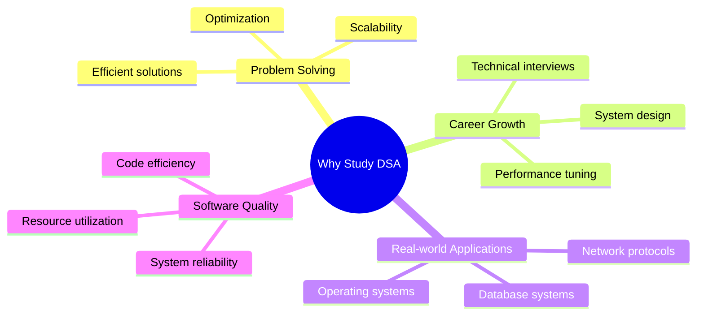
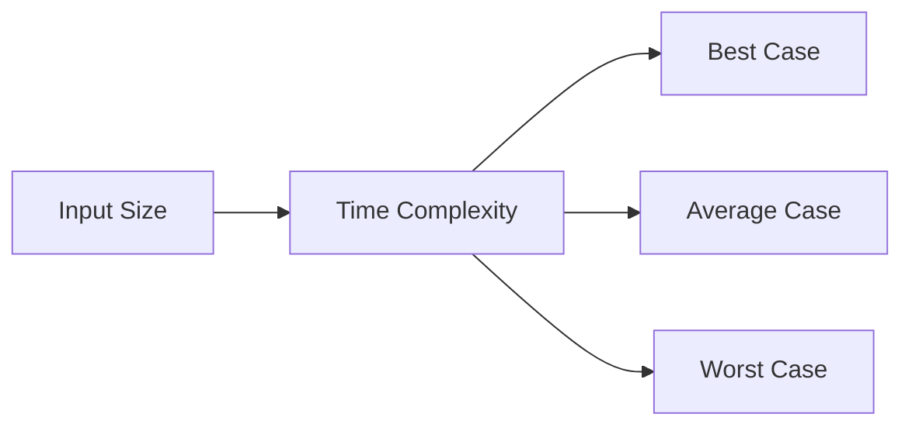

# Introduction to Data Structures and Algorithms

[Back to Course Content](README.md) | [Next: Arrays and Linked Lists →](arrays-linked-lists.md)

## What are Data Structures and Algorithms?

Data Structures and Algorithms are fundamental concepts in computer science that form the building blocks of efficient software development.

### Data Structures
Data structures are ways of organizing and storing data in a computer so that it can be accessed and modified efficiently. They provide a means to manage large amounts of data efficiently for uses such as large databases and internet indexing services.

### Algorithms
Algorithms are step-by-step procedures or formulas for solving a problem. They are the core of computer science and are used to process data, perform calculations, and solve problems efficiently.

## Why Study Data Structures and Algorithms?

## Basic Concepts

### Time Complexity
Time complexity measures the amount of time an algorithm takes to run as a function of the length of the input.

Common time complexities:
- O(1): Constant time
- O(log n): Logarithmic time
- O(n): Linear time
- O(n log n): Linearithmic time
- O(n²): Quadratic time
- O(2ⁿ): Exponential time

### Space Complexity
Space complexity measures the amount of memory an algorithm uses as a function of the length of the input.

### Big O Notation
Big O notation is used to describe the performance or complexity of an algorithm.

| Notation | Name | Example |
|----------|------|---------|
| O(1) | Constant | Accessing array element |
| O(log n) | Logarithmic | Binary search |
| O(n) | Linear | Linear search |
| O(n log n) | Linearithmic | Merge sort |
| O(n²) | Quadratic | Bubble sort |
| O(2ⁿ) | Exponential | Recursive Fibonacci |

## Algorithm Analysis

### Best, Worst, and Average Cases

| Case | Description | Example |
|------|-------------|---------|
| Best Case | Minimum time required | Finding first element in array |
| Worst Case | Maximum time required | Finding last element in array |
| Average Case | Expected time required | Finding random element in array |

### Asymptotic Analysis
Asymptotic analysis is the study of how the running time of an algorithm increases with the size of the input.

## Basic Data Structure Operations

| Operation | Description | Time Complexity |
|-----------|-------------|-----------------|
| Access | Retrieve an element | O(1) for arrays, O(n) for linked lists |
| Search | Find an element | O(n) for unsorted, O(log n) for sorted |
| Insert | Add an element | O(1) for linked lists, O(n) for arrays |
| Delete | Remove an element | O(1) for linked lists, O(n) for arrays |
| Update | Modify an element | O(1) for arrays, O(n) for linked lists |

## Algorithm Design Techniques

### 1. Brute Force
- Simplest approach
- Try all possible solutions
- Often inefficient but guaranteed to work

### 2. Greedy Algorithms
- Make locally optimal choices
- Hope for global optimum
- Often efficient but not always optimal

### 3. Divide and Conquer
- Break problem into smaller subproblems
- Solve subproblems recursively
- Combine solutions

### 4. Dynamic Programming
- Break problem into overlapping subproblems
- Store solutions to subproblems
- Build up solution from stored values

### 5. Backtracking
- Try different solutions
- Backtrack when solution is invalid
- Often used for constraint satisfaction

## Real-World Applications

### Database Systems
- Indexing structures (B-trees)
- Query optimization
- Data caching

### Operating Systems
- Process scheduling
- Memory management
- File system organization

### Network Protocols
- Routing algorithms
- Packet scheduling
- Network flow optimization

### Web Applications
- Search engines
- Social media feeds
- Recommendation systems

## Problem-Solving Steps

1. **Understand the Problem**
   - Read the problem carefully
   - Identify inputs and outputs
   - Consider edge cases

2. **Choose Data Structure**
   - Consider data organization needs
   - Evaluate access patterns
   - Think about scalability

3. **Design Algorithm**
   - Choose appropriate technique
   - Consider time and space complexity
   - Plan for edge cases

4. **Implement Solution**
   - Write clean, efficient code
   - Handle edge cases
   - Add appropriate comments

5. **Test and Optimize**
   - Test with various inputs
   - Measure performance
   - Optimize if necessary

## Common Pitfalls

| Pitfall | Description | Solution |
|---------|-------------|----------|
| Premature Optimization | Optimizing before measuring | Profile first, optimize later |
| Over-engineering | Using complex solutions for simple problems | Start simple, add complexity only when needed |
| Ignoring Edge Cases | Not handling special cases | Consider all possible inputs |
| Poor Space Usage | Using too much memory | Consider space-time trade-offs |
| Inefficient Data Structure | Wrong choice of data structure | Analyze access patterns |

## Tools and Resources

### Visualization Tools
- VisuAlgo
- Algorithm Visualizer
- Data Structure Visualizations

### Practice Platforms
- LeetCode
- HackerRank
- CodeForces

### Documentation
- GeeksforGeeks
- Stack Overflow
- Official documentation

## Summary

Key points to remember:
1. Data structures organize data efficiently
2. Algorithms solve problems systematically
3. Time and space complexity matter
4. Choose appropriate tools for the job
5. Practice is essential for mastery
6. Real-world applications drive learning

By understanding these fundamentals, you'll be better equipped to:
- Design efficient solutions
- Optimize existing code
- Solve complex problems
- Make informed technical decisions
- Build scalable systems 