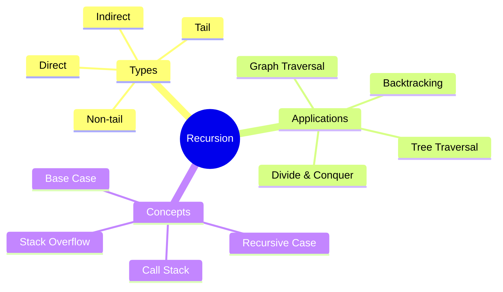

# Recursion

[Back to Course Content](README.md) | [Previous: Complexity Analysis](complexity-analysis.md) | [Next: Dynamic Programming →](dynamic-programming.md)

> Reference: This content is based on Recursion.pdf and Advanced-recursion.pdf

## What is Recursion?

Recursion is a programming technique where a function calls itself to solve a problem. It breaks down complex problems into smaller, more manageable subproblems.



## Basic Recursion Concepts

### 1. Base Case and Recursive Case

```java
public class BasicRecursion {
    // Example: Factorial
    public int factorial(int n) {
        // Base case
        if (n <= 1) {
            return 1;
        }
        // Recursive case
        return n * factorial(n - 1);
    }

    // Example: Sum of digits
    public int sumDigits(int n) {
        // Base case
        if (n < 10) {
            return n;
        }
        // Recursive case
        return n % 10 + sumDigits(n / 10);
    }
}
```

### 2. Call Stack

```java
public class CallStackExample {
    public void printNumbers(int n) {
        // Base case
        if (n <= 0) {
            return;
        }
        // Print before recursive call (ascending)
        System.out.println(n);
        printNumbers(n - 1);
        // Print after recursive call (descending)
        System.out.println(n);
    }
}
```

## Types of Recursion

### 1. Direct Recursion

```java
public class DirectRecursion {
    // Function calls itself directly
    public int fibonacci(int n) {
        if (n <= 1) return n;
        return fibonacci(n - 1) + fibonacci(n - 2);
    }
}
```

### 2. Indirect Recursion

```java
public class IndirectRecursion {
    public void functionA(int n) {
        if (n <= 0) return;
        System.out.println("A: " + n);
        functionB(n - 1);
    }

    public void functionB(int n) {
        if (n <= 0) return;
        System.out.println("B: " + n);
        functionA(n - 1);
    }
}
```

### 3. Tail Recursion

```java
public class TailRecursion {
    // Tail recursive factorial
    public int factorialTail(int n, int accumulator) {
        if (n <= 1) return accumulator;
        return factorialTail(n - 1, n * accumulator);
    }

    // Tail recursive fibonacci
    public int fibonacciTail(int n, int a, int b) {
        if (n == 0) return a;
        if (n == 1) return b;
        return fibonacciTail(n - 1, b, a + b);
    }
}
```

### 4. Non-tail Recursion

```java
public class NonTailRecursion {
    // Non-tail recursive factorial
    public int factorial(int n) {
        if (n <= 1) return 1;
        return n * factorial(n - 1);
    }

    // Non-tail recursive fibonacci
    public int fibonacci(int n) {
        if (n <= 1) return n;
        return fibonacci(n - 1) + fibonacci(n - 2);
    }
}
```

## Recursive Data Structures

### 1. Binary Tree Traversal

```java
public class BinaryTree {
    private static class Node {
        int data;
        Node left;
        Node right;

        Node(int data) {
            this.data = data;
            this.left = null;
            this.right = null;
        }
    }

    // Preorder traversal
    public void preorder(Node root) {
        if (root == null) return;
        System.out.print(root.data + " ");
        preorder(root.left);
        preorder(root.right);
    }

    // Inorder traversal
    public void inorder(Node root) {
        if (root == null) return;
        inorder(root.left);
        System.out.print(root.data + " ");
        inorder(root.right);
    }

    // Postorder traversal
    public void postorder(Node root) {
        if (root == null) return;
        postorder(root.left);
        postorder(root.right);
        System.out.print(root.data + " ");
    }
}
```

### 2. Graph Traversal

```java
public class GraphTraversal {
    private boolean[] visited;

    // DFS for graph
    public void dfs(ArrayList<ArrayList<Integer>> graph, int vertex) {
        visited = new boolean[graph.size()];
        dfsUtil(graph, vertex);
    }

    private void dfsUtil(ArrayList<ArrayList<Integer>> graph, int vertex) {
        visited[vertex] = true;
        System.out.print(vertex + " ");

        for (int neighbor : graph.get(vertex)) {
            if (!visited[neighbor]) {
                dfsUtil(graph, neighbor);
            }
        }
    }
}
```

## Advanced Recursion Techniques

### 1. Backtracking

```java
public class Backtracking {
    // N-Queens problem
    public void solveNQueens(int n) {
        int[][] board = new int[n][n];
        if (solveNQueensUtil(board, 0, n)) {
            printSolution(board);
        }
    }

    private boolean solveNQueensUtil(int[][] board, int col, int n) {
        if (col >= n) return true;

        for (int i = 0; i < n; i++) {
            if (isSafe(board, i, col, n)) {
                board[i][col] = 1;
                if (solveNQueensUtil(board, col + 1, n)) {
                    return true;
                }
                board[i][col] = 0; // Backtrack
            }
        }
        return false;
    }

    private boolean isSafe(int[][] board, int row, int col, int n) {
        // Check row
        for (int j = 0; j < col; j++) {
            if (board[row][j] == 1) return false;
        }

        // Check upper diagonal
        for (int i = row, j = col; i >= 0 && j >= 0; i--, j--) {
            if (board[i][j] == 1) return false;
        }

        // Check lower diagonal
        for (int i = row, j = col; i < n && j >= 0; i++, j--) {
            if (board[i][j] == 1) return false;
        }

        return true;
    }
}
```

### 2. Divide and Conquer

```java
public class DivideAndConquer {
    // Binary Search
    public int binarySearch(int[] arr, int target, int left, int right) {
        if (left > right) return -1;

        int mid = left + (right - left) / 2;
        if (arr[mid] == target) return mid;
        if (arr[mid] < target) {
            return binarySearch(arr, target, mid + 1, right);
        }
        return binarySearch(arr, target, left, mid - 1);
    }

    // Merge Sort
    public void mergeSort(int[] arr, int left, int right) {
        if (left < right) {
            int mid = left + (right - left) / 2;
            mergeSort(arr, left, mid);
            mergeSort(arr, mid + 1, right);
            merge(arr, left, mid, right);
        }
    }
}
```

## Recursion vs Iteration

### Comparison

| Aspect | Recursion | Iteration |
|--------|-----------|-----------|
| Memory Usage | More (stack space) | Less |
| Code Readability | Often better | Can be complex |
| Performance | Can be slower | Usually faster |
| Stack Overflow | Possible | Not possible |
| Space Complexity | O(n) | O(1) |

### Converting Recursion to Iteration

```java
public class RecursionToIteration {
    // Recursive factorial
    public int factorialRecursive(int n) {
        if (n <= 1) return 1;
        return n * factorialRecursive(n - 1);
    }

    // Iterative factorial
    public int factorialIterative(int n) {
        int result = 1;
        for (int i = 2; i <= n; i++) {
            result *= i;
        }
        return result;
    }

    // Recursive fibonacci
    public int fibonacciRecursive(int n) {
        if (n <= 1) return n;
        return fibonacciRecursive(n - 1) + fibonacciRecursive(n - 2);
    }

    // Iterative fibonacci
    public int fibonacciIterative(int n) {
        if (n <= 1) return n;
        int a = 0, b = 1;
        for (int i = 2; i <= n; i++) {
            int temp = a + b;
            a = b;
            b = temp;
        }
        return b;
    }
}
```

## Best Practices

1. **Design**
   - Identify base cases
   - Break down problem
   - Consider stack depth
   - Plan termination

2. **Implementation**
   - Handle edge cases
   - Optimize tail recursion
   - Consider memory usage
   - Test thoroughly

3. **Optimization**
   - Use memoization
   - Convert to iteration
   - Limit recursion depth
   - Consider stack size

## Common Pitfalls

1. **Stack Overflow**
   - Infinite recursion
   - Deep recursion
   - No base case
   - Large input size

2. **Performance Issues**
   - Redundant calls
   - Multiple recursion
   - Memory overhead
   - Slow execution

3. **Logic Errors**
   - Wrong base case
   - Incorrect recursion
   - Missing conditions
   - Infinite loops

## Exercises

1. Implement recursive factorial
2. Create recursive binary search
3. Design recursive tree traversal
4. Write recursive permutation generator
5. Implement recursive maze solver

## Additional Resources

- [GeeksforGeeks - Recursion](https://www.geeksforgeeks.org/recursion/)
- [Recursion Visualization](https://visualgo.net/en/recursion)
- [Recursion Practice](https://codingbat.com/java/Recursion-1)
- [Recursion Tutorial](https://www.programiz.com/java-programming/recursion) 