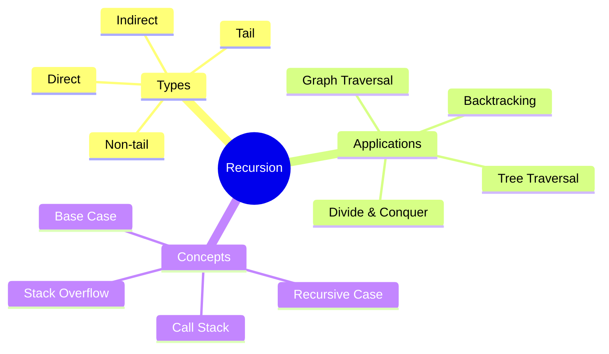
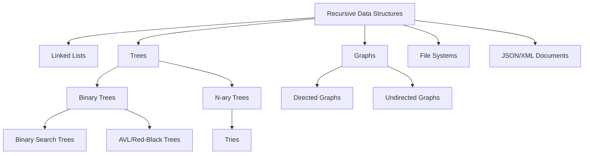
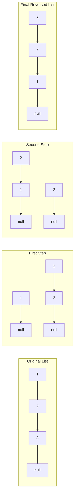
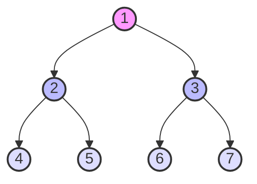
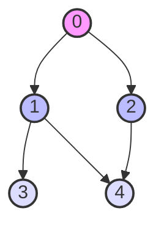
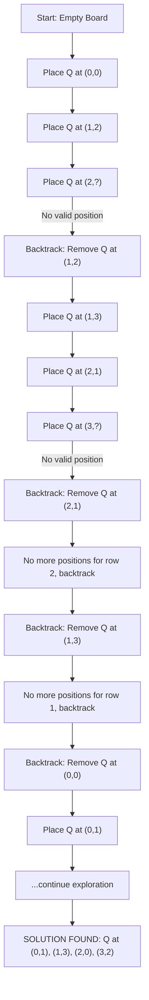
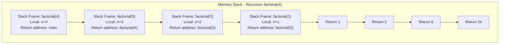
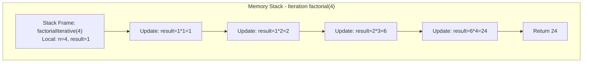

# Recursion

[Back to Course Content](README.md) | [Previous: Complexity Analysis](complexity-analysis.md) | [Next: Dynamic Programming →](dynamic-programming.md)

> Reference: This content is based on Recursion.pdf and Advanced-recursion.pdf

## What is Recursion?

Recursion is a programming technique where a function calls itself to solve a problem. It breaks down complex problems into smaller, more manageable subproblems.



## Basic Recursion Concepts

### 1. Base Case and Recursive Case

```java
public class BasicRecursion {
    // Example: Factorial
    public int factorial(int n) {
        // Base case
        if (n <= 1) {
            return 1;
        }
        // Recursive case
        return n * factorial(n - 1);
    }

    // Example: Sum of digits
    public int sumDigits(int n) {
        // Base case
        if (n < 10) {
            return n;
        }
        // Recursive case
        return n % 10 + sumDigits(n / 10);
    }
}
```

### 2. Call Stack

```java
public class CallStackExample {
    public void printNumbers(int n) {
        // Base case
        if (n <= 0) {
            return;
        }
        // Print before recursive call (ascending)
        System.out.println(n);
        printNumbers(n - 1);
        // Print after recursive call (descending)
        System.out.println(n);
    }
}
```

## Types of Recursion

### 1. Direct Recursion

```java
public class DirectRecursion {
    // Function calls itself directly
    public int fibonacci(int n) {
        if (n <= 1) return n;
        return fibonacci(n - 1) + fibonacci(n - 2);
    }
}
```

### 2. Indirect Recursion

```java
public class IndirectRecursion {
    public void functionA(int n) {
        if (n <= 0) return;
        System.out.println("A: " + n);
        functionB(n - 1);
    }

    public void functionB(int n) {
        if (n <= 0) return;
        System.out.println("B: " + n);
        functionA(n - 1);
    }
}
```

### 3. Tail Recursion

```java
public class TailRecursion {
    // Tail recursive factorial
    public int factorialTail(int n, int accumulator) {
        if (n <= 1) return accumulator;
        return factorialTail(n - 1, n * accumulator);
    }

    // Tail recursive fibonacci
    public int fibonacciTail(int n, int a, int b) {
        if (n == 0) return a;
        if (n == 1) return b;
        return fibonacciTail(n - 1, b, a + b);
    }
}
```

### 4. Non-tail Recursion

```java
public class NonTailRecursion {
    // Non-tail recursive factorial
    public int factorial(int n) {
        if (n <= 1) return 1;
        return n * factorial(n - 1);
    }

    // Non-tail recursive fibonacci
    public int fibonacci(int n) {
        if (n <= 1) return n;
        return fibonacci(n - 1) + fibonacci(n - 2);
    }
}
```

### 5. Linear vs Multiple Recursion

Recursive functions can also be classified based on the number of recursive calls they make in each execution.

#### Linear Recursion

In linear recursion, a function makes at most one recursive call during its execution. The recursion follows a single path, which makes linear recursion simpler to analyze and often more efficient than multiple recursion.

```java
public class LinearRecursion {
    // Linear recursion - factorial
    public int factorial(int n) {
        if (n <= 1) return 1;
        return n * factorial(n - 1);  // Single recursive call
    }
    
    // Linear recursion - exponentiation
    public double power(double x, int n) {
        if (n == 0) return 1;
        if (n < 0) return 1 / power(x, -n);
        if (n % 2 == 0) {
            double half = power(x, n/2);
            return half * half;
        }
        return x * power(x, n - 1);  // Single recursive call
    }
    
    // Linear recursion - string reversal
    public String reverse(String str) {
        if (str.isEmpty() || str.length() == 1) {
            return str;
        }
        return str.charAt(str.length() - 1) + 
               reverse(str.substring(0, str.length() - 1));  // Single recursive call
    }
}
```

##### Mathematical Analysis

For linear recursion:
- **Time Complexity**: Typically O(n) where n is the input size or recursion depth
- **Space Complexity**: O(n) for the call stack
- **Recurrence Relation**: Often in the form T(n) = T(n-1) + O(1)

Linear recursion is generally more efficient than multiple recursion because it creates only one new subproblem at each step. The total number of function calls is directly proportional to the input size.

#### Multiple Recursion

In multiple recursion, a function makes two or more recursive calls in a single execution. This creates a branching recursion pattern that can lead to exponential time complexity if not optimized properly.

```java
public class MultipleRecursion {
    // Binary recursion - Fibonacci
    public int fibonacci(int n) {
        if (n <= 1) return n;
        return fibonacci(n - 1) + fibonacci(n - 2);  // Two recursive calls
    }
    
    // Multiple recursion - generate permutations
    public List<List<Integer>> permute(int[] nums) {
        List<List<Integer>> result = new ArrayList<>();
        permuteHelper(nums, 0, result);
        return result;
    }
    
    private void permuteHelper(int[] nums, int start, List<List<Integer>> result) {
        if (start == nums.length) {
            List<Integer> permutation = new ArrayList<>();
            for (int num : nums) {
                permutation.add(num);
            }
            result.add(permutation);
            return;
        }
        
        for (int i = start; i < nums.length; i++) {
            // Swap elements
            swap(nums, start, i);
            
            // Recursive call - multiple recursion occurs through the loop
            permuteHelper(nums, start + 1, result);
            
            // Backtrack
            swap(nums, start, i);
        }
    }
    
    private void swap(int[] nums, int i, int j) {
        int temp = nums[i];
        nums[i] = nums[j];
        nums[j] = temp;
    }
    
    // Multiple recursion - Tower of Hanoi
    public void towerOfHanoi(int n, char source, char auxiliary, char target) {
        if (n == 1) {
            System.out.println("Move disk 1 from " + source + " to " + target);
            return;
        }
        
        // Move n-1 disks from source to auxiliary
        towerOfHanoi(n - 1, source, target, auxiliary);  // First recursive call
        
        // Move the nth disk from source to target
        System.out.println("Move disk " + n + " from " + source + " to " + target);
        
        // Move n-1 disks from auxiliary to target
        towerOfHanoi(n - 1, auxiliary, source, target);  // Second recursive call
    }
    
    // Multiple recursion - binary tree traversal (postorder)
    public List<Integer> postorderTraversal(TreeNode root) {
        List<Integer> result = new ArrayList<>();
        if (root == null) return result;
        
        // First recursive call for left subtree
        result.addAll(postorderTraversal(root.left));
        
        // Second recursive call for right subtree
        result.addAll(postorderTraversal(root.right));
        
        // Visit the root node
        result.add(root.val);
        
        return result;
    }
}
```

##### Mathematical Analysis

For multiple recursion:
- **Time Complexity**: Often exponential, e.g., O(2^n) for binary recursion like Fibonacci
- **Space Complexity**: O(n) for the call stack (depth), though total calls may be exponential
- **Recurrence Relation**: Often in the form T(n) = aT(n-b) + O(f(n)) where a > 1

The key challenge with multiple recursion is the exponential growth in the number of function calls. For example, with naive Fibonacci implementation, computing F(n) requires approximately 2^n function calls.

#### Comparison of Time Complexity

| Algorithm | Type | Time Complexity | Space Complexity | Number of Function Calls |
|-----------|------|----------------|------------------|--------------------------|
| Factorial | Linear | O(n) | O(n) | n |
| Power | Linear | O(log n) | O(log n) | log n |
| String Reversal | Linear | O(n) | O(n) | n |
| Binary Search | Linear | O(log n) | O(log n) | log n |
| Fibonacci (naive) | Multiple | O(2^n) | O(n) | ~2^n |
| Tower of Hanoi | Multiple | O(2^n) | O(n) | 2^n - 1 |
| Permutations | Multiple | O(n!) | O(n) | n! |
| Tree Traversal | Multiple | O(n) | O(h) | n |

#### Memoization for Multiple Recursion

Because multiple recursion often involves redundant calculations, memoization can dramatically improve performance by storing previously computed results:

```java
public class MemoizedMultipleRecursion {
    // Memoized Fibonacci
    public int fibonacci(int n) {
        // Initialize memoization table
        Map<Integer, Integer> memo = new HashMap<>();
        return fibMemoized(n, memo);
    }
    
    private int fibMemoized(int n, Map<Integer, Integer> memo) {
        // Base cases
        if (n <= 1) return n;
        
        // Check if already computed
        if (memo.containsKey(n)) {
            return memo.get(n);
        }
        
        // Compute and store result
        int result = fibMemoized(n - 1, memo) + fibMemoized(n - 2, memo);
        memo.put(n, result);
        
        return result;
    }
    
    // With memoization, time complexity improves from O(2^n) to O(n)
    // Space complexity is O(n) for both the call stack and memoization table
}
```

The difference in efficiency is dramatic:
- Computing F(40) with naive recursion would take billions of operations
- Computing F(40) with memoization takes just ~40 operations

## Recursive Data Structures

Recursive data structures are those that are partially composed of smaller or simpler instances of the same data structure. Common examples include linked lists, trees, and graphs.

These structures are naturally suited for recursive algorithms, as their recursive nature often maps directly to recursive function calls.



### 1. Linked Lists

A linked list is a recursive data structure because it's either empty or consists of a node containing a value and a reference to a linked list (the rest of the list).

**Formal recursive definition**:
- A linked list L is either:
  - null (empty list), or
  - A node containing a data element and a reference to a linked list L'

```java
public class LinkedList<T> {
    private static class Node<T> {
        T data;
        Node<T> next;
        
        Node(T data) {
            this.data = data;
        }
    }
    
    private Node<T> head;
    
    // Recursive method to calculate list length
    public int length() {
        return lengthRecursive(head);
    }
    
    private int lengthRecursive(Node<T> node) {
        // Base case: empty list
        if (node == null) {
            return 0;
        }
        // Recursive case: 1 + length of rest of list
        return 1 + lengthRecursive(node.next);
    }
    
    // Recursive method to search for an element
    public boolean contains(T target) {
        return containsRecursive(head, target);
    }
    
    private boolean containsRecursive(Node<T> node, T target) {
        // Base case: empty list
        if (node == null) {
            return false;
        }
        // Base case: found target
        if (node.data.equals(target)) {
            return true;
        }
        // Recursive case: search rest of list
        return containsRecursive(node.next, target);
    }
    
    // Recursive method to reverse a linked list
    public void reverse() {
        head = reverseRecursive(head, null);
    }
    
    private Node<T> reverseRecursive(Node<T> current, Node<T> prev) {
        // Base case: end of list
        if (current == null) {
            return prev;
        }
        
        // Save next node
        Node<T> next = current.next;
        
        // Reverse the pointer
        current.next = prev;
        
        // Recursive call
        return reverseRecursive(next, current);
    }
}
```

#### Visualization of Recursive List Reversal



### 2. Trees

Trees are inherently recursive structures. A tree consists of a root node and zero or more subtrees. Each subtree is itself a valid tree, making the structure fundamentally recursive.

**Formal recursive definition**:
- A tree T is either:
  - null (empty tree), or
  - A node containing a data element and references to zero or more trees (subtrees)

```java
public class BinaryTree<T> {
    private static class Node<T> {
        T data;
        Node<T> left;
        Node<T> right;

        Node(T data) {
            this.data = data;
            this.left = null;
            this.right = null;
        }
    }
    
    private Node<T> root;
    
    // Recursive tree traversals:
    
    // 1. Preorder traversal (Root -> Left -> Right)
    public List<T> preorderTraversal() {
        List<T> result = new ArrayList<>();
        preorder(root, result);
        return result;
    }
    
    private void preorder(Node<T> node, List<T> result) {
        if (node == null) return;
        
        // Visit node
        result.add(node.data);
        // Traverse left subtree
        preorder(node.left, result);
        // Traverse right subtree
        preorder(node.right, result);
    }

    // 2. Inorder traversal (Left -> Root -> Right)
    public List<T> inorderTraversal() {
        List<T> result = new ArrayList<>();
        inorder(root, result);
        return result;
    }
    
    private void inorder(Node<T> node, List<T> result) {
        if (node == null) return;
        
        // Traverse left subtree
        inorder(node.left, result);
        // Visit node
        result.add(node.data);
        // Traverse right subtree
        inorder(node.right, result);
    }

    // 3. Postorder traversal (Left -> Right -> Root)
    public List<T> postorderTraversal() {
        List<T> result = new ArrayList<>();
        postorder(root, result);
        return result;
    }
    
    private void postorder(Node<T> node, List<T> result) {
        if (node == null) return;
        
        // Traverse left subtree
        postorder(node.left, result);
        // Traverse right subtree
        postorder(node.right, result);
        // Visit node
        result.add(node.data);
    }
    
    // Recursive calculation of tree height
    public int height() {
        return height(root);
    }
    
    private int height(Node<T> node) {
        if (node == null) return 0;
        
        // Calculate height of left and right subtrees
        int leftHeight = height(node.left);
        int rightHeight = height(node.right);
        
        // Return the larger height + 1 (for the current node)
        return Math.max(leftHeight, rightHeight) + 1;
    }
    
    // Recursive calculation of node count
    public int size() {
        return size(root);
    }
    
    private int size(Node<T> node) {
        if (node == null) return 0;
        
        // Size of tree = 1 (for root) + size of left subtree + size of right subtree
        return 1 + size(node.left) + size(node.right);
    }
    
    // Recursive check for balanced tree
    public boolean isBalanced() {
        return isBalanced(root);
    }
    
    private boolean isBalanced(Node<T> node) {
        if (node == null) return true;
        
        // Check height difference
        int leftHeight = height(node.left);
        int rightHeight = height(node.right);
        
        if (Math.abs(leftHeight - rightHeight) > 1) {
            return false;
        }
        
        // Recursively check if left and right subtrees are balanced
        return isBalanced(node.left) && isBalanced(node.right);
    }
}
```

#### Visualization of Tree Traversals



- **Preorder traversal**: 1, 2, 4, 5, 3, 6, 7
- **Inorder traversal**: 4, 2, 5, 1, 6, 3, 7
- **Postorder traversal**: 4, 5, 2, 6, 7, 3, 1

### 3. Graphs

Graphs can also be viewed recursively, where each vertex can connect to other vertices forming potentially cyclic structures. Graph algorithms, especially depth-first search (DFS), are naturally expressed using recursion.

**Formal recursive definition**:
- A graph G consists of a set of vertices V and a set of edges E
- The traversal of G from a vertex v involves visiting v and then recursively visiting all vertices adjacent to v that haven't been visited yet

```java
public class Graph {
    private int V;                  // Number of vertices
    private List<Integer>[] adj;    // Adjacency list
    
    @SuppressWarnings("unchecked")
    public Graph(int v) {
        this.V = v;
        adj = new ArrayList[v];
        for (int i = 0; i < v; i++) {
            adj[i] = new ArrayList<>();
        }
    }
    
    // Add an edge from v to w
    public void addEdge(int v, int w) {
        adj[v].add(w);
    }
    
    // Recursive DFS traversal
    public void dfs(int startVertex) {
        boolean[] visited = new boolean[V];
        dfsUtil(startVertex, visited);
    }
    
    private void dfsUtil(int vertex, boolean[] visited) {
        // Mark the current vertex as visited
        visited[vertex] = true;
        System.out.print(vertex + " ");
        
        // Recur for all adjacent vertices
        for (int neighbor : adj[vertex]) {
            if (!visited[neighbor]) {
                dfsUtil(neighbor, visited);
            }
        }
    }
    
    // Find path between two vertices
    public boolean hasPath(int source, int destination) {
        boolean[] visited = new boolean[V];
        return hasPathUtil(source, destination, visited);
    }
    
    private boolean hasPathUtil(int current, int destination, boolean[] visited) {
        // If current vertex is destination, path exists
        if (current == destination) {
            return true;
        }
        
        // Mark current vertex as visited
        visited[current] = true;
        
        // Check all adjacent vertices
        for (int neighbor : adj[current]) {
            if (!visited[neighbor]) {
                if (hasPathUtil(neighbor, destination, visited)) {
                    return true;
                }
            }
        }
        
        return false;
    }
    
    // Find all paths between two vertices
    public List<List<Integer>> allPaths(int source, int destination) {
        List<List<Integer>> paths = new ArrayList<>();
        List<Integer> currentPath = new ArrayList<>();
        currentPath.add(source);
        boolean[] visited = new boolean[V];
        
        allPathsUtil(source, destination, visited, currentPath, paths);
        return paths;
    }
    
    private void allPathsUtil(int current, int destination, boolean[] visited, 
                             List<Integer> currentPath, List<List<Integer>> paths) {
        // Mark current vertex as visited
        visited[current] = true;
        
        // If destination reached, add current path to result
        if (current == destination) {
            paths.add(new ArrayList<>(currentPath));
        } else {
            // Recur for all adjacent vertices
            for (int neighbor : adj[current]) {
                if (!visited[neighbor]) {
                    currentPath.add(neighbor);
                    allPathsUtil(neighbor, destination, visited, currentPath, paths);
                    currentPath.remove(currentPath.size() - 1); // Backtrack
                }
            }
        }
        
        // Unmark the current vertex (backtrack)
        visited[current] = false;
    }
}
```

#### Visualization of Depth-First Search



DFS traversal from vertex 0:
1. Visit 0, mark as visited
2. Visit 1 (neighbor of 0), mark as visited
3. Visit 3 (neighbor of 1), mark as visited
4. Visit 4 (neighbor of 1), mark as visited
5. Backtrack to 0
6. Visit 2 (neighbor of 0), mark as visited
7. Backtrack and finish

DFS Traversal: 0, 1, 3, 4, 2

### 4. Other Recursive Data Structures

#### JSON/XML Documents
These hierarchical data formats are inherently recursive, with elements potentially containing other elements of the same type.

**Example of recursive XML processing**:
```java
public class XMLProcessor {
    public void processXML(Element element, int depth) {
        // Process the current element
        String indent = " ".repeat(depth * 2);
        System.out.println(indent + "Element: " + element.getTagName());
        
        // Process attributes
        NamedNodeMap attributes = element.getAttributes();
        for (int i = 0; i < attributes.getLength(); i++) {
            Node attr = attributes.item(i);
            System.out.println(indent + "  Attribute: " + attr.getNodeName() + " = " + attr.getNodeValue());
        }
        
        // Process child text nodes
        NodeList childNodes = element.getChildNodes();
        for (int i = 0; i < childNodes.getLength(); i++) {
            Node child = childNodes.item(i);
            if (child.getNodeType() == Node.TEXT_NODE) {
                String text = child.getNodeValue().trim();
                if (!text.isEmpty()) {
                    System.out.println(indent + "  Text: " + text);
                }
            }
        }
        
        // Recursively process child elements
        NodeList children = element.getElementsByTagName("*");
        for (int i = 0; i < children.getLength(); i++) {
            if (children.item(i).getParentNode() == element) {
                processXML((Element) children.item(i), depth + 1);
            }
        }
    }
}
```

#### File Systems
Directories can contain other directories, creating a recursive structure that is perfectly suited for recursive algorithms.

```java
public class FileExplorer {
    // Calculate total size of a file or directory recursively
    public static long calculateSize(File file) {
        if (file.isFile()) {
            return file.length();
        }
        
        // If it's a directory, sum up sizes of all files/directories
        long size = 0;
        File[] children = file.listFiles();
        if (children != null) {
            for (File child : children) {
                size += calculateSize(child); // Recursive call
            }
        }
        
        return size;
    }
    
    // Find all files with a specific extension recursively
    public static List<File> findFiles(File dir, String extension) {
        List<File> result = new ArrayList<>();
        findFilesRecursive(dir, extension, result);
        return result;
    }
    
    private static void findFilesRecursive(File current, String extension, List<File> result) {
        // Base case: not a directory
        if (!current.isDirectory()) {
            if (current.getName().endsWith(extension)) {
                result.add(current);
            }
            return;
        }
        
        // Check all files in this directory
        File[] files = current.listFiles();
        if (files != null) {
            for (File file : files) {
                if (file.isDirectory()) {
                    findFilesRecursive(file, extension, result); // Recursive call
                } else if (file.getName().endsWith(extension)) {
                    result.add(file);
                }
            }
        }
    }
}
```

## Advanced Recursion Techniques

### 1. Backtracking

Backtracking is a general algorithmic technique that considers all possible configurations for solving a computational problem and abandons a path as soon as it determines that the path cannot lead to a valid solution.

The key idea is to build a solution incrementally, and as soon as we determine that the current path cannot lead to a valid solution, we "backtrack" and try a different path.

#### Core Concepts of Backtracking

1. **Choice**: At each step, the algorithm makes a choice among several possible options
2. **Constraint**: There are problem-specific constraints that must be satisfied
3. **Goal**: A specific condition that indicates a complete valid solution
4. **Exploration**: The algorithm explores each choice recursively
5. **Backtracking**: If a choice leads to a dead end, the algorithm undoes the choice and tries alternatives

```java
public class Backtracking {
    // N-Queens problem
    // Place N queens on an N×N chessboard so that no two queens threaten each other
    public List<List<String>> solveNQueens(int n) {
        List<List<String>> solutions = new ArrayList<>();
        char[][] board = new char[n][n];
        
        // Initialize empty board
        for (int i = 0; i < n; i++) {
            for (int j = 0; j < n; j++) {
                board[i][j] = '.';
            }
        }
        
        backtrack(board, 0, solutions);
        return solutions;
    }
    
    private void backtrack(char[][] board, int row, List<List<String>> solutions) {
        // Base case: All queens have been placed
        if (row == board.length) {
            solutions.add(createSolution(board));
            return;
        }
        
        int n = board.length;
        for (int col = 0; col < n; col++) {
            // Check if a queen can be placed at board[row][col]
            if (isValid(board, row, col)) {
                // Make a choice
                board[row][col] = 'Q';
                
                // Explore further with this choice
                backtrack(board, row + 1, solutions);
                
                // Undo the choice (backtrack)
                board[row][col] = '.';
            }
        }
    }
    
    private boolean isValid(char[][] board, int row, int col) {
        int n = board.length;
        
        // Check column
        for (int i = 0; i < row; i++) {
            if (board[i][col] == 'Q') {
                return false;
            }
        }
        
        // Check upper-left diagonal
        for (int i = row - 1, j = col - 1; i >= 0 && j >= 0; i--, j--) {
            if (board[i][j] == 'Q') {
                return false;
            }
        }
        
        // Check upper-right diagonal
        for (int i = row - 1, j = col + 1; i >= 0 && j < n; i--, j++) {
            if (board[i][j] == 'Q') {
                return false;
            }
        }
        
        return true;
    }
    
    private List<String> createSolution(char[][] board) {
        List<String> solution = new ArrayList<>();
        for (char[] row : board) {
            solution.add(new String(row));
        }
        return solution;
    }
    
    // Sudoku Solver - another classic backtracking problem
    public void solveSudoku(char[][] board) {
        solveBacktrack(board);
    }
    
    private boolean solveBacktrack(char[][] board) {
        for (int row = 0; row < 9; row++) {
            for (int col = 0; col < 9; col++) {
                // Find an empty cell
                if (board[row][col] == '.') {
                    // Try digits 1-9
                    for (char num = '1'; num <= '9'; num++) {
                        if (isValid(board, row, col, num)) {
                            // Make a choice
                            board[row][col] = num;
                            
                            // Recursively try to solve the rest of the puzzle
                            if (solveBacktrack(board)) {
                                return true; // Solution found
                            }
                            
                            // If placing num doesn't lead to a solution, backtrack
                            board[row][col] = '.';
                        }
                    }
                    
                    // No valid number can be placed, need to backtrack
                    return false;
                }
            }
        }
        
        // All cells filled - solution found
        return true;
    }
    
    private boolean isValid(char[][] board, int row, int col, char num) {
        // Check row
        for (int x = 0; x < 9; x++) {
            if (board[row][x] == num) {
                return false;
            }
        }
        
        // Check column
        for (int x = 0; x < 9; x++) {
            if (board[x][col] == num) {
                return false;
            }
        }
        
        // Check 3x3 box
        int startRow = row - row % 3;
        int startCol = col - col % 3;
        for (int i = 0; i < 3; i++) {
            for (int j = 0; j < 3; j++) {
                if (board[i + startRow][j + startCol] == num) {
                    return false;
                }
            }
        }
        
        return true;
    }
}
```

#### Visualization of N-Queens Backtracking (4-Queens Example)



#### Common Backtracking Problems

1. **N-Queens Problem**: Place N queens on an N×N chessboard so that no two queens threaten each other.
2. **Sudoku**: Fill a 9×9 grid with digits so that each column, each row, and each of the nine 3×3 subgrids contains all digits from 1 to 9.
3. **Rat in a Maze**: Find a path from source to destination in a maze.
4. **Knight's Tour**: Find a sequence of moves of a knight on a chessboard such that the knight visits every square exactly once.
5. **Subset Sum**: Find all subsets of a set of numbers that sum to a given target.
6. **Hamiltonian Path/Cycle**: Find a path in a graph that visits each vertex exactly once.
7. **Graph Coloring**: Assign colors to vertices of a graph such that no two adjacent vertices have the same color.

### 2. Divide and Conquer

// Next section on Divide and Conquer will follow...

## Recursion vs Iteration

### Theoretical Comparison

| Aspect | Recursion | Iteration |
|--------|-----------|-----------|
| **Definition** | Function calls itself | Uses loops (for, while) |
| **Memory Usage** | More (stack space for each call) | Less (constant stack space) |
| **Time Efficiency** | Can be slower due to function call overhead | Generally faster |
| **Code Readability** | Often cleaner for inherently recursive problems | Can be more complex for recursive structures |
| **Termination** | Base case(s) | Loop condition |
| **Stack Overflow** | Possible with deep recursion | Not possible |
| **Space Complexity** | O(n) for n recursive calls | O(1) typically |
| **Implementation** | More declarative approach | More imperative approach |
| **Natural for** | Tree/graph traversals, divide and conquer | Linear processing of data structures |

### Detailed Memory Analysis

#### Recursion Memory Pattern

When a recursive function executes:
1. Each recursive call allocates memory on the stack for:
   - Function parameters
   - Return address
   - Local variables
2. Memory consumption grows linearly with recursion depth
3. When recursion is unwound, the stack frames are popped and memory is reclaimed



#### Iteration Memory Pattern

When an iterative function executes:
1. A single stack frame is allocated with:
   - Function parameters
   - Return address
   - Local variables
2. Memory consumption remains constant regardless of input size
3. Variables are updated in-place during iteration



### Performance Benchmarks

For a factorial function (n=20):
- Recursive: ~1.2-1.5x slower than iterative
- Memory usage: Recursive uses O(n) stack space while iterative uses O(1)

### Practical Examples

#### Example 1: Factorial

```java
// Recursive implementation
public int factorialRecursive(int n) {
    // Base case
    if (n <= 1) return 1;
    
    // Recursive case
    return n * factorialRecursive(n - 1);
}

// Iterative implementation
public int factorialIterative(int n) {
    int result = 1;
    
    // Loop from 2 to n
    for (int i = 2; i <= n; i++) {
        result *= i;
    }
    
    return result;
}
```

#### Example 2: Fibonacci

```java
// Recursive implementation (exponential time complexity)
public int fibonacciRecursive(int n) {
    // Base cases
    if (n <= 1) return n;
    
    // Recursive case
    return fibonacciRecursive(n - 1) + fibonacciRecursive(n - 2);
}

// Iterative implementation (linear time complexity)
public int fibonacciIterative(int n) {
    if (n <= 1) return n;
    
    int prev = 0, current = 1;
    
    for (int i = 2; i <= n; i++) {
        int next = prev + current;
        prev = current;
        current = next;
    }
    
    return current;
}

// Memoized recursive implementation (linear time complexity)
public int fibonacciMemoized(int n) {
    Map<Integer, Integer> memo = new HashMap<>();
    return fibHelper(n, memo);
}

private int fibHelper(int n, Map<Integer, Integer> memo) {
    // Base cases
    if (n <= 1) return n;
    
    // Check if already computed
    if (memo.containsKey(n)) {
        return memo.get(n);
    }
    
    // Compute and store for future use
    int result = fibHelper(n - 1, memo) + fibHelper(n - 2, memo);
    memo.put(n, result);
    
    return result;
}
```

#### Example 3: Tree Traversal

```java
// Recursive implementation
public void traverseTreeRecursive(TreeNode node) {
    if (node == null) return;
    
    // Process current node
    System.out.println(node.value);
    
    // Recursive calls for children
    traverseTreeRecursive(node.left);
    traverseTreeRecursive(node.right);
}

// Iterative implementation using a stack
public void traverseTreeIterative(TreeNode root) {
    if (root == null) return;
    
    Stack<TreeNode> stack = new Stack<>();
    stack.push(root);
    
    while (!stack.isEmpty()) {
        TreeNode node = stack.pop();
        
        // Process current node
        System.out.println(node.value);
        
        // Add children to stack (right first so left is processed first)
        if (node.right != null) stack.push(node.right);
        if (node.left != null) stack.push(node.left);
    }
}
```

### When to Choose Recursion vs Iteration

#### Choose Recursion When:
1. **Problem is naturally recursive**: Tree traversals, graph exploration, divide and conquer
2. **Solution is clearer with recursion**: Algorithms like quicksort, mergesort
3. **Stack depth is manageable**: Problem size has reasonable bounds
4. **Memory isn't a constraint**: System has ample memory available
5. **Code readability is paramount**: Recursive solution is significantly cleaner

#### Choose Iteration When:
1. **Performance is critical**: Need the fastest possible execution
2. **Memory is constrained**: Working with limited memory resources
3. **Deep recursion possible**: Input size could be very large
4. **Tail recursion isn't optimized**: Language/compiler doesn't perform TCO
5. **Problem is naturally sequential**: Linear processing of data structures

### Converting Between Paradigms

Most recursive algorithms can be converted to iterative ones by:
1. **Using an explicit stack**: Manually manage the call stack
2. **Maintaining state variables**: Track what would be on the stack frames
3. **Transforming recursion patterns**:
   - Linear recursion → loops
   - Tail recursion → loops
   - Multiple recursion → stack + loops
   - Mutual recursion → state machines + loops

```java
// Example: Converting postorder traversal from recursive to iterative
public List<Integer> postorderTraversalIterative(TreeNode root) {
    LinkedList<Integer> result = new LinkedList<>();
    if (root == null) return result;
    
    Stack<TreeNode> stack = new Stack<>();
    TreeNode current = root;
    
    while (current != null || !stack.isEmpty()) {
        // Go all the way to the left
        while (current != null) {
            stack.push(current);
            stack.push(current);
            current = current.left;
        }
        
        // No left child or already processed
        if (!stack.isEmpty()) {
            current = stack.pop();
            
            if (!stack.isEmpty() && stack.peek() == current) {
                // Still need to process right subtree
                current = current.right;
            } else {
                // Both subtrees processed, add to result
                result.add(current.val);
                current = null;
            }
        }
    }
    
    return result;
}
```

### Real-world Considerations

1. **Stack size limits**: Most environments have limits on call stack size
   - Java default: ~1MB (can be adjusted with -Xss flag)
   - Python default: ~1000 frames
   - C/C++ depends on compiler/OS settings

2. **Tail Call Optimization**:
   - Supported in: Scala, Kotlin (with tailrec), functional languages
   - Not supported in: Java, Python, standard C++

3. **Hybrid approaches**:
   - Using recursion with depth limiting
   - Switching to iteration after certain depth
   - Combining both paradigms for optimal solutions

## Best Practices

1. **Design**
   - Identify base cases
   - Break down problem
   - Consider stack depth
   - Plan termination

2. **Implementation**
   - Handle edge cases
   - Optimize tail recursion
   - Consider memory usage
   - Test thoroughly

3. **Optimization**
   - Use memoization
   - Convert to iteration
   - Limit recursion depth
   - Consider stack size

## Common Pitfalls

1. **Stack Overflow**
   - Infinite recursion
   - Deep recursion
   - No base case
   - Large input size

2. **Performance Issues**
   - Redundant calls
   - Multiple recursion
   - Memory overhead
   - Slow execution

3. **Logic Errors**
   - Wrong base case
   - Incorrect recursion
   - Missing conditions
   - Infinite loops

## Exercises

1. Implement recursive factorial
2. Create recursive binary search
3. Design recursive tree traversal
4. Write recursive permutation generator
5. Implement recursive maze solver

## Additional Resources

- [GeeksforGeeks - Recursion](https://www.geeksforgeeks.org/recursion/)
- [Recursion Visualization](https://visualgo.net/en/recursion)
- [Recursion Practice](https://codingbat.com/java/Recursion-1)
- [Recursion Tutorial](https://www.programiz.com/java-programming/recursion) 