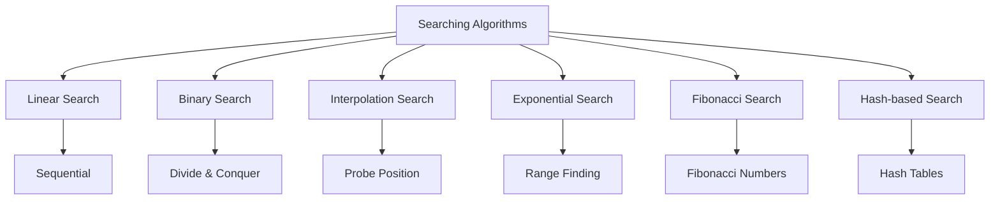

# Searching Algorithms

[Back to Course Content](README.md) | [← Previous: Sorting Algorithms](sorting.md) | [Next: Dynamic Programming →](dynamic-programming.md)

## Introduction to Searching

Searching is the process of finding a specific element in a data structure. Different searching algorithms have different characteristics and use cases.

### Searching Algorithm Characteristics



### Algorithm Comparison

| Algorithm | Time Complexity | Space Complexity | Prerequisites | Best Case |
|-----------|----------------|------------------|---------------|-----------|
| Linear Search | O(n) | O(1) | None | O(1) |
| Binary Search | O(log n) | O(1) | Sorted Array | O(1) |
| Interpolation Search | O(log log n) | O(1) | Sorted Array | O(1) |
| Exponential Search | O(log n) | O(1) | Sorted Array | O(1) |
| Fibonacci Search | O(log n) | O(1) | Sorted Array | O(1) |
| Hash Search | O(1) | O(n) | Hash Table | O(1) |

## Basic Searching Algorithms

### 1. Linear Search

```python
def linear_search(arr, target):
    for i in range(len(arr)):
        if arr[i] == target:
            return i
    return -1

# Recursive Linear Search
def linear_search_recursive(arr, target, index=0):
    if index >= len(arr):
        return -1
    if arr[index] == target:
        return index
    return linear_search_recursive(arr, target, index + 1)
```

### 2. Binary Search

```python
def binary_search(arr, target):
    left, right = 0, len(arr) - 1
    
    while left <= right:
        mid = (left + right) // 2
        if arr[mid] == target:
            return mid
        elif arr[mid] < target:
            left = mid + 1
        else:
            right = mid - 1
    return -1

# Recursive Binary Search
def binary_search_recursive(arr, target, left=None, right=None):
    if left is None:
        left = 0
    if right is None:
        right = len(arr) - 1
    
    if left > right:
        return -1
    
    mid = (left + right) // 2
    if arr[mid] == target:
        return mid
    elif arr[mid] < target:
        return binary_search_recursive(arr, target, mid + 1, right)
    else:
        return binary_search_recursive(arr, target, left, mid - 1)
```

## Advanced Searching Algorithms

### 1. Interpolation Search

```python
def interpolation_search(arr, target):
    left, right = 0, len(arr) - 1
    
    while left <= right and arr[left] <= target <= arr[right]:
        if left == right:
            if arr[left] == target:
                return left
            return -1
        
        # Calculate probe position
        pos = left + int(((right - left) / (arr[right] - arr[left])) * 
                        (target - arr[left]))
        
        if pos < left:
            pos = left
        if pos > right:
            pos = right
        
        if arr[pos] == target:
            return pos
        elif arr[pos] < target:
            left = pos + 1
        else:
            right = pos - 1
    
    return -1
```

### 2. Exponential Search

```python
def exponential_search(arr, target):
    if arr[0] == target:
        return 0
    
    n = len(arr)
    i = 1
    while i < n and arr[i] <= target:
        i *= 2
    
    # Binary search in the found range
    left = i // 2
    right = min(i, n - 1)
    
    while left <= right:
        mid = (left + right) // 2
        if arr[mid] == target:
            return mid
        elif arr[mid] < target:
            left = mid + 1
        else:
            right = mid - 1
    
    return -1
```

### 3. Fibonacci Search

```python
def fibonacci_search(arr, target):
    n = len(arr)
    fib_m2 = 0  # (m-2)'th Fibonacci number
    fib_m1 = 1  # (m-1)'th Fibonacci number
    fib = fib_m1 + fib_m2  # m'th Fibonacci number
    
    # Find the smallest Fibonacci number greater than or equal to n
    while fib < n:
        fib_m2 = fib_m1
        fib_m1 = fib
        fib = fib_m1 + fib_m2
    
    offset = -1
    
    while fib > 1:
        i = min(offset + fib_m2, n - 1)
        
        if arr[i] < target:
            fib = fib_m1
            fib_m1 = fib_m2
            fib_m2 = fib - fib_m1
            offset = i
        elif arr[i] > target:
            fib = fib_m2
            fib_m1 = fib_m1 - fib_m2
            fib_m2 = fib - fib_m1
        else:
            return i
    
    if fib_m1 and offset < n - 1 and arr[offset + 1] == target:
        return offset + 1
    
    return -1
```

## Hash-Based Searching

### Hash Table Implementation

```python
class HashTable:
    def __init__(self, size):
        self.size = size
        self.table = [[] for _ in range(size)]
    
    def hash_function(self, key):
        return key % self.size
    
    def insert(self, key, value):
        index = self.hash_function(key)
        self.table[index].append((key, value))
    
    def search(self, key):
        index = self.hash_function(key)
        for k, v in self.table[index]:
            if k == key:
                return v
        return None
    
    def delete(self, key):
        index = self.hash_function(key)
        for i, (k, v) in enumerate(self.table[index]):
            if k == key:
                del self.table[index][i]
                return True
        return False
```

## Real-World Applications

### 1. Database Systems
- Record retrieval
- Index searching
- Query optimization
- Cache lookup

### 2. Web Search
- Page ranking
- Content indexing
- URL lookup
- Cache management

### 3. File Systems
- File lookup
- Directory searching
- Cache management
- File indexing

### 4. Network Systems
- IP address lookup
- DNS resolution
- Packet routing
- Connection management

## Implementation Considerations

### Memory Management
1. Cache efficiency
2. Memory allocation
3. Space utilization
4. Garbage collection

### Performance Optimization
1. Algorithm selection
2. Data structure choice
3. Cache utilization
4. Parallel processing

## Best Practices

### Algorithm Selection
1. Consider data size
2. Evaluate data characteristics
3. Assess memory constraints
4. Consider access patterns

### Implementation
1. Handle edge cases
2. Optimize for specific data
3. Consider space constraints
4. Implement proper error handling

## Summary

Key points to remember:
1. Different algorithms for different needs
2. Time vs space trade-offs
3. Data structure requirements
4. Access pattern considerations
5. Memory constraints matter
6. Choose based on requirements

By understanding searching algorithms, you can:
- Optimize data retrieval
- Improve system performance
- Enhance user experience
- Solve complex problems
- Design efficient systems 