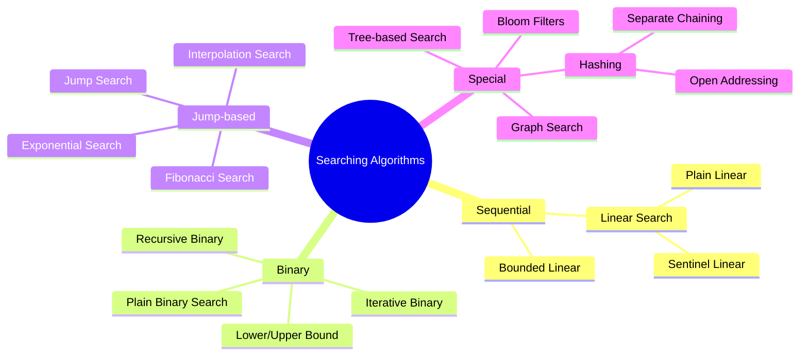

# Searching Algorithms

[Back to Course Content](README.md) | [Previous: Sorting Algorithms](sorting.md) | [Next: Complexity Analysis →](complexity-analysis.md)

> Reference: This content is based on Searching.pdf and Advanced-searching.pdf

## What are Searching Algorithms?

Searching algorithms are methods designed to retrieve information stored within a data structure. They are fundamental to computer science and form the backbone of many applications, from databases to web search engines.

### Formal Definition

A searching algorithm can be formally defined as a procedure that:
- Takes a collection of elements C and a target element T as input
- Returns the position of T in C if it exists, or indicates T is not present in C

Mathematically, given a collection C = {c₁, c₂, ..., cₙ} and a target T, a search function f(C, T) returns:
- i where C[i] = T, if T exists in C
- A sentinel value (often -1 or null) indicating T is not in C

### Classification of Searching Algorithms

Searching algorithms can be classified based on several criteria:

1. **By Search Space Strategy**:
   - **Sequential**: Examine elements one by one (Linear Search)
   - **Interval-based**: Divide search space into intervals (Binary Search)
   - **Hashing-based**: Use direct mapping functions (Hash Tables)
   - **Tree/Graph-based**: Search in hierarchical or network structures (BST Search)

2. **By Data Structure Requirements**:
   - **Ordered**: Require sorted data (Binary Search, Interpolation Search)
   - **Unordered**: Work with unsorted data (Linear Search, Hashing)

3. **By Complexity**:
   - **Basic**: Simple implementation with straightforward approach
   - **Advanced**: Optimized for specific scenarios or constraints



### Theoretical Considerations

1. **Time Complexity**: 
   - Measured in terms of comparisons or steps required to find an element
   - Typically expressed as function of collection size (n)
   - Different for worst, average, and best cases

2. **Space Complexity**:
   - Additional memory required beyond the input data
   - Critical for memory-constrained environments

3. **Optimality**:
   - An algorithm is optimal if it performs the minimum number of operations required
   - For comparison-based searching of sorted arrays, binary search is optimal with Ω(log n) comparisons

## Basic Searching Algorithms

### 1. Linear Search

Linear search (also called sequential search) is the simplest searching algorithm that sequentially checks each element in the collection until the target element is found or the whole collection has been searched.

#### Mathematical Analysis

- **Time Complexity**:
  - Best Case: O(1) when the target is at the first position
  - Average Case: O(n/2) ≈ O(n) assuming uniform distribution
  - Worst Case: O(n) when the target is at the last position or not present

- **Space Complexity**:
  - O(1) auxiliary space (in-place searching)

- **Expected Number of Comparisons**:
  - For successful search with equal probability: (n+1)/2 comparisons
  - For unsuccessful search: n comparisons

#### Implementation

```java
public class LinearSearch {
    /**
     * Basic linear search implementation
     * @param arr The array to search in
     * @param target The element to search for
     * @return Index of target if found, -1 otherwise
     */
    public int linearSearch(int[] arr, int target) {
        if (arr == null || arr.length == 0) {
            return -1; // Handle edge cases
        }
        
        for (int i = 0; i < arr.length; i++) {
            // Single comparison per iteration
            if (arr[i] == target) {
                return i; // Target found, return its index
            }
        }
        return -1; // Target not found
    }

    /**
     * Optimized version with sentinel to reduce bound checking
     * This eliminates the need to check array bounds in each iteration
     * @param arr The array to search in
     * @param target The element to search for
     * @return Index of target if found, -1 otherwise
     */
    public int sentinelSearch(int[] arr, int target) {
        if (arr == null || arr.length == 0) {
            return -1; // Handle edge cases
        }
        
        int n = arr.length;
        // Save the last element
        int last = arr[n - 1];
        
        // Place the target as sentinel at the end
        arr[n - 1] = target;

        int i = 0;
        // No bound checking in the loop condition
        while (arr[i] != target) {
            i++;
        }

        // Restore the original last element
        arr[n - 1] = last;
        
        // Check if we found the target or reached the sentinel
        if (i < n - 1 || last == target) {
            return i;
        }
        return -1; // Target not found
    }
    
    /**
     * Optimized version for sorted arrays that can terminate early
     * @param arr The sorted array to search in
     * @param target The element to search for
     * @return Index of target if found, -1 otherwise
     */
    public int linearSearchSorted(int[] arr, int target) {
        if (arr == null || arr.length == 0) {
            return -1; // Handle edge cases
        }
        
        for (int i = 0; i < arr.length; i++) {
            if (arr[i] == target) {
                return i; // Target found, return its index
            }
            if (arr[i] > target) {
                return -1; // Early termination, target would have been here
            }
        }
        return -1; // Target not found
    }
}
```

#### Visualization

For example, searching for element 7 in [5, 1, 9, 2, 7, 8, 3]:

1. Compare 5 with 7: Not equal, continue
2. Compare 1 with 7: Not equal, continue
3. Compare 9 with 7: Not equal, continue
4. Compare 2 with 7: Not equal, continue
5. Compare 7 with 7: Equal, return index 4

#### Optimization Techniques

1. **Sentinel Linear Search**: 
   - Places the target at the end of the array to eliminate bound checking in the loop
   - Reduces the number of comparisons in each iteration
   - Improves cache efficiency

2. **Ordered Linear Search**:
   - For sorted arrays, can terminate early if an element greater than the target is encountered
   - Improves average case for unsuccessful searches

3. **Two-Way Linear Search**:
   - Search from both ends simultaneously
   - Can improve average case to n/4 comparisons

```java
public int twoWayLinearSearch(int[] arr, int target) {
    int left = 0;
    int right = arr.length - 1;
    
    while (left <= right) {
        // Check left side
        if (arr[left] == target) {
            return left;
        }
        // Check right side
        if (arr[right] == target) {
            return right;
        }
        left++;
        right--;
    }
    return -1; // Not found
}
```

4. **Block Search (or Chunked Search)**:
   - Divide array into blocks and search block by block
   - Combine with other techniques for block-level searching

#### Applications

- **Unsorted Data**: When the data is not sorted and creating a more complex data structure is not justified
- **Small Datasets**: Efficient for small arrays where the overhead of more complex algorithms isn't worthwhile
- **One-time Searches**: When the search is performed infrequently
- **Searching in Linked Lists**: Where random access is not available
- **Hardware Implementations**: Easy to implement in hardware due to simplicity

#### Advantages and Disadvantages

**Advantages**:
- Simple to implement and understand
- No preprocessing required
- Works on unsorted data
- Efficient for small datasets
- Memory efficient (in-place)

**Disadvantages**:
- O(n) time complexity is inefficient for large datasets
- No advantage is taken if data is already sorted (without modification)
- Not scalable for frequently searched large datasets

### 2. Binary Search

Binary search is an efficient algorithm that finds the position of a target value within a sorted array. It works by repeatedly dividing the search interval in half.

#### Mathematical Analysis

- **Time Complexity**:
  - Best Case: O(1) when the target is at the middle
  - Average and Worst Case: O(log n) where n is the size of the array

- **Space Complexity**:
  - Iterative: O(1) auxiliary space
  - Recursive: O(log n) due to the call stack

- **Number of Comparisons**:
  - Worst case: ⌊log₂(n)⌋ + 1 comparisons
  - This is optimal for comparison-based search on sorted arrays

- **Recurrence Relation**:
  - T(n) = T(n/2) + O(1)
  - Solving using the Master Theorem: T(n) = O(log n)

#### Implementation

```java
public class BinarySearch {
    /**
     * Iterative implementation of binary search
     * @param arr The sorted array to search in
     * @param target The element to search for
     * @return Index of target if found, -1 otherwise
     */
    public int binarySearch(int[] arr, int target) {
        if (arr == null || arr.length == 0) {
            return -1; // Handle edge cases
        }
        
        int left = 0;
        int right = arr.length - 1;

        while (left <= right) {
            // Calculate middle index, avoiding integer overflow
            int mid = left + (right - left) / 2;

            // Check if target is present at mid
            if (arr[mid] == target) {
                return mid;
            }

            // If target is greater, ignore left half
            if (arr[mid] < target) {
                left = mid + 1;
            } 
            // If target is smaller, ignore right half
            else {
                right = mid - 1;
            }
        }
        
        return -1; // Element not found
    }

    /**
     * Recursive implementation of binary search
     * @param arr The sorted array to search in
     * @param target The element to search for
     * @return Index of target if found, -1 otherwise
     */
    public int recursiveBinarySearch(int[] arr, int target) {
        if (arr == null || arr.length == 0) {
            return -1; // Handle edge cases
        }
        return recursiveBinarySearch(arr, target, 0, arr.length - 1);
    }

    private int recursiveBinarySearch(int[] arr, int target, int left, int right) {
        // Base case: element not found
        if (left > right) {
            return -1;
        }

        // Calculate middle index
        int mid = left + (right - left) / 2;

        // If element is present at the middle
        if (arr[mid] == target) {
            return mid;
        }

        // If element is smaller than mid, search in the left subarray
        if (arr[mid] > target) {
            return recursiveBinarySearch(arr, target, left, mid - 1);
        }

        // Else search in the right subarray
        return recursiveBinarySearch(arr, target, mid + 1, right);
    }
    
    /**
     * Binary search variant to find the first occurrence of the target value
     * @param arr The sorted array to search in
     * @param target The element to search for
     * @return Index of first occurrence of target if found, -1 otherwise
     */
    public int findFirstOccurrence(int[] arr, int target) {
        if (arr == null || arr.length == 0) {
            return -1; // Handle edge cases
        }
        
        int left = 0;
        int right = arr.length - 1;
        int result = -1;
        
        while (left <= right) {
            int mid = left + (right - left) / 2;
            
            if (arr[mid] == target) {
                result = mid; // Save this occurrence
                right = mid - 1; // Continue searching in the left side
            } else if (arr[mid] > target) {
                right = mid - 1;
            } else {
                left = mid + 1;
            }
        }
        
        return result;
    }
    
    /**
     * Binary search variant to find the last occurrence of the target value
     * @param arr The sorted array to search in
     * @param target The element to search for
     * @return Index of last occurrence of target if found, -1 otherwise
     */
    public int findLastOccurrence(int[] arr, int target) {
        if (arr == null || arr.length == 0) {
            return -1; // Handle edge cases
        }
        
        int left = 0;
        int right = arr.length - 1;
        int result = -1;
        
        while (left <= right) {
            int mid = left + (right - left) / 2;
            
            if (arr[mid] == target) {
                result = mid; // Save this occurrence
                left = mid + 1; // Continue searching in the right side
            } else if (arr[mid] > target) {
                right = mid - 1;
            } else {
                left = mid + 1;
            }
        }
        
        return result;
    }
}
```

#### Visualization

For example, searching for element 23 in [2, 5, 8, 12, 16, 23, 38, 56, 72, 91]:

1. Initial search space: [2, 5, 8, 12, 16, 23, 38, 56, 72, 91]
   - left = 0, right = 9
   - mid = 4, arr[mid] = 16
   - 16 < 23, so search in right half

2. New search space: [23, 38, 56, 72, 91]
   - left = 5, right = 9
   - mid = 7, arr[mid] = 56
   - 56 > 23, so search in left half

3. New search space: [23, 38]
   - left = 5, right = 6
   - mid = 5, arr[mid] = 23
   - 23 = 23, target found at index 5

#### Proof of Correctness

Binary search maintains the invariant that if the target exists, it must be in the range [left, right]. At each step:

1. If arr[mid] = target, we've found the element.
2. If arr[mid] < target, the target cannot be in [left, mid] due to sorting, so we search [mid+1, right].
3. If arr[mid] > target, the target cannot be in [mid, right] due to sorting, so we search [left, mid-1].

This ensures that the algorithm either finds the target or correctly determines it's not present.

#### Optimization Techniques

1. **Interpolation for Middle Calculation**:
   - Instead of mid = left + (right - left) / 2
   - Use position = left + ((target - arr[left]) * (right - left)) / (arr[right] - arr[left])
   - Improves performance for uniformly distributed data

2. **Ternary Search**:
   - Divide the range into three parts instead of two
   - Compare with elements at 1/3 and 2/3 of the range
   - Reduces worst-case comparisons, but typically not more efficient due to more comparisons per iteration

3. **Galloping Search (Doubling Binary Search)**:
   - Start with a small range and double it until the target is within range
   - Then perform binary search on that range
   - Useful when the target is likely to be near the beginning

4. **Bounded Binary Search**:
   - For frequently searched arrays, precompute bounds for ranges of values
   - Narrows the initial search space

#### Special Binary Search Variants

1. **Lower Bound (First Not Less)**:
   - Find the first element that is greater than or equal to the target

```java
public int lowerBound(int[] arr, int target) {
    int left = 0;
    int right = arr.length;
    
    while (left < right) {
        int mid = left + (right - left) / 2;
        if (arr[mid] < target) {
            left = mid + 1;
        } else {
            right = mid;
        }
    }
    
    return left;
}
```

2. **Upper Bound (First Greater)**:
   - Find the first element that is strictly greater than the target

```java
public int upperBound(int[] arr, int target) {
    int left = 0;
    int right = arr.length;
    
    while (left < right) {
        int mid = left + (right - left) / 2;
        if (arr[mid] <= target) {
            left = mid + 1;
        } else {
            right = mid;
        }
    }
    
    return left;
}
```

3. **Nearest Element**:
   - Find the element closest to the target

```java
public int findNearest(int[] arr, int target) {
    if (arr.length == 0) return -1;
    if (arr.length == 1) return 0;
    
    int left = 0;
    int right = arr.length - 1;
    
    while (left <= right) {
        int mid = left + (right - left) / 2;
        
        if (arr[mid] == target) {
            return mid; // Exact match
        }
        
        if (arr[mid] < target) {
            left = mid + 1;
        } else {
            right = mid - 1;
        }
    }
    
    // At this point, left > right
    // We need to find the closest element
    if (right < 0) return 0;
    if (left >= arr.length) return arr.length - 1;
    
    if (Math.abs(arr[left] - target) < Math.abs(arr[right] - target)) {
        return left;
    }
    return right;
}
```

#### Applications

- **Database Indexing**: Binary search trees are used for efficient database querying
- **Debugging**: Binary search debugging (bisection) to find defects in versions
- **Machine Learning**: Decision trees for classification, closest neighbor search
- **Computer Graphics**: Intersection detection, ray tracing
- **IP Routing**: IP lookup in routing tables
- **Text Processing**: Dictionary lookup, search suggestions

#### Advantages and Disadvantages

**Advantages**:
- Efficient O(log n) search time
- Memory efficient (iterative implementation uses O(1) space)
- Predictable performance regardless of target location
- Well-suited for large sorted datasets

**Disadvantages**:
- Requires sorted data
- Not suitable for data structures with slow random access (like linked lists)
- Performance degrades with frequent insertions/deletions due to resorting
- Not cache-efficient for very large arrays due to memory jumps

## Advanced Searching Algorithms

Advanced searching algorithms build upon the fundamentals of basic search techniques, offering improved efficiency for specific scenarios or data distributions. These algorithms often make additional assumptions about the data to achieve better performance.

### 1. Interpolation Search

Interpolation search is an improved variant of binary search that works efficiently on uniformly distributed sorted arrays. Instead of always dividing the search space in half, it estimates the likely position of the target value.

#### Mathematical Analysis

- **Time Complexity**:
  - Best Case: O(1) when target is found on first attempt
  - Average Case: O(log log n) for uniformly distributed data
  - Worst Case: O(n) for highly skewed distributions

- **Space Complexity**:
  - O(1) auxiliary space

- **Position Estimation Formula**:
  ```
  pos = left + ((target - arr[left]) * (right - left)) / (arr[right] - arr[left])
  ```

- **Proof of Average-Case Complexity**:
  - For uniformly distributed data, each step reduces the search space to approximately √n
  - This gives the recurrence relation: T(n) = T(√n) + O(1)
  - Solving this: T(n) = O(log log n)

#### Implementation

```java
public class InterpolationSearch {
    /**
     * Implementation of interpolation search
     * @param arr The sorted array to search in
     * @param target The element to search for
     * @return Index of target if found, -1 otherwise
     */
    public int interpolationSearch(int[] arr, int target) {
        // Handle edge cases
        if (arr == null || arr.length == 0) {
            return -1;
        }
        
        int left = 0;
        int right = arr.length - 1;

        // Continue searching while value is within the search space and target is 
        // between the leftmost and rightmost elements
        while (left <= right && target >= arr[left] && target <= arr[right]) {
            // Early success check for endpoints (avoids division by zero)
            if (left == right) {
                if (arr[left] == target) {
                    return left;
                }
                return -1;
            }
            
            // Prevent division by zero
            if (arr[left] == arr[right]) {
                // Linear search if all elements are the same
                for (int i = left; i <= right; i++) {
                    if (arr[i] == target) {
                        return i;
                    }
                }
                return -1;
            }

            // Calculate position using interpolation formula
            int pos = left + ((target - arr[left]) * (right - left)) / 
                     (arr[right] - arr[left]);

            // If target is found
            if (arr[pos] == target) {
                return pos;
            }

            // If target is smaller, search in left half
            if (arr[pos] > target) {
                right = pos - 1;
            } 
            // If target is larger, search in right half
            else {
                left = pos + 1;
            }
        }
        
        return -1; // Element not found
    }
    
    /**
     * Variant with safeguards against non-uniform distributions
     * @param arr The sorted array to search in
     * @param target The element to search for
     * @return Index of target if found, -1 otherwise
     */
    public int robustInterpolationSearch(int[] arr, int target) {
        if (arr == null || arr.length == 0) {
            return -1;
        }
        
        int left = 0;
        int right = arr.length - 1;
        int iterations = 0;
        int maxIterations = 2 * (int)Math.log(arr.length) + 1; // Fall back to binary search performance
        
        while (left <= right && target >= arr[left] && target <= arr[right]) {
            if (iterations++ > maxIterations) {
                // Fall back to binary search if taking too long
                // (indicating non-uniform distribution)
                return binarySearch(arr, target, left, right);
            }
            
            // Same interpolation logic as before
            if (arr[left] == arr[right]) {
                // Linear search if all elements are the same
                for (int i = left; i <= right; i++) {
                    if (arr[i] == target) {
                        return i;
                    }
                }
                return -1;
            }
            
            int pos = left + ((target - arr[left]) * (right - left)) / 
                    (arr[right] - arr[left]);
            
            // Ensure pos is within bounds
            pos = Math.max(left, Math.min(pos, right));
            
            if (arr[pos] == target) {
                return pos;
            }
            
            if (arr[pos] > target) {
                right = pos - 1;
            } else {
                left = pos + 1;
            }
        }
        
        return -1;
    }
    
    // Binary search fallback
    private int binarySearch(int[] arr, int target, int left, int right) {
        while (left <= right) {
            int mid = left + (right - left) / 2;
            if (arr[mid] == target) {
                return mid;
            }
            if (arr[mid] < target) {
                left = mid + 1;
            } else {
                right = mid - 1;
            }
        }
        return -1;
    }
}
```

#### Visualization

For example, searching for element 85 in [10, 20, 30, 40, 50, 60, 70, 80, 90, 100]:

1. Initial interpolation: 
   - left = 0, right = 9
   - arr[left] = 10, arr[right] = 100
   - target = 85
   - pos = 0 + ((85 - 10) * (9 - 0)) / (100 - 10) = 0 + (75 * 9) / 90 = 7.5 ≈ 7
   - arr[7] = 80 < 85, so search in right half

2. New search space: [90, 100]
   - left = 8, right = 9
   - arr[left] = 90, arr[right] = 100
   - pos = 8 + ((85 - 90) * (9 - 8)) / (100 - 90) = 8 - 0.5 = 7.5 ≈ 8
   - But 85 ≠ 90, and 85 < 90, so target is not in the array

#### Optimization Techniques

1. **Hybrid with Binary Search**:
   - Start with interpolation search for a few iterations
   - Switch to binary search if progress is slow (indicating non-uniform distribution)

2. **Adaptive Position Calculation**:
   - Adjust the position calculation based on the distribution characteristics
   - Use exponential weighted moving average of past estimation errors

3. **Handling Duplicates**:
   - Add specialized logic for finding the first or last occurrence
   - Similar to binary search variants for duplicates

#### Applications

- **Sorted Arrays with Uniform Distribution**: Database systems, numerical applications
- **Page Indexes**: For locating entries in sorted books or documents
- **Dictionary Search**: When words are relatively uniformly distributed
- **Numerical Algorithms**: When searching through evenly distributed numerical values

#### Advantages and Disadvantages

**Advantages**:
- Better than binary search for uniformly distributed data
- Can achieve O(log log n) average-case time complexity
- No additional memory requirements

**Disadvantages**:
- Worst-case time complexity is O(n)
- Performance degrades with skewed distributions
- More complex implementation with division operations
- Potential for arithmetic overflow with large arrays

### 2. Jump Search

Jump search is a searching algorithm that works on sorted arrays by jumping ahead by fixed steps.

#### Mathematical Analysis

- **Time Complexity**:
  - Best Case: O(1) when the target is at the first position
  - Average and Worst Case: O(√n) with optimal jump size of √n
  
- **Space Complexity**:
  - O(1) auxiliary space

- **Optimal Jump Size**:
  - The optimal jump size is √n
  - Proof: Let m be the jump size
    - Number of jumps: ⌈n/m⌉ in the worst case
    - Maximum linear search steps: m
    - Total comparisons: ⌈n/m⌉ + m - 1
    - This is minimized when m = √n, giving O(√n) time complexity

#### Implementation

```java
public class JumpSearch {
    /**
     * Implementation of jump search
     * @param arr The sorted array to search in
     * @param target The element to search for
     * @return Index of target if found, -1 otherwise
     */
    public int jumpSearch(int[] arr, int target) {
        if (arr == null || arr.length == 0) {
            return -1; // Handle edge cases
        }
        
        int n = arr.length;
        
        // Finding the optimal block size to jump
        int step = (int) Math.floor(Math.sqrt(n));
        
        // Finding the block where element is present (if exists)
        int prev = 0;
        while (arr[Math.min(step, n) - 1] < target) {
            prev = step;
            step += (int) Math.floor(Math.sqrt(n));
            if (prev >= n) {
                return -1; // Element not found
            }
        }

        // Performing linear search in the identified block
        while (arr[prev] < target) {
            prev++;
            if (prev == Math.min(step, n)) {
                return -1; // Element not found
            }
        }

        // Check if element is found
        if (arr[prev] == target) {
            return prev;
        }
        
        return -1; // Element not found
    }
    
    /**
     * Variant with customizable jump size
     * @param arr The sorted array to search in
     * @param target The element to search for
     * @param jumpSize Custom jump size (if <= 0, optimal √n will be used)
     * @return Index of target if found, -1 otherwise
     */
    public int jumpSearchCustom(int[] arr, int target, int jumpSize) {
        if (arr == null || arr.length == 0) {
            return -1; // Handle edge cases
        }
        
        int n = arr.length;
        
        // Use optimal jump size if not specified
        if (jumpSize <= 0) {
            jumpSize = (int) Math.floor(Math.sqrt(n));
        }
        
        int prev = 0;
        int step = jumpSize;
        
        // Jump until beyond target or end of array
        while (prev < n && arr[prev] < target) {
            if (prev + jumpSize < n && arr[prev + jumpSize - 1] < target) {
                // If next block is completely less than target, jump whole block
                prev += jumpSize;
            } else {
                // Found potential block containing target
                break;
            }
        }
        
        // Linear search from prev
        while (prev < n && arr[prev] < target) {
            prev++;
        }
        
        // Check if element is found
        if (prev < n && arr[prev] == target) {
            return prev;
        }
        
        return -1; // Element not found
    }
}
```

#### Visualization

For example, searching for element 33 in [0, 1, 1, 2, 3, 5, 8, 13, 21, 34, 55, 89]:

1. Array length n = 12, optimal step size = √12 ≈ 3
   - Jump to index 3: arr[3] = 2 < 33, continue jumping
   - Jump to index 6: arr[6] = 8 < 33, continue jumping
   - Jump to index 9: arr[9] = 34 > 33, found potential block

2. Linear search from index 7 to 9:
   - arr[7] = 13 < 33, continue
   - arr[8] = 21 < 33, continue
   - arr[9] = 34 > 33, target not found

#### Optimization Techniques

1. **Adaptive Jump Size**:
   - Adjust jump size based on array size or data distribution
   - Larger jumps for larger arrays, smaller jumps for smaller ranges

2. **Early Termination**:
   - Check if we've gone beyond the array bounds
   - Check if we've gone beyond the target value

3. **Binary Search in the Block**:
   - Use binary search instead of linear search in the identified block
   - Improves performance for large blocks

```java
public int optimizedJumpSearch(int[] arr, int target) {
    if (arr == null || arr.length == 0) {
        return -1;
    }
    
    int n = arr.length;
    int step = (int) Math.floor(Math.sqrt(n));
    
    int prev = 0;
    while (prev < n && arr[Math.min(prev + step - 1, n - 1)] < target) {
        prev += step;
        if (prev >= n) {
            return -1;
        }
    }
    
    // Use binary search in the block
    return binarySearch(arr, target, Math.max(0, prev - step), Math.min(prev, n - 1));
}

private int binarySearch(int[] arr, int target, int left, int right) {
    while (left <= right) {
        int mid = left + (right - left) / 2;
        if (arr[mid] == target) {
            return mid;
        }
        if (arr[mid] < target) {
            left = mid + 1;
        } else {
            right = mid - 1;
        }
    }
    return -1;
}
```

#### Applications

- **Medium-sized Sorted Arrays**: Better than linear search, simpler than binary search
- **Memory-Constrained Systems**: When minimizing comparisons without complex logic is important
- **Searching on Disk/External Memory**: Where access to widely separated elements is expensive
- **Embedded Systems**: Where implementation simplicity is valued

#### Advantages and Disadvantages

**Advantages**:
- Better performance than linear search (O(√n) vs. O(n))
- Simpler implementation than binary search
- Good cache locality in the linear search phase
- Works well on disk or external memory where jumping is relatively fast within a block

**Disadvantages**:
- Slower than binary search for large arrays
- Requires sorted data
- Fixed jump size may not be optimal for all data distributions
- Not adaptive to the specific input

### 3. Exponential Search

Exponential search (also called doubling search or galloping search) combines galloping to find a range containing the target, followed by binary search within that range. It's particularly useful for unbounded or infinite arrays.

#### Mathematical Analysis

- **Time Complexity**:
  - Best Case: O(1) when target is at the first position
  - Average and Worst Case: O(log i) where i is the position of target element
  - Usually expressed as O(log n) in bounded arrays

- **Space Complexity**:
  - O(1) auxiliary space for iterative implementation
  - O(log n) auxiliary space for recursive binary search

- **Number of Comparisons**:
  - At most ⌊log₂i⌋ + 2⌊log₂(i)⌋ + 1 comparisons
    * ⌊log₂i⌋ + 1 to find the range
    * ⌊log₂(i)⌋ for binary search in that range

#### Implementation

```java
public class ExponentialSearch {
    /**
     * Implementation of exponential search
     * @param arr The sorted array to search in
     * @param target The element to search for
     * @return Index of target if found, -1 otherwise
     */
    public int exponentialSearch(int[] arr, int target) {
        if (arr == null || arr.length == 0) {
            return -1; // Handle edge cases
        }
        
        int n = arr.length;
        
        // If target is the first element
        if (arr[0] == target) {
            return 0;
        }

        // Find range for binary search by repeated doubling
        int i = 1;
        while (i < n && arr[i] <= target) {
            i = i * 2;
        }

        // Call binary search for the found range
        return binarySearch(arr, target, i / 2, Math.min(i, n - 1));
    }

    /**
     * Implementation for unbounded arrays (arrays with unknown size)
     * @param arr The sorted array to search in (potentially unbounded)
     * @param target The element to search for
     * @return Index of target if found, -1 otherwise
     */
    public int unboundedExponentialSearch(UnboundedArray arr, int target) {
        int i = 0;
        try {
            // Base case: first element
            if (arr.get(0) == target) {
                return 0;
            }
            
            // Find range for binary search
            i = 1;
            while (true) {
                try {
                    if (arr.get(i) > target) {
                        break; // Found range
                    }
                } catch (IndexOutOfBoundsException e) {
                    break; // Reached end of array
                }
                i *= 2;
            }
            
            // Binary search in the range
            return unboundedBinarySearch(arr, target, i/2, i);
            
        } catch (IndexOutOfBoundsException e) {
            return -1; // Empty array or other issue
        }
    }
    
    // Binary search helper for bounded arrays
    private int binarySearch(int[] arr, int target, int left, int right) {
        while (left <= right) {
            int mid = left + (right - left) / 2;
            
            if (arr[mid] == target) {
                return mid;
            }
            
            if (arr[mid] < target) {
                left = mid + 1;
            } else {
                right = mid - 1;
            }
        }
        return -1;
    }
    
    // Binary search helper for unbounded arrays
    private int unboundedBinarySearch(UnboundedArray arr, int target, int left, int right) {
        while (left <= right) {
            int mid = left + (right - left) / 2;
            
            try {
                int midValue = arr.get(mid);
                
                if (midValue == target) {
                    return mid;
                }
                
                if (midValue < target) {
                    left = mid + 1;
                } else {
                    right = mid - 1;
                }
            } catch (IndexOutOfBoundsException e) {
                // Adjust right boundary if beyond array length
                right = mid - 1;
            }
        }
        return -1;
    }
    
    // Interface for unbounded arrays
    interface UnboundedArray {
        int get(int index) throws IndexOutOfBoundsException;
    }
}
```

#### Visualization

For example, searching for element 25 in [2, 4, 8, 16, 24, 32, 64, 128, 256]:

1. Check if arr[0] = 2 equals 25: No, continue
2. Start with i = 1:
   - i = 1: arr[1] = 4 < 25, double i
   - i = 2: arr[2] = 8 < 25, double i
   - i = 4: arr[4] = 24 < 25, double i
   - i = 8: arr[8] = 256 > 25, found range [4, 8]

3. Binary search in the range [4, 8]:
   - mid = 6: arr[6] = 64 > 25, search left half [4, 5]
   - mid = 4: arr[4] = 24 < 25, search right half [5, 5]
   - mid = 5: arr[5] = 32 > 25, not found

#### Optimization Techniques

1. **Adaptive Starting Point**:
   - Start with a predicted position if distribution is known
   - Use last successful search position as starting hint

2. **Variable Growth Factor**:
   - Use growth factors other than 2 depending on the expected distribution
   - Larger factors for widely spread data, smaller for dense data

3. **Early Termination**:
   - Check if bounds are exceeded after each doubling
   - Special case for small arrays

#### Applications

- **Unbounded Search**: Searching in potentially infinite lists or streams
- **Online Algorithms**: When elements become available incrementally
- **Searching in Dynamic Arrays**: Where the size grows but is unknown
- **Log Files**: Searching recent entries in ever-growing logs
- **Spatially Ordered Data**: Geographic search with unbounded coordinates

#### Advantages and Disadvantages

**Advantages**:
- Works efficiently for unbounded or infinite arrays
- Better than binary search when target is near the beginning
- O(log i) complexity where i is target position
- Combines benefits of linear and binary search

**Disadvantages**:
- More complex implementation than binary search
- Requires sorted data
- May perform unnecessary comparisons when target is near the end
- Not directly applicable to all data structures

### 4. Fibonacci Search

Fibonacci search is a comparison-based searching technique that uses Fibonacci numbers to divide the array into unequal parts.

#### Mathematical Analysis

- **Time Complexity**:
  - Best Case: O(1) when target is at the optimal position
  - Average and Worst Case: O(log n)

- **Space Complexity**:
  - O(1) auxiliary space

- **Comparison with Binary Search**:
  - Divides array in ratio approximately equal to the golden ratio (1:1.618)
  - Uses addition instead of division to calculate the mid-point
  - Typically requires more Fibonacci calculations but can perform fewer array comparisons

- **Number of Comparisons**:
  - At most O(log n) comparisons, similar to binary search
  - But division points are placed differently

#### Implementation

```java
public class FibonacciSearch {
    /**
     * Implementation of Fibonacci search
     * @param arr The sorted array to search in
     * @param target The element to search for
     * @return Index of target if found, -1 otherwise
     */
    public int fibonacciSearch(int[] arr, int target) {
        if (arr == null || arr.length == 0) {
            return -1; // Handle edge cases
        }
        
        int n = arr.length;
        
        // Initialize Fibonacci numbers for the search
        int fibM2 = 0; // (m-2)'th Fibonacci number
        int fibM1 = 1; // (m-1)'th Fibonacci number
        int fibM = fibM1 + fibM2; // m'th Fibonacci number

        // Find the smallest Fibonacci number greater than or equal to n
        while (fibM < n) {
            fibM2 = fibM1;
            fibM1 = fibM;
            fibM = fibM1 + fibM2;
        }

        // Marks the eliminated range from front
        int offset = -1;

        // While there are elements to be inspected
        // Note that we compare arr[fibM2] with target
        // When fibM becomes 1, fibM2 becomes 0
        while (fibM > 1) {
            // Check if fibM2 is a valid index
            int i = Math.min(offset + fibM2, n - 1);

            // If target is greater than the value at index fibM2,
            // cut the subarray from offset to i
            if (arr[i] < target) {
                fibM = fibM1;
                fibM1 = fibM2;
                fibM2 = fibM - fibM1;
                offset = i;
            }
            // If target is less than the value at index fibM2,
            // cut the subarray after i+1
            else if (arr[i] > target) {
                fibM = fibM2;
                fibM1 = fibM1 - fibM2;
                fibM2 = fibM - fibM1;
            }
            // If target is found
            else {
                return i;
            }
        }

        // Check for the last element
        if (fibM1 == 1 && arr[offset + 1] == target) {
            return offset + 1;
        }

        // Element not found
        return -1;
    }
    
    /**
     * Implementation with pre-computed Fibonacci numbers
     * @param arr The sorted array to search in
     * @param target The element to search for
     * @return Index of target if found, -1 otherwise
     */
    public int optimizedFibonacciSearch(int[] arr, int target) {
        if (arr == null || arr.length == 0) {
            return -1;
        }
        
        int n = arr.length;
        
        // Pre-compute Fibonacci numbers up to a reasonable limit
        int[] fib = new int[30]; // Can handle arrays up to size 2^30
        fib[0] = 0;
        fib[1] = 1;
        int k = 1;
        
        while (fib[k] < n) {
            k++;
            fib[k] = fib[k-1] + fib[k-2];
        }
        
        int offset = -1;
        for (int i = k; i > 0; i--) {
            int index = Math.min(offset + fib[i-1], n - 1);
            
            if (arr[index] < target) {
                offset = index;
            } else if (arr[index] > target) {
                // Do nothing, continue with smaller Fibonacci numbers
            } else {
                return index; // Found
            }
        }
        
        return -1; // Not found
    }
}
```

#### Visualization

For example, searching for element 19 in [1, 4, 7, 10, 14, 19, 22, 25, 29]:

1. Fibonacci numbers: 0, 1, 1, 2, 3, 5, 8, 13, 21, ...
   - For n = 9, the smallest Fibonacci number >= n is 13
   - fibM = 13, fibM1 = 8, fibM2 = 5

2. First iteration:
   - i = offset + fibM2 = -1 + 5 = 4, arr[4] = 14
   - 14 < 19, so search in the right half
   - offset = 4, fibM = 8, fibM1 = 5, fibM2 = 3

3. Second iteration:
   - i = offset + fibM2 = 4 + 3 = 7, arr[7] = 25
   - 25 > 19, so search in the left half
   - fibM = 3, fibM1 = 2, fibM2 = 1

4. Third iteration:
   - i = offset + fibM2 = 4 + 1 = 5, arr[5] = 19
   - 19 = 19, found at index 5

#### Optimization Techniques

1. **Pre-computing Fibonacci Numbers**:
   - Calculate Fibonacci numbers in advance
   - Avoids repeated calculations during search

2. **Using Golden Ratio Approximation**:
   - Approximate Fibonacci numbers using the golden ratio
   - Reduces overhead of calculating exact Fibonacci values

3. **Hybrid with Binary Search**:
   - Use Fibonacci search for initial divisions
   - Switch to binary search for smaller ranges

#### Applications

- **Searching on Magnetic Tapes**: Where backward movement is more costly
- **Systems with Different Access Costs**: Where access costs vary by direction
- **Memory-Constrained Systems**: Where multiplication/division is expensive
- **Applications Requiring Simple Arithmetic**: Only addition used in calculations

#### Advantages and Disadvantages

**Advantages**:
- Divides the array in the golden ratio (more efficient in some cases)
- Uses only addition and subtraction (no division or multiplication)
- Good for systems where division is costly or unavailable
- Works well for external storage where backward movement is expensive

**Disadvantages**:
- More complex implementation than binary search
- Requires pre-computing or calculating Fibonacci numbers
- Not significantly faster than binary search in most cases
- Not widely used in practice

## Special Searching Techniques

These specialized searching techniques utilize advanced data structures or probabilistic methods to achieve efficient search operations beyond traditional comparison-based algorithms.

### 1. Hashing

Hashing is a technique that uses a hash function to map data of arbitrary size to fixed-size values, typically for efficient lookup and retrieval operations. Hash-based data structures provide average case O(1) time complexity for search operations.

#### Mathematical Foundations

- **Hash Function**: A function h that maps a key k to an integer in a predefined range [0, m-1]
  - h: U → {0, 1, 2, ..., m-1} where U is the universe of possible keys
  - Ideally, the distribution of h(k) should be uniform across the range

- **Collision Resolution**:
  - **Separate Chaining**: Store colliding elements in a linked list
  - **Open Addressing**: Find alternative positions in the table
    - Linear Probing: h(k, i) = (h(k) + i) mod m
    - Quadratic Probing: h(k, i) = (h(k) + c₁i + c₂i²) mod m
    - Double Hashing: h(k, i) = (h₁(k) + i·h₂(k)) mod m

- **Load Factor (α)**:
  - Ratio of the number of stored elements (n) to the size of the hash table (m)
  - α = n/m
  - Performance degrades as α increases

- **Expected Search Time**:
  - Successful search: O(1 + α) for separate chaining
  - Unsuccessful search: O(1 + α) for separate chaining
  - Open addressing: O(1/(1-α)) as α approaches 1

#### Implementation

```java
public class HashTable<K, V> {
    // Entry class for storing key-value pairs
    private static class Entry<K, V> {
        K key;
        V value;
        Entry<K, V> next;

        Entry(K key, V value) {
            this.key = key;
            this.value = value;
            this.next = null;
        }
    }

    private Entry<K, V>[] table;
    private int size;
    private int capacity;
    private final double loadFactorThreshold;

    /**
     * Constructor with default initial capacity and load factor
     */
    @SuppressWarnings("unchecked")
    public HashTable() {
        this(16, 0.75);
    }

    /**
     * Constructor with specified initial capacity and load factor
     * @param initialCapacity Initial size of the hash table
     * @param loadFactorThreshold Threshold to trigger resize
     */
    @SuppressWarnings("unchecked")
    public HashTable(int initialCapacity, double loadFactorThreshold) {
        this.capacity = initialCapacity;
        this.loadFactorThreshold = loadFactorThreshold;
        this.size = 0;
        this.table = (Entry<K, V>[]) new Entry[capacity];
    }

    /**
     * Compute the hash code for a key
     * @param key The key to hash
     * @return The hash value
     */
    private int hash(K key) {
        return key == null ? 0 : Math.abs(key.hashCode() % capacity);
    }

    /**
     * Insert a key-value pair into the hash table
     * @param key The key
     * @param value The value
     */
    public void put(K key, V value) {
        if (key == null) {
            throw new IllegalArgumentException("Key cannot be null");
        }
        
        // Check if resize is needed
        if ((double) size / capacity >= loadFactorThreshold) {
            resize(2 * capacity);
        }
        
        int index = hash(key);
        Entry<K, V> entry = table[index];
        
        // Check if key already exists
        while (entry != null) {
            if (entry.key.equals(key)) {
                entry.value = value; // Update existing value
                return;
            }
            entry = entry.next;
        }
        
        // Create a new entry
        Entry<K, V> newEntry = new Entry<>(key, value);
        newEntry.next = table[index];
        table[index] = newEntry;
        size++;
    }

    /**
     * Retrieve a value from the hash table
     * @param key The key to look up
     * @return The value, or null if key is not found
     */
    public V get(K key) {
        if (key == null) {
            return null;
        }
        
        int index = hash(key);
        Entry<K, V> entry = table[index];
        
        while (entry != null) {
            if (entry.key.equals(key)) {
                return entry.value; // Found the key
            }
            entry = entry.next;
        }
        
        return null; // Key not found
    }

    /**
     * Remove a key-value pair from the hash table
     * @param key The key to remove
     * @return The value that was removed, or null if key not found
     */
    public V remove(K key) {
        if (key == null) {
            return null;
        }
        
        int index = hash(key);
        Entry<K, V> entry = table[index];
        Entry<K, V> prev = null;
        
        while (entry != null) {
            if (entry.key.equals(key)) {
                if (prev == null) {
                    table[index] = entry.next;
                } else {
                    prev.next = entry.next;
                }
                size--;
                return entry.value;
            }
            prev = entry;
            entry = entry.next;
        }
        
        return null; // Key not found
    }

    /**
     * Check if the hash table contains a key
     * @param key The key to check for
     * @return true if the key exists, false otherwise
     */
    public boolean containsKey(K key) {
        if (key == null) {
            return false;
        }
        
        int index = hash(key);
        Entry<K, V> entry = table[index];
        
        while (entry != null) {
            if (entry.key.equals(key)) {
                return true;
            }
            entry = entry.next;
        }
        
        return false;
    }

    /**
     * Resize the hash table to the new capacity
     * @param newCapacity The new capacity for the hash table
     */
    @SuppressWarnings("unchecked")
    private void resize(int newCapacity) {
        Entry<K, V>[] oldTable = table;
        table = (Entry<K, V>[]) new Entry[newCapacity];
        capacity = newCapacity;
        size = 0;
        
        // Rehash all existing entries
        for (Entry<K, V> head : oldTable) {
            while (head != null) {
                put(head.key, head.value);
                head = head.next;
            }
        }
    }

    /**
     * Get the current size of the hash table
     * @return The number of key-value pairs
     */
    public int size() {
        return size;
    }

    /**
     * Check if the hash table is empty
     * @return true if empty, false otherwise
     */
    public boolean isEmpty() {
        return size == 0;
    }
}
```

#### Open Addressing Implementation

```java
public class OpenAddressingHashTable<K, V> {
    // Entry class for storing key-value pairs
    private static class Entry<K, V> {
        K key;
        V value;
        boolean isDeleted;

        Entry(K key, V value) {
            this.key = key;
            this.value = value;
            this.isDeleted = false;
        }
    }

    private Entry<K, V>[] table;
    private int size;
    private int capacity;
    private final double loadFactorThreshold;
    private final Entry<K, V> DELETED = new Entry<>(null, null); // Tombstone

    /**
     * Constructor with default initial capacity and load factor
     */
    @SuppressWarnings("unchecked")
    public OpenAddressingHashTable() {
        this(16, 0.6); // Lower load factor for open addressing
    }

    /**
     * Constructor with specified initial capacity and load factor
     * @param initialCapacity Initial size of the hash table
     * @param loadFactorThreshold Threshold to trigger resize
     */
    @SuppressWarnings("unchecked")
    public OpenAddressingHashTable(int initialCapacity, double loadFactorThreshold) {
        this.capacity = initialCapacity;
        this.loadFactorThreshold = loadFactorThreshold;
        this.size = 0;
        this.table = (Entry<K, V>[]) new Entry[capacity];
        this.DELETED.isDeleted = true;
    }

    /**
     * Primary hash function
     */
    private int hash1(K key) {
        return key == null ? 0 : Math.abs(key.hashCode() % capacity);
    }
    
    /**
     * Secondary hash function for double hashing
     */
    private int hash2(K key) {
        return key == null ? 0 : Math.abs((key.hashCode() / capacity) % capacity) + 1;
    }

    /**
     * Find the next probe position using double hashing
     */
    private int getNextProbe(K key, int i) {
        // Double hashing formula: h(k, i) = (h1(k) + i * h2(k)) % m
        return (hash1(key) + i * hash2(key)) % capacity;
    }

    /**
     * Insert a key-value pair into the hash table
     * @param key The key
     * @param value The value
     */
    public void put(K key, V value) {
        if (key == null) {
            throw new IllegalArgumentException("Key cannot be null");
        }
        
        // Check if resize is needed
        if ((double) size / capacity >= loadFactorThreshold) {
            resize(2 * capacity);
        }
        
        int i = 0;
        int tombstoneIndex = -1;
        
        while (i < capacity) {
            int index = getNextProbe(key, i);
            
            if (table[index] == null) {
                // Insert at tombstone position if found earlier
                if (tombstoneIndex != -1) {
                    index = tombstoneIndex;
                }
                
                table[index] = new Entry<>(key, value);
                size++;
                return;
            } else if (table[index].isDeleted) {
                // Remember first tombstone position
                if (tombstoneIndex == -1) {
                    tombstoneIndex = index;
                }
            } else if (table[index].key.equals(key)) {
                // Update existing value
                table[index].value = value;
                return;
            }
            
            i++;
        }
        
        // If we get here, the table is full or we couldn't find a slot
        resize(2 * capacity);
        put(key, value);
    }

    /**
     * Retrieve a value from the hash table
     * @param key The key to look up
     * @return The value, or null if key is not found
     */
    public V get(K key) {
        if (key == null) {
            return null;
        }
        
        int i = 0;
        
        while (i < capacity) {
            int index = getNextProbe(key, i);
            
            if (table[index] == null) {
                return null; // Empty slot means key not found
            } else if (!table[index].isDeleted && table[index].key.equals(key)) {
                return table[index].value; // Found the key
            }
            
            i++;
        }
        
        return null; // Examined all positions, key not found
    }

    /**
     * Remove a key-value pair from the hash table
     * @param key The key to remove
     * @return The value that was removed, or null if key not found
     */
    public V remove(K key) {
        if (key == null) {
            return null;
        }
        
        int i = 0;
        
        while (i < capacity) {
            int index = getNextProbe(key, i);
            
            if (table[index] == null) {
                return null; // Empty slot means key not found
            } else if (!table[index].isDeleted && table[index].key.equals(key)) {
                V value = table[index].value;
                table[index].isDeleted = true; // Mark as deleted (tombstone)
                size--;
                return value;
            }
            
            i++;
        }
        
        return null; // Examined all positions, key not found
    }

    /**
     * Resize the hash table to the new capacity
     * @param newCapacity The new capacity for the hash table
     */
    @SuppressWarnings("unchecked")
    private void resize(int newCapacity) {
        Entry<K, V>[] oldTable = table;
        int oldCapacity = capacity;
        
        table = (Entry<K, V>[]) new Entry[newCapacity];
        capacity = newCapacity;
        size = 0;
        
        // Rehash all existing entries
        for (int i = 0; i < oldCapacity; i++) {
            if (oldTable[i] != null && !oldTable[i].isDeleted) {
                put(oldTable[i].key, oldTable[i].value);
            }
        }
    }
}
```

#### Perfect Hashing

Perfect hashing is a technique that guarantees O(1) worst-case lookup time for static sets (sets that don't change).

1. **Two-Level Hashing**:
   - Use universal hash functions
   - First level uses a primary hash table
   - Each bucket in the primary table has a secondary hash table sized quadratically to the number of elements in the bucket

2. **Cuckoo Hashing**:
   - Uses two hash functions h₁ and h₂
   - Each key is stored in either position h₁(key) or h₂(key)
   - If collision occurs, the existing key is moved to its alternate position
   - Process continues until all keys are placed or a cycle is detected

#### Applications

- **Symbol Tables**: Compilers and interpreters
- **Database Indexing**: Hash-based indexes for fast lookups
- **Caching**: Hash tables used in memory caches (LRU, LFU)
- **Spell Checkers**: Quickly verify if a word exists in a dictionary
- **Network Routing**: IP lookup in routers
- **Cryptography**: Hash-based message authentication codes (HMAC)
- **String Matching**: Rabin-Karp algorithm using hash values

#### Advantages and Disadvantages

**Advantages**:
- Average O(1) lookup, insertion, and deletion
- Flexible key types (anything that can be hashed)
- Space efficient for sparse data
- Excellent for in-memory dictionaries

**Disadvantages**:
- Worst-case performance is O(n) without careful design
- Collision resolution adds complexity
- No ordering of keys (unlike BSTs)
- Performance sensitive to hash function quality
- Requires rehashing when resizing

### 2. Bloom Filters

A Bloom filter is a space-efficient probabilistic data structure used to test whether an element is a member of a set. It may provide false positive matches, but never false negatives.

#### Mathematical Foundations

- **Structure**:
  - m-bit array, initially all set to 0
  - k independent hash functions

- **Operations**:
  - **Insertion**: Hash the element k times and set the corresponding bits to 1
  - **Lookup**: Hash the element k times and check if all corresponding bits are 1

- **False Positive Probability**:
  - p = (1 - e^(-kn/m))^k
  - Where n is the number of elements, m is the filter size, and k is the number of hash functions

- **Optimal Number of Hash Functions**:
  - k = (m/n) * ln(2)
  - Minimizes false positive probability

#### Implementation

```java
public class BloomFilter<T> {
    private BitSet bitset;
    private int size;
    private int numberOfHashFunctions;
    
    /**
     * Constructor with specified filter size and number of hash functions
     * @param bitSetSize Size of the bit array
     * @param numberOfHashFunctions Number of hash functions to use
     */
    public BloomFilter(int bitSetSize, int numberOfHashFunctions) {
        this.size = bitSetSize;
        this.numberOfHashFunctions = numberOfHashFunctions;
        this.bitset = new BitSet(size);
    }
    
    /**
     * Add an element to the Bloom filter
     * @param element The element to add
     */
    public void add(T element) {
        int[] hashes = createHashes(element, numberOfHashFunctions);
        
        for (int hash : hashes) {
            bitset.set(Math.abs(hash % size), true);
        }
    }
    
    /**
     * Check if an element might be in the Bloom filter
     * @param element The element to check
     * @return true if might be present, false if definitely not present
     */
    public boolean mightContain(T element) {
        int[] hashes = createHashes(element, numberOfHashFunctions);
        
        for (int hash : hashes) {
            if (!bitset.get(Math.abs(hash % size))) {
                return false; // Definitely not in the set
            }
        }
        
        return true; // Might be in the set
    }
    
    /**
     * Create hash values for an element
     * @param element The element to hash
     * @param numHashes Number of hash values to generate
     * @return Array of hash values
     */
    private int[] createHashes(T element, int numHashes) {
        int[] result = new int[numHashes];
        int hash1 = element.hashCode();
        int hash2 = hash1 >>> 16; // Use high bits too
        
        for (int i = 0; i < numHashes; i++) {
            // Use double hashing to generate k hash functions
            result[i] = hash1 + (i * hash2);
        }
        
        return result;
    }
    
    /**
     * Calculate the current false positive probability
     * @return The probability of a false positive
     */
    public double getFalsePositiveProbability() {
        // Calculate how many bits per element for the best k value
        return Math.pow(1 - Math.exp(-numberOfHashFunctions * (double) size / size), numberOfHashFunctions);
    }
    
    /**
     * Clear the Bloom filter
     */
    public void clear() {
        bitset.clear();
    }
    
    /**
     * Get the size of the bit set
     * @return The size in bits
     */
    public int getSize() {
        return size;
    }
    
    /**
     * Get the number of hash functions being used
     * @return The number of hash functions
     */
    public int getNumberOfHashFunctions() {
        return numberOfHashFunctions;
    }
}
```

#### Scalable Bloom Filter

Standard Bloom filters require knowing the number of elements in advance. Scalable Bloom filters overcome this limitation by adapting as more elements are added.

```java
public class ScalableBloomFilter<T> {
    private List<BloomFilter<T>> filters;
    private double falsePositiveRate;
    private double growthFactor;
    private int initialSize;
    private int expectedElementsPerFilter;
    
    /**
     * Constructor with specified parameters
     * @param initialSize Initial size of the first filter
     * @param expectedElements Expected number of elements in each filter
     * @param falsePositiveRate Desired false positive rate
     * @param growthFactor Growth factor for successive filters
     */
    public ScalableBloomFilter(int initialSize, int expectedElements, double falsePositiveRate, double growthFactor) {
        this.initialSize = initialSize;
        this.expectedElementsPerFilter = expectedElements;
        this.falsePositiveRate = falsePositiveRate;
        this.growthFactor = growthFactor;
        this.filters = new ArrayList<>();
        
        // Create the first filter
        addFilter();
    }
    
    /**
     * Add a new filter to the chain
     */
    private void addFilter() {
        int filterSize = initialSize;
        if (!filters.isEmpty()) {
            // Calculate new size based on growth factor
            filterSize = (int) (filters.get(filters.size() - 1).getSize() * growthFactor);
        }
        
        filters.add(new BloomFilter<>(filterSize, expectedElementsPerFilter));
    }
    
    /**
     * Add an element to the filter chain
     * @param element The element to add
     */
    public void add(T element) {
        if (needNewFilter()) {
            addFilter();
        }
        
        // Always add to the last filter
        filters.get(filters.size() - 1).add(element);
    }
    
    /**
     * Check if a new filter is needed
     * @return true if a new filter should be added
     */
    private boolean needNewFilter() {
        if (filters.isEmpty()) {
            return true;
        }
        
        // Check if the last filter's false positive rate exceeds our threshold
        return filters.get(filters.size() - 1).getFalsePositiveProbability() > falsePositiveRate;
    }
    
    /**
     * Check if an element might be in any filter
     * @param element The element to check
     * @return true if might be present, false if definitely not present
     */
    public boolean mightContain(T element) {
        for (BloomFilter<T> filter : filters) {
            if (filter.mightContain(element)) {
                return true;
            }
        }
        return false;
    }
}
```

#### Counting Bloom Filter

Standard Bloom filters don't support element removal. Counting Bloom filters allow both insertion and deletion.

```java
public class CountingBloomFilter<T> {
    private int[] counters;
    private int counterSize;
    private int numberOfHashFunctions;
    
    /**
     * Constructor
     * @param counterSize Size of the counter array
     * @param numberOfHashFunctions Number of hash functions to use
     */
    public CountingBloomFilter(int counterSize, int numberOfHashFunctions) {
        this.counterSize = counterSize;
        this.numberOfHashFunctions = numberOfHashFunctions;
        this.counters = new int[counterSize];
    }
    
    /**
     * Add an element to the filter
     * @param element The element to add
     */
    public void add(T element) {
        int[] hashes = createHashes(element, numberOfHashFunctions);
        
        for (int hash : hashes) {
            counters[Math.abs(hash % counterSize)]++;
        }
    }
    
    /**
     * Remove an element from the filter
     * @param element The element to remove
     */
    public void remove(T element) {
        if (!mightContain(element)) {
            return; // Element not in the filter
        }
        
        int[] hashes = createHashes(element, numberOfHashFunctions);
        
        for (int hash : hashes) {
            int index = Math.abs(hash % counterSize);
            if (counters[index] > 0) {
                counters[index]--;
            }
        }
    }
    
    /**
     * Check if an element might be in the filter
     * @param element The element to check
     * @return true if might be present, false if definitely not present
     */
    public boolean mightContain(T element) {
        int[] hashes = createHashes(element, numberOfHashFunctions);
        
        for (int hash : hashes) {
            if (counters[Math.abs(hash % counterSize)] == 0) {
                return false; // Definitely not in the set
            }
        }
        
        return true; // Might be in the set
    }
    
    /**
     * Create hash values for an element
     * @param element The element to hash
     * @param numHashes Number of hash values to generate
     * @return Array of hash values
     */
    private int[] createHashes(T element, int numHashes) {
        // Similar to standard Bloom filter
        int[] result = new int[numHashes];
        int hash1 = element.hashCode();
        int hash2 = hash1 >>> 16;
        
        for (int i = 0; i < numHashes; i++) {
            result[i] = hash1 + (i * hash2);
        }
        
        return result;
    }
}
```

#### Applications

- **Web Caching**: Efficiently determine if a URL has been cached
- **Network Routers**: Packet filtering and forwarding
- **Database Systems**: Query optimization and index design
- **Spell Checkers**: Quick verification of words
- **Cryptocurrency**: Bitcoin's Bloom filter for efficient SPV clients
- **Bioinformatics**: DNA sequence comparison and analysis
- **Distributed Systems**: Data synchronization between nodes

#### Advantages and Disadvantages

**Advantages**:
- Space-efficient (much more compact than hash tables)
- Fast insertions and lookups O(k) where k is the number of hash functions
- No false negatives (if it says "no", the element is definitely not in the set)
- Supports set union operations

**Disadvantages**:
- False positives are possible (can say "yes" to elements not in the set)
- Cannot store additional data with elements
- Cannot enumerate contents
- Standard implementation doesn't support deletion

## Performance Comparison

| Algorithm | Time Complexity (Average) | Time Complexity (Worst) | Space Complexity | Sorted Data Required | Notes |
|-----------|---------------------------|-------------------------|------------------|----------------------|--------|
| Linear Search | O(n) | O(n) | O(1) | No | Works on any data structure |
| Binary Search | O(log n) | O(log n) | O(1) | Yes | Optimal for comparison-based searching |
| Interpolation Search | O(log log n) | O(n) | O(1) | Yes | Best for uniformly distributed data |
| Jump Search | O(√n) | O(√n) | O(1) | Yes | Good compromise between linear and binary search |
| Exponential Search | O(log i) | O(log n) | O(1) | Yes | Good for unbounded arrays |
| Fibonacci Search | O(log n) | O(log n) | O(1) | Yes | Useful when division is expensive |
| Hashing (Average) | O(1) | O(n) | O(n) | No | Depends on hash function quality |
| Bloom Filter | O(k) | O(k) | O(m) | No | Probabilistic, allows false positives |

### Search Algorithm Selection Guide

| Data Characteristic | Recommended Algorithms |
|---------------------|------------------------|
| Small dataset (n < 100) | Linear search for unsorted, Binary search for sorted |
| Medium dataset | Jump search, Binary search if sorted, Hash table if frequent lookups |
| Large sorted dataset | Binary search, Interpolation search (if uniform) |
| Frequently changing data | Hash table, Trie (for strings) |
| Static data with limited memory | Binary search (sorted array), Bloom filter (membership only) |
| String searching | Trie, Suffix tree, Hash table |
| Unbounded or infinite sequences | Exponential search |
| When "not found" must be certain | Any deterministic algorithm (not Bloom filter) |
| When space is critical | Binary search or Jump search |

### Memory Usage Analysis

| Algorithm | Primary Memory Use | Scalability with Data Size |
|-----------|-------------------|----------------------------|
| Linear Search | Constant (input data only) | Excellent |
| Binary Search | Constant (input data only) | Excellent |
| Jump Search | Constant (input data only) | Excellent |
| Hash Table | Linear (table size proportional to data) | Good with appropriate resizing |
| Bloom Filter | Sub-linear (much smaller than data size) | Excellent |
| Trie | Proportional to alphabet size and data | Poor for long strings with large alphabet |

### Real-World Performance Considerations

1. **Cache Performance**:
   - Binary search has poor cache locality due to jumping
   - Linear and Jump search have better cache performance
   - Hash tables can have poor cache performance due to scattered access

2. **Memory Hierarchy**:
   - For very large datasets spanning multiple memory levels (RAM, SSD, HDD), specialized algorithms like B-Trees perform better

3. **Concurrent Access**:
   - Hash tables require careful design for thread safety
   - Read-only search algorithms (Binary search on immutable arrays) scale well with multiple threads

4. **Hardware Considerations**:
   - SIMD instructions can accelerate linear search
   - Branch prediction penalties affect binary search
   - Modern CPUs may favor algorithms with predictable memory access patterns

## Best Practices

When implementing and using searching algorithms, consider the following best practices:

### Algorithm Selection

1. **Know Your Data**:
   - Size of the dataset
   - Whether the data is sorted or can be sorted
   - Distribution characteristics (uniform, skewed, etc.)
   - Frequency of operations (searches vs. insertions/deletions)
   - Memory constraints

2. **Tiered Search Approaches**:
   - Use different algorithms for different tiers of your system
   - Example: Use bloom filters as a first pass, followed by hash tables or binary search
   - Combine algorithms for optimal performance (e.g., Jump Search + Binary Search)

3. **Dynamic Algorithm Selection**:
   - Switch algorithms based on data size or characteristics
   - Example: Use linear search for small arrays (< 16-32 elements) and binary search for larger ones
   - Measure and adapt based on runtime performance

### Implementation Considerations

1. **Boundary Conditions**:
   - Always handle edge cases (empty collections, single-element collections)
   - Test boundary conditions (first element, last element, element not found)
   - Consider duplicate elements and how they should be handled

2. **Iteration vs. Recursion**:
   - Prefer iterative implementations for performance-critical code
   - Recursion can lead to stack overflow for large inputs
   - Use tail recursion when applicable and if your language optimizes for it

3. **Early Termination**:
   - Implement short-circuit logic when possible
   - Example: Return immediately when the target is found
   - Use range checks to avoid unnecessary comparisons

4. **Comparison Functions**:
   - Use custom comparators for complex objects
   - Consider case sensitivity, locale settings for string comparisons
   - Optimize comparison operations if they are expensive

### Performance Optimization

1. **Memory Access Patterns**:
   - Optimize for cache locality
   - Prefer contiguous memory structures (arrays) over linked structures
   - Consider memory-aligned data structures

2. **Prefetching**:
   - Use processor hints to prefetch memory
   - Example: For binary search, prefetch the next likely memory location

3. **SIMD Instructions**:
   - Use vectorized operations for linear search on modern CPUs
   - Example: Process 4 or 8 comparisons simultaneously with AVX instructions

4. **JIT Optimization**:
   - For interpreted languages, help the JIT optimize by using consistent types
   - Avoid polymorphic code in hot search paths

### Real-World Examples

**E-commerce Product Search**:
```java
// Tiered approach for product search
public List<Product> searchProducts(String query, Catalog catalog) {
    // Tier 1: Check cache first (O(1) hash lookup)
    if (searchCache.containsKey(query)) {
        return searchCache.get(query);
    }
    
    // Tier 2: Use bloom filter to quickly check if any results likely exist
    if (!productBloomFilter.mightContain(query)) {
        return Collections.emptyList(); // Definitely no results
    }
    
    // Tier 3: Search in inverted index (faster than full scan)
    List<Product> results = invertedIndex.search(query);
    
    // Tier 4: If needed, apply more expensive ranking algorithms
    if (!results.isEmpty()) {
        results = rankingEngine.rankResults(results, query);
    }
    
    // Cache the results for future use
    searchCache.put(query, results);
    return results;
}
```

**Database Index Lookup**:
```java
// B-Tree index search in database systems
public Record findRecord(BTreeIndex index, Key searchKey) {
    // Start at root node
    BTreeNode current = index.getRootNode();
    
    // Traverse the tree
    while (!current.isLeaf()) {
        // Binary search within the node's keys
        int pos = binarySearchInNode(current, searchKey);
        current = current.getChildAt(pos);
    }
    
    // Binary search in leaf node
    int recordPos = binarySearchInNode(current, searchKey);
    if (recordPos >= 0) {
        return current.getRecordAt(recordPos);
    }
    
    return null; // Record not found
}
```

**Network Packet Routing**:
```java
// IP lookup using specialized search structures
public NextHop lookupIPRoute(IPAddress destinationIP) {
    // First try exact match using hash table (for host routes)
    NextHop exactRoute = hostRoutingTable.get(destinationIP);
    if (exactRoute != null) {
        return exactRoute;
    }
    
    // Then use prefix tree (trie) for longest prefix match
    return prefixTrie.longestPrefixMatch(destinationIP);
}
```

## Common Pitfalls

1. **Algorithm Misapplication**:
   - Using binary search on unsorted data
   - Expecting O(1) performance from hash tables with poor hash functions
   - Using computationally expensive interpolation search for small datasets

2. **Off-by-One Errors**:
   - Incorrect loop termination conditions
   - Incorrect range calculations (especially in binary search)
   - Index calculation errors in jump search or interpolation search

3. **Overflow/Underflow**:
   - Integer overflow in midpoint calculation: `mid = (low + high) / 2` (use `mid = low + (high - low) / 2` instead)
   - Underflow in exponential search when calculating ranges

4. **Infinite Loops**:
   - Failure to advance pointers or indices in search algorithms
   - Incorrect termination conditions

5. **Hash Collisions**:
   - Inadequate collision resolution strategies
   - High load factors leading to performance degradation

6. **Concurrent Modification**:
   - Searching in a data structure while it's being modified
   - Race conditions in multi-threaded environments

## Advanced Exercises

### Exercise 1: Hybrid Search Algorithm

Implement a hybrid search algorithm that dynamically chooses between linear search and binary search based on the array size and other factors.

```java
public class HybridSearch {
    // Linear search threshold - arrays smaller than this use linear search
    private static final int LINEAR_THRESHOLD = 32;
    
    public static <T extends Comparable<T>> int search(T[] array, T target) {
        if (array.length < LINEAR_THRESHOLD) {
            return linearSearch(array, target);
        } else {
            return binarySearch(array, target, 0, array.length - 1);
        }
    }
    
    private static <T extends Comparable<T>> int linearSearch(T[] array, T target) {
        for (int i = 0; i < array.length; i++) {
            if (array[i].compareTo(target) == 0) {
                return i;
            }
        }
        return -1;
    }
    
    private static <T extends Comparable<T>> int binarySearch(T[] array, T target, int low, int high) {
        while (low <= high) {
            int mid = low + (high - low) / 2;
            int comparison = array[mid].compareTo(target);
            
            if (comparison == 0) {
                return mid;
            } else if (comparison < 0) {
                low = mid + 1;
            } else {
                high = mid - 1;
            }
        }
        return -1;
    }
}
```

### Exercise 2: Fuzzy Search Implementation

Implement a fuzzy search algorithm that finds elements within a certain "distance" of the target (e.g., Levenshtein distance for strings).

```java
public class FuzzySearch {
    /**
     * Find all strings within maxDistance edits of the target
     */
    public static List<String> search(String[] dictionary, String target, int maxDistance) {
        List<String> results = new ArrayList<>();
        
        for (String word : dictionary) {
            int distance = levenshteinDistance(word, target);
            if (distance <= maxDistance) {
                results.add(word);
            }
        }
        
        return results;
    }
    
    /**
     * Calculate Levenshtein (edit) distance between two strings
     */
    private static int levenshteinDistance(String s1, String s2) {
        int[][] dp = new int[s1.length() + 1][s2.length() + 1];
        
        for (int i = 0; i <= s1.length(); i++) {
            dp[i][0] = i;
        }
        
        for (int j = 0; j <= s2.length(); j++) {
            dp[0][j] = j;
        }
        
        for (int i = 1; i <= s1.length(); i++) {
            for (int j = 1; j <= s2.length(); j++) {
                int cost = (s1.charAt(i - 1) == s2.charAt(j - 1)) ? 0 : 1;
                dp[i][j] = Math.min(
                    Math.min(dp[i - 1][j] + 1, dp[i][j - 1] + 1),
                    dp[i - 1][j - 1] + cost
                );
            }
        }
        
        return dp[s1.length()][s2.length()];
    }
}
```

### Exercise 3: Trie-Based Autocomplete

Implement an autocomplete system using a Trie data structure for efficient prefix matching.

```java
class TrieNode {
    private Map<Character, TrieNode> children;
    private boolean isEndOfWord;
    private String word;
    
    public TrieNode() {
        children = new HashMap<>();
        isEndOfWord = false;
    }
    
    public Map<Character, TrieNode> getChildren() {
        return children;
    }
    
    public boolean isEndOfWord() {
        return isEndOfWord;
    }
    
    public void setEndOfWord(boolean endOfWord) {
        isEndOfWord = endOfWord;
    }
    
    public String getWord() {
        return word;
    }
    
    public void setWord(String word) {
        this.word = word;
    }
}

public class Autocomplete {
    private TrieNode root;
    
    public Autocomplete() {
        root = new TrieNode();
    }
    
    /**
     * Insert a word into the trie
     */
    public void insert(String word) {
        TrieNode current = root;
        
        for (char c : word.toCharArray()) {
            current = current.getChildren().computeIfAbsent(c, ch -> new TrieNode());
        }
        
        current.setEndOfWord(true);
        current.setWord(word);
    }
    
    /**
     * Find all words in the trie that start with the given prefix
     */
    public List<String> findWordsWithPrefix(String prefix) {
        List<String> result = new ArrayList<>();
        TrieNode current = root;
        
        // Navigate to the last node of the prefix
        for (char c : prefix.toCharArray()) {
            TrieNode node = current.getChildren().get(c);
            if (node == null) {
                return result; // Prefix not found
            }
            current = node;
        }
        
        // Collect all words starting from the last prefix node
        collectWords(current, result);
        return result;
    }
    
    /**
     * Recursively collect all words starting from the given node
     */
    private void collectWords(TrieNode node, List<String> result) {
        if (node.isEndOfWord()) {
            result.add(node.getWord());
        }
        
        for (TrieNode child : node.getChildren().values()) {
            collectWords(child, result);
        }
    }
}
```

### Exercise 4: Multi-Dimensional Search

Implement a k-d tree for efficient nearest neighbor search in multi-dimensional space.

```java
class Point {
    double[] coords;
    
    public Point(double... coordinates) {
        this.coords = coordinates;
    }
    
    public double distanceTo(Point other) {
        double sum = 0;
        for (int i = 0; i < coords.length; i++) {
            double diff = coords[i] - other.coords[i];
            sum += diff * diff;
        }
        return Math.sqrt(sum);
    }
}

class KdNode {
    Point point;
    KdNode left;
    KdNode right;
    int axis;
    
    public KdNode(Point point, int axis) {
        this.point = point;
        this.axis = axis;
        this.left = null;
        this.right = null;
    }
}

public class KdTree {
    private KdNode root;
    private int dimensions;
    
    public KdTree(int dimensions) {
        this.dimensions = dimensions;
    }
    
    /**
     * Insert a point into the k-d tree
     */
    public void insert(Point point) {
        root = insertRec(root, point, 0);
    }
    
    private KdNode insertRec(KdNode node, Point point, int depth) {
        if (node == null) {
            return new KdNode(point, depth % dimensions);
        }
        
        int axis = depth % dimensions;
        
        if (point.coords[axis] < node.point.coords[axis]) {
            node.left = insertRec(node.left, point, depth + 1);
        } else {
            node.right = insertRec(node.right, point, depth + 1);
        }
        
        return node;
    }
    
    /**
     * Find the nearest neighbor to the target point
     */
    public Point findNearestNeighbor(Point target) {
        if (root == null) return null;
        
        BestPoint best = new BestPoint();
        best.bestDistance = Double.POSITIVE_INFINITY;
        
        findNearestRec(root, target, 0, best);
        return best.best;
    }
    
    private static class BestPoint {
        Point best;
        double bestDistance;
    }
    
    private void findNearestRec(KdNode node, Point target, int depth, BestPoint best) {
        if (node == null) return;
        
        double distance = node.point.distanceTo(target);
        if (distance < best.bestDistance) {
            best.bestDistance = distance;
            best.best = node.point;
        }
        
        int axis = depth % dimensions;
        double axisDistance = target.coords[axis] - node.point.coords[axis];
        
        // Search the half that contains the target
        KdNode nearerNode = axisDistance <= 0 ? node.left : node.right;
        KdNode furtherNode = axisDistance <= 0 ? node.right : node.left;
        
        findNearestRec(nearerNode, target, depth + 1, best);
        
        // Only search the other side if it could contain a closer point
        if (Math.abs(axisDistance) < best.bestDistance) {
            findNearestRec(furtherNode, target, depth + 1, best);
        }
    }
}
```

### Exercise 5: Implement a Custom Indexing System

Design and implement a custom indexing system for a specific type of data (e.g., spatial data, text documents, time series data).

```java
/**
 * Simple inverted index for text search
 */
public class InvertedIndex {
    private Map<String, List<Document>> index;
    
    public InvertedIndex() {
        index = new HashMap<>();
    }
    
    /**
     * Add a document to the index
     */
    public void indexDocument(Document doc) {
        // Extract and normalize terms from the document
        String[] terms = tokenize(doc.getContent());
        
        // Add each term to the inverted index
        for (String term : terms) {
            index.computeIfAbsent(term, k -> new ArrayList<>()).add(doc);
        }
    }
    
    /**
     * Search for documents containing the query terms
     */
    public List<Document> search(String query) {
        String[] queryTerms = tokenize(query);
        
        // For the first term, get the initial result set
        if (queryTerms.length == 0) {
            return Collections.emptyList();
        }
        
        // Start with results from the first term
        Set<Document> results = new HashSet<>(index.getOrDefault(queryTerms[0], Collections.emptyList()));
        
        // Intersect with results from other terms
        for (int i = 1; i < queryTerms.length; i++) {
            List<Document> termDocs = index.getOrDefault(queryTerms[i], Collections.emptyList());
            results.retainAll(new HashSet<>(termDocs));
        }
        
        return new ArrayList<>(results);
    }
    
    /**
     * Split text into normalized terms
     */
    private String[] tokenize(String text) {
        // Convert to lowercase and split on non-alphanumeric characters
        return text.toLowerCase()
                  .replaceAll("[^a-zA-Z0-9]", " ")
                  .split("\\s+");
    }
    
    /**
     * Document class to store in the index
     */
    public static class Document {
        private String id;
        private String content;
        
        public Document(String id, String content) {
            this.id = id;
            this.content = content;
        }
        
        public String getId() {
            return id;
        }
        
        public String getContent() {
            return content;
        }
    }
}
```

## Conclusion

Searching is a fundamental operation in computer science with applications ranging from simple data retrieval to complex information systems. By understanding the characteristics, strengths, and limitations of various searching algorithms, you can make informed decisions about which algorithm to use in a given situation.

### Key Insights

1. **No One-Size-Fits-All Solution**: Different searching algorithms excel under different circumstances:
   - Linear search is simple and works on unsorted data but becomes inefficient for large datasets
   - Binary search is highly efficient for sorted data but requires random access capabilities
   - Hash-based searching provides average O(1) lookup but requires additional space and doesn't preserve order
   - Specialized algorithms like Interpolation Search can outperform binary search for uniformly distributed data

2. **Tradeoffs to Consider**:
   - Time vs. space complexity
   - Preprocessing costs vs. query performance
   - Average case vs. worst case guarantees
   - Implementation complexity vs. theoretical efficiency

3. **Data Structure Influence**:
   - The underlying data structure significantly impacts searching efficiency
   - Some data structures (BSTs, hash tables) are designed specifically to optimize search operations
   - The choice of data structure should align with the search patterns of your application

4. **Real-World Factors**:
   - Cache behavior and memory access patterns often dominate theoretical complexity in practice
   - Modern hardware features (vectorization, branch prediction) affect algorithm performance
   - Implementation details can significantly impact actual performance

### Future Directions

As data volumes continue to grow and new application domains emerge, searching algorithms continue to evolve:

1. **Quantum Search Algorithms**: Grover's algorithm promises quadratic speedup for unstructured search
2. **Machine Learning Enhanced Search**: Learning-based indices and approximate search methods
3. **Hardware-Specific Optimizations**: Algorithms tailored for GPUs, TPUs, and specialized processors
4. **Distributed and Parallel Search**: Algorithms designed for large-scale distributed systems

### Final Recommendations

1. **Analyze Your Requirements**: Understand your specific search patterns, data characteristics, and performance needs
2. **Benchmark Realistically**: Test with realistic data sizes and access patterns
3. **Consider Hybrid Approaches**: Combine different algorithms to leverage their strengths
4. **Revisit Assumptions**: Periodically reevaluate your algorithm choices as data and requirements evolve

By mastering the fundamental concepts and implementation techniques presented in this guide, you'll be well-equipped to select, implement, and optimize searching algorithms for your specific use cases.

## Exercises

### 1. Basic Exercises

1. **Linear Search Implementation**: Implement a linear search algorithm and analyze its time complexity.
2. **Binary Search Implementation**: Implement an iterative binary search algorithm and analyze its time complexity.
3. **Search Comparison**: Compare the performance of linear search and binary search for arrays of different sizes.

### 2. Intermediate Exercises

1. **Jump Search**: Implement the jump search algorithm for a sorted array.
2. **Interpolation Search**: Implement the interpolation search algorithm and test it on uniformly distributed data.
3. **Modified Binary Search**: Modify the binary search algorithm to find the first occurrence of an element in a sorted array with duplicates.
4. **Rotated Array Search**: Implement an algorithm to search for an element in a sorted array that has been rotated.

### 3. Advanced Exercises

1. **Hybrid Search Algorithm**: Implement a hybrid search algorithm that dynamically chooses between linear search and binary search based on the array size.

```java
public class HybridSearch {
    // Linear search threshold - arrays smaller than this use linear search
    private static final int LINEAR_THRESHOLD = 32;
    
    public static <T extends Comparable<T>> int search(T[] array, T target) {
        if (array.length < LINEAR_THRESHOLD) {
            return linearSearch(array, target);
        } else {
            return binarySearch(array, target, 0, array.length - 1);
        }
    }
    
    private static <T extends Comparable<T>> int linearSearch(T[] array, T target) {
        for (int i = 0; i < array.length; i++) {
            if (array[i].compareTo(target) == 0) {
                return i;
            }
        }
        return -1;
    }
    
    private static <T extends Comparable<T>> int binarySearch(T[] array, T target, int low, int high) {
        while (low <= high) {
            int mid = low + (high - low) / 2;
            int comparison = array[mid].compareTo(target);
            
            if (comparison == 0) {
                return mid;
            } else if (comparison < 0) {
                low = mid + 1;
            } else {
                high = mid - 1;
            }
        }
        return -1;
    }
}
```

2. **Fuzzy Search Implementation**: Implement a fuzzy search algorithm that finds elements within a certain "distance" of the target (e.g., Levenshtein distance for strings).

```java
public class FuzzySearch {
    /**
     * Find all strings within maxDistance edits of the target
     */
    public static List<String> search(String[] dictionary, String target, int maxDistance) {
        List<String> results = new ArrayList<>();
        
        for (String word : dictionary) {
            int distance = levenshteinDistance(word, target);
            if (distance <= maxDistance) {
                results.add(word);
            }
        }
        
        return results;
    }
    
    /**
     * Calculate Levenshtein (edit) distance between two strings
     */
    private static int levenshteinDistance(String s1, String s2) {
        int[][] dp = new int[s1.length() + 1][s2.length() + 1];
        
        for (int i = 0; i <= s1.length(); i++) {
            dp[i][0] = i;
        }
        
        for (int j = 0; j <= s2.length(); j++) {
            dp[0][j] = j;
        }
        
        for (int i = 1; i <= s1.length(); i++) {
            for (int j = 1; j <= s2.length(); j++) {
                int cost = (s1.charAt(i - 1) == s2.charAt(j - 1)) ? 0 : 1;
                dp[i][j] = Math.min(
                    Math.min(dp[i - 1][j] + 1, dp[i][j - 1] + 1),
                    dp[i - 1][j - 1] + cost
                );
            }
        }
        
        return dp[s1.length()][s2.length()];
    }
}
```

3. **Trie-Based Autocomplete**: Implement an autocomplete system using a Trie data structure for efficient prefix matching.

```java
class TrieNode {
    private Map<Character, TrieNode> children;
    private boolean isEndOfWord;
    private String word;
    
    public TrieNode() {
        children = new HashMap<>();
        isEndOfWord = false;
    }
    
    public Map<Character, TrieNode> getChildren() {
        return children;
    }
    
    public boolean isEndOfWord() {
        return isEndOfWord;
    }
    
    public void setEndOfWord(boolean endOfWord) {
        isEndOfWord = endOfWord;
    }
    
    public String getWord() {
        return word;
    }
    
    public void setWord(String word) {
        this.word = word;
    }
}

public class Autocomplete {
    private TrieNode root;
    
    public Autocomplete() {
        root = new TrieNode();
    }
    
    /**
     * Insert a word into the trie
     */
    public void insert(String word) {
        TrieNode current = root;
        
        for (char c : word.toCharArray()) {
            current = current.getChildren().computeIfAbsent(c, ch -> new TrieNode());
        }
        
        current.setEndOfWord(true);
        current.setWord(word);
    }
    
    /**
     * Find all words in the trie that start with the given prefix
     */
    public List<String> findWordsWithPrefix(String prefix) {
        List<String> result = new ArrayList<>();
        TrieNode current = root;
        
        // Navigate to the last node of the prefix
        for (char c : prefix.toCharArray()) {
            TrieNode node = current.getChildren().get(c);
            if (node == null) {
                return result; // Prefix not found
            }
            current = node;
        }
        
        // Collect all words starting from the last prefix node
        collectWords(current, result);
        return result;
    }
    
    /**
     * Recursively collect all words starting from the given node
     */
    private void collectWords(TrieNode node, List<String> result) {
        if (node.isEndOfWord()) {
            result.add(node.getWord());
        }
        
        for (TrieNode child : node.getChildren().values()) {
            collectWords(child, result);
        }
    }
}
```

4. **Multi-Dimensional Search**: Implement a k-d tree for efficient nearest neighbor search in multi-dimensional space.

5. **Custom Indexing System**: Design and implement a custom indexing system for a specific type of data (e.g., spatial data, text documents, time series data).

### 4. Challenge Problems

1. **Efficient String Search**: Implement the Boyer-Moore or KMP algorithm for efficient string matching.

2. **Range Search**: Implement a data structure (such as a segment tree or range tree) that supports efficient range queries.

3. **Probabilistic Data Structure**: Implement a Count-Min Sketch or Bloom Filter and demonstrate its use in a real-world application.

4. **Spatial Search**: Implement an R-tree or Quadtree for efficient spatial search operations.

5. **Inverted Index**: Build a simple search engine using an inverted index for a collection of text documents.