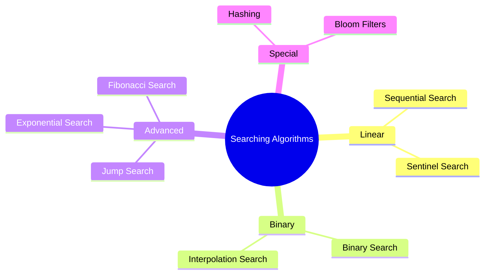

# Searching Algorithms

[Back to Course Content](README.md) | [Previous: Sorting Algorithms](sorting.md) | [Next: Complexity Analysis →](complexity-analysis.md)

> Reference: This content is based on Searching.pdf and Advanced-searching.pdf

## What are Searching Algorithms?

Searching algorithms are methods to find a specific element or value in a data structure. They are fundamental to computer science and have various applications in data retrieval.



## Basic Searching Algorithms

### 1. Linear Search

A simple searching algorithm that sequentially checks each element until a match is found.

```java
public class LinearSearch {
    public int linearSearch(int[] arr, int target) {
        for (int i = 0; i < arr.length; i++) {
            if (arr[i] == target) {
                return i;
            }
        }
        return -1; // Element not found
    }

    // Optimized version with sentinel
    public int sentinelSearch(int[] arr, int target) {
        int n = arr.length;
        int last = arr[n - 1];
        arr[n - 1] = target;

        int i = 0;
        while (arr[i] != target) {
            i++;
        }

        arr[n - 1] = last;
        if (i < n - 1 || last == target) {
            return i;
        }
        return -1; // Element not found
    }
}
```

### 2. Binary Search

An efficient searching algorithm that works on sorted arrays by repeatedly dividing the search interval in half.

```java
public class BinarySearch {
    // Iterative implementation
    public int binarySearch(int[] arr, int target) {
        int left = 0;
        int right = arr.length - 1;

        while (left <= right) {
            int mid = left + (right - left) / 2;

            if (arr[mid] == target) {
                return mid;
            }

            if (arr[mid] < target) {
                left = mid + 1;
            } else {
                right = mid - 1;
            }
        }
        return -1; // Element not found
    }

    // Recursive implementation
    public int recursiveBinarySearch(int[] arr, int target) {
        return recursiveBinarySearch(arr, target, 0, arr.length - 1);
    }

    private int recursiveBinarySearch(int[] arr, int target, int left, int right) {
        if (left > right) {
            return -1; // Element not found
        }

        int mid = left + (right - left) / 2;

        if (arr[mid] == target) {
            return mid;
        }

        if (arr[mid] < target) {
            return recursiveBinarySearch(arr, target, mid + 1, right);
        }

        return recursiveBinarySearch(arr, target, left, mid - 1);
    }
}
```

## Advanced Searching Algorithms

### 1. Interpolation Search

An improved version of binary search that uses interpolation to find the position of the target value.

```java
public class InterpolationSearch {
    public int interpolationSearch(int[] arr, int target) {
        int left = 0;
        int right = arr.length - 1;

        while (left <= right && target >= arr[left] && target <= arr[right]) {
            if (left == right) {
                if (arr[left] == target) {
                    return left;
                }
                return -1;
            }

            // Calculate position using interpolation
            int pos = left + ((right - left) * (target - arr[left])) / 
                     (arr[right] - arr[left]);

            if (arr[pos] == target) {
                return pos;
            }

            if (arr[pos] < target) {
                left = pos + 1;
            } else {
                right = pos - 1;
            }
        }
        return -1; // Element not found
    }
}
```

### 2. Jump Search

A searching algorithm that works on sorted arrays by jumping ahead by fixed steps.

```java
public class JumpSearch {
    public int jumpSearch(int[] arr, int target) {
        int n = arr.length;
        int step = (int) Math.floor(Math.sqrt(n));
        int prev = 0;

        // Finding the block where element is present
        while (arr[Math.min(step, n) - 1] < target) {
            prev = step;
            step += (int) Math.floor(Math.sqrt(n));
            if (prev >= n) {
                return -1; // Element not found
            }
        }

        // Linear search in the block
        while (arr[prev] < target) {
            prev++;
            if (prev == Math.min(step, n)) {
                return -1; // Element not found
            }
        }

        if (arr[prev] == target) {
            return prev;
        }
        return -1; // Element not found
    }
}
```

### 3. Exponential Search

A searching algorithm that works on unbounded or infinite arrays by finding a range and then performing binary search.

```java
public class ExponentialSearch {
    public int exponentialSearch(int[] arr, int target) {
        int n = arr.length;
        if (arr[0] == target) {
            return 0;
        }

        // Find range for binary search
        int i = 1;
        while (i < n && arr[i] <= target) {
            i = i * 2;
        }

        // Binary search in the found range
        return binarySearch(arr, target, i / 2, Math.min(i, n - 1));
    }

    private int binarySearch(int[] arr, int target, int left, int right) {
        while (left <= right) {
            int mid = left + (right - left) / 2;

            if (arr[mid] == target) {
                return mid;
            }

            if (arr[mid] < target) {
                left = mid + 1;
            } else {
                right = mid - 1;
            }
        }
        return -1; // Element not found
    }
}
```

### 4. Fibonacci Search

A searching algorithm that uses Fibonacci numbers to divide the array into unequal parts.

```java
public class FibonacciSearch {
    public int fibonacciSearch(int[] arr, int target) {
        int n = arr.length;
        int fibM2 = 0; // (m-2)'th Fibonacci number
        int fibM1 = 1; // (m-1)'th Fibonacci number
        int fibM = fibM1 + fibM2; // m'th Fibonacci number

        // Find the smallest Fibonacci number greater than or equal to n
        while (fibM < n) {
            fibM2 = fibM1;
            fibM1 = fibM;
            fibM = fibM1 + fibM2;
        }

        int offset = -1;

        while (fibM > 1) {
            int i = Math.min(offset + fibM2, n - 1);

            if (arr[i] < target) {
                fibM = fibM1;
                fibM1 = fibM2;
                fibM2 = fibM - fibM1;
                offset = i;
            } else if (arr[i] > target) {
                fibM = fibM2;
                fibM1 = fibM1 - fibM2;
                fibM2 = fibM - fibM1;
            } else {
                return i;
            }
        }

        if (fibM1 == 1 && arr[offset + 1] == target) {
            return offset + 1;
        }

        return -1; // Element not found
    }
}
```

## Special Searching Techniques

### 1. Hashing

A technique that uses a hash function to map data to a fixed-size array.

```java
public class HashTable {
    private static class Entry {
        int key;
        int value;
        Entry next;

        Entry(int key, int value) {
            this.key = key;
            this.value = value;
            this.next = null;
        }
    }

    private Entry[] table;
    private int size;

    public HashTable(int size) {
        this.size = size;
        table = new Entry[size];
    }

    private int hash(int key) {
        return key % size;
    }

    public void put(int key, int value) {
        int index = hash(key);
        Entry entry = new Entry(key, value);

        if (table[index] == null) {
            table[index] = entry;
        } else {
            Entry current = table[index];
            while (current.next != null) {
                if (current.key == key) {
                    current.value = value;
                    return;
                }
                current = current.next;
            }
            current.next = entry;
        }
    }

    public int get(int key) {
        int index = hash(key);
        Entry current = table[index];

        while (current != null) {
            if (current.key == key) {
                return current.value;
            }
            current = current.next;
        }
        return -1; // Key not found
    }
}
```

### 2. Bloom Filters

A probabilistic data structure used to test whether an element is a member of a set.

```java
public class BloomFilter {
    private BitSet bitSet;
    private int size;
    private int numHashFunctions;

    public BloomFilter(int size, int numHashFunctions) {
        this.size = size;
        this.numHashFunctions = numHashFunctions;
        this.bitSet = new BitSet(size);
    }

    public void add(String element) {
        for (int i = 0; i < numHashFunctions; i++) {
            int hash = Math.abs((element.hashCode() + i * 31) % size);
            bitSet.set(hash);
        }
    }

    public boolean contains(String element) {
        for (int i = 0; i < numHashFunctions; i++) {
            int hash = Math.abs((element.hashCode() + i * 31) % size);
            if (!bitSet.get(hash)) {
                return false;
            }
        }
        return true;
    }
}
```

## Performance Comparison

| Algorithm | Time Complexity | Space Complexity | Notes |
|-----------|----------------|------------------|--------|
| Linear Search | O(n) | O(1) | Works on unsorted data |
| Binary Search | O(log n) | O(1) | Requires sorted data |
| Interpolation Search | O(log log n) | O(1) | Best for uniformly distributed data |
| Jump Search | O(√n) | O(1) | Works on sorted data |
| Exponential Search | O(log n) | O(1) | Works on unbounded data |
| Fibonacci Search | O(log n) | O(1) | Works on sorted data |
| Hashing | O(1) avg | O(n) | Fast but requires extra space |
| Bloom Filter | O(k) | O(m) | Probabilistic, no false negatives |

## Best Practices

1. **Algorithm Selection**
   - Consider data size
   - Consider data distribution
   - Consider memory constraints
   - Consider search frequency

2. **Implementation**
   - Handle edge cases
   - Optimize for specific use cases
   - Consider parallel processing
   - Use appropriate data structures

3. **Performance**
   - Monitor time complexity
   - Consider space complexity
   - Profile for bottlenecks
   - Optimize critical paths

## Common Pitfalls

1. **Implementation Issues**
   - Off-by-one errors
   - Array bounds
   - Integer overflow
   - Infinite loops

2. **Performance Issues**
   - Poor hash functions
   - Collision handling
   - Memory overhead
   - Cache misses

3. **Edge Cases**
   - Empty arrays
   - Single element
   - Duplicate elements
   - Missing elements

## Exercises

1. Implement binary search with duplicates
2. Create interpolation search for strings
3. Design a hash table with chaining
4. Write a bloom filter for URLs
5. Implement exponential search for unbounded arrays

## Additional Resources

- [GeeksforGeeks - Searching Algorithms](https://www.geeksforgeeks.org/searching-algorithms/)
- [Visualgo - Binary Search](https://visualgo.net/en/bst)
- [Searching Algorithm Animations](https://www.toptal.com/developers/sorting-algorithms)
- [Algorithms in Java](https://algs4.cs.princeton.edu/15uf/) 