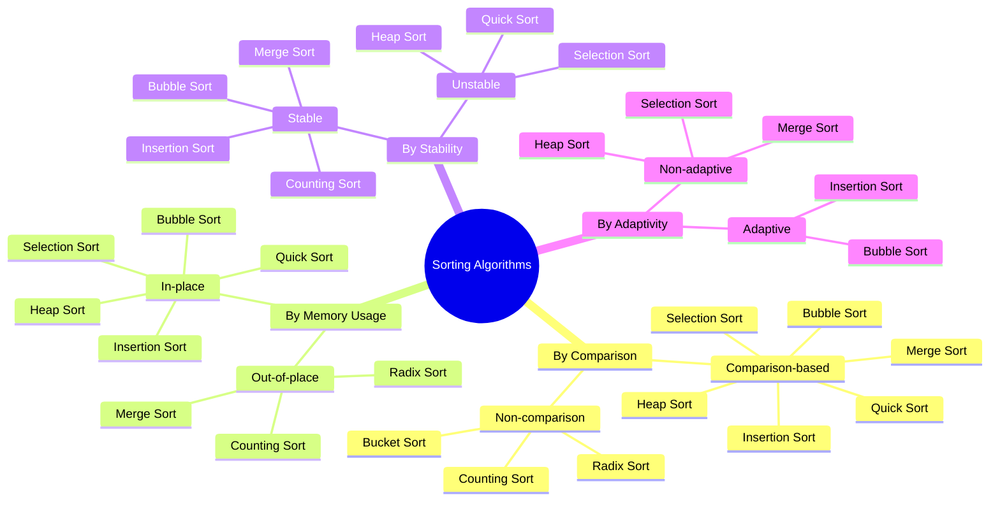

# Sorting Algorithms

[Back to Course Content](README.md) | [Previous: Graphs](graphs.md) | [Next: Searching Algorithms →](searching.md)

> Reference: This content is based on Simple-sorting.pdf and Advanced-sorting.pdf

## What are Sorting Algorithms?

Sorting algorithms are computational procedures that arrange elements of a collection in a specific order (typically ascending or descending). They are fundamental to computer science and serve as building blocks for many other algorithms and applications in data processing.

### Formal Definition

Given a sequence of n elements [a₁, a₂, ..., aₙ] and a total ordering relation ≤, a sorting algorithm produces a permutation [a'₁, a'₂, ..., a'ₙ] of the original sequence such that a'₁ ≤ a'₂ ≤ ... ≤ a'ₙ.

### Mathematical Properties

1. **Stability**: A sorting algorithm is stable if elements with equal keys maintain their relative order from the input sequence.
   - Formally: For any i,j where i < j and a[i] = a[j], a'[k] ≠ a[i] for all k < l, where a'[l] = a[i].

2. **In-Place**: An algorithm is in-place if it requires O(1) extra space regardless of input size.
   - Mathematically: The space complexity S(n) ∈ O(1), where n is the input size.

3. **Adaptivity**: An algorithm is adaptive if it performs better on partially sorted input.
   - Time complexity T(n,d) decreases as the "disorder" measure d decreases.

### Classification of Sorting Algorithms

Sorting algorithms can be classified based on several criteria:



### Theoretical Limits

For comparison-based sorting algorithms, there exists a mathematical lower bound of Ω(n log n) comparisons in the worst case.

**Proof Sketch**: 
- There are n! possible permutations of n elements
- A comparison-based algorithm must distinguish between all these permutations
- A binary decision tree representing all comparisons must have at least n! leaves
- A binary tree with L leaves has height at least log₂(L)
- Therefore, the worst-case number of comparisons is Ω(log(n!)) = Ω(n log n)

## Basic Sorting Algorithms

### 1. Bubble Sort

Bubble sort is a simple comparison-based sorting algorithm that repeatedly steps through the list, compares adjacent elements, and swaps them if they are in the wrong order.

#### Algorithm

1. Start from the first element, compare adjacent elements
2. Swap if the element found is greater than the next element
3. Repeat until reaching the end of unsorted portion
4. Move to the next pass, reducing the range by one element
5. Continue until no swaps are needed

#### Mathematical Analysis

- **Time Complexity**:
  - Best Case: O(n) when array is already sorted (with optimization)
  - Average Case: O(n²)
  - Worst Case: O(n²) when array is sorted in reverse order

- **Number of Comparisons**: 
  - Worst case: (n(n-1))/2 comparisons
  - Best case (optimized): O(n) comparisons

- **Number of Swaps**:
  - Worst case: (n(n-1))/2 swaps
  - Best case: 0 swaps (already sorted)

#### Implementation

```java
public class BubbleSort {
    public void bubbleSort(int[] arr) {
        int n = arr.length;
        for (int i = 0; i < n - 1; i++) {
            for (int j = 0; j < n - i - 1; j++) {
                if (arr[j] > arr[j + 1]) {
                    // Swap elements
                    int temp = arr[j];
                    arr[j] = arr[j + 1];
                    arr[j + 1] = temp;
                }
            }
        }
    }

    // Optimized version with early termination
    public void optimizedBubbleSort(int[] arr) {
        int n = arr.length;
        boolean swapped;
        for (int i = 0; i < n - 1; i++) {
            swapped = false;
            for (int j = 0; j < n - i - 1; j++) {
                if (arr[j] > arr[j + 1]) {
                    // Swap elements
                    int temp = arr[j];
                    arr[j] = arr[j + 1];
                    arr[j + 1] = temp;
                    swapped = true;
                }
            }
            if (!swapped) {
                break; // Array is sorted
            }
        }
    }
}
```

#### Visualization

For example, sorting [5, 1, 4, 2, 8]:

Pass 1:
- Compare 5 > 1? Yes, swap → [1, 5, 4, 2, 8]
- Compare 5 > 4? Yes, swap → [1, 4, 5, 2, 8]
- Compare 5 > 2? Yes, swap → [1, 4, 2, 5, 8]
- Compare 5 > 8? No, don't swap → [1, 4, 2, 5, 8]

Pass 2:
- Compare 1 > 4? No, don't swap → [1, 4, 2, 5, 8]
- Compare 4 > 2? Yes, swap → [1, 2, 4, 5, 8]
- Compare 4 > 5? No, don't swap → [1, 2, 4, 5, 8]

Pass 3:
- Compare 1 > 2? No, don't swap → [1, 2, 4, 5, 8]
- Compare 2 > 4? No, don't swap → [1, 2, 4, 5, 8]

Pass 4:
- Compare 1 > 2? No, don't swap → [1, 2, 4, 5, 8]

#### Advantages and Disadvantages

**Advantages**:
- Simple implementation
- Stable sort (maintains relative order of equal elements)
- In-place sort (requires O(1) extra space)
- Performs well on nearly sorted data
- Excellent for teaching sorting concepts

**Disadvantages**:
- Poor performance O(n²) on large datasets
- Not suitable for real-world applications with large data

### 2. Selection Sort

Selection sort is an in-place comparison sorting algorithm that divides the input list into a sorted and an unsorted region. It repeatedly selects the smallest element from the unsorted region and moves it to the end of the sorted region.

#### Algorithm

1. Divide the array into sorted (initially empty) and unsorted portions
2. Find the minimum element in the unsorted portion
3. Swap it with the first element of the unsorted portion
4. Expand the sorted portion to include this element
5. Repeat until the entire array is sorted

#### Mathematical Analysis

- **Time Complexity**:
  - Best Case: O(n²) even if array is sorted
  - Average Case: O(n²)
  - Worst Case: O(n²)

- **Number of Comparisons**: 
  - Exactly (n(n-1))/2 comparisons in all cases
  
- **Number of Swaps**:
  - At most n-1 swaps (much less than bubble sort)
  - Best case: 0 swaps (already sorted)

#### Implementation

```java
public class SelectionSort {
    public void selectionSort(int[] arr) {
        int n = arr.length;
        for (int i = 0; i < n - 1; i++) {
            // Find minimum element in unsorted array
            int minIdx = i;
            for (int j = i + 1; j < n; j++) {
                if (arr[j] < arr[minIdx]) {
                    minIdx = j;
                }
            }
            // Swap found minimum with first element
            int temp = arr[minIdx];
            arr[minIdx] = arr[i];
            arr[i] = temp;
        }
    }
}
```

#### Visualization

For example, sorting [64, 25, 12, 22, 11]:

Pass 1:
- Find minimum: 11 at index 4
- Swap with first element → [11, 25, 12, 22, 64]

Pass 2:
- Find minimum in remaining: 12 at index 2
- Swap with second element → [11, 12, 25, 22, 64]

Pass 3:
- Find minimum in remaining: 22 at index 3
- Swap with third element → [11, 12, 22, 25, 64]

Pass 4:
- Find minimum in remaining: 25 at index 3
- Swap with fourth element → [11, 12, 22, 25, 64]

#### Advantages and Disadvantages

**Advantages**:
- Simple implementation
- Performs well on small data sets
- In-place sort (requires O(1) extra space)
- Minimizes the number of swaps (good when swap operation is expensive)

**Disadvantages**:
- O(n²) complexity makes it inefficient for large datasets
- Always performs O(n²) comparisons even if the array is sorted
- Not stable (relative order of equal elements may change)

### 3. Insertion Sort

Insertion sort is a simple sorting algorithm that builds the final sorted array one item at a time. It is efficient for small data sets and is often used as part of more sophisticated algorithms.

#### Algorithm

1. Iterate through the array, starting from the second element
2. For each element, compare it with all elements in the sorted portion
3. Shift larger elements to the right to make space
4. Insert the element at the correct position
5. Repeat until the entire array is sorted

#### Mathematical Analysis

- **Time Complexity**:
  - Best Case: O(n) when array is already sorted
  - Average Case: O(n²)
  - Worst Case: O(n²) when array is sorted in reverse order

- **Number of Comparisons**: 
  - Best case: n-1 comparisons
  - Worst case: (n(n-1))/2 comparisons

- **Number of Shifts**:
  - Best case: 0 shifts
  - Worst case: (n(n-1))/2 shifts

#### Implementation

```java
public class InsertionSort {
    public void insertionSort(int[] arr) {
        int n = arr.length;
        for (int i = 1; i < n; i++) {
            int key = arr[i];
            int j = i - 1;

            // Move elements that are greater than key
            // to one position ahead of their current position
            while (j >= 0 && arr[j] > key) {
                arr[j + 1] = arr[j];
                j = j - 1;
            }
            arr[j + 1] = key;
        }
    }
}
```

#### Visualization

For example, sorting [12, 11, 13, 5, 6]:

Pass 1:
- 12 is already "sorted"

Pass 2:
- Consider 11, insert before 12 → [11, 12, 13, 5, 6]

Pass 3:
- Consider 13, keep after 12 → [11, 12, 13, 5, 6]

Pass 4:
- Consider 5, insert at beginning → [5, 11, 12, 13, 6]

Pass 5:
- Consider 6, insert between 5 and 11 → [5, 6, 11, 12, 13]

#### Recurrence Relation

The recurrence relation for insertion sort is:
- T(1) = O(1)
- T(n) = T(n-1) + O(n)
- Solution: T(n) = O(n²)

#### Advantages and Disadvantages

**Advantages**:
- Simple implementation
- Efficient for small data sets
- Stable sort (maintains relative order of equal elements)
- In-place sort (requires O(1) extra space)
- Adaptive (efficient for nearly sorted data)
- Online algorithm (can sort as it receives input)

**Disadvantages**:
- O(n²) complexity makes it inefficient for large datasets
- Less efficient than other O(n²) algorithms for randomly ordered data

#### Binary Insertion Sort Variant

A optimization of insertion sort uses binary search to find the insertion position:

```java
public void binaryInsertionSort(int[] arr) {
    int n = arr.length;
    for (int i = 1; i < n; i++) {
        int key = arr[i];
        int insertPos = binarySearch(arr, 0, i - 1, key);
        
        // Shift elements to the right
        for (int j = i - 1; j >= insertPos; j--) {
            arr[j + 1] = arr[j];
        }
        
        arr[insertPos] = key;
    }
}

private int binarySearch(int[] arr, int low, int high, int key) {
    if (high <= low) {
        return (key > arr[low]) ? (low + 1) : low;
    }
    
    int mid = (low + high) / 2;
    
    if (key == arr[mid]) {
        return mid + 1; // For stability
    }
    
    if (key > arr[mid]) {
        return binarySearch(arr, mid + 1, high, key);
    }
    
    return binarySearch(arr, low, mid - 1, key);
}
```

This reduces comparison operations to O(n log n) but still requires O(n²) shifts in the worst case.

## Advanced Sorting Algorithms

Advanced sorting algorithms employ more sophisticated techniques that achieve better average-case performance than the basic O(n²) algorithms. These algorithms typically achieve O(n log n) time complexity through divide-and-conquer or tree-based approaches.

### 1. Quick Sort

Quick sort is an efficient, divide-and-conquer sorting algorithm that selects a 'pivot' element and partitions the array around it. It's one of the most widely used sorting algorithms due to its excellent average-case performance and efficient memory usage.

#### Algorithm

1. Choose a pivot element from the array
2. Partition: Rearrange the array so that:
   - All elements less than the pivot are to its left
   - All elements greater than the pivot are to its right
3. Recursively apply steps 1-2 to the sub-arrays formed by the partition
4. Base case: Arrays of size 0 or 1 are already sorted

#### Mathematical Analysis

- **Time Complexity**:
  - Best Case: O(n log n) when pivot divides array evenly
  - Average Case: O(n log n)
  - Worst Case: O(n²) when pivot is smallest/largest element

- **Recurrence Relation**:
  - T(n) = O(n) + T(k) + T(n-k-1)
  - Where k is the number of elements less than pivot
  - Best case (k = n/2): T(n) = 2T(n/2) + O(n) = O(n log n)
  - Worst case (k = 0 or k = n-1): T(n) = T(n-1) + O(n) = O(n²)

- **Space Complexity**:
  - O(log n) auxiliary space for recursion stack in average case
  - O(n) in worst case

#### Implementation

```java
public class QuickSort {
    public void quickSort(int[] arr) {
        quickSort(arr, 0, arr.length - 1);
    }

    private void quickSort(int[] arr, int low, int high) {
        if (low < high) {
            int pi = partition(arr, low, high);
            quickSort(arr, low, pi - 1);
            quickSort(arr, pi + 1, high);
        }
    }

    private int partition(int[] arr, int low, int high) {
        int pivot = arr[high];
        int i = (low - 1);

        for (int j = low; j < high; j++) {
            if (arr[j] <= pivot) {
                i++;
                // Swap elements
                int temp = arr[i];
                arr[i] = arr[j];
                arr[j] = temp;
            }
        }

        // Place pivot in correct position
        int temp = arr[i + 1];
        arr[i + 1] = arr[high];
        arr[high] = temp;

        return i + 1;
    }
}
```

#### Pivot Selection Strategies

The choice of pivot significantly impacts Quick Sort's performance:

1. **First Element**: Simple but leads to worst-case for sorted arrays
2. **Last Element**: Simple but also leads to worst-case for sorted arrays
3. **Middle Element**: Better for partially sorted arrays
4. **Random Element**: Avoids predictable worst-case scenarios
5. **Median-of-Three**: Choose median of first, middle, and last elements

```java
// Median-of-three pivot selection
private int selectPivot(int[] arr, int low, int high) {
    int mid = low + (high - low) / 2;
    
    // Sort the three values
    if (arr[low] > arr[mid]) {
        swap(arr, low, mid);
    }
    if (arr[low] > arr[high]) {
        swap(arr, low, high);
    }
    if (arr[mid] > arr[high]) {
        swap(arr, mid, high);
    }
    
    // Return the middle value (now at mid)
    return mid;
}
```

#### Optimization Techniques

1. **Tail Recursion Elimination**: Optimize recursive calls to reduce stack usage

```java
private void optimizedQuickSort(int[] arr, int low, int high) {
    while (low < high) {
        int pi = partition(arr, low, high);
        
        // Recursively sort the smaller partition
        if (pi - low < high - pi) {
            optimizedQuickSort(arr, low, pi - 1);
            low = pi + 1;  // Tail recursion elimination
        } else {
            optimizedQuickSort(arr, pi + 1, high);
            high = pi - 1;  // Tail recursion elimination
        }
    }
}
```

2. **Insertion Sort for Small Arrays**: Switch to insertion sort for small subarrays

```java
private void hybridQuickSort(int[] arr, int low, int high) {
    while (low < high) {
        // Use insertion sort for small arrays
        if (high - low < 10) {
            insertionSort(arr, low, high);
            break;
        }
        
        int pi = partition(arr, low, high);
        // Continue with standard quicksort...
    }
}
```

3. **Three-Way Partitioning**: Handle duplicates efficiently by creating three partitions (less than, equal to, greater than pivot)

```java
private void threeWayQuickSort(int[] arr, int low, int high) {
    if (high <= low) return;
    
    // Three-way partition
    int lt = low, gt = high;
    int v = arr[low];
    int i = low + 1;
    
    while (i <= gt) {
        if (arr[i] < v) {
            swap(arr, lt++, i++);
        } else if (arr[i] > v) {
            swap(arr, i, gt--);
        } else {
            i++;
        }
    }
    
    // Recursive calls
    threeWayQuickSort(arr, low, lt - 1);
    threeWayQuickSort(arr, gt + 1, high);
}
```

#### Visualization

For example, sorting [7, 2, 1, 6, 8, 5, 3, 4] with the last element as pivot:

1. Choose pivot = 4
2. Partition: [2, 1, 3], 4, [7, 6, 8, 5]
3. Recursively sort [2, 1, 3]:
   - Choose pivot = 3
   - Partition: [2, 1], 3, []
   - Recursively sort [2, 1]:
     - Choose pivot = 1
     - Partition: [], 1, [2]
4. Recursively sort [7, 6, 8, 5]:
   - Choose pivot = 5
   - Partition: [], 5, [7, 6, 8]
   - Recursively sort [7, 6, 8]:
     - Choose pivot = 8
     - Partition: [7, 6], 8, []
     - Recursively sort [7, 6]:
       - Choose pivot = 6
       - Partition: [], 6, [7]
5. Final result: [1, 2, 3, 4, 5, 6, 7, 8]

#### Advantages and Disadvantages

**Advantages**:
- Excellent average-case performance O(n log n)
- In-place sorting (requires only O(log n) additional space)
- Cache-friendly due to good locality of reference
- Adaptable with various pivot selection strategies

**Disadvantages**:
- Worst-case time complexity O(n²)
- Not stable (relative order of equal elements may change)
- Performance depends on pivot selection
- Can degrade to O(n²) on already sorted or nearly sorted data

### 2. Merge Sort

Merge sort is a divide-and-conquer algorithm that divides the input array into two halves, recursively sorts them, and then merges the sorted halves to produce a fully sorted array.

#### Algorithm

1. Divide the unsorted array into n subarrays, each containing one element
2. Repeatedly merge subarrays to produce sorted subarrays
3. Continue until there is only one subarray remaining

#### Mathematical Analysis

- **Time Complexity**:
  - Best Case: O(n log n)
  - Average Case: O(n log n)
  - Worst Case: O(n log n)

- **Recurrence Relation**:
  - T(n) = 2T(n/2) + O(n)
  - Solution using Master Theorem: T(n) = O(n log n)

- **Space Complexity**:
  - O(n) auxiliary space for the temporary arrays during merging

#### Implementation

```java
public class MergeSort {
    public void mergeSort(int[] arr) {
        mergeSort(arr, 0, arr.length - 1);
    }

    private void mergeSort(int[] arr, int left, int right) {
        if (left < right) {
            int mid = left + (right - left) / 2;
            mergeSort(arr, left, mid);
            mergeSort(arr, mid + 1, right);
            merge(arr, left, mid, right);
        }
    }

    private void merge(int[] arr, int left, int mid, int right) {
        int n1 = mid - left + 1;
        int n2 = right - mid;

        // Create temp arrays
        int[] leftArr = new int[n1];
        int[] rightArr = new int[n2];

        // Copy data to temp arrays
        for (int i = 0; i < n1; i++) {
            leftArr[i] = arr[left + i];
        }
        for (int j = 0; j < n2; j++) {
            rightArr[j] = arr[mid + 1 + j];
        }

        // Merge the temp arrays
        int i = 0, j = 0;
        int k = left;
        while (i < n1 && j < n2) {
            if (leftArr[i] <= rightArr[j]) {
                arr[k] = leftArr[i];
                i++;
            } else {
                arr[k] = rightArr[j];
                j++;
            }
            k++;
        }

        // Copy remaining elements
        while (i < n1) {
            arr[k] = leftArr[i];
            i++;
            k++;
        }
        while (j < n2) {
            arr[k] = rightArr[j];
            j++;
            k++;
        }
    }
}
```

#### Optimization Techniques

1. **Bottom-up Merge Sort**: Iterative implementation to avoid recursion overhead

```java
public void bottomUpMergeSort(int[] arr) {
    int n = arr.length;
    int[] temp = new int[n];
    
    // Iterate through subarrays of size 1, 2, 4, 8...
    for (int size = 1; size < n; size *= 2) {
        // Merge subarrays of size 'size'
        for (int leftStart = 0; leftStart < n - size; leftStart += 2 * size) {
            int mid = leftStart + size - 1;
            int rightEnd = Math.min(leftStart + 2 * size - 1, n - 1);
            merge(arr, leftStart, mid, rightEnd, temp);
        }
    }
}

// Merge function with temporary array as parameter
private void merge(int[] arr, int left, int mid, int right, int[] temp) {
    // Regular merge logic using temp array
    // ...
}
```

2. **Hybrid with Insertion Sort**: Use insertion sort for small subarrays

```java
private void hybridMergeSort(int[] arr, int left, int right) {
    if (right - left <= 10) {
        insertionSort(arr, left, right);
        return;
    }
    
    if (left < right) {
        int mid = left + (right - left) / 2;
        hybridMergeSort(arr, left, mid);
        hybridMergeSort(arr, mid + 1, right);
        merge(arr, left, mid, right);
    }
}
```

3. **In-place Merge Sort**: Reduce space complexity by merging in-place

```java
private void inPlaceMerge(int[] arr, int start, int mid, int end) {
    int start2 = mid + 1;
    
    // If arrays are already sorted
    if (arr[mid] <= arr[start2]) {
        return;
    }
    
    // Two pointers to maintain the start of both arrays
    while (start <= mid && start2 <= end) {
        // If element at start is in right place
        if (arr[start] <= arr[start2]) {
            start++;
        } else {
            // Otherwise, we need to shift all elements between
            // start and start2 to create space for the smaller element
            int value = arr[start2];
            int index = start2;
            
            // Shift all elements between start and start2
            while (index > start) {
                arr[index] = arr[index - 1];
                index--;
            }
            
            arr[start] = value;
            
            // Adjust pointers
            start++;
            mid++;
            start2++;
        }
    }
}
```

#### Visualization

For example, sorting [38, 27, 43, 3, 9, 82, 10]:

1. Divide: [38, 27, 43, 3], [9, 82, 10]
2. Divide: [38, 27], [43, 3], [9, 82], [10]
3. Divide: [38], [27], [43], [3], [9], [82], [10]
4. Merge: [27, 38], [3, 43], [9, 82], [10]
5. Merge: [3, 27, 38, 43], [9, 10, 82]
6. Merge: [3, 9, 10, 27, 38, 43, 82]

#### Advantages and Disadvantages

**Advantages**:
- Stable sorting algorithm (maintains relative order of equal elements)
- Guaranteed O(n log n) performance in all cases
- Well-suited for linked lists (requires only O(1) extra space)
- Parallelizable due to divide-and-conquer nature

**Disadvantages**:
- Requires O(n) extra space for the auxiliary arrays
- Not in-place for array implementation
- Slower than quicksort for small arrays due to overhead
- Not adaptive (doesn't benefit from partially sorted input)

### 3. Heap Sort

Heap sort is a comparison-based sorting algorithm that uses a binary heap data structure. It can be viewed as an improved selection sort by efficiently finding the maximum element using a heap.

#### Algorithm

1. Build a max heap from the input data
2. Extract the maximum element (root) and replace it with the last element
3. Reduce the heap size by 1 and heapify the root
4. Repeat steps 2-3 until the heap size is 1

#### Binary Heap Structure

A binary heap is a complete binary tree where:
- Every node is greater than or equal to its children (max-heap)
- Or every node is less than or equal to its children (min-heap)

For an array representation of a heap with 0-based indexing:
- Parent of node at index i: ⌊(i-1)/2⌋
- Left child of node at index i: 2i + 1
- Right child of node at index i: 2i + 2

#### Mathematical Analysis

- **Time Complexity**:
  - Building the heap: O(n)
  - Heapify operations: O(log n) each, performed n times
  - Overall: O(n log n) in all cases

- **Space Complexity**:
  - O(1) auxiliary space (in-place sorting)

#### Implementation

```java
public class HeapSort {
    public void heapSort(int[] arr) {
        int n = arr.length;

        // Build heap (rearrange array)
        for (int i = n / 2 - 1; i >= 0; i--) {
            heapify(arr, n, i);
        }

        // One by one extract an element from heap
        for (int i = n - 1; i > 0; i--) {
            // Move current root to end
            int temp = arr[0];
            arr[0] = arr[i];
            arr[i] = temp;

            // Call max heapify on the reduced heap
            heapify(arr, i, 0);
        }
    }

    private void heapify(int[] arr, int n, int i) {
        int largest = i;
        int left = 2 * i + 1;
        int right = 2 * i + 2;

        // If left child is larger than root
        if (left < n && arr[left] > arr[largest]) {
            largest = left;
        }

        // If right child is larger than largest so far
        if (right < n && arr[right] > arr[largest]) {
            largest = right;
        }

        // If largest is not root
        if (largest != i) {
            int temp = arr[i];
            arr[i] = arr[largest];
            arr[largest] = temp;

            // Recursively heapify the affected sub-tree
            heapify(arr, n, largest);
        }
    }
}
```

#### Proof of Time Complexity

1. **Building the heap**:
   - Naive analysis suggests O(n log n) time
   - However, a tighter analysis reveals it's actually O(n)
   - Mathematical proof: Sum of heights of all nodes is O(n)

2. **Extraction phase**:
   - Each extraction and heapify takes O(log n) time
   - We perform n - 1 extractions
   - Total: O(n log n)

#### Visualization

For example, sorting [4, 10, 3, 5, 1]:

1. Build max heap:
   - Initial array: [4, 10, 3, 5, 1]
   - After heapify: [10, 5, 3, 4, 1]

2. Extract max elements:
   - Swap 10 and 1: [1, 5, 3, 4, 10]
   - Heapify: [5, 4, 3, 1, 10]
   - Swap 5 and 1: [1, 4, 3, 5, 10]
   - Heapify: [4, 1, 3, 5, 10]
   - Swap 4 and 3: [3, 1, 4, 5, 10]
   - Heapify: [3, 1, 4, 5, 10]
   - Swap 3 and 1: [1, 3, 4, 5, 10]

3. Final sorted array: [1, 3, 4, 5, 10]

#### Advanced Variants

1. **Floyd's Heap Construction**:
   - More efficient method to build a heap
   - Bottom-up approach starting from lowest level

2. **Weak Heap Sort**:
   - Uses a relaxed heap structure
   - Reduces number of comparisons

3. **Smoothsort**:
   - Variation that performs well on partially sorted data
   - Based on Leonardo numbers

#### Advantages and Disadvantages

**Advantages**:
- Guaranteed O(n log n) performance in all cases
- In-place sort (requires only O(1) extra space)
- Not sensitive to input distribution
- Conceptually simple with good performance

**Disadvantages**:
- Not stable (relative order of equal elements may change)
- Typically slower than quicksort in practice
- Poor cache locality compared to quicksort
- Not adaptive to partially sorted input

## Special Sorting Algorithms

Special sorting algorithms leverage specific properties of the data to achieve better performance than comparison-based algorithms. These algorithms can break the O(n log n) lower bound that applies to comparison-based sorts.

### 1. Counting Sort

Counting sort is a non-comparison algorithm that sorts integers by counting the occurrences of each element and reconstructing the array in order. It operates by assuming that each input is an integer in a known range.

#### Algorithm

1. Count the occurrences of each element in the input array
2. Compute the starting index for each element by calculating cumulative sum
3. Build the output array by placing elements at their respective positions
4. Copy the output array back to the original array (if necessary)

#### Mathematical Analysis

- **Time Complexity**:
  - O(n + k) where n is the size of input array and k is the range of input values
  - Best Case, Average Case, and Worst Case all have the same complexity

- **Space Complexity**:
  - O(n + k) auxiliary space for the count array and output array

- **Stability**: 
  - Naturally stable if implemented correctly

#### Implementation

```java
public class CountingSort {
    public void countingSort(int[] arr) {
        int n = arr.length;
        if (n == 0) return;
        
        // Find maximum element to determine count array size
        int max = arr[0];
        for (int i = 1; i < n; i++) {
            if (arr[i] > max) {
                max = arr[i];
            }
        }

        // Create count array and initialize with zeros
        int[] count = new int[max + 1];
        for (int i = 0; i < n; i++) {
            count[arr[i]]++;
        }

        // Modify count array to store actual positions
        // (cumulative sum)
        for (int i = 1; i <= max; i++) {
            count[i] += count[i - 1];
        }

        // Create output array
        int[] output = new int[n];
        
        // Build the output array - iterate backwards to maintain stability
        for (int i = n - 1; i >= 0; i--) {
            output[count[arr[i]] - 1] = arr[i];
            count[arr[i]]--;
        }

        // Copy output array to original array
        for (int i = 0; i < n; i++) {
            arr[i] = output[i];
        }
    }
}
```

#### Mathematical Correctness

The correctness of counting sort can be demonstrated mathematically:

1. After computing frequency counts, `count[i]` represents the number of elements ≤ i
2. Therefore, for an element with value v, its correct position is `count[v] - 1`
3. By decrementing `count[v]` after each placement, we maintain the relative order of equal elements

#### Visualization

For example, sorting [4, 2, 2, 8, 3, 3, 1]:

1. Count occurrences:
   - count[1] = 1, count[2] = 2, count[3] = 2, count[4] = 1, count[8] = 1

2. Compute cumulative count:
   - count[1] = 1, count[2] = 3, count[3] = 5, count[4] = 6, count[8] = 7

3. Build output array (iterating backwards for stability):
   - Place 1 at position count[1]-1 = 0: output = [1, ?, ?, ?, ?, ?, ?]
   - Place 3 at position count[3]-1 = 4: output = [1, ?, ?, ?, 3, ?, ?]
   - Place 3 at position count[3]-2 = 3: output = [1, ?, ?, 3, 3, ?, ?]
   - Place 8 at position count[8]-1 = 6: output = [1, ?, ?, 3, 3, ?, 8]
   - Place 2 at position count[2]-1 = 2: output = [1, ?, 2, 3, 3, ?, 8]
   - Place 2 at position count[2]-2 = 1: output = [1, 2, 2, 3, 3, ?, 8]
   - Place 4 at position count[4]-1 = 5: output = [1, 2, 2, 3, 3, 4, 8]

4. Final sorted array: [1, 2, 2, 3, 3, 4, 8]

#### Variants and Optimizations

1. **Counting Sort for Negative Numbers**:
   - Find min and max values
   - Create count array of size (max - min + 1)
   - Adjust index calculations to account for offset

```java
public void countingSortWithNegatives(int[] arr) {
    if (arr.length == 0) return;
    
    // Find min and max values
    int min = arr[0], max = arr[0];
    for (int i = 1; i < arr.length; i++) {
        if (arr[i] < min) min = arr[i];
        if (arr[i] > max) max = arr[i];
    }
    
    int range = max - min + 1;
    int[] count = new int[range];
    int[] output = new int[arr.length];
    
    // Count occurrences
    for (int i = 0; i < arr.length; i++) {
        count[arr[i] - min]++;
    }
    
    // Compute cumulative count
    for (int i = 1; i < range; i++) {
        count[i] += count[i - 1];
    }
    
    // Build output array
    for (int i = arr.length - 1; i >= 0; i--) {
        output[count[arr[i] - min] - 1] = arr[i];
        count[arr[i] - min]--;
    }
    
    // Copy to original array
    for (int i = 0; i < arr.length; i++) {
        arr[i] = output[i];
    }
}
```

2. **Memory-Efficient Counting Sort**:
   - For sparse data, use a map instead of an array for counts
   - Reduces space complexity when range is large but distinct values are few

#### Applications

- **Data with Small Range**: When the range of values (k) is small compared to the array size (n)
- **Sorting Strings**: As a subroutine in Radix Sort for lexicographic sorting
- **Stability Requirement**: When maintaining the relative order of equal elements is critical
- **Preprocessing**: As a preprocessing step in more complex algorithms

#### Advantages and Disadvantages

**Advantages**:
- Linear time complexity O(n + k) that can outperform comparison-based sorts
- Stable algorithm (maintains relative order of equal elements)
- Simple implementation for integer keys
- Well-suited for auxiliary sorting operations

**Disadvantages**:
- Not suitable when the range of input values (k) is large
- Not an in-place sort (requires additional space)
- Limited to integers or data that can be mapped to integers
- Not efficient for floating-point numbers without modifications

### 2. Radix Sort

Radix sort is a non-comparison algorithm that sorts integers by processing individual digits. It can sort integers in linear time by distributing elements into buckets according to their digits.

#### Algorithm

1. Find the maximum number to determine the number of digits
2. For each digit position, starting from the least significant digit:
   - Distribute: Place each element in a bucket based on the current digit
   - Collect: Gather elements from buckets, preserving their order
3. Repeat until all digit positions are processed

#### Mathematical Analysis

- **Time Complexity**:
  - O(d × (n + k)) where:
    - n is the number of elements
    - k is the range of each digit (typically 10 for decimal)
    - d is the number of digits in the maximum element
  - If all numbers have the same number of digits, this becomes O(d × n)
  - For integers with a bounded number of digits, this simplifies to O(n)

- **Space Complexity**:
  - O(n + k) auxiliary space

- **Correctness Proof**:
  - Uses the mathematical principle that sorting by each digit position from least to most significant produces a correctly sorted array
  - Relies on the stability of the digit-sorting algorithm (typically counting sort)

#### Implementation

```java
public class RadixSort {
    public void radixSort(int[] arr) {
        if (arr.length == 0) return;
        
        // Find the maximum number to determine number of digits
        int max = arr[0];
        for (int i = 1; i < arr.length; i++) {
            if (arr[i] > max) {
                max = arr[i];
            }
        }

        // Do counting sort for every digit
        // exp is 10^i where i is the current digit number
        for (int exp = 1; max / exp > 0; exp *= 10) {
            countingSortForRadix(arr, exp);
        }
    }

    private void countingSortForRadix(int[] arr, int exp) {
        int n = arr.length;
        int[] output = new int[n];
        int[] count = new int[10]; // Digits are 0-9

        // Store count of occurrences in count[]
        for (int i = 0; i < n; i++) {
            count[(arr[i] / exp) % 10]++;
        }

        // Change count[i] so that count[i] contains
        // position of this digit in output[]
        for (int i = 1; i < 10; i++) {
            count[i] += count[i - 1];
        }

        // Build the output array
        for (int i = n - 1; i >= 0; i--) {
            output[count[(arr[i] / exp) % 10] - 1] = arr[i];
            count[(arr[i] / exp) % 10]--;
        }

        // Copy the output array to arr[]
        for (int i = 0; i < n; i++) {
            arr[i] = output[i];
        }
    }
}
```

#### MSD vs. LSD Radix Sort

1. **Least Significant Digit (LSD) Radix Sort**:
   - Processes digits from least to most significant
   - Requires stable digit-sorting algorithm
   - Typically implemented using counting sort for digits

2. **Most Significant Digit (MSD) Radix Sort**:
   - Processes digits from most to least significant
   - Resembles quicksort with recursive partitioning
   - More efficient for string sorting

```java
public void msdRadixSort(String[] arr) {
    String[] aux = new String[arr.length];
    msdRadixSort(arr, aux, 0, arr.length - 1, 0);
}

private void msdRadixSort(String[] arr, String[] aux, int lo, int hi, int d) {
    if (hi <= lo) return;
    
    // Count frequencies of each character at position d
    int[] count = new int[R + 2]; // R is alphabet size
    for (int i = lo; i <= hi; i++) {
        int c = charAt(arr[i], d) + 2; // Add 2 for indexing
        count[c]++;
    }
    
    // Compute cumulative counts
    for (int r = 0; r < R + 1; r++) {
        count[r + 1] += count[r];
    }
    
    // Distribute
    for (int i = lo; i <= hi; i++) {
        int c = charAt(arr[i], d) + 1;
        aux[count[c]++] = arr[i];
    }
    
    // Copy back
    for (int i = lo; i <= hi; i++) {
        arr[i] = aux[i - lo];
    }
    
    // Recursively sort for each character
    for (int r = 0; r < R; r++) {
        msdRadixSort(arr, aux, lo + count[r], lo + count[r + 1] - 1, d + 1);
    }
}

// Return the dth character of s, -1 if d is beyond length
private int charAt(String s, int d) {
    if (d < s.length()) return s.charAt(d);
    return -1;
}
```

#### Visualization

For example, sorting [170, 45, 75, 90, 802, 24, 2, 66] using LSD Radix Sort:

1. Sort by the 1s place (last digit):
   - [170, 90, 802, 2, 24, 45, 75, 66]

2. Sort by the 10s place:
   - [802, 2, 24, 45, 66, 170, 75, 90]

3. Sort by the 100s place:
   - [2, 24, 45, 66, 75, 90, 170, 802]

#### Applications

- **Integer Sorting**: When the range of values is large but the number of digits is limited
- **String Sorting**: Lexicographical sorting of strings with bounded length
- **Database Indexing**: Used in database systems for fast record retrieval
- **Network Routing**: IP address sorting

#### Advantages and Disadvantages

**Advantages**:
- Linear time complexity O(d(n + k)) which can be better than O(n log n)
- Stable algorithm
- Can be faster than comparison sorts for integers with limited digits
- Handles large ranges efficiently if the number of digits is small

**Disadvantages**:
- Not in-place (requires additional memory)
- Performance degrades with increased number of digits
- Not adaptive to partially sorted input
- Not efficient for floating-point numbers without special handling

### 3. Bucket Sort

Bucket sort distributes elements into a number of buckets, sorts each bucket, and then combines the results. It's particularly effective when input is uniformly distributed across a range.

#### Algorithm

1. Create n empty buckets
2. Distribute elements into buckets based on their values
3. Sort each bucket individually (using another sorting algorithm)
4. Concatenate all sorted buckets in order

#### Mathematical Analysis

- **Time Complexity**:
  - Best Case: O(n + k) when elements are evenly distributed
  - Average Case: O(n + n²/k + k) where k is the number of buckets
  - Worst Case: O(n²) when all elements go into a single bucket

- **Space Complexity**:
  - O(n + k) auxiliary space

- **Expected Running Time Analysis**:
  - When input is uniformly distributed and n ≈ k, each bucket has about n/k elements
  - If each bucket is sorted with an O((n/k)²) algorithm like insertion sort
  - Expected time becomes O(k × (n/k)²) = O(n²/k)
  - With n ≈ k, this simplifies to O(n)

#### Implementation

```java
public class BucketSort {
    public void bucketSort(float[] arr) {
        if (arr.length == 0) return;
        
        int n = arr.length;
        
        // Create n empty buckets
        @SuppressWarnings("unchecked")
        ArrayList<Float>[] buckets = new ArrayList[n];
        for (int i = 0; i < n; i++) {
            buckets[i] = new ArrayList<>();
        }
        
        // Distribute elements into buckets
        for (int i = 0; i < n; i++) {
            int bucketIndex = (int) (n * arr[i]);
            buckets[bucketIndex].add(arr[i]);
        }
        
        // Sort individual buckets (using insertion sort or any other algorithm)
        for (int i = 0; i < n; i++) {
            Collections.sort(buckets[i]);
        }
        
        // Concatenate all buckets back into the original array
        int index = 0;
        for (int i = 0; i < n; i++) {
            for (float value : buckets[i]) {
                arr[index++] = value;
            }
        }
    }
}
```

#### Bucket Selection Strategies

1. **Uniform Distribution**:
   - bucketIndex = floor(n * value)
   - Assumes values are uniformly distributed between 0 and 1

2. **Range-based**:
   - bucketIndex = floor((value - min) * numBuckets / (max - min))
   - Maps values from min to max across numBuckets

3. **Custom Mapping Function**:
   - Define a function that maps values to bucket indices
   - Useful for non-uniform distributions

#### Visualization

For example, sorting [0.42, 0.32, 0.33, 0.52, 0.37, 0.47, 0.51] with 7 buckets:

1. Create 7 empty buckets

2. Distribute elements:
   - Bucket 0: []
   - Bucket 1: []
   - Bucket 2: [0.32, 0.33]
   - Bucket 3: [0.37]
   - Bucket 4: [0.42]
   - Bucket 5: [0.52, 0.51]
   - Bucket 6: [0.47]

3. Sort each bucket:
   - Bucket 0: []
   - Bucket 1: []
   - Bucket 2: [0.32, 0.33]
   - Bucket 3: [0.37]
   - Bucket 4: [0.42]
   - Bucket 5: [0.51, 0.52]
   - Bucket 6: [0.47]

4. Concatenate: [0.32, 0.33, 0.37, 0.42, 0.51, 0.52, 0.47]

#### Applications

- **Uniformly Distributed Data**: When input is uniformly distributed over a range
- **Floating-Point Numbers**: Can efficiently sort floating-point values
- **External Sorting**: When data doesn't fit in memory, buckets can be sorted separately
- **Data Preprocessing**: For approximately sorting before another algorithm

#### Advantages and Disadvantages

**Advantages**:
- Linear time complexity O(n) for uniformly distributed data
- Simple implementation
- Adaptable to different data distributions by adjusting bucket mapping
- Can be combined with other sorting algorithms for best results

**Disadvantages**:
- Performance heavily depends on data distribution
- Not in-place (requires additional memory)
- Potentially O(n²) performance in worst case
- Requires good hash function to distribute elements evenly

## Performance Comparison

### Theoretical Complexity Analysis

| Algorithm | Best Case | Average Case | Worst Case | Space Complexity | Stable | In-Place |
|-----------|-----------|--------------|------------|------------------|--------|----------|
| Bubble Sort | O(n) | O(n²) | O(n²) | O(1) | Yes | Yes |
| Selection Sort | O(n²) | O(n²) | O(n²) | O(1) | No | Yes |
| Insertion Sort | O(n) | O(n²) | O(n²) | O(1) | Yes | Yes |
| Quick Sort | O(n log n) | O(n log n) | O(n²) | O(log n) | No | Yes |
| Merge Sort | O(n log n) | O(n log n) | O(n log n) | O(n) | Yes | No |
| Heap Sort | O(n log n) | O(n log n) | O(n log n) | O(1) | No | Yes |
| Counting Sort | O(n + k) | O(n + k) | O(n + k) | O(n + k) | Yes | No |
| Radix Sort | O(d(n + k)) | O(d(n + k)) | O(d(n + k)) | O(n + k) | Yes | No |
| Bucket Sort | O(n + k) | O(n + k) | O(n²) | O(n + k) | Yes | No |

### Practical Efficiency Considerations

| Algorithm | Small Data Sets | Large Data Sets | Nearly Sorted Data | Reverse Sorted Data | Random Data | Duplicate Keys |
|-----------|----------------|----------------|-------------------|---------------------|-------------|----------------|
| Bubble Sort | Acceptable | Poor | Good | Very Poor | Poor | Fair |
| Selection Sort | Fair | Poor | Poor | Poor | Poor | Fair |
| Insertion Sort | Excellent | Poor | Excellent | Very Poor | Fair | Good |
| Quick Sort | Good | Excellent | Poor with basic pivot | Poor with basic pivot | Excellent | Fair with basic partition |
| Merge Sort | Good | Good | Good | Good | Good | Excellent |
| Heap Sort | Fair | Good | Poor | Good | Good | Fair |
| Counting Sort | Excellent if k is small | Good if k is small | Good | Good | Good | Excellent |
| Radix Sort | Fair | Good for fixed digits | Fair | Fair | Good | Good |
| Bucket Sort | Good if uniform | Good if uniform | Fair | Fair | Depends on distribution | Depends on mapping |

### Memory Usage and Cache Efficiency

| Algorithm | Memory Access Pattern | Cache Efficiency | Memory Overhead | Adaptability to Limited Memory |
|-----------|----------------------|-----------------|-----------------|-------------------------------|
| Bubble Sort | Sequential, local | Excellent | None | Excellent |
| Selection Sort | Non-sequential | Poor | None | Excellent |
| Insertion Sort | Mostly sequential | Good | None | Excellent |
| Quick Sort | Partitioned access | Good | Log n for recursion | Good with tail recursion |
| Merge Sort | Sequential within runs | Good | O(n) extra space | Poor without modifications |
| Heap Sort | Non-sequential | Poor | None | Excellent |
| Counting Sort | Multiple passes | Fair | O(k) counter array | Poor for large ranges |
| Radix Sort | Multiple passes | Fair | O(n) output array | Fair |
| Bucket Sort | Scattered access | Poor | O(n) buckets | Poor |

### Real-World Applications

| Algorithm | Suitable Applications | Notable Implementations | Domain-Specific Uses |
|-----------|----------------------|--------------------------|----------------------|
| Bubble Sort | Educational, tiny datasets | Rarely used in practice | Identifying nearly-sorted data |
| Selection Sort | Small datasets, minimizing writes | Embedded systems with write constraints | Memory-constrained systems |
| Insertion Sort | Small datasets, online sorting | Hybrid algorithms, library sort | JDK Arrays.sort for small arrays |
| Quick Sort | General-purpose sorting | C++ STL std::sort, Java Arrays.sort | Database systems, in-memory sorting |
| Merge Sort | External sorting, stable sorting | Java Arrays.sort for objects, filesystem merging | Database systems, external sorting |
| Heap Sort | Priority queue implementations | System V Unix kernel, Windows NT kernel | Real-time systems with guaranteed performance |
| Counting Sort | Integer sorting with limited range | Preprocessing for radix sort | Image processing (pixel values) |
| Radix Sort | Integer and string sorting | Algorithmic libraries | IP address sorting, string sorting |
| Bucket Sort | Uniformly distributed data | Data preprocessing | Numerical analysis, statistics |

## Best Practices

1. **Algorithm Selection**
   - Consider data size and memory constraints
   - Analyze data characteristics (distribution, sortedness)
   - Evaluate stability requirements
   - Consider worst-case guarantees vs. average performance

2. **Implementation**
   - Handle edge cases (empty arrays, single elements)
   - Optimize for your specific use case
   - Consider hybrid approaches for better performance
   - Use built-in library implementations when available

3. **Performance Optimization**
   - Avoid recursive implementations for very large datasets
   - Minimize function calls in critical loops
   - Optimize memory access patterns for cache efficiency
   - Consider parallel sorting for large datasets

4. **Sorting in Different Languages**

   **Java**:
   ```java
   // Built-in sorting
   Arrays.sort(array);               // Uses dual-pivot Quicksort for primitives
   Arrays.sort(array, comparator);   // Uses TimSort (hybrid of merge sort and insertion sort) for objects
   
   // Parallel sorting (Java 8+)
   Arrays.parallelSort(array);       // Uses parallel merge sort
   ```

   **Python**:
   ```python
   # Built-in sorting
   sorted_list = sorted(original_list)  # Returns a new sorted list
   original_list.sort()                 # Sorts in-place
   
   # Custom key function
   sorted(student_list, key=lambda x: x.grade)  # Sort by a specific attribute
   ```

   **C++**:
   ```cpp
   // STL sorting
   std::sort(vec.begin(), vec.end());  // IntroSort (hybrid of quicksort, heapsort, and insertion sort)
   
   // Stable sorting
   std::stable_sort(vec.begin(), vec.end());  // Typically an adaptive merge sort
   ```

## Common Pitfalls

1. **Implementation Issues**
   - Off-by-one errors in array indices
   - Infinite recursion in quicksort (poor pivot choice)
   - Stack overflow in recursive implementations
   - Not handling duplicate elements correctly

2. **Performance Issues**
   - Using bubble sort for large datasets
   - Choosing quicksort for already sorted data
   - Using counting sort with a very large range
   - Not considering memory constraints for merge sort

3. **Edge Cases**
   - Empty arrays
   - Arrays with a single element
   - Arrays with all identical elements
   - Arrays with negative numbers in counting sort
   - Arrays with extreme values that may cause overflow

## Real-World Applications

1. **Database Management Systems**
   - Index creation and maintenance
   - Query result ordering
   - External merge sort for large datasets

2. **Operating Systems**
   - Process scheduling
   - Memory management
   - File organization

3. **Network Routing**
   - Packet scheduling
   - Route optimization
   - IP address sorting

4. **Graphics and Gaming**
   - Z-buffer rendering (depth sorting)
   - Sprite rendering order
   - Collision detection optimization

5. **Data Analysis and Machine Learning**
   - Feature extraction
   - Nearest neighbor search
   - Clustering algorithms

## Exercises

1. **Basic Implementation**
   - Implement bubble sort with optimization for early termination
   - Create a hybrid sort that uses insertion sort for small partitions
   - Design quick sort with different pivot strategies

2. **Advanced Implementation**
   - Implement a parallel merge sort using multiple threads
   - Create an external merge sort for files larger than memory
   - Implement a stable version of quick sort

3. **Performance Analysis**
   - Compare the performance of different sorting algorithms on:
     - Random data
     - Nearly sorted data
     - Reverse sorted data
     - Data with many duplicates
   - Analyze cache performance using profiling tools
   - Measure the impact of different pivot selection strategies in quicksort

4. **Specialized Applications**
   - Implement counting sort for strings
   - Design radix sort for floating-point numbers
   - Create a sorting algorithm optimized for linked lists

## Additional Resources

- **Books**
  - "Introduction to Algorithms" by Cormen, Leiserson, Rivest, and Stein
  - "The Art of Computer Programming, Volume 3: Sorting and Searching" by Donald Knuth
  - "Algorithms" by Robert Sedgewick and Kevin Wayne

- **Online Resources**
  - [GeeksforGeeks - Sorting Algorithms](https://www.geeksforgeeks.org/sorting-algorithms/)
  - [Visualgo - Sorting](https://visualgo.net/en/sorting)
  - [Sorting Algorithm Animations](https://www.toptal.com/developers/sorting-algorithms)
  - [Algorithms in Java](https://algs4.cs.princeton.edu/21elementary/)
  - [Comparison of Sorting Algorithms - Stanford CS Education](https://www.cs.usfca.edu/~galles/visualization/ComparisonSort.html)
  - [VisuAlgo - Sorting](https://visualgo.net/en/sorting) 