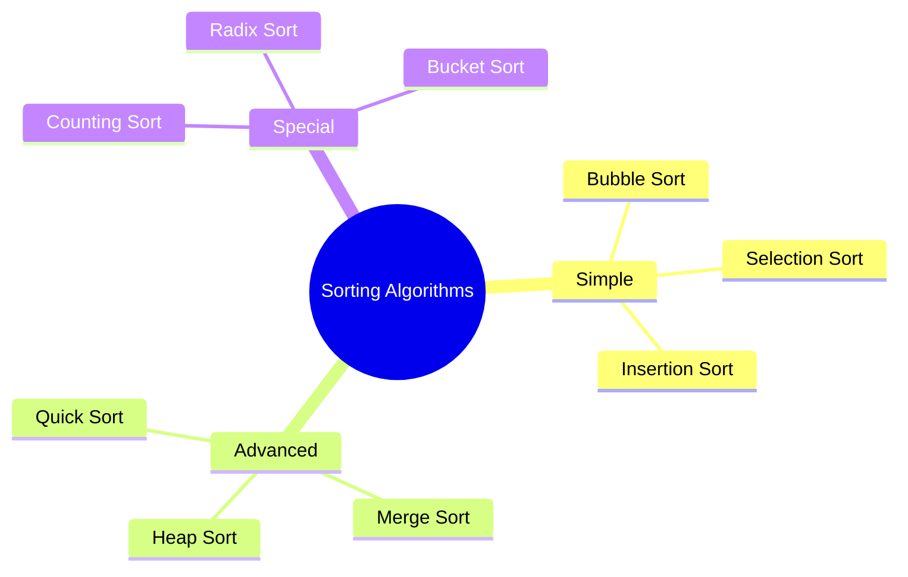

# Sorting Algorithms

[Back to Course Content](README.md) | [Previous: Graphs](graphs.md) | [Next: Searching Algorithms →](searching.md)

> Reference: This content is based on Simple-sorting.pdf and Advanced-sorting.pdf

## What are Sorting Algorithms?

Sorting algorithms are methods to arrange elements in a specific order (ascending or descending). They are fundamental to computer science and have various applications in data processing.



## Basic Sorting Algorithms

### 1. Bubble Sort

A simple sorting algorithm that repeatedly steps through the list, compares adjacent elements and swaps them if they are in the wrong order.

```java
public class BubbleSort {
    public void bubbleSort(int[] arr) {
        int n = arr.length;
        for (int i = 0; i < n - 1; i++) {
            for (int j = 0; j < n - i - 1; j++) {
                if (arr[j] > arr[j + 1]) {
                    // Swap elements
                    int temp = arr[j];
                    arr[j] = arr[j + 1];
                    arr[j + 1] = temp;
                }
            }
        }
    }

    // Optimized version with early termination
    public void optimizedBubbleSort(int[] arr) {
        int n = arr.length;
        boolean swapped;
        for (int i = 0; i < n - 1; i++) {
            swapped = false;
            for (int j = 0; j < n - i - 1; j++) {
                if (arr[j] > arr[j + 1]) {
                    // Swap elements
                    int temp = arr[j];
                    arr[j] = arr[j + 1];
                    arr[j + 1] = temp;
                    swapped = true;
                }
            }
            if (!swapped) {
                break; // Array is sorted
            }
        }
    }
}
```

### 2. Selection Sort

An in-place comparison sorting algorithm that divides the input list into a sorted and an unsorted region.

```java
public class SelectionSort {
    public void selectionSort(int[] arr) {
        int n = arr.length;
        for (int i = 0; i < n - 1; i++) {
            // Find minimum element in unsorted array
            int minIdx = i;
            for (int j = i + 1; j < n; j++) {
                if (arr[j] < arr[minIdx]) {
                    minIdx = j;
                }
            }
            // Swap found minimum with first element
            int temp = arr[minIdx];
            arr[minIdx] = arr[i];
            arr[i] = temp;
        }
    }
}
```

### 3. Insertion Sort

A simple sorting algorithm that builds the final sorted array one item at a time.

```java
public class InsertionSort {
    public void insertionSort(int[] arr) {
        int n = arr.length;
        for (int i = 1; i < n; i++) {
            int key = arr[i];
            int j = i - 1;

            // Move elements that are greater than key
            // to one position ahead of their current position
            while (j >= 0 && arr[j] > key) {
                arr[j + 1] = arr[j];
                j = j - 1;
            }
            arr[j + 1] = key;
        }
    }
}
```

## Advanced Sorting Algorithms

### 1. Quick Sort

A divide-and-conquer algorithm that picks a 'pivot' element and partitions the array around it.

```java
public class QuickSort {
    public void quickSort(int[] arr) {
        quickSort(arr, 0, arr.length - 1);
    }

    private void quickSort(int[] arr, int low, int high) {
        if (low < high) {
            int pi = partition(arr, low, high);
            quickSort(arr, low, pi - 1);
            quickSort(arr, pi + 1, high);
        }
    }

    private int partition(int[] arr, int low, int high) {
        int pivot = arr[high];
        int i = (low - 1);

        for (int j = low; j < high; j++) {
            if (arr[j] <= pivot) {
                i++;
                // Swap elements
                int temp = arr[i];
                arr[i] = arr[j];
                arr[j] = temp;
            }
        }

        // Place pivot in correct position
        int temp = arr[i + 1];
        arr[i + 1] = arr[high];
        arr[high] = temp;

        return i + 1;
    }
}
```

### 2. Merge Sort

A divide-and-conquer algorithm that divides the input array into two halves, recursively sorts them, and then merges the sorted halves.

```java
public class MergeSort {
    public void mergeSort(int[] arr) {
        mergeSort(arr, 0, arr.length - 1);
    }

    private void mergeSort(int[] arr, int left, int right) {
        if (left < right) {
            int mid = left + (right - left) / 2;
            mergeSort(arr, left, mid);
            mergeSort(arr, mid + 1, right);
            merge(arr, left, mid, right);
        }
    }

    private void merge(int[] arr, int left, int mid, int right) {
        int n1 = mid - left + 1;
        int n2 = right - mid;

        // Create temp arrays
        int[] leftArr = new int[n1];
        int[] rightArr = new int[n2];

        // Copy data to temp arrays
        for (int i = 0; i < n1; i++) {
            leftArr[i] = arr[left + i];
        }
        for (int j = 0; j < n2; j++) {
            rightArr[j] = arr[mid + 1 + j];
        }

        // Merge the temp arrays
        int i = 0, j = 0;
        int k = left;
        while (i < n1 && j < n2) {
            if (leftArr[i] <= rightArr[j]) {
                arr[k] = leftArr[i];
                i++;
            } else {
                arr[k] = rightArr[j];
                j++;
            }
            k++;
        }

        // Copy remaining elements
        while (i < n1) {
            arr[k] = leftArr[i];
            i++;
            k++;
        }
        while (j < n2) {
            arr[k] = rightArr[j];
            j++;
            k++;
        }
    }
}
```

### 3. Heap Sort

A comparison-based sorting algorithm that uses a binary heap data structure.

```java
public class HeapSort {
    public void heapSort(int[] arr) {
        int n = arr.length;

        // Build heap (rearrange array)
        for (int i = n / 2 - 1; i >= 0; i--) {
            heapify(arr, n, i);
        }

        // One by one extract an element from heap
        for (int i = n - 1; i > 0; i--) {
            // Move current root to end
            int temp = arr[0];
            arr[0] = arr[i];
            arr[i] = temp;

            // Call max heapify on the reduced heap
            heapify(arr, i, 0);
        }
    }

    private void heapify(int[] arr, int n, int i) {
        int largest = i;
        int left = 2 * i + 1;
        int right = 2 * i + 2;

        // If left child is larger than root
        if (left < n && arr[left] > arr[largest]) {
            largest = left;
        }

        // If right child is larger than largest so far
        if (right < n && arr[right] > arr[largest]) {
            largest = right;
        }

        // If largest is not root
        if (largest != i) {
            int temp = arr[i];
            arr[i] = arr[largest];
            arr[largest] = temp;

            // Recursively heapify the affected sub-tree
            heapify(arr, n, largest);
        }
    }
}
```

## Special Sorting Algorithms

### 1. Counting Sort

A sorting algorithm that works by counting the number of objects having distinct key values.

```java
public class CountingSort {
    public void countingSort(int[] arr) {
        int n = arr.length;
        int max = arr[0];
        
        // Find maximum element
        for (int i = 1; i < n; i++) {
            if (arr[i] > max) {
                max = arr[i];
            }
        }

        // Create count array
        int[] count = new int[max + 1];
        for (int i = 0; i < n; i++) {
            count[arr[i]]++;
        }

        // Modify count array to store actual positions
        for (int i = 1; i <= max; i++) {
            count[i] += count[i - 1];
        }

        // Create output array
        int[] output = new int[n];
        for (int i = n - 1; i >= 0; i--) {
            output[count[arr[i]] - 1] = arr[i];
            count[arr[i]]--;
        }

        // Copy output array to original array
        for (int i = 0; i < n; i++) {
            arr[i] = output[i];
        }
    }
}
```

### 2. Radix Sort

A non-comparative sorting algorithm that sorts numbers by processing individual digits.

```java
public class RadixSort {
    public void radixSort(int[] arr) {
        int max = arr[0];
        for (int i = 1; i < arr.length; i++) {
            if (arr[i] > max) {
                max = arr[i];
            }
        }

        // Do counting sort for every digit
        for (int exp = 1; max / exp > 0; exp *= 10) {
            countingSortForRadix(arr, exp);
        }
    }

    private void countingSortForRadix(int[] arr, int exp) {
        int n = arr.length;
        int[] output = new int[n];
        int[] count = new int[10];

        // Store count of occurrences in count[]
        for (int i = 0; i < n; i++) {
            count[(arr[i] / exp) % 10]++;
        }

        // Change count[i] so that count[i] contains actual
        // position of this digit in output[]
        for (int i = 1; i < 10; i++) {
            count[i] += count[i - 1];
        }

        // Build the output array
        for (int i = n - 1; i >= 0; i--) {
            output[count[(arr[i] / exp) % 10] - 1] = arr[i];
            count[(arr[i] / exp) % 10]--;
        }

        // Copy the output array to arr[]
        for (int i = 0; i < n; i++) {
            arr[i] = output[i];
        }
    }
}
```

## Performance Comparison

| Algorithm | Time Complexity | Space Complexity | Stable | In-Place |
|-----------|----------------|------------------|---------|-----------|
| Bubble Sort | O(n²) | O(1) | Yes | Yes |
| Selection Sort | O(n²) | O(1) | No | Yes |
| Insertion Sort | O(n²) | O(1) | Yes | Yes |
| Quick Sort | O(n log n) | O(log n) | No | Yes |
| Merge Sort | O(n log n) | O(n) | Yes | No |
| Heap Sort | O(n log n) | O(1) | No | Yes |
| Counting Sort | O(n + k) | O(k) | Yes | No |
| Radix Sort | O(d(n + k)) | O(n + k) | Yes | No |

## Best Practices

1. **Algorithm Selection**
   - Consider data size
   - Consider data characteristics
   - Consider stability requirements
   - Consider space constraints

2. **Implementation**
   - Handle edge cases
   - Optimize for specific use cases
   - Consider parallel processing
   - Use appropriate data structures

3. **Performance**
   - Monitor time complexity
   - Consider space complexity
   - Profile for bottlenecks
   - Optimize critical paths

## Common Pitfalls

1. **Implementation Issues**
   - Off-by-one errors
   - Array bounds
   - Memory leaks
   - Infinite loops

2. **Performance Issues**
   - Poor pivot selection
   - Unbalanced partitions
   - Excessive recursion
   - Memory overhead

3. **Edge Cases**
   - Empty arrays
   - Single element
   - Already sorted
   - Reverse sorted

## Exercises

1. Implement bubble sort with optimization
2. Create merge sort with parallel processing
3. Design quick sort with different pivot strategies
4. Write counting sort for strings
5. Implement radix sort for floating-point numbers

## Additional Resources

- [GeeksforGeeks - Sorting Algorithms](https://www.geeksforgeeks.org/sorting-algorithms/)
- [Visualgo - Sorting](https://visualgo.net/en/sorting)
- [Sorting Algorithm Animations](https://www.toptal.com/developers/sorting-algorithms)
- [Algorithms in Java](https://algs4.cs.princeton.edu/21elementary/) 