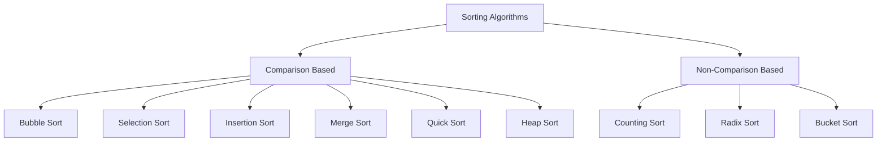

# Sorting Algorithms

[Back to Course Content](README.md) | [← Previous: Graphs](graphs.md) | [Next: Searching Algorithms →](searching.md)

## Introduction to Sorting

Sorting is the process of arranging data in a specific order, typically ascending or descending. Different sorting algorithms have different characteristics and use cases.

### Sorting Algorithm Characteristics



### Algorithm Comparison

| Algorithm | Time Complexity | Space Complexity | Stability | In-Place |
|-----------|----------------|------------------|-----------|----------|
| Bubble Sort | O(n²) | O(1) | Yes | Yes |
| Selection Sort | O(n²) | O(1) | No | Yes |
| Insertion Sort | O(n²) | O(1) | Yes | Yes |
| Merge Sort | O(n log n) | O(n) | Yes | No |
| Quick Sort | O(n log n) | O(log n) | No | Yes |
| Heap Sort | O(n log n) | O(1) | No | Yes |
| Counting Sort | O(n + k) | O(k) | Yes | No |
| Radix Sort | O(d(n + k)) | O(n + k) | Yes | No |
| Bucket Sort | O(n + k) | O(n + k) | Yes | No |

## Comparison-Based Sorting

### 1. Bubble Sort

```python
def bubble_sort(arr):
    n = len(arr)
    for i in range(n):
        # Flag to optimize if array is already sorted
        swapped = False
        
        for j in range(0, n - i - 1):
            if arr[j] > arr[j + 1]:
                arr[j], arr[j + 1] = arr[j + 1], arr[j]
                swapped = True
        
        if not swapped:
            break
    return arr
```

### 2. Selection Sort

```python
def selection_sort(arr):
    n = len(arr)
    for i in range(n):
        min_idx = i
        for j in range(i + 1, n):
            if arr[j] < arr[min_idx]:
                min_idx = j
        arr[i], arr[min_idx] = arr[min_idx], arr[i]
    return arr
```

### 3. Insertion Sort

```python
def insertion_sort(arr):
    for i in range(1, len(arr)):
        key = arr[i]
        j = i - 1
        
        # Move elements that are greater than key
        # to one position ahead of their current position
        while j >= 0 and arr[j] > key:
            arr[j + 1] = arr[j]
            j -= 1
        arr[j + 1] = key
    return arr
```

### 4. Merge Sort

```python
def merge_sort(arr):
    if len(arr) <= 1:
        return arr
    
    mid = len(arr) // 2
    left = merge_sort(arr[:mid])
    right = merge_sort(arr[mid:])
    
    return merge(left, right)

def merge(left, right):
    result = []
    i = j = 0
    
    while i < len(left) and j < len(right):
        if left[i] <= right[j]:
            result.append(left[i])
            i += 1
        else:
            result.append(right[j])
            j += 1
    
    result.extend(left[i:])
    result.extend(right[j:])
    return result
```

### 5. Quick Sort

```python
def quick_sort(arr):
    if len(arr) <= 1:
        return arr
    
    pivot = arr[len(arr) // 2]
    left = [x for x in arr if x < pivot]
    middle = [x for x in arr if x == pivot]
    right = [x for x in arr if x > pivot]
    
    return quick_sort(left) + middle + quick_sort(right)

# In-place Quick Sort
def quick_sort_inplace(arr, low=None, high=None):
    if low is None:
        low = 0
    if high is None:
        high = len(arr) - 1
    
    if low < high:
        pivot_idx = partition(arr, low, high)
        quick_sort_inplace(arr, low, pivot_idx - 1)
        quick_sort_inplace(arr, pivot_idx + 1, high)
    return arr

def partition(arr, low, high):
    pivot = arr[high]
    i = low - 1
    
    for j in range(low, high):
        if arr[j] <= pivot:
            i += 1
            arr[i], arr[j] = arr[j], arr[i]
    arr[i + 1], arr[high] = arr[high], arr[i + 1]
    return i + 1
```

### 6. Heap Sort

```python
def heap_sort(arr):
    n = len(arr)
    
    # Build max heap
    for i in range(n // 2 - 1, -1, -1):
        heapify(arr, n, i)
    
    # Extract elements from heap one by one
    for i in range(n - 1, 0, -1):
        arr[0], arr[i] = arr[i], arr[0]
        heapify(arr, i, 0)
    
    return arr

def heapify(arr, n, i):
    largest = i
    left = 2 * i + 1
    right = 2 * i + 2
    
    if left < n and arr[left] > arr[largest]:
        largest = left
    
    if right < n and arr[right] > arr[largest]:
        largest = right
    
    if largest != i:
        arr[i], arr[largest] = arr[largest], arr[i]
        heapify(arr, n, largest)
```

## Non-Comparison Based Sorting

### 1. Counting Sort

```python
def counting_sort(arr):
    if not arr:
        return arr
    
    # Find range of input array
    max_val = max(arr)
    min_val = min(arr)
    range_val = max_val - min_val + 1
    
    # Initialize count array
    count = [0] * range_val
    output = [0] * len(arr)
    
    # Store count of each element
    for i in range(len(arr)):
        count[arr[i] - min_val] += 1
    
    # Modify count array to store actual positions
    for i in range(1, len(count)):
        count[i] += count[i - 1]
    
    # Build output array
    for i in range(len(arr) - 1, -1, -1):
        output[count[arr[i] - min_val] - 1] = arr[i]
        count[arr[i] - min_val] -= 1
    
    return output
```

### 2. Radix Sort

```python
def counting_sort_for_radix(arr, exp):
    n = len(arr)
    output = [0] * n
    count = [0] * 10
    
    for i in range(n):
        index = arr[i] // exp
        count[index % 10] += 1
    
    for i in range(1, 10):
        count[i] += count[i - 1]
    
    for i in range(n - 1, -1, -1):
        index = arr[i] // exp
        output[count[index % 10] - 1] = arr[i]
        count[index % 10] -= 1
    
    for i in range(n):
        arr[i] = output[i]

def radix_sort(arr):
    if not arr:
        return arr
    
    max_val = max(arr)
    exp = 1
    
    while max_val // exp > 0:
        counting_sort_for_radix(arr, exp)
        exp *= 10
    
    return arr
```

### 3. Bucket Sort

```python
def bucket_sort(arr):
    if not arr:
        return arr
    
    # Create buckets
    n = len(arr)
    buckets = [[] for _ in range(n)]
    
    # Put array elements in different buckets
    for i in range(n):
        index = int(n * arr[i])
        buckets[index].append(arr[i])
    
    # Sort individual buckets
    for i in range(n):
        buckets[i].sort()
    
    # Concatenate all buckets into arr
    index = 0
    for i in range(n):
        for j in range(len(buckets[i])):
            arr[index] = buckets[i][j]
            index += 1
    
    return arr
```

## Real-World Applications

### 1. Database Systems
- Index creation
- Query optimization
- Data organization
- Cache management

### 2. Operating Systems
- Process scheduling
- File system organization
- Memory management
- Task prioritization

### 3. Search Engines
- Result ranking
- Document indexing
- Cache management
- Query optimization

### 4. Data Analysis
- Statistical analysis
- Data visualization
- Pattern recognition
- Machine learning

## Implementation Considerations

### Memory Management
1. In-place vs extra space
2. Cache efficiency
3. Memory allocation
4. Garbage collection

### Performance Optimization
1. Algorithm selection
2. Data structure choice
3. Parallel processing
4. Cache utilization

## Best Practices

### Algorithm Selection
1. Consider data size
2. Evaluate data characteristics
3. Assess memory constraints
4. Consider stability requirements

### Implementation
1. Handle edge cases
2. Optimize for specific data
3. Consider space constraints
4. Implement proper error handling

## Summary

Key points to remember:
1. Different algorithms for different needs
2. Time vs space trade-offs
3. Stability considerations
4. In-place vs extra space
5. Data characteristics matter
6. Choose based on requirements

By understanding sorting algorithms, you can:
- Optimize data organization
- Improve search efficiency
- Enhance system performance
- Solve complex problems
- Design efficient algorithms 