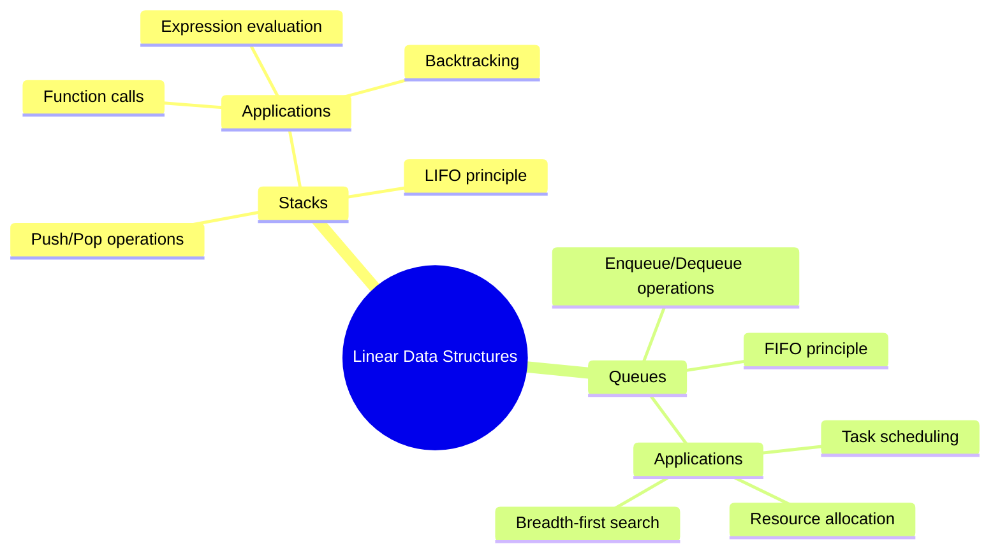
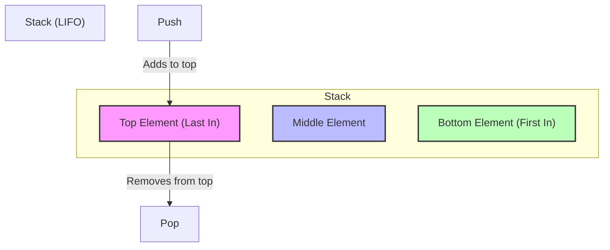
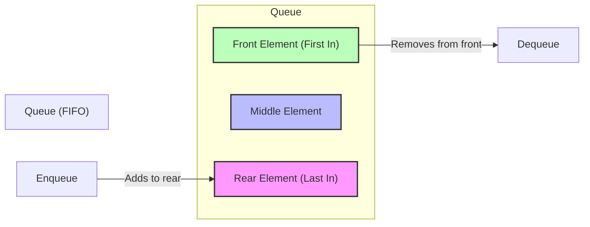

# Stacks and Queues

[Back to Course Content](README.md) | [Previous: Arrays and Linked Lists](arrays-and-linked-lists.md) | [Next: Trees →](trees.md)

> Reference: This content is based on Stacks.pdf and Queues.pdf

## What are Stacks and Queues?

Stacks and Queues are fundamental linear data structures that follow specific access patterns for adding and removing elements. They are abstract data types (ADTs) that define operations rather than implementations, making them versatile tools in algorithm design and system architecture.

### Key Characteristics

- **Order of Operations**: Both maintain a strict order for element access
- **Restricted Access**: Elements can only be accessed at specific positions
- **Dynamic Size**: Can grow and shrink as needed during execution
- **Fundamental Building Blocks**: Used to implement more complex data structures and algorithms



### Mathematical Foundation

Both stacks and queues can be formally defined using mathematical structures:

- **Stack**: A sequence of elements (a₁, a₂, ..., aₙ) where insertions and deletions occur at the same end
- **Queue**: A sequence of elements (a₁, a₂, ..., aₙ) where insertions occur at one end and deletions at the other

### Comparison with Other Data Structures

| Data Structure | Access Pattern | Insertion | Deletion | Memory Layout | Use Case |
|----------------|----------------|-----------|----------|---------------|----------|
| Stack | LIFO | O(1) | O(1) | Contiguous or linked | Function calls, depth-first traversal |
| Queue | FIFO | O(1) | O(1) | Linked or circular array | Task scheduling, breadth-first traversal |
| Array | Random | O(1) at end, O(n) otherwise | O(n) | Contiguous | Direct access, sequential processing |
| Linked List | Sequential | O(1) | O(1) with pointer | Linked | Dynamic collections, unknown size |

## Stacks

### What is a Stack?

A stack is a Last-In-First-Out (LIFO) data structure that models a real-world stack of objects. Elements are inserted and removed from the same end, called the "top" of the stack. The most recently added element is always the first one to be removed.

#### Formal Definition

A stack S of size n is a collection of elements with operations that satisfy the following properties:
- S has elements [a₁, a₂, ..., aₙ] where aₙ is the top element
- `push(S, x)` adds element x to become the new top of S
- `pop(S)` removes and returns the top element aₙ from S
- `peek(S)` or `top(S)` returns the top element aₙ without removing it

#### Visualization



#### Characteristics

- **LIFO Principle**: Last element added is first to be removed
- **Single Access Point**: Only top element is accessible
- **Limited Operations**: Push (add) and Pop (remove) only
- **Dynamic Size**: Can grow and shrink as needed
- **Fast Operations**: Constant time complexity for all basic operations

### Stack Operations

| Operation | Time Complexity | Space Complexity | Description |
|-----------|----------------|-----------------|-------------|
| Push | O(1) | O(1) | Add element to top |
| Pop | O(1) | O(1) | Remove top element |
| Peek/Top | O(1) | O(1) | View top element without removing |
| IsEmpty | O(1) | O(1) | Check if stack is empty |
| Size | O(1) | O(1) | Get number of elements |

### Implementation Approaches

Stacks can be implemented using different underlying data structures:

#### 1. Array-based Implementation

Arrays offer contiguous memory layout with excellent cache locality but may require resizing.

```java
public class ArrayStack<T> {
    private T[] array;
    private int top;
    private static final int DEFAULT_CAPACITY = 10;
    
    @SuppressWarnings("unchecked")
    public ArrayStack() {
        array = (T[]) new Object[DEFAULT_CAPACITY];
        top = -1;
    }
    
    public void push(T data) {
        if (top == array.length - 1) {
            resize();
        }
        array[++top] = data;
    }
    
    public T pop() {
        if (isEmpty()) {
            throw new EmptyStackException();
        }
        T data = array[top];
        array[top--] = null; // Help garbage collection
        return data;
    }
    
    public T peek() {
        if (isEmpty()) {
            throw new EmptyStackException();
        }
        return array[top];
    }
    
    public boolean isEmpty() {
        return top == -1;
    }
    
    public int size() {
        return top + 1;
    }
    
    @SuppressWarnings("unchecked")
    private void resize() {
        T[] newArray = (T[]) new Object[array.length * 2];
        System.arraycopy(array, 0, newArray, 0, array.length);
        array = newArray;
    }
}
```

**Advantages:**
- Better memory locality and cache performance
- Less overhead per element
- Predictable growth pattern

**Disadvantages:**
- Requires resizing when capacity is reached
- Fixed capacity if not dynamic
- Potential for unused space

#### 2. Linked List-based Implementation

Linked lists offer dynamic memory allocation with no need for resizing.

```java
public class Stack<T> {
    private static class Node<T> {
        T data;
        Node<T> next;

        Node(T data) {
            this.data = data;
            this.next = null;
        }
    }

    private Node<T> top;
    private int size;

    public Stack() {
        top = null;
        size = 0;
    }

    public void push(T data) {
        Node<T> newNode = new Node<>(data);
        newNode.next = top;
        top = newNode;
        size++;
    }

    public T pop() {
        if (isEmpty()) {
            throw new EmptyStackException();
        }
        T data = top.data;
        top = top.next;
        size--;
        return data;
    }

    public T peek() {
        if (isEmpty()) {
            throw new EmptyStackException();
        }
        return top.data;
    }

    public boolean isEmpty() {
        return top == null;
    }

    public int size() {
        return size;
    }
}
```

**Advantages:**
- Dynamic size with no manual resizing
- Memory efficient for sparse stacks
- No wasted space

**Disadvantages:**
- Extra memory overhead per element (next pointers)
- Poorer cache locality
- Higher memory usage for small stacks

#### 3. Specialized Implementations

For specific use cases, specialized implementations may be more efficient:

```java
// Thread-safe stack implementation
public class ConcurrentStack<T> {
    private final AtomicReference<Node<T>> top = new AtomicReference<>();
    private final AtomicInteger size = new AtomicInteger();
    
    private static class Node<T> {
        final T data;
        Node<T> next;
        
        Node(T data) {
            this.data = data;
        }
    }
    
    public void push(T data) {
        Node<T> newNode = new Node<>(data);
        Node<T> oldTop;
        do {
            oldTop = top.get();
            newNode.next = oldTop;
        } while (!top.compareAndSet(oldTop, newNode));
        size.incrementAndGet();
    }
    
    public T pop() {
        Node<T> oldTop;
        Node<T> newTop;
        do {
            oldTop = top.get();
            if (oldTop == null) {
                throw new EmptyStackException();
            }
            newTop = oldTop.next;
        } while (!top.compareAndSet(oldTop, newTop));
        size.decrementAndGet();
        return oldTop.data;
    }
    
    // Other methods similar to previous implementations
}
```

### Real-World Applications

#### 1. Function Call Stack

The function call stack keeps track of function calls and their local variables in programming languages.

```java
// Example of function call stack in recursion
public int factorial(int n) {
    // Base case
    if (n <= 1) {
        return 1;
    }
    // Recursive case adds a new frame to the call stack
    return n * factorial(n - 1);
}
```

**Stack Frames in Factorial(4):**
1. factorial(4) calls factorial(3) → Stack: [factorial(4)]
2. factorial(3) calls factorial(2) → Stack: [factorial(4), factorial(3)]
3. factorial(2) calls factorial(1) → Stack: [factorial(4), factorial(3), factorial(2)]
4. factorial(1) returns 1 → Stack: [factorial(4), factorial(3), factorial(2)]
5. factorial(2) returns 2 → Stack: [factorial(4), factorial(3)]
6. factorial(3) returns 6 → Stack: [factorial(4)]
7. factorial(4) returns 24 → Stack: []

#### 2. Expression Evaluation

Stacks efficiently evaluate arithmetic expressions, particularly for converting between infix, postfix, and prefix notations.

```java
// Infix to postfix conversion
public String infixToPostfix(String infix) {
    Stack<Character> stack = new Stack<>();
    StringBuilder postfix = new StringBuilder();
    
    for (char c : infix.toCharArray()) {
        // If character is operand, add to output
        if (Character.isLetterOrDigit(c)) {
            postfix.append(c);
        }
        // If '(', push to stack
        else if (c == '(') {
            stack.push(c);
        }
        // If ')', pop and add to output until '(' is found
        else if (c == ')') {
            while (!stack.isEmpty() && stack.peek() != '(') {
                postfix.append(stack.pop());
            }
            // Remove '(' from stack
            if (!stack.isEmpty() && stack.peek() == '(') {
                stack.pop();
            }
        }
        // If operator, compare precedence and add to output or push to stack
        else {
            while (!stack.isEmpty() && precedence(c) <= precedence(stack.peek())) {
                postfix.append(stack.pop());
            }
            stack.push(c);
        }
    }
    
    // Pop all remaining operators from stack
    while (!stack.isEmpty()) {
        postfix.append(stack.pop());
    }
    
    return postfix.toString();
}

private int precedence(char ch) {
    switch (ch) {
        case '+':
        case '-':
            return 1;
        case '*':
        case '/':
            return 2;
        case '^':
            return 3;
    }
    return -1;
}
```

**Process for converting "a+b*c" to postfix:**
1. Scan 'a': Add to output → Output: "a"
2. Scan '+': Push to stack → Stack: [+], Output: "a"
3. Scan 'b': Add to output → Stack: [+], Output: "ab"
4. Scan '*': Push to stack (higher precedence) → Stack: [+, *], Output: "ab"
5. Scan 'c': Add to output → Stack: [+, *], Output: "abc"
6. End of expression: Pop all operators → Stack: [], Output: "abc*+"

#### 3. Backtracking Algorithms

Stacks naturally support backtracking in algorithms like depth-first search, maze solving, and constraint satisfaction problems.

```java
// Maze solving using stack-based DFS
public boolean solveMaze(int[][] maze, int startX, int startY, int endX, int endY) {
    int rows = maze.length;
    int cols = maze[0].length;
    boolean[][] visited = new boolean[rows][cols];
    
    // Directions: up, right, down, left
    int[] dx = {-1, 0, 1, 0};
    int[] dy = {0, 1, 0, -1};
    
    Stack<int[]> stack = new Stack<>();
    stack.push(new int[]{startX, startY});
    visited[startX][startY] = true;
    
    while (!stack.isEmpty()) {
        int[] current = stack.pop();
        int x = current[0];
        int y = current[1];
        
        // Check if we reached the end
        if (x == endX && y == endY) {
            return true;
        }
        
        // Try all four directions
        for (int i = 0; i < 4; i++) {
            int nx = x + dx[i];
            int ny = y + dy[i];
            
            // Check if new position is valid
            if (nx >= 0 && nx < rows && ny >= 0 && ny < cols && 
                maze[nx][ny] == 0 && !visited[nx][ny]) {
                stack.push(new int[]{nx, ny});
                visited[nx][ny] = true;
            }
        }
    }
    
    return false; // No path found
}
```

## Queues

### What is a Queue?

A queue is a First-In-First-Out (FIFO) data structure that models a real-world waiting line. Elements are inserted at one end (rear) and removed from the other end (front), ensuring that the element in the queue the longest is processed first.

#### Formal Definition

A queue Q of size n is a collection of elements with operations that satisfy the following properties:
- Q has elements [a₁, a₂, ..., aₙ] where a₁ is the front element and aₙ is the rear element
- `enqueue(Q, x)` adds element x to become the new rear of Q
- `dequeue(Q)` removes and returns the front element a₁ from Q
- `front(Q)` returns the front element a₁ without removing it

#### Visualization



#### Types of Queues

1. **Simple Queue**
   - Basic FIFO implementation
   - Single-ended queue
   - Elements added at rear, removed from front

2. **Circular Queue**
   - Fixed-size array implementation with wrapped indices
   - Efficient space utilization
   - Avoids shifting elements after dequeue

3. **Priority Queue**
   - Elements have an associated priority
   - Highest (or lowest) priority elements dequeued first
   - Not strictly FIFO, but based on priority

4. **Double-ended Queue (Deque)**
   - Add/remove from both ends
   - Combines stack and queue capabilities
   - More flexible than simple queue

### Queue Operations

| Operation | Time Complexity | Space Complexity | Description |
|-----------|----------------|-----------------|-------------|
| Enqueue | O(1) | O(1) | Add element to rear |
| Dequeue | O(1) | O(1) | Remove element from front |
| Front | O(1) | O(1) | View front element without removing |
| Rear | O(1) | O(1) | View rear element without removing |
| IsEmpty | O(1) | O(1) | Check if queue is empty |
| Size | O(1) | O(1) | Get number of elements |

### Implementation Approaches

#### 1. Array-based Implementation

Arrays can be used to implement queues with either shifting elements or using a circular approach.

```java
// Simple array-based queue (with shifting)
public class ArrayQueue<T> {
    private T[] array;
    private int size;
    private static final int DEFAULT_CAPACITY = 10;
    
    @SuppressWarnings("unchecked")
    public ArrayQueue() {
        array = (T[]) new Object[DEFAULT_CAPACITY];
        size = 0;
    }
    
    public void enqueue(T data) {
        if (size == array.length) {
            resize();
        }
        array[size++] = data;
    }
    
    public T dequeue() {
        if (isEmpty()) {
            throw new NoSuchElementException();
        }
        T data = array[0];
        // Shift all elements one position left
        for (int i = 0; i < size - 1; i++) {
            array[i] = array[i + 1];
        }
        array[--size] = null; // Help garbage collection
        return data;
    }
    
    public T peek() {
        if (isEmpty()) {
            throw new NoSuchElementException();
        }
        return array[0];
    }
    
    public boolean isEmpty() {
        return size == 0;
    }
    
    public int size() {
        return size;
    }
    
    @SuppressWarnings("unchecked")
    private void resize() {
        T[] newArray = (T[]) new Object[array.length * 2];
        System.arraycopy(array, 0, newArray, 0, array.length);
        array = newArray;
    }
}
```

**Circular Array Queue:**
A more efficient array-based queue implementation uses a circular approach to avoid shifting elements.

```java
public class CircularArrayQueue<T> {
    private T[] array;
    private int front;
    private int rear;
    private int size;
    private final int capacity;
    
    @SuppressWarnings("unchecked")
    public CircularArrayQueue(int capacity) {
        this.capacity = capacity;
        array = (T[]) new Object[capacity];
        front = 0;
        rear = -1;
        size = 0;
    }
    
    public void enqueue(T data) {
        if (isFull()) {
            resize();
        }
        rear = (rear + 1) % array.length;
        array[rear] = data;
        size++;
    }
    
    public T dequeue() {
        if (isEmpty()) {
            throw new NoSuchElementException();
        }
        T data = array[front];
        array[front] = null; // Help garbage collection
        front = (front + 1) % array.length;
        size--;
        return data;
    }
    
    public T peek() {
        if (isEmpty()) {
            throw new NoSuchElementException();
        }
        return array[front];
    }
    
    public boolean isEmpty() {
        return size == 0;
    }
    
    public boolean isFull() {
        return size == array.length;
    }
    
    public int size() {
        return size;
    }
    
    @SuppressWarnings("unchecked")
    private void resize() {
        T[] newArray = (T[]) new Object[array.length * 2];
        // Copy elements considering the circular nature
        for (int i = 0; i < size; i++) {
            newArray[i] = array[(front + i) % array.length];
        }
        array = newArray;
        front = 0;
        rear = size - 1;
    }
}
```

**Mathematical Analysis of Circular Queue Index Calculation:**

In a circular queue of capacity n:
- Next position after position i: (i + 1) % n
- Previous position before position i: (i + n - 1) % n
- Distance between positions i and j: (j - i + n) % n

#### 2. Linked List-based Implementation

Linked lists provide a natural way to implement queues with efficient operations.

```java
public class Queue<T> {
    private static class Node<T> {
        T data;
        Node<T> next;

        Node(T data) {
            this.data = data;
            this.next = null;
        }
    }

    private Node<T> front;
    private Node<T> rear;
    private int size;

    public Queue() {
        front = null;
        rear = null;
        size = 0;
    }

    public void enqueue(T data) {
        Node<T> newNode = new Node<>(data);
        if (isEmpty()) {
            front = newNode;
            rear = newNode;
        } else {
            rear.next = newNode;
            rear = newNode;
        }
        size++;
    }

    public T dequeue() {
        if (isEmpty()) {
            throw new NoSuchElementException();
        }
        T data = front.data;
        front = front.next;
        if (front == null) {
            rear = null;
        }
        size--;
        return data;
    }

    public T peek() {
        if (isEmpty()) {
            throw new NoSuchElementException();
        }
        return front.data;
    }

    public boolean isEmpty() {
        return front == null;
    }

    public int size() {
        return size;
    }
}
```

**Advantages of Linked Implementation:**
- Dynamic size without resizing overhead
- Constant time operations regardless of size
- No wasted space
- Easy implementation of deque

**Disadvantages:**
- Extra memory overhead for node pointers
- Poorer cache locality
- Not easily indexable

#### 3. Priority Queue Implementation

Priority queues arrange elements based on priority, not insertion order.

```java
public class PriorityQueue<T extends Comparable<T>> {
    // Heap-based priority queue
    private ArrayList<T> heap;
    
    public PriorityQueue() {
        heap = new ArrayList<>();
    }
    
    public void enqueue(T data) {
        // Add element at the end
        heap.add(data);
        // Bubble up to maintain heap property
        int index = heap.size() - 1;
        while (index > 0) {
            int parentIndex = (index - 1) / 2;
            // If parent has lower priority, swap
            if (heap.get(parentIndex).compareTo(heap.get(index)) > 0) {
                T temp = heap.get(index);
                heap.set(index, heap.get(parentIndex));
                heap.set(parentIndex, temp);
                // Move up to parent
                index = parentIndex;
            } else {
                break;
            }
        }
    }
    
    public T dequeue() {
        if (isEmpty()) {
            throw new NoSuchElementException();
        }
        
        // Get highest priority element
        T root = heap.get(0);
        
        // Replace root with last element
        T lastElement = heap.remove(heap.size() - 1);
        if (heap.isEmpty()) {
            return root;
        }
        
        heap.set(0, lastElement);
        
        // Sink down to maintain heap property
        int index = 0;
        while (true) {
            int leftChildIndex = 2 * index + 1;
            int rightChildIndex = 2 * index + 2;
            int smallest = index;
            
            // Find the smallest of parent, left child, and right child
            if (leftChildIndex < heap.size() && 
                heap.get(leftChildIndex).compareTo(heap.get(smallest)) < 0) {
                smallest = leftChildIndex;
            }
            
            if (rightChildIndex < heap.size() && 
                heap.get(rightChildIndex).compareTo(heap.get(smallest)) < 0) {
                smallest = rightChildIndex;
            }
            
            // If parent is the smallest, we're done
            if (smallest == index) {
                break;
            }
            
            // Swap with the smallest child
            T temp = heap.get(index);
            heap.set(index, heap.get(smallest));
            heap.set(smallest, temp);
            
            // Move down to the smallest child
            index = smallest;
        }
        
        return root;
    }
    
    public T peek() {
        if (isEmpty()) {
            throw new NoSuchElementException();
        }
        return heap.get(0);
    }
    
    public boolean isEmpty() {
        return heap.isEmpty();
    }
    
    public int size() {
        return heap.size();
    }
}
```

**Time Complexity Analysis:**
- Enqueue: O(log n) due to bubble-up operation
- Dequeue: O(log n) due to sink-down operation
- Peek: O(1)
- IsEmpty/Size: O(1)

#### 4. Double-ended Queue (Deque) Implementation

A deque allows adding and removing elements from both ends.

```java
public class Deque<T> {
    private static class Node<T> {
        T data;
        Node<T> prev;
        Node<T> next;
        
        Node(T data) {
            this.data = data;
            this.prev = null;
            this.next = null;
        }
    }
    
    private Node<T> front;
    private Node<T> rear;
    private int size;
    
    public Deque() {
        front = null;
        rear = null;
        size = 0;
    }
    
    public void addFirst(T data) {
        Node<T> newNode = new Node<>(data);
        if (isEmpty()) {
            front = newNode;
            rear = newNode;
        } else {
            newNode.next = front;
            front.prev = newNode;
            front = newNode;
        }
        size++;
    }
    
    public void addLast(T data) {
        Node<T> newNode = new Node<>(data);
        if (isEmpty()) {
            front = newNode;
            rear = newNode;
        } else {
            rear.next = newNode;
            newNode.prev = rear;
            rear = newNode;
        }
        size++;
    }
    
    public T removeFirst() {
        if (isEmpty()) {
            throw new NoSuchElementException();
        }
        T data = front.data;
        front = front.next;
        if (front == null) {
            rear = null;
        } else {
            front.prev = null;
        }
        size--;
        return data;
    }
    
    public T removeLast() {
        if (isEmpty()) {
            throw new NoSuchElementException();
        }
        T data = rear.data;
        rear = rear.prev;
        if (rear == null) {
            front = null;
        } else {
            rear.next = null;
        }
        size--;
        return data;
    }
    
    public T peekFirst() {
        if (isEmpty()) {
            throw new NoSuchElementException();
        }
        return front.data;
    }
    
    public T peekLast() {
        if (isEmpty()) {
            throw new NoSuchElementException();
        }
        return rear.data;
    }
    
    public boolean isEmpty() {
        return size == 0;
    }
    
    public int size() {
        return size;
    }
}
```

### Real-World Applications

#### 1. Operating Systems

Queues are fundamental in operating system design:

```java
// Simple process scheduler using priority queue
public class ProcessScheduler {
    private PriorityQueue<Process> readyQueue;
    
    static class Process implements Comparable<Process> {
        int pid;
        int priority;
        int burstTime;
        
        Process(int pid, int priority, int burstTime) {
            this.pid = pid;
            this.priority = priority;
            this.burstTime = burstTime;
        }
        
        @Override
        public int compareTo(Process other) {
            // Lower number means higher priority
            return this.priority - other.priority;
        }
    }
    
    public ProcessScheduler() {
        readyQueue = new PriorityQueue<>();
    }
    
    public void addProcess(Process process) {
        readyQueue.enqueue(process);
        System.out.println("Process " + process.pid + " added to ready queue");
    }
    
    public void executeNextProcess() {
        if (readyQueue.isEmpty()) {
            System.out.println("No processes in ready queue");
            return;
        }
        
        Process next = readyQueue.dequeue();
        System.out.println("Executing process " + next.pid + 
                          " with priority " + next.priority + 
                          " and burst time " + next.burstTime);
        // Simulate execution
        System.out.println("Process " + next.pid + " completed execution");
    }
    
    public int getWaitingProcessCount() {
        return readyQueue.size();
    }
}
```

**Application Areas:**
- CPU Scheduling
- Printer Queue Management
- Device Request Handling
- Process Synchronization
- Interrupt Handling

#### 2. Breadth-First Search (BFS)

Queues are essential for BFS implementations:

```java
public class GraphBFS {
    private int vertices;
    private LinkedList<Integer>[] adjacencyList;
    
    @SuppressWarnings("unchecked")
    public GraphBFS(int vertices) {
        this.vertices = vertices;
        adjacencyList = new LinkedList[vertices];
        for (int i = 0; i < vertices; i++) {
            adjacencyList[i] = new LinkedList<>();
        }
    }
    
    public void addEdge(int source, int destination) {
        adjacencyList[source].add(destination);
    }
    
    public void breadthFirstSearch(int startVertex) {
        // Mark all vertices as not visited
        boolean[] visited = new boolean[vertices];
        
        // Create a queue for BFS
        Queue<Integer> queue = new LinkedList<>();
        
        // Mark the current node as visited and enqueue it
        visited[startVertex] = true;
        queue.add(startVertex);
        
        while (!queue.isEmpty()) {
            // Dequeue a vertex and print it
            int currentVertex = queue.poll();
            System.out.print(currentVertex + " ");
            
            // Get all adjacent vertices of the dequeued vertex
            // If an adjacent has not been visited, mark it visited and enqueue it
            for (Integer neighbor : adjacencyList[currentVertex]) {
                if (!visited[neighbor]) {
                    visited[neighbor] = true;
                    queue.add(neighbor);
                }
            }
        }
    }
}
```

**BFS Applications:**
- Shortest path in unweighted graphs
- Web crawlers
- Network broadcasting
- Garbage collection (mark-and-sweep)
- Finding connected components

#### 3. Cache Implementation (LRU Cache)

Modern computing systems use queues for cache management:

```java
public class LRUCache<K, V> {
    private final int capacity;
    private final Map<K, V> cache;
    private final Deque<K> recentlyUsed;
    
    public LRUCache(int capacity) {
        this.capacity = capacity;
        this.cache = new HashMap<>(capacity);
        this.recentlyUsed = new LinkedList<>();
    }
    
    public V get(K key) {
        if (!cache.containsKey(key)) {
            return null;
        }
        
        // Move the accessed key to the front of the deque
        recentlyUsed.remove(key);
        recentlyUsed.addFirst(key);
        
        return cache.get(key);
    }
    
    public void put(K key, V value) {
        // If key already exists, update the value and move to front
        if (cache.containsKey(key)) {
            cache.put(key, value);
            recentlyUsed.remove(key);
            recentlyUsed.addFirst(key);
            return;
        }
        
        // If cache is full, remove the least recently used item
        if (cache.size() >= capacity) {
            K leastUsed = recentlyUsed.removeLast();
            cache.remove(leastUsed);
        }
        
        // Add new key-value pair
        cache.put(key, value);
        recentlyUsed.addFirst(key);
    }
    
    public int size() {
        return cache.size();
    }
}
```

## Advanced Stack and Queue Implementations

### 1. Stack Implementation using Queue

This approach demonstrates how one data structure can be implemented using another with different properties.

```java
public class StackUsingQueue<T> {
    // Method 1: Making push operation costly
    private Queue<T> q1; // Main queue
    private Queue<T> q2; // Auxiliary queue
    
    public StackUsingQueue() {
        q1 = new LinkedList<>();
        q2 = new LinkedList<>();
    }
    
    // O(n) time complexity
    public void push(T data) {
        // Move all elements from q1 to q2
        while (!q1.isEmpty()) {
            q2.add(q1.remove());
        }
        
        // Add new element to q1
        q1.add(data);
        
        // Move all elements back from q2 to q1
        while (!q2.isEmpty()) {
            q1.add(q2.remove());
        }
    }
    
    // O(1) time complexity
    public T pop() {
        if (q1.isEmpty()) {
            throw new EmptyStackException();
        }
        return q1.remove();
    }
    
    public T peek() {
        if (q1.isEmpty()) {
            throw new EmptyStackException();
        }
        return q1.peek();
    }
    
    public boolean isEmpty() {
        return q1.isEmpty();
    }
    
    public int size() {
        return q1.size();
    }
}

// Alternative implementation: Making pop operation costly
public class StackUsingQueue2<T> {
    private Queue<T> q1;
    private Queue<T> q2;
    
    public StackUsingQueue2() {
        q1 = new LinkedList<>();
        q2 = new LinkedList<>();
    }
    
    // O(1) time complexity
    public void push(T data) {
        q1.add(data);
    }
    
    // O(n) time complexity
    public T pop() {
        if (q1.isEmpty()) {
            throw new EmptyStackException();
        }
        
        // Move all elements except the last from q1 to q2
        while (q1.size() > 1) {
            q2.add(q1.remove());
        }
        
        // Get the last element from q1
        T result = q1.remove();
        
        // Swap q1 and q2
        Queue<T> temp = q1;
        q1 = q2;
        q2 = temp;
        
        return result;
    }
    
    // Other methods similar to the first implementation
}
```

### 2. Queue Implementation using Stack

Similarly, queues can be implemented using stacks.

```java
public class QueueUsingStack<T> {
    private Stack<T> s1; // For enqueue
    private Stack<T> s2; // For dequeue
    
    public QueueUsingStack() {
        s1 = new Stack<>();
        s2 = new Stack<>();
    }
    
    // O(1) time complexity
    public void enqueue(T data) {
        s1.push(data);
    }
    
    // Amortized O(1) time complexity
    public T dequeue() {
        if (isEmpty()) {
            throw new NoSuchElementException();
        }
        
        // If s2 is empty, transfer all elements from s1
        if (s2.isEmpty()) {
            while (!s1.isEmpty()) {
                s2.push(s1.pop());
            }
        }
        
        return s2.pop();
    }
    
    public T peek() {
        if (isEmpty()) {
            throw new NoSuchElementException();
        }
        
        if (s2.isEmpty()) {
            while (!s1.isEmpty()) {
                s2.push(s1.pop());
            }
        }
        
        return s2.peek();
    }
    
    public boolean isEmpty() {
        return s1.isEmpty() && s2.isEmpty();
    }
    
    public int size() {
        return s1.size() + s2.size();
    }
}
```

## Performance Optimization

### Space Efficiency

1. **Memory Management**
   - Use array-based implementations for small, fixed-size stacks/queues
   - Use linked implementations for dynamic, unpredictable sizes
   - Consider custom allocators for high-performance scenarios
   - Tune initial capacity and growth factors for array-based implementations

2. **Serialization Considerations**
   - Implement custom serialization for improved persistence
   - Use compact data formats for large collections
   - Consider memory-mapped files for very large stacks/queues

### Time Efficiency

1. **Cache Optimization**
   - Use contiguous memory (arrays) for better cache locality
   - Process elements in batches to amortize overhead
   - Align data structures to cache line boundaries
   - Minimize pointer chasing in linked implementations

2. **Algorithmic Improvements**
   - Use lazy operations where appropriate
   - Implement specialized versions for specific element types
   - Consider lock-free algorithms for concurrent scenarios
   - Adapt implementation based on workload characteristics

### Concurrent Implementations

1. **Lock-based Approaches**

```java
public class ThreadSafeQueue<T> {
    private final Queue<T> queue;
    private final ReentrantLock lock = new ReentrantLock();
    
    public ThreadSafeQueue() {
        queue = new LinkedList<>();
    }
    
    public void enqueue(T item) {
        lock.lock();
        try {
            queue.add(item);
        } finally {
            lock.unlock();
        }
    }
    
    public T dequeue() {
        lock.lock();
        try {
            if (queue.isEmpty()) {
                throw new NoSuchElementException();
            }
            return queue.remove();
        } finally {
            lock.unlock();
        }
    }
    
    // Other methods similarly protected by lock
}
```

2. **Lock-free Approaches**

```java
public class LockFreeStack<T> {
    private final AtomicReference<Node<T>> top = new AtomicReference<>(null);
    
    private static class Node<T> {
        private final T item;
        private Node<T> next;
        
        public Node(T item) {
            this.item = item;
        }
    }
    
    public void push(T item) {
        Node<T> newHead = new Node<>(item);
        Node<T> oldHead;
        do {
            oldHead = top.get();
            newHead.next = oldHead;
        } while (!top.compareAndSet(oldHead, newHead));
    }
    
    public T pop() {
        Node<T> oldHead;
        Node<T> newHead;
        do {
            oldHead = top.get();
            if (oldHead == null) {
                throw new EmptyStackException();
            }
            newHead = oldHead.next;
        } while (!top.compareAndSet(oldHead, newHead));
        return oldHead.item;
    }
    
    public boolean isEmpty() {
        return top.get() == null;
    }
}
```

## Common Pitfalls and Best Practices

### Stack Pitfalls

1. **Stack Overflow**
   - **Symptom**: Application crashes with StackOverflowError
   - **Cause**: Excessive recursive calls or very deep call hierarchies
   - **Solution**: Use tail recursion, iteration, or increase stack size

2. **Memory Leaks**
   - **Symptom**: Increasing memory usage over time
   - **Cause**: References not properly cleared when elements are popped
   - **Solution**: Null out references when popping elements

3. **Thread Safety Issues**
   - **Symptom**: Inconsistent state or lost updates in multi-threaded scenarios
   - **Cause**: Concurrent access without proper synchronization
   - **Solution**: Use synchronized wrappers or concurrent implementations

### Queue Pitfalls

1. **Unbounded Growth**
   - **Symptom**: Out-of-memory errors
   - **Cause**: Producers adding elements faster than consumers can process
   - **Solution**: Implement bounded queues with backpressure mechanisms

2. **Circular Queue Edge Cases**
   - **Symptom**: Queue is reported full when it's not, or elements are overwritten
   - **Cause**: Incorrect front/rear pointer handling
   - **Solution**: Carefully test with various states (empty, full, one element)

3. **Priority Inversion**
   - **Symptom**: High-priority tasks wait while low-priority tasks execute
   - **Cause**: Resource contention in multi-priority scheduling
   - **Solution**: Use priority inheritance or ceiling protocols

### Best Practices

1. **Interface Design**
   - Define clear responsibilities and exception behavior
   - Consider implementing standard interfaces (e.g., java.util.Queue)
   - Provide meaningful error messages
   - Add appropriate validation for input parameters

2. **Testing Strategy**
   - Test boundary conditions (empty/full queue, single element)
   - Verify thread-safety with concurrent workloads
   - Benchmark performance under various load patterns
   - Include stress tests for stability

3. **Documentation**
   - Document time and space complexity
   - Explain concurrency guarantees
   - Provide usage examples
   - Note any implementation-specific behavior

## Advanced Exercises

1. **Implement a min/max stack that supports push, pop, and getMin/getMax in O(1) time**
   ```java
   public class MinMaxStack<T extends Comparable<T>> {
       private Stack<T> mainStack = new Stack<>();
       private Stack<T> minStack = new Stack<>();
       private Stack<T> maxStack = new Stack<>();
       
       public void push(T value) {
           mainStack.push(value);
           
           if (minStack.isEmpty() || value.compareTo(minStack.peek()) <= 0) {
               minStack.push(value);
           }
           
           if (maxStack.isEmpty() || value.compareTo(maxStack.peek()) >= 0) {
               maxStack.push(value);
           }
       }
       
       public T pop() {
           if (isEmpty()) {
               throw new EmptyStackException();
           }
           
           T value = mainStack.pop();
           
           if (value.equals(minStack.peek())) {
               minStack.pop();
           }
           
           if (value.equals(maxStack.peek())) {
               maxStack.pop();
           }
           
           return value;
       }
       
       public T getMin() {
           if (isEmpty()) {
               throw new EmptyStackException();
           }
           return minStack.peek();
       }
       
       public T getMax() {
           if (isEmpty()) {
               throw new EmptyStackException();
           }
           return maxStack.peek();
       }
       
       public boolean isEmpty() {
           return mainStack.isEmpty();
       }
   }
   ```

2. **Implement a sliding window maximum using a queue**
   ```java
   public int[] maxSlidingWindow(int[] nums, int k) {
       if (nums == null || nums.length == 0 || k <= 0) {
           return new int[0];
       }
       
       int n = nums.length;
       int[] result = new int[n - k + 1];
       Deque<Integer> deque = new ArrayDeque<>(); // Store indices
       
       for (int i = 0; i < n; i++) {
           // Remove elements outside current window
           while (!deque.isEmpty() && deque.peek() < i - k + 1) {
               deque.poll();
           }
           
           // Remove all elements smaller than current
           while (!deque.isEmpty() && nums[deque.peekLast()] < nums[i]) {
               deque.pollLast();
           }
           
           // Add current element
           deque.offer(i);
           
           // Add to result if window has k elements
           if (i >= k - 1) {
               result[i - k + 1] = nums[deque.peek()];
           }
       }
       
       return result;
   }
   ```

3. **Implement a queue with load balancing capability**
   ```java
   public class LoadBalancingQueue<T> {
       private final List<Queue<T>> queues;
       private int nextQueue = 0;
       
       public LoadBalancingQueue(int numQueues) {
           queues = new ArrayList<>(numQueues);
           for (int i = 0; i < numQueues; i++) {
               queues.add(new LinkedList<>());
           }
       }
       
       public void enqueue(T item) {
           // Round-robin load balancing
           Queue<T> queue = queues.get(nextQueue);
           queue.add(item);
           nextQueue = (nextQueue + 1) % queues.size();
       }
       
       public T dequeueAny() {
           // Find non-empty queue with least elements
           Queue<T> smallestQueue = null;
           int minSize = Integer.MAX_VALUE;
           
           for (Queue<T> queue : queues) {
               if (!queue.isEmpty() && queue.size() < minSize) {
                   minSize = queue.size();
                   smallestQueue = queue;
               }
           }
           
           if (smallestQueue == null) {
               throw new NoSuchElementException("All queues are empty");
           }
           
           return smallestQueue.remove();
       }
       
       public T dequeueFrom(int queueIndex) {
           if (queueIndex < 0 || queueIndex >= queues.size()) {
               throw new IndexOutOfBoundsException("Invalid queue index");
           }
           
           Queue<T> queue = queues.get(queueIndex);
           if (queue.isEmpty()) {
               throw new NoSuchElementException("Queue is empty");
           }
           
           return queue.remove();
       }
       
       public boolean isEmpty() {
           for (Queue<T> queue : queues) {
               if (!queue.isEmpty()) {
                   return false;
               }
           }
           return true;
       }
       
       public int totalSize() {
           int size = 0;
           for (Queue<T> queue : queues) {
               size += queue.size();
           }
           return size;
       }
   }
   ```

## Specialized Stack and Queue Applications

### 1. Expression Parsing and Evaluation

```java
public class ExpressionEvaluator {
    public int evaluatePostfix(String expression) {
        Stack<Integer> stack = new Stack<>();
        
        for (int i = 0; i < expression.length(); i++) {
            char c = expression.charAt(i);
            
            // If character is digit, push to stack
            if (Character.isDigit(c)) {
                stack.push(c - '0');
            }
            // If character is operator, pop two elements and apply operator
            else if (c == '+' || c == '-' || c == '*' || c == '/') {
                int val1 = stack.pop();
                int val2 = stack.pop();
                
                switch (c) {
                    case '+':
                        stack.push(val2 + val1);
                        break;
                    case '-':
                        stack.push(val2 - val1);
                        break;
                    case '*':
                        stack.push(val2 * val1);
                        break;
                    case '/':
                        stack.push(val2 / val1);
                        break;
                }
            }
        }
        return stack.pop();
    }
    
    public boolean isBalanced(String expression) {
        Stack<Character> stack = new Stack<>();
        
        for (int i = 0; i < expression.length(); i++) {
            char c = expression.charAt(i);
            
            if (c == '(' || c == '[' || c == '{') {
                stack.push(c);
                continue;
            }
            
            if (stack.isEmpty()) {
                return false;
            }
            
            char check;
            switch (c) {
                case ')':
                    check = stack.pop();
                    if (check != '(') {
                        return false;
                    }
                    break;
                case ']':
                    check = stack.pop();
                    if (check != '[') {
                        return false;
                    }
                    break;
                case '}':
                    check = stack.pop();
                    if (check != '{') {
                        return false;
                    }
                    break;
            }
        }
        
        return stack.isEmpty();
    }
}
```

### 2. Message Brokers and Event Processing

```java
public class MessageBroker<T> {
    private final Map<String, Queue<T>> topicQueues = new HashMap<>();
    private final Map<String, List<Consumer<T>>> subscribers = new HashMap<>();
    
    public void createTopic(String topic) {
        topicQueues.putIfAbsent(topic, new LinkedList<>());
        subscribers.putIfAbsent(topic, new ArrayList<>());
    }
    
    public void publish(String topic, T message) {
        if (!topicQueues.containsKey(topic)) {
            throw new IllegalArgumentException("Topic does not exist: " + topic);
        }
        
        // Add message to topic queue
        topicQueues.get(topic).add(message);
        
        // Notify subscribers
        for (Consumer<T> subscriber : subscribers.get(topic)) {
            subscriber.accept(message);
        }
    }
    
    public void subscribe(String topic, Consumer<T> subscriber) {
        if (!subscribers.containsKey(topic)) {
            throw new IllegalArgumentException("Topic does not exist: " + topic);
        }
        
        subscribers.get(topic).add(subscriber);
    }
    
    public void unsubscribe(String topic, Consumer<T> subscriber) {
        if (!subscribers.containsKey(topic)) {
            throw new IllegalArgumentException("Topic does not exist: " + topic);
        }
        
        subscribers.get(topic).remove(subscriber);
    }
    
    public T pollMessage(String topic) {
        if (!topicQueues.containsKey(topic)) {
            throw new IllegalArgumentException("Topic does not exist: " + topic);
        }
        
        Queue<T> queue = topicQueues.get(topic);
        return queue.isEmpty() ? null : queue.poll();
    }
    
    public int getQueueLength(String topic) {
        if (!topicQueues.containsKey(topic)) {
            throw new IllegalArgumentException("Topic does not exist: " + topic);
        }
        
        return topicQueues.get(topic).size();
    }
}
```

## Additional Resources

- **Books**
  - "Introduction to Algorithms" by Thomas H. Cormen et al. (CLRS)
  - "Data Structures and Algorithms in Java" by Robert Lafore
  - "Algorithms" by Robert Sedgewick and Kevin Wayne
  - "Java Concurrency in Practice" by Brian Goetz

- **Online Resources**
  - [GeeksforGeeks - Stack](https://www.geeksforgeeks.org/stack-data-structure/)
  - [GeeksforGeeks - Queue](https://www.geeksforgeeks.org/queue-data-structure/)
  - [Visualgo - Stack](https://visualgo.net/en/stack)
  - [Visualgo - Queue](https://visualgo.net/en/queue)
  - [Java SE Documentation - Queue Interface](https://docs.oracle.com/javase/8/docs/api/java/util/Queue.html)
  - [Java SE Documentation - Deque Interface](https://docs.oracle.com/javase/8/docs/api/java/util/Deque.html)

- **Practice Problems**
  - LeetCode's Stack and Queue categories
  - HackerRank's Data Structure challenges
  - "Cracking the Coding Interview" practice problems 