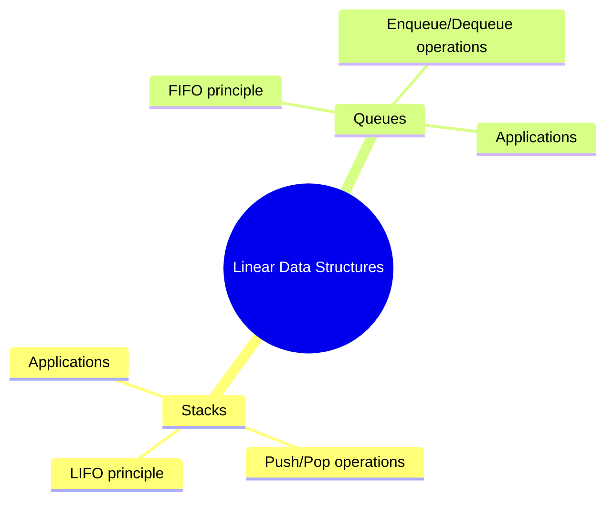

# Stacks and Queues

[Back to Course Content](README.md) | [Previous: Arrays and Linked Lists](arrays-and-linked-lists.md) | [Next: Trees →](trees.md)

> Reference: This content is based on Stacks.pdf and Queues.pdf

## What are Stacks and Queues?

Stacks and Queues are fundamental data structures that follow specific ordering principles for data access and manipulation.



## Stacks

### What is a Stack?

A stack is a LIFO (Last In, First Out) data structure where elements are added and removed from the same end, called the top.

#### Characteristics

- **LIFO Principle**: Last element added is first to be removed
- **Single Access Point**: Only top element is accessible
- **Limited Operations**: Push (add) and Pop (remove) only
- **Dynamic Size**: Can grow and shrink as needed

### Stack Operations

| Operation | Time Complexity | Description |
|-----------|----------------|-------------|
| Push | O(1) | Add element to top |
| Pop | O(1) | Remove top element |
| Peek/Top | O(1) | View top element |
| IsEmpty | O(1) | Check if stack is empty |
| Size | O(1) | Get number of elements |

### Java Implementation

```java
public class Stack<T> {
    private static class Node<T> {
        T data;
        Node<T> next;

        Node(T data) {
            this.data = data;
            this.next = null;
        }
    }

    private Node<T> top;
    private int size;

    public Stack() {
        top = null;
        size = 0;
    }

    public void push(T data) {
        Node<T> newNode = new Node<>(data);
        newNode.next = top;
        top = newNode;
        size++;
    }

    public T pop() {
        if (isEmpty()) {
            throw new EmptyStackException();
        }
        T data = top.data;
        top = top.next;
        size--;
        return data;
    }

    public T peek() {
        if (isEmpty()) {
            throw new EmptyStackException();
        }
        return top.data;
    }

    public boolean isEmpty() {
        return top == null;
    }

    public int size() {
        return size;
    }
}
```

### Real-World Applications

1. **Function Call Stack**
   - Method invocation
   - Recursion
   - Exception handling

2. **Expression Evaluation**
   - Infix to postfix conversion
   - Postfix evaluation
   - Parentheses matching

3. **Browser History**
   - Back button functionality
   - Page navigation
   - Undo operations

## Queues

### What is a Queue?

A queue is a FIFO (First In, First Out) data structure where elements are added at the rear and removed from the front.

#### Types of Queues

1. **Simple Queue**
   - Basic FIFO implementation
   - Single-ended queue

2. **Circular Queue**
   - Fixed-size array implementation
   - Efficient space utilization

3. **Priority Queue**
   - Elements with priority
   - Higher priority elements first

4. **Double-ended Queue (Deque)**
   - Add/remove from both ends
   - More flexible than simple queue

### Queue Operations

| Operation | Time Complexity | Description |
|-----------|----------------|-------------|
| Enqueue | O(1) | Add element to rear |
| Dequeue | O(1) | Remove element from front |
| Front | O(1) | View front element |
| Rear | O(1) | View rear element |
| IsEmpty | O(1) | Check if queue is empty |
| Size | O(1) | Get number of elements |

### Java Implementation

```java
public class Queue<T> {
    private static class Node<T> {
        T data;
        Node<T> next;

        Node(T data) {
            this.data = data;
            this.next = null;
        }
    }

    private Node<T> front;
    private Node<T> rear;
    private int size;

    public Queue() {
        front = null;
        rear = null;
        size = 0;
    }

    public void enqueue(T data) {
        Node<T> newNode = new Node<>(data);
        if (isEmpty()) {
            front = newNode;
            rear = newNode;
        } else {
            rear.next = newNode;
            rear = newNode;
        }
        size++;
    }

    public T dequeue() {
        if (isEmpty()) {
            throw new NoSuchElementException();
        }
        T data = front.data;
        front = front.next;
        if (front == null) {
            rear = null;
        }
        size--;
        return data;
    }

    public T peek() {
        if (isEmpty()) {
            throw new NoSuchElementException();
        }
        return front.data;
    }

    public boolean isEmpty() {
        return front == null;
    }

    public int size() {
        return size;
    }
}
```

### Real-World Applications

1. **Operating Systems**
   - Process scheduling
   - Print queue
   - Task scheduling

2. **Network Systems**
   - Packet queuing
   - Message buffering
   - Traffic management

3. **Simulation Systems**
   - Event scheduling
   - Resource allocation
   - Customer service

## Common Operations and Their Implementations

### 1. Stack Implementation using Queue

```java
public class StackUsingQueue<T> {
    private Queue<T> q1;
    private Queue<T> q2;

    public StackUsingQueue() {
        q1 = new Queue<>();
        q2 = new Queue<>();
    }

    public void push(T data) {
        q2.enqueue(data);
        while (!q1.isEmpty()) {
            q2.enqueue(q1.dequeue());
        }
        Queue<T> temp = q1;
        q1 = q2;
        q2 = temp;
    }

    public T pop() {
        if (q1.isEmpty()) {
            throw new EmptyStackException();
        }
        return q1.dequeue();
    }
}
```

### 2. Queue Implementation using Stack

```java
public class QueueUsingStack<T> {
    private Stack<T> s1;
    private Stack<T> s2;

    public QueueUsingStack() {
        s1 = new Stack<>();
        s2 = new Stack<>();
    }

    public void enqueue(T data) {
        s1.push(data);
    }

    public T dequeue() {
        if (s1.isEmpty() && s2.isEmpty()) {
            throw new NoSuchElementException();
        }
        if (s2.isEmpty()) {
            while (!s1.isEmpty()) {
                s2.push(s1.pop());
            }
        }
        return s2.pop();
    }
}
```

### 3. Circular Queue Implementation

```java
public class CircularQueue<T> {
    private T[] array;
    private int front;
    private int rear;
    private int size;
    private int capacity;

    public CircularQueue(int capacity) {
        array = (T[]) new Object[capacity];
        this.capacity = capacity;
        front = 0;
        rear = -1;
        size = 0;
    }

    public void enqueue(T data) {
        if (isFull()) {
            throw new IllegalStateException("Queue is full");
        }
        rear = (rear + 1) % capacity;
        array[rear] = data;
        size++;
    }

    public T dequeue() {
        if (isEmpty()) {
            throw new NoSuchElementException();
        }
        T data = array[front];
        front = (front + 1) % capacity;
        size--;
        return data;
    }

    public boolean isEmpty() {
        return size == 0;
    }

    public boolean isFull() {
        return size == capacity;
    }
}
```

## Best Practices

1. **Stack Best Practices**
   - Check for empty stack before operations
   - Use appropriate exception handling
   - Consider stack overflow in recursion
   - Implement proper cleanup

2. **Queue Best Practices**
   - Handle empty queue cases
   - Maintain proper front/rear pointers
   - Consider circular queue for fixed size
   - Implement proper synchronization for concurrent access

## Common Pitfalls

1. **Stack Pitfalls**
   - Stack overflow in recursion
   - Empty stack operations
   - Memory leaks in linked implementation
   - Incorrect order of operations

2. **Queue Pitfalls**
   - Queue underflow
   - Front/rear pointer management
   - Circular queue boundary conditions
   - Concurrent access issues

## Performance Optimization

### Stack Optimization

1. **Array vs Linked List**
   - Array: Better cache utilization
   - Linked List: Dynamic size, no resizing

2. **Memory Management**
   - Proper cleanup of resources
   - Efficient resizing strategies
   - Memory pool for nodes

### Queue Optimization

1. **Implementation Choice**
   - Array: Fixed size, better performance
   - Linked List: Dynamic size, more flexible
   - Circular: Efficient space utilization

2. **Concurrent Access**
   - Thread-safe implementations
   - Lock-free algorithms
   - Proper synchronization

## Exercises

1. Implement a stack using two queues
2. Create a queue using two stacks
3. Design a circular queue with dynamic resizing
4. Implement a priority queue using a heap
5. Create a double-ended queue (deque) implementation

## Additional Resources

- [GeeksforGeeks - Stack](https://www.geeksforgeeks.org/stack-data-structure/)
- [GeeksforGeeks - Queue](https://www.geeksforgeeks.org/queue-data-structure/)
- [Visualgo - Stack](https://visualgo.net/en/stack)
- [Visualgo - Queue](https://visualgo.net/en/queue) 