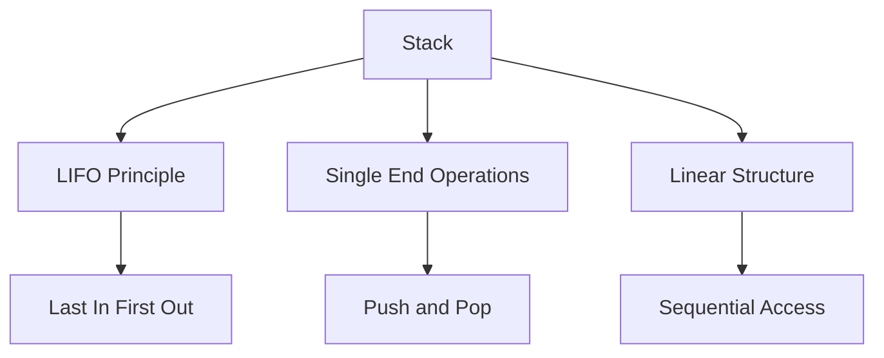
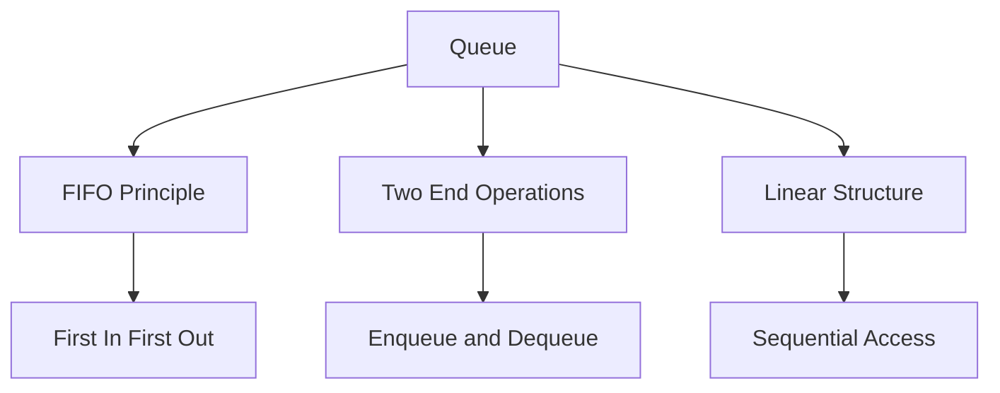

# Stacks and Queues

[Back to Course Content](README.md) | [← Previous: Arrays and Linked Lists](arrays-linked-lists.md) | [Next: Trees and Binary Trees →](trees.md)

## Stacks

A stack is a linear data structure that follows the Last In First Out (LIFO) principle, where the last element added is the first one to be removed.

### Stack Characteristics



### Stack Operations

| Operation | Time Complexity | Space Complexity | Description |
|-----------|----------------|------------------|-------------|
| Push | O(1) | O(1) | Add element to top |
| Pop | O(1) | O(1) | Remove top element |
| Peek/Top | O(1) | O(1) | View top element |
| IsEmpty | O(1) | O(1) | Check if stack is empty |
| Size | O(1) | O(1) | Get number of elements |

### Stack Implementation

```python
class Stack:
    def __init__(self):
        self.items = []
    
    def push(self, item):
        self.items.append(item)
    
    def pop(self):
        if not self.is_empty():
            return self.items.pop()
        raise IndexError("Stack is empty")
    
    def peek(self):
        if not self.is_empty():
            return self.items[-1]
        raise IndexError("Stack is empty")
    
    def is_empty(self):
        return len(self.items) == 0
    
    def size(self):
        return len(self.items)
```

### Stack Using Linked List

```python
class StackNode:
    def __init__(self, data):
        self.data = data
        self.next = None

class LinkedListStack:
    def __init__(self):
        self.top = None
        self.size = 0
    
    def push(self, data):
        new_node = StackNode(data)
        new_node.next = self.top
        self.top = new_node
        self.size += 1
    
    def pop(self):
        if not self.is_empty():
            data = self.top.data
            self.top = self.top.next
            self.size -= 1
            return data
        raise IndexError("Stack is empty")
    
    def peek(self):
        if not self.is_empty():
            return self.top.data
        raise IndexError("Stack is empty")
    
    def is_empty(self):
        return self.top is None
```

## Queues

A queue is a linear data structure that follows the First In First Out (FIFO) principle, where the first element added is the first one to be removed.

### Queue Characteristics



### Queue Operations

| Operation | Time Complexity | Space Complexity | Description |
|-----------|----------------|------------------|-------------|
| Enqueue | O(1) | O(1) | Add element to rear |
| Dequeue | O(1) | O(1) | Remove front element |
| Front | O(1) | O(1) | View front element |
| IsEmpty | O(1) | O(1) | Check if queue is empty |
| Size | O(1) | O(1) | Get number of elements |

### Queue Implementation

```python
class Queue:
    def __init__(self):
        self.items = []
    
    def enqueue(self, item):
        self.items.append(item)
    
    def dequeue(self):
        if not self.is_empty():
            return self.items.pop(0)
        raise IndexError("Queue is empty")
    
    def front(self):
        if not self.is_empty():
            return self.items[0]
        raise IndexError("Queue is empty")
    
    def is_empty(self):
        return len(self.items) == 0
    
    def size(self):
        return len(self.items)
```

### Queue Using Linked List

```python
class QueueNode:
    def __init__(self, data):
        self.data = data
        self.next = None

class LinkedListQueue:
    def __init__(self):
        self.front = None
        self.rear = None
        self.size = 0
    
    def enqueue(self, data):
        new_node = QueueNode(data)
        if self.is_empty():
            self.front = self.rear = new_node
        else:
            self.rear.next = new_node
            self.rear = new_node
        self.size += 1
    
    def dequeue(self):
        if not self.is_empty():
            data = self.front.data
            self.front = self.front.next
            if self.front is None:
                self.rear = None
            self.size -= 1
            return data
        raise IndexError("Queue is empty")
    
    def front(self):
        if not self.is_empty():
            return self.front.data
        raise IndexError("Queue is empty")
    
    def is_empty(self):
        return self.front is None
```

## Special Queue Types

### Circular Queue
A circular queue is a queue where the last position is connected back to the first position to make a circle.

```python
class CircularQueue:
    def __init__(self, capacity):
        self.capacity = capacity
        self.items = [None] * capacity
        self.front = self.rear = -1
        self.size = 0
    
    def enqueue(self, item):
        if self.is_full():
            raise IndexError("Queue is full")
        if self.is_empty():
            self.front = self.rear = 0
        else:
            self.rear = (self.rear + 1) % self.capacity
        self.items[self.rear] = item
        self.size += 1
    
    def dequeue(self):
        if self.is_empty():
            raise IndexError("Queue is empty")
        item = self.items[self.front]
        if self.front == self.rear:
            self.front = self.rear = -1
        else:
            self.front = (self.front + 1) % self.capacity
        self.size -= 1
        return item
    
    def is_empty(self):
        return self.size == 0
    
    def is_full(self):
        return self.size == self.capacity
```

### Priority Queue
A priority queue is a queue where elements are removed based on priority rather than order of insertion.

```python
class PriorityQueue:
    def __init__(self):
        self.items = []
    
    def enqueue(self, item, priority):
        self.items.append((priority, item))
        self.items.sort(reverse=True)
    
    def dequeue(self):
        if not self.is_empty():
            return self.items.pop(0)[1]
        raise IndexError("Priority queue is empty")
    
    def is_empty(self):
        return len(self.items) == 0
```

## Real-World Applications

### Stack Applications

1. **Function Call Stack**
   - Method invocation
   - Recursion
   - Exception handling

2. **Expression Evaluation**
   - Infix to postfix conversion
   - Postfix evaluation
   - Parentheses matching

3. **Browser History**
   - Back button functionality
   - Page navigation
   - Undo operations

### Queue Applications

1. **Operating Systems**
   - Process scheduling
   - Print spooling
   - Buffer management

2. **Network Systems**
   - Packet queuing
   - Message routing
   - Traffic management

3. **Simulation Systems**
   - Event scheduling
   - Resource allocation
   - Customer service

## Common Problems and Solutions

### Stack Problems

1. **Balanced Parentheses**
```python
def is_balanced(expression):
    stack = []
    pairs = {')': '(', '}': '{', ']': '['}
    for char in expression:
        if char in '({[':
            stack.append(char)
        elif char in ')}]':
            if not stack or stack.pop() != pairs[char]:
                return False
    return len(stack) == 0
```

2. **Next Greater Element**
```python
def next_greater_element(arr):
    stack = []
    result = [-1] * len(arr)
    for i in range(len(arr)):
        while stack and arr[stack[-1]] < arr[i]:
            result[stack.pop()] = arr[i]
        stack.append(i)
    return result
```

### Queue Problems

1. **Sliding Window Maximum**
```python
def sliding_window_maximum(nums, k):
    if not nums or k == 0:
        return []
    result = []
    window = []
    for i in range(len(nums)):
        while window and nums[window[-1]] < nums[i]:
            window.pop()
        window.append(i)
        if window[0] == i - k:
            window.pop(0)
        if i >= k - 1:
            result.append(nums[window[0]])
    return result
```

2. **Circular Tour**
```python
def circular_tour(petrol, distance):
    start = 0
    curr_petrol = 0
    total_petrol = 0
    for i in range(len(petrol)):
        curr_petrol += petrol[i] - distance[i]
        total_petrol += petrol[i] - distance[i]
        if curr_petrol < 0:
            start = i + 1
            curr_petrol = 0
    return start if total_petrol >= 0 else -1
```

## Implementation Considerations

### Stack Implementation Considerations
1. Array vs Linked List
2. Dynamic resizing
3. Overflow handling
4. Underflow handling
5. Thread safety

### Queue Implementation Considerations
1. Array vs Linked List
2. Circular buffer
3. Dynamic resizing
4. Thread safety
5. Priority handling

## Best Practices

### Stack Best Practices
1. Use appropriate size limits
2. Handle overflow/underflow
3. Consider thread safety
4. Use built-in stack when available
5. Implement proper error handling

### Queue Best Practices
1. Use appropriate queue type
2. Handle capacity limits
3. Consider thread safety
4. Implement proper error handling
5. Use built-in queue when available

## Summary

Key points to remember:
1. Stacks follow LIFO principle
2. Queues follow FIFO principle
3. Choose implementation based on requirements
4. Consider special queue types for specific needs
5. Handle edge cases properly
6. Optimize for specific operations

By understanding these data structures, you can:
- Implement efficient solutions
- Handle complex data operations
- Build scalable applications
- Solve real-world problems
- Optimize system performance 