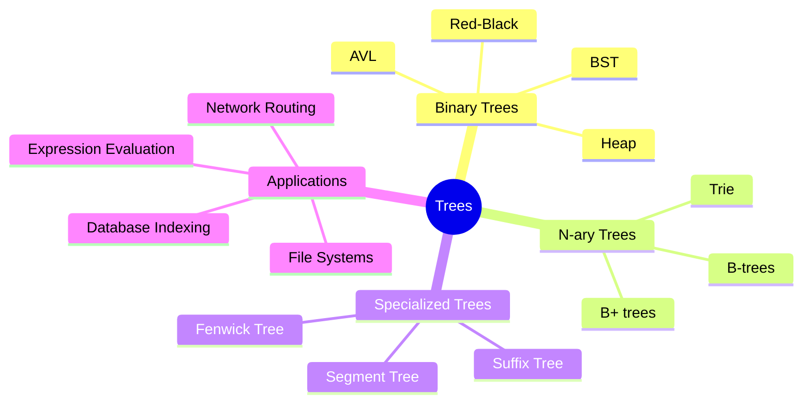
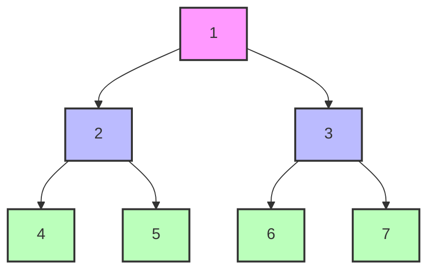

# Trees and Binary Trees

[Back to Course Content](README.md) | [Previous: Stacks and Queues](stacks-and-queues.md) | [Next: Graphs →](graphs.md)

> Reference: This content is based on Binary-trees.pdf and Red-Black-tree.pdf

## What are Trees?

Trees are hierarchical data structures that represent relationships between elements. They consist of nodes connected by edges, with one node designated as the root. Unlike linear data structures (arrays, linked lists, stacks, queues), trees represent hierarchical relationships with a parent-child structure.

### Mathematical Definition

A tree T is defined as a set of nodes with a parent-child relationship, where:
- One node is designated as the root node r
- The remaining nodes are partitioned into n ≥ 0 disjoint subsets T₁, T₂, ..., Tₙ, each of which is a tree
- These subtrees are connected to the root by an edge



## Basic Tree Concepts

### Tree Terminology

- **Root**: The topmost node with no parent
- **Parent**: A node with one or more child nodes
- **Child**: A node connected to a parent node
- **Sibling**: Nodes that share the same parent
- **Leaf/External Node**: A node with no children
- **Internal Node**: A node with at least one child
- **Edge**: Connection between two nodes
- **Path**: Sequence of nodes connected by edges
- **Height of a Tree**: Length of the longest path from root to any leaf
- **Depth of a Node**: Length of the path from root to that node
- **Level**: Set of nodes at the same depth
- **Degree of a Node**: Number of children
- **Subtree**: Tree consisting of a node and all its descendants
- **Forest**: Collection of disjoint trees

### Mathematical Properties

1. **Number of Edges**: In a tree with n nodes, there are exactly n-1 edges
2. **Path Uniqueness**: There is exactly one path between any two nodes
3. **Connectivity**: A tree is connected and acyclic
4. **Height-Nodes Relationship**: 
   - A binary tree of height h has at most 2^(h+1) - 1 nodes
   - A binary tree with n nodes has a minimum height of ⌊log₂(n)⌋

## Tree Traversal Methods

Tree traversal is the process of visiting each node in a tree exactly once in a systematic way.

### Depth-First Traversals



1. **Inorder Traversal (Left-Root-Right)**
   - Traverse left subtree
   - Visit root node
   - Traverse right subtree
   - Example output for above tree: 4, 2, 5, 1, 6, 3, 7
   - Most common application: Gives sorted order in a BST

2. **Preorder Traversal (Root-Left-Right)**
   - Visit root node
   - Traverse left subtree
   - Traverse right subtree
   - Example output for above tree: 1, 2, 4, 5, 3, 6, 7
   - Most common application: Creating a copy of the tree, prefix expression evaluation

3. **Postorder Traversal (Left-Right-Root)**
   - Traverse left subtree
   - Traverse right subtree
   - Visit root node
   - Example output for above tree: 4, 5, 2, 6, 7, 3, 1
   - Most common application: Deleting a tree, postfix expression evaluation

### Breadth-First Traversal

**Level Order Traversal**
- Visit nodes level by level, from left to right
- Example output for above tree: 1, 2, 3, 4, 5, 6, 7
- Implementation uses a queue data structure
- Most common application: Level-by-level processing, solving shortest path problems

### Iterative vs. Recursive Traversal

Recursive traversals are elegant but can cause stack overflow for deep trees. Iterative traversals using stacks or queues avoid this issue.

```java
// Iterative Inorder Traversal
public void inorderIterative() {
    if (root == null) return;
    
    Stack<Node<T>> stack = new Stack<>();
    Node<T> current = root;
    
    while (current != null || !stack.isEmpty()) {
        // Reach the leftmost node
        while (current != null) {
            stack.push(current);
            current = current.left;
        }
        
        // Current is now null, pop from stack
        current = stack.pop();
        
        // Process the node
        System.out.print(current.data + " ");
        
        // Move to the right subtree
        current = current.right;
    }
}
```

## Binary Trees

### Definition and Properties

A binary tree is a tree where each node has at most two children, referred to as the left child and the right child. Binary trees have special properties that make them particularly useful in computing.

#### Types of Binary Trees

1. **Full Binary Tree**
   - Every node has either 0 or 2 children
   - Mathematical property: n₂ = n₀ - 1 (n₂ is number of nodes with 2 children, n₀ is number of leaf nodes)

2. **Complete Binary Tree**
   - All levels are completely filled except possibly the last level
   - Last level is filled from left to right
   - Efficient array representation: For a node at index i, left child is at 2i+1, right child at 2i+2
   - Applications: Binary Heaps

3. **Perfect Binary Tree**
   - All internal nodes have exactly 2 children
   - All leaf nodes are at the same level
   - Number of nodes = 2^(h+1) - 1, where h is the height
   - Number of leaf nodes = 2^h

4. **Balanced Binary Tree**
   - Height difference between left and right subtrees of any node is not more than 1
   - Ensures O(log n) height
   - Examples: AVL Tree, Red-Black Tree

5. **Degenerate (or Pathological) Tree**
   - Every internal node has only one child
   - Performance degrades to that of a linked list (O(n))
   - Common cause: Inserting sorted data into a BST

### Binary Tree Implementation

Binary trees can be implemented using node objects with references or using arrays. Node-based implementation is more flexible, while array-based implementation works well for complete binary trees.

#### Node-based Implementation

```java
public class BinaryTree<T> {
    protected static class Node<T> {
        T data;
        Node<T> left;
        Node<T> right;

        Node(T data) {
            this.data = data;
            this.left = null;
            this.right = null;
        }
    }

    protected Node<T> root;

    public BinaryTree() {
        root = null;
    }

    // Basic tree operations
    public boolean isEmpty() {
        return root == null;
    }

    public void insert(T data) {
        if (isEmpty()) {
            root = new Node<>(data);
            return;
        }
        
        // Level order insertion
        Queue<Node<T>> queue = new LinkedList<>();
        queue.add(root);
        
        while (!queue.isEmpty()) {
            Node<T> temp = queue.poll();
            
            if (temp.left == null) {
                temp.left = new Node<>(data);
                return;
            } else {
                queue.add(temp.left);
            }
            
            if (temp.right == null) {
                temp.right = new Node<>(data);
                return;
            } else {
                queue.add(temp.right);
            }
        }
    }

    // Traversal methods
    public void inorderTraversal() {
        System.out.print("Inorder: ");
        inorderRec(root);
        System.out.println();
    }

    private void inorderRec(Node<T> root) {
        if (root != null) {
            inorderRec(root.left);
            System.out.print(root.data + " ");
            inorderRec(root.right);
        }
    }

    // Other traversals similarly...

    // Utility methods
    public int height() {
        return heightRec(root);
    }

    private int heightRec(Node<T> node) {
        if (node == null) {
            return -1; // Height of empty tree is -1
        }
        return 1 + Math.max(heightRec(node.left), heightRec(node.right));
    }

    public int size() {
        return sizeRec(root);
    }

    private int sizeRec(Node<T> node) {
        if (node == null) {
            return 0;
        }
        return 1 + sizeRec(node.left) + sizeRec(node.right);
    }
    
    public int countLeaves() {
        return countLeavesRec(root);
    }
    
    private int countLeavesRec(Node<T> node) {
        if (node == null) {
            return 0;
        }
        if (node.left == null && node.right == null) {
            return 1;
        }
        return countLeavesRec(node.left) + countLeavesRec(node.right);
    }
    
    public boolean isBalanced() {
        return checkBalanced(root) != -1;
    }
    
    private int checkBalanced(Node<T> node) {
        if (node == null) {
            return 0;
        }
        
        int leftHeight = checkBalanced(node.left);
        if (leftHeight == -1) return -1;
        
        int rightHeight = checkBalanced(node.right);
        if (rightHeight == -1) return -1;
        
        if (Math.abs(leftHeight - rightHeight) > 1) {
            return -1;
        }
        
        return Math.max(leftHeight, rightHeight) + 1;
    }
}
```

#### Array-based Implementation (Complete Binary Tree)

```java
public class CompleteBinaryTree<T> {
    private T[] tree;
    private int size;
    private final int capacity;
    
    @SuppressWarnings("unchecked")
    public CompleteBinaryTree(int capacity) {
        this.capacity = capacity;
        tree = (T[]) new Object[capacity];
        size = 0;
    }
    
    public void insert(T data) {
        if (size >= capacity) {
            throw new IllegalStateException("Tree is full");
        }
        tree[size++] = data;
    }
    
    public T get(int index) {
        if (index < 0 || index >= size) {
            throw new IndexOutOfBoundsException();
        }
        return tree[index];
    }
    
    public T getLeft(int parentIndex) {
        int leftIndex = 2 * parentIndex + 1;
        if (leftIndex >= size) {
            return null;
        }
        return tree[leftIndex];
    }
    
    public T getRight(int parentIndex) {
        int rightIndex = 2 * parentIndex + 2;
        if (rightIndex >= size) {
            return null;
        }
        return tree[rightIndex];
    }
    
    public int getParentIndex(int childIndex) {
        if (childIndex <= 0 || childIndex >= size) {
            return -1;
        }
        return (childIndex - 1) / 2;
    }
    
    public void printLevelOrder() {
        for (int i = 0; i < size; i++) {
            System.out.print(tree[i] + " ");
        }
        System.out.println();
    }
}
```

## Binary Search Trees (BST)

### Definition and Properties

A Binary Search Tree is a binary tree where:
- The left subtree of a node contains only nodes with keys less than the node's key
- The right subtree of a node contains only nodes with keys greater than the node's key
- Both the left and right subtrees are also binary search trees

This ordering property enables efficient search, insertion, and deletion operations.

### BST Operations and Complexity

| Operation | Average Time | Worst Case Time | Space Complexity |
|-----------|--------------|----------------|------------------|
| Search    | O(log n)     | O(n)           | O(h) - recursive implementation |
| Insert    | O(log n)     | O(n)           | O(h) - recursive implementation |
| Delete    | O(log n)     | O(n)           | O(h) - recursive implementation |
| Min/Max   | O(log n)     | O(n)           | O(h) - recursive implementation |
| Successor/Predecessor | O(log n) | O(n) | O(1) |
| Inorder traversal | O(n) | O(n) | O(h) |

Note: h is the height of the tree, which is O(log n) for balanced trees and O(n) for degenerate trees.

### BST Implementation

```java
public class BinarySearchTree<T extends Comparable<T>> {
    private static class Node<T> {
        T data;
        Node<T> left;
        Node<T> right;

        Node(T data) {
            this.data = data;
        }
    }

    private Node<T> root;

    public BinarySearchTree() {
        root = null;
    }

    // Insert operation
    public void insert(T data) {
        root = insertRec(root, data);
    }

    private Node<T> insertRec(Node<T> root, T data) {
        if (root == null) {
            return new Node<>(data);
        }

        int compareResult = data.compareTo(root.data);
        if (compareResult < 0) {
            root.left = insertRec(root.left, data);
        } else if (compareResult > 0) {
            root.right = insertRec(root.right, data);
        }
        // If equal, we can either ignore or handle duplicates

        return root;
    }

    // Search operation
    public boolean search(T data) {
        return searchRec(root, data);
    }

    private boolean searchRec(Node<T> root, T data) {
        if (root == null) {
            return false;
        }

        int compareResult = data.compareTo(root.data);
        if (compareResult == 0) {
            return true;
        }
        
        if (compareResult < 0) {
            return searchRec(root.left, data);
        } else {
            return searchRec(root.right, data);
        }
    }

    // Delete operation
    public void delete(T data) {
        root = deleteRec(root, data);
    }

    private Node<T> deleteRec(Node<T> root, T data) {
        if (root == null) {
            return null;
        }

        int compareResult = data.compareTo(root.data);
        if (compareResult < 0) {
            root.left = deleteRec(root.left, data);
        } else if (compareResult > 0) {
            root.right = deleteRec(root.right, data);
        } else {
            // Node to be deleted found

            // Case 1: Node with no children
            if (root.left == null && root.right == null) {
                return null;
            }
            
            // Case 2: Node with one child
            if (root.left == null) {
                return root.right;
            }
            if (root.right == null) {
                return root.left;
            }
            
            // Case 3: Node with two children
            // Find the inorder successor (smallest in right subtree)
            root.data = findMin(root.right);
            
            // Delete the inorder successor
            root.right = deleteRec(root.right, root.data);
        }
        
        return root;
    }

    // Find minimum value in BST
    public T findMin() {
        if (root == null) {
            throw new NoSuchElementException("Tree is empty");
        }
        return findMin(root);
    }

    private T findMin(Node<T> root) {
        while (root.left != null) {
            root = root.left;
        }
        return root.data;
    }

    // Find maximum value in BST
    public T findMax() {
        if (root == null) {
            throw new NoSuchElementException("Tree is empty");
        }
        return findMax(root);
    }

    private T findMax(Node<T> root) {
        while (root.right != null) {
            root = root.right;
        }
        return root.data;
    }

    // Find successor of a given key
    public T successor(T data) {
        Node<T> current = root;
        Node<T> successor = null;
        
        while (current != null) {
            int compareResult = data.compareTo(current.data);
            
            if (compareResult < 0) {
                successor = current;
                current = current.left;
            } else if (compareResult > 0) {
                current = current.right;
            } else {
                // If right subtree exists, successor is minimum in right subtree
                if (current.right != null) {
                    return findMin(current.right);
                }
                break;
            }
        }
        
        return successor != null ? successor.data : null;
    }
    
    // Check if the tree is a valid BST
    public boolean isValidBST() {
        return isValidBST(root, null, null);
    }
    
    private boolean isValidBST(Node<T> node, T min, T max) {
        if (node == null) {
            return true;
        }
        
        // Check current node's constraints
        if ((min != null && node.data.compareTo(min) <= 0) || 
            (max != null && node.data.compareTo(max) >= 0)) {
            return false;
        }
        
        // Recursively check left and right subtrees
        return isValidBST(node.left, min, node.data) && 
               isValidBST(node.right, node.data, max);
    }
}
```

## Self-Balancing BSTs

Self-balancing BSTs automatically adjust their structure to maintain balance after insertions and deletions, ensuring O(log n) height.

### 1. AVL Trees

AVL trees are self-balancing binary search trees where the height difference between left and right subtrees (balance factor) of any node is at most 1.

#### Properties

- Balance Factor = Height(Left Subtree) - Height(Right Subtree)
- Valid balance factors are -1, 0, and 1
- More strictly balanced than Red-Black trees
- Faster lookups but slower insertions/deletions than Red-Black trees

#### Balancing Operations

1. **Left Rotation**: Used when a node becomes right-heavy
2. **Right Rotation**: Used when a node becomes left-heavy
3. **Left-Right Rotation**: Used for left-right imbalance
4. **Right-Left Rotation**: Used for right-left imbalance

```java
public class AVLTree<T extends Comparable<T>> {
    private static class Node<T> {
        T data;
        Node<T> left;
        Node<T> right;
        int height;
        
        Node(T data) {
            this.data = data;
            this.height = 1;
        }
    }
    
    private Node<T> root;
    
    // Get height of node
    private int height(Node<T> node) {
        return node == null ? 0 : node.height;
    }
    
    // Get balance factor of node
    private int getBalance(Node<T> node) {
        return node == null ? 0 : height(node.left) - height(node.right);
    }
    
    // Update height of a node
    private void updateHeight(Node<T> node) {
        node.height = Math.max(height(node.left), height(node.right)) + 1;
    }
    
    // Right rotation
    private Node<T> rightRotate(Node<T> y) {
        Node<T> x = y.left;
        Node<T> T2 = x.right;
        
        // Perform rotation
        x.right = y;
        y.left = T2;
        
        // Update heights
        updateHeight(y);
        updateHeight(x);
        
        return x;
    }
    
    // Left rotation
    private Node<T> leftRotate(Node<T> x) {
        Node<T> y = x.right;
        Node<T> T2 = y.left;
        
        // Perform rotation
        y.left = x;
        x.right = T2;
        
        // Update heights
        updateHeight(x);
        updateHeight(y);
        
        return y;
    }
    
    // Insert a node
    public void insert(T data) {
        root = insert(root, data);
    }
    
    private Node<T> insert(Node<T> node, T data) {
        // 1. Perform standard BST insertion
        if (node == null) {
            return new Node<>(data);
        }
        
        int compareResult = data.compareTo(node.data);
        if (compareResult < 0) {
            node.left = insert(node.left, data);
        } else if (compareResult > 0) {
            node.right = insert(node.right, data);
        } else {
            // Duplicate keys not allowed
            return node;
        }
        
        // 2. Update height of this node
        updateHeight(node);
        
        // 3. Get the balance factor
        int balance = getBalance(node);
        
        // 4. If unbalanced, there are 4 cases
        
        // Left Left Case
        if (balance > 1 && data.compareTo(node.left.data) < 0) {
            return rightRotate(node);
        }
        
        // Right Right Case
        if (balance < -1 && data.compareTo(node.right.data) > 0) {
            return leftRotate(node);
        }
        
        // Left Right Case
        if (balance > 1 && data.compareTo(node.left.data) > 0) {
            node.left = leftRotate(node.left);
            return rightRotate(node);
        }
        
        // Right Left Case
        if (balance < -1 && data.compareTo(node.right.data) < 0) {
            node.right = rightRotate(node.right);
            return leftRotate(node);
        }
        
        // Return the unchanged node
        return node;
    }
}
```

### 2. Red-Black Trees

Red-Black trees are self-balancing binary search trees with an extra bit of information: the color (red or black) of each node.

#### Properties

1. Every node is either red or black
2. The root is black
3. All NULL leaves (NIL) are black
4. If a node is red, then both its children are black
5. Every path from a node to its descendant NIL nodes contains the same number of black nodes

#### Advantages

- Guaranteed O(log n) height
- Less rigorous balancing than AVL trees
- Faster insertions and deletions than AVL trees
- Good worst-case guarantees

```java
public class RedBlackTree<T extends Comparable<T>> {
    private static final boolean RED = true;
    private static final boolean BLACK = false;
    
    private static class Node<T> {
        T data;
        Node<T> left, right;
        boolean color;
        
        Node(T data, boolean color) {
            this.data = data;
            this.color = color;
        }
    }
    
    private Node<T> root;
    
    // Helper methods
    private boolean isRed(Node<T> node) {
        return node != null && node.color == RED;
    }
    
    // Right rotation (preserving colors)
    private Node<T> rotateRight(Node<T> h) {
        Node<T> x = h.left;
        h.left = x.right;
        x.right = h;
        x.color = h.color;
        h.color = RED;
        return x;
    }
    
    // Left rotation (preserving colors)
    private Node<T> rotateLeft(Node<T> h) {
        Node<T> x = h.right;
        h.right = x.left;
        x.left = h;
        x.color = h.color;
        h.color = RED;
        return x;
    }
    
    // Flip colors of a node and its two children
    private void flipColors(Node<T> h) {
        h.color = !h.color;
        h.left.color = !h.left.color;
        h.right.color = !h.right.color;
    }
    
    // Insert a node
    public void insert(T data) {
        root = insert(root, data);
        root.color = BLACK; // Ensure root is black
    }
    
    private Node<T> insert(Node<T> h, T data) {
        if (h == null) {
            return new Node<>(data, RED); // New nodes are always red
        }
        
        int cmp = data.compareTo(h.data);
        if (cmp < 0) h.left = insert(h.left, data);
        else if (cmp > 0) h.right = insert(h.right, data);
        else h.data = data; // Overwrite if key exists
        
        // Fix-up any right-leaning red links
        if (isRed(h.right) && !isRed(h.left)) h = rotateLeft(h);
        if (isRed(h.left) && isRed(h.left.left)) h = rotateRight(h);
        if (isRed(h.left) && isRed(h.right)) flipColors(h);
        
        return h;
    }
}
```

## Tree Operations Performance Comparison

| Operation | Binary Tree | BST (avg) | BST (worst) | AVL Tree | Red-Black Tree |
|-----------|-------------|-----------|-------------|----------|----------------|
| Search    | O(n)        | O(log n)  | O(n)        | O(log n) | O(log n)       |
| Insert    | O(1) or O(n)| O(log n)  | O(n)        | O(log n) | O(log n)       |
| Delete    | O(n)        | O(log n)  | O(n)        | O(log n) | O(log n)       |
| Space     | O(n)        | O(n)      | O(n)        | O(n)     | O(n)           |
| Balance Guarantee | None | None    | None        | Strict   | Relaxed        |
| Height Factor | Any   | Any       | Any         | ≤ 1      | ≤ 2 (approx.)   |

## Real-World Applications

### 1. File Systems

- Directories and files form a tree structure
- Fast search and traversal
- Example: Unix file system is a multi-way tree

### 2. Database Systems

- B-Trees and B+ Trees for indexing
- Efficient range queries
- Optimized for disk access patterns
- Example: MySQL's InnoDB uses B+ Trees

### 3. Compiler Design

- Abstract Syntax Trees (AST) represent program structure
- Expression trees evaluate mathematical expressions
- Symbol tables often use trees
- Example: GCC compiler uses various tree structures

### 4. Network Routing

- Routing tables often implemented as prefix trees (tries)
- Efficient packet forwarding
- Example: IP routing algorithms use tree structures

### 5. Artificial Intelligence

- Decision trees for classification
- Game trees for strategic planning (minimax algorithm)
- Hierarchical clustering
- Example: Random Forest machine learning algorithm

### 6. Computer Graphics

- Binary Space Partition (BSP) trees for 3D rendering
- Quadtrees and Octrees for spatial partitioning
- Example: Scene graphs in game engines like Unity

## Advanced Tree Structures

### 1. B-Tree and B+ Tree

B-Trees are balanced m-way search trees designed to work efficiently on disk-based storage systems.

**Key Properties:**
- All leaf nodes are at the same level
- Each node can have multiple keys and children
- Keys within a node are sorted
- Used in databases and file systems

### 2. Trie (Prefix Tree)

A trie is a tree-like data structure that stores a dynamic set of strings, where the keys are usually strings.

**Key Properties:**
- Each node represents a prefix
- All descendants of a node share a common prefix
- Used for dictionary implementations, autocomplete, spell checking

### 3. Segment Tree

A segment tree is a binary tree used for storing intervals or segments with efficient query operations.

**Key Properties:**
- Used for range queries
- Can be used to find minimum, maximum, sum over intervals
- Efficient updates and queries: O(log n)
- Applications: Computational geometry, range statistics

### 4. Fenwick Tree (Binary Indexed Tree)

A Fenwick tree is a data structure that can efficiently update elements and calculate prefix sums in a table of numbers.

**Key Properties:**
- More space-efficient than segment trees
- Very fast updates and queries: O(log n)
- Applications: Frequency counting, range sum queries

## Best Practices for Tree Implementation

1. **Choose the right tree structure** for your specific needs:
   - Need ordered operations? Use BST or its balanced variants
   - Working with strings? Consider a trie
   - Range queries? Segment trees or Fenwick trees
   - Database indexing? B-Trees or B+ Trees

2. **Balance considerations**:
   - If search operations dominate, use a strictly balanced tree like AVL
   - If insertions/deletions are frequent, Red-Black trees may be better
   - If insertions are in random order, a plain BST may suffice

3. **Implementation tips**:
   - Always handle edge cases (empty trees, single node trees)
   - Ensure recursive implementations don't cause stack overflow
   - Consider iterative implementations for traversals
   - Use proper encapsulation to protect the tree structure
   - Implement proper clean-up to avoid memory leaks

4. **Performance optimization**:
   - Cache frequently accessed nodes
   - Minimize tree height through balancing
   - Consider bulk operations for large datasets
   - Use appropriate node representation (memory vs. speed tradeoff)

## Advanced Topics and Challenges

1. **Persistent Trees**
   - Data structures that preserve previous versions when modified
   - Allows access to any version in the history

2. **Concurrent Trees**
   - Thread-safe tree implementations
   - Lock-free techniques for high concurrency

3. **Dynamic Tree Optimization**
   - Adaptive tree structures that change based on access patterns
   - Self-adjusting trees like Splay Trees

4. **Spatial Trees**
   - Trees for multi-dimensional data: Quadtrees, k-d trees, R-trees
   - Applications in geographic information systems, AI

## Exercises

1. Implement a binary tree with iterative and recursive traversals
2. Create a BST and implement search, insert, and delete operations
3. Balance a given binary search tree using AVL or Red-Black tree techniques
4. Solve problems like:
   - Find the lowest common ancestor of two nodes
   - Determine if a binary tree is height-balanced
   - Convert a sorted array to a balanced BST
   - Find the kth smallest element in a BST

## Additional Resources

- [Visualizing Data Structures and Algorithms](https://visualgo.net/en/bst)
- [MIT OpenCourseWare: Binary Search Trees](https://ocw.mit.edu/courses/electrical-engineering-and-computer-science/6-006-introduction-to-algorithms-fall-2011/lecture-videos/lecture-5-binary-search-trees-bst-sort/)
- [Red-Black Trees in Introduction to Algorithms](https://mitpress.mit.edu/books/introduction-algorithms-third-edition)
- [Princeton Algorithms Course: Balanced Search Trees](https://algs4.cs.princeton.edu/33balanced/) 