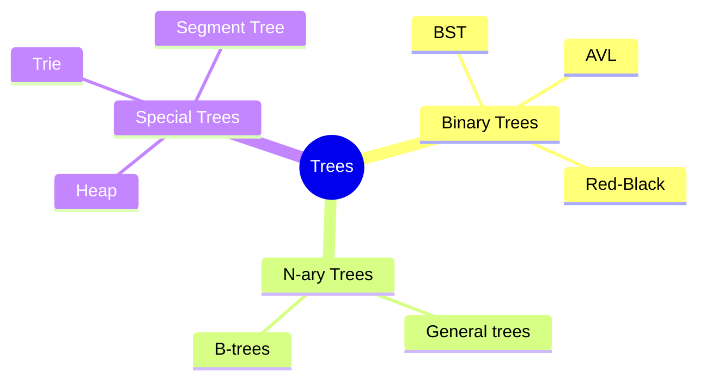

# Trees and Binary Trees

[Back to Course Content](README.md) | [Previous: Stacks and Queues](stacks-and-queues.md) | [Next: Graphs →](graphs.md)

> Reference: This content is based on Binary-trees.pdf and Red-Black-tree.pdf

## What are Trees?

Trees are hierarchical data structures that represent relationships between elements. They consist of nodes connected by edges, with one node designated as the root.



## Basic Tree Concepts

### Tree Terminology

- **Root**: Topmost node
- **Parent**: Node with children
- **Child**: Node connected to parent
- **Sibling**: Nodes with same parent
- **Leaf**: Node with no children
- **Internal Node**: Node with children
- **Height**: Length of path from root to deepest leaf
- **Depth**: Length of path from root to a node
- **Level**: Set of nodes at same depth

### Tree Properties

1. **Connected**: Path exists between any two nodes
2. **Acyclic**: No cycles in the tree
3. **Single Root**: One root node
4. **Unique Path**: One path between any two nodes

## Binary Trees

### What is a Binary Tree?

A binary tree is a tree where each node has at most two children, referred to as left child and right child.

#### Types of Binary Trees

1. **Full Binary Tree**
   - Every node has 0 or 2 children
   - All leaves at same level

2. **Complete Binary Tree**
   - All levels filled except possibly last
   - Last level filled left to right

3. **Perfect Binary Tree**
   - All internal nodes have 2 children
   - All leaves at same level

4. **Balanced Binary Tree**
   - Height difference between left and right subtrees ≤ 1
   - Maintains O(log n) height

### Java Implementation

```java
public class BinaryTree<T> {
    private static class Node<T> {
        T data;
        Node<T> left;
        Node<T> right;

        Node(T data) {
            this.data = data;
            this.left = null;
            this.right = null;
        }
    }

    private Node<T> root;

    public BinaryTree() {
        root = null;
    }

    public void insert(T data) {
        root = insertRec(root, data);
    }

    private Node<T> insertRec(Node<T> root, T data) {
        if (root == null) {
            root = new Node<>(data);
            return root;
        }

        if (data.compareTo(root.data) < 0) {
            root.left = insertRec(root.left, data);
        } else if (data.compareTo(root.data) > 0) {
            root.right = insertRec(root.right, data);
        }

        return root;
    }

    public void inorderTraversal() {
        inorderRec(root);
    }

    private void inorderRec(Node<T> root) {
        if (root != null) {
            inorderRec(root.left);
            System.out.print(root.data + " ");
            inorderRec(root.right);
        }
    }

    public void preorderTraversal() {
        preorderRec(root);
    }

    private void preorderRec(Node<T> root) {
        if (root != null) {
            System.out.print(root.data + " ");
            preorderRec(root.left);
            preorderRec(root.right);
        }
    }

    public void postorderTraversal() {
        postorderRec(root);
    }

    private void postorderRec(Node<T> root) {
        if (root != null) {
            postorderRec(root.left);
            postorderRec(root.right);
            System.out.print(root.data + " ");
        }
    }

    public int height() {
        return heightRec(root);
    }

    private int heightRec(Node<T> root) {
        if (root == null) {
            return -1;
        }
        return Math.max(heightRec(root.left), heightRec(root.right)) + 1;
    }

    public int size() {
        return sizeRec(root);
    }

    private int sizeRec(Node<T> root) {
        if (root == null) {
            return 0;
        }
        return sizeRec(root.left) + sizeRec(root.right) + 1;
    }
}
```

## Binary Search Trees (BST)

### What is a BST?

A binary search tree is a binary tree where:
- Left subtree contains only nodes with keys less than node's key
- Right subtree contains only nodes with keys greater than node's key
- Both left and right subtrees are also BSTs

### BST Operations

| Operation | Average Case | Worst Case |
|-----------|--------------|------------|
| Search | O(log n) | O(n) |
| Insert | O(log n) | O(n) |
| Delete | O(log n) | O(n) |
| Find Min/Max | O(log n) | O(n) |

### Java Implementation

```java
public class BinarySearchTree<T extends Comparable<T>> {
    private static class Node<T> {
        T data;
        Node<T> left;
        Node<T> right;

        Node(T data) {
            this.data = data;
            this.left = null;
            this.right = null;
        }
    }

    private Node<T> root;

    public BinarySearchTree() {
        root = null;
    }

    public void insert(T data) {
        root = insertRec(root, data);
    }

    private Node<T> insertRec(Node<T> root, T data) {
        if (root == null) {
            root = new Node<>(data);
            return root;
        }

        if (data.compareTo(root.data) < 0) {
            root.left = insertRec(root.left, data);
        } else if (data.compareTo(root.data) > 0) {
            root.right = insertRec(root.right, data);
        }

        return root;
    }

    public boolean search(T data) {
        return searchRec(root, data);
    }

    private boolean searchRec(Node<T> root, T data) {
        if (root == null || root.data.equals(data)) {
            return root != null;
        }

        if (data.compareTo(root.data) < 0) {
            return searchRec(root.left, data);
        }

        return searchRec(root.right, data);
    }

    public void delete(T data) {
        root = deleteRec(root, data);
    }

    private Node<T> deleteRec(Node<T> root, T data) {
        if (root == null) {
            return root;
        }

        if (data.compareTo(root.data) < 0) {
            root.left = deleteRec(root.left, data);
        } else if (data.compareTo(root.data) > 0) {
            root.right = deleteRec(root.right, data);
        } else {
            // Node with only one child or no child
            if (root.left == null) {
                return root.right;
            } else if (root.right == null) {
                return root.left;
            }

            // Node with two children
            root.data = minValue(root.right);
            root.right = deleteRec(root.right, root.data);
        }

        return root;
    }

    private T minValue(Node<T> root) {
        T minv = root.data;
        while (root.left != null) {
            minv = root.left.data;
            root = root.left;
        }
        return minv;
    }
}
```

## Balanced Trees

### AVL Trees

AVL trees are self-balancing binary search trees where the heights of left and right subtrees differ by at most one.

#### Balancing Operations

1. **Left Rotation**
2. **Right Rotation**
3. **Left-Right Rotation**
4. **Right-Left Rotation**

### Red-Black Trees

Red-Black trees are self-balancing binary search trees with the following properties:
1. Root is black
2. All leaves are black
3. If node is red, both children are black
4. Every path from root to leaves contains same number of black nodes

#### Java Implementation

```java
public class RedBlackTree<T extends Comparable<T>> {
    private static final boolean RED = true;
    private static final boolean BLACK = false;

    private static class Node<T> {
        T data;
        Node<T> left, right, parent;
        boolean color;

        Node(T data) {
            this.data = data;
            this.color = RED;
            this.left = null;
            this.right = null;
            this.parent = null;
        }
    }

    private Node<T> root;

    public RedBlackTree() {
        root = null;
    }

    public void insert(T data) {
        Node<T> node = new Node<>(data);
        root = insertRec(root, node);
        fixViolations(node);
    }

    private Node<T> insertRec(Node<T> root, Node<T> node) {
        if (root == null) {
            return node;
        }

        if (node.data.compareTo(root.data) < 0) {
            root.left = insertRec(root.left, node);
            root.left.parent = root;
        } else if (node.data.compareTo(root.data) > 0) {
            root.right = insertRec(root.right, node);
            root.right.parent = root;
        }

        return root;
    }

    private void fixViolations(Node<T> node) {
        Node<T> parent = null;
        Node<T> grandParent = null;

        while (node != root && node.color == RED && node.parent.color == RED) {
            parent = node.parent;
            grandParent = parent.parent;

            if (parent == grandParent.left) {
                Node<T> uncle = grandParent.right;

                if (uncle != null && uncle.color == RED) {
                    grandParent.color = RED;
                    parent.color = BLACK;
                    uncle.color = BLACK;
                    node = grandParent;
                } else {
                    if (node == parent.right) {
                        rotateLeft(parent);
                        node = parent;
                        parent = node.parent;
                    }
                    rotateRight(grandParent);
                    boolean tempColor = parent.color;
                    parent.color = grandParent.color;
                    grandParent.color = tempColor;
                    node = parent;
                }
            } else {
                Node<T> uncle = grandParent.left;

                if (uncle != null && uncle.color == RED) {
                    grandParent.color = RED;
                    parent.color = BLACK;
                    uncle.color = BLACK;
                    node = grandParent;
                } else {
                    if (node == parent.left) {
                        rotateRight(parent);
                        node = parent;
                        parent = node.parent;
                    }
                    rotateLeft(grandParent);
                    boolean tempColor = parent.color;
                    parent.color = grandParent.color;
                    grandParent.color = tempColor;
                    node = parent;
                }
            }
        }
        root.color = BLACK;
    }

    private void rotateLeft(Node<T> node) {
        Node<T> right = node.right;
        node.right = right.left;
        if (right.left != null) {
            right.left.parent = node;
        }
        right.parent = node.parent;
        if (node.parent == null) {
            root = right;
        } else if (node == node.parent.left) {
            node.parent.left = right;
        } else {
            node.parent.right = right;
        }
        right.left = node;
        node.parent = right;
    }

    private void rotateRight(Node<T> node) {
        Node<T> left = node.left;
        node.left = left.right;
        if (left.right != null) {
            left.right.parent = node;
        }
        left.parent = node.parent;
        if (node.parent == null) {
            root = left;
        } else if (node == node.parent.right) {
            node.parent.right = left;
        } else {
            node.parent.left = left;
        }
        left.right = node;
        node.parent = left;
    }
}
```

## Real-World Applications

### File Systems

- Directory structure
- File organization
- Hierarchical storage

### Database Systems

- Index structures
- B-trees for storage
- Query optimization

### Compiler Design

- Abstract syntax trees
- Expression trees
- Parse trees

### Network Routing

- Decision trees
- Routing tables
- Network topology

## Tree Traversal Algorithms

### 1. Depth-First Traversal

```java
public void inorderTraversal() {
    inorderRec(root);
}

private void inorderRec(Node<T> root) {
    if (root != null) {
        inorderRec(root.left);
        System.out.print(root.data + " ");
        inorderRec(root.right);
    }
}
```

### 2. Breadth-First Traversal

```java
public void levelOrderTraversal() {
    if (root == null) {
        return;
    }

    Queue<Node<T>> queue = new LinkedList<>();
    queue.add(root);

    while (!queue.isEmpty()) {
        Node<T> node = queue.poll();
        System.out.print(node.data + " ");

        if (node.left != null) {
            queue.add(node.left);
        }
        if (node.right != null) {
            queue.add(node.right);
        }
    }
}
```

## Best Practices

1. **Tree Design**
   - Choose appropriate tree type
   - Consider balancing requirements
   - Plan for scalability

2. **Implementation**
   - Handle edge cases
   - Maintain balance
   - Optimize operations

3. **Performance**
   - Monitor height
   - Balance when needed
   - Cache frequently accessed nodes

## Common Pitfalls

1. **Balance Issues**
   - Unbalanced trees
   - Skewed trees
   - Height imbalance

2. **Memory Management**
   - Memory leaks
   - Proper cleanup
   - Reference management

3. **Concurrency**
   - Race conditions
   - Lock management
   - Thread safety

## Exercises

1. Implement a binary search tree with all operations
2. Create an AVL tree implementation
3. Design a Red-Black tree with insertion and deletion
4. Write a function to check if a tree is balanced
5. Implement level-order traversal using queues

## Additional Resources

- [GeeksforGeeks - Binary Tree](https://www.geeksforgeeks.org/binary-tree-data-structure/)
- [GeeksforGeeks - Binary Search Tree](https://www.geeksforgeeks.org/binary-search-tree-data-structure/)
- [Visualgo - Binary Search Tree](https://visualgo.net/en/bst)
- [Red-Black Tree Visualization](https://www.cs.usfca.edu/~galles/visualization/RedBlack.html) 