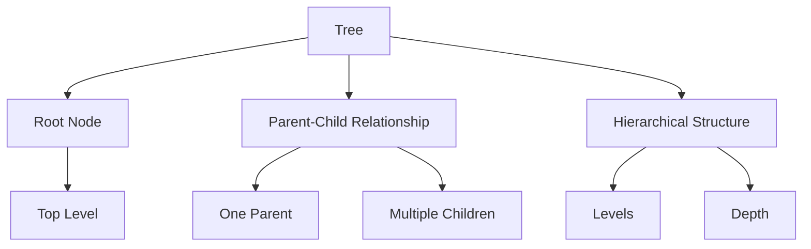
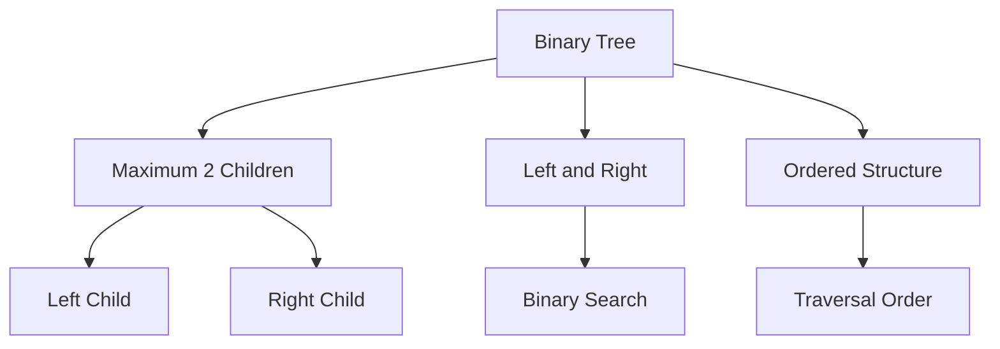

# Trees and Binary Trees

[Back to Course Content](README.md) | [← Previous: Stacks and Queues](stacks-queues.md) | [Next: Advanced Trees →](advanced-trees.md)

## Trees

A tree is a hierarchical data structure consisting of nodes connected by edges. Each node can have multiple children, but only one parent.

### Tree Characteristics



### Tree Terminology

| Term | Description |
|------|-------------|
| Root | Topmost node |
| Parent | Node with children |
| Child | Node connected to parent |
| Leaf | Node with no children |
| Internal Node | Node with at least one child |
| Sibling | Nodes with same parent |
| Ancestor | Parent of parent |
| Descendant | Child of child |
| Level | Distance from root |
| Height | Maximum level |
| Depth | Distance from root to node |

### Tree Operations

| Operation | Time Complexity | Space Complexity | Description |
|-----------|----------------|------------------|-------------|
| Insert | O(n) | O(1) | Add new node |
| Delete | O(n) | O(1) | Remove node |
| Search | O(n) | O(1) | Find node |
| Traverse | O(n) | O(n) | Visit all nodes |

### Tree Implementation

```python
class TreeNode:
    def __init__(self, data):
        self.data = data
        self.children = []
    
    def add_child(self, child):
        self.children.append(child)
    
    def remove_child(self, child):
        if child in self.children:
            self.children.remove(child)

class Tree:
    def __init__(self, root_data):
        self.root = TreeNode(root_data)
    
    def add_node(self, parent_data, child_data):
        parent = self.find_node(self.root, parent_data)
        if parent:
            parent.add_child(TreeNode(child_data))
            return True
        return False
    
    def find_node(self, node, data):
        if node.data == data:
            return node
        for child in node.children:
            found = self.find_node(child, data)
            if found:
                return found
        return None
```

## Binary Trees

A binary tree is a tree where each node has at most two children, referred to as left child and right child.

### Binary Tree Characteristics



### Binary Tree Types

1. **Full Binary Tree**
   - Every node has 0 or 2 children
   - All leaves at same level

2. **Complete Binary Tree**
   - All levels filled except possibly last
   - Last level filled left to right

3. **Perfect Binary Tree**
   - All internal nodes have 2 children
   - All leaves at same level

4. **Balanced Binary Tree**
   - Height difference ≤ 1
   - Left and right subtrees balanced

### Binary Tree Operations

| Operation | Time Complexity | Space Complexity | Description |
|-----------|----------------|------------------|-------------|
| Insert | O(log n) | O(1) | Add new node |
| Delete | O(log n) | O(1) | Remove node |
| Search | O(log n) | O(1) | Find node |
| Traverse | O(n) | O(n) | Visit all nodes |

### Binary Tree Implementation

```python
class BinaryTreeNode:
    def __init__(self, data):
        self.data = data
        self.left = None
        self.right = None

class BinaryTree:
    def __init__(self, root_data):
        self.root = BinaryTreeNode(root_data)
    
    def insert(self, data):
        if not self.root:
            self.root = BinaryTreeNode(data)
            return
        
        queue = [self.root]
        while queue:
            node = queue.pop(0)
            if not node.left:
                node.left = BinaryTreeNode(data)
                return
            if not node.right:
                node.right = BinaryTreeNode(data)
                return
            queue.append(node.left)
            queue.append(node.right)
    
    def search(self, data):
        if not self.root:
            return False
        
        queue = [self.root]
        while queue:
            node = queue.pop(0)
            if node.data == data:
                return True
            if node.left:
                queue.append(node.left)
            if node.right:
                queue.append(node.right)
        return False
```

## Tree Traversals

### Depth-First Traversals

1. **Preorder (Root → Left → Right)**
```python
def preorder_traversal(node):
    if node:
        print(node.data)
        preorder_traversal(node.left)
        preorder_traversal(node.right)
```

2. **Inorder (Left → Root → Right)**
```python
def inorder_traversal(node):
    if node:
        inorder_traversal(node.left)
        print(node.data)
        inorder_traversal(node.right)
```

3. **Postorder (Left → Right → Root)**
```python
def postorder_traversal(node):
    if node:
        postorder_traversal(node.left)
        postorder_traversal(node.right)
        print(node.data)
```

### Breadth-First Traversal

```python
def level_order_traversal(root):
    if not root:
        return
    
    queue = [root]
    while queue:
        node = queue.pop(0)
        print(node.data)
        if node.left:
            queue.append(node.left)
        if node.right:
            queue.append(node.right)
```

## Common Tree Problems

### Height of Tree
```python
def tree_height(node):
    if not node:
        return 0
    return max(tree_height(node.left), tree_height(node.right)) + 1
```

### Check if Balanced
```python
def is_balanced(node):
    if not node:
        return True, 0
    
    left_balanced, left_height = is_balanced(node.left)
    right_balanced, right_height = is_balanced(node.right)
    
    height = max(left_height, right_height) + 1
    balanced = left_balanced and right_balanced and abs(left_height - right_height) <= 1
    
    return balanced, height
```

### Mirror Tree
```python
def mirror_tree(node):
    if not node:
        return
    
    node.left, node.right = node.right, node.left
    mirror_tree(node.left)
    mirror_tree(node.right)
```

## Real-World Applications

### File System Structure
- Directory hierarchy
- File organization
- Path navigation

### Organization Charts
- Company hierarchy
- Department structure
- Reporting relationships

### XML/HTML Parsing
- Document structure
- Element hierarchy
- DOM tree

### Decision Trees
- Machine learning
- Game AI
- Expert systems

## Implementation Considerations

### Memory Management
1. Node allocation
2. Garbage collection
3. Memory leaks prevention
4. Tree balancing

### Performance Optimization
1. Caching
2. Lazy loading
3. Tree balancing
4. Traversal optimization

## Best Practices

### Tree Design
1. Choose appropriate tree type
2. Consider balance requirements
3. Plan for scalability
4. Handle edge cases

### Implementation
1. Use proper node structure
2. Implement efficient traversals
3. Handle null cases
4. Consider thread safety

## Summary

Key points to remember:
1. Trees are hierarchical structures
2. Binary trees have at most 2 children
3. Different traversal methods exist
4. Balance is important for performance
5. Choose appropriate tree type
6. Handle edge cases properly

By understanding trees and binary trees, you can:
- Implement hierarchical data structures
- Solve complex problems efficiently
- Build scalable applications
- Optimize data organization
- Design efficient algorithms 