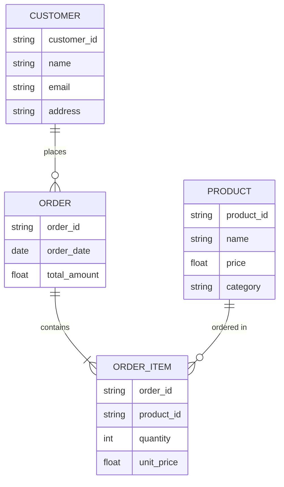
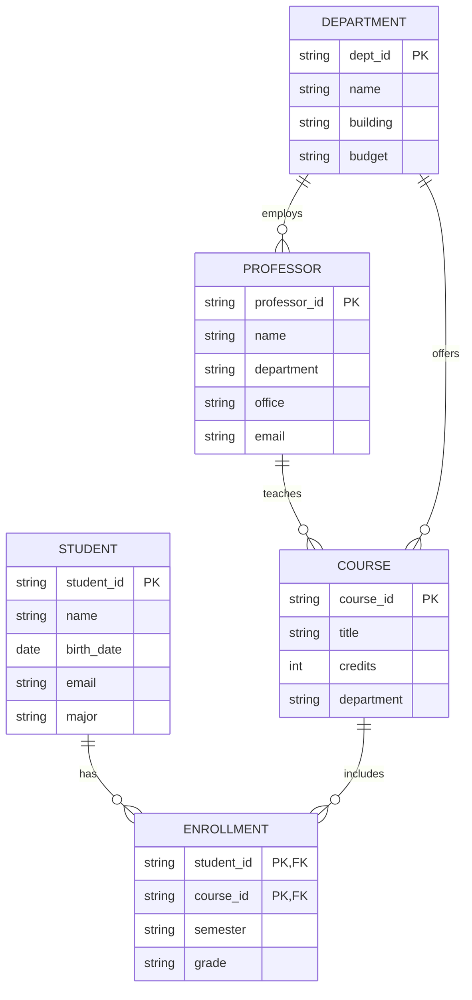
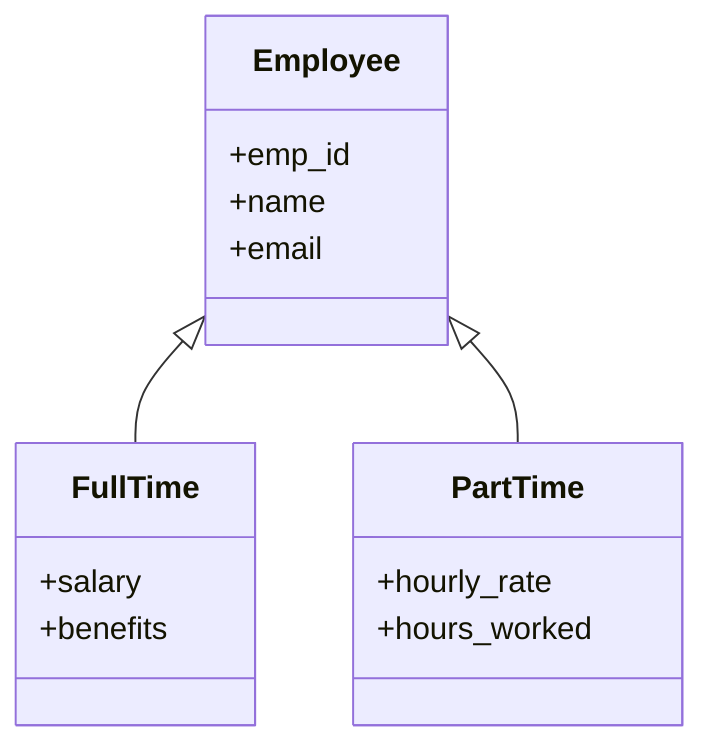
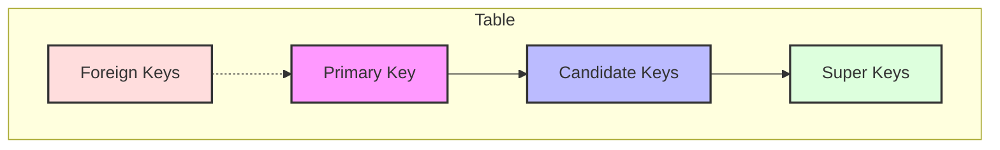
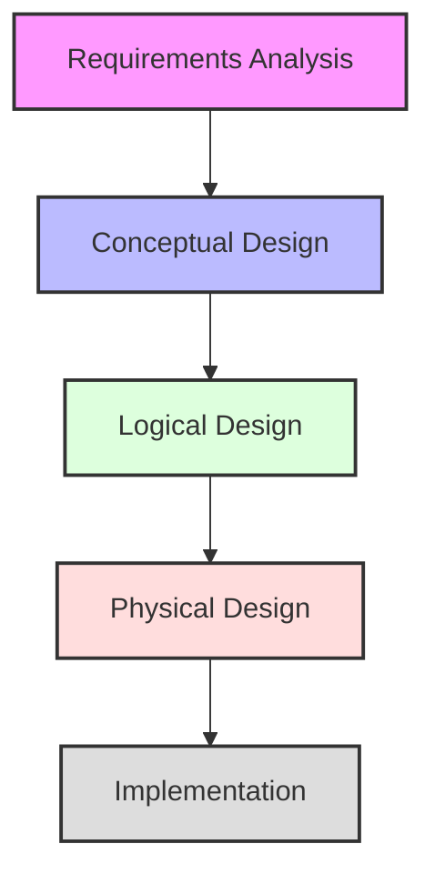
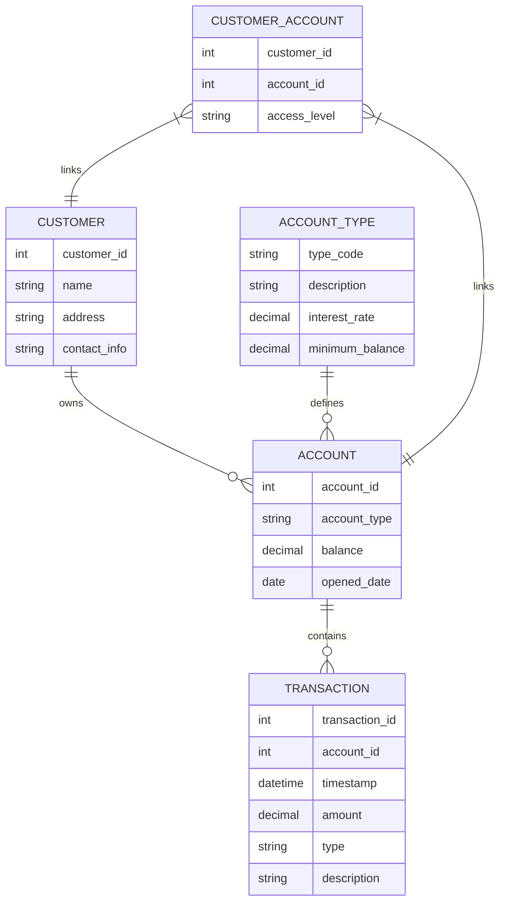
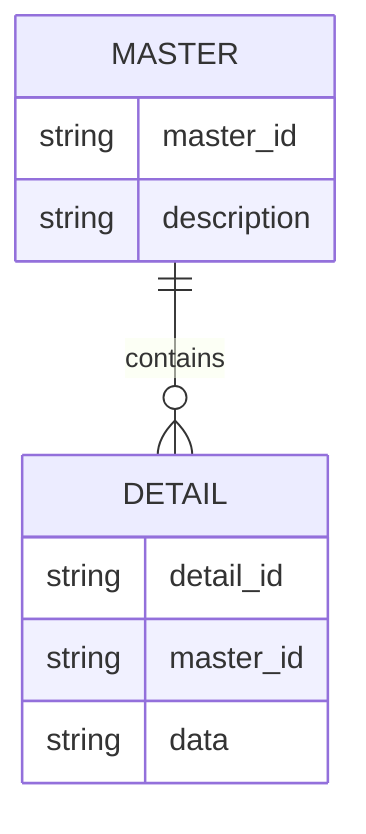
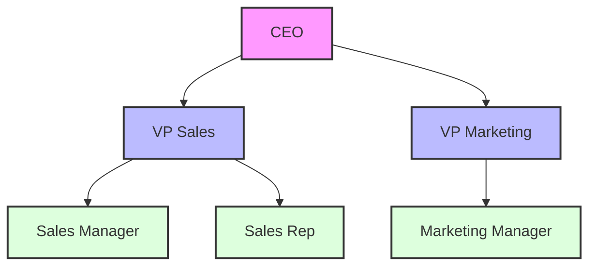
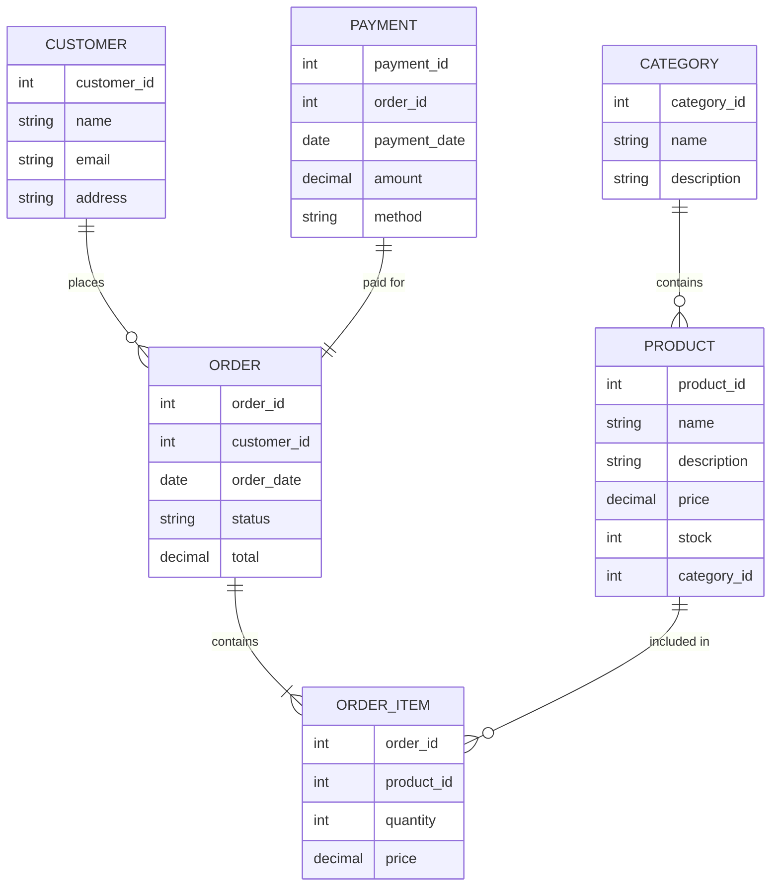
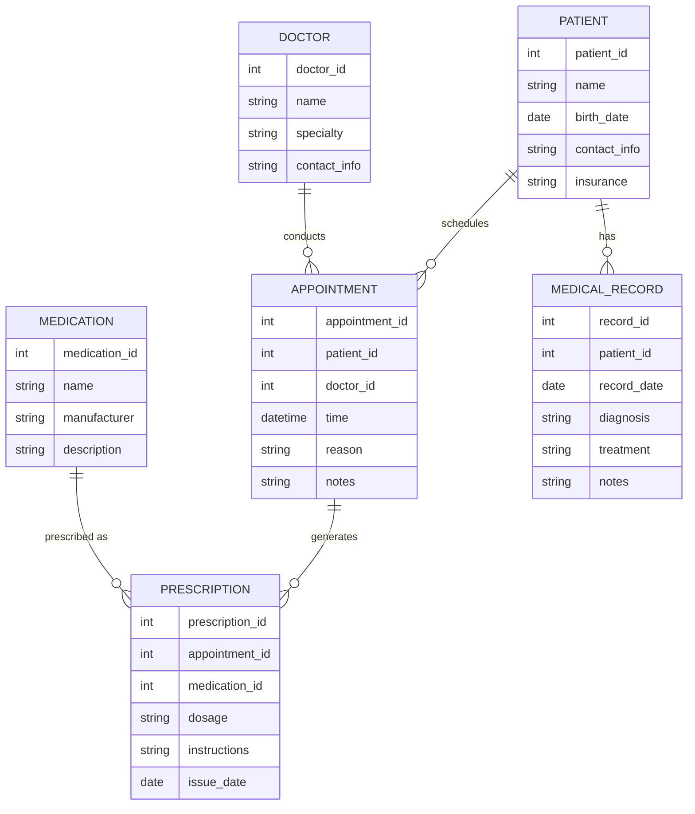

# Database Design and Modeling

[← Previous: Introduction](introduction.md) | [Back to Course Content](README.md) | [Next: Database Implementation →](database-implementation.md)

> Reference: This content is based on Lecture 2 (L2 CSC 542 2.0 DBA)

---

## What is Database Design?

<div title="Database design is the process of creating a structured blueprint for a database, determining how data will be stored, organized, and manipulated">
Database design is the process of producing a detailed model of a database to meet specified requirements. It involves defining data structures, relationships between data elements, and the rules that govern operations on the data.
</div>

### Importance of Good Database Design

| Benefit | Description | Real-World Impact |
|---------|-------------|-------------------|
| **Data Integrity** | Prevents invalid or inconsistent data | Accurate financial records in banking systems |
| **Efficiency** | Optimizes storage and retrieval | Fast response times in e-commerce applications |
| **Scalability** | Accommodates growth | Social media platforms handling millions of new users |
| **Maintainability** | Easier to modify and extend | Healthcare systems adapting to new regulations |
| **Security** | Better control over sensitive data | Protection of personal information in identity systems |
| **Consistency** | Unified view of data | Consistent customer experience across channels |

<details>
<summary><strong>Consequences of Poor Database Design</strong></summary>

1. **Data Redundancy**
   - Duplicated data wastes storage
   - Updates must be made in multiple places
   - Example: Customer addresses stored in multiple tables, leading to inconsistencies when updated

2. **Data Anomalies**
   - Insert anomalies: Cannot add data without other unrelated data
   - Update anomalies: Changes must be made in multiple places
   - Delete anomalies: Deleting data unintentionally removes other needed data
   - Example: Deleting an order deletes the only record of a customer's address

3. **Poor Performance**
   - Inefficient queries
   - Excessive joins
   - Example: A simple customer lookup requires joining 7 tables due to poor design

4. **Difficult Maintenance**
   - Hard to modify structure
   - Complex dependencies
   - Example: Adding a new product category requires changes to dozens of procedures
</details>

---

## Entity-Relationship Model

<div title="The ER model is a conceptual data model that describes the structure of a database using entities, relationships, and attributes">
The Entity-Relationship (ER) model is a high-level data model used to describe the structure of a database.
</div>

### Sample ER Diagram


<details>
<summary><strong>ER Model Components</strong></summary>

1. **Entities**
   - Real-world objects or concepts
   - Represented as rectangles
   - Examples: Customer, Order, Product

2. **Attributes**
   - Properties of entities
   - Represented as ovals
   - Types:
     - Simple vs Composite
     - Single-valued vs Multi-valued
     - Stored vs Derived

3. **Relationships**
   - Connections between entities
   - Represented as diamonds
   - Cardinality:
     - One-to-One (1:1)
     - One-to-Many (1:N)
     - Many-to-Many (M:N)

4. **Keys**
   - Primary Key: Unique identifier
   - Foreign Key: References other entities
   - Composite Key: Multiple attributes
</details>

### Cardinality Notation Comparison

| Relationship | Chen Notation | Crow's Foot | UML | Example |
|--------------|--------------|-------------|-----|---------|
| **One-to-One** | 1 — 1 | ──┼──────┼── | 1 — 1 | Person - Passport |
| **One-to-Many** | 1 — M | ──┼──────〈 | 1 — * | Department - Employee |
| **Many-to-One** | M — 1 | ──〉────┼── | * — 1 | Student - Class |
| **Many-to-Many** | M — N | ──〉────〈 | * — * | Student - Course |
| **Zero or One** | (0,1) | ──○────── | 0..1 | Person - Vehicle |
| **Zero or More** | (0,N) | ──○────〈 | 0..* | Person - Skill |

### Real-World ER Model Application

**University Database System**


### Entity Types and Relationships

<details>
<summary><strong>Entity Types and Relationships</strong></summary>

1. **Entity Types**
   - Strong Entities
     - Independent existence
     - Has primary key
     - Example: Customer, Product
   
   - Weak Entities
     - Depends on another entity
     - Partial key
     - Example: Order_Item depends on Order

2. **Relationship Types**
   - Binary Relationships
     - Between two entities
     - Most common type
     - Example: Customer places Order
   
   - Ternary Relationships
     - Between three entities
     - More complex
     - Example: Student takes Course from Professor
   
   - Recursive Relationships
     - Entity relates to itself
     - Example: Employee supervises Employee
</details>

### Enhanced ER Features

1. **Specialization/Generalization**
   - ISA relationships
   - Superclass and subclass entities
   - Inheritance of attributes
   - Types:
     - Total vs. Partial
     - Disjoint vs. Overlapping

2. **Aggregation**
   - Treating relationships as entities
   - Used for higher-level relationships
   - Reduces complexity

3. **Weak Entities**
   - Entities without key attributes
   - Dependent on owner entity
   - Identified through relationship

#### Specialization/Generalization Example


<details>
<summary><strong>Enhanced ER Features Details</strong></summary>

1. **Specialization**
   - Top-down process
   - Subclass inherits from superclass
   - Example: Employee → FullTime/PartTime

2. **Generalization**
   - Bottom-up process
   - Common attributes grouped
   - Example: FullTime/PartTime → Employee

3. **Inheritance**
   - Attributes inherited from parent
   - Additional attributes in child
   - Methods can be overridden

4. **Constraints**
   - Disjoint vs Overlapping
   - Total vs Partial
   - Example:
     ```sql
     CREATE TABLE Employee (
         emp_id INT PRIMARY KEY,
         name VARCHAR(100),
         email VARCHAR(100),
         type VARCHAR(20) CHECK (type IN ('FullTime', 'PartTime'))
     );
     ```
</details>

---

## Relational Data Model

<div title="The relational model organizes data into tables (relations) with rows and columns, using keys to establish relationships">
The relational model is based on the mathematical concept of relations and represents data in the form of tables.
</div>

### Table Relationships
```mermaid
graph LR
    A[Department] --"1"---"N"--B[Employee]
    B --"N"---"M"--C[Project]
    
    style A fill:#bbf,stroke:#333,stroke-width:2px
    style B fill:#dfd,stroke:#333,stroke-width:2px
    style C fill:#fdd,stroke:#333,stroke-width:2px
```

<details>
<summary><strong>Relational Model Components</strong></summary>

1. **Relations (Tables)**
   - Collection of tuples
   - Schema defines structure
   - Example:
     ```sql
     CREATE TABLE Employee (
         emp_id INT PRIMARY KEY,
         name VARCHAR(100),
         dept_id INT,
         FOREIGN KEY (dept_id) REFERENCES Department(dept_id)
     );
     ```

2. **Attributes (Columns)**
   - Properties of entities
   - Data types and constraints
   - Example:
     ```sql
     CREATE TABLE Department (
         dept_id INT PRIMARY KEY,
         name VARCHAR(100) NOT NULL,
         location VARCHAR(100)
     );
     ```

3. **Tuples (Rows)**
   - Individual records
   - Must satisfy constraints
   - Example:
     ```sql
     INSERT INTO Employee VALUES (1, 'John Doe', 101);
     ```

4. **Keys**
   - Primary Key: Unique identifier
   - Foreign Key: References other tables
   - Composite Key: Multiple columns
</details>

### Relational Algebra Operations

| Operation | Symbol | Description | Example SQL |
|-----------|--------|-------------|------------|
| **Selection** | σ (sigma) | Filters rows based on condition | `SELECT * FROM Employee WHERE dept_id = 101` |
| **Projection** | π (pi) | Selects specific columns | `SELECT name, email FROM Employee` |
| **Union** | ∪ | Combines two relations | `SELECT * FROM Employee1 UNION SELECT * FROM Employee2` |
| **Intersection** | ∩ | Common rows in two relations | `SELECT * FROM Employee1 INTERSECT SELECT * FROM Employee2` |
| **Difference** | - | Rows in first but not second relation | `SELECT * FROM Employee1 EXCEPT SELECT * FROM Employee2` |
| **Product** | × | Cartesian product of two relations | `SELECT * FROM Employee, Department` |
| **Join** | ⋈ | Combines related tuples | `SELECT * FROM Employee JOIN Department ON Employee.dept_id = Department.dept_id` |
| **Division** | ÷ | Complex operation for "for all" queries | Custom SQL with NOT EXISTS |

### Mapping ER to Relational Model

| ER Concept | Relational Mapping | Example |
|------------|-------------------|---------|
| **Entity** | Table | `CREATE TABLE Customer (...)` |
| **Attribute** | Column | `customer_id, name, email` |
| **Primary Key** | Primary Key constraint | `customer_id PRIMARY KEY` |
| **1:1 Relationship** | Foreign key in either table | `FOREIGN KEY (passport_id) REFERENCES Passport(id)` |
| **1:N Relationship** | Foreign key in "many" table | `FOREIGN KEY (dept_id) REFERENCES Department(id)` |
| **M:N Relationship** | Junction table with two foreign keys | `OrderItems with order_id and product_id` |
| **Weak Entity** | Table with composite primary key | `Dependent(emp_id, dependent_name)` |
| **Specialization** | Single table or multiple tables | `Employee with type OR Manager, Staff tables` |

### Keys and Dependencies


<details>
<summary><strong>Key Types and Dependencies</strong></summary>

1. **Primary Key**
   - Unique identifier
   - Cannot be null
   - Example:
     ```sql
     CREATE TABLE Student (
         student_id INT PRIMARY KEY,
         name VARCHAR(100)
     );
     ```

2. **Candidate Keys**
   - Potential primary keys
   - Unique and minimal
   - Example:
     ```sql
     -- Both email and student_id could be primary keys
     CREATE TABLE Student (
         student_id INT,
         email VARCHAR(100),
         name VARCHAR(100),
         UNIQUE(email)
     );
     ```

3. **Foreign Keys**
   - References other tables
   - Maintains referential integrity
   - Example:
     ```sql
     CREATE TABLE Enrollment (
         student_id INT,
         course_id INT,
         FOREIGN KEY (student_id) REFERENCES Student(student_id),
         FOREIGN KEY (course_id) REFERENCES Course(course_id)
     );
     ```

4. **Functional Dependencies**
   - Attribute relationships
   - Used in normalization
   - Example:
     ```
     student_id → name, email
     course_id → course_name, credits
     ```
</details>

### Integrity Constraints

1. **Entity Integrity**
   - Primary key cannot be null
   - Ensures unique identification
   - Example: `student_id` cannot be null in `Students` table

2. **Referential Integrity**
   - Foreign key must match existing primary key
   - Or be null if allowed
   - Example: `dept_id` in `Employee` must exist in `Department` table

3. **Domain Integrity**
   - Values must be within defined domain
   - Includes data types and ranges
   - Example: Salary must be positive, Age must be between 0 and 120

4. **User-Defined Integrity**
   - Business rules
   - Application-specific constraints
   - Example: Order total must match sum of line items

---

## Database Schema Design

### Design Process


### Design Guidelines

1. **Attribute Atomicity**
   - Each attribute should be atomic
   - No multi-valued attributes
   - No composite attributes
   - Example: Split "Full Name" into "First Name" and "Last Name"

2. **Minimal Redundancy**
   - Avoid storing same data multiple times
   - Use relationships instead of duplication
   - Example: Store product details once, reference by ID in orders

3. **Data Integrity**
   - Design should enforce integrity constraints
   - Use appropriate key constraints
   - Example: Define foreign keys to ensure valid relationships

4. **Flexibility**
   - Schema should be adaptable
   - Allow for future changes
   - Example: Use categories instead of hard-coded types

### Schema Design Case Study: Banking System

**Requirements:**
- Track customer accounts and transactions
- Support multiple account types
- Maintain transaction history
- Handle joint accounts

**Conceptual Design:**


**Logical Design:**
```sql
-- Customer Table
CREATE TABLE Customer (
    customer_id INT PRIMARY KEY,
    first_name VARCHAR(50) NOT NULL,
    last_name VARCHAR(50) NOT NULL,
    address VARCHAR(200),
    city VARCHAR(50),
    state VARCHAR(2),
    zip VARCHAR(10),
    phone VARCHAR(15),
    email VARCHAR(100)
);

-- Account Type Table
CREATE TABLE Account_Type (
    type_code VARCHAR(10) PRIMARY KEY,
    description VARCHAR(100),
    interest_rate DECIMAL(5,2),
    minimum_balance DECIMAL(10,2),
    monthly_fee DECIMAL(7,2)
);

-- Account Table
CREATE TABLE Account (
    account_id INT PRIMARY KEY,
    type_code VARCHAR(10) NOT NULL,
    balance DECIMAL(10,2) NOT NULL,
    opened_date DATE NOT NULL,
    status VARCHAR(10) NOT NULL,
    FOREIGN KEY (type_code) REFERENCES Account_Type(type_code)
);

-- Customer_Account Junction Table (for joint accounts)
CREATE TABLE Customer_Account (
    customer_id INT,
    account_id INT,
    access_level VARCHAR(20) NOT NULL,
    PRIMARY KEY (customer_id, account_id),
    FOREIGN KEY (customer_id) REFERENCES Customer(customer_id),
    FOREIGN KEY (account_id) REFERENCES Account(account_id)
);

-- Transaction Table
CREATE TABLE Transaction (
    transaction_id INT PRIMARY KEY,
    account_id INT NOT NULL,
    transaction_date DATETIME NOT NULL,
    amount DECIMAL(10,2) NOT NULL,
    type VARCHAR(20) NOT NULL,
    description VARCHAR(100),
    FOREIGN KEY (account_id) REFERENCES Account(account_id)
);
```

### Common Design Patterns

1. **Master-Detail**
   - One master table
   - Multiple detail tables
   - One-to-many relationships
   - Example: Order (master) and OrderItems (detail)

2. **Hierarchical Data**
   - Parent-child relationships
   - Self-referencing tables
   - Closure tables
   - Example: Organizational structure with managers and employees

3. **Many-to-Many**
   - Junction tables
   - Association tables
   - Link tables
   - Example: Students and Courses linked by Enrollment table

4. **Temporal Data**
   - Historical tracking
   - Effective dating
   - Audit trails
   - Example: Employee salary history with effective dates

#### Master-Detail Pattern


#### Hierarchical Data Pattern


### Implementing Hierarchical Data: Comparison of Approaches

| Approach | Description | Pros | Cons | Example SQL |
|----------|-------------|------|------|------------|
| **Adjacency List** | Each record points to parent | Simple, intuitive | Inefficient for deep queries | `Parent_ID references ID` |
| **Nested Sets** | Left/Right values define tree | Fast read operations | Expensive updates | `LEFT_ID < child LEFT_ID AND RIGHT_ID > child RIGHT_ID` |
| **Materialized Path** | Store path as string | Good for path queries | Complex implementation | `path LIKE '/1/2/3/%'` |
| **Closure Table** | Store all relationships | Flexible and efficient | Extra storage needed | Junction table with ancestor/descendant |

```sql
-- Adjacency List Example
CREATE TABLE Employee (
    id INT PRIMARY KEY,
    name VARCHAR(100),
    manager_id INT,
    FOREIGN KEY (manager_id) REFERENCES Employee(id)
);

-- Closure Table Example
CREATE TABLE Employee_Hierarchy (
    ancestor_id INT,
    descendant_id INT,
    depth INT,
    PRIMARY KEY (ancestor_id, descendant_id),
    FOREIGN KEY (ancestor_id) REFERENCES Employee(id),
    FOREIGN KEY (descendant_id) REFERENCES Employee(id)
);
```

### Design Optimization

1. **Denormalization**
   - Controlled redundancy
   - Performance improvement
   - Trade-offs involved
   - Example: Storing product_name in OrderItems for faster queries

2. **Indexing Strategy**
   - Choose appropriate indexes
   - Balance retrieval vs. update
   - Consider query patterns
   - Example: Index on frequently filtered columns

3. **Partitioning**
   - Horizontal partitioning (sharding)
   - Vertical partitioning
   - Improve performance
   - Example: Partition customer data by region

4. **Views**
   - Virtual tables
   - Data abstraction
   - Security implementation
   - Example: Create limited view for customer service staff

### Comparison: Normalization vs. Denormalization

| Factor | Normalization | Denormalization |
|--------|--------------|-----------------|
| **Data Redundancy** | Minimized | Controlled redundancy |
| **Data Integrity** | Better | Requires vigilance |
| **Query Complexity** | Complex joins | Simpler queries |
| **Read Performance** | Slower for complex queries | Faster reads |
| **Write Performance** | Better for updates | Overhead for updates |
| **Storage Requirements** | Generally less | More space needed |
| **Best For** | OLTP systems | OLAP/reporting systems |
| **Example Use Case** | Banking transactions | Sales reports |

---

## Real-World Design Examples

### E-Commerce Database



### Healthcare System Database



## Related Topics
- [Database Implementation](database-implementation.md) - Physical design and implementation
- [Database Normalization](normalization.md) - Detailed coverage of normalization concepts
- [SQL and Database Programming](sql-programming.md) - Implementation in SQL

---
[← Previous: Introduction](introduction.md) | [Back to Course Content](README.md) | [Next: Database Implementation →](database-implementation.md) 