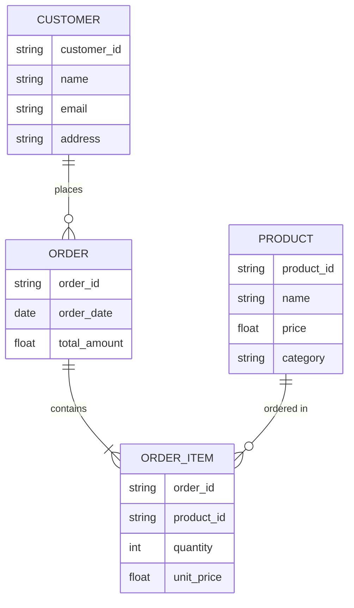
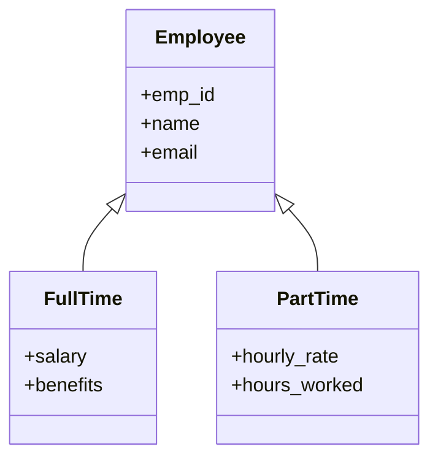
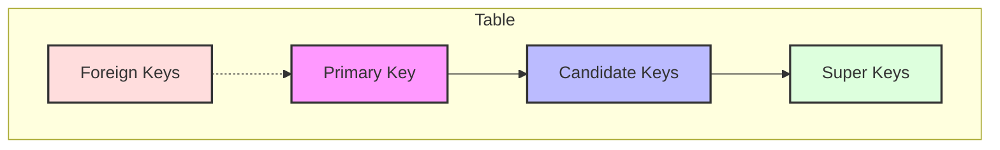
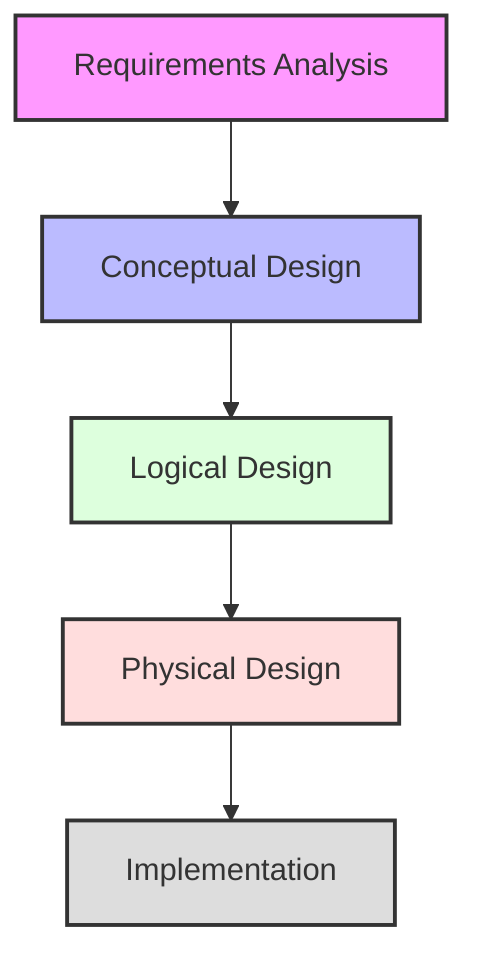
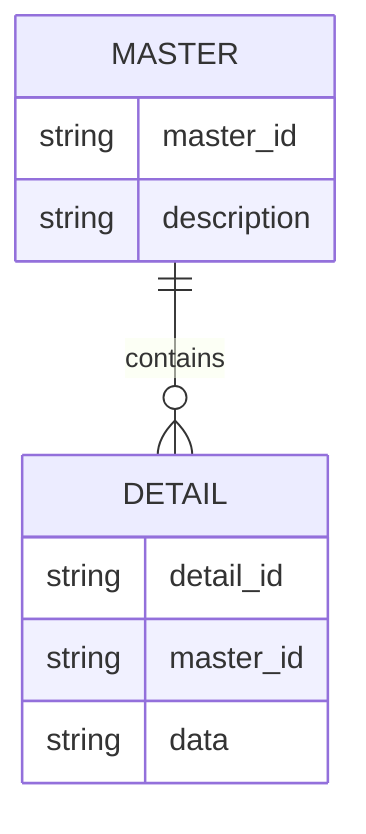
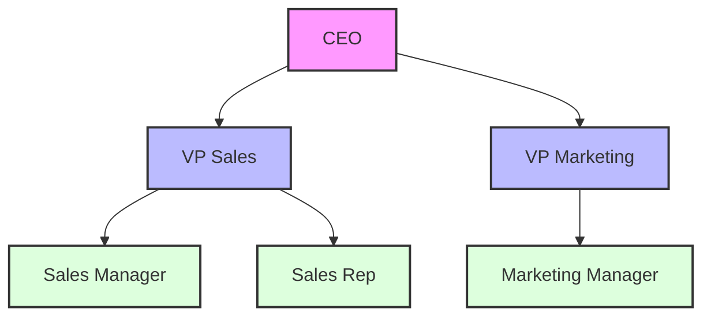

# Database Design and Modeling

[← Previous: Introduction](introduction.md) | [Back to Course Content](README.md) | [Next: Database Implementation →](database-implementation.md)

> Reference: This content is based on Lecture 2 (L2 CSC 542 2.0 DBA)

## Entity-Relationship Model

<div title="The ER model is a conceptual data model that describes the structure of a database using entities, relationships, and attributes">
The Entity-Relationship (ER) model is a high-level data model used to describe the structure of a database.
</div>

### Sample ER Diagram


<details>
<summary><strong>ER Model Components</strong></summary>

1. **Entities**
   - Real-world objects or concepts
   - Represented as rectangles
   - Examples: Customer, Order, Product

2. **Attributes**
   - Properties of entities
   - Represented as ovals
   - Types:
     - Simple vs Composite
     - Single-valued vs Multi-valued
     - Stored vs Derived

3. **Relationships**
   - Connections between entities
   - Represented as diamonds
   - Cardinality:
     - One-to-One (1:1)
     - One-to-Many (1:N)
     - Many-to-Many (M:N)

4. **Keys**
   - Primary Key: Unique identifier
   - Foreign Key: References other entities
   - Composite Key: Multiple attributes
</details>

### Basic Concepts

<details>
<summary><strong>Entity Types and Relationships</strong></summary>

1. **Entity Types**
   - Strong Entities
     - Independent existence
     - Has primary key
     - Example: Customer, Product
   
   - Weak Entities
     - Depends on another entity
     - Partial key
     - Example: Order_Item depends on Order

2. **Relationship Types**
   - Binary Relationships
     - Between two entities
     - Most common type
     - Example: Customer places Order
   
   - Ternary Relationships
     - Between three entities
     - More complex
     - Example: Student takes Course from Professor
   
   - Recursive Relationships
     - Entity relates to itself
     - Example: Employee supervises Employee
</details>

### ER Diagram Components

1. **Entity Sets**
   - Rectangle represents entity set
   - Name appears inside rectangle
   - Attributes listed below or connected

2. **Attributes**
   - Oval represents attribute
   - Name appears inside oval
   - Connected to entity set by line
   - Key attributes underlined

3. **Relationships**
   - Diamond represents relationship
   - Name appears inside diamond
   - Connected to participating entities
   - Cardinality ratios shown on lines

### Enhanced ER Features

1. **Specialization/Generalization**
   - ISA relationships
   - Superclass and subclass entities
   - Inheritance of attributes
   - Types:
     - Total vs. Partial
     - Disjoint vs. Overlapping

2. **Aggregation**
   - Treating relationships as entities
   - Used for higher-level relationships
   - Reduces complexity

3. **Weak Entities**
   - Entities without key attributes
   - Dependent on owner entity
   - Identified through relationship

#### Specialization/Generalization Example


<details>
<summary><strong>Enhanced ER Features Details</strong></summary>

1. **Specialization**
   - Top-down process
   - Subclass inherits from superclass
   - Example: Employee → FullTime/PartTime

2. **Generalization**
   - Bottom-up process
   - Common attributes grouped
   - Example: FullTime/PartTime → Employee

3. **Inheritance**
   - Attributes inherited from parent
   - Additional attributes in child
   - Methods can be overridden

4. **Constraints**
   - Disjoint vs Overlapping
   - Total vs Partial
   - Example:
     ```sql
     CREATE TABLE Employee (
         emp_id INT PRIMARY KEY,
         name VARCHAR(100),
         email VARCHAR(100),
         type VARCHAR(20) CHECK (type IN ('FullTime', 'PartTime'))
     );
     ```
</details>

## Relational Data Model

<div title="The relational model organizes data into tables (relations) with rows and columns, using keys to establish relationships">
The relational model is based on the mathematical concept of relations and represents data in the form of tables.
</div>

### Table Relationships
```mermaid
graph LR
    A[Department] --"1"---"N"--B[Employee]
    B --"N"---"M"--C[Project]
    
    style A fill:#bbf,stroke:#333,stroke-width:2px
    style B fill:#dfd,stroke:#333,stroke-width:2px
    style C fill:#fdd,stroke:#333,stroke-width:2px
```

<details>
<summary><strong>Relational Model Components</strong></summary>

1. **Relations (Tables)**
   - Collection of tuples
   - Schema defines structure
   - Example:
     ```sql
     CREATE TABLE Employee (
         emp_id INT PRIMARY KEY,
         name VARCHAR(100),
         dept_id INT,
         FOREIGN KEY (dept_id) REFERENCES Department(dept_id)
     );
     ```

2. **Attributes (Columns)**
   - Properties of entities
   - Data types and constraints
   - Example:
     ```sql
     CREATE TABLE Department (
         dept_id INT PRIMARY KEY,
         name VARCHAR(100) NOT NULL,
         location VARCHAR(100)
     );
     ```

3. **Tuples (Rows)**
   - Individual records
   - Must satisfy constraints
   - Example:
     ```sql
     INSERT INTO Employee VALUES (1, 'John Doe', 101);
     ```

4. **Keys**
   - Primary Key: Unique identifier
   - Foreign Key: References other tables
   - Composite Key: Multiple columns
</details>

### Keys and Dependencies


<details>
<summary><strong>Key Types and Dependencies</strong></summary>

1. **Primary Key**
   - Unique identifier
   - Cannot be null
   - Example:
     ```sql
     CREATE TABLE Student (
         student_id INT PRIMARY KEY,
         name VARCHAR(100)
     );
     ```

2. **Candidate Keys**
   - Potential primary keys
   - Unique and minimal
   - Example:
     ```sql
     -- Both email and student_id could be primary keys
     CREATE TABLE Student (
         student_id INT,
         email VARCHAR(100),
         name VARCHAR(100),
         UNIQUE(email)
     );
     ```

3. **Foreign Keys**
   - References other tables
   - Maintains referential integrity
   - Example:
     ```sql
     CREATE TABLE Enrollment (
         student_id INT,
         course_id INT,
         FOREIGN KEY (student_id) REFERENCES Student(student_id),
         FOREIGN KEY (course_id) REFERENCES Course(course_id)
     );
     ```

4. **Functional Dependencies**
   - Attribute relationships
   - Used in normalization
   - Example:
     ```
     student_id → name, email
     course_id → course_name, credits
     ```
</details>

### Basic Concepts

1. **Relation**
   - Table with rows and columns
   - Properties:
     - Ordering of rows immaterial
     - Duplicate rows not allowed
     - Ordering of columns immaterial
     - Values atomic

2. **Attributes**
   - Columns of the relation
   - Each attribute has a domain
   - Must have unique names within relation

3. **Tuple**
   - Row of the relation
   - Contains one value for each attribute
   - Must be unique within relation

### Keys

1. **Superkey**
   - Set of attributes that uniquely identifies tuples
   - May contain unnecessary attributes

2. **Candidate Key**
   - Minimal superkey
   - No proper subset is a superkey
   - May have multiple candidate keys

3. **Primary Key**
   - Chosen candidate key
   - Used to identify tuples
   - Should be:
     - Unique
     - Minimal
     - Never changing
     - Never null

4. **Foreign Key**
   - Attributes referencing primary key
   - Creates relationships between tables
   - Maintains referential integrity

### Integrity Constraints

1. **Entity Integrity**
   - Primary key cannot be null
   - Ensures unique identification

2. **Referential Integrity**
   - Foreign key must match existing primary key
   - Or be null if allowed

3. **Domain Integrity**
   - Values must be within defined domain
   - Includes data types and ranges

4. **User-Defined Integrity**
   - Business rules
   - Application-specific constraints

## Database Schema Design

### Design Process


### Design Guidelines

1. **Attribute Atomicity**
   - Each attribute should be atomic
   - No multi-valued attributes
   - No composite attributes

2. **Minimal Redundancy**
   - Avoid storing same data multiple times
   - Use relationships instead of duplication

3. **Data Integrity**
   - Design should enforce integrity constraints
   - Use appropriate key constraints

4. **Flexibility**
   - Schema should be adaptable
   - Allow for future changes

### Design Steps

1. **Requirement Analysis**
   - Understand business rules
   - Identify data requirements
   - Document constraints

2. **Conceptual Design**
   - Create ER diagram
   - Define entities and relationships
   - Identify attributes

3. **Logical Design**
   - Convert ER to relations
   - Apply normalization
   - Define integrity constraints

4. **Physical Design**
   - Choose storage structures
   - Define access paths
   - Implement security

### Common Design Patterns

1. **Master-Detail**
   - One master table
   - Multiple detail tables
   - One-to-many relationships

2. **Hierarchical Data**
   - Parent-child relationships
   - Self-referencing tables
   - Closure tables

3. **Many-to-Many**
   - Junction tables
   - Association tables
   - Link tables

4. **Temporal Data**
   - Historical tracking
   - Effective dating
   - Audit trails

#### Master-Detail Pattern


#### Hierarchical Data Pattern


### Design Optimization

1. **Denormalization**
   - Controlled redundancy
   - Performance improvement
   - Trade-offs involved

2. **Indexing Strategy**
   - Choose appropriate indexes
   - Balance retrieval vs. update
   - Consider query patterns

3. **Partitioning**
   - Horizontal partitioning
   - Vertical partitioning
   - Improve performance

4. **Views**
   - Virtual tables
   - Data abstraction
   - Security implementation

## Related Topics
- [Database Implementation](database-implementation.md) - Physical design and implementation
- [Database Normalization](normalization.md) - Detailed coverage of normalization concepts
- [SQL and Database Programming](sql-programming.md) - Implementation in SQL

---
[← Previous: Introduction](introduction.md) | [Back to Course Content](README.md) | [Next: Database Implementation →](database-implementation.md) 