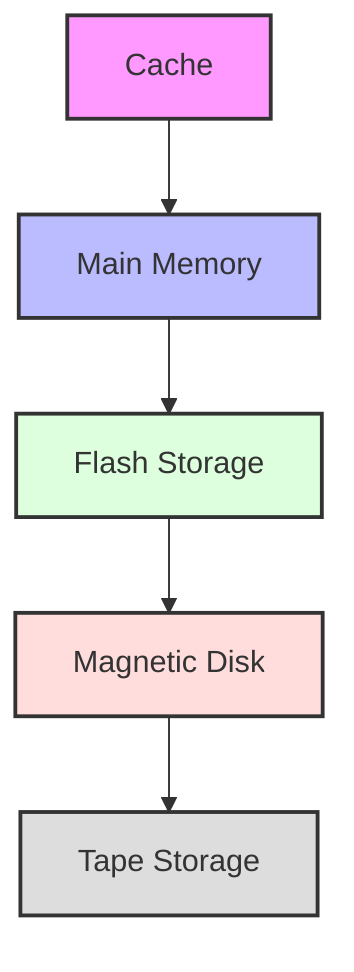
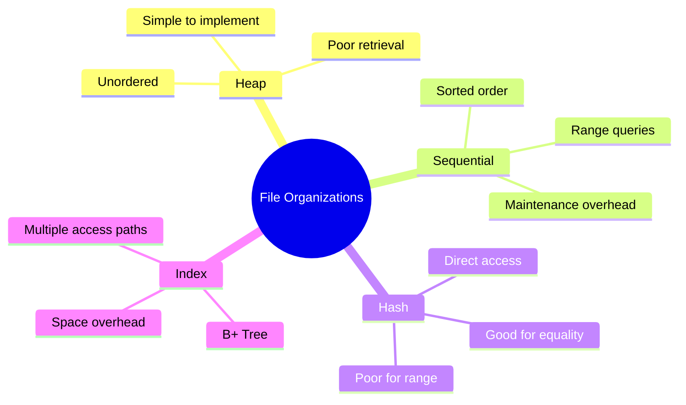
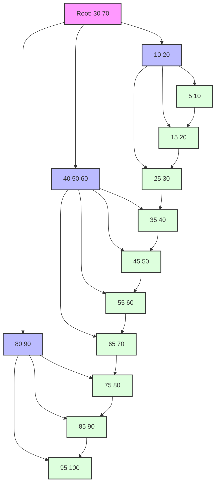
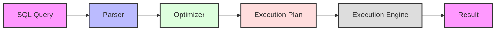
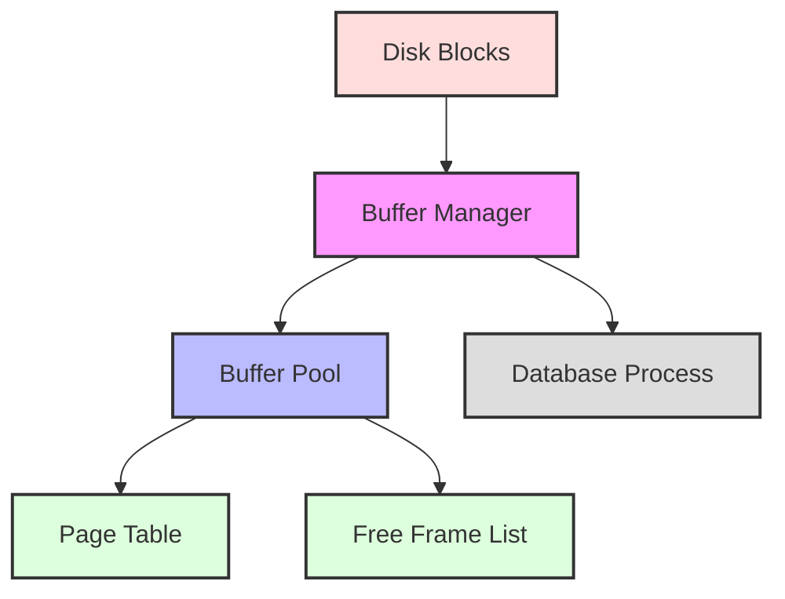

# Database Implementation

[← Previous: Database Design](database-design.md) | [Back to Course Content](README.md) | [Next: Transaction Management →](transaction-management.md)

> Reference: This content is based on Lecture 3 (L3 CSC 542 2.0 DBA)

---

## What is Database Implementation?

<div title="Database implementation is the process of converting a database design into an operational database system with the physical data structures and functional components needed to support business applications">
Database implementation is the process of translating the logical database design into a physical database system. It involves creating the physical schema, setting up storage structures, establishing access methods, and optimizing for performance.
</div>

### Implementation Process

| Phase | Activities | Deliverables |
|-------|------------|--------------|
| **Physical Design** | Storage structure selection, indexing strategy | Physical schema definition |
| **Database Creation** | Schema creation, table and constraint creation | Working database structure |
| **Data Loading** | Initial data population, data migration | Populated database |
| **Security Implementation** | User management, access control | Security framework |
| **Performance Tuning** | Query optimization, indexing | Optimized database |
| **Deployment** | Moving to production environment | Live database system |
| **Maintenance** | Monitoring, backup/recovery, upgrades | Operational procedures |

<details>
<summary><strong>Real-World Implementation Considerations</strong></summary>

1. **Scalability Planning**
   - Estimated data growth
   - Concurrent user projections
   - Infrastructure requirements
   - Example: An e-commerce platform planning for 200% growth over 2 years

2. **Integration Requirements**
   - Connection with existing systems
   - API interfaces
   - ETL processes
   - Example: Integrating a new inventory system with existing order processing

3. **Compliance Factors**
   - Industry regulations (GDPR, HIPAA, PCI-DSS)
   - Data retention policies
   - Audit requirements
   - Example: Healthcare database implementing HIPAA-compliant data storage

4. **Operational Constraints**
   - Availability requirements
   - Backup windows
   - Maintenance schedules
   - Example: Financial system requiring 99.99% uptime with minimal maintenance windows
</details>

---

## Physical Database Design

<div title="Physical database design focuses on how data is stored and accessed at the physical level, including storage structures and access methods">
Physical database design involves the implementation of database structures and mechanisms for efficient data storage and retrieval.
</div>

### Storage Hierarchy


<details>
<summary><strong>Storage Hierarchy Details</strong></summary>

1. **Cache Memory**
   - Fastest access (nanoseconds)
   - Limited capacity
   - Examples:
     - L1, L2, L3 caches
     - Buffer cache
     - Query cache

2. **Main Memory (RAM)**
   - Fast access (microseconds)
   - Volatile storage
   - Examples:
     - Database buffer pool
     - Sort areas
     - Temporary tables

3. **Flash Storage**
   - Medium speed (milliseconds)
   - Non-volatile
   - Examples:
     - SSDs
     - Flash arrays
     - Hybrid storage

4. **Magnetic Disk**
   - Slower access (milliseconds)
   - Large capacity
   - Examples:
     - HDDs
     - RAID arrays
     - Storage area networks

5. **Tape Storage**
   - Slowest access (seconds)
   - Archival storage
   - Examples:
     - Backup tapes
     - Long-term storage
     - Disaster recovery
</details>

### Storage Access Cost Comparison

| Storage Type | Access Time | Cost/GB | Volatility | Typical Use Case |
|--------------|-------------|---------|------------|------------------|
| **CPU Cache** | 0.5-15 ns | $5,000+ | Volatile | Frequent data access |
| **Main Memory** | 50-100 ns | $10-20 | Volatile | Active datasets, buffer pools |
| **SSD** | 20-100 μs | $0.10-0.50 | Non-volatile | Database files, indexes |
| **HDD** | 5-10 ms | $0.02-0.05 | Non-volatile | Large datasets, historical data |
| **Tape** | seconds-minutes | $0.01-0.02 | Non-volatile | Archival, backup |

### Disk Access Time Calculation

The total time to access data on disk can be calculated as:

**T<sub>access</sub> = T<sub>seek</sub> + T<sub>rotation</sub> + T<sub>transfer</sub>**

Where:
- **T<sub>seek</sub>** is the time to position the read/write head over the correct track (typically 3-10 ms)
- **T<sub>rotation</sub>** is the rotational latency, time for the sector to rotate under the head (avg: half rotation time)
- **T<sub>transfer</sub>** is the time to read/write the data (depends on rotation speed and data amount)

Example:
For a disk with 7200 RPM (rotations per minute), average seek time of 5 ms, and transfer rate of 100 MB/s:
- Rotation time per revolution = 60 / 7200 = 8.33 ms
- Average rotational latency = 8.33 / 2 = 4.17 ms
- Transfer time for 4 KB = 4 KB / 100 MB/s = 0.04 ms
- Total access time = 5 + 4.17 + 0.04 = 9.21 ms

### Storage Structures

1. **Files**
   - Collection of records
   - Basic unit of storage
   - Types:
     - Data files
     - Index files
     - Log files
     - Temporary files
     - System catalog files

2. **Pages/Blocks**
   - Fixed-size units of transfer
   - Typically 4KB to 16KB
   - Basic I/O unit
   - Page structure:
     - Header (metadata)
     - Records
     - Free space
     - Pointers to overflow pages

3. **Records**
   - Collection of related fields
   - Fixed or variable length
   - May span multiple blocks
   - Record formats:
     - Fixed-length
     - Variable-length
     - Spanned
     - Unspanned

### RAID Storage Systems

RAID (Redundant Array of Independent Disks) provides various levels of performance improvement and fault tolerance:

| RAID Level | Description | Pros | Cons | Use Case |
|------------|-------------|------|------|----------|
| **RAID 0** | Striping | Highest performance | No redundancy | High-performance temp data |
| **RAID 1** | Mirroring | Fast reads, redundancy | 50% capacity loss | Log files, critical systems |
| **RAID 5** | Striping with parity | Good balance, can survive 1 disk failure | Write penalty | General database storage |
| **RAID 6** | Striping with dual parity | Can survive 2 disk failures | Higher write penalty | Large archives |
| **RAID 10** | Striped mirrors | Fast performance, high reliability | 50% capacity loss | High-end OLTP systems |

---

## File Organizations

<div title="File organization determines how records are physically stored and accessed in the database, affecting performance and storage efficiency">
File organization methods define how data is structured and accessed at the physical level.
</div>

### File Structure Types


<details>
<summary><strong>File Organization Methods</strong></summary>

1. **Heap Organization**
   - Unordered records
   - Simple implementation
   - Example:
     ```sql
     CREATE TABLE unordered_table (
         id INT,
         data VARCHAR(100)
     ) ORGANIZATION HEAP;
     ```

2. **Sequential Organization**
   - Records in sorted order
   - Efficient for range queries
   - Example:
     ```sql
     CREATE TABLE ordered_table (
         id INT,
         data VARCHAR(100)
     ) ORGANIZATION INDEX;
     CREATE INDEX idx_id ON ordered_table(id);
     ```

3. **Hash Organization**
   - Direct access by key
   - Good for equality searches
   - Example:
     ```sql
     CREATE TABLE hash_table (
         id INT,
         data VARCHAR(100)
     ) ORGANIZATION HASH;
     ```

4. **Indexed Organization**
   - Multiple access paths
   - Flexible querying
   - Example:
     ```sql
     CREATE TABLE indexed_table (
         id INT,
         data VARCHAR(100)
     );
     CREATE INDEX idx_id ON indexed_table(id);
     CREATE INDEX idx_data ON indexed_table(data);
     ```
</details>

### File Organization Comparison

| Organization | Strengths | Weaknesses | Best For | Access Time |
|--------------|-----------|------------|----------|-------------|
| **Heap** | Fast inserts, simple | Slow retrieval | Bulk loading, logs | O(n) for retrieval |
| **Sequential** | Efficient for range queries | Expensive updates | Reports, batch processing | O(log n) with index |
| **Hash** | Fast equality lookups | Poor for ranges | Dictionary-type lookups | O(1) for equality |
| **Clustered Index** | Fast retrieval for ranges | Slower updates | Primary key access | O(log n) |
| **Non-clustered Index** | Multiple access paths | Storage overhead | Secondary key access | O(log n) + row lookup |

### Hash Functions

A good hash function distributes records evenly across buckets, minimizing collisions:

1. **Division Method**: h(k) = k mod m
   - Simple but can lead to uneven distribution if m is poorly chosen
   - Example: For key 123 and m=10, h(123) = 3

2. **Multiplication Method**: h(k) = ⌊m(kA mod 1)⌋
   - Where A is a constant (0 < A < 1), often A ≈ (√5-1)/2 ≈ 0.618
   - Example: For key 123, m=10, A=0.618, h(123) = ⌊10(123 × 0.618 mod 1)⌋ = 7

3. **Universal Hashing**: h(k) = ((ak + b) mod p) mod m
   - Where a, b are randomly chosen, p is a prime
   - Example: For key 123, a=7, b=11, p=17, m=10, h(123) = ((7×123 + 11) mod 17) mod 10 = 5

### Collision Resolution

1. **Chaining**
   - Store colliding records in a linked list
   - Simple implementation
   - Example: [5] → [Record A] → [Record B]

2. **Open Addressing**
   - Linear Probing: h(k, i) = (h(k) + i) mod m
   - Quadratic Probing: h(k, i) = (h(k) + c₁i + c₂i²) mod m
   - Double Hashing: h(k, i) = (h₁(k) + i·h₂(k)) mod m

---

## Indexing Techniques

### B-Tree vs. B+ Tree Comparison

| Feature | B-Tree | B+ Tree |
|---------|--------|---------|
| **Data Storage** | All nodes store keys and data | Only leaf nodes store data |
| **Leaf Nodes** | Not linked | Linked list for sequential access |
| **Node Capacity** | Fewer entries (key+data) | More entries (keys only in internal) |
| **Search Performance** | May find data in non-leaf nodes | Always traverse to leaf nodes |
| **Range Queries** | Less efficient | Efficient due to leaf linkage |
| **Space Efficiency** | Lower for sparse data | Higher with shared paths |
| **Common Use** | General purpose | Database systems |

### B+ Tree Structure


### B+ Tree Operations

1. **Search Algorithm**
   ```
   function search(key, node):
       if node is leaf:
           if key in node:
               return record
           else:
               return not found
       else:
           for i = 0 to number of keys:
               if key <= node.keys[i]:
                   return search(key, node.children[i])
           return search(key, node.children[number of keys])
   ```

2. **Insert Algorithm**
   ```
   function insert(key, value):
       locate leaf node for key
       if leaf has space:
           insert key and value
       else:
           split leaf node
           distribute keys evenly
           insert new key
           propagate split up tree if necessary
   ```

3. **Delete Algorithm**
   ```
   function delete(key):
       locate leaf node with key
       remove key and record
       if leaf underflows:
           borrow from sibling or merge
           adjust parent keys
           propagate changes up tree if necessary
   ```

### Index Selection Guidelines

| Factor | Consideration | Example |
|--------|---------------|---------|
| **Query Patterns** | Index columns in WHERE clauses | Customer searches by last name |
| **Cardinality** | High cardinality better for indexing | Email (unique) vs. Gender (low) |
| **Update Frequency** | Less indexes on frequently updated columns | Timestamp columns |
| **Join Conditions** | Index join columns | Customer ID in Orders table |
| **Range vs. Equality** | B+ Tree for ranges, Hash for equality | Date range vs. exact match |
| **Composite Indexes** | Consider column order based on queries | (last_name, first_name) |
| **Covering Indexes** | Include additional columns for index-only scans | Include price in product search index |

### Bitmap Indexes
1. **Structure**
   - Bit vectors
   - One per distinct value
   - Compression possible

2. **Advantages**
   - Space efficient
   - Fast bitwise operations
   - Good for low cardinality

3. **Applications**
   - Data warehousing
   - OLAP systems
   - Decision support

Example:
```
Value | Row1 | Row2 | Row3 | Row4 | Row5
------+------+------+------+------+------
  A   |   1  |   0  |   0  |   1  |   0
  B   |   0  |   1  |   0  |   0  |   1
  C   |   0  |   0  |   1  |   0  |   0
```

Bitmap operations for queries:
- `WHERE value = 'A' OR value = 'B'`: 10010 OR 01001 = 11011
- `WHERE value = 'A' AND value <> 'C'`: 10010 AND NOT(00100) = 10010

---

## Query Processing and Optimization

### Query Execution Flow


<details>
<summary><strong>Query Processing Steps</strong></summary>

1. **Parsing Phase**
   - Syntax checking
   - Semantic validation
   - Example:
     ```sql
     -- Valid syntax
     SELECT name FROM employees;
     
     -- Invalid syntax
     SELECT name FORM employees; -- Error
     ```

2. **Optimization Phase**
   - Plan generation
   - Cost estimation
   - Example:
     ```sql
     -- Query optimizer chooses best plan
     EXPLAIN SELECT * FROM employees 
     WHERE department = 'IT';
     ```

3. **Execution Phase**
   - Plan interpretation
   - Data retrieval
   - Example:
     ```sql
     -- Execution plan
     CREATE INDEX idx_dept ON employees(department);
     SELECT * FROM employees 
     WHERE department = 'IT';
     ```

4. **Result Generation**
   - Data formatting
   - Result set creation
   - Example:
     ```sql
     -- Result set
     SELECT name, salary 
     FROM employees 
     ORDER BY salary DESC;
     ```
</details>

### Join Methods Comparison

| Join Type | Algorithm | Best When | Cost | Example Usage |
|-----------|-----------|-----------|------|---------------|
| **Nested Loop Join** | For each row in outer, scan inner | Small outer table, indexed inner | O(n × m) or O(n × log m) with index | Small dimension tables |
| **Hash Join** | Build hash table, probe with other table | Large tables, equality joins | O(n + m) | Data warehousing |
| **Merge Join** | Sort both tables, merge | Both tables already sorted | O(n log n + m log m) or O(n + m) if sorted | Sorted data, range joins |
| **Index Nested Loop** | Use index on inner table | Good indexes available | O(n × log m) | OLTP queries |

### Example Join Operations

**Nested Loop Join:**
```
for each row r in R:
    for each row s in S:
        if r.joinAttr = s.joinAttr:
            add to result
```

**Hash Join:**
```
build hash table H for smaller table R using join attribute
for each row s in S:
    probe H for matching rows where r.joinAttr = s.joinAttr
    if found, add to result
```

**Merge Join:**
```
sort R on join attribute if not already sorted
sort S on join attribute if not already sorted
merge the sorted tables like in merge sort algorithm
    when r.joinAttr = s.joinAttr, add to result
```

### Query Optimization Techniques

1. **Algebraic Optimization**
   - Rule-based transformation
   - Common subexpression elimination
   - Predicate pushdown
   - Join reordering

2. **Cost-Based Optimization**
   - Statistics-based
   - I/O cost estimation
   - CPU cost estimation
   - Index selection

3. **Query Cost Estimation Formula:**
   
   **C = C<sub>CPU</sub> + C<sub>I/O</sub> + C<sub>Network</sub>**
   
   Where:
   - **C<sub>CPU</sub>** = CPU cycles per tuple × number of tuples
   - **C<sub>I/O</sub>** = (disk blocks read + disk blocks written) × block access time
   - **C<sub>Network</sub>** = (messages sent) × message transfer time + (data volume) × data transfer time

4. **Statistics Used for Optimization:**
   - Table size (number of tuples)
   - Block count (number of disk blocks)
   - Attribute cardinality (distinct values)
   - Value distribution (histograms)
   - Index properties (type, clustering factor)

### Real-World Query Optimization Example

**Original Query:**
```sql
SELECT c.customer_name, o.order_date, p.product_name, oi.quantity
FROM customers c, orders o, order_items oi, products p
WHERE c.customer_id = o.customer_id
AND o.order_id = oi.order_id
AND oi.product_id = p.product_id
AND c.region = 'East'
AND o.order_date BETWEEN '2023-01-01' AND '2023-03-31'
AND p.category = 'Electronics'
```

**Optimized Execution Plan:**
1. Filter customers by region ('East') using index on region
2. Filter products by category ('Electronics') using index on category
3. Filter orders by date range using index on order_date
4. Join filtered customers with filtered orders using hash join
5. Join result with filtered products and order_items using hash joins
6. Project required columns

---

## Buffer Management

### Buffer Pool Architecture


### Buffer Replacement Policies

| Policy | Algorithm | Pros | Cons | Use Case |
|--------|-----------|------|------|----------|
| **LRU (Least Recently Used)** | Evict page unused longest | Good for temporal locality | No knowledge of future accesses | General purpose |
| **Clock** | Approximation of LRU with less overhead | Efficient implementation | Slightly less effective than LRU | High-performance systems |
| **MRU (Most Recently Used)** | Evict most recently used page | Good for scanning patterns | Poor for most workloads | Sequential scans |
| **LFU (Least Frequently Used)** | Evict least frequently used page | Good for frequency skews | Doesn't adapt to changing patterns | Stable access patterns |
| **LRFU (LRU + LFU)** | Combined approach | Balances recency and frequency | More complex implementation | Mixed workloads |

### Buffer Manager Algorithms

**LRU Algorithm:**
```
when page P is requested:
    if P is in buffer pool:
        move P to most recently used position
        return P
    else:
        if free frame available:
            load P into free frame
        else:
            find least recently used page Q
            if Q is dirty:
                write Q to disk
            replace Q with P
        move P to most recently used position
        return P
```

**Clock Algorithm:**
```
maintain circular list of buffer frames with reference bit
when page P is requested:
    if P is in buffer pool:
        set reference bit of P to 1
        return P
    else:
        while true:
            advance clock pointer
            if reference bit is 1:
                set reference bit to 0
            else:
                if page is dirty:
                    write to disk
                replace with P
                return P
```

### Buffer Pool Performance Metrics

1. **Hit Ratio = (Buffer Hits) / (Buffer Hits + Buffer Misses)**
   - Higher is better
   - Example: Hit ratio of 0.95 means 95% of requests are satisfied from buffer

2. **Buffer Utilization = (Used Frames) / (Total Frames)**
   - Should be high but with some free frames for new requests
   - Example: 90% utilization leaves room for new pages

3. **Disk I/O per Transaction = (Disk Reads + Disk Writes) / (Transactions)**
   - Lower is better
   - Example: 5 I/Os per transaction is better than 10

### Buffer Pool Sizing

The optimal buffer pool size can be estimated based on:

1. **Working Set Size**: Amount of data actively accessed by queries
2. **Memory Constraints**: Available physical memory minus OS and other needs
3. **Workload Characteristics**: OLTP vs. OLAP

Rule of thumb: 
- For OLTP: Allocate 60-80% of available memory to buffer pool
- For OLAP/DW: Allocate 30-50% of available memory (leaving room for query execution)

---

## Implementation Best Practices

### Physical Design Guidelines

| Aspect | Recommendation | Example |
|--------|---------------|---------|
| **Table Design** | Use appropriate data types | Use VARCHAR(50) instead of VARCHAR(4000) for short text |
| **Partitioning** | Partition large tables logically | Partition sales data by year/quarter |
| **Indexing** | Index selectively, focus on queries | Create indexes on frequently filtered columns |
| **Denormalization** | Strategic redundancy for performance | Store calculated totals in order header |
| **Data Compression** | Compress rarely accessed data | Compress historical transactions |
| **RAID Configuration** | Match RAID level to workload | RAID 10 for transaction logs, RAID 5 for data |
| **Tablespace Layout** | Separate by I/O pattern | Different tablespaces for data, indexes, temp |

### Performance Monitoring Tools

1. **Database-Specific Tools**
   - Oracle: Automatic Workload Repository (AWR)
   - SQL Server: Dynamic Management Views (DMVs)
   - MySQL: Performance Schema
   - PostgreSQL: pg_stat views

2. **Third-Party Monitoring**
   - SolarWinds Database Performance Analyzer
   - Redgate SQL Monitor
   - New Relic
   - Datadog

3. **Key Metrics to Monitor**
   - CPU usage
   - Memory usage
   - Disk I/O
   - Cache hit ratio
   - Query response time
   - Lock contention
   - Wait events

### Implementation Case Study: E-Commerce Database

**Requirements:**
- Support 10,000+ concurrent users
- Handle 1,000+ transactions per second
- Store 10+ million products
- Maintain 5+ years of order history

**Implementation Decisions:**

1. **Storage Layout:**
   - RAID 10 for transaction logs
   - RAID 5 for data files
   - SSD storage for active data

2. **Partitioning:**
   - Products partitioned by category
   - Orders partitioned by date (monthly)
   - Historical orders archived to separate tablespace

3. **Indexing Strategy:**
   - Clustered index on OrderID
   - Covering indexes for frequent queries
   - Filtered indexes for status-based queries

4. **Buffer Management:**
   - 64GB buffer pool
   - Separate caches for data and procedures
   - Special cache for catalog data

5. **Query Optimization:**
   - Stored procedures for common operations
   - Materialized views for reporting
   - Query hints for complex joins

6. **Performance Results:**
   - 95th percentile response time: 200ms
   - Transaction throughput: 1,500 TPS
   - Buffer hit ratio: 98.5%

---

## Related Topics
- [Database Design](database-design.md) - Logical design concepts
- [Transaction Management](transaction-management.md) - Managing database transactions
- [SQL and Database Programming](sql-programming.md) - Implementation in SQL

---
[← Previous: Database Design](database-design.md) | [Back to Course Content](README.md) | [Next: Transaction Management →](transaction-management.md) 