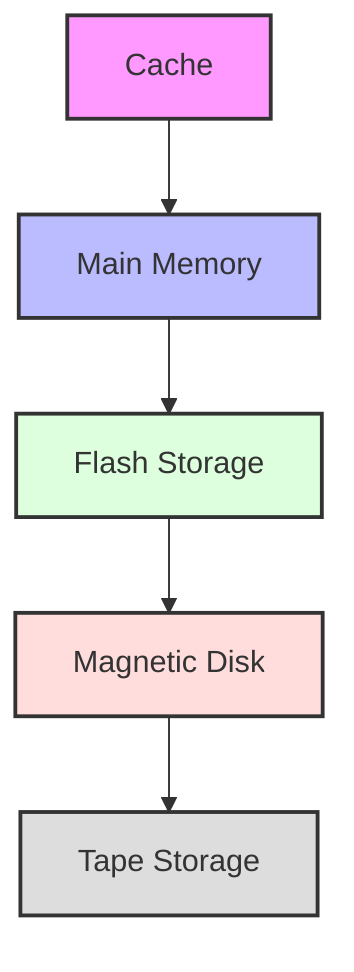
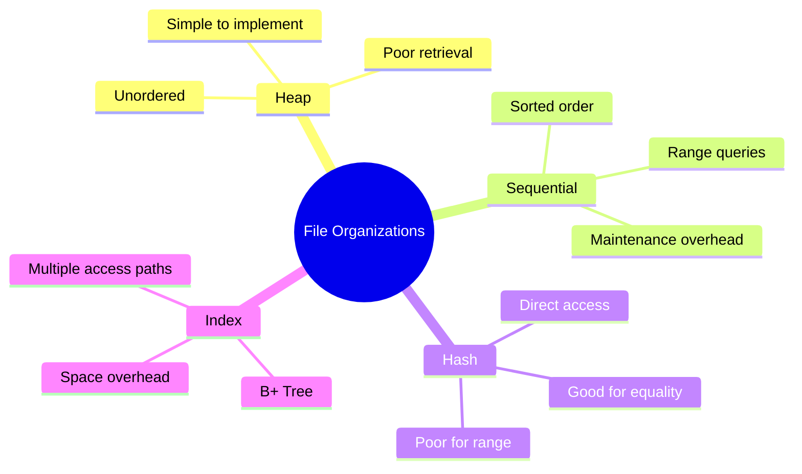
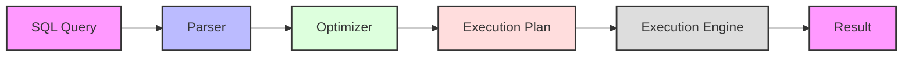
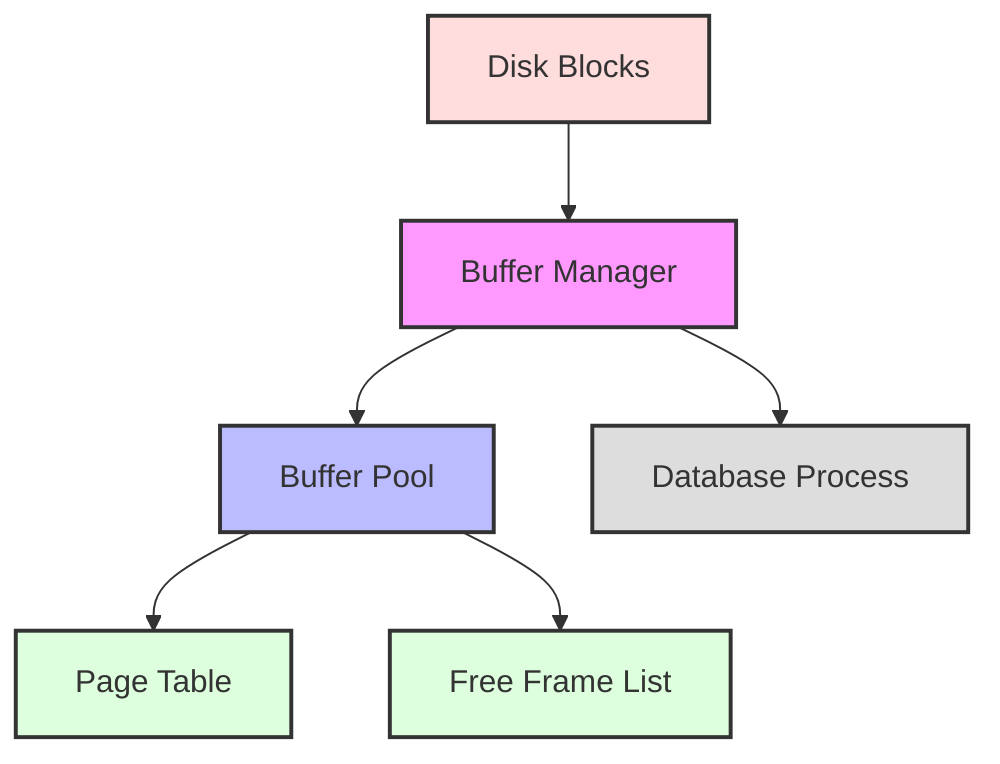

# Database Implementation

[← Previous: Database Design](database-design.md) | [Back to Course Content](README.md) | [Next: Transaction Management →](transaction-management.md)

> Reference: This content is based on Lecture 3 (L3 CSC 542 2.0 DBA)

## Physical Database Design

<div title="Physical database design focuses on how data is stored and accessed at the physical level, including storage structures and access methods">
Physical database design involves the implementation of database structures and mechanisms for efficient data storage and retrieval.
</div>

### Storage Hierarchy


<details>
<summary><strong>Storage Hierarchy Details</strong></summary>

1. **Cache Memory**
   - Fastest access (nanoseconds)
   - Limited capacity
   - Examples:
     - L1, L2, L3 caches
     - Buffer cache
     - Query cache

2. **Main Memory (RAM)**
   - Fast access (microseconds)
   - Volatile storage
   - Examples:
     - Database buffer pool
     - Sort areas
     - Temporary tables

3. **Flash Storage**
   - Medium speed (milliseconds)
   - Non-volatile
   - Examples:
     - SSDs
     - Flash arrays
     - Hybrid storage

4. **Magnetic Disk**
   - Slower access (milliseconds)
   - Large capacity
   - Examples:
     - HDDs
     - RAID arrays
     - Storage area networks

5. **Tape Storage**
   - Slowest access (seconds)
   - Archival storage
   - Examples:
     - Backup tapes
     - Long-term storage
     - Disaster recovery
</details>

### Storage Structures

1. **Files**
   - Collection of records
   - Basic unit of storage
   - Types:
     - Data files
     - Index files
     - Log files

2. **Pages/Blocks**
   - Fixed-size units of transfer
   - Typically 4KB to 16KB
   - Basic I/O unit

3. **Records**
   - Collection of related fields
   - Fixed or variable length
   - May span multiple blocks

## File Organizations

<div title="File organization determines how records are physically stored and accessed in the database, affecting performance and storage efficiency">
File organization methods define how data is structured and accessed at the physical level.
</div>

### File Structure Types


<details>
<summary><strong>File Organization Methods</strong></summary>

1. **Heap Organization**
   - Unordered records
   - Simple implementation
   - Example:
     ```sql
     CREATE TABLE unordered_table (
         id INT,
         data VARCHAR(100)
     ) ORGANIZATION HEAP;
     ```

2. **Sequential Organization**
   - Records in sorted order
   - Efficient for range queries
   - Example:
     ```sql
     CREATE TABLE ordered_table (
         id INT,
         data VARCHAR(100)
     ) ORGANIZATION INDEX;
     CREATE INDEX idx_id ON ordered_table(id);
     ```

3. **Hash Organization**
   - Direct access by key
   - Good for equality searches
   - Example:
     ```sql
     CREATE TABLE hash_table (
         id INT,
         data VARCHAR(100)
     ) ORGANIZATION HASH;
     ```

4. **Indexed Organization**
   - Multiple access paths
   - Flexible querying
   - Example:
     ```sql
     CREATE TABLE indexed_table (
         id INT,
         data VARCHAR(100)
     );
     CREATE INDEX idx_id ON indexed_table(id);
     CREATE INDEX idx_data ON indexed_table(data);
     ```
</details>

### Sequential File Organization
1. **Characteristics**
   - Records stored in physical sequence
   - Based on key field value
   - Efficient for sequential access

2. **Advantages**
   - Simple to implement
   - Efficient for bulk processing
   - Good for archival storage

3. **Disadvantages**
   - Slow random access
   - Difficult to maintain sequence
   - Inefficient for updates

### Heap File Organization
1. **Characteristics**
   - Records placed where space available
   - No ordering
   - Simple to implement

2. **Advantages**
   - Fast insertion
   - Good for small files
   - No maintenance overhead

3. **Disadvantages**
   - Slow retrieval
   - No ordering benefit
   - Sequential processing inefficient

### Hash File Organization
1. **Characteristics**
   - Records distributed by hash function
   - Direct access possible
   - Bucket-based storage

2. **Advantages**
   - Fast direct access
   - Good for equality queries
   - Uniform distribution

3. **Disadvantages**
   - Poor for range queries
   - Space overhead
   - Collision handling needed

### Indexed File Organization
1. **Characteristics**
   - Index structures for access
   - Multiple access paths
   - Ordered or unordered data

2. **Advantages**
   - Fast retrieval
   - Multiple access patterns
   - Flexible organization

3. **Disadvantages**
   - Index maintenance overhead
   - Space requirements
   - Update complexity

## Indexing Techniques

### B-Tree Indexes
1. **Structure**
   - Balanced tree
   - Multiple keys per node
   - Variable fanout

2. **Operations**
   - Search
   - Insert
   - Delete
   - Range queries

3. **Characteristics**
   - Self-balancing
   - Logarithmic operations
   - Efficient for disk storage

### B+ Tree Indexes
1. **Structure**
   - Data only in leaves
   - Leaves linked
   - Internal nodes for navigation

2. **Advantages**
   - Better space utilization
   - Faster range queries
   - Sequential access support

3. **Applications**
   - Primary indexes
   - Secondary indexes
   - Clustered indexes

### Hash Indexes
1. **Structure**
   - Hash function
   - Bucket organization
   - Overflow chains

2. **Types**
   - Static hashing
   - Dynamic hashing
   - Extendible hashing

3. **Applications**
   - Equality queries
   - Memory-based indexes
   - Temporary indexes

### Bitmap Indexes
1. **Structure**
   - Bit vectors
   - One per distinct value
   - Compression possible

2. **Advantages**
   - Space efficient
   - Fast bitwise operations
   - Good for low cardinality

3. **Applications**
   - Data warehousing
   - OLAP systems
   - Decision support

## Query Processing and Optimization

### Query Execution Flow


<details>
<summary><strong>Query Processing Steps</strong></summary>

1. **Parsing Phase**
   - Syntax checking
   - Semantic validation
   - Example:
     ```sql
     -- Valid syntax
     SELECT name FROM employees;
     
     -- Invalid syntax
     SELECT name FORM employees; -- Error
     ```

2. **Optimization Phase**
   - Plan generation
   - Cost estimation
   - Example:
     ```sql
     -- Query optimizer chooses best plan
     EXPLAIN SELECT * FROM employees 
     WHERE department = 'IT';
     ```

3. **Execution Phase**
   - Plan interpretation
   - Data retrieval
   - Example:
     ```sql
     -- Execution plan
     CREATE INDEX idx_dept ON employees(department);
     SELECT * FROM employees 
     WHERE department = 'IT';
     ```

4. **Result Generation**
   - Data formatting
   - Result set creation
   - Example:
     ```sql
     -- Result set
     SELECT name, salary 
     FROM employees 
     ORDER BY salary DESC;
     ```
</details>

### Query Optimization Techniques

1. **Algebraic Optimization**
   - Rule-based transformation
   - Common subexpression elimination
   - Predicate pushdown

2. **Cost-Based Optimization**
   - Statistics-based
   - I/O cost estimation
   - CPU cost estimation

3. **Join Optimization**
   - Join order selection
   - Join method selection
   - Access path selection

### Execution Strategies

1. **Access Methods**
   - Table scan
   - Index scan
   - Bitmap scan

2. **Join Methods**
   - Nested loop join
   - Hash join
   - Merge join

3. **Aggregation**
   - Sort-based
   - Hash-based
   - Group-based

### Performance Tuning

1. **Statistics Management**
   - Gathering statistics
   - Updating statistics
   - Using statistics

2. **Buffer Management**
   - Buffer allocation
   - Replacement policy
   - Prefetching

3. **Index Selection**
   - Index creation
   - Index maintenance
   - Index usage

4. **Query Rewriting**
   - View materialization
   - Subquery optimization
   - Join elimination

## Buffer Management

### Buffer Pool Architecture


## Related Topics
- [Database Design](database-design.md) - Logical design concepts
- [Transaction Management](transaction-management.md) - Managing database transactions
- [SQL and Database Programming](sql-programming.md) - Implementation in SQL

---
[← Previous: Database Design](database-design.md) | [Back to Course Content](README.md) | [Next: Transaction Management →](transaction-management.md) 