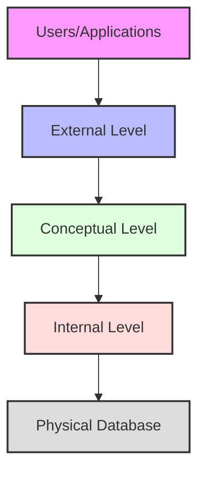
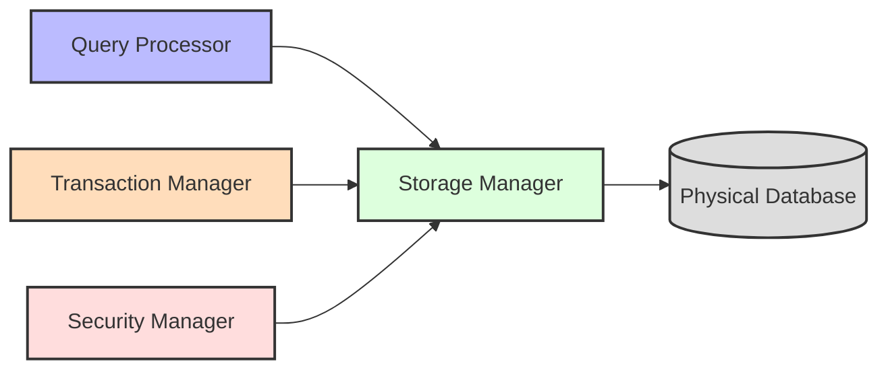
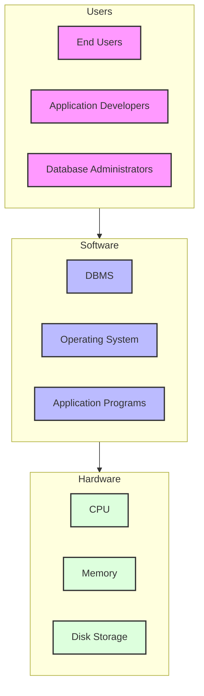
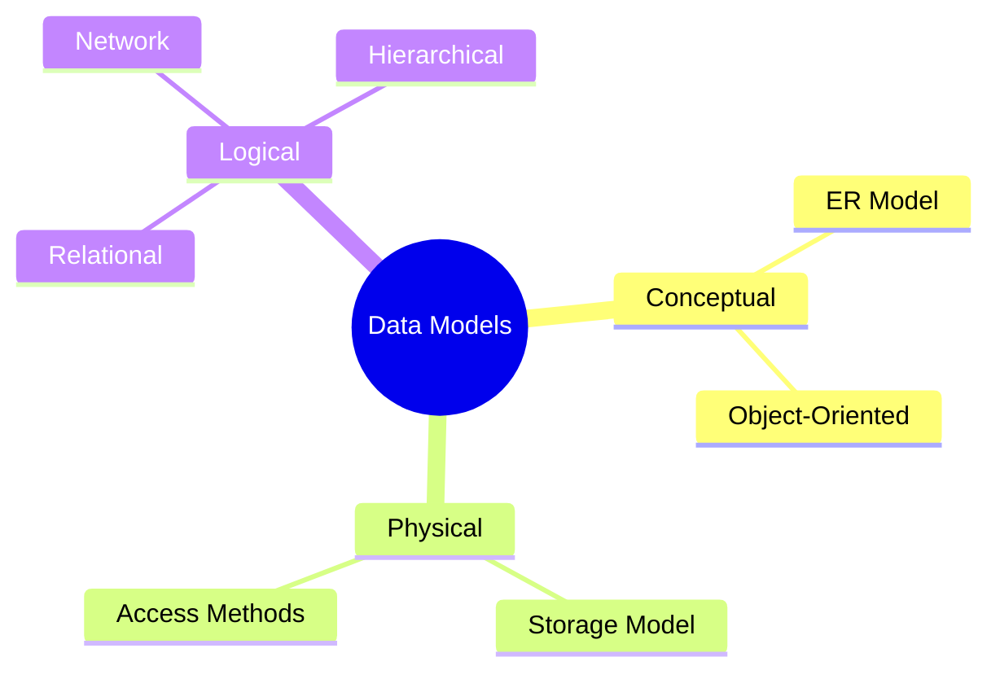

# Introduction to Database Systems

[← Back to Course Content](README.md) | [Next: Database Design →](database-design.md)

> Reference: This content is based on Lecture 1 (L1 CSC 542 2.0 DBA_Introduction)

## What is a Database?
<div title="A database is more than just a collection of data - it's a structured system that ensures data integrity, consistency, and efficient access">
A database is an organized collection of related data stored and accessed electronically. It is designed to manage large amounts of information by storing, retrieving, and managing data.
</div>

<details>
<summary><strong>Key Characteristics of a Database</strong></summary>

1. **Structured Storage**
   - Data is organized in a specific format
   - Relationships between data elements are defined
   - Follows a schema or data model

2. **Data Independence**
   - Physical independence from storage details
   - Logical independence from application logic
   - Enables flexibility in data management

3. **Concurrent Access**
   - Multiple users can access simultaneously
   - Built-in mechanisms for conflict resolution
   - Ensures data consistency during concurrent operations

4. **Data Integrity**
   - Enforces business rules and constraints
   - Maintains accuracy and consistency
   - Prevents unauthorized modifications
</details>

### Database System Architecture


<details>
<summary><strong>Architecture Level Details</strong></summary>

1. **External Level (View Level)**
   - User's perspective of the database
   - Different views for different users
   - Hides complexity of underlying structures
   - Provides data security through limited views

2. **Conceptual Level (Logical Level)**
   - Complete view of data requirements
   - Describes what data is stored
   - Defines relationships between data
   - Independent of hardware or storage details

3. **Internal Level (Physical Level)**
   - Physical storage structures
   - Access methods and indexing
   - Storage allocation
   - Data compression and encryption

4. **Physical Database**
   - Actual data storage
   - Files and indexes
   - Storage devices and organization
</details>

## Database Management System (DBMS)
<div title="A DBMS is the software suite that manages the interaction between users and databases, handling all aspects of data storage, retrieval, and manipulation">
A Database Management System (DBMS) is software designed to store, retrieve, define, and manage data in a database.
</div>

### DBMS Architecture Components


<details>
<summary><strong>Component Details</strong></summary>

1. **Query Processor**
   - Parses and validates SQL queries
   - Optimizes query execution plans
   - Coordinates query execution
   - Example operations:
     ```sql
     SELECT * FROM employees WHERE salary > 50000;
     -- Gets optimized into an efficient execution plan
     ```

2. **Storage Manager**
   - Manages data storage and retrieval
   - Handles file organization
   - Maintains indexes and data statistics
   - Example responsibilities:
     ```
     - Buffer management
     - File space allocation
     - Index maintenance
     ```

3. **Transaction Manager**
   - Ensures ACID properties
   - Manages concurrent access
   - Handles recovery operations
   - Example transaction:
     ```sql
     BEGIN TRANSACTION;
       UPDATE accounts SET balance = balance - 100 WHERE id = 1;
       UPDATE accounts SET balance = balance + 100 WHERE id = 2;
     COMMIT;
     ```

4. **Security Manager**
   - Controls access rights
   - Enforces security policies
   - Manages user authentication
   - Example security rule:
     ```sql
     GRANT SELECT ON employees TO hr_staff;
     ```
</details>

### Advantages of DBMS
1. **Data Independence**
   - Physical independence: Changes to physical storage don't affect application programs
   - Logical independence: Changes to logical schema don't affect application programs

2. **Data Integrity and Security**
   - Centralized control of data
   - Access control and authentication
   - Enforcement of integrity constraints
   - Backup and recovery mechanisms

3. **Data Consistency**
   - Avoids data redundancy
   - Maintains data consistency
   - Enforces standardization

4. **Concurrent Access**
   - Multiple users can access data simultaneously
   - Transaction management ensures data consistency
   - Lock management prevents conflicts

### Database System Environment


## Data Models

### Types of Data Models


### The Relational Model
- Based on the concept of mathematical relations
- Data stored in tables (relations)
- Each table consists of rows (tuples) and columns (attributes)
- Keys used to establish relationships between tables

#### Key Features
1. **Simple Structure**
   - Data represented in tables
   - Easy to understand and use

2. **Powerful Query Language**
   - SQL (Structured Query Language)
   - Declarative nature
   - Set-based operations

3. **Data Independence**
   - Physical independence
   - Logical independence

4. **Data Integrity**
   - Entity integrity
   - Referential integrity
   - Domain integrity

## Database Users and Administrators

### Types of Database Users
1. **Naive Users**
   - Interact through forms/applications
   - No knowledge of DBMS required

2. **Application Programmers**
   - Develop database applications
   - Use programming languages with SQL

3. **Sophisticated Users**
   - Write complex queries
   - Use database tools directly

4. **Database Administrators (DBA)**
   - Manage and maintain database
   - Handle security and performance

### Database Administrator Responsibilities
1. **Schema Definition**
   - Define database schema
   - Modify schema when needed
   - Set constraints

2. **Security and Authorization**
   - Grant/revoke user access
   - Set up user accounts
   - Monitor access patterns

3. **Data Availability**
   - Backup and recovery
   - Ensure system availability
   - Handle failures

4. **Performance Monitoring**
   - Tune database performance
   - Monitor resource usage
   - Optimize queries

## Database Design Process

### Steps in Database Design
1. **Requirements Analysis**
   - Gather and analyze requirements
   - Document data needs
   - Define system boundaries

2. **Conceptual Design**
   - Create ER diagrams
   - Define entities and relationships
   - Specify constraints

3. **Logical Design**
   - Transform conceptual model to logical model
   - Normalize relations
   - Define integrity constraints

4. **Physical Design**
   - Choose file organizations
   - Define indexes
   - Design physical layout

### Design Considerations
1. **Performance**
   - Response time
   - Throughput
   - Resource utilization

2. **Security**
   - Access control
   - Data encryption
   - Audit trails

3. **Integrity**
   - Data accuracy
   - Consistency
   - Completeness

4. **Recovery**
   - Backup procedures
   - Recovery methods
   - Business continuity

## Additional Resources
- [Database Design and Modeling](database-design.md)
- [Database Implementation](database-implementation.md)
- [Transaction Management](transaction-management.md)
- [Database Normalization](normalization.md)
- [SQL and Database Programming](sql-programming.md)

---
[← Back to Course Content](README.md) | [Next: Database Design →](database-design.md) 