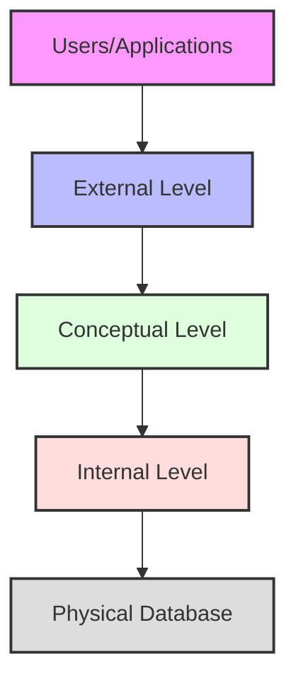
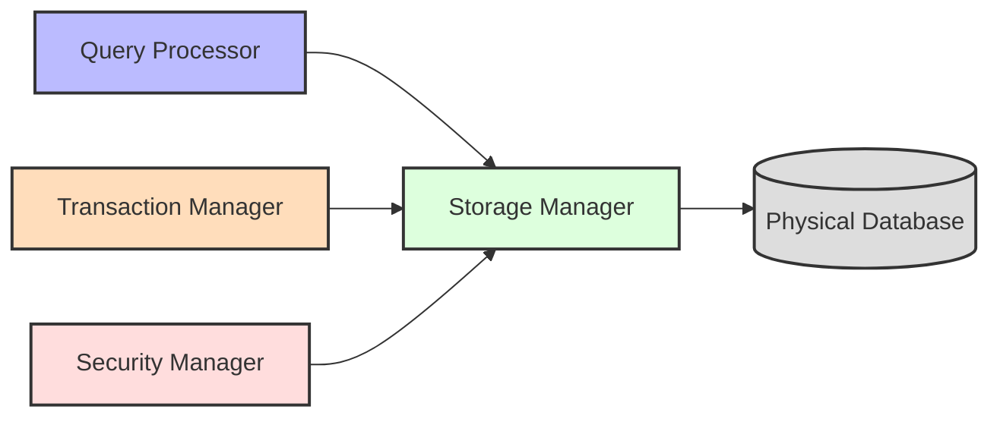
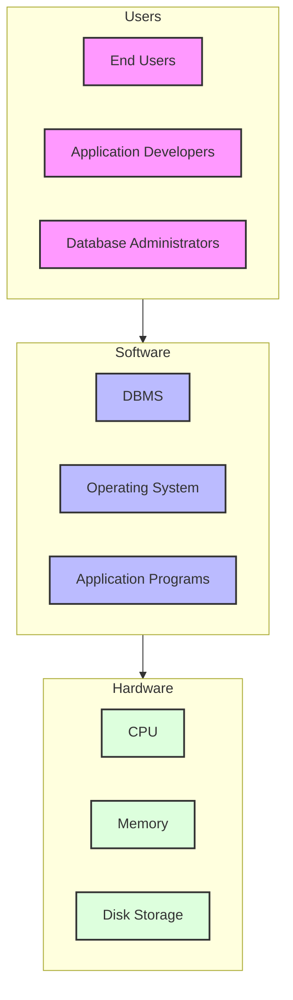
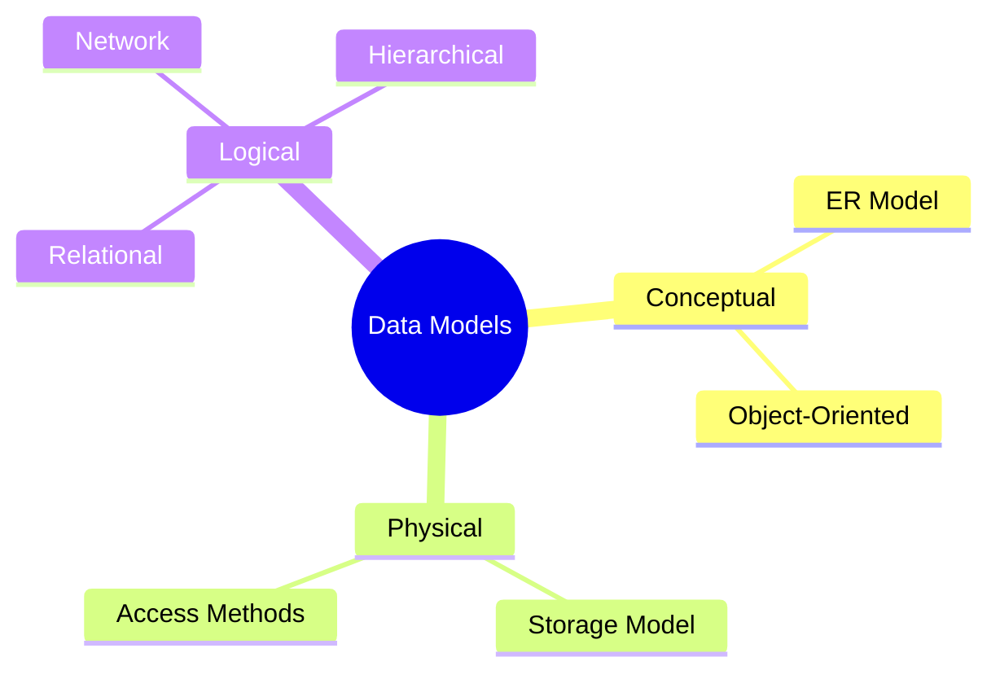
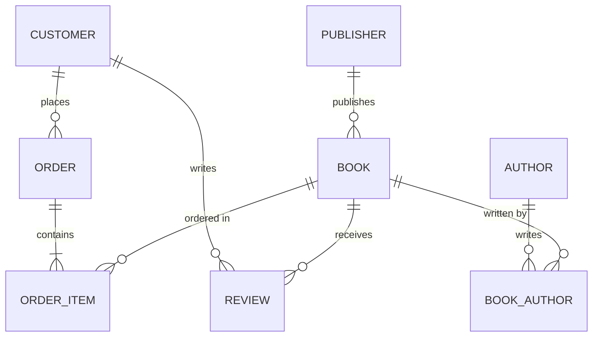

# Introduction to Database Systems

[← Back to Course Content](README.md) | [Next: Database Design →](database-design.md)

> Reference: This content is based on Lecture 1 (L1 CSC 542 2.0 DBA_Introduction)

---

## What is a Database?
<div title="A database is more than just a collection of data - it's a structured system that ensures data integrity, consistency, and efficient access">
A database is an organized collection of related data stored and accessed electronically. It is designed to manage large amounts of information by storing, retrieving, and managing data.
</div>

### Key Characteristics of Databases

| Characteristic | Description | Example |
|----------------|-------------|---------|
| **Structured Storage** | Data organized in specific formats | Customer records with defined fields |
| **Data Independence** | Separation of data from applications | Changing storage without affecting applications |
| **Concurrent Access** | Multiple users accessing simultaneously | Multiple bank tellers processing transactions |
| **Data Integrity** | Enforcing rules and constraints | Ensuring account balances never go negative |
| **Security** | Controlling access to data | Restricting salary data to HR department |
| **Recovery** | Ability to restore after failure | Restoring databases after system crash |

<details>
<summary><strong>Real-World Database Applications</strong></summary>

1. **Banking Systems**
   - Account management
   - Transaction processing
   - Fraud detection
   - Example: A customer deposits $500, the database atomically updates their balance while maintaining transaction history

2. **Healthcare Systems**
   - Patient records
   - Treatment histories
   - Billing information
   - Example: A doctor accesses a patient's complete medical history across multiple hospital visits

3. **E-Commerce Platforms**
   - Product catalogs
   - Customer profiles
   - Order processing
   - Example: Amazon tracking millions of products, orders, and customer preferences

4. **Educational Institutions**
   - Student records
   - Course management
   - Grading systems
   - Example: A university system managing enrollment, grades, and transcripts for thousands of students

5. **Transportation Systems**
   - Reservation systems
   - Fleet management
   - Route planning
   - Example: Airlines managing flight bookings, crew assignments, and maintenance schedules
</details>

### Database System Architecture


<details>
<summary><strong>Architecture Level Details</strong></summary>

1. **External Level (View Level)**
   - User's perspective of the database
   - Different views for different users
   - Hides complexity of underlying structures
   - Provides data security through limited views
   - Example: HR staff sees employee records without salary details, while managers see complete records

2. **Conceptual Level (Logical Level)**
   - Complete view of data requirements
   - Describes what data is stored
   - Defines relationships between data
   - Independent of hardware or storage details
   - Example: Entity-Relationship diagram showing customers, orders, and products

3. **Internal Level (Physical Level)**
   - Physical storage structures
   - Access methods and indexing
   - Storage allocation
   - Data compression and encryption
   - Example: B-tree indexes on customer ID for fast lookup

4. **Physical Database**
   - Actual data storage
   - Files and indexes
   - Storage devices and organization
   - Example: Data pages stored on disk with hash-based organization
</details>

---

## Database Management System (DBMS)
<div title="A DBMS is the software suite that manages the interaction between users and databases, handling all aspects of data storage, retrieval, and manipulation">
A Database Management System (DBMS) is software designed to store, retrieve, define, and manage data in a database.
</div>

### DBMS Architecture Components


<details>
<summary><strong>Component Details</strong></summary>

1. **Query Processor**
   - Parses and validates SQL queries
   - Optimizes query execution plans
   - Coordinates query execution
   - Example operations:
     ```sql
     SELECT * FROM employees WHERE salary > 50000;
     -- Gets optimized into an efficient execution plan
     ```

2. **Storage Manager**
   - Manages data storage and retrieval
   - Handles file organization
   - Maintains indexes and data statistics
   - Example responsibilities:
     ```
     - Buffer management
     - File space allocation
     - Index maintenance
     ```

3. **Transaction Manager**
   - Ensures ACID properties
   - Manages concurrent access
   - Handles recovery operations
   - Example transaction:
     ```sql
     BEGIN TRANSACTION;
       UPDATE accounts SET balance = balance - 100 WHERE id = 1;
       UPDATE accounts SET balance = balance + 100 WHERE id = 2;
     COMMIT;
     ```

4. **Security Manager**
   - Controls access rights
   - Enforces security policies
   - Manages user authentication
   - Example security rule:
     ```sql
     GRANT SELECT ON employees TO hr_staff;
     ```
</details>

### Comparison of Popular DBMS Systems

| Feature | MySQL | PostgreSQL | Oracle | MongoDB | SQL Server |
|---------|-------|------------|--------|---------|------------|
| **Type** | Relational | Relational | Relational | Document | Relational |
| **License** | Open Source/Commercial | Open Source | Commercial | Open Source/Commercial | Commercial |
| **Best For** | Web applications | Complex queries | Enterprise apps | Unstructured data | Microsoft ecosystem |
| **Scalability** | Moderate | High | Very High | Very High | High |
| **Performance** | Good | Very Good | Excellent | Excellent for NoSQL | Very Good |
| **Advanced Features** | Basic | Advanced | Comprehensive | Flexible schema | Comprehensive |
| **Example Use Case** | WordPress blogs | Scientific applications | Banking systems | Real-time analytics | Corporate applications |

### Advantages of DBMS
1. **Data Independence**
   - Physical independence: Changes to physical storage don't affect application programs
   - Logical independence: Changes to logical schema don't affect application programs
   - Example: Adding a new index doesn't require application code changes

2. **Data Integrity and Security**
   - Centralized control of data
   - Access control and authentication
   - Enforcement of integrity constraints
   - Example: Enforcing that an employee ID must be unique

3. **Data Consistency**
   - Avoids data redundancy
   - Maintains data consistency
   - Enforces standardization
   - Example: Updating a customer's address in one place updates it for all applications

4. **Concurrent Access**
   - Multiple users can access data simultaneously
   - Transaction management ensures data consistency
   - Lock management prevents conflicts
   - Example: Multiple airline agents booking seats without double-booking

### Database System Environment


---

## Data Models

### Types of Data Models


### Comparison of Data Models

| Data Model | Structure | Strengths | Weaknesses | Example Systems |
|------------|-----------|-----------|------------|-----------------|
| **Relational** | Tables with rows and columns | Simple, flexible, widely used | Performance for complex relationships | Oracle, MySQL |
| **Network** | Records and links | Efficient for complex relationships | Complex implementation | IDS, IDMS |
| **Hierarchical** | Tree structure | Simple parent-child relationships | Limited flexibility | IMS, XML databases |
| **Object-Oriented** | Objects with methods | Natural for complex data | Steep learning curve | ObjectDB, Db4o |
| **Document** | JSON/XML documents | Flexible schema | Consistency challenges | MongoDB, CouchDB |
| **Key-Value** | Simple key-value pairs | Extremely fast, scalable | Limited query capabilities | Redis, DynamoDB |
| **Graph** | Nodes and edges | Relationship analysis | Specialized use cases | Neo4j, ArangoDB |

### The Relational Model
- Based on the concept of mathematical relations
- Data stored in tables (relations)
- Each table consists of rows (tuples) and columns (attributes)
- Keys used to establish relationships between tables

#### Key Features
1. **Simple Structure**
   - Data represented in tables
   - Easy to understand and use
   - Example: Employee table with columns for ID, name, department, and salary

2. **Powerful Query Language**
   - SQL (Structured Query Language)
   - Declarative nature
   - Set-based operations
   - Example:
     ```sql
     -- Find all employees in the IT department making over $50,000
     SELECT name, salary 
     FROM employees 
     WHERE department = 'IT' AND salary > 50000;
     ```

3. **Data Independence**
   - Physical independence
   - Logical independence
   - Example: Adding a new column doesn't affect existing queries

4. **Data Integrity**
   - Entity integrity (primary key constraints)
   - Referential integrity (foreign key constraints)
   - Domain integrity (data type constraints)
   - Example:
     ```sql
     -- Ensure department exists before assigning to employee
     ALTER TABLE employees
     ADD CONSTRAINT fk_dept
     FOREIGN KEY (department_id) REFERENCES departments(id);
     ```

### Real-World Relational Database Example

```sql
-- Create Customers table
CREATE TABLE Customers (
    customer_id INT PRIMARY KEY,
    name VARCHAR(100) NOT NULL,
    email VARCHAR(100) UNIQUE,
    signup_date DATE,
    status VARCHAR(20)
);

-- Create Orders table with foreign key to Customers
CREATE TABLE Orders (
    order_id INT PRIMARY KEY,
    customer_id INT,
    order_date DATETIME NOT NULL,
    total_amount DECIMAL(10,2),
    FOREIGN KEY (customer_id) REFERENCES Customers(customer_id)
);

-- Create Products table
CREATE TABLE Products (
    product_id INT PRIMARY KEY,
    name VARCHAR(100) NOT NULL,
    price DECIMAL(10,2),
    inventory INT
);

-- Create Order_Items junction table for many-to-many relationship
CREATE TABLE Order_Items (
    order_id INT,
    product_id INT,
    quantity INT NOT NULL,
    unit_price DECIMAL(10,2),
    PRIMARY KEY (order_id, product_id),
    FOREIGN KEY (order_id) REFERENCES Orders(order_id),
    FOREIGN KEY (product_id) REFERENCES Products(product_id)
);
```

---

## Database Users and Administrators

### Types of Database Users
1. **Naive Users**
   - Interact through forms/applications
   - No knowledge of DBMS required
   - Example: Bank customers using ATMs or online banking

2. **Application Programmers**
   - Develop database applications
   - Use programming languages with SQL
   - Example: Developer creating a customer management system

3. **Sophisticated Users**
   - Write complex queries
   - Use database tools directly
   - Example: Business analyst generating sales reports

4. **Database Administrators (DBA)**
   - Manage and maintain database
   - Handle security and performance
   - Example: DBA performing database tuning and backup

### Database Administrator Responsibilities

| Responsibility | Description | Example |
|----------------|-------------|---------|
| **Schema Definition** | Define database structure | Creating tables, indexes, views |
| **Security Management** | Control access to data | Setting up user roles and permissions |
| **Performance Tuning** | Optimize database performance | Creating indexes, query optimization |
| **Backup and Recovery** | Protect against data loss | Scheduled backups, recovery testing |
| **Capacity Planning** | Manage database growth | Monitoring space usage, planning expansion |
| **Database Monitoring** | Track database health | Setting up alerts for errors or slowdowns |
| **Upgrade and Patching** | Keep DBMS up to date | Applying security patches, version upgrades |

### DBA Tools and Utilities
1. **Administration Tools**
   - MySQL Workbench
   - pgAdmin
   - Oracle Enterprise Manager
   - Microsoft SQL Server Management Studio

2. **Monitoring Tools**
   - Nagios
   - Prometheus
   - SolarWinds Database Performance Analyzer
   - New Relic

3. **Backup Solutions**
   - Oracle RMAN
   - SQL Server Backup
   - Percona XtraBackup
   - Barman (PostgreSQL)

---

## Database Design Process

### Steps in Database Design

```mermaid
flowchart LR
    A[Requirements Analysis] --> B[Conceptual Design]
    B --> C[Logical Design]
    C --> D[Physical Design]
    D --> E[Implementation]
    E --> F[Testing]
    F --> G[Deployment]
    G --> H[Maintenance]
    
    style A fill:#f9f,stroke:#333,stroke-width:2px
    style B fill:#bbf,stroke:#333,stroke-width:2px
    style C fill:#dfd,stroke:#333,stroke-width:2px
    style D fill:#fdd,stroke:#333,stroke-width:2px
    style E fill:#ddd,stroke:#333,stroke-width:2px
    style F fill:#f9f,stroke:#333,stroke-width:2px
    style G fill:#bbf,stroke:#333,stroke-width:2px
    style H fill:#dfd,stroke:#333,stroke-width:2px
```


<details>
<summary><strong>Design Process Details</strong></summary>

1. **Requirements Analysis**
   - Gather and analyze requirements
   - Document data needs
   - Define system boundaries
   - Example: Interviewing stakeholders about what data needs to be stored and accessed

2. **Conceptual Design**
   - Create ER diagrams
   - Define entities and relationships
   - Specify constraints
   - Example: Creating an ER diagram showing that Customers place Orders containing Products

3. **Logical Design**
   - Transform conceptual model to logical model
   - Normalize relations
   - Define integrity constraints
   - Example: Converting ER diagram to relational schema with proper normalization

4. **Physical Design**
   - Choose file organizations
   - Define indexes
   - Design physical layout
   - Example: Deciding to index the customer_id column in Orders table for performance

5. **Implementation**
   - Create database
   - Implement constraints
   - Load initial data
   - Example: Running SQL scripts to create tables and relationships

6. **Testing**
   - Validate design
   - Performance testing
   - Integration testing
   - Example: Verifying that queries run efficiently and return correct results

7. **Deployment**
   - Move to production
   - User training
   - Documentation
   - Example: Migrating the database to production servers and training users

8. **Maintenance**
   - Monitor performance
   - Make adjustments
   - Handle growth
   - Example: Adding indexes as query patterns emerge
</details>

### Design Considerations
1. **Performance**
   - Response time
   - Throughput
   - Resource utilization
   - Example: Ensuring customer queries complete in under 2 seconds

2. **Security**
   - Access control
   - Data encryption
   - Audit trails
   - Example: Encrypting sensitive customer data and tracking access

3. **Integrity**
   - Data accuracy
   - Consistency
   - Completeness
   - Example: Ensuring order total matches sum of line items

4. **Recovery**
   - Backup procedures
   - Recovery methods
   - Business continuity
   - Example: Implementing point-in-time recovery for critical financial data

### Example Database Design Case Study: Online Bookstore

**Requirements:**
- Store information about books, customers, orders
- Track inventory and sales
- Manage customer accounts and reviews

**Conceptual Design (ER Model):**


**Logical Design (Sample Tables):**
```sql
CREATE TABLE Books (
    book_id INT PRIMARY KEY,
    title VARCHAR(200) NOT NULL,
    publisher_id INT,
    publication_date DATE,
    isbn VARCHAR(13) UNIQUE,
    price DECIMAL(10,2),
    inventory INT,
    FOREIGN KEY (publisher_id) REFERENCES Publishers(publisher_id)
);

CREATE TABLE Book_Authors (
    book_id INT,
    author_id INT,
    PRIMARY KEY (book_id, author_id),
    FOREIGN KEY (book_id) REFERENCES Books(book_id),
    FOREIGN KEY (author_id) REFERENCES Authors(author_id)
);
```

**Physical Design (Sample Indexes):**
```sql
-- Index for book lookups by ISBN
CREATE INDEX idx_books_isbn ON Books(isbn);

-- Index for finding books by publisher
CREATE INDEX idx_books_publisher ON Books(publisher_id);

-- Index for customer orders
CREATE INDEX idx_orders_customer ON Orders(customer_id);
```

---

## Additional Resources
- [Database Design and Modeling](database-design.md)
- [Database Implementation](database-implementation.md)
- [Transaction Management](transaction-management.md)
- [Database Normalization](normalization.md)
- [SQL and Database Programming](sql-programming.md)

### Fundamental Database Equations and Formulas

| Concept | Formula | Description |
|---------|---------|-------------|
| **Disk I/O Cost** | Cost = B + R | B = number of blocks, R = number of random seeks |
| **Index Selectivity** | S = Distinct Values / Total Rows | Lower is more selective, better for indexing |
| **Cardinality Ratio** | CR = Referenced Table Rows / Referencing Table Rows | Helps determine join strategies |
| **Query Cost Estimation** | Cost = CPU cost + I/O cost + Communication cost | Used in query optimization |
| **RAID Storage** | Capacity = N * S (RAID 0), (N-1) * S (RAID 5) | N = number of disks, S = single disk size |

---
[← Back to Course Content](README.md) | [Next: Database Design →](database-design.md) 