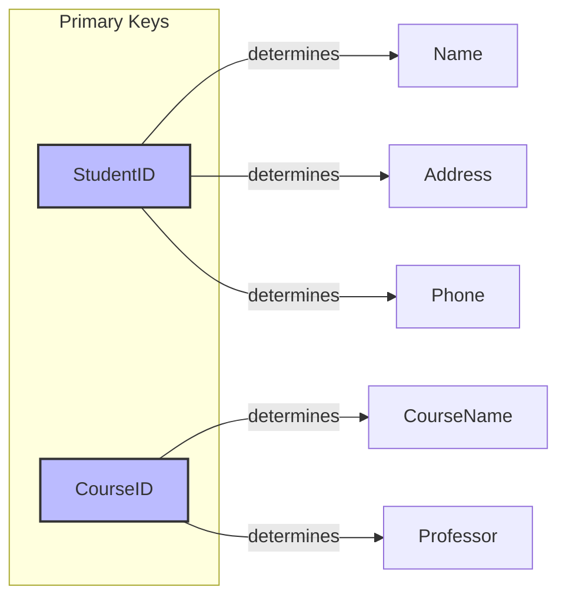
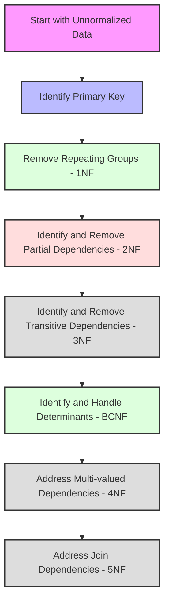
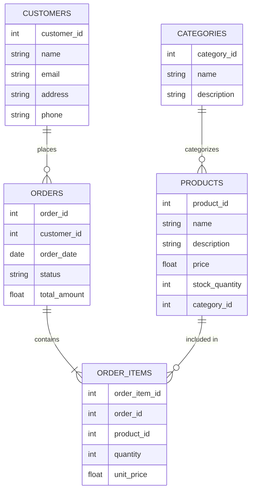
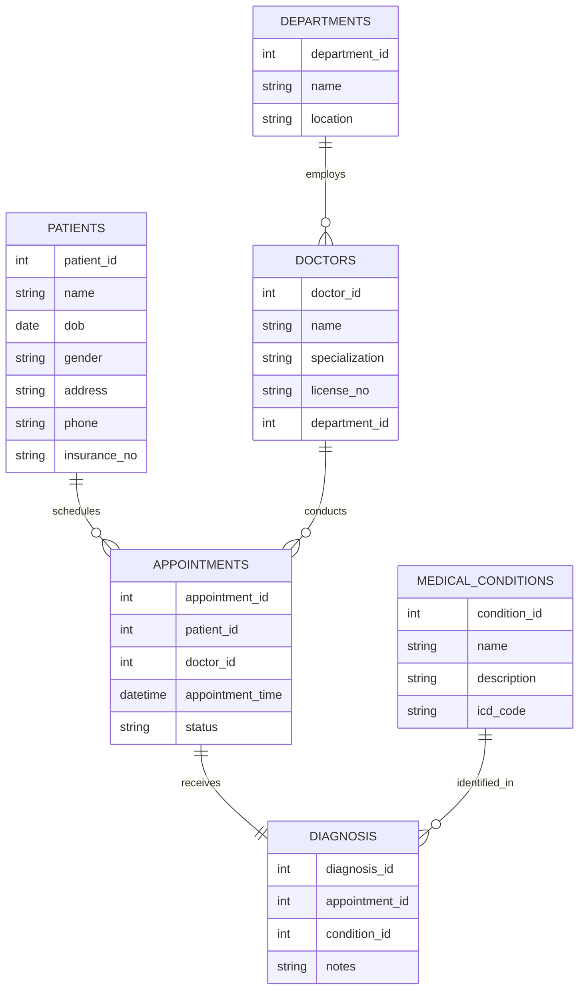

# Database Normalization

[← Previous: Transaction Management](transaction-management.md) | [Back to Course Content](README.md) | [Next: SQL and Database Programming →](sql-programming.md)

> Reference: This content is based on Lecture 5 (L5 CSC 542 2.0 DBA Normalization)

## What is Normalization?

<div title="Database normalization is a systematic process of organizing data to minimize redundancy and improve data integrity">
Database normalization is a structured technique for organizing database tables to reduce data redundancy and improve data integrity. It involves dividing large tables into smaller, more manageable tables and defining relationships between them.
</div>

### Normalization Process Overview


## Functional Dependencies

<div title="Functional dependencies show how attributes are related and dependent on each other within a relation">
A functional dependency (FD) is a constraint between two sets of attributes in a relation. If attribute A functionally determines attribute B, then for each value of A, there is exactly one value of B.
</div>

<details>
<summary><strong>Types of Functional Dependencies</strong></summary>

1. **Trivial Functional Dependency**
   - If B is a subset of A, then A → B is trivial
   - Example: `{StudentID, Name} → StudentID`

2. **Non-trivial Functional Dependency**
   - If B is not a subset of A, then A → B is non-trivial
   - Example: `StudentID → Name`

3. **Partial Functional Dependency**
   - When part of a composite key determines a non-key attribute
   - Example: In a relation with primary key {CourseID, StudentID}, if `CourseID → Professor`

4. **Transitive Functional Dependency**
   - If A → B and B → C, then A → C is a transitive dependency
   - Example: `StudentID → DepartmentID` and `DepartmentID → DepartmentName`
</details>

### Functional Dependency Notation

- X → Y means X functionally determines Y
- For each value of X, there is precisely one value of Y
- X is the determinant, Y is the dependent

### Functional Dependency Example


## Normal Forms

<div title="Normal forms are progressive levels of database organization that reduce redundancy and dependency issues">
Normal forms are used to eliminate various types of anomalies that can occur in unnormalized database designs. Each normal form addresses specific types of anomalies.
</div>

### Comparison of Normal Forms

<table border="1">
  <tr>
    <th>Normal Form</th>
    <th>Description</th>
    <th>Eliminates</th>
    <th>Real-world Usage</th>
  </tr>
  <tr>
    <td>1NF</td>
    <td>Atomic values, no repeating groups</td>
    <td>Repeating groups</td>
    <td>Basic data organization in all relational systems</td>
  </tr>
  <tr>
    <td>2NF</td>
    <td>1NF + No partial dependencies</td>
    <td>Partial dependencies</td>
    <td>Order management systems, enrollment databases</td>
  </tr>
  <tr>
    <td>3NF</td>
    <td>2NF + No transitive dependencies</td>
    <td>Transitive dependencies</td>
    <td>Most business applications, ERP systems</td>
  </tr>
  <tr>
    <td>BCNF</td>
    <td>3NF + Every determinant is a candidate key</td>
    <td>Anomalies from non-key determinants</td>
    <td>Academic systems, complex business rules</td>
  </tr>
  <tr>
    <td>4NF</td>
    <td>BCNF + No multi-valued dependencies</td>
    <td>Multi-valued dependencies</td>
    <td>Complex relationship management systems</td>
  </tr>
  <tr>
    <td>5NF</td>
    <td>4NF + No join dependencies</td>
    <td>Join dependencies</td>
    <td>Highly specialized applications, data warehousing</td>
  </tr>
</table>

### First Normal Form (1NF)

<details>
<summary><strong>1NF Details and Examples</strong></summary>

#### Definition
- Relation contains only atomic (indivisible) values
- No repeating groups or arrays
- Each cell contains a single value
- Each record is unique

#### Example of Conversion to 1NF

**Unnormalized Table:**
```
+------------+----------------+-------------------------+
| StudentID  | StudentName    | Courses                 |
+------------+----------------+-------------------------+
| S1001      | John Smith     | Math, Physics, Chemistry|
| S1002      | Mary Johnson   | Biology, Chemistry      |
+------------+----------------+-------------------------+
```

**1NF Table:**
```
+------------+----------------+-------------+
| StudentID  | StudentName    | Course      |
+------------+----------------+-------------+
| S1001      | John Smith     | Math        |
| S1001      | John Smith     | Physics     |
| S1001      | John Smith     | Chemistry   |
| S1002      | Mary Johnson   | Biology     |
| S1002      | Mary Johnson   | Chemistry   |
+------------+----------------+-------------+
```

#### SQL Implementation:
```sql
-- Original problematic table
CREATE TABLE UnnormalizedStudentCourses (
    StudentID VARCHAR(10),
    StudentName VARCHAR(100),
    Courses VARCHAR(255) -- Problematic multi-valued field
);

-- Converted to 1NF
CREATE TABLE StudentCourses1NF (
    StudentID VARCHAR(10),
    StudentName VARCHAR(100),
    Course VARCHAR(50),
    PRIMARY KEY (StudentID, Course)
);
```

#### Real-world Application:
In a university registration system, 1NF ensures that each student-course combination is stored as a separate record, allowing for accurate enrollment tracking and grade assignment.
</details>

### Second Normal Form (2NF)

<details>
<summary><strong>2NF Details and Examples</strong></summary>

#### Definition
- Must be in 1NF
- No partial dependencies (non-key attributes should not depend on part of the primary key)

#### Example of Conversion to 2NF

**1NF Table with Partial Dependencies:**
```
+------------+------------+----------------+-------------+----------------+
| StudentID  | CourseID   | StudentName    | Course      | Professor      |
+------------+------------+----------------+-------------+----------------+
| S1001      | C101       | John Smith     | Math        | Dr. Johnson    |
| S1001      | C102       | John Smith     | Physics     | Dr. Wilson     |
| S1002      | C101       | Mary Johnson   | Math        | Dr. Johnson    |
+------------+------------+----------------+-------------+----------------+
```

**2NF Tables:**
```
-- Students Table
+------------+----------------+
| StudentID  | StudentName    |
+------------+----------------+
| S1001      | John Smith     |
| S1002      | Mary Johnson   |
+------------+----------------+

-- Courses Table
+------------+-------------+----------------+
| CourseID   | Course      | Professor      |
+------------+-------------+----------------+
| C101       | Math        | Dr. Johnson    |
| C102       | Physics     | Dr. Wilson     |
+------------+-------------+----------------+

-- Enrollments Table
+------------+------------+
| StudentID  | CourseID   |
+------------+------------+
| S1001      | C101       |
| S1001      | C102       |
| S1002      | C101       |
+------------+------------+
```

#### SQL Implementation:
```sql
-- Students Table
CREATE TABLE Students (
    StudentID VARCHAR(10) PRIMARY KEY,
    StudentName VARCHAR(100)
);

-- Courses Table
CREATE TABLE Courses (
    CourseID VARCHAR(10) PRIMARY KEY,
    CourseName VARCHAR(50),
    Professor VARCHAR(100)
);

-- Enrollments Table (junction table)
CREATE TABLE Enrollments (
    StudentID VARCHAR(10),
    CourseID VARCHAR(10),
    PRIMARY KEY (StudentID, CourseID),
    FOREIGN KEY (StudentID) REFERENCES Students(StudentID),
    FOREIGN KEY (CourseID) REFERENCES Courses(CourseID)
);
```

#### Real-world Application:
In a retail system, 2NF ensures that product information is stored separately from order details, allowing product information to be updated in one place rather than in multiple order records.
</details>

### Third Normal Form (3NF)

<details>
<summary><strong>3NF Details and Examples</strong></summary>

#### Definition
- Must be in 2NF
- No transitive dependencies (non-key attributes should not depend on other non-key attributes)

#### Example of Conversion to 3NF

**2NF Table with Transitive Dependency:**
```
+------------+----------------+------------+--------------------+
| StudentID  | StudentName    | DeptID     | DepartmentName     |
+------------+----------------+------------+--------------------+
| S1001      | John Smith     | D10        | Computer Science   |
| S1002      | Mary Johnson   | D20        | Mathematics        |
| S1003      | Alex Brown     | D10        | Computer Science   |
+------------+----------------+------------+--------------------+
```

**3NF Tables:**
```
-- Students Table
+------------+----------------+------------+
| StudentID  | StudentName    | DeptID     |
+------------+----------------+------------+
| S1001      | John Smith     | D10        |
| S1002      | Mary Johnson   | D20        |
| S1003      | Alex Brown     | D10        |
+------------+----------------+------------+

-- Departments Table
+------------+--------------------+
| DeptID     | DepartmentName     |
+------------+--------------------+
| D10        | Computer Science   |
| D20        | Mathematics        |
+------------+--------------------+
```

#### SQL Implementation:
```sql
-- Departments Table
CREATE TABLE Departments (
    DeptID VARCHAR(10) PRIMARY KEY,
    DepartmentName VARCHAR(100)
);

-- Students Table
CREATE TABLE Students (
    StudentID VARCHAR(10) PRIMARY KEY,
    StudentName VARCHAR(100),
    DeptID VARCHAR(10),
    FOREIGN KEY (DeptID) REFERENCES Departments(DeptID)
);
```

#### Real-world Application:
In a human resources system, 3NF ensures that department information is stored in a separate table from employee records, allowing department details to be updated once rather than in every affected employee record.
</details>

### Boyce-Codd Normal Form (BCNF)

<details>
<summary><strong>BCNF Details and Examples</strong></summary>

#### Definition
- Must be in 3NF
- For every non-trivial functional dependency X → Y, X must be a superkey

#### Example of Conversion to BCNF

**3NF Table Not in BCNF:**
```
+------------+------------+----------------+
| StudentID  | CourseID   | Professor      |
+------------+------------+----------------+
| S1001      | C101       | Dr. Johnson    |
| S1002      | C101       | Dr. Johnson    |
| S1001      | C102       | Dr. Wilson     |
| S1003      | C103       | Dr. Smith      |
+------------+------------+----------------+
```

In this example, (StudentID, CourseID) is the primary key, but Professor is determined by CourseID alone (CourseID → Professor). Since CourseID is not a superkey, this violates BCNF.

**BCNF Tables:**
```
-- CourseProf Table
+------------+----------------+
| CourseID   | Professor      |
+------------+----------------+
| C101       | Dr. Johnson    |
| C102       | Dr. Wilson     |
| C103       | Dr. Smith      |
+------------+----------------+

-- StudentCourse Table
+------------+------------+
| StudentID  | CourseID   |
+------------+------------+
| S1001      | C101       |
| S1002      | C101       |
| S1001      | C102       |
| S1003      | C103       |
+------------+------------+
```

#### SQL Implementation:
```sql
-- CourseProf Table
CREATE TABLE CourseProf (
    CourseID VARCHAR(10) PRIMARY KEY,
    Professor VARCHAR(100)
);

-- StudentCourse Table
CREATE TABLE StudentCourse (
    StudentID VARCHAR(10),
    CourseID VARCHAR(10),
    PRIMARY KEY (StudentID, CourseID),
    FOREIGN KEY (CourseID) REFERENCES CourseProf(CourseID)
);
```

#### Real-world Application:
In a university scheduling system, BCNF ensures that course-professor assignments are stored separately from student enrollments, preventing inconsistencies when a course changes instructors.
</details>

### Fourth Normal Form (4NF)

<details>
<summary><strong>4NF Details and Examples</strong></summary>

#### Definition
- Must be in BCNF
- No multi-valued dependencies

#### Example of Conversion to 4NF

**BCNF Table with Multi-valued Dependencies:**
```
+------------+----------------+---------------+
| StudentID  | Sport          | Instrument    |
+------------+----------------+---------------+
| S1001      | Football       | Piano         |
| S1001      | Football       | Guitar        |
| S1001      | Basketball     | Piano         |
| S1001      | Basketball     | Guitar        |
+------------+----------------+---------------+
```

Here, StudentID → Sport and StudentID → Instrument are multi-valued dependencies.

**4NF Tables:**
```
-- StudentSport Table
+------------+----------------+
| StudentID  | Sport          |
+------------+----------------+
| S1001      | Football       |
| S1001      | Basketball     |
+------------+----------------+

-- StudentInstrument Table
+------------+---------------+
| StudentID  | Instrument    |
+------------+---------------+
| S1001      | Piano         |
| S1001      | Guitar        |
+------------+---------------+
```

#### SQL Implementation:
```sql
-- StudentSport Table
CREATE TABLE StudentSport (
    StudentID VARCHAR(10),
    Sport VARCHAR(50),
    PRIMARY KEY (StudentID, Sport)
);

-- StudentInstrument Table
CREATE TABLE StudentInstrument (
    StudentID VARCHAR(10),
    Instrument VARCHAR(50),
    PRIMARY KEY (StudentID, Instrument)
);
```

#### Real-world Application:
In a student activities management system, 4NF ensures that different types of activities (sports, arts, clubs) are stored in separate tables, avoiding combinatorial explosion of records.
</details>

### Fifth Normal Form (5NF)

<details>
<summary><strong>5NF Details and Examples</strong></summary>

#### Definition
- Must be in 4NF
- No join dependencies not implied by candidate keys

#### Example of 5NF

Consider a database tracking suppliers, parts, and projects. A supplier supplies certain parts for certain projects. The relationship between suppliers, parts, and projects needs to be modeled correctly to achieve 5NF.

**Not in 5NF:**
```
+-------------+-----------+-------------+
| SupplierID  | PartID    | ProjectID   |
+-------------+-----------+-------------+
| S1          | P1        | J1          |
| S1          | P2        | J1          |
| S2          | P1        | J2          |
+-------------+-----------+-------------+
```

**5NF Tables:**
```
-- SupplierPart Table
+-------------+-----------+
| SupplierID  | PartID    |
+-------------+-----------+
| S1          | P1        |
| S1          | P2        |
| S2          | P1        |
+-------------+-----------+

-- PartProject Table
+-----------+-------------+
| PartID    | ProjectID   |
+-----------+-------------+
| P1        | J1          |
| P2        | J1          |
| P1        | J2          |
+-----------+-------------+

-- SupplierProject Table
+-------------+-------------+
| SupplierID  | ProjectID   |
+-------------+-------------+
| S1          | J1          |
| S2          | J2          |
+-------------+-------------+
```

#### SQL Implementation:
```sql
-- SupplierPart Table
CREATE TABLE SupplierPart (
    SupplierID VARCHAR(10),
    PartID VARCHAR(10),
    PRIMARY KEY (SupplierID, PartID)
);

-- PartProject Table
CREATE TABLE PartProject (
    PartID VARCHAR(10),
    ProjectID VARCHAR(10),
    PRIMARY KEY (PartID, ProjectID)
);

-- SupplierProject Table
CREATE TABLE SupplierProject (
    SupplierID VARCHAR(10),
    ProjectID VARCHAR(10),
    PRIMARY KEY (SupplierID, ProjectID)
);
```

#### Real-world Application:
In supply chain management systems, 5NF ensures that complex relationships between suppliers, parts, and projects are modeled accurately, allowing for flexible querying and maintenance.
</details>

## Normalization Process

### Step-by-Step Normalization


## Benefits and Trade-offs of Normalization

<div title="While normalization has many benefits, it also has trade-offs that need to be considered in the database design process">
Normalization improves database design, but there are important considerations about when and to what extent to normalize data.
</div>

### Benefits vs. Trade-offs Comparison

<table border="1">
  <tr>
    <th>Benefits</th>
    <th>Trade-offs</th>
  </tr>
  <tr>
    <td>Reduced data redundancy</td>
    <td>Increased number of tables</td>
  </tr>
  <tr>
    <td>Minimized update anomalies</td>
    <td>More complex queries (joins)</td>
  </tr>
  <tr>
    <td>More flexible database design</td>
    <td>Potentially slower query performance</td>
  </tr>
  <tr>
    <td>Better data integrity</td>
    <td>More complex application code</td>
  </tr>
  <tr>
    <td>Smaller database size</td>
    <td>Higher development overhead</td>
  </tr>
</table>

<details>
<summary><strong>When to Denormalize</strong></summary>

#### Scenarios Warranting Denormalization
1. **Read-heavy systems**
   - Data warehouses and reporting systems
   - Business intelligence applications
   - Example: A retail analytics dashboard

2. **Performance-critical applications**
   - High-traffic websites
   - Real-time systems
   - Example: E-commerce product catalog

3. **Reporting and analysis**
   - Pre-computed aggregations
   - Historical data storage
   - Example: Monthly sales summaries

4. **Specific query patterns**
   - When joins are expensive
   - When data is naturally hierarchical
   - Example: Document storage in CMS

#### Denormalization Techniques
```sql
-- Creating a denormalized view for reporting
CREATE VIEW OrderSummary AS
SELECT o.order_id, o.order_date, c.customer_name, c.customer_email,
       p.product_name, p.category, oi.quantity, oi.unit_price,
       (oi.quantity * oi.unit_price) AS line_total
FROM Orders o
JOIN Customers c ON o.customer_id = c.customer_id
JOIN OrderItems oi ON o.order_id = oi.order_id
JOIN Products p ON oi.product_id = p.product_id;

-- Creating a materialized view for performance
CREATE MATERIALIZED VIEW ProductSales AS
SELECT p.product_id, p.product_name, p.category,
       SUM(oi.quantity) AS total_sold,
       SUM(oi.quantity * oi.unit_price) AS total_revenue
FROM Products p
JOIN OrderItems oi ON p.product_id = oi.product_id
GROUP BY p.product_id, p.product_name, p.category;
```
</details>

## Real-world Applications of Normalization

### Case Study: E-commerce Database

<details>
<summary><strong>E-commerce Database Normalization Example</strong></summary>

#### Unnormalized Customer Order Data
```
+------------+----------------+---------------------+---------------+------------------+-------------+----------------+
| OrderID    | CustomerName   | CustomerEmail       | ProductID     | ProductName      | Quantity    | Price          |
+------------+----------------+---------------------+---------------+------------------+-------------+----------------+
| O1001      | John Smith     | john@example.com    | P101          | Laptop           | 1           | 1200.00        |
| O1001      | John Smith     | john@example.com    | P102          | Mouse            | 2           | 25.00          |
| O1002      | Mary Johnson   | mary@example.com    | P101          | Laptop           | 1           | 1200.00        |
+------------+----------------+---------------------+---------------+------------------+-------------+----------------+
```

#### Normalized E-commerce Database Schema


#### SQL Implementation
```sql
-- Customers Table (3NF)
CREATE TABLE Customers (
    customer_id INT PRIMARY KEY,
    name VARCHAR(100) NOT NULL,
    email VARCHAR(100) UNIQUE NOT NULL,
    address VARCHAR(255),
    phone VARCHAR(20)
);

-- Categories Table (3NF)
CREATE TABLE Categories (
    category_id INT PRIMARY KEY,
    name VARCHAR(50) NOT NULL,
    description TEXT
);

-- Products Table (3NF)
CREATE TABLE Products (
    product_id INT PRIMARY KEY,
    name VARCHAR(100) NOT NULL,
    description TEXT,
    price DECIMAL(10,2) NOT NULL,
    stock_quantity INT NOT NULL DEFAULT 0,
    category_id INT,
    FOREIGN KEY (category_id) REFERENCES Categories(category_id)
);

-- Orders Table (3NF)
CREATE TABLE Orders (
    order_id INT PRIMARY KEY,
    customer_id INT NOT NULL,
    order_date DATE NOT NULL,
    status VARCHAR(20) NOT NULL,
    total_amount DECIMAL(10,2),
    FOREIGN KEY (customer_id) REFERENCES Customers(customer_id)
);

-- OrderItems Table (3NF)
CREATE TABLE OrderItems (
    order_item_id INT PRIMARY KEY,
    order_id INT NOT NULL,
    product_id INT NOT NULL,
    quantity INT NOT NULL,
    unit_price DECIMAL(10,2) NOT NULL,
    FOREIGN KEY (order_id) REFERENCES Orders(order_id),
    FOREIGN KEY (product_id) REFERENCES Products(product_id)
);
```

#### Benefits in E-commerce Context
1. **Customer Data Management**
   - Update customer information in one place
   - Avoid duplicate customer records
   - Maintain consistent contact information

2. **Inventory Management**
   - Product details stored once
   - Stock updates affect all future orders
   - Consistent pricing information

3. **Order Processing**
   - Orders linked to verified customers
   - Order items reference validated products
   - Historical order data preserved

4. **Reporting Capabilities**
   - Sales by product category
   - Customer purchase history
   - Inventory turnover analysis
</details>

### Case Study: Healthcare Database

<details>
<summary><strong>Healthcare Database Normalization Example</strong></summary>

#### Normalized Healthcare Database Schema


#### Key Benefits in Healthcare Context
1. **Patient Record Management**
   - Single source of truth for patient information
   - Reduced redundancy in medical history
   - Improved data accuracy for treatment

2. **Appointment Scheduling**
   - Clear relationships between patients and doctors
   - Historical record of all appointments
   - Efficient scheduling system

3. **Diagnosis Tracking**
   - Standardized medical conditions catalog
   - Complete patient diagnosis history
   - Support for medical research and analysis

4. **Regulatory Compliance**
   - Better data integrity for health records
   - Easier audit trails
   - Simplified reporting for compliance
</details>

## Related Topics
- [Database Design](database-design.md) - Conceptual and logical design concepts
- [Transaction Management](transaction-management.md) - Managing database transactions
- [SQL and Database Programming](sql-programming.md) - Implementation of normalized schemas in SQL

---
[← Previous: Transaction Management](transaction-management.md) | [Back to Course Content](README.md) | [Next: SQL and Database Programming →](sql-programming.md) 