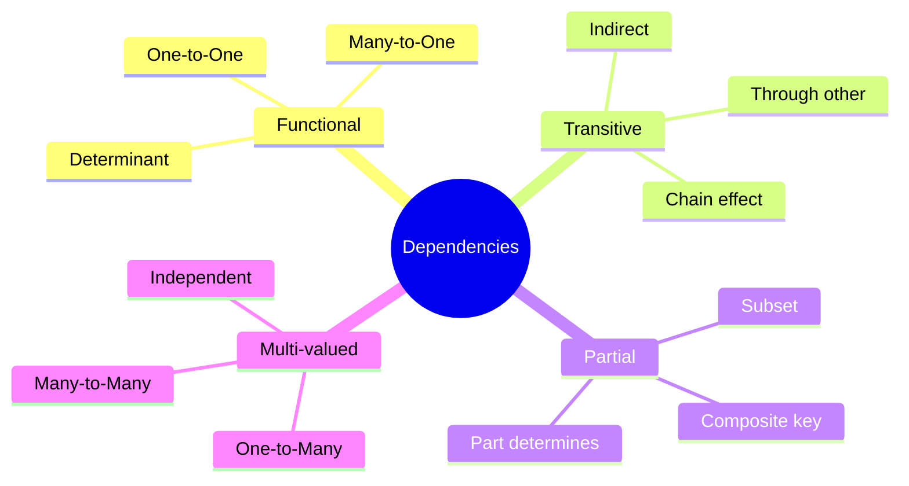
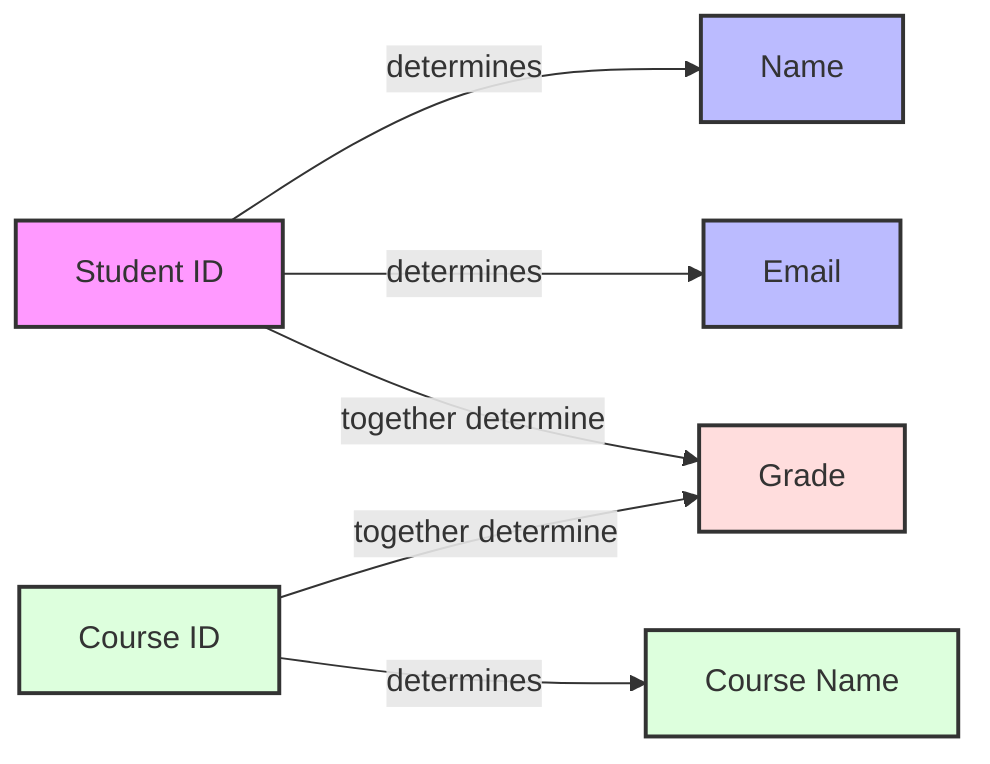
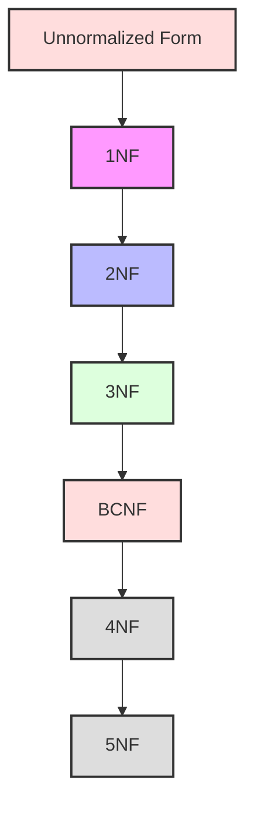
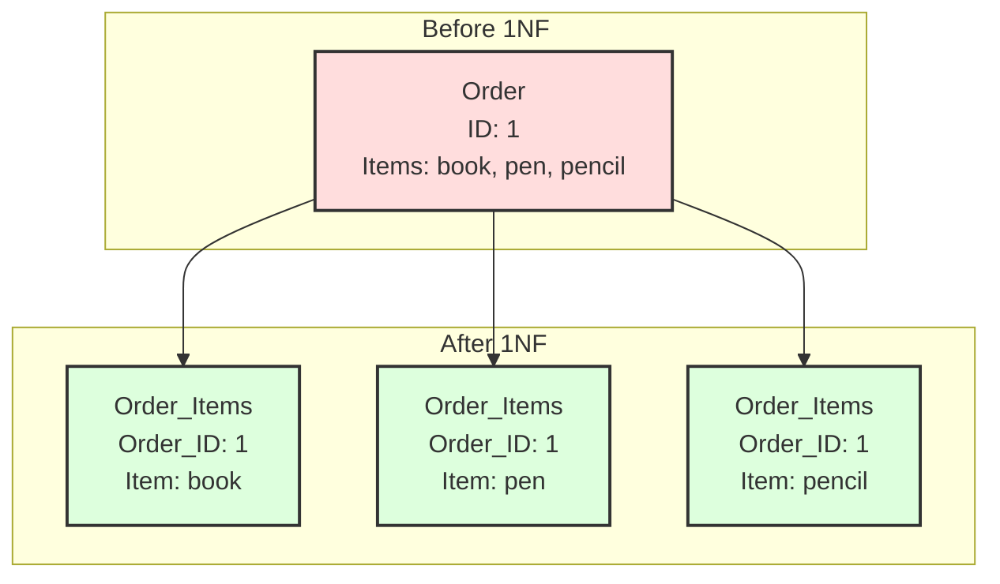
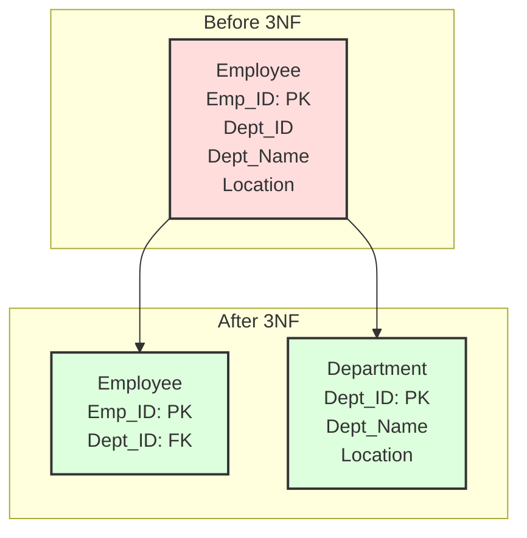
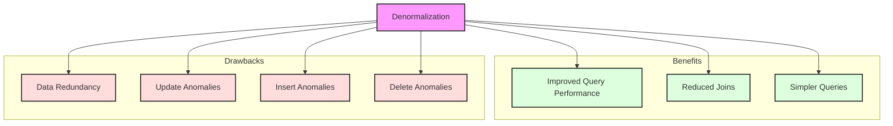

# Database Normalization

[← Previous: Transaction Management](transaction-management.md) | [Back to Course Content](README.md) | [Next: SQL and Database Programming →](sql-programming.md)

> Reference: This content is based on Lecture 5 (L5 CSC 542 2.0 DBA Normalization)

## Functional Dependencies

### Dependency Types


### Dependency Example


## Normal Forms

### Normalization Process


### First Normal Form (1NF)


### Second Normal Form (2NF)
```mermaid
graph TD
    subgraph Before 2NF
        A[Order_Items<br>Order_ID, Product_ID: PK<br>Product_Name<br>Quantity]
    end
    
    subgraph After 2NF
        B[Order_Items<br>Order_ID, Product_ID: PK<br>Quantity]
        C[Products<br>Product_ID: PK<br>Product_Name]
    end
    
    A --> B
    A --> C
    
    style A fill:#fdd,stroke:#333,stroke-width:2px
    style B fill:#dfd,stroke:#333,stroke-width:2px
    style style C fill:#dfd,stroke:#333,stroke-width:2px
```

### Third Normal Form (3NF)


## Denormalization

### Trade-offs


## Normalization Process

### Analysis Phase
1. **Identify Dependencies**
   - List all functional dependencies
   - Determine keys
   - Find attribute relationships

2. **Evaluate Current Form**
   - Check normal form violations
   - Identify problem areas
   - Plan decomposition

3. **Document Requirements**
   - Business rules
   - Data integrity needs
   - Performance considerations

### Decomposition
1. **Lossless Decomposition**
   - No loss of information
   - Original relation recoverable
   - Natural join preserves data

2. **Dependency Preservation**
   - All FDs represented
   - Constraints maintainable
   - Efficient checking possible

3. **Minimal Redundancy**
   - Eliminate repetition
   - Reduce update anomalies
   - Optimize storage

### Verification
1. **Test Normal Forms**
   - Verify 1NF compliance
   - Check 2NF requirements
   - Validate 3NF/BCNF

2. **Check Losslessness**
   - Join dependencies
   - Information preservation
   - Data consistency

3. **Validate Dependencies**
   - Dependency preservation
   - Constraint maintenance
   - Business rule compliance

## Denormalization Considerations

### Performance Factors
1. **Query Performance**
   - Read vs. write ratio
   - Join complexity
   - Response time requirements

2. **Data Volume**
   - Table sizes
   - Growth patterns
   - Storage constraints

3. **Usage Patterns**
   - Access frequency
   - Update patterns
   - Reporting needs

### Common Techniques
1. **Pre-joined Tables**
   - Combine normalized tables
   - Reduce join operations
   - Improve read performance

2. **Derived Data**
   - Store calculated values
   - Maintain summary data
   - Cache frequent results

3. **Repeating Groups**
   - Allow controlled redundancy
   - Fixed-size arrays
   - Embedded structures

### Implementation Guidelines
1. **Documentation**
   - Denormalization reasons
   - Data dependencies
   - Maintenance procedures

2. **Data Integrity**
   - Update procedures
   - Consistency checks
   - Error handling

3. **Maintenance**
   - Regular validation
   - Performance monitoring
   - Periodic review

### Trade-offs
1. **Advantages**
   - Improved query performance
   - Reduced join operations
   - Simpler queries

2. **Disadvantages**
   - Update overhead
   - Storage requirements
   - Complexity increase

3. **Considerations**
   - Business requirements
   - System resources
   - Maintenance capability

## Related Topics
- [Database Design](database-design.md) - Database design principles
- [Transaction Management](transaction-management.md) - Ensuring data integrity
- [SQL and Database Programming](sql-programming.md) - Implementing normalized databases

---
[← Previous: Transaction Management](transaction-management.md) | [Back to Course Content](README.md) | [Next: SQL and Database Programming →](sql-programming.md) 