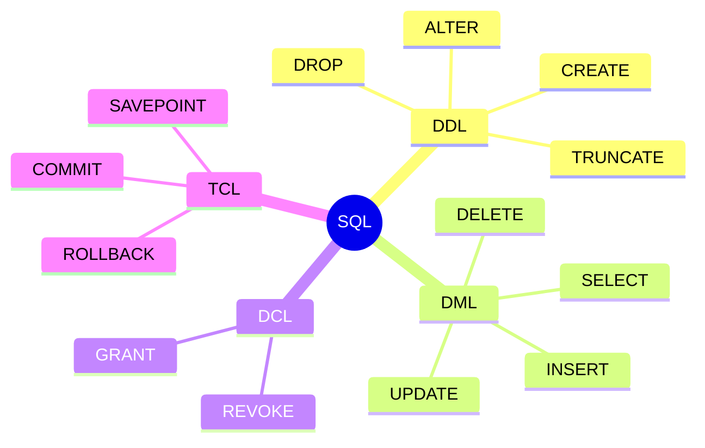
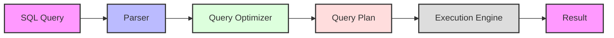
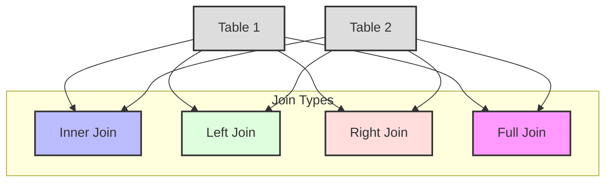
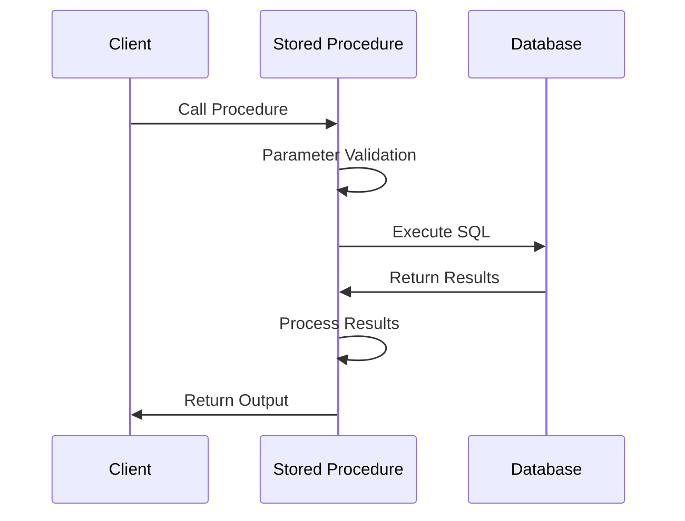
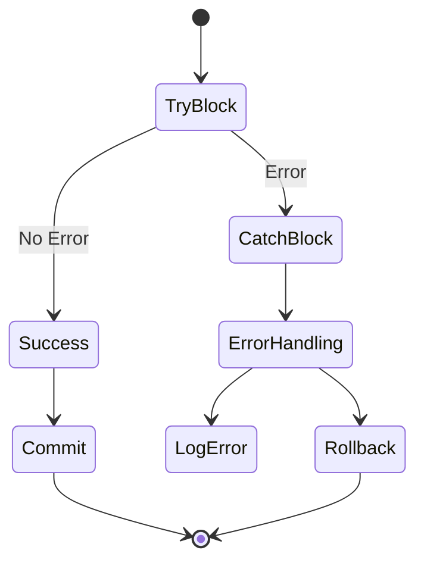
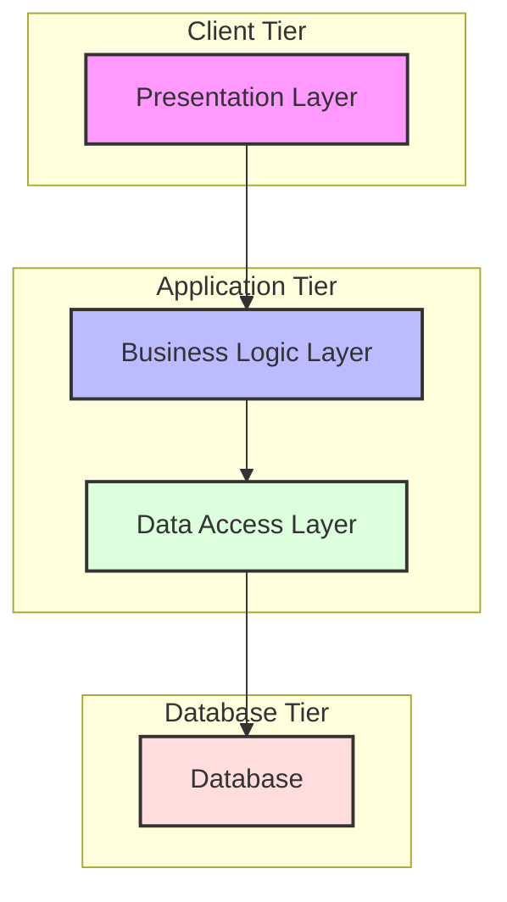
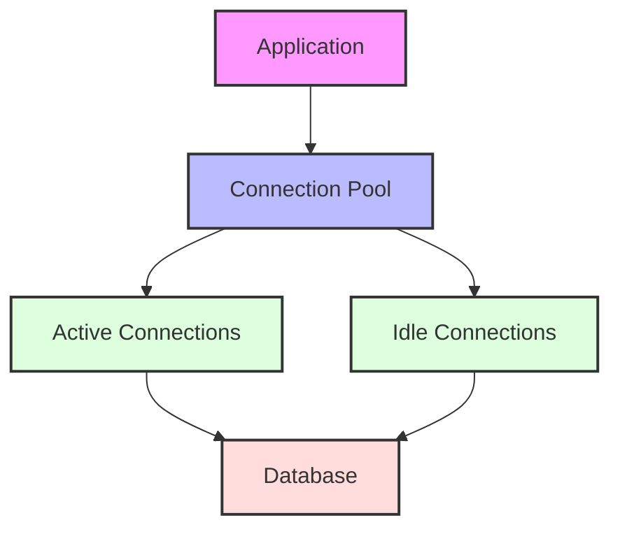
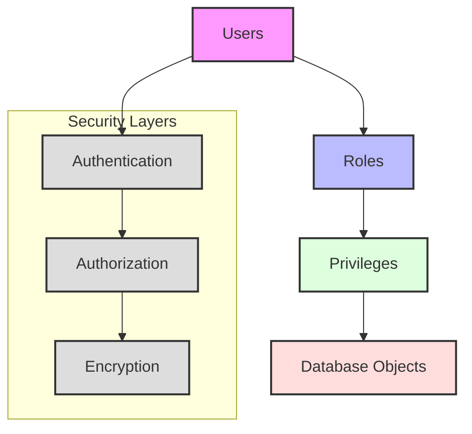

# SQL and Database Programming

[← Previous: Database Normalization](normalization.md) | [Back to Course Content](README.md)

> Reference: This content is based on Lecture 6 (L6 CSC 542 2.0 DBA SQL)

## SQL Components

### SQL Language Structure


## Query Processing

### Query Execution Flow


### Join Operations


## Stored Procedures

### Stored Procedure Flow


### Error Handling


## Database Programming

### Three-Tier Architecture


### Connection Pooling


## Database Security

### Access Control Model


## SQL Fundamentals

### Data Definition Language (DDL)
1. **CREATE**
   ```sql
   CREATE TABLE table_name (
       column1 datatype constraints,
       column2 datatype constraints,
       ...
       table_constraints
   );
   ```

2. **ALTER**
   ```sql
   ALTER TABLE table_name
   ADD column_name datatype;
   
   ALTER TABLE table_name
   MODIFY column_name new_datatype;
   ```

3. **DROP**
   ```sql
   DROP TABLE table_name;
   DROP DATABASE database_name;
   ```

### Data Manipulation Language (DML)
1. **SELECT**
   ```sql
   SELECT column1, column2, ...
   FROM table_name
   WHERE condition
   GROUP BY column
   HAVING condition
   ORDER BY column;
   ```

2. **INSERT**
   ```sql
   INSERT INTO table_name (column1, column2, ...)
   VALUES (value1, value2, ...);
   ```

3. **UPDATE**
   ```sql
   UPDATE table_name
   SET column1 = value1, column2 = value2, ...
   WHERE condition;
   ```

4. **DELETE**
   ```sql
   DELETE FROM table_name
   WHERE condition;
   ```

### Data Control Language (DCL)
1. **GRANT**
   ```sql
   GRANT privilege_name
   ON object_name
   TO user_name;
   ```

2. **REVOKE**
   ```sql
   REVOKE privilege_name
   ON object_name
   FROM user_name;
   ```

## Advanced SQL Features

### Joins
1. **INNER JOIN**
   ```sql
   SELECT *
   FROM table1
   INNER JOIN table2
   ON table1.column = table2.column;
   ```

2. **LEFT JOIN**
   ```sql
   SELECT *
   FROM table1
   LEFT JOIN table2
   ON table1.column = table2.column;
   ```

3. **RIGHT JOIN**
   ```sql
   SELECT *
   FROM table1
   RIGHT JOIN table2
   ON table1.column = table2.column;
   ```

4. **FULL JOIN**
   ```sql
   SELECT *
   FROM table1
   FULL OUTER JOIN table2
   ON table1.column = table2.column;
   ```

### Subqueries
1. **Single Row Subquery**
   ```sql
   SELECT *
   FROM employees
   WHERE salary > (SELECT AVG(salary) FROM employees);
   ```

2. **Multiple Row Subquery**
   ```sql
   SELECT *
   FROM products
   WHERE category_id IN (SELECT id FROM categories WHERE active = 1);
   ```

3. **Correlated Subquery**
   ```sql
   SELECT *
   FROM orders o
   WHERE total > (SELECT AVG(total) FROM orders WHERE customer_id = o.customer_id);
   ```

### Aggregate Functions
1. **Basic Functions**
   ```sql
   SELECT 
       COUNT(*),
       SUM(column),
       AVG(column),
       MAX(column),
       MIN(column)
   FROM table_name;
   ```

2. **Group By Operations**
   ```sql
   SELECT category, COUNT(*), AVG(price)
   FROM products
   GROUP BY category
   HAVING COUNT(*) > 5;
   ```

## Stored Procedures and Triggers

### Stored Procedures
1. **Creation**
   ```sql
   CREATE PROCEDURE procedure_name
   (parameter1 datatype, parameter2 datatype)
   AS
   BEGIN
       -- SQL statements
   END;
   ```

2. **Execution**
   ```sql
   EXECUTE procedure_name value1, value2;
   ```

3. **Parameters**
   - Input parameters
   - Output parameters
   - Input/Output parameters

### Functions
1. **Scalar Functions**
   ```sql
   CREATE FUNCTION function_name
   (@parameter datatype)
   RETURNS datatype
   AS
   BEGIN
       RETURN value;
   END;
   ```

2. **Table-Valued Functions**
   ```sql
   CREATE FUNCTION function_name
   (@parameter datatype)
   RETURNS TABLE
   AS
   RETURN (SELECT * FROM table_name WHERE column = @parameter);
   ```

### Triggers
1. **DML Triggers**
   ```sql
   CREATE TRIGGER trigger_name
   ON table_name
   AFTER INSERT, UPDATE, DELETE
   AS
   BEGIN
       -- Trigger logic
   END;
   ```

2. **DDL Triggers**
   ```sql
   CREATE TRIGGER trigger_name
   ON DATABASE
   FOR CREATE_TABLE, ALTER_TABLE, DROP_TABLE
   AS
   BEGIN
       -- Trigger logic
   END;
   ```

## Database Application Development

### Connection Management
1. **Connection String**
   ```java
   String url = "jdbc:mysql://localhost:3306/dbname";
   String username = "user";
   String password = "pass";
   Connection conn = DriverManager.getConnection(url, username, password);
   ```

2. **Connection Pooling**
   ```java
   DataSource ds = setupDataSource();
   Connection conn = ds.getConnection();
   ```

### Transaction Management
1. **ACID Properties**
   ```sql
   BEGIN TRANSACTION;
   
   -- SQL statements
   
   COMMIT;
   -- or
   ROLLBACK;
   ```

2. **Savepoints**
   ```sql
   SAVEPOINT savepoint_name;
   
   -- SQL statements
   
   ROLLBACK TO savepoint_name;
   ```

### Error Handling
1. **Try-Catch Blocks**
   ```sql
   BEGIN TRY
       -- SQL statements
   END TRY
   BEGIN CATCH
       -- Error handling
   END CATCH;
   ```

2. **Error Functions**
   ```sql
   SELECT
       ERROR_NUMBER() AS ErrorNumber,
       ERROR_MESSAGE() AS ErrorMessage;
   ```

### Performance Optimization
1. **Indexing**
   ```sql
   CREATE INDEX index_name
   ON table_name (column1, column2);
   ```

2. **Query Optimization**
   ```sql
   -- Use EXPLAIN to analyze query execution plan
   EXPLAIN SELECT * FROM table_name WHERE condition;
   ```

3. **Caching**
   ```sql
   -- Example of result caching
   SELECT /*+ RESULT_CACHE */ *
   FROM large_table
   WHERE complex_condition;
   ```

### Security Implementation
1. **User Management**
   ```sql
   CREATE USER username
   IDENTIFIED BY password;
   ```

2. **Role Assignment**
   ```sql
   GRANT role_name TO username;
   ```

3. **Object Privileges**
   ```sql
   GRANT SELECT, INSERT ON table_name
   TO username;
   ```

### Monitoring and Maintenance
1. **Performance Monitoring**
   ```sql
   SELECT *
   FROM performance_schema.events_statements_summary_by_digest
   ORDER BY sum_timer_wait DESC;
   ```

2. **Database Statistics**
   ```sql
   ANALYZE TABLE table_name;
   ```

3. **Maintenance Tasks**
   ```sql
   -- Rebuild indexes
   ALTER INDEX index_name ON table_name REBUILD;
   
   -- Update statistics
   UPDATE STATISTICS table_name;
   ```

## Related Topics
- [Database Design](database-design.md) - Database design principles
- [Database Implementation](database-implementation.md) - Physical implementation
- [Transaction Management](transaction-management.md) - Transaction handling
- [Database Normalization](normalization.md) - Data normalization concepts

## Practice Resources
- Sample Databases
- Exercise Problems
- Model Paper Questions

---
[← Previous: Database Normalization](normalization.md) | [Back to Course Content](README.md) 