# Transaction Management

[← Previous: Database Implementation](database-implementation.md) | [Back to Course Content](README.md) | [Next: Database Normalization →](normalization.md)

> Reference: This content is based on Lecture 4 (L4 CSC 542 2.0 DBA)

## ACID Properties

<div title="ACID properties ensure that database transactions are processed reliably and maintain data integrity">
ACID (Atomicity, Consistency, Isolation, Durability) properties are fundamental characteristics of database transactions.
</div>

### Transaction Properties Overview
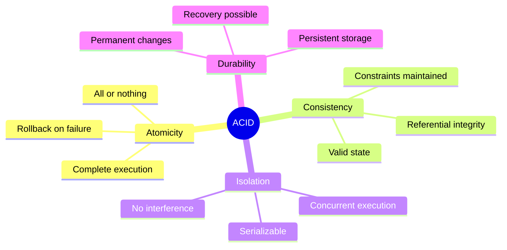

<details>
<summary><strong>ACID Properties Details</strong></summary>

1. **Atomicity**
   - All-or-nothing execution
   - Example:
     ```sql
     BEGIN TRANSACTION;
       UPDATE accounts SET balance = balance - 100 WHERE id = 1;
       UPDATE accounts SET balance = balance + 100 WHERE id = 2;
     COMMIT;
     -- If either update fails, both are rolled back
     ```

2. **Consistency**
   - Database remains valid
   - Example:
     ```sql
     -- Constraint ensures consistency
     ALTER TABLE accounts 
     ADD CONSTRAINT check_balance 
     CHECK (balance >= 0);
     ```

3. **Isolation**
   - Concurrent transactions independent
   - Example:
     ```sql
     -- Isolation level setting
     SET TRANSACTION ISOLATION LEVEL SERIALIZABLE;
     ```

4. **Durability**
   - Committed changes permanent
   - Example:
     ```sql
     -- Write-ahead logging ensures durability
     ALTER SYSTEM SET log_buffer_size = 16M;
     ```
</details>

## Transaction States

<div title="Transactions go through various states during their lifecycle, from start to completion or failure">
Transaction states describe the different phases a transaction goes through during its execution.
</div>

### State Transition Diagram
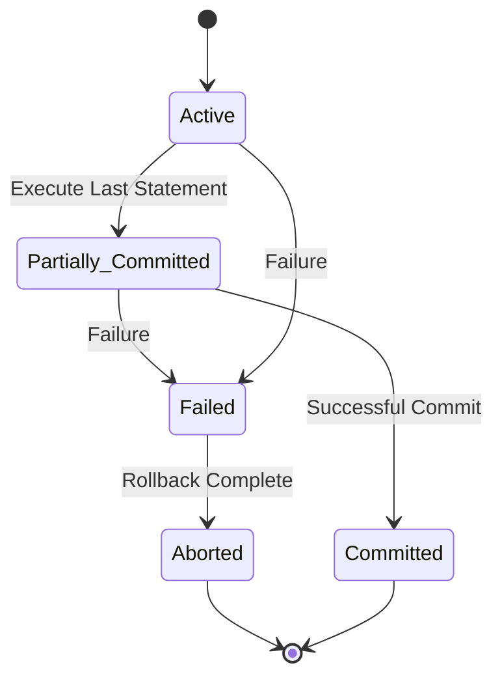

<details>
<summary><strong>Transaction State Details</strong></summary>

1. **Active State**
   - Transaction executing
   - Example:
     ```sql
     BEGIN TRANSACTION;
       -- Transaction is in Active state
       UPDATE accounts SET balance = balance - 100;
     ```

2. **Partially Committed**
   - Final statement executed
   - Example:
     ```sql
     UPDATE accounts SET balance = balance - 100;
     -- Transaction is Partially Committed
     COMMIT;
     ```

3. **Failed State**
   - Error occurred
   - Example:
     ```sql
     BEGIN TRANSACTION;
       UPDATE accounts SET balance = balance - 100;
       -- System crash occurs
       -- Transaction enters Failed state
     ```

4. **Aborted State**
   - Rollback completed
   - Example:
     ```sql
     BEGIN TRANSACTION;
       UPDATE accounts SET balance = balance - 100;
     ROLLBACK;
     -- Transaction enters Aborted state
     ```

5. **Committed State**
   - Successfully completed
   - Example:
     ```sql
     BEGIN TRANSACTION;
       UPDATE accounts SET balance = balance - 100;
     COMMIT;
     -- Transaction enters Committed state
     ```
</details>

## Concurrency Control

<div title="Concurrency control mechanisms ensure that multiple transactions can execute simultaneously without compromising data integrity">
Concurrency control manages simultaneous access to database resources by multiple transactions.
</div>

### Two-Phase Locking Protocol
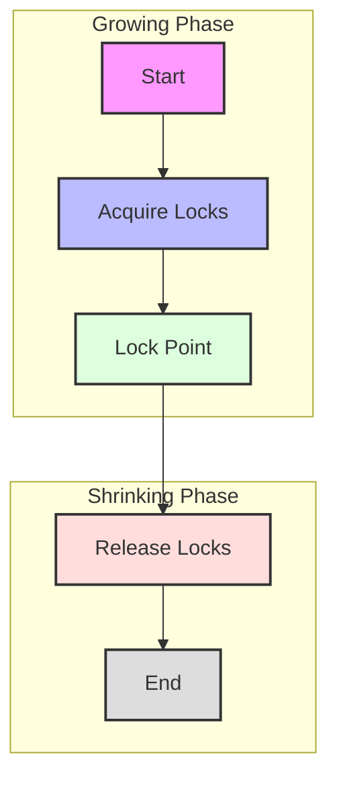

<details>
<summary><strong>Two-Phase Locking Details</strong></summary>

1. **Growing Phase**
   - Acquire locks only
   - Example:
     ```sql
     BEGIN TRANSACTION;
       -- Growing Phase
       SELECT * FROM accounts WHERE id = 1 FOR UPDATE;
       -- Acquires lock
     ```

2. **Lock Point**
   - Maximum locks held
   - Example:
     ```sql
     BEGIN TRANSACTION;
       SELECT * FROM accounts WHERE id = 1 FOR UPDATE;
       SELECT * FROM accounts WHERE id = 2 FOR UPDATE;
       -- Lock Point reached
     ```

3. **Shrinking Phase**
   - Release locks only
   - Example:
     ```sql
     BEGIN TRANSACTION;
       -- Shrinking Phase
       UPDATE accounts SET balance = balance - 100;
       COMMIT;
       -- Releases all locks
     ```

4. **Lock Types**
   - Shared (S) locks
   - Exclusive (X) locks
   - Example:
     ```sql
     -- Shared lock
     SELECT * FROM accounts LOCK IN SHARE MODE;
     
     -- Exclusive lock
     SELECT * FROM accounts FOR UPDATE;
     ```
</details>

### Deadlock Example
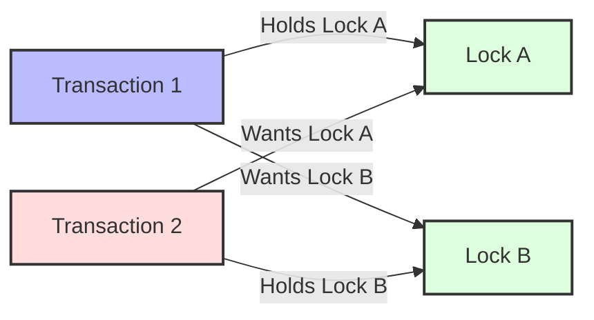

<details>
<summary><strong>Deadlock Prevention and Detection</strong></summary>

1. **Deadlock Prevention**
   - Resource ordering
   - Example:
     ```sql
     -- Always lock accounts in ascending order
     BEGIN TRANSACTION;
       SELECT * FROM accounts WHERE id = 1 FOR UPDATE;
       SELECT * FROM accounts WHERE id = 2 FOR UPDATE;
     COMMIT;
     ```

2. **Deadlock Detection**
   - Wait-for graph
   - Example:
     ```sql
     -- Set deadlock timeout
     SET innodb_lock_wait_timeout = 50;
     ```

3. **Deadlock Resolution**
   - Victim selection
   - Example:
     ```sql
     -- Transaction killed as victim
     ERROR 1213 (40001): Deadlock found
     ```

4. **Best Practices**
   - Lock ordering
   - Timeout settings
   - Transaction size
   - Example:
     ```sql
     -- Good practice
     BEGIN TRANSACTION;
       SELECT * FROM accounts WHERE id = 1 FOR UPDATE;
       UPDATE accounts SET balance = balance - 100;
     COMMIT;
     ```
</details>

## Transaction Isolation Levels

<div title="Isolation levels determine how transaction integrity is visible to other users and systems">
Transaction isolation levels define the degree to which the operations in one transaction are isolated from operations in other concurrent transactions.
</div>

### Isolation Levels Comparison
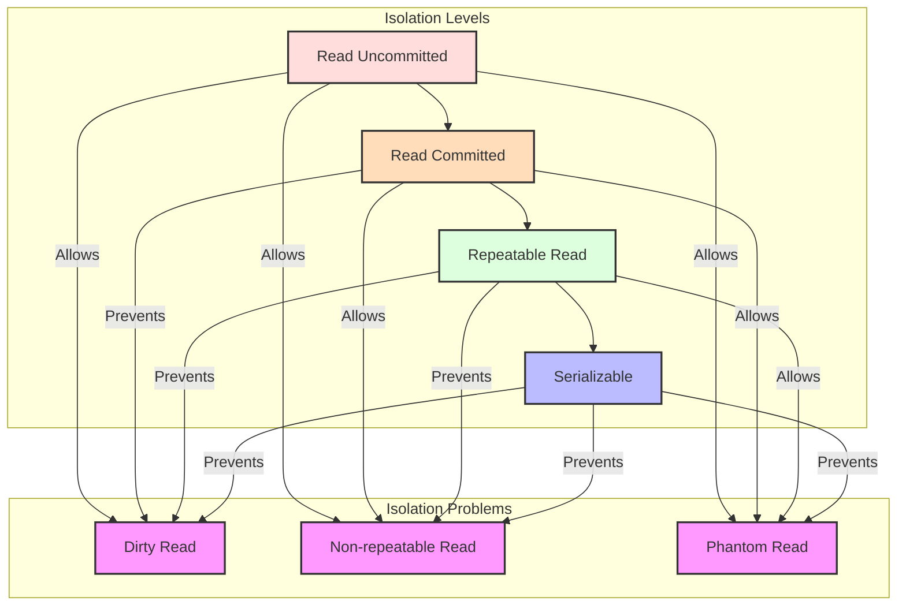

<details>
<summary><strong>Isolation Levels and Concurrency Phenomena</strong></summary>

1. **Read Uncommitted**
   - Lowest isolation level
   - Allows dirty reads
   - Example:
     ```sql
     SET TRANSACTION ISOLATION LEVEL READ UNCOMMITTED;
     BEGIN TRANSACTION;
       -- Can see uncommitted changes from other transactions
       SELECT * FROM accounts;
     COMMIT;
     ```

2. **Read Committed**
   - Prevents dirty reads
   - Allows non-repeatable reads and phantom reads
   - Example:
     ```sql
     SET TRANSACTION ISOLATION LEVEL READ COMMITTED;
     BEGIN TRANSACTION;
       -- Only sees committed changes
       -- May see different results if query repeated
       SELECT * FROM accounts;
     COMMIT;
     ```

3. **Repeatable Read**
   - Prevents dirty reads and non-repeatable reads
   - Allows phantom reads
   - Example:
     ```sql
     SET TRANSACTION ISOLATION LEVEL REPEATABLE READ;
     BEGIN TRANSACTION;
       -- Same result if query repeated
       -- But might see new rows (phantoms)
       SELECT * FROM accounts WHERE balance > 1000;
     COMMIT;
     ```

4. **Serializable**
   - Highest isolation level
   - Prevents all concurrency phenomena
   - Example:
     ```sql
     SET TRANSACTION ISOLATION LEVEL SERIALIZABLE;
     BEGIN TRANSACTION;
       -- Complete isolation
       -- Most consistent but lowest concurrency
       SELECT * FROM accounts WHERE balance > 1000;
     COMMIT;
     ```

5. **Concurrency Phenomena**
   - **Dirty Read**: Reading uncommitted changes
   - **Non-repeatable Read**: Getting different values on re-read
   - **Phantom Read**: Seeing new rows on re-execution of query
</details>

### Isolation Levels Performance Impact

| Isolation Level | Concurrency | Overhead | Typical Use Case |
|-----------------|-------------|----------|------------------|
| **Read Uncommitted** | Highest | Lowest | Report generation, approximate counts |
| **Read Committed** | High | Low | General OLTP, most applications |
| **Repeatable Read** | Medium | Medium | Financial calculations, consistent reporting |
| **Serializable** | Lowest | Highest | Critical financial transactions, regulatory compliance |

### Isolation Level Examples

**Read Uncommitted (Dirty Read):**
```sql
-- Transaction 1
BEGIN TRANSACTION;
UPDATE accounts SET balance = balance - 100 WHERE id = 1;
-- Not yet committed

-- Transaction 2 (using Read Uncommitted)
SET TRANSACTION ISOLATION LEVEL READ UNCOMMITTED;
BEGIN TRANSACTION;
SELECT balance FROM accounts WHERE id = 1;
-- Will see the uncommitted balance (-100)
COMMIT;

-- Transaction 1 rolls back
ROLLBACK;
-- Transaction 2 used a value that never actually existed
```

**Non-repeatable Read:**
```sql
-- Transaction 1 (using Read Committed)
SET TRANSACTION ISOLATION LEVEL READ COMMITTED;
BEGIN TRANSACTION;
SELECT balance FROM accounts WHERE id = 1;
-- Returns 1000

-- Transaction 2
BEGIN TRANSACTION;
UPDATE accounts SET balance = 900 WHERE id = 1;
COMMIT;

-- Transaction 1 continues
SELECT balance FROM accounts WHERE id = 1;
-- Returns 900 (different from first read)
COMMIT;
```

**Phantom Read:**
```sql
-- Transaction 1 (using Repeatable Read)
SET TRANSACTION ISOLATION LEVEL REPEATABLE READ;
BEGIN TRANSACTION;
SELECT * FROM accounts WHERE balance > 500;
-- Returns 3 rows

-- Transaction 2
BEGIN TRANSACTION;
INSERT INTO accounts (id, balance) VALUES (5, 600);
COMMIT;

-- Transaction 1 continues
SELECT * FROM accounts WHERE balance > 500;
-- Now returns 4 rows (phantom row appeared)
COMMIT;
```

## Advanced Concurrency Control Techniques

### Multiversion Concurrency Control (MVCC)
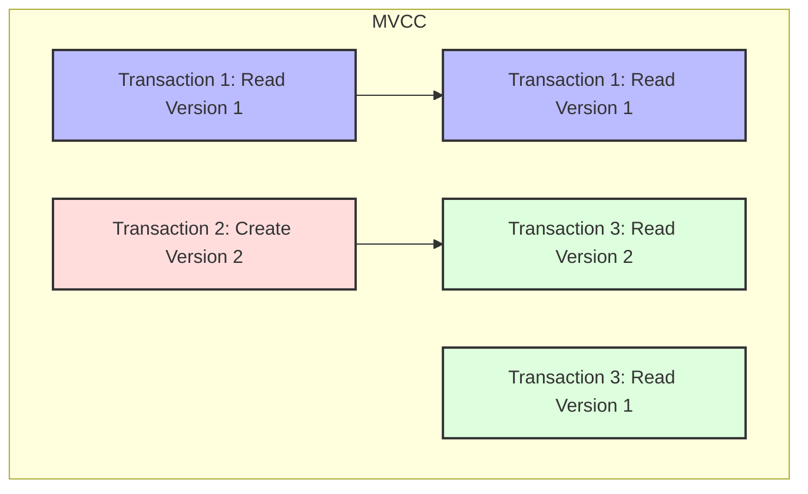

<details>
<summary><strong>MVCC Implementation Details</strong></summary>

1. **Version Creation**
   - Each write creates a new version
   - Old versions maintained
   - Example:
     ```
     Row X, Version 1: {value: 100, txn_id: 10, start_ts: 100, end_ts: 200}
     Row X, Version 2: {value: 150, txn_id: 15, start_ts: 200, end_ts: null}
     ```

2. **Version Visibility**
   - Transaction sees versions based on timestamp
   - Snapshot isolation
   - Example:
     ```sql
     -- Transaction with timestamp 150 sees Version 1
     -- Transaction with timestamp 250 sees Version 2
     ```

3. **Garbage Collection**
   - Old versions eventually removed
   - No transaction can see them
   - Example:
     ```sql
     -- System determines Version 1 is no longer visible
     -- Version 1 is removed during cleanup
     ```

4. **Benefits**
   - Readers don't block writers
   - Writers don't block readers
   - Higher concurrency
   - Less deadlock situations
</details>

### Optimistic vs. Pessimistic Concurrency Control

| Feature | Optimistic | Pessimistic |
|---------|------------|-------------|
| **Lock Usage** | No locks during execution | Locks resources before access |
| **Conflict Detection** | At commit time | Before data access |
| **Best For** | Low contention scenarios | High contention scenarios |
| **Performance** | Better when conflicts rare | Better when conflicts common |
| **Implementation** | Validation phase at commit | Lock acquisition before operations |
| **Example Systems** | PostgreSQL MVCC | Traditional locking in MySQL |

#### Optimistic Concurrency Control Algorithm
```
1. Read Phase:
   - Read data without locking
   - Keep track of read set

2. Local Computation:
   - Perform all operations locally
   - Track intended writes

3. Validation Phase:
   - Check if read data has been modified
   - If conflict, abort and retry
   - If no conflict, proceed

4. Write Phase:
   - Apply all changes to database
   - Make changes visible to others
```

#### Optimistic Concurrency Control Example
```sql
-- Version tracking with timestamps
BEGIN TRANSACTION;
  SELECT balance, version FROM accounts WHERE id = 1;
  -- Returns balance: 1000, version: 5
  
  -- Compute new balance locally
  -- balance = 1000 - 100 = 900
  
  -- Update with version check
  UPDATE accounts 
  SET balance = 900, version = 6 
  WHERE id = 1 AND version = 5;
  
  -- If affected rows = 0, conflict occurred
  -- If affected rows = 1, update succeeded
COMMIT;
```

## Recovery Management

<div title="Recovery management ensures that the database can be restored to a consistent state after failures">
Recovery management handles system failures and ensures database consistency.
</div>

### Recovery Process Flow
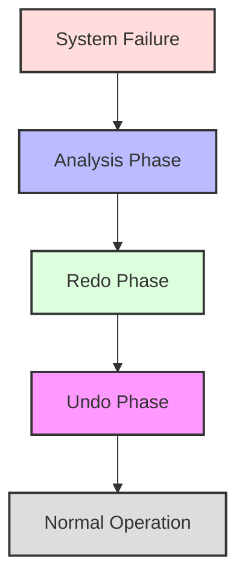

<details>
<summary><strong>Recovery Process Details</strong></summary>

1. **Analysis Phase**
   - Identify failed transactions
   - Example:
     ```sql
     -- Check transaction log
     SELECT * FROM pg_stat_activity 
     WHERE state = 'failed';
     ```

2. **Redo Phase**
   - Replay committed transactions
   - Example:
     ```sql
     -- Redo log configuration
     ALTER SYSTEM SET log_archive_dest = '/archive';
     ```

3. **Undo Phase**
   - Rollback uncommitted transactions
   - Example:
     ```sql
     -- Undo tablespace
     CREATE UNDO TABLESPACE undo_ts;
     ```

4. **Checkpointing**
   - Regular state saving
   - Example:
     ```sql
     -- Checkpoint configuration
     ALTER SYSTEM SET checkpoint_timeout = '5min';
     ```
</details>

### Log-Based Recovery
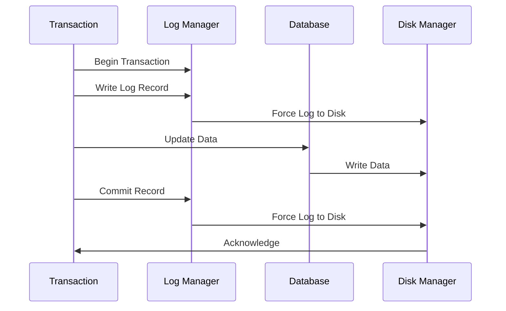

<details>
<summary><strong>Log-Based Recovery Details</strong></summary>

1. **Log Records**
   - Transaction start/end
   - Data modifications
   - Example:
     ```sql
     -- Log record structure
     CREATE TABLE transaction_log (
         log_id INT,
         transaction_id INT,
         operation_type VARCHAR(10),
         timestamp TIMESTAMP,
         data JSON
     );
     ```

2. **Write-Ahead Logging**
   - Log before data
   - Example:
     ```sql
     -- WAL configuration
     ALTER SYSTEM SET wal_level = 'replica';
     ```

3. **Log Buffer**
   - Memory cache for logs
   - Example:
     ```sql
     -- Log buffer size
     ALTER SYSTEM SET log_buffer_size = '16MB';
     ```

4. **Log Archiving**
   - Long-term storage
   - Example:
     ```sql
     -- Archive log mode
     ALTER DATABASE ARCHIVELOG;
     ```
</details>

### Recovery Strategies Comparison

| Strategy | Mechanism | Recovery Time | Data Loss | Use Case |
|----------|-----------|---------------|-----------|----------|
| **Transaction Logs** | Write-Ahead Logging | Medium | None (if logs intact) | Most DBMS systems |
| **Checkpointing** | Periodic consistent state | Reduces recovery time | None | Supplements logs |
| **Shadow Paging** | Copy-on-write for pages | Fast | None | Some NoSQL systems |
| **Replication** | Data copied to multiple servers | Very fast | Minimal | High availability systems |
| **RAID Storage** | Hardware redundancy | Immediate | None | Infrastructure protection |

## Advanced Transaction Models

### Long-Running Transactions
Long-running transactions can impact system performance through extended lock holding and increased conflict potential.

#### Strategies for Managing Long Transactions
1. **Save Points**
   ```sql
   BEGIN TRANSACTION;
     -- Process first 1000 records
     SAVEPOINT batch_1;
     
     -- Process next 1000 records
     SAVEPOINT batch_2;
     
     -- If error occurs
     ROLLBACK TO SAVEPOINT batch_1;
     
   COMMIT;
   ```

2. **Batch Processing**
   ```sql
   -- Process in batches of 1000
   WHILE (records_remaining > 0) DO
     BEGIN TRANSACTION;
       -- Process up to 1000 records
     COMMIT;
   END WHILE;
   ```

3. **Compensating Transactions**
   When a transaction can't be rolled back, create a new transaction that logically undoes the effects:
   ```sql
   -- Original Transaction
   BEGIN TRANSACTION;
     UPDATE accounts SET balance = balance - 100 WHERE id = 1;
     UPDATE accounts SET balance = balance + 100 WHERE id = 2;
   COMMIT;
   
   -- Compensating Transaction (if needed)
   BEGIN TRANSACTION;
     UPDATE accounts SET balance = balance + 100 WHERE id = 1;
     UPDATE accounts SET balance = balance - 100 WHERE id = 2;
   COMMIT;
   ```

### Distributed Transactions

<div title="Distributed transactions span multiple database systems or services, requiring coordination for atomic execution">
Distributed transactions involve multiple, separate database systems that must work together to ensure transaction properties.
</div>

#### Two-Phase Commit Protocol (2PC)
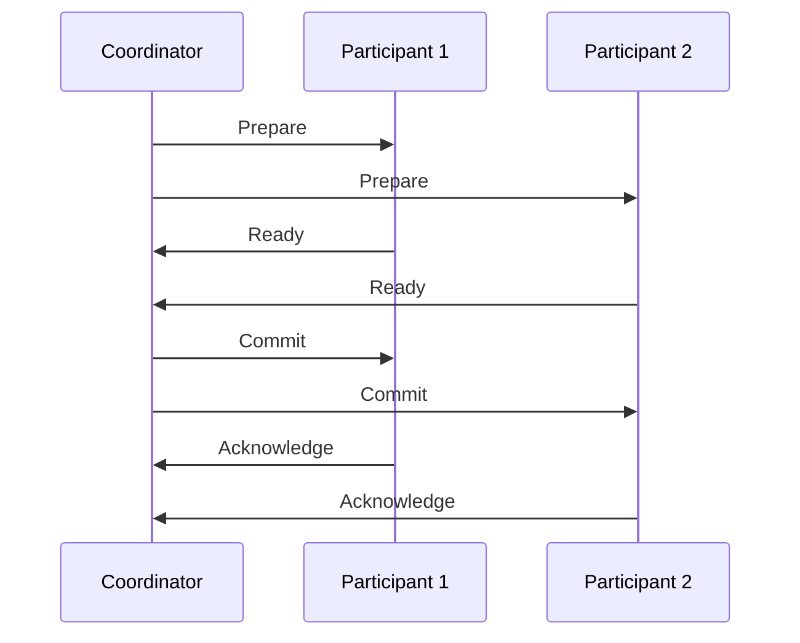

<details>
<summary><strong>Two-Phase Commit Details</strong></summary>

1. **Phase 1: Prepare**
   - Coordinator asks participants if they can commit
   - Participants must guarantee they can commit
   - Example:
     ```
     Coordinator → Participant 1: "Can you commit Transaction T?"
     Participant 1 → Coordinator: "Yes"
     ```

2. **Phase 2: Commit/Abort**
   - If all participants ready, coordinator sends commit
   - If any participant failed, coordinator sends abort
   - Example:
     ```
     Coordinator → All Participants: "Commit Transaction T"
     Participants → Coordinator: "Transaction T committed"
     ```

3. **Failure Handling**
   - Timeout mechanisms
   - Recovery procedures
   - Example:
     ```
     Coordinator fails to get response from Participant 2
     Coordinator → All Participants: "Abort Transaction T"
     ```

4. **Limitations**
   - Blocking protocol
   - Performance overhead
   - Single point of failure (coordinator)
</details>

#### Three-Phase Commit Protocol (3PC)
Adds a pre-commit phase to reduce blocking issues:

1. **Phase 1: Prepare**
   - Same as 2PC prepare phase

2. **Phase 2: Pre-commit**
   - Coordinator decides global commit/abort
   - Participants prepare to commit but don't commit yet

3. **Phase 3: Commit/Abort**
   - Final commit instruction
   - Participants complete the transaction

#### Saga Pattern
For long-running distributed transactions:

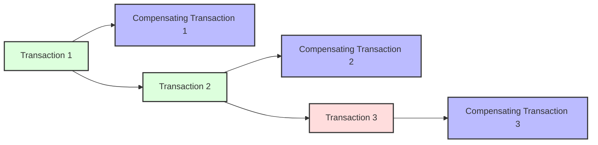

1. **Sequential Transactions**
   - Break large transaction into sequence of smaller ones
   - Each transaction updates the database and publishes an event

2. **Compensating Transactions**
   - For each transaction, define a compensating transaction
   - If any transaction fails, execute compensating transactions in reverse order

3. **Example**
   ```
   T1: Reserve Hotel → Success
   T2: Book Flight → Success
   T3: Rent Car → Fails
   
   C2: Cancel Flight
   C1: Cancel Hotel
   ```

## Database Security

<div title="Database security encompasses various mechanisms to protect data from unauthorized access and ensure data integrity">
Database security includes authentication, authorization, and data protection mechanisms.
</div>

### Security Levels
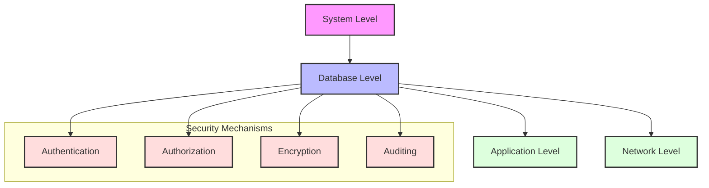

<details>
<summary><strong>Security Implementation Details</strong></summary>

1. **Authentication**
   - User verification
   - Example:
     ```sql
     -- Create user with password
     CREATE USER john_doe 
     IDENTIFIED BY 'secure_password';
     ```

2. **Authorization**
   - Access control
   - Example:
     ```sql
     -- Grant privileges
     GRANT SELECT, INSERT 
     ON employees TO hr_staff;
     ```

3. **Encryption**
   - Data protection
   - Example:
     ```sql
     -- Encrypt sensitive data
     ALTER TABLE users 
     MODIFY COLUMN password 
     ENCRYPTED USING 'AES256';
     ```

4. **Auditing**
   - Activity monitoring
   - Example:
     ```sql
     -- Enable audit trail
     AUDIT SELECT, INSERT, UPDATE, DELETE 
     ON employees;
     ```
</details>

### Access Control

1. **Authentication**
   - User identification
   - Password management
   - Multi-factor authentication

2. **Authorization**
   - Privileges
   - Roles
   - Views

3. **Audit**
   - Audit trails
   - Activity monitoring
   - Compliance reporting

### Data Security

1. **Encryption**
   - Data-at-rest
   - Data-in-transit
   - Key management

2. **Privacy**
   - Data masking
   - Anonymization
   - Access controls

3. **Compliance**
   - Regulatory requirements
   - Industry standards
   - Security policies

### Security Models

1. **Discretionary Access Control**
   - Owner-based
   - Grant/revoke
   - Flexible

2. **Mandatory Access Control**
   - Level-based
   - Strict hierarchy
   - System-enforced

3. **Role-Based Access Control**
   - Role hierarchy
   - Separation of duties
   - Role assignment

### Security Administration

1. **Policy Management**
   - Security policies
   - Procedures
   - Guidelines

2. **User Management**
   - Account creation
   - Privilege assignment
   - Account termination

3. **Monitoring and Response**
   - Security monitoring
   - Incident response
   - Security updates

## Related Topics
- [Database Implementation](database-implementation.md) - Physical implementation aspects
- [Database Normalization](normalization.md) - Data integrity through normalization
- [SQL and Database Programming](sql-programming.md) - Transaction implementation in SQL

---
[← Previous: Database Implementation](database-implementation.md) | [Back to Course Content](README.md) | [Next: Database Normalization →](normalization.md) 