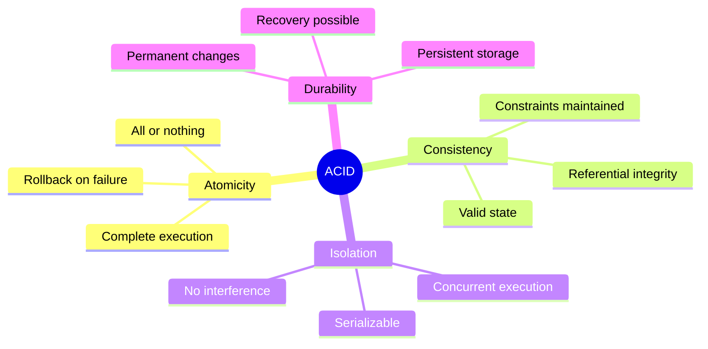
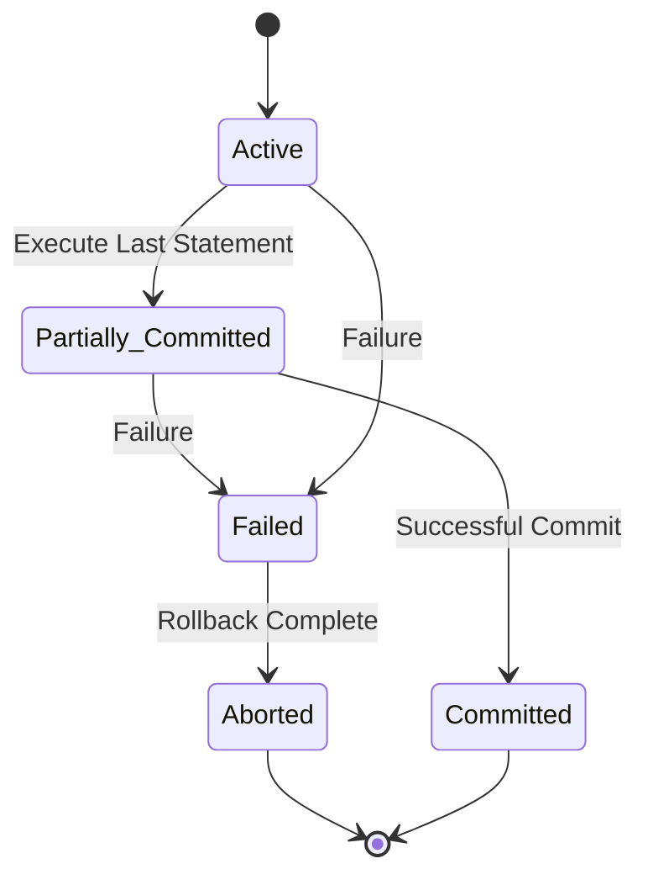
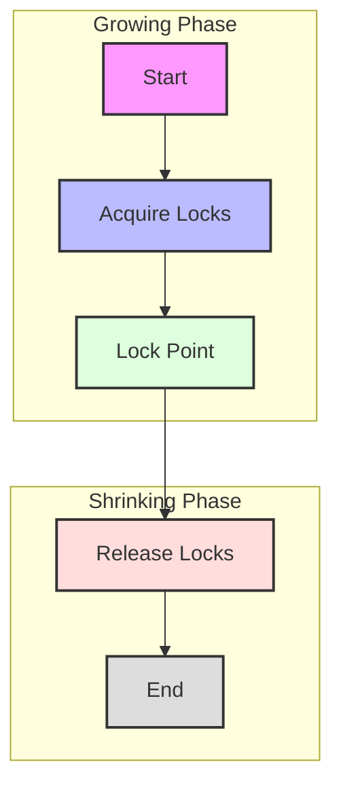
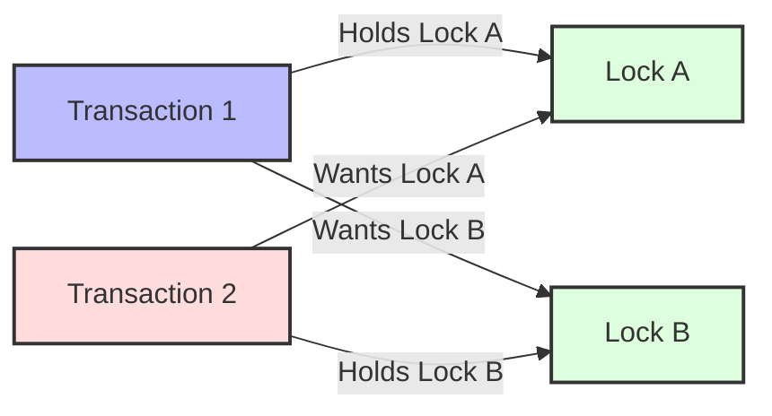
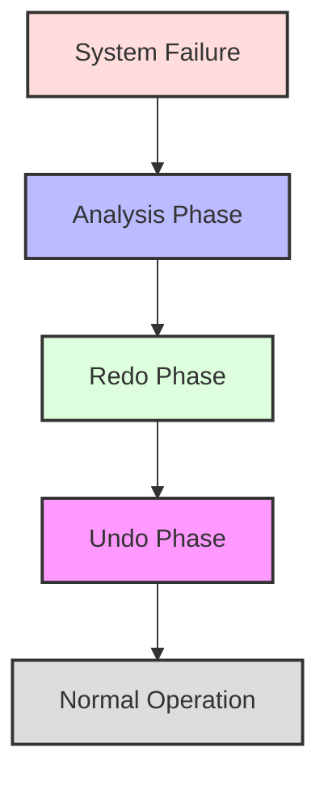
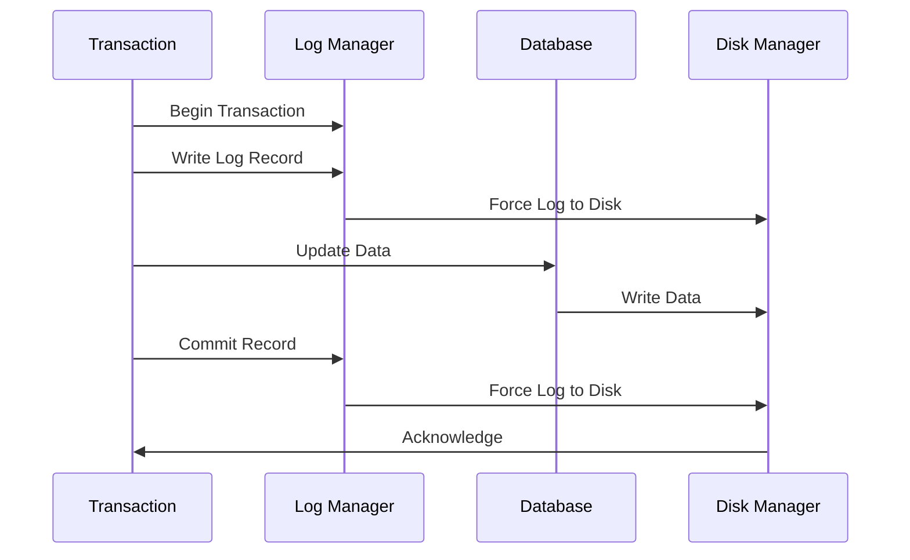
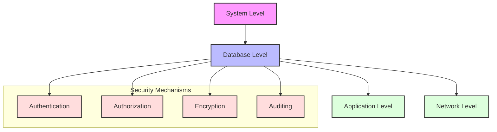

# Transaction Management

[← Previous: Database Implementation](database-implementation.md) | [Back to Course Content](README.md) | [Next: Database Normalization →](normalization.md)

> Reference: This content is based on Lecture 4 (L4 CSC 542 2.0 DBA)

## ACID Properties

<div title="ACID properties ensure that database transactions are processed reliably and maintain data integrity">
ACID (Atomicity, Consistency, Isolation, Durability) properties are fundamental characteristics of database transactions.
</div>

### Transaction Properties Overview


<details>
<summary><strong>ACID Properties Details</strong></summary>

1. **Atomicity**
   - All-or-nothing execution
   - Example:
     ```sql
     BEGIN TRANSACTION;
       UPDATE accounts SET balance = balance - 100 WHERE id = 1;
       UPDATE accounts SET balance = balance + 100 WHERE id = 2;
     COMMIT;
     -- If either update fails, both are rolled back
     ```

2. **Consistency**
   - Database remains valid
   - Example:
     ```sql
     -- Constraint ensures consistency
     ALTER TABLE accounts 
     ADD CONSTRAINT check_balance 
     CHECK (balance >= 0);
     ```

3. **Isolation**
   - Concurrent transactions independent
   - Example:
     ```sql
     -- Isolation level setting
     SET TRANSACTION ISOLATION LEVEL SERIALIZABLE;
     ```

4. **Durability**
   - Committed changes permanent
   - Example:
     ```sql
     -- Write-ahead logging ensures durability
     ALTER SYSTEM SET log_buffer_size = 16M;
     ```
</details>

## Transaction States

<div title="Transactions go through various states during their lifecycle, from start to completion or failure">
Transaction states describe the different phases a transaction goes through during its execution.
</div>

### State Transition Diagram


<details>
<summary><strong>Transaction State Details</strong></summary>

1. **Active State**
   - Transaction executing
   - Example:
     ```sql
     BEGIN TRANSACTION;
       -- Transaction is in Active state
       UPDATE accounts SET balance = balance - 100;
     ```

2. **Partially Committed**
   - Final statement executed
   - Example:
     ```sql
     UPDATE accounts SET balance = balance - 100;
     -- Transaction is Partially Committed
     COMMIT;
     ```

3. **Failed State**
   - Error occurred
   - Example:
     ```sql
     BEGIN TRANSACTION;
       UPDATE accounts SET balance = balance - 100;
       -- System crash occurs
       -- Transaction enters Failed state
     ```

4. **Aborted State**
   - Rollback completed
   - Example:
     ```sql
     BEGIN TRANSACTION;
       UPDATE accounts SET balance = balance - 100;
     ROLLBACK;
     -- Transaction enters Aborted state
     ```

5. **Committed State**
   - Successfully completed
   - Example:
     ```sql
     BEGIN TRANSACTION;
       UPDATE accounts SET balance = balance - 100;
     COMMIT;
     -- Transaction enters Committed state
     ```
</details>

## Concurrency Control

<div title="Concurrency control mechanisms ensure that multiple transactions can execute simultaneously without compromising data integrity">
Concurrency control manages simultaneous access to database resources by multiple transactions.
</div>

### Two-Phase Locking Protocol


<details>
<summary><strong>Two-Phase Locking Details</strong></summary>

1. **Growing Phase**
   - Acquire locks only
   - Example:
     ```sql
     BEGIN TRANSACTION;
       -- Growing Phase
       SELECT * FROM accounts WHERE id = 1 FOR UPDATE;
       -- Acquires lock
     ```

2. **Lock Point**
   - Maximum locks held
   - Example:
     ```sql
     BEGIN TRANSACTION;
       SELECT * FROM accounts WHERE id = 1 FOR UPDATE;
       SELECT * FROM accounts WHERE id = 2 FOR UPDATE;
       -- Lock Point reached
     ```

3. **Shrinking Phase**
   - Release locks only
   - Example:
     ```sql
     BEGIN TRANSACTION;
       -- Shrinking Phase
       UPDATE accounts SET balance = balance - 100;
       COMMIT;
       -- Releases all locks
     ```

4. **Lock Types**
   - Shared (S) locks
   - Exclusive (X) locks
   - Example:
     ```sql
     -- Shared lock
     SELECT * FROM accounts LOCK IN SHARE MODE;
     
     -- Exclusive lock
     SELECT * FROM accounts FOR UPDATE;
     ```
</details>

### Deadlock Example


<details>
<summary><strong>Deadlock Prevention and Detection</strong></summary>

1. **Deadlock Prevention**
   - Resource ordering
   - Example:
     ```sql
     -- Always lock accounts in ascending order
     BEGIN TRANSACTION;
       SELECT * FROM accounts WHERE id = 1 FOR UPDATE;
       SELECT * FROM accounts WHERE id = 2 FOR UPDATE;
     COMMIT;
     ```

2. **Deadlock Detection**
   - Wait-for graph
   - Example:
     ```sql
     -- Set deadlock timeout
     SET innodb_lock_wait_timeout = 50;
     ```

3. **Deadlock Resolution**
   - Victim selection
   - Example:
     ```sql
     -- Transaction killed as victim
     ERROR 1213 (40001): Deadlock found
     ```

4. **Best Practices**
   - Lock ordering
   - Timeout settings
   - Transaction size
   - Example:
     ```sql
     -- Good practice
     BEGIN TRANSACTION;
       SELECT * FROM accounts WHERE id = 1 FOR UPDATE;
       UPDATE accounts SET balance = balance - 100;
     COMMIT;
     ```
</details>

## Recovery Management

<div title="Recovery management ensures that the database can be restored to a consistent state after failures">
Recovery management handles system failures and ensures database consistency.
</div>

### Recovery Process Flow


<details>
<summary><strong>Recovery Process Details</strong></summary>

1. **Analysis Phase**
   - Identify failed transactions
   - Example:
     ```sql
     -- Check transaction log
     SELECT * FROM pg_stat_activity 
     WHERE state = 'failed';
     ```

2. **Redo Phase**
   - Replay committed transactions
   - Example:
     ```sql
     -- Redo log configuration
     ALTER SYSTEM SET log_archive_dest = '/archive';
     ```

3. **Undo Phase**
   - Rollback uncommitted transactions
   - Example:
     ```sql
     -- Undo tablespace
     CREATE UNDO TABLESPACE undo_ts;
     ```

4. **Checkpointing**
   - Regular state saving
   - Example:
     ```sql
     -- Checkpoint configuration
     ALTER SYSTEM SET checkpoint_timeout = '5min';
     ```
</details>

### Log-Based Recovery


<details>
<summary><strong>Log-Based Recovery Details</strong></summary>

1. **Log Records**
   - Transaction start/end
   - Data modifications
   - Example:
     ```sql
     -- Log record structure
     CREATE TABLE transaction_log (
         log_id INT,
         transaction_id INT,
         operation_type VARCHAR(10),
         timestamp TIMESTAMP,
         data JSON
     );
     ```

2. **Write-Ahead Logging**
   - Log before data
   - Example:
     ```sql
     -- WAL configuration
     ALTER SYSTEM SET wal_level = 'replica';
     ```

3. **Log Buffer**
   - Memory cache for logs
   - Example:
     ```sql
     -- Log buffer size
     ALTER SYSTEM SET log_buffer_size = '16MB';
     ```

4. **Log Archiving**
   - Long-term storage
   - Example:
     ```sql
     -- Archive log mode
     ALTER DATABASE ARCHIVELOG;
     ```
</details>

## Database Security

<div title="Database security encompasses various mechanisms to protect data from unauthorized access and ensure data integrity">
Database security includes authentication, authorization, and data protection mechanisms.
</div>

### Security Levels


<details>
<summary><strong>Security Implementation Details</strong></summary>

1. **Authentication**
   - User verification
   - Example:
     ```sql
     -- Create user with password
     CREATE USER john_doe 
     IDENTIFIED BY 'secure_password';
     ```

2. **Authorization**
   - Access control
   - Example:
     ```sql
     -- Grant privileges
     GRANT SELECT, INSERT 
     ON employees TO hr_staff;
     ```

3. **Encryption**
   - Data protection
   - Example:
     ```sql
     -- Encrypt sensitive data
     ALTER TABLE users 
     MODIFY COLUMN password 
     ENCRYPTED USING 'AES256';
     ```

4. **Auditing**
   - Activity monitoring
   - Example:
     ```sql
     -- Enable audit trail
     AUDIT SELECT, INSERT, UPDATE, DELETE 
     ON employees;
     ```
</details>

### Access Control

1. **Authentication**
   - User identification
   - Password management
   - Multi-factor authentication

2. **Authorization**
   - Privileges
   - Roles
   - Views

3. **Audit**
   - Audit trails
   - Activity monitoring
   - Compliance reporting

### Data Security

1. **Encryption**
   - Data-at-rest
   - Data-in-transit
   - Key management

2. **Privacy**
   - Data masking
   - Anonymization
   - Access controls

3. **Compliance**
   - Regulatory requirements
   - Industry standards
   - Security policies

### Security Models

1. **Discretionary Access Control**
   - Owner-based
   - Grant/revoke
   - Flexible

2. **Mandatory Access Control**
   - Level-based
   - Strict hierarchy
   - System-enforced

3. **Role-Based Access Control**
   - Role hierarchy
   - Separation of duties
   - Role assignment

### Security Administration

1. **Policy Management**
   - Security policies
   - Procedures
   - Guidelines

2. **User Management**
   - Account creation
   - Privilege assignment
   - Account termination

3. **Monitoring and Response**
   - Security monitoring
   - Incident response
   - Security updates

## Related Topics
- [Database Implementation](database-implementation.md) - Physical implementation aspects
- [Database Normalization](normalization.md) - Data integrity through normalization
- [SQL and Database Programming](sql-programming.md) - Transaction implementation in SQL

---
[← Previous: Database Implementation](database-implementation.md) | [Back to Course Content](README.md) | [Next: Database Normalization →](normalization.md) 