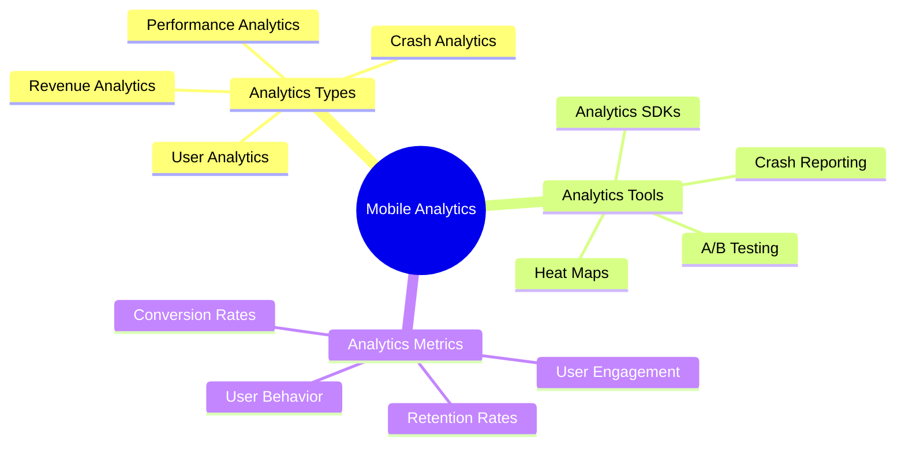

# Mobile App Analytics

[Back to Course Content](README.md) | [Previous: Performance](performance.md) | [Next: Mobile App Monetization →](monetization.md)

> Reference: This content is based on 11.pdf

## What is Mobile App Analytics?

Mobile app analytics is the process of collecting, measuring, and analyzing user behavior and app performance data to make data-driven decisions and improve the app experience. It helps understand user engagement, identify issues, and optimize app features.



## Analytics Implementation

### 1. User Analytics

```kotlin
// Example: Android User Analytics
class AnalyticsManager {
    private val firebaseAnalytics = FirebaseAnalytics.getInstance(context)
    
    fun trackUserEvent(eventName: String, params: Bundle) {
        firebaseAnalytics.logEvent(eventName, params)
    }
    
    fun trackScreenView(screenName: String) {
        val bundle = Bundle().apply {
            putString(FirebaseAnalytics.Param.SCREEN_NAME, screenName)
        }
        firebaseAnalytics.logEvent(FirebaseAnalytics.Event.SCREEN_VIEW, bundle)
    }
    
    fun trackUserAction(action: String, category: String) {
        val bundle = Bundle().apply {
            putString("action", action)
            putString("category", category)
        }
        firebaseAnalytics.logEvent("user_action", bundle)
    }
}
```

### 2. Performance Analytics

```swift
// Example: iOS Performance Analytics
class PerformanceAnalytics {
    private let analytics = Analytics.shared
    
    func trackAppLaunch() {
        let startTime = Date()
        analytics.logEvent("app_launch", parameters: [
            "start_time": startTime.timeIntervalSince1970,
            "device_model": UIDevice.current.model,
            "os_version": UIDevice.current.systemVersion
        ])
    }
    
    func trackNetworkRequest(url: String, duration: TimeInterval) {
        analytics.logEvent("network_request", parameters: [
            "url": url,
            "duration": duration,
            "timestamp": Date().timeIntervalSince1970
        ])
    }
    
    func trackMemoryUsage(usage: Int64) {
        analytics.logEvent("memory_usage", parameters: [
            "usage_mb": usage / 1024 / 1024,
            "timestamp": Date().timeIntervalSince1970
        ])
    }
}
```

## User Behavior Tracking

### 1. Session Tracking

```dart
// Example: Flutter Session Tracking
class SessionTracker {
  static final _instance = SessionTracker._internal();
  factory SessionTracker() => _instance;
  SessionTracker._internal();
  
  DateTime? _sessionStart;
  final _events = <AnalyticsEvent>[];
  
  void startSession() {
    _sessionStart = DateTime.now();
    _logEvent('session_start', {
      'timestamp': _sessionStart!.millisecondsSinceEpoch,
      'device_info': await getDeviceInfo(),
    });
  }
  
  void endSession() {
    if (_sessionStart == null) return;
    
    final duration = DateTime.now().difference(_sessionStart!);
    _logEvent('session_end', {
      'duration_seconds': duration.inSeconds,
      'event_count': _events.length,
    });
    
    _sessionStart = null;
    _events.clear();
  }
  
  void _logEvent(String name, Map<String, dynamic> params) {
    final event = AnalyticsEvent(name, params);
    _events.add(event);
    analytics.logEvent(name, params);
  }
}
```

### 2. Feature Usage Tracking

```kotlin
// Example: Android Feature Tracking
class FeatureTracker {
    fun trackFeatureUsage(featureName: String, action: String) {
        val bundle = Bundle().apply {
            putString("feature", featureName)
            putString("action", action)
            putLong("timestamp", System.currentTimeMillis())
        }
        FirebaseAnalytics.getInstance(context)
            .logEvent("feature_usage", bundle)
    }
    
    fun trackFeatureError(featureName: String, error: Exception) {
        val bundle = Bundle().apply {
            putString("feature", featureName)
            putString("error_type", error.javaClass.simpleName)
            putString("error_message", error.message)
        }
        FirebaseAnalytics.getInstance(context)
            .logEvent("feature_error", bundle)
    }
}
```

## A/B Testing

### 1. Feature Flag Testing

```swift
// Example: iOS A/B Testing
class FeatureFlagManager {
    private let remoteConfig = RemoteConfig.remoteConfig()
    
    func setupFeatureFlags() {
        let settings = RemoteConfigSettings()
        settings.minimumFetchInterval = 0
        
        remoteConfig.setConfigSettings(settings)
        remoteConfig.setDefaults([
            "show_new_ui": false as NSObject,
            "enable_feature_x": true as NSObject
        ])
        
        remoteConfig.fetch { status, error in
            if status == .success {
                self.remoteConfig.activate { error in
                    if let error = error {
                        print("Error activating config: \(error)")
                    }
                }
            }
        }
    }
    
    func isFeatureEnabled(_ feature: String) -> Bool {
        return remoteConfig.configValue(forKey: feature).boolValue
    }
}
```

### 2. UI Testing

```dart
// Example: Flutter A/B Testing
class ABTestManager {
  final _variants = <String, dynamic>{};
  
  Future<void> initialize() async {
    final config = await remoteConfig.fetch();
    _variants.addAll(config);
  }
  
  String getVariant(String testName) {
    return _variants[testName] ?? 'control';
  }
  
  void trackTestEvent(String testName, String variant, String event) {
    analytics.logEvent('ab_test_event', {
      'test_name': testName,
      'variant': variant,
      'event': event,
      'timestamp': DateTime.now().millisecondsSinceEpoch,
    });
  }
}
```

## Analytics Dashboard

### 1. Data Visualization

```kotlin
// Example: Android Analytics Dashboard
class AnalyticsDashboard {
    fun displayUserMetrics() {
        val metrics = listOf(
            Metric("DAU", getDailyActiveUsers()),
            Metric("MAU", getMonthlyActiveUsers()),
            Metric("Retention", getRetentionRate()),
            Metric("Conversion", getConversionRate())
        )
        
        metrics.forEach { metric ->
            updateMetricUI(metric)
        }
    }
    
    private fun updateMetricUI(metric: Metric) {
        // Update UI with metric data
        metricView.apply {
            setMetricName(metric.name)
            setMetricValue(metric.value)
            setMetricTrend(metric.trend)
        }
    }
}
```

### 2. Report Generation

```swift
// Example: iOS Analytics Report
class AnalyticsReport {
    func generateReport() -> Report {
        let report = Report()
        
        // User metrics
        report.dailyActiveUsers = getDailyActiveUsers()
        report.monthlyActiveUsers = getMonthlyActiveUsers()
        report.userRetention = calculateRetention()
        
        // Feature usage
        report.featureUsage = getFeatureUsage()
        report.userEngagement = calculateEngagement()
        
        // Performance metrics
        report.appPerformance = getPerformanceMetrics()
        report.crashReports = getCrashReports()
        
        return report
    }
    
    func exportReport(format: ReportFormat) {
        let report = generateReport()
        let exporter = ReportExporter(format: format)
        exporter.export(report)
    }
}
```

## Best Practices

1. **Data Collection**
   - Define clear metrics
   - Implement proper tracking
   - Ensure data accuracy
   - Respect user privacy

2. **Analysis**
   - Regular data review
   - Identify trends
   - Make data-driven decisions
   - Share insights

3. **Implementation**
   - Use reliable SDKs
   - Implement error handling
   - Optimize data usage
   - Test tracking

## Common Analytics Issues

1. **Data Collection**
   - Missing events
   - Duplicate events
   - Incorrect parameters
   - Privacy concerns

2. **Analysis Issues**
   - Data inconsistency
   - Sample bias
   - Correlation vs causation
   - Misinterpretation

3. **Implementation Issues**
   - SDK conflicts
   - Performance impact
   - Network usage
   - Battery drain

## Exercises

1. Implement user tracking
2. Set up A/B testing
3. Create analytics dashboard
4. Generate reports
5. Analyze user behavior

## Additional Resources

- [Firebase Analytics Guide](https://firebase.google.com/docs/analytics)
- [Google Analytics for Mobile](https://developers.google.com/analytics/devguides/collection/android/v4)
- [Mixpanel Mobile Analytics](https://developer.mixpanel.com/docs/android)
- [Mobile Analytics Best Practices](https://www.analyticsvidhya.com/blog/2017/02/mobile-analytics-guide/) 