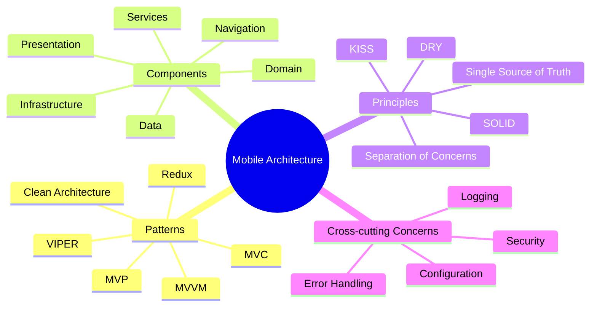

# Mobile App Architecture

[Back to Course Content](README.md) | [Previous: UI/UX Design](ui-ux-design.md) | [Next: Mobile App Development →](development.md)

> Reference: This content is based on 5.pdf and 6.pdf

## What is Mobile App Architecture?

Mobile app architecture defines the structure and organization of a mobile application, including its components, their relationships, and the principles that guide their design and evolution. A well-designed architecture ensures that the application is maintainable, scalable, testable, and performs efficiently across various devices and operating systems.

- **Maintainability**: Enables easy updates and bug fixes
- **Scalability**: Supports growth in features and user base
- **Testability**: Facilitates comprehensive testing
- **Performance**: Optimizes resource usage and responsiveness



## Architecture Patterns

### 1. MVVM (Model-View-ViewModel)

MVVM separates an application into three components: Model (data and business logic), View (UI elements), and ViewModel (mediator between Model and View). This pattern is particularly popular in Android and iOS development.

**Key Characteristics:**
- **Data Binding**: Connects View and ViewModel, reducing boilerplate code
- **Testability**: ViewModel can be tested independently of the UI
- **Separation of Concerns**: UI logic is separated from business logic

```kotlin
// Example: Android MVVM
class UserViewModel(private val userRepository: UserRepository) : ViewModel() {
    private val _user = MutableLiveData<User>()
    val user: LiveData<User> = _user
    
    private val _error = MutableLiveData<String>()
    val error: LiveData<String> = _error
    
    private val _loading = MutableLiveData<Boolean>()
    val loading: LiveData<Boolean> = _loading

    fun loadUser(userId: String) {
        _loading.value = true
        viewModelScope.launch {
            try {
                val result = userRepository.getUser(userId)
                _user.value = result
                _loading.value = false
            } catch (e: Exception) {
                _error.value = e.message
                _loading.value = false
            }
        }
    }
    
    fun updateUser(user: User) {
        _loading.value = true
        viewModelScope.launch {
            try {
                userRepository.updateUser(user)
                _user.value = user
                _loading.value = false
            } catch (e: Exception) {
                _error.value = e.message
                _loading.value = false
            }
        }
    }
}

class UserActivity : AppCompatActivity() {
    private val viewModel: UserViewModel by viewModels {
        UserViewModelFactory(UserRepository(ApiService.create()))
    }
    
    override fun onCreate(savedInstanceState: Bundle?) {
        super.onCreate(savedInstanceState)
        setContentView(R.layout.activity_user)
        
        viewModel.user.observe(this) { user ->
            // Update UI with user data
            nameTextView.text = user.name
            emailTextView.text = user.email
        }
        
        viewModel.loading.observe(this) { isLoading ->
            progressBar.visibility = if (isLoading) View.VISIBLE else View.GONE
        }
        
        viewModel.error.observe(this) { errorMessage ->
            Toast.makeText(this, errorMessage, Toast.LENGTH_LONG).show()
        }
        
        // Load user data
        viewModel.loadUser("current_user_id")
    }
}
```

### 2. Clean Architecture

Clean Architecture organizes code into concentric layers with dependencies pointing inward. The innermost layers contain business logic, while outer layers handle framework and UI concerns.

**Key Layers:**
- **Entities**: Enterprise-wide business rules
- **Use Cases**: Application-specific business rules
- **Interface Adapters**: Convert data between use cases and external formats
- **Frameworks & Drivers**: UI, databases, external interfaces

```dart
// Example: Flutter Clean Architecture

// Domain Layer: Entities
class User {
  final String id;
  final String name;
  final String email;
  
  User({required this.id, required this.name, required this.email});
}

// Domain Layer: Use Cases
class GetUserUseCase {
  final UserRepository repository;
  
  GetUserUseCase(this.repository);
  
  Future<User> execute(String id) {
    return repository.getUser(id);
  }
}

// Domain Layer: Repository Interface
abstract class UserRepository {
  Future<User> getUser(String id);
  Future<void> saveUser(User user);
}

// Data Layer: Repository Implementation
class UserRepositoryImpl implements UserRepository {
  final UserRemoteDataSource remoteDataSource;
  final UserLocalDataSource localDataSource;
  final NetworkInfo networkInfo;
  
  UserRepositoryImpl({
    required this.remoteDataSource,
    required this.localDataSource,
    required this.networkInfo,
  });
  
  @override
  Future<User> getUser(String id) async {
    if (await networkInfo.isConnected) {
      try {
        final remoteUser = await remoteDataSource.getUser(id);
        await localDataSource.cacheUser(remoteUser);
        return remoteUser;
      } catch (e) {
        return await localDataSource.getLastUser();
      }
    } else {
      return await localDataSource.getLastUser();
    }
  }
  
  @override
  Future<void> saveUser(User user) async {
    await remoteDataSource.saveUser(user);
    await localDataSource.cacheUser(user);
  }
}

// Presentation Layer: BLoC
class UserBloc extends Bloc<UserEvent, UserState> {
  final GetUserUseCase getUserUseCase;
  final SaveUserUseCase saveUserUseCase;
  
  UserBloc({
    required this.getUserUseCase,
    required this.saveUserUseCase,
  }) : super(UserInitial()) {
    on<LoadUser>(_onLoadUser);
    on<SaveUser>(_onSaveUser);
  }
  
  Future<void> _onLoadUser(LoadUser event, Emitter<UserState> emit) async {
    emit(UserLoading());
    try {
      final user = await getUserUseCase.execute(event.id);
      emit(UserLoaded(user));
    } catch (e) {
      emit(UserError(e.toString()));
    }
  }
  
  Future<void> _onSaveUser(SaveUser event, Emitter<UserState> emit) async {
    emit(UserLoading());
    try {
      await saveUserUseCase.execute(event.user);
      emit(UserSaved());
    } catch (e) {
      emit(UserError(e.toString()));
    }
  }
}
```

### 3. VIPER (View-Interactor-Presenter-Entity-Router)

VIPER is an application of Clean Architecture for iOS, breaking down the app into five components, each with a distinct responsibility.

**Components:**
- **View**: Displays data and captures user input
- **Interactor**: Contains business logic
- **Presenter**: Mediates between View and Interactor
- **Entity**: Contains basic model objects
- **Router**: Handles navigation between screens

```swift
// Example: iOS VIPER

// Entity
struct User {
    let id: String
    let name: String
    let email: String
}

// Interactor Protocol
protocol UserInteractorProtocol {
    func fetchUser(id: String, completion: @escaping (Result<User, Error>) -> Void)
    func updateUser(_ user: User, completion: @escaping (Result<Void, Error>) -> Void)
}

// Interactor Implementation
class UserInteractor: UserInteractorProtocol {
    private let userService: UserServiceProtocol
    
    init(userService: UserServiceProtocol) {
        self.userService = userService
    }
    
    func fetchUser(id: String, completion: @escaping (Result<User, Error>) -> Void) {
        userService.getUser(id: id, completion: completion)
    }
    
    func updateUser(_ user: User, completion: @escaping (Result<Void, Error>) -> Void) {
        userService.updateUser(user, completion: completion)
    }
}

// Presenter Protocol
protocol UserPresenterProtocol {
    func viewDidLoad()
    func loadUser(id: String)
    func updateUser(name: String, email: String)
}

// View Protocol
protocol UserViewProtocol: AnyObject {
    func displayUser(_ user: User)
    func displayError(_ error: Error)
    func showLoading(_ isLoading: Bool)
}

// Presenter Implementation
class UserPresenter: UserPresenterProtocol {
    weak var view: UserViewProtocol?
    private let interactor: UserInteractorProtocol
    private let router: UserRouterProtocol
    private var currentUser: User?
    
    init(interactor: UserInteractorProtocol, router: UserRouterProtocol) {
        self.interactor = interactor
        self.router = router
    }
    
    func viewDidLoad() {
        loadUser(id: "current")
    }
    
    func loadUser(id: String) {
        view?.showLoading(true)
        interactor.fetchUser(id: id) { [weak self] result in
            self?.view?.showLoading(false)
            switch result {
            case .success(let user):
                self?.currentUser = user
                self?.view?.displayUser(user)
            case .failure(let error):
                self?.view?.displayError(error)
            }
        }
    }
    
    func updateUser(name: String, email: String) {
        guard var user = currentUser else { return }
        
        user = User(id: user.id, name: name, email: email)
        view?.showLoading(true)
        
        interactor.updateUser(user) { [weak self] result in
            self?.view?.showLoading(false)
            switch result {
            case .success:
                self?.currentUser = user
                self?.view?.displayUser(user)
            case .failure(let error):
                self?.view?.displayError(error)
            }
        }
    }
}

// Router Protocol
protocol UserRouterProtocol {
    func navigateToUserDetails(for user: User)
    func navigateToSettings()
}

// Router Implementation
class UserRouter: UserRouterProtocol {
    weak var viewController: UIViewController?
    
    func navigateToUserDetails(for user: User) {
        let detailsVC = UserDetailsBuilder.build(with: user)
        viewController?.navigationController?.pushViewController(detailsVC, animated: true)
    }
    
    func navigateToSettings() {
        let settingsVC = SettingsBuilder.build()
        viewController?.navigationController?.pushViewController(settingsVC, animated: true)
    }
}

// View Implementation
class UserViewController: UIViewController, UserViewProtocol {
    var presenter: UserPresenterProtocol!
    
    // UI components
    private let nameLabel = UILabel()
    private let emailLabel = UILabel()
    private let loadingIndicator = UIActivityIndicatorView(style: .medium)
    
    override func viewDidLoad() {
        super.viewDidLoad()
        setupUI()
        presenter.viewDidLoad()
    }
    
    func displayUser(_ user: User) {
        nameLabel.text = user.name
        emailLabel.text = user.email
    }
    
    func displayError(_ error: Error) {
        let alert = UIAlertController(
            title: "Error",
            message: error.localizedDescription,
            preferredStyle: .alert
        )
        alert.addAction(UIAlertAction(title: "OK", style: .default))
        present(alert, animated: true)
    }
    
    func showLoading(_ isLoading: Bool) {
        if isLoading {
            loadingIndicator.startAnimating()
        } else {
            loadingIndicator.stopAnimating()
        }
    }
}
```

### 4. MVC (Model-View-Controller)

MVC is one of the oldest architectural patterns, dividing the application into three components:

**Components:**
- **Model**: Data and business logic
- **View**: UI elements and presentation
- **Controller**: Mediates between Model and View

```swift
// Example: iOS MVC

// Model
class UserModel {
    let id: String
    var name: String
    var email: String
    
    init(id: String, name: String, email: String) {
        self.id = id
        self.name = name
        self.email = email
    }
    
    static func fetch(id: String, completion: @escaping (Result<UserModel, Error>) -> Void) {
        // API call to fetch user data
        ApiClient.shared.getUser(id: id) { result in
            switch result {
            case .success(let userData):
                let user = UserModel(
                    id: userData["id"] as! String,
                    name: userData["name"] as! String,
                    email: userData["email"] as! String
                )
                completion(.success(user))
            case .failure(let error):
                completion(.failure(error))
            }
        }
    }
    
    func update(completion: @escaping (Result<Void, Error>) -> Void) {
        // API call to update user data
        ApiClient.shared.updateUser(id: id, name: name, email: email, completion: completion)
    }
}

// Controller
class UserViewController: UIViewController {
    // UI elements (View)
    @IBOutlet weak var nameLabel: UILabel!
    @IBOutlet weak var emailLabel: UILabel!
    @IBOutlet weak var loadingIndicator: UIActivityIndicatorView!
    
    // Model
    private var user: UserModel?
    
    override func viewDidLoad() {
        super.viewDidLoad()
        loadUser()
    }
    
    private func loadUser() {
        loadingIndicator.startAnimating()
        
        UserModel.fetch(id: "current") { [weak self] result in
            DispatchQueue.main.async {
                self?.loadingIndicator.stopAnimating()
                
                switch result {
                case .success(let user):
                    self?.user = user
                    self?.updateUI()
                case .failure(let error):
                    self?.showError(error)
                }
            }
        }
    }
    
    private func updateUI() {
        guard let user = user else { return }
        nameLabel.text = user.name
        emailLabel.text = user.email
    }
    
    private func showError(_ error: Error) {
        let alert = UIAlertController(
            title: "Error",
            message: error.localizedDescription,
            preferredStyle: .alert
        )
        alert.addAction(UIAlertAction(title: "OK", style: .default))
        present(alert, animated: true)
    }
    
    @IBAction func updateUserButtonTapped(_ sender: UIButton) {
        // Handle update user action
    }
}
```

### 5. Redux Pattern

Redux is a state management pattern with a single source of truth for application state, unidirectional data flow, and pure reducer functions.

**Core Concepts:**
- **Store**: Holds the application state
- **Actions**: Describe state changes
- **Reducers**: Pure functions that specify state transitions
- **Middleware**: Handles side effects

```dart
// Example: Flutter Redux

// State
class AppState {
  final UserState userState;
  
  AppState({required this.userState});
  
  factory AppState.initial() => AppState(
    userState: UserState.initial(),
  );
}

class UserState {
  final User? user;
  final bool isLoading;
  final String? error;
  
  UserState({this.user, this.isLoading = false, this.error});
  
  factory UserState.initial() => UserState();
  
  UserState copyWith({User? user, bool? isLoading, String? error}) {
    return UserState(
      user: user ?? this.user,
      isLoading: isLoading ?? this.isLoading,
      error: error,
    );
  }
}

// Actions
abstract class UserAction {}

class LoadUserAction extends UserAction {
    final String userId;
    LoadUserAction(this.userId);
}

class UserLoadedAction extends UserAction {
    final User user;
    UserLoadedAction(this.user);
}

class UserErrorAction extends UserAction {
    final String message;
    UserErrorAction(this.message);
}

// Reducer
UserState userReducer(UserState state, dynamic action) {
    if (action is LoadUserAction) {
        return state.copyWith(isLoading: true, error: null);
    } else if (action is UserLoadedAction) {
        return state.copyWith(user: action.user, isLoading: false);
    } else if (action is UserErrorAction) {
        return state.copyWith(error: action.message, isLoading: false);
    }
    return state;
}

// Middleware
void userMiddleware(Store<AppState> store, dynamic action, NextDispatcher next) async {
  next(action);
  
  if (action is LoadUserAction) {
    try {
      final userRepository = UserRepository();
      final user = await userRepository.getUser(action.userId);
      store.dispatch(UserLoadedAction(user));
    } catch (e) {
      store.dispatch(UserErrorAction(e.toString()));
    }
  }
}

// Store
final store = Store<AppState>(
    appReducer,
    initialState: AppState.initial(),
    middleware: [userMiddleware],
);

// App Reducer
AppState appReducer(AppState state, dynamic action) {
  return AppState(
    userState: userReducer(state.userState, action),
  );
}
```

## Component Design

### 1. Dependency Injection

Dependency Injection is a technique where an object receives its dependencies from external sources rather than creating them internally. This promotes loose coupling and testability.

**Types of Dependency Injection:**
- **Constructor Injection**: Dependencies provided through constructor
- **Method Injection**: Dependencies provided through setter methods
- **Field Injection**: Dependencies injected directly into fields

```dart
// Example: Flutter Dependency Injection with GetIt

// Service Locator
final getIt = GetIt.instance;

void setupDependencies() {
  // Register services as singletons
  getIt.registerSingleton<ApiClient>(ApiClient());
  getIt.registerSingleton<AppDatabase>(AppDatabase());
  
  // Register repositories
  getIt.registerFactory<UserRepository>(() => 
    UserRepositoryImpl(
      apiClient: getIt<ApiClient>(),
      database: getIt<AppDatabase>(),
    )
  );
  
  // Register use cases
  getIt.registerFactory<GetUserUseCase>(() => 
    GetUserUseCase(getIt<UserRepository>())
  );
  
  // Register view models or blocs
  getIt.registerFactory<UserBloc>(() => 
    UserBloc(getUserUseCase: getIt<GetUserUseCase>())
  );
}

void main() {
  setupDependencies();
  runApp(MyApp());
}

class MyApp extends StatelessWidget {
  @override
  Widget build(BuildContext context) {
    return MaterialApp(
      home: BlocProvider(
        create: (_) => getIt<UserBloc>(),
        child: UserScreen(),
      ),
    );
  }
}
```

### 2. Service Layer

The Service Layer is an abstraction over domain logic that defines the application's boundary with the external world and its available operations.

```kotlin
// Example: Android Service Layer

// Service interface
interface UserService {
    suspend fun getUser(id: String): Result<User>
    suspend fun updateUser(user: User): Result<Unit>
    suspend fun deleteUser(id: String): Result<Unit>
}

// Service implementation
class UserServiceImpl @Inject constructor(
    private val api: ApiService,
    private val userMapper: UserMapper,
    private val errorHandler: ErrorHandler
) : UserService {
    override suspend fun getUser(id: String): Result<User> {
        return try {
            val response = api.getUser(id)
            if (response.isSuccessful && response.body() != null) {
                Result.success(userMapper.mapToUser(response.body()!!))
            } else {
                Result.failure(errorHandler.handleApiError(response))
            }
        } catch (e: Exception) {
            Result.failure(errorHandler.handleException(e))
        }
    }
    
    override suspend fun updateUser(user: User): Result<Unit> {
        return try {
            val userDto = userMapper.mapToUserDto(user)
            val response = api.updateUser(user.id, userDto)
            if (response.isSuccessful) {
                Result.success(Unit)
            } else {
                Result.failure(errorHandler.handleApiError(response))
            }
        } catch (e: Exception) {
            Result.failure(errorHandler.handleException(e))
        }
    }
    
    override suspend fun deleteUser(id: String): Result<Unit> {
        return try {
            val response = api.deleteUser(id)
            if (response.isSuccessful) {
                Result.success(Unit)
            } else {
                Result.failure(errorHandler.handleApiError(response))
            }
        } catch (e: Exception) {
            Result.failure(errorHandler.handleException(e))
        }
    }
}

// Usage in a repository
class UserRepositoryImpl @Inject constructor(
    private val userService: UserService,
    private val userCache: UserCache
) : UserRepository {
    override suspend fun getUser(id: String): User {
        val cachedUser = userCache.getUser(id)
        if (cachedUser != null) {
            return cachedUser
        }
        
        val result = userService.getUser(id)
        if (result.isSuccess) {
            val user = result.getOrThrow()
            userCache.saveUser(user)
            return user
        } else {
            throw result.exceptionOrNull()!!
        }
    }
}
```

## State Management

### 1. BLoC Pattern

The BLoC (Business Logic Component) pattern separates business logic from UI, making code more maintainable and testable.

**Core Concepts:**
- **Events**: Input to the BLoC
- **States**: Output from the BLoC
- **Streams**: Asynchronous data flow between components

```dart
// Example: Flutter BLoC Pattern

// Events
abstract class CounterEvent {}

class IncrementEvent extends CounterEvent {}
class DecrementEvent extends CounterEvent {}
class ResetEvent extends CounterEvent {}

// States
class CounterState {
  final int count;
  
  CounterState(this.count);
}

// BLoC
class CounterBloc extends Bloc<CounterEvent, CounterState> {
    CounterBloc() : super(CounterState(0)) {
        on<IncrementEvent>((event, emit) {
            emit(CounterState(state.count + 1));
        });
        
        on<DecrementEvent>((event, emit) {
            emit(CounterState(state.count - 1));
        });
        
        on<ResetEvent>((event, emit) {
            emit(CounterState(0));
        });
    }
    
    @override
    Future<void> close() {
      // Clean up resources
      return super.close();
    }
}

// UI Component
class CounterPage extends StatelessWidget {
  @override
  Widget build(BuildContext context) {
    return BlocProvider(
      create: (context) => CounterBloc(),
      child: CounterView(),
    );
  }
}

class CounterView extends StatelessWidget {
  @override
  Widget build(BuildContext context) {
    return Scaffold(
      appBar: AppBar(title: Text('Counter')),
      body: Center(
        child: BlocBuilder<CounterBloc, CounterState>(
          builder: (context, state) {
            return Text(
              '${state.count}',
              style: TextStyle(fontSize: 24),
            );
          },
        ),
      ),
      floatingActionButton: Column(
        mainAxisAlignment: MainAxisAlignment.end,
        crossAxisAlignment: CrossAxisAlignment.end,
        children: [
          FloatingActionButton(
            child: Icon(Icons.add),
            onPressed: () {
              context.read<CounterBloc>().add(IncrementEvent());
            },
          ),
          SizedBox(height: 8),
          FloatingActionButton(
            child: Icon(Icons.remove),
            onPressed: () {
              context.read<CounterBloc>().add(DecrementEvent());
            },
          ),
          SizedBox(height: 8),
          FloatingActionButton(
            child: Icon(Icons.refresh),
            onPressed: () {
              context.read<CounterBloc>().add(ResetEvent());
            },
          ),
        ],
      ),
    );
  }
}
```

### 2. Provider Pattern

Provider is a state management solution for Flutter that uses InheritedWidget under the hood to make state accessible to child widgets.

```dart
// Example: Flutter Provider Pattern

// Model
class Counter with ChangeNotifier {
  int _count = 0;
  
  int get count => _count;
  
  void increment() {
    _count++;
    notifyListeners();
  }
  
  void decrement() {
    _count--;
    notifyListeners();
  }
  
  void reset() {
    _count = 0;
    notifyListeners();
  }
}

// UI with Provider
class CounterApp extends StatelessWidget {
  @override
  Widget build(BuildContext context) {
    return ChangeNotifierProvider(
      create: (_) => Counter(),
      child: MaterialApp(
        home: CounterScreen(),
      ),
    );
  }
}

class CounterScreen extends StatelessWidget {
  @override
  Widget build(BuildContext context) {
    return Scaffold(
      appBar: AppBar(
        title: Text('Counter App'),
      ),
      body: Center(
        child: Column(
          mainAxisAlignment: MainAxisAlignment.center,
          children: [
            Text('Count:'),
            Consumer<Counter>(
              builder: (context, counter, child) {
                return Text(
                  '${counter.count}',
                  style: TextStyle(fontSize: 24),
                );
              },
            ),
          ],
        ),
      ),
      floatingActionButton: Column(
        mainAxisAlignment: MainAxisAlignment.end,
        crossAxisAlignment: CrossAxisAlignment.end,
        children: [
          FloatingActionButton(
            child: Icon(Icons.add),
            onPressed: () {
              Provider.of<Counter>(context, listen: false).increment();
            },
          ),
          SizedBox(height: 8),
          FloatingActionButton(
            child: Icon(Icons.remove),
            onPressed: () {
              Provider.of<Counter>(context, listen: false).decrement();
            },
          ),
          SizedBox(height: 8),
          FloatingActionButton(
            child: Icon(Icons.refresh),
            onPressed: () {
              Provider.of<Counter>(context, listen: false).reset();
            },
          ),
        ],
      ),
    );
  }
}
```

## Data Flow

### 1. Repository Pattern

The Repository Pattern mediates between the domain and data mapping layers, isolating domain objects from details of data source access.

```swift
// Example: iOS Repository Pattern
protocol UserRepositoryProtocol {
    func getUser(id: String) async throws -> User
    func saveUser(_ user: User) async throws
    func deleteUser(id: String) async throws
}

class UserRepository: UserRepositoryProtocol {
    private let apiClient: ApiClient
    private let cache: UserCache
    
    init(apiClient: ApiClient, cache: UserCache) {
        self.apiClient = apiClient
        self.cache = cache
    }
    
    func getUser(id: String) async throws -> User {
        if let cachedUser = try? await cache.getUser(id) {
            return cachedUser
        }
        
        let user = try await apiClient.getUser(id)
        try? await cache.saveUser(user)
        return user
    }
    
    func saveUser(_ user: User) async throws {
        try await apiClient.saveUser(user)
        try? await cache.saveUser(user)
    }
    
    func deleteUser(id: String) async throws {
        try await apiClient.deleteUser(id)
        try await cache.deleteUser(id)
    }
}
```

### 2. Data Sources

Data Sources abstract the specific mechanisms for data access and persistence. They typically include remote (API) and local (database, cache) sources.

```kotlin
// Example: Android Data Sources
interface UserDataSource {
    suspend fun getUser(id: String): User
    suspend fun saveUser(user: User)
    suspend fun deleteUser(id: String)
}

class RemoteUserDataSource @Inject constructor(
    private val api: ApiService,
    private val errorHandler: ErrorHandler
) : UserDataSource {
    override suspend fun getUser(id: String): User {
        val response = api.getUser(id)
        if (response.isSuccessful && response.body() != null) {
            return mapToUser(response.body()!!)
        } else {
            throw errorHandler.handleApiError(response)
        }
    }
    
    override suspend fun saveUser(user: User) {
        val userDto = mapToUserDto(user)
        val response = api.updateUser(user.id, userDto)
        if (!response.isSuccessful) {
            throw errorHandler.handleApiError(response)
        }
    }
    
    override suspend fun deleteUser(id: String) {
        val response = api.deleteUser(id)
        if (!response.isSuccessful) {
            throw errorHandler.handleApiError(response)
        }
    }
    
    private fun mapToUser(userDto: UserDto): User {
        return User(
            id = userDto.id,
            name = userDto.name,
            email = userDto.email
        )
    }
    
    private fun mapToUserDto(user: User): UserDto {
        return UserDto(
            id = user.id,
            name = user.name,
            email = user.email
        )
    }
}

class LocalUserDataSource @Inject constructor(
    private val database: AppDatabase
) : UserDataSource {
    override suspend fun getUser(id: String): User {
        val userEntity = database.userDao().getUser(id) ?: throw UserNotFoundException()
        return mapToUser(userEntity)
    }
    
    override suspend fun saveUser(user: User) {
        val userEntity = mapToUserEntity(user)
        database.userDao().insertOrUpdateUser(userEntity)
    }
    
    override suspend fun deleteUser(id: String) {
        database.userDao().deleteUser(id)
    }
    
    private fun mapToUser(userEntity: UserEntity): User {
        return User(
            id = userEntity.id,
            name = userEntity.name,
            email = userEntity.email
        )
    }
    
    private fun mapToUserEntity(user: User): UserEntity {
        return UserEntity(
            id = user.id,
            name = user.name,
            email = user.email
        )
    }
}
```

## Navigation Architecture

### 1. Android Navigation Component

Android's Navigation Component provides a framework for implementing navigation in a type-safe way with a visual editor.

```kotlin
// Example: Android Navigation Component

// Navigation Graph (nav_graph.xml)
<navigation xmlns:android="http://schemas.android.com/apk/res/android"
    xmlns:app="http://schemas.android.com/apk/res-auto"
    android:id="@+id/nav_graph"
    app:startDestination="@id/homeFragment">

    <fragment
        android:id="@+id/homeFragment"
        android:name="com.example.app.HomeFragment"
        android:label="Home">
        <action
            android:id="@+id/action_home_to_details"
            app:destination="@id/detailsFragment" />
    </fragment>

    <fragment
        android:id="@+id/detailsFragment"
        android:name="com.example.app.DetailsFragment"
        android:label="Details">
        <argument
            android:name="itemId"
            app:argType="string" />
    </fragment>
</navigation>

// Navigation in Fragment
class HomeFragment : Fragment() {
    override fun onViewCreated(view: View, savedInstanceState: Bundle?) {
        super.onViewCreated(view, savedInstanceState)
        
        itemAdapter.setOnItemClickListener { item ->
            val action = HomeFragmentDirections.actionHomeToDetails(item.id)
            findNavController().navigate(action)
        }
    }
}
```

### 2. Coordinator Pattern (iOS)

The Coordinator Pattern manages navigation flow and dependencies between view controllers in iOS apps.

```swift
// Example: iOS Coordinator Pattern

protocol Coordinator: AnyObject {
    var childCoordinators: [Coordinator] { get set }
    var navigationController: UINavigationController { get set }
    
    func start()
}

class AppCoordinator: Coordinator {
    var childCoordinators = [Coordinator]()
    var navigationController: UINavigationController
    
    init(navigationController: UINavigationController) {
        self.navigationController = navigationController
    }
    
    func start() {
        goToMain()
    }
    
    func goToMain() {
        let mainCoordinator = MainCoordinator(navigationController: navigationController)
        childCoordinators.append(mainCoordinator)
        mainCoordinator.start()
    }
}

class MainCoordinator: Coordinator {
    var childCoordinators = [Coordinator]()
    var navigationController: UINavigationController
    
    init(navigationController: UINavigationController) {
        self.navigationController = navigationController
    }
    
    func start() {
        let viewController = HomeViewController()
        viewController.coordinator = self
        navigationController.pushViewController(viewController, animated: false)
    }
    
    func goToDetails(item: Item) {
        let viewController = DetailsViewController(item: item)
        viewController.coordinator = self
        navigationController.pushViewController(viewController, animated: true)
    }
    
    func goToSettings() {
        let viewController = SettingsViewController()
        viewController.coordinator = self
        navigationController.pushViewController(viewController, animated: true)
    }
}
```

## Best Practices

1. **Architecture**
   - Follow SOLID principles
   - Implement clean architecture with clear separation of concerns
   - Use dependency injection to decouple components
   - Establish clear communication patterns between layers
   - Design for testability from the start

2. **Code Organization**
   - Structure by feature rather than layer when applicable
   - Use clear naming conventions that reflect architecture
   - Implement proper interfaces for abstraction
   - Document architecture decisions and patterns
   - Standardize project structure across modules

3. **State Management**
   - Use a state management approach appropriate to the platform
   - Implement unidirectional data flow where possible
   - Centralize state to avoid inconsistencies
   - Handle side effects in appropriate middleware or services
   - Design state transitions to be predictable and testable

4. **Testing**
   - Write unit tests for business logic and domain layer
   - Implement integration tests for component interaction
   - Use test doubles (mocks, stubs) to isolate components
   - Maintain high test coverage for critical paths
   - Implement UI tests for key user flows

5. **Error Handling**
   - Implement consistent error handling strategy
   - Design for graceful degradation
   - Avoid silent failures, log and report errors
   - Present user-friendly error messages
   - Implement proper retry mechanisms

## Common Pitfalls

1. **Architecture Issues**
   - Tight coupling between components
   - Poor separation of concerns
   - Over-engineering for simple applications
   - Inconsistent architectural patterns
   - Mixing responsibilities across layers

2. **Implementation Issues**
   - Circular dependencies
   - Memory leaks from unmanaged resources
   - State management problems leading to inconsistencies
   - Poor error handling and recovery
   - Blocking the main thread with heavy operations

3. **Testing Issues**
   - Untestable code due to poor architecture
   - Missing test coverage for critical paths
   - Brittle tests that break with minor changes
   - Poor test organization and maintenance
   - UI tests that are slow and unreliable

4. **Navigation Issues**
   - Deep nesting leading to poor user experience
   - Memory leaks due to strong reference cycles
   - Poor state preservation during navigation
   - Inconsistent back navigation behavior
   - Navigation logic scattered throughout the codebase

5. **Data Flow Issues**
   - Multiple sources of truth leading to data inconsistencies
   - Inefficient data transformations between layers
   - Poor caching strategies
   - Excessive network calls
   - Inadequate handling of offline scenarios

## Exercises

1. Implement MVVM architecture for a simple task management app
2. Create a clean architecture structure for a weather forecast app
3. Set up dependency injection in an existing app
4. Implement the repository pattern for data access in a news app
5. Create a state management solution using BLoC or Redux
6. Build a navigation flow using the Coordinator pattern (iOS) or Navigation Component (Android)
7. Refactor an existing app to follow SOLID principles
8. Implement comprehensive unit testing for a core app module

## Additional Resources

- [Clean Architecture by Robert C. Martin](https://blog.cleancoder.com/uncle-bob/2012/08/13/the-clean-architecture.html)
- [MVVM Pattern in Android](https://developer.android.com/jetpack/guide)
- [VIPER Architecture for iOS](https://www.objc.io/issues/13-architecture/viper/)
- [Redux Documentation](https://redux.js.org/)
- [Flutter BLoC Library](https://bloclibrary.dev/)
- [Dependency Injection in Android](https://developer.android.com/training/dependency-injection)
- [Swift Package Manager](https://swift.org/package-manager/)
- [Android Architecture Components](https://developer.android.com/topic/libraries/architecture)
- [Navigation in SwiftUI](https://developer.apple.com/documentation/swiftui/navigation) 