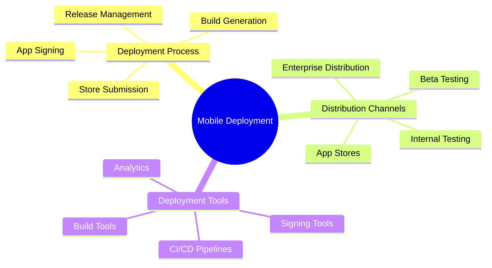

# Mobile App Deployment

[Back to Course Content](README.md) | [Previous: Testing](testing.md) | [Next: Mobile App Performance →](performance.md)

> Reference: This content is based on 11.pdf

## What is Mobile App Deployment?

Mobile app deployment is the process of preparing, packaging, and distributing mobile applications to app stores or other distribution channels. It involves building release versions, signing applications, and managing the release process.



## Build Process

### 1. Android Build Configuration

```gradle
// Example: Android Release Build
android {
    defaultConfig {
        applicationId "com.example.app"
        minSdkVersion 21
        targetSdkVersion 33
        versionCode 1
        versionName "1.0.0"
    }
    
    signingConfigs {
        release {
            storeFile file("keystore.jks")
            storePassword System.getenv("KEYSTORE_PASSWORD")
            keyAlias System.getenv("KEY_ALIAS")
            keyPassword System.getenv("KEY_PASSWORD")
        }
    }
    
    buildTypes {
        release {
            minifyEnabled true
            proguardFiles getDefaultProguardFile('proguard-android-optimize.txt'), 'proguard-rules.pro'
            signingConfig signingConfigs.release
        }
    }
}
```

### 2. iOS Build Configuration

```swift
// Example: iOS Release Configuration
let config = Configuration(
    name: "Release",
    buildSettings: [
        "PRODUCT_BUNDLE_IDENTIFIER": "com.example.app",
        "MARKETING_VERSION": "1.0.0",
        "CURRENT_PROJECT_VERSION": "1",
        "CODE_SIGN_STYLE": "Manual",
        "CODE_SIGN_IDENTITY": "iPhone Distribution",
        "PROVISIONING_PROFILE_SPECIFIER": "AppStore_Profile"
    ]
)
```

## App Signing

### 1. Android App Signing

```kotlin
// Example: Android App Signing
class SigningManager {
    fun signApp(apkFile: File, keystore: File) {
        val signer = ApkSigner.Builder(keystore)
            .setKeyAlias("release")
            .setKeyPassword("password")
            .setKeystorePassword("keystore_password")
            .build()
            
        signer.sign(apkFile)
    }
    
    fun verifySignature(apkFile: File) {
        val verifier = ApkVerifier.Builder(apkFile)
            .build()
            
        val result = verifier.verify()
        if (!result.isVerified) {
            throw SecurityException("APK signature verification failed")
        }
    }
}
```

### 2. iOS App Signing

```swift
// Example: iOS App Signing
class SigningManager {
    func signApp(bundlePath: String, identity: String) throws {
        let task = Process()
        task.launchPath = "/usr/bin/codesign"
        task.arguments = [
            "--force",
            "--sign", identity,
            "--entitlements", "App.entitlements",
            bundlePath
        ]
        
        try task.run()
        task.waitUntilExit()
        
        guard task.terminationStatus == 0 else {
            throw SigningError.signingFailed
        }
    }
    
    func verifySignature(bundlePath: String) throws {
        let task = Process()
        task.launchPath = "/usr/bin/codesign"
        task.arguments = ["--verify", "--deep", bundlePath]
        
        try task.run()
        task.waitUntilExit()
        
        guard task.terminationStatus == 0 else {
            throw SigningError.verificationFailed
        }
    }
}
```

## Store Submission

### 1. App Store Submission

```swift
// Example: iOS App Store Submission
class AppStoreSubmitter {
    func submitApp(bundlePath: String) async throws {
        // Validate app
        try await validateApp(bundlePath)
        
        // Upload to App Store Connect
        let uploader = AppStoreUploader()
        try await uploader.upload(
            bundlePath: bundlePath,
            apiKey: ProcessInfo.processInfo.environment["APP_STORE_API_KEY"]!
        )
        
        // Submit for review
        try await submitForReview()
    }
    
    private func validateApp(_ bundlePath: String) async throws {
        let validator = AppStoreValidator()
        let issues = try await validator.validate(bundlePath)
        
        guard issues.isEmpty else {
            throw ValidationError(issues: issues)
        }
    }
}
```

### 2. Play Store Submission

```kotlin
// Example: Android Play Store Submission
class PlayStoreSubmitter {
    suspend fun submitApp(bundlePath: String) {
        // Validate app bundle
        validateAppBundle(bundlePath)
        
        // Upload to Play Console
        val uploader = PlayStoreUploader()
        uploader.upload(
            bundlePath = bundlePath,
            apiKey = System.getenv("PLAY_STORE_API_KEY")
        )
        
        // Submit for review
        submitForReview()
    }
    
    private fun validateAppBundle(bundlePath: String) {
        val validator = BundleValidator()
        val issues = validator.validate(bundlePath)
        
        if (issues.isNotEmpty()) {
            throw ValidationException(issues)
        }
    }
}
```

## CI/CD Pipeline

### 1. GitHub Actions Workflow

```yaml
# Example: GitHub Actions Workflow
name: Mobile App CI/CD

on:
  push:
    branches: [ main ]
  pull_request:
    branches: [ main ]

jobs:
  build-and-test:
    runs-on: ubuntu-latest
    
    steps:
    - uses: actions/checkout@v2
    
    - name: Set up Flutter
      uses: subosito/flutter-action@v2
      with:
        flutter-version: '3.x'
        
    - name: Install dependencies
      run: flutter pub get
      
    - name: Run tests
      run: flutter test
      
    - name: Build Android
      run: flutter build apk --release
      
    - name: Build iOS
      run: flutter build ios --release
      
    - name: Deploy to App Store
      if: github.ref == 'refs/heads/main'
      run: |
        flutter build ipa
        fastlane deliver
      env:
        APP_STORE_API_KEY: ${{ secrets.APP_STORE_API_KEY }}
```

### 2. Jenkins Pipeline

```groovy
// Example: Jenkins Pipeline
pipeline {
    agent any
    
    environment {
        ANDROID_HOME = '/path/to/android/sdk'
        FLUTTER_HOME = '/path/to/flutter'
    }
    
    stages {
        stage('Checkout') {
            steps {
                checkout scm
            }
        }
        
        stage('Build') {
            steps {
                sh 'flutter pub get'
                sh 'flutter build apk --release'
                sh 'flutter build ios --release'
            }
        }
        
        stage('Test') {
            steps {
                sh 'flutter test'
            }
        }
        
        stage('Deploy') {
            when {
                branch 'main'
            }
            steps {
                sh 'fastlane deploy'
            }
        }
    }
}
```

## Release Management

### 1. Version Management

```kotlin
// Example: Android Version Management
class VersionManager {
    fun updateVersion(version: String, buildNumber: Int) {
        val buildGradle = File("app/build.gradle")
        val content = buildGradle.readText()
        
        val updatedContent = content
            .replace(
                "versionCode \\d+".toRegex(),
                "versionCode $buildNumber"
            )
            .replace(
                "versionName \"[^\"]+\"".toRegex(),
                "versionName \"$version\""
            )
            
        buildGradle.writeText(updatedContent)
    }
    
    fun generateChangelog(version: String): String {
        return """
            Version $version
            ---------------
            
            Features:
            - Added new feature 1
            - Added new feature 2
            
            Bug Fixes:
            - Fixed bug 1
            - Fixed bug 2
            
            Improvements:
            - Improved performance
            - Enhanced UI
        """.trimIndent()
    }
}
```

### 2. Release Notes

```swift
// Example: iOS Release Notes
struct ReleaseNotes {
    let version: String
    let buildNumber: Int
    let changes: [Change]
    
    struct Change {
        let type: ChangeType
        let description: String
    }
    
    enum ChangeType {
        case feature
        case bugfix
        case improvement
    }
    
    func generateNotes() -> String {
        var notes = "Version \(version) (\(buildNumber))\n\n"
        
        let groupedChanges = Dictionary(grouping: changes) { $0.type }
        
        for (type, changes) in groupedChanges {
            notes += "\(type.rawValue.capitalized):\n"
            for change in changes {
                notes += "- \(change.description)\n"
            }
            notes += "\n"
        }
        
        return notes
    }
}
```

## Best Practices

1. **Build Process**
   - Use CI/CD pipelines
   - Automate builds
   - Version management
   - Build optimization

2. **App Signing**
   - Secure key storage
   - Automated signing
   - Signature verification
   - Key rotation

3. **Store Submission**
   - Automated submission
   - Store compliance
   - Metadata management
   - Release scheduling

## Common Deployment Issues

1. **Build Issues**
   - Version conflicts
   - Dependency issues
   - Build failures
   - Size limitations

2. **Signing Issues**
   - Invalid certificates
   - Expired profiles
   - Key mismatches
   - Signature errors

3. **Store Issues**
   - Rejection reasons
   - Metadata errors
   - Compliance issues
   - Review delays

## Exercises

1. Set up CI/CD pipeline
2. Configure app signing
3. Prepare store submission
4. Manage release process
5. Handle deployment issues

## Additional Resources

- [Android App Publishing Guide](https://developer.android.com/studio/publish)
- [iOS App Store Guidelines](https://developer.apple.com/app-store/guidelines/)
- [Flutter Deployment Guide](https://flutter.dev/docs/deployment)
- [Mobile App Deployment Best Practices](https://developer.android.com/studio/publish/best-practices) 