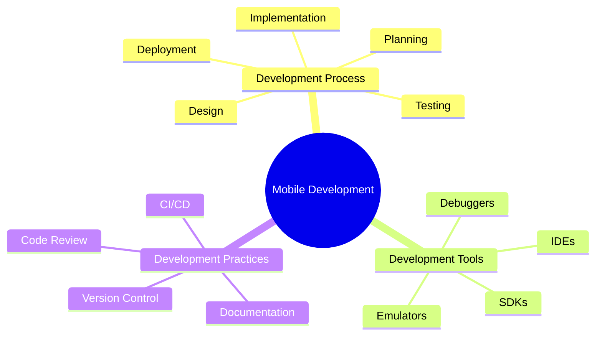

# Mobile App Development

[Back to Course Content](README.md) | [Previous: Architecture](architecture.md) | [Next: Mobile App Security →](security.md)

> Reference: This content is based on 7.pdf and 8.pdf

## What is Mobile App Development?

Mobile app development is the process of creating software applications for mobile devices, including smartphones and tablets. It involves writing code, testing functionality, and deploying applications to app stores.



## Development Lifecycle

### 1. Project Setup

```gradle
// Example: Android Project Setup
buildscript {
    repositories {
        google()
        mavenCentral()
    }
    dependencies {
        classpath 'com.android.tools.build:gradle:7.0.4'
        classpath 'org.jetbrains.kotlin:kotlin-gradle-plugin:1.6.10'
    }
}

allprojects {
    repositories {
        google()
        mavenCentral()
    }
}
```

### 2. Development Environment

```yaml
# Example: Flutter Development Environment
flutter:
  version: "2.10.0"
  environment:
    sdk: ">=2.12.0 <3.0.0"
  
  dependencies:
    flutter:
      sdk: flutter
    cupertino_icons: ^1.0.2
    http: ^0.13.0
    provider: ^6.0.0
```

## Code Organization

### 1. Project Structure

```plaintext
lib/
├── core/
│   ├── constants/
│   ├── errors/
│   └── utils/
├── data/
│   ├── datasources/
│   ├── models/
│   └── repositories/
├── domain/
│   ├── entities/
│   ├── repositories/
│   └── usecases/
├── presentation/
│   ├── bloc/
│   ├── pages/
│   └── widgets/
└── main.dart
```

### 2. Feature Organization

```kotlin
// Example: Android Feature Module
@Module
@InstallIn(SingletonComponent::class)
object UserModule {
    @Provides
    @Singleton
    fun provideUserRepository(
        api: ApiService,
        db: AppDatabase
    ): UserRepository {
        return UserRepositoryImpl(api, db)
    }
    
    @Provides
    @Singleton
    fun provideUserViewModel(
        repository: UserRepository
    ): UserViewModel {
        return UserViewModel(repository)
    }
}
```

## Testing Strategies

### 1. Unit Testing

```dart
// Example: Flutter Unit Test
void main() {
  group('UserRepository', () {
    late UserRepository repository;
    late MockApiClient mockApiClient;
    
    setUp(() {
      mockApiClient = MockApiClient();
      repository = UserRepository(mockApiClient);
    });
    
    test('getUser returns user when API call is successful', () async {
      // Arrange
      final user = User(id: '1', name: 'Test User');
      when(mockApiClient.getUser('1')).thenAnswer((_) async => user);
      
      // Act
      final result = await repository.getUser('1');
      
      // Assert
      expect(result, equals(user));
      verify(mockApiClient.getUser('1')).called(1);
    });
  });
}
```

### 2. Integration Testing

```swift
// Example: iOS Integration Test
class UserFlowTests: XCTestCase {
    var app: XCUIApplication!
    
    override func setUpWithError() throws {
        continueAfterFailure = false
        app = XCUIApplication()
        app.launch()
    }
    
    func testUserLoginFlow() throws {
        // Test login flow
        let usernameTextField = app.textFields["username"]
        usernameTextField.tap()
        usernameTextField.typeText("testuser")
        
        let passwordTextField = app.secureTextFields["password"]
        passwordTextField.tap()
        passwordTextField.typeText("password123")
        
        app.buttons["login"].tap()
        
        // Verify successful login
        XCTAssertTrue(app.staticTexts["Welcome"].exists)
    }
}
```

## Debugging Techniques

### 1. Logging

```kotlin
// Example: Android Logging
class Logger {
    companion object {
        private const val TAG = "AppLogger"
        
        fun d(message: String) {
            if (BuildConfig.DEBUG) {
                Log.d(TAG, message)
            }
        }
        
        fun e(message: String, throwable: Throwable? = null) {
            Log.e(TAG, message, throwable)
        }
    }
}
```

### 2. Debug Tools

```dart
// Example: Flutter Debug Tools
void main() {
  runApp(
    ProviderScope(
      child: MyApp(),
    ),
  );
}

class MyApp extends StatelessWidget {
  @override
  Widget build(BuildContext context) {
    return MaterialApp(
      home: Scaffold(
        body: Builder(
          builder: (context) {
            // Enable debug tools
            debugPrintRebuildDirtyWidgets = true;
            return MyHomePage();
          },
        ),
      ),
    );
  }
}
```

## Development Best Practices

### 1. Code Style

```dart
// Example: Flutter Code Style
class UserService {
  // Use meaningful variable names
  final String _apiBaseUrl;
  final Duration _timeout;
  
  // Document public methods
  /// Fetches user data from the API
  /// Returns [User] if successful, throws [ApiException] otherwise
  Future<User> getUser(String id) async {
    try {
      final response = await _api.get('/users/$id');
      return User.fromJson(response.data);
    } catch (e) {
      throw ApiException('Failed to fetch user: $e');
    }
  }
}
```

### 2. Error Handling

```swift
// Example: iOS Error Handling
enum AppError: Error {
    case networkError(String)
    case invalidData(String)
    case unauthorized
    case unknown
    
    var localizedDescription: String {
        switch self {
        case .networkError(let message):
            return "Network error: \(message)"
        case .invalidData(let message):
            return "Invalid data: \(message)"
        case .unauthorized:
            return "Unauthorized access"
        case .unknown:
            return "An unknown error occurred"
        }
    }
}

class ApiClient {
    func handleError(_ error: Error) -> AppError {
        switch error {
        case let error as URLError:
            return .networkError(error.localizedDescription)
        case let error as DecodingError:
            return .invalidData(error.localizedDescription)
        default:
            return .unknown
        }
    }
}
```

## Common Development Issues

### 1. Memory Management

```kotlin
// Example: Android Memory Management
class ImageLoader {
    private val memoryCache = LruCache<String, Bitmap>(
        (Runtime.getRuntime().maxMemory() / 1024 / 8).toInt()
    )
    
    fun loadImage(url: String, imageView: ImageView) {
        if (memoryCache.get(url) != null) {
            imageView.setImageBitmap(memoryCache.get(url))
            return
        }
        
        lifecycleScope.launch {
            val bitmap = withContext(Dispatchers.IO) {
                downloadImage(url)
            }
            memoryCache.put(url, bitmap)
            imageView.setImageBitmap(bitmap)
        }
    }
}
```

### 2. Performance Optimization

```dart
// Example: Flutter Performance Optimization
class OptimizedListView extends StatelessWidget {
  @override
  Widget build(BuildContext context) {
    return ListView.builder(
      itemCount: items.length,
      // Use const for static widgets
      itemBuilder: (context, index) => const ListItem(),
      // Add cache extent for better scrolling
      cacheExtent: 1000,
      // Use addAutomaticKeepAlives for frequently accessed items
      addAutomaticKeepAlives: true,
    );
  }
}
```

## Best Practices

1. **Development**
   - Follow coding standards
   - Write clean, maintainable code
   - Use appropriate design patterns
   - Implement proper error handling

2. **Testing**
   - Write comprehensive tests
   - Use test-driven development
   - Implement continuous integration
   - Perform regular code reviews

3. **Performance**
   - Optimize app size
   - Minimize memory usage
   - Improve load times
   - Handle background tasks

## Common Pitfalls

1. **Development Issues**
   - Poor code organization
   - Inconsistent coding style
   - Missing documentation
   - Inefficient algorithms

2. **Testing Issues**
   - Incomplete test coverage
   - Brittle tests
   - Missing edge cases
   - Poor test organization

3. **Performance Issues**
   - Memory leaks
   - Slow rendering
   - Battery drain
   - Network inefficiency

## Exercises

1. Set up development environment
2. Create project structure
3. Implement basic features
4. Write unit tests
5. Optimize performance

## Additional Resources

- [Android Developer Guide](https://developer.android.com/guide)
- [iOS Developer Guide](https://developer.apple.com/guide/)
- [Flutter Documentation](https://flutter.dev/docs)
- [Mobile Development Best Practices](https://developer.android.com/topic/performance) 